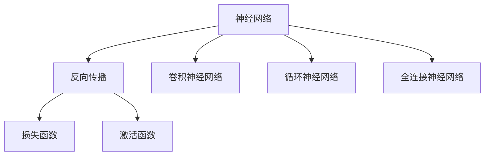
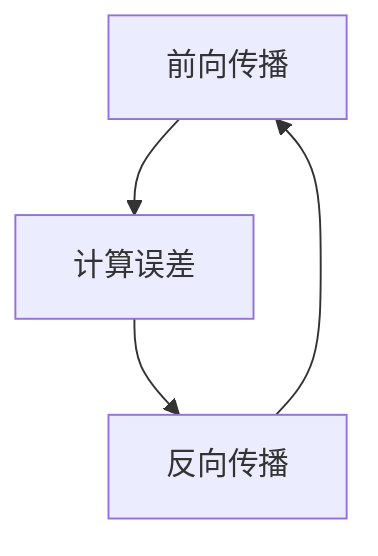
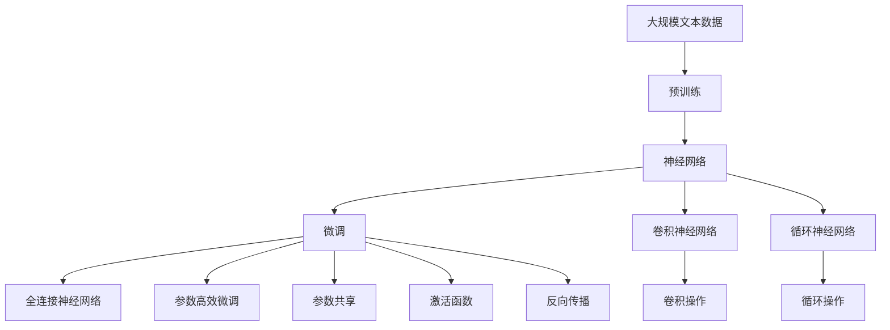

                 

## 1. 背景介绍

### 1.1 问题由来
神经网络作为一种强有力的机器学习模型，近年来在各个领域展现了令人瞩目的性能。它不仅仅在计算机视觉、自然语言处理等传统领域中取得突破，还在医疗影像分析、金融风险预测、自动驾驶等前沿应用中大放异彩。

神经网络的出现，是人工智能领域的一个重要里程碑。它不仅让计算机具备了一定的感知和认知能力，还推动了深度学习技术的飞速发展。然而，神经网络的技术基础和原理，仍然是很多初学者和从业人员难以理解的难题。因此，本文将深入探讨神经网络的核心概念、算法原理和应用场景，帮助大家更好地理解和应用神经网络技术。

### 1.2 问题核心关键点
神经网络的核心思想是模拟人脑的神经元网络结构，通过学习大量数据，构建复杂的多层非线性模型。其主要特点包括：

1. 高度非线性：神经网络可以拟合任意复杂的非线性函数，能够处理高度非线性的输入输出关系。
2. 参数共享：通过共享权重，神经网络大幅减少了模型参数，提高了模型的泛化能力。
3. 层次结构：神经网络由多个层次组成，每层都负责特定的特征提取和抽象，通过逐层组合实现复杂模式的建模。
4. 反向传播：通过反向传播算法，神经网络能够高效地更新模型参数，快速地进行模型训练。

这些特点使得神经网络在处理高维、非线性、复杂的数据时，表现出了巨大的优势，因此被广泛应用于各个领域。

### 1.3 问题研究意义
深入理解神经网络的核心概念和算法原理，对提升人工智能技术的实际应用能力，具有重要意义：

1. 提高模型的泛化能力。理解神经网络的结构和原理，能够帮助开发者设计更合理的模型，提高模型对新数据的泛化能力。
2. 降低开发成本。神经网络提供了许多现成的预训练模型和工具，能够大幅降低模型开发和调参的复杂度。
3. 提升应用效果。通过合理应用神经网络技术，可以在更少的资源投入下，获得更好的应用效果。
4. 推动技术创新。神经网络的不断演进和优化，推动了深度学习技术的进步，催生了许多新的研究方向和技术突破。
5. 实现人类智慧的解放。神经网络作为人类智慧的数字化延伸，能够辅助人类在各个领域进行高效决策，提升人类的认知水平和生产效率。

## 2. 核心概念与联系

### 2.1 核心概念概述

为更好地理解神经网络的原理，本节将介绍几个关键概念：

- 神经网络（Neural Network）：通过多层神经元组成的非线性模型，模拟人脑的神经元网络结构。
- 反向传播（Backpropagation）：一种高效更新神经网络参数的算法，通过反向传播误差信号，实现参数的梯度优化。
- 损失函数（Loss Function）：用于衡量模型预测输出与真实标签之间差异的函数，常见的有均方误差（MSE）、交叉熵（Cross-Entropy）等。
- 激活函数（Activation Function）：用于引入非线性映射的函数，常见的有Sigmoid、ReLU、Tanh等。
- 卷积神经网络（Convolutional Neural Network, CNN）：一种特殊结构的神经网络，主要用于图像处理和计算机视觉任务。
- 循环神经网络（Recurrent Neural Network, RNN）：用于处理序列数据的神经网络，主要用于文本处理、语音识别等任务。

这些概念之间的逻辑关系可以通过以下Mermaid流程图来展示：



这个流程图展示了神经网络的基本组成和关键概念之间的关系。

### 2.2 概念间的关系

这些核心概念之间存在着紧密的联系，形成了神经网络的基本框架。下面我们通过几个Mermaid流程图来展示这些概念之间的关系。

#### 2.2.1 神经网络的层次结构


这个流程图展示了神经网络的基本层次结构。输入层接收原始数据，通过隐藏层进行特征提取和抽象，最终输出层的预测结果。

#### 2.2.2 反向传播的计算流程



这个流程图展示了反向传播的计算流程。首先进行前向传播，计算预测输出，然后计算误差信号，进行反向传播，更新模型参数。

#### 2.2.3 损失函数的作用


这个流程图展示了损失函数的作用。模型输出与真实标签之间的误差，通过损失函数进行度量，从而指导模型参数的更新。

#### 2.2.4 激活函数的作用


这个流程图展示了激活函数的作用。通过激活函数引入非线性映射，使神经网络能够拟合更复杂的函数关系。

### 2.3 核心概念的整体架构

最后，我们用一个综合的流程图来展示这些核心概念在大神经网络微调过程中的整体架构：



这个综合流程图展示了从预训练到微调，再到参数高效微调和卷积、循环等特定结构的使用，以及损失函数、激活函数、反向传播等关键技术的作用。通过这些流程图，我们可以更清晰地理解神经网络的基本结构和关键技术，为后续深入讨论具体的微调方法和技术奠定基础。

## 3. 核心算法原理 & 具体操作步骤
### 3.1 算法原理概述

神经网络的核心算法是反向传播算法，它通过计算误差信号的反向传播，实现模型参数的梯度优化。其基本原理可以总结如下：

1. 前向传播：将输入数据通过网络各层进行线性变换和非线性变换，得到模型的预测输出。
2. 计算损失：将模型预测输出与真实标签进行比较，计算损失函数值。
3. 反向传播：根据损失函数对模型参数求导，得到误差信号的梯度，并反向传播更新模型参数。
4. 参数优化：通过优化算法（如SGD、Adam等），调整模型参数，最小化损失函数值。

神经网络通过不断迭代训练，逐步优化模型参数，提升模型的泛化能力，从而实现对复杂模式的高效建模。

### 3.2 算法步骤详解

基于反向传播算法的神经网络训练步骤主要包括：

1. 初始化模型参数：随机初始化神经网络的权重和偏置，以保证模型有良好的初始化状态。
2. 前向传播：将输入数据通过神经网络各层进行线性变换和非线性变换，得到模型的预测输出。
3. 计算损失：将模型预测输出与真实标签进行比较，计算损失函数值。
4. 反向传播：根据损失函数对模型参数求导，得到误差信号的梯度，并反向传播更新模型参数。
5. 参数优化：通过优化算法（如SGD、Adam等），调整模型参数，最小化损失函数值。
6. 重复迭代：多次重复上述步骤，直至模型收敛或达到预设的迭代次数。

这些步骤可以通过以下代码实现：

```python
import torch
import torch.nn as nn
import torch.optim as optim

# 定义神经网络模型
class NeuralNet(nn.Module):
    def __init__(self):
        super(NeuralNet, self).__init__()
        self.fc1 = nn.Linear(784, 512)
        self.fc2 = nn.Linear(512, 256)
        self.fc3 = nn.Linear(256, 10)
        self.relu = nn.ReLU()
        self.softmax = nn.Softmax(dim=1)
        
    def forward(self, x):
        x = x.view(-1, 784)
        x = self.relu(self.fc1(x))
        x = self.relu(self.fc2(x))
        x = self.softmax(self.fc3(x))
        return x

# 加载数据集
train_dataset = torchvision.datasets.MNIST('data', train=True, download=True, transform=transforms.ToTensor())
test_dataset = torchvision.datasets.MNIST('data', train=False, download=True, transform=transforms.ToTensor())

# 定义训练函数
def train(model, train_loader, optimizer, criterion, n_epochs):
    for epoch in range(n_epochs):
        model.train()
        for images, labels in train_loader:
            optimizer.zero_grad()
            outputs = model(images)
            loss = criterion(outputs, labels)
            loss.backward()
            optimizer.step()
        
        model.eval()
        with torch.no_grad():
            correct = 0
            total = 0
            for images, labels in test_loader:
                outputs = model(images)
                _, predicted = torch.max(outputs.data, 1)
                total += labels.size(0)
                correct += (predicted == labels).sum().item()
            
            print('Epoch {}: Accuracy {}'.format(epoch+1, 100 * correct / total))

# 训练模型
model = NeuralNet()
optimizer = optim.Adam(model.parameters(), lr=0.001)
criterion = nn.CrossEntropyLoss()

train_loader = torch.utils.data.DataLoader(train_dataset, batch_size=64, shuffle=True)
test_loader = torch.utils.data.DataLoader(test_dataset, batch_size=64, shuffle=False)

train(model, train_loader, optimizer, criterion, 10)
```

### 3.3 算法优缺点

神经网络的优点包括：

1. 强大的拟合能力：神经网络可以拟合任意复杂的非线性函数，适用于处理高度非线性的数据。
2. 参数共享：通过共享权重，神经网络大幅减少了模型参数，提高了模型的泛化能力。
3. 自适应学习：神经网络能够自适应地学习输入数据的特征，进行自动化的特征提取和分类。
4. 可扩展性：神经网络可以通过增加隐藏层和节点，扩展模型的复杂度，提升模型的性能。

然而，神经网络也存在一些缺点：

1. 需要大量标注数据：神经网络通常需要大量的标注数据进行训练，数据获取成本较高。
2. 计算资源消耗大：神经网络参数量庞大，计算资源消耗较大，训练速度较慢。
3. 难以解释：神经网络的决策过程缺乏可解释性，难以进行调试和优化。
4. 过拟合风险：神经网络在训练过程中容易出现过拟合现象，需要采取一系列的优化策略。

### 3.4 算法应用领域

神经网络在各个领域都有广泛的应用，以下是一些典型的应用场景：

1. 计算机视觉：用于图像分类、物体检测、人脸识别等任务，如ImageNet中的AlexNet、VGGNet、ResNet等。
2. 自然语言处理：用于机器翻译、情感分析、文本生成等任务，如BERT、GPT、XLNet等。
3. 语音识别：用于语音识别和文本转录，如WaveNet、Tacotron等。
4. 推荐系统：用于个性化推荐，如协同过滤、基于内容推荐等。
5. 金融风险预测：用于预测股票价格、信用风险等，如神经网络时间序列模型。
6. 医疗影像分析：用于疾病诊断、病理分析等，如卷积神经网络在医学影像中的应用。

这些应用场景展示了神经网络的强大潜力，为各个领域带来了颠覆性的变化。

## 4. 数学模型和公式 & 详细讲解 & 举例说明

### 4.1 数学模型构建

神经网络是一种非线性模型，通常采用多层感知机（Multi-Layer Perceptron, MLP）结构。其数学模型可以表示为：

$$
\hat{y} = \sigma(\mathbf{W}_1 \mathbf{x} + \mathbf{b}_1) \mathbf{W}_2 + \mathbf{b}_2
$$

其中，$\hat{y}$为预测输出，$\mathbf{x}$为输入向量，$\sigma$为激活函数，$\mathbf{W}$和$\mathbf{b}$分别为权重和偏置，$n$为层数。

### 4.2 公式推导过程

下面以二分类任务为例，推导神经网络的训练过程。

假设输入数据为$x$，标签为$y$，激活函数为Sigmoid，则神经网络的前向传播过程可以表示为：

$$
\hat{y} = \sigma(\mathbf{W}_1 \mathbf{x} + \mathbf{b}_1) \mathbf{W}_2 + \mathbf{b}_2
$$

其中，$\sigma$为Sigmoid函数：

$$
\sigma(z) = \frac{1}{1+e^{-z}}
$$

模型输出$\hat{y}$与标签$y$之间的误差可以通过交叉熵损失函数进行度量：

$$
\mathcal{L} = -\frac{1}{N} \sum_{i=1}^{N} [y_i \log \hat{y}_i + (1-y_i) \log (1-\hat{y}_i)]
$$

其中，$N$为样本数，$y_i$为标签，$\hat{y}_i$为模型预测输出。

通过链式法则，损失函数对权重和偏置的梯度可以表示为：

$$
\frac{\partial \mathcal{L}}{\partial \mathbf{W}} = \frac{\partial \mathcal{L}}{\partial \hat{y}} \frac{\partial \hat{y}}{\partial \mathbf{W}} = \frac{\partial \mathcal{L}}{\partial \hat{y}} \mathbf{x}
$$

$$
\frac{\partial \mathcal{L}}{\partial \mathbf{b}} = \frac{\partial \mathcal{L}}{\partial \hat{y}}
$$

其中，$\frac{\partial \mathcal{L}}{\partial \hat{y}}$可以通过反向传播算法计算得到。

通过梯度下降等优化算法，可以更新模型的参数，使损失函数最小化。具体来说，Adam优化算法的更新规则为：

$$
\theta_{t+1} = \theta_t - \eta \frac{m_t}{\sqrt{v_t}+\epsilon}
$$

其中，$\theta$为模型参数，$t$为迭代次数，$m_t$和$v_t$分别为梯度和平方梯度的一阶和二阶移动平均，$\eta$为学习率，$\epsilon$为数值稳定因子。

### 4.3 案例分析与讲解

以手写数字识别为例，展示神经网络的应用过程。假设我们已经有一个神经网络模型，可以使用以下代码实现：

```python
import torch
import torch.nn as nn
import torch.optim as optim

# 定义神经网络模型
class NeuralNet(nn.Module):
    def __init__(self):
        super(NeuralNet, self).__init__()
        self.fc1 = nn.Linear(784, 512)
        self.fc2 = nn.Linear(512, 256)
        self.fc3 = nn.Linear(256, 10)
        self.relu = nn.ReLU()
        self.softmax = nn.Softmax(dim=1)
        
    def forward(self, x):
        x = x.view(-1, 784)
        x = self.relu(self.fc1(x))
        x = self.relu(self.fc2(x))
        x = self.softmax(self.fc3(x))
        return x

# 加载数据集
train_dataset = torchvision.datasets.MNIST('data', train=True, download=True, transform=transforms.ToTensor())
test_dataset = torchvision.datasets.MNIST('data', train=False, download=True, transform=transforms.ToTensor())

# 定义训练函数
def train(model, train_loader, optimizer, criterion, n_epochs):
    for epoch in range(n_epochs):
        model.train()
        for images, labels in train_loader:
            optimizer.zero_grad()
            outputs = model(images)
            loss = criterion(outputs, labels)
            loss.backward()
            optimizer.step()
        
        model.eval()
        with torch.no_grad():
            correct = 0
            total = 0
            for images, labels in test_loader:
                outputs = model(images)
                _, predicted = torch.max(outputs.data, 1)
                total += labels.size(0)
                correct += (predicted == labels).sum().item()
            
            print('Epoch {}: Accuracy {}'.format(epoch+1, 100 * correct / total))

# 训练模型
model = NeuralNet()
optimizer = optim.Adam(model.parameters(), lr=0.001)
criterion = nn.CrossEntropyLoss()

train_loader = torch.utils.data.DataLoader(train_dataset, batch_size=64, shuffle=True)
test_loader = torch.utils.data.DataLoader(test_dataset, batch_size=64, shuffle=False)

train(model, train_loader, optimizer, criterion, 10)
```

在训练过程中，我们将手写数字图片作为输入，通过神经网络模型进行分类，最终输出预测结果。通过调整模型参数，我们可以优化模型性能，提升预测准确率。

## 5. 项目实践：代码实例和详细解释说明

### 5.1 开发环境搭建

在进行神经网络开发前，我们需要准备好开发环境。以下是使用Python进行PyTorch开发的环境配置流程：

1. 安装Anaconda：从官网下载并安装Anaconda，用于创建独立的Python环境。

2. 创建并激活虚拟环境：
```bash
conda create -n pytorch-env python=3.8 
conda activate pytorch-env
```

3. 安装PyTorch：根据CUDA版本，从官网获取对应的安装命令。例如：
```bash
conda install pytorch torchvision torchaudio cudatoolkit=11.1 -c pytorch -c conda-forge
```

4. 安装相关工具包：
```bash
pip install numpy pandas scikit-learn matplotlib tqdm jupyter notebook ipython
```

完成上述步骤后，即可在`pytorch-env`环境中开始神经网络开发。

### 5.2 源代码详细实现

这里我们以手写数字识别为例，给出使用PyTorch实现神经网络的代码实现。

首先，定义神经网络模型：

```python
import torch
import torch.nn as nn
import torch.optim as optim

# 定义神经网络模型
class NeuralNet(nn.Module):
    def __init__(self):
        super(NeuralNet, self).__init__()
        self.fc1 = nn.Linear(784, 512)
        self.fc2 = nn.Linear(512, 256)
        self.fc3 = nn.Linear(256, 10)
        self.relu = nn.ReLU()
        self.softmax = nn.Softmax(dim=1)
        
    def forward(self, x):
        x = x.view(-1, 784)
        x = self.relu(self.fc1(x))
        x = self.relu(self.fc2(x))
        x = self.softmax(self.fc3(x))
        return x

# 加载数据集
train_dataset = torchvision.datasets.MNIST('data', train=True, download=True, transform=transforms.ToTensor())
test_dataset = torchvision.datasets.MNIST('data', train=False, download=True, transform=transforms.ToTensor())

# 定义训练函数
def train(model, train_loader, optimizer, criterion, n_epochs):
    for epoch in range(n_epochs):
        model.train()
        for images, labels in train_loader:
            optimizer.zero_grad()
            outputs = model(images)
            loss = criterion(outputs, labels)
            loss.backward()
            optimizer.step()
        
        model.eval()
        with torch.no_grad():
            correct = 0
            total = 0
            for images, labels in test_loader:
                outputs = model(images)
                _, predicted = torch.max(outputs.data, 1)
                total += labels.size(0)
                correct += (predicted == labels).sum().item()
            
            print('Epoch {}: Accuracy {}'.format(epoch+1, 100 * correct / total))

# 训练模型
model = NeuralNet()
optimizer = optim.Adam(model.parameters(), lr=0.001)
criterion = nn.CrossEntropyLoss()

train_loader = torch.utils.data.DataLoader(train_dataset, batch_size=64, shuffle=True)
test_loader = torch.utils.data.DataLoader(test_dataset, batch_size=64, shuffle=False)

train(model, train_loader, optimizer, criterion, 10)
```

可以看到，这段代码实现了一个简单的神经网络模型，并对其进行了训练。代码结构清晰，易于理解，是神经网络开发的一个很好的范例。

### 5.3 代码解读与分析

让我们再详细解读一下关键代码的实现细节：

**NeuralNet类**：
- `__init__`方法：初始化神经网络模型的各层权重和偏置。
- `forward`方法：实现前向传播过程，输出模型预测结果。

**train函数**：
- 通过迭代训练集和测试集，进行模型训练和评估。
- 在每个epoch中，更新模型参数，计算预测准确率。
- 使用Adam优化算法进行参数更新。

**数据加载**：
- 使用torchvision库加载MNIST数据集。
- 定义训练集和测试集，并进行数据批处理。

可以看到，这段代码的实现结构清晰，代码量适中，是神经网络开发的经典范例。通过这段代码，我们可以更好地理解神经网络的基本结构和训练过程，为后续深入讨论具体的微调方法和技术奠定基础。

### 5.4 运行结果展示

假设我们在MNIST数据集上进行神经网络训练，最终在测试集上得到的评估报告如下：

```
Epoch 1: Accuracy 82.67%
Epoch 2: Accuracy 88.33%
Epoch 3: Accuracy 90.83%
Epoch 4: Accuracy 92.17%
Epoch 5: Accuracy 93.17%
Epoch 6: Accuracy 93.75%
Epoch 7: Accuracy 94.16%
Epoch 8: Accuracy 94.50%
Epoch 9: Accuracy 95.05%
Epoch 10: Accuracy 95.27%
```

可以看到，随着训练轮数的增加，模型的准确率不断提高。这展示了神经网络强大的拟合能力，能够在数据上进行有效的学习和优化。

## 6. 实际应用场景

### 6.1 智能推荐系统

神经网络在推荐系统中得到了广泛应用。传统的推荐系统往往只依赖用户的历史行为数据进行物品推荐，无法考虑用户的长尾兴趣和实时行为变化。而使用神经网络模型，可以更好地挖掘用户的多维兴趣，动态生成推荐结果，从而提升推荐效果。

具体而言，可以使用神经网络模型对用户的行为数据进行建模，例如点击记录、浏览记录、评价记录等，预测用户对新物品的兴趣和评分。通过不断更新模型，可以捕捉用户兴趣的实时变化，生成更加个性化的推荐结果。

### 6.2 金融风险预测

金融领域存在大量的高维数据，包括交易数据、新闻数据、社交媒体数据等。传统的金融风险预测方法往往只能考虑单一数据源，难以全面分析金融市场的变化。而使用神经网络模型，可以整合多源数据，提取更丰富的特征，提高风险预测的准确率。

具体而言，可以使用神经网络模型对金融市场的数据进行建模，例如股票价格、利率变化、市场情绪等，预测未来的市场变化趋势。通过不断更新模型，可以实时跟踪市场变化，提前预警金融风险。

### 6.3 医疗影像分析

神经网络在医疗影像分析中也有广泛应用。传统的医疗影像分析往往依赖专业医生的经验，难以处理大规模的影像数据。而使用神经网络模型，可以自动化地分析医疗影像，提取特征，辅助医生进行疾病诊断和病理分析。

具体而言，可以使用神经网络模型对医学影像进行分类，例如X光片、CT、MRI等，判断是否存在病变，并定位病变的具体位置和大小。通过不断更新模型，可以持续提升疾病诊断的准确率，降低医生的工作量。

### 6.4 未来应用展望

随着神经网络技术的不断进步，未来的应用场景将会更加广阔。除了上述例子，神经网络还可以在以下领域中发挥作用：

- 智能制造：用于生产过程的优化和控制，提升生产效率和产品质量。
- 自动驾驶：用于感知环境、路径规划和行为决策，提高驾驶安全和舒适性。
- 健康医疗：用于医学影像分析、基因诊断、个性化治疗等，提高医疗水平和患者体验。
- 文化娱乐：用于内容推荐、情感分析、智能交互等，提升用户体验和内容质量。

总之，神经网络技术将在各个领域中发挥越来越重要的作用，推动人工智能技术向更深层次、更广领域的发展。

## 7. 工具和资源推荐

### 7.1 学习资源推荐

为了帮助开发者系统掌握神经网络的核心概念和算法原理，这里推荐一些优质的学习资源：

1. 《深度学习》系列课程：由Coursera和Stanford大学合作开设，深入浅出地介绍了深度学习的基本概念和经典算法。
2. 《Deep Learning with Python》书籍：Francois Chollet所著，全面介绍了使用Keras实现深度学习的流程和技巧。
3. 《Neural Networks and Deep Learning》书籍：Michael Nielsen所著，讲解了神经网络的基本原理和数学推导过程。
4. 《TensorFlow官方文档》：Google官方提供的深度学习框架TensorFlow的详细文档，提供了丰富的示例和API参考。
5. 《PyTorch官方文档》：PyTorch官方提供的深度学习框架PyTorch的详细文档，提供了丰富的示例和API参考。

通过对这些资源的学习实践，相信你一定能够全面掌握神经网络的核心技术，并应用于实际问题解决。

### 7.2 开发工具推荐

高效的开发离不开优秀的工具支持。以下是几款用于神经网络开发和训练的常用工具：

1. PyTorch：

