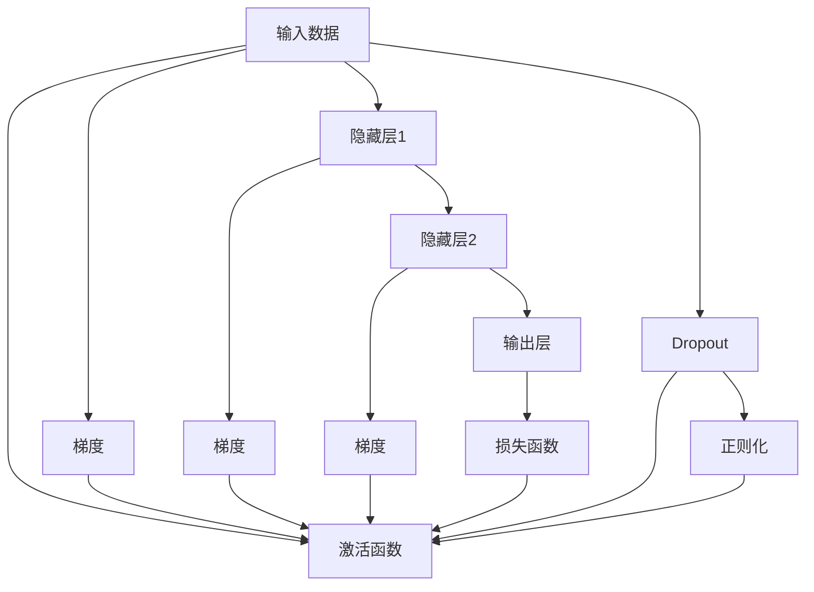
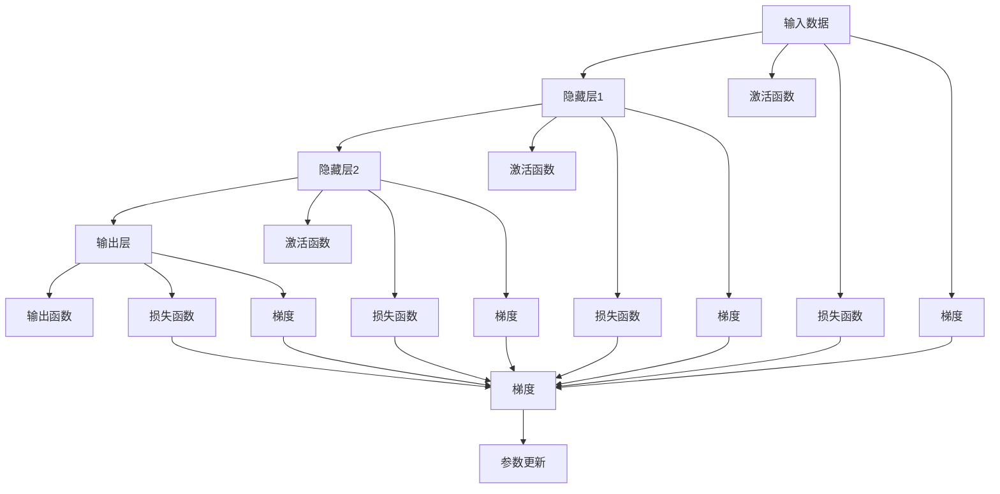
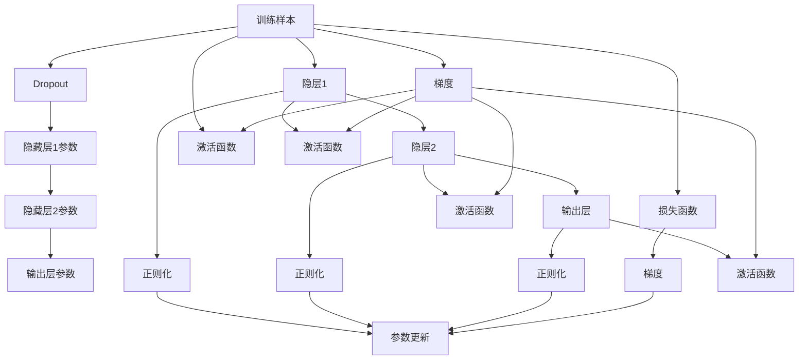

                 

# 神经网络：开启智能新纪元

> 关键词：神经网络,深度学习,人工智能,机器学习,计算复杂度,反向传播,梯度下降,优化算法

## 1. 背景介绍

### 1.1 问题由来
在人工智能(AI)的浪潮中，神经网络(Neural Networks)技术已成为驱动智能革命的核心引擎。自20世纪80年代以来，神经网络在图像识别、语音处理、自然语言理解等诸多领域取得了突破性进展，极大地推动了人工智能技术的发展与应用。然而，神经网络作为一类复杂的非线性模型，其背后的计算复杂度和理论原理仍是研究难点。本文旨在深入探讨神经网络的计算原理、优化算法和应用实践，为读者提供全面的技术解析。

### 1.2 问题核心关键点
神经网络的核心是利用多层非线性变换，通过反向传播算法和梯度下降等优化方法，学习数据的潜在表示。其关键点包括：

- 多层非线性变换：通过多个隐层捕捉数据的复杂非线性关系。
- 反向传播算法：利用链式法则计算梯度，回传误差信号。
- 梯度下降：基于梯度信息调整模型参数，最小化损失函数。
- 优化算法：如随机梯度下降(SGD)、Adam等，保证训练效率和稳定性。
- 特征提取：网络通过隐层将输入数据映射到高维空间，提取关键特征。

这些关键点共同构成了神经网络的理论基础，决定了其在各种NLP、计算机视觉和语音识别任务中的卓越表现。

### 1.3 问题研究意义
神经网络技术的广泛应用，使人工智能从传统的数据驱动走向智能驱动，带来了计算科学领域的重大突破。神经网络在图像识别、自然语言处理、自动驾驶等领域的应用，不仅提高了模型的预测准确性和自动化程度，还降低了人工干预和数据标注成本，为各行各业带来了革新性的变化。未来，随着神经网络技术的不断成熟，其应用将进一步扩展到更多领域，深刻影响社会的各个层面。

## 2. 核心概念与联系

### 2.1 核心概念概述

为了更好地理解神经网络的计算原理和优化方法，本节将介绍几个密切相关的核心概念：

- 多层感知机(Multilayer Perceptron, MLP)：一种包含多个隐层的神经网络模型，每个隐层通过非线性变换映射输入数据。
- 反向传播算法(Backpropagation)：用于计算神经网络中各层参数的梯度，通过链式法则传递误差信号，更新模型参数。
- 梯度下降法(Gradient Descent)：通过梯度信息调整模型参数，最小化损失函数。
- 正则化(Regularization)：避免过拟合，保持模型的泛化能力。
- 激活函数(Activation Function)：非线性映射函数，如Sigmoid、ReLU等。
- Dropout：随机失活隐层神经元，减少过拟合。

这些概念之间的关系可以用以下Mermaid流程图表示：

这个流程图展示了神经网络的主要组件及其间的关联：

- 输入数据通过多层非线性变换，最终输出预测结果。
- 每个隐层的激活函数对数据进行非线性映射，捕捉复杂的模式。
- 反向传播算法将误差信号传递回隐层，计算各层梯度。
- 梯度下降法利用梯度信息调整模型参数，最小化损失函数。
- Dropout和正则化技术抑制过拟合，提升模型泛化能力。

这些概念共同构成了神经网络的计算框架，为其在各类任务中发挥出色性能奠定了基础。

### 2.2 概念间的关系

这些核心概念之间存在着紧密的联系，形成了神经网络计算和优化的完整体系。我们通过几个Mermaid流程图来进一步展示它们之间的关系。

#### 2.2.1 神经网络的计算流程

这个流程图展示了神经网络从输入到输出的计算流程：

- 输入数据通过多层次的非线性变换，逐步逼近输出结果。
- 激活函数在每个隐层对数据进行非线性映射。
- 输出函数将隐层结果转换为预测结果。
- 损失函数计算预测结果与真实标签的误差，用于更新模型参数。
- 梯度从输出层回传至输入层，通过反向传播算法计算每个参数的梯度。
- 参数更新通过梯度下降法调整，最小化损失函数。

#### 2.2.2 反向传播的计算过程

这个流程图展示了反向传播算法的计算过程：

- 输出误差通过链式法则传递回输出层，计算输出层梯度。
- 输出层梯度乘以输出层激活函数的导数，得到输出层参数梯度。
- 输出层参数梯度乘以隐层激活函数的导数，得到隐层梯度。
- 隐层梯度乘以隐层激活函数的导数，得到隐层参数梯度。
- 隐层参数梯度乘以输入层激活函数的导数，得到输入层梯度。
- 输入层梯度乘以输入层激活函数的导数，得到输入层参数梯度。

#### 2.2.3 正则化与Dropout的技术应用

这个流程图展示了正则化和Dropout技术的应用：

- 训练样本通过多层非线性变换，逐步逼近输出结果。
- 每个隐层的激活函数对数据进行非线性映射。
- Dropout随机失活一部分隐层神经元，减少过拟合。
- 正则化通过L2正则、Dropout等技术抑制过拟合，保持模型的泛化能力。
- 损失函数计算预测结果与真实标签的误差，用于更新模型参数。
- 梯度从输出层回传至输入层，通过反向传播算法计算每个参数的梯度。
- 参数更新通过梯度下降法调整，最小化损失函数。

通过这些流程图，我们可以更清晰地理解神经网络的计算原理和优化方法，为后续深入讨论具体的神经网络结构和优化技巧奠定基础。

## 3. 核心算法原理 & 具体操作步骤
### 3.1 算法原理概述

神经网络的核心算法原理主要包括多层非线性变换、反向传播算法和梯度下降法。下面我们将分别进行详细介绍。

**多层非线性变换**

多层感知机(MLP)通过多个隐层对输入数据进行非线性变换，逐步逼近输出结果。这种变换可以捕捉数据之间的复杂关系，提高模型的表达能力。以一个包含两个隐层的多层感知机为例，其计算过程如下：

$$
\mathbf{h}_1 = \sigma(\mathbf{W}_1 \mathbf{x} + \mathbf{b}_1)
$$

$$
\mathbf{h}_2 = \sigma(\mathbf{W}_2 \mathbf{h}_1 + \mathbf{b}_2)
$$

$$
\mathbf{y} = \mathbf{W}_3 \mathbf{h}_2 + \mathbf{b}_3
$$

其中，$\mathbf{x}$为输入向量，$\mathbf{h}_1$和$\mathbf{h}_2$为隐层输出向量，$\mathbf{y}$为输出向量。$\sigma$为激活函数，$\mathbf{W}$和$\mathbf{b}$分别为权重矩阵和偏置向量。

**反向传播算法**

反向传播算法通过链式法则计算神经网络中各层参数的梯度。假设输出层误差为$\mathcal{E}$，则反向传播的计算过程如下：

1. 计算输出层梯度：

$$
\frac{\partial \mathcal{E}}{\partial \mathbf{y}} = \frac{\partial \mathcal{E}}{\partial \mathbf{h}_2} \cdot \frac{\partial \mathbf{h}_2}{\partial \mathbf{y}}
$$

2. 计算隐层梯度：

$$
\frac{\partial \mathcal{E}}{\partial \mathbf{h}_2} = \frac{\partial \mathcal{E}}{\partial \mathbf{h}_1} \cdot \frac{\partial \mathbf{h}_1}{\partial \mathbf{h}_2} \cdot \frac{\partial \mathbf{h}_2}{\partial \mathbf{h}_1}
$$

3. 计算输入层梯度：

$$
\frac{\partial \mathcal{E}}{\partial \mathbf{h}_1} = \frac{\partial \mathcal{E}}{\partial \mathbf{x}} \cdot \frac{\partial \mathbf{h}_1}{\partial \mathbf{x}}
$$

$$
\frac{\partial \mathcal{E}}{\partial \mathbf{W}_1} = \frac{\partial \mathcal{E}}{\partial \mathbf{h}_1} \cdot \frac{\partial \mathbf{h}_1}{\partial \mathbf{W}_1}
$$

$$
\frac{\partial \mathcal{E}}{\partial \mathbf{b}_1} = \frac{\partial \mathcal{E}}{\partial \mathbf{h}_1} \cdot \frac{\partial \mathbf{h}_1}{\partial \mathbf{b}_1}
$$

通过反向传播算法，神经网络能够自动计算每个参数的梯度，从而更新模型参数，最小化损失函数。

**梯度下降法**

梯度下降法是一种常用的优化算法，用于调整神经网络中的参数。其基本思想是通过梯度信息调整参数，使得损失函数最小化。假设当前参数为$\theta$，损失函数为$L(\theta)$，则梯度下降法的计算过程如下：

$$
\theta_{t+1} = \theta_t - \eta \nabla L(\theta_t)
$$

其中，$\eta$为学习率，$\nabla L(\theta_t)$为损失函数对参数的梯度。通过不断迭代，神经网络能够逐步调整参数，最终逼近最优解。

### 3.2 算法步骤详解

基于神经网络的优化算法通常包括：前向传播、计算损失、反向传播、参数更新等步骤。以下是详细的步骤详解：

**前向传播**

前向传播是将输入数据通过神经网络各层进行非线性变换的过程。以一个包含两个隐层的多层感知机为例，其计算过程如下：

1. 输入数据：$\mathbf{x}$
2. 隐藏层1：$\mathbf{h}_1 = \sigma(\mathbf{W}_1 \mathbf{x} + \mathbf{b}_1)$
3. 隐藏层2：$\mathbf{h}_2 = \sigma(\mathbf{W}_2 \mathbf{h}_1 + \mathbf{b}_2)$
4. 输出层：$\mathbf{y} = \mathbf{W}_3 \mathbf{h}_2 + \mathbf{b}_3$

其中，$\sigma$为激活函数，$\mathbf{W}$和$\mathbf{b}$分别为权重矩阵和偏置向量。

**计算损失**

计算损失是将输出结果与真实标签进行对比，计算误差的过程。以分类任务为例，假设输出结果为$\mathbf{y}$，真实标签为$\mathbf{t}$，则损失函数可以定义为：

$$
L(\theta) = -\frac{1}{N} \sum_{i=1}^N \log p(y_i \mid x_i)
$$

其中，$p(y_i \mid x_i)$为预测概率，$N$为样本数量。

**反向传播**

反向传播是将误差信号回传至隐层，计算每个参数的梯度的过程。以一个包含两个隐层的多层感知机为例，其计算过程如下：

1. 输出误差：$\mathcal{E} = L(\theta)$
2. 输出层梯度：$\frac{\partial \mathcal{E}}{\partial \mathbf{y}} = \frac{\partial L(\theta)}{\partial \mathbf{y}}$
3. 隐层梯度：$\frac{\partial \mathcal{E}}{\partial \mathbf{h}_2} = \frac{\partial \mathcal{E}}{\partial \mathbf{y}} \cdot \frac{\partial \mathbf{y}}{\partial \mathbf{h}_2}$
4. 输入层梯度：$\frac{\partial \mathcal{E}}{\partial \mathbf{h}_1} = \frac{\partial \mathcal{E}}{\partial \mathbf{h}_2} \cdot \frac{\partial \mathbf{h}_2}{\partial \mathbf{h}_1} \cdot \frac{\partial \mathbf{h}_1}{\partial \mathbf{x}}$

其中，$\frac{\partial L(\theta)}{\partial \mathbf{y}}$为损失函数对输出结果的梯度，$\frac{\partial \mathbf{y}}{\partial \mathbf{h}_2}$和$\frac{\partial \mathbf{h}_2}{\partial \mathbf{h}_1}$为激活函数的导数，$\frac{\partial \mathbf{h}_1}{\partial \mathbf{x}}$为输入层激活函数的导数。

**参数更新**

参数更新是通过梯度下降法调整模型参数，最小化损失函数的过程。以一个包含两个隐层的多层感知机为例，其计算过程如下：

1. 计算梯度：$\frac{\partial L(\theta)}{\partial \mathbf{W}_1}$，$\frac{\partial L(\theta)}{\partial \mathbf{b}_1}$，$\frac{\partial L(\theta)}{\partial \mathbf{W}_2}$，$\frac{\partial L(\theta)}{\partial \mathbf{b}_2}$，$\frac{\partial L(\theta)}{\partial \mathbf{W}_3}$，$\frac{\partial L(\theta)}{\partial \mathbf{b}_3}$
2. 更新参数：$\mathbf{W}_1 \leftarrow \mathbf{W}_1 - \eta \frac{\partial L(\theta)}{\partial \mathbf{W}_1}$，$\mathbf{b}_1 \leftarrow \mathbf{b}_1 - \eta \frac{\partial L(\theta)}{\partial \mathbf{b}_1}$，$\mathbf{W}_2 \leftarrow \mathbf{W}_2 - \eta \frac{\partial L(\theta)}{\partial \mathbf{W}_2}$，$\mathbf{b}_2 \leftarrow \mathbf{b}_2 - \eta \frac{\partial L(\theta)}{\partial \mathbf{b}_2}$，$\mathbf{W}_3 \leftarrow \mathbf{W}_3 - \eta \frac{\partial L(\theta)}{\partial \mathbf{W}_3}$，$\mathbf{b}_3 \leftarrow \mathbf{b}_3 - \eta \frac{\partial L(\theta)}{\partial \mathbf{b}_3}$

其中，$\eta$为学习率，$L(\theta)$为损失函数，$\frac{\partial L(\theta)}{\partial \mathbf{W}}$和$\frac{\partial L(\theta)}{\partial \mathbf{b}}$分别为损失函数对权重和偏置的梯度。

### 3.3 算法优缺点

基于神经网络的优化算法具有以下优点：

1. 强大的表达能力：通过多层非线性变换，神经网络能够捕捉数据之间的复杂关系。
2. 自适应调整：通过反向传播算法和梯度下降法，神经网络能够自动调整参数，最小化损失函数。
3. 鲁棒性：通过正则化和Dropout等技术，神经网络能够抑制过拟合，保持模型的泛化能力。

同时，该算法也存在一些缺点：

1. 计算复杂度：神经网络需要大量计算资源，尤其是大规模模型，训练时间较长。
2. 过拟合问题：神经网络容易陷入过拟合，尤其是训练数据较少的情况下。
3. 模型参数较多：神经网络需要大量参数，训练过程中容易出现梯度消失或梯度爆炸等问题。
4. 难以解释：神经网络的决策过程难以解释，缺乏可解释性。

尽管存在这些缺点，但基于神经网络的优化算法仍是当前最先进的深度学习范式之一，广泛应用于图像识别、语音处理、自然语言处理等领域。

### 3.4 算法应用领域

神经网络在许多领域都得到了广泛的应用，以下是几个典型的应用场景：

**计算机视觉**

神经网络在计算机视觉领域取得了突破性进展。以图像识别为例，通过卷积神经网络(Convolutional Neural Network, CNN)等结构，神经网络能够自动提取图像特征，分类识别各种物体。CNN通过卷积层、池化层等结构，有效捕捉图像的局部特征，从而实现高效的图像分类和目标检测。

**自然语言处理**

神经网络在自然语言处理(NLP)领域也得到了广泛应用。以语言模型为例，通过循环神经网络(Recurrent Neural Network, RNN)和长短期记忆网络(Long Short-Term Memory, LSTM)等结构，神经网络能够自动捕捉文本的语义信息，生成自然流畅的文本。在机器翻译、情感分析、问答系统等任务上，神经网络展示了出色的表现。

**语音识别**

神经网络在语音识别领域也有着广泛应用。通过序列到序列模型(Sequence-to-Sequence, Seq2Seq)等结构，神经网络能够自动处理语音信号，识别出文本内容。在自动语音识别、语音合成等任务上，神经网络展示了强大的能力。

**自动驾驶**

神经网络在自动驾驶领域也有着广泛应用。通过卷积神经网络(CNN)和循环神经网络(RNN)等结构，神经网络能够自动处理传感器数据，实现车辆的路径规划和决策。在自动驾驶、智能交通等任务上，神经网络展示了极高的可靠性和安全性。

## 4. 数学模型和公式 & 详细讲解 & 举例说明

### 4.1 数学模型构建

神经网络的数学模型包括输入数据、模型参数、激活函数、损失函数和优化算法等关键组件。下面我们将详细讲解这些组件的构建过程。

**输入数据**

输入数据是神经网络处理的对象，通常表示为向量$\mathbf{x} \in \mathbb{R}^d$，其中$d$为特征维度。以图像识别为例，输入数据可以是图像像素值构成的向量。

**模型参数**

模型参数是神经网络的可训练组件，通常表示为矩阵$\mathbf{W} \in \mathbb{R}^{d \times d}$和向量$\mathbf{b} \in \mathbb{R}^d$。在深度学习中，这些参数通过反向传播算法和梯度下降法不断调整，最小化损失函数。

**激活函数**

激活函数是非线性变换函数，通常表示为$\sigma(\cdot)$。以Sigmoid函数为例，其计算过程如下：

$$
\sigma(z) = \frac{1}{1 + e^{-z}}
$$

其中，$z$为输入向量，$e$为自然常数。

**损失函数**

损失函数是神经网络的优化目标，通常表示为$L(\theta)$。以二分类任务为例，损失函数可以定义为：

$$
L(\theta) = -\frac{1}{N} \sum_{i=1}^N \log p(y_i \mid x_i)
$$

其中，$p(y_i \mid x_i)$为预测概率，$N$为样本数量。

**优化算法**

优化算法是神经网络调整参数的方法，通常表示为$\eta$。以随机梯度下降法为例，其计算过程如下：

$$
\theta_{t+1} = \theta_t - \eta \nabla L(\theta_t)
$$

其中，$\eta$为学习率，$\nabla L(\theta_t)$为损失函数对参数的梯度。

### 4.2 公式推导过程

下面以二分类任务为例，推导神经网络的基本计算公式。

**前向传播**

前向传播是将输入数据通过神经网络各层进行非线性变换的过程。以一个包含两个隐层的多层感知机为例，其计算过程如下：

1. 输入数据：$\mathbf{x}$
2. 隐藏层1：$\mathbf{h}_1 = \sigma(\mathbf{W}_1 \mathbf{x} + \mathbf{b}_1)$
3. 隐藏层2：$\mathbf{h}_2 = \sigma(\mathbf{W}_2 \mathbf{h}_1 + \mathbf{b}_2)$
4. 输出层：$\mathbf{y} = \mathbf{W}_3 \mathbf{h}_2 + \mathbf{b}_3$

其中，$\sigma$为激活函数，$\mathbf{W}$和$\mathbf{b}$分别为权重矩阵和偏置向量。

**计算损失**

计算损失是将输出结果与真实标签进行对比，计算误差的过程。以二分类任务为例，假设输出结果为$\mathbf{y}$，真实标签为$\mathbf{t}$，则损失函数可以定义为：

$$
L(\theta) = -\frac{1}{N} \sum_{i=1}^N \log p(y_i \mid x_i)
$$

其中，$p(y_i \mid x_i)$为预测概率，$N$为样本数量。

**反向传播**

反向传播是将误差信号回传至隐层，计算每个参数的梯度的过程。以一个包含两个隐层的多层感知机为例，其计算过程如下：

1. 输出误差：$\mathcal{E} = L(\theta)$
2. 输出层梯度：$\frac{\partial \mathcal{E}}{\partial \mathbf{y}} = \frac{\partial L(\theta)}{\partial \mathbf{y}}$
3. 隐层梯度：$\frac{\partial \mathcal{E}}{\partial \mathbf{h}_2} = \frac{\partial \mathcal{E}}{\partial \mathbf{y}} \cdot \frac{\partial \mathbf{y}}{\partial \mathbf{h}_2}$
4. 输入层梯度：$\frac{\partial \mathcal{E}}{\partial \mathbf{h}_1} = \frac{\partial \mathcal{E}}{\partial \mathbf{h}_2} \cdot \frac{\partial \mathbf{h}_2}{\partial \mathbf{h}_1} \cdot \frac{\partial \mathbf{h}_1}{\partial \mathbf{x}}$

其中，$\frac{\partial L(\theta)}{\partial \mathbf{y}}$为损失函数对输出结果的梯度，$\frac{\partial \mathbf{y}}{\partial \mathbf{h}_2}$和$\frac{\partial \mathbf{h}_2}{\partial \mathbf{h}_1}$为激活函数的导数，$\frac{\partial \mathbf{h}_1}{\partial \mathbf{x}}$为输入层激活函数的导数。

**参数更新**

参数更新是通过梯度下降法调整模型参数，最小化损失函数的过程。以一个包含两个隐层的多层感知机为例，其计算过程如下：

1. 计算梯度：$\frac{\partial L(\theta)}{\partial \mathbf{W}_1}$，$\frac{\partial L(\theta)}{\partial \mathbf{b}_1}$，$\frac{\partial L(\theta)}{\partial \mathbf{W}_2}$，$\frac{\partial L(\theta)}{\

