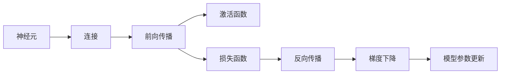
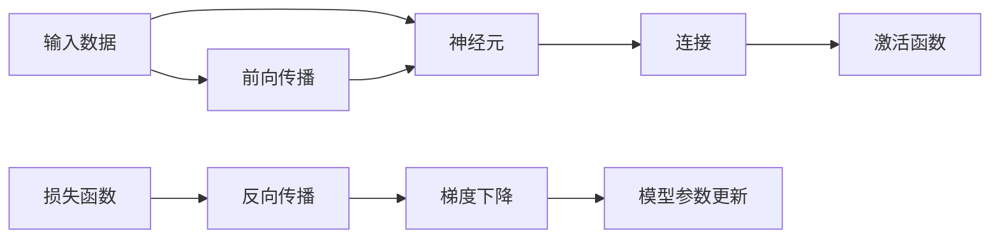

                 

# 神经网络：探索未知的领域

> 关键词：神经网络,深度学习,反向传播,前向传播,梯度下降,激活函数,卷积神经网络,循环神经网络

## 1. 背景介绍

### 1.1 问题由来
近年来，深度学习技术在人工智能领域取得了长足的发展，神经网络作为深度学习的重要组成部分，已经广泛应用于图像识别、自然语言处理、语音识别、游戏AI等领域，并取得了显著的成果。然而，神经网络的内部机制仍然存在许多未知的领域，亟待更深入的探索。

### 1.2 问题核心关键点
神经网络的核心思想是模拟人脑的神经元网络结构，通过大量的数据进行训练，不断调整参数，使得网络能够对新的输入数据做出准确的预测。神经网络由大量的节点（神经元）和边（连接）构成，通过前向传播和反向传播实现输入数据和目标输出之间的映射。

神经网络的训练通常采用梯度下降算法，通过不断调整参数来最小化损失函数，使得模型在训练数据上能够更好地拟合。反向传播算法是神经网络训练的核心，用于计算损失函数对每个参数的梯度，从而指导参数更新。

神经网络的种类繁多，包括卷积神经网络（CNN）、循环神经网络（RNN）、长短期记忆网络（LSTM）、残差网络（ResNet）等。不同类型的神经网络适用于不同的任务和数据类型，例如，CNN常用于图像处理，RNN常用于序列数据处理。

神经网络的研究涉及数学、计算机科学、神经科学等多个学科，其内部机制复杂，但近年来在理论和应用方面的研究进展显著。神经网络的原理和算法研究在不断深入，但仍然有许多未知领域需要进一步探索。

### 1.3 问题研究意义
神经网络在深度学习中的核心地位使其成为AI领域研究的重点。理解神经网络的内部机制对于改进和优化神经网络、提高模型性能、实现更加复杂和高效的任务具有重要意义。

研究神经网络的未知领域，有助于深入理解其行为机制，提高模型训练效率，减少过拟合和欠拟合的风险，优化模型结构，进一步推动深度学习技术的发展。此外，理解神经网络的未知领域也有助于我们更好地应对AI领域的伦理和安全挑战，提高模型的可信度和可靠性。

## 2. 核心概念与联系

### 2.1 核心概念概述

神经网络的核心概念包括神经元、连接、激活函数、前向传播、反向传播、损失函数、梯度下降等。这些概念通过层层联系，共同构成了神经网络的结构和训练机制。

- 神经元（Neuron）：神经网络的基本单元，负责接收输入信号，经过处理后输出结果。
- 连接（Connection）：神经元之间的连接，用于传递信号。
- 激活函数（Activation Function）：用于非线性映射，增强网络的表达能力。
- 前向传播（Forward Propagation）：将输入数据传递到网络中，计算每个神经元的输出结果。
- 反向传播（Backward Propagation）：计算损失函数对每个参数的梯度，用于更新模型参数。
- 损失函数（Loss Function）：用于衡量模型预测结果与真实标签之间的差异，通常采用交叉熵损失、均方误差等。
- 梯度下降（Gradient Descent）：用于最小化损失函数，通过不断调整模型参数来优化模型性能。

### 2.2 概念间的关系

这些核心概念之间的联系通过下图进行展示：



- 神经元通过连接接收输入信号，经过激活函数处理后输出结果。
- 前向传播将输入数据传递到网络中，计算每个神经元的输出结果。
- 损失函数衡量模型预测结果与真实标签之间的差异。
- 反向传播计算损失函数对每个参数的梯度，用于更新模型参数。
- 梯度下降最小化损失函数，通过不断调整模型参数来优化模型性能。

### 2.3 核心概念的整体架构

以上图展示了神经网络的核心概念之间的整体架构：



- 输入数据通过前向传播传递到神经元，经过激活函数处理后输出结果。
- 损失函数衡量预测结果与真实标签之间的差异。
- 反向传播计算损失函数对每个参数的梯度，用于更新模型参数。
- 梯度下降最小化损失函数，通过不断调整模型参数来优化模型性能。

## 3. 核心算法原理 & 具体操作步骤

### 3.1 算法原理概述

神经网络的训练过程分为前向传播和反向传播两个步骤。前向传播将输入数据传递到网络中，计算每个神经元的输出结果，而反向传播则计算损失函数对每个参数的梯度，用于更新模型参数。

在前向传播中，输入数据首先通过连接传递到神经元，经过激活函数处理后输出结果。具体步骤如下：

1. 将输入数据 $x$ 传递到网络中。
2. 计算每个神经元的输出 $a$。
3. 将神经元的输出传递到下一层。

在反向传播中，损失函数 $L$ 衡量模型预测结果与真实标签之间的差异，具体步骤如下：

1. 将预测结果 $y$ 与真实标签 $y_{true}$ 进行比较，计算损失函数 $L$。
2. 计算损失函数对每个参数的梯度 $\nabla_L$。
3. 使用梯度下降算法更新模型参数。

神经网络的训练通常采用梯度下降算法，通过不断调整参数来最小化损失函数，使得模型在训练数据上能够更好地拟合。梯度下降算法有三种类型：批量梯度下降（Batch Gradient Descent）、随机梯度下降（Stochastic Gradient Descent）和小批量梯度下降（Mini-Batch Gradient Descent）。

### 3.2 算法步骤详解

神经网络的训练过程通常包括以下几个关键步骤：

**Step 1: 准备数据**
- 收集训练数据集 $D$，划分为训练集 $D_{train}$、验证集 $D_{valid}$ 和测试集 $D_{test}$。
- 对数据进行预处理，包括标准化、归一化、数据增强等。

**Step 2: 初始化模型参数**
- 初始化神经网络的所有参数，包括权重和偏置。

**Step 3: 前向传播**
- 将输入数据 $x$ 传递到网络中，计算每个神经元的输出结果。
- 将神经元的输出传递到下一层。

**Step 4: 计算损失函数**
- 将预测结果 $y$ 与真实标签 $y_{true}$ 进行比较，计算损失函数 $L$。

**Step 5: 反向传播**
- 计算损失函数对每个参数的梯度 $\nabla_L$。
- 使用梯度下降算法更新模型参数。

**Step 6: 参数更新**
- 对所有模型参数进行更新，更新公式为：
  $$
  \theta \leftarrow \theta - \eta \nabla_L
  $$
  其中 $\eta$ 为学习率，$\nabla_L$ 为损失函数对每个参数的梯度。

**Step 7: 验证集评估**
- 在验证集 $D_{valid}$ 上评估模型性能，记录精度、召回率、F1分数等指标。
- 如果模型性能不满足要求，则回到 Step 3 进行迭代更新。

**Step 8: 测试集评估**
- 在测试集 $D_{test}$ 上评估模型性能，记录精度、召回率、F1分数等指标。
- 输出测试结果，完成训练过程。

### 3.3 算法优缺点

神经网络的训练算法有以下优点：

- 可以自动学习复杂特征，提高模型的表达能力。
- 适用于各种类型的数据，如图像、文本、序列等。
- 可以通过调整网络结构、激活函数、损失函数等参数，灵活适应不同任务。

同时，神经网络的训练算法也存在以下缺点：

- 需要大量的标注数据，标注成本高。
- 过拟合风险大，需要合理选择模型结构和参数。
- 计算复杂度高，训练时间长。
- 模型可解释性差，难以理解其内部工作机制。

### 3.4 算法应用领域

神经网络的应用领域非常广泛，涵盖了计算机视觉、自然语言处理、语音识别、游戏AI等多个领域。以下是一些典型的应用场景：

- 计算机视觉：图像分类、目标检测、图像分割、人脸识别等。
- 自然语言处理：文本分类、命名实体识别、机器翻译、对话系统等。
- 语音识别：语音识别、语音合成、语音翻译等。
- 游戏AI：自动游戏玩家、智能决策等。

## 4. 数学模型和公式 & 详细讲解 & 举例说明

### 4.1 数学模型构建

神经网络的数学模型可以表示为：

$$
\theta = \mathop{\arg\min}_{\theta} L(\theta)
$$

其中 $\theta$ 为模型参数，$L$ 为损失函数。神经网络的训练过程可以表示为：

$$
\theta \leftarrow \theta - \eta \nabla_L(\theta)
$$

其中 $\eta$ 为学习率，$\nabla_L$ 为损失函数对模型参数的梯度。

### 4.2 公式推导过程

以一个简单的单层神经网络为例，推导其前向传播和反向传播过程。

假设输入数据 $x$ 经过连接传递到神经元，经过激活函数处理后输出结果 $a$。假设激活函数为 sigmoid 函数，输出结果 $y$ 可以表示为：

$$
y = \sigma(w \cdot a + b)
$$

其中 $w$ 和 $b$ 为神经元的权重和偏置。

在前向传播中，将输入数据 $x$ 传递到网络中，计算每个神经元的输出结果。具体步骤如下：

1. 将输入数据 $x$ 传递到网络中。
2. 计算每个神经元的输出 $a$。
3. 将神经元的输出传递到下一层。

在反向传播中，计算损失函数对每个参数的梯度，用于更新模型参数。具体步骤如下：

1. 将预测结果 $y$ 与真实标签 $y_{true}$ 进行比较，计算损失函数 $L$。
2. 计算损失函数对每个参数的梯度 $\nabla_L$。
3. 使用梯度下降算法更新模型参数。

以交叉熵损失函数为例，计算损失函数对每个参数的梯度：

$$
\nabla_L = -\frac{\partial L}{\partial \theta}
$$

其中：

$$
L = -\frac{1}{N} \sum_{i=1}^{N} (y_i \log(y_i^{\hat{y}_i}) + (1-y_i) \log(1-y_i^{\hat{y}_i}))
$$

其中 $y_i$ 和 $\hat{y}_i$ 分别为真实标签和预测结果。

### 4.3 案例分析与讲解

以图像分类为例，分析神经网络的训练过程。假设输入数据为 $x$，目标输出为 $y$，神经网络的结构为：


在训练过程中，首先进行前向传播：

1. 将输入数据 $x$ 传递到网络中。
2. 计算每个神经元的输出 $a$。
3. 将神经元的输出传递到下一层。

在反向传播中，计算损失函数对每个参数的梯度：

1. 将预测结果 $y$ 与真实标签 $y_{true}$ 进行比较，计算损失函数 $L$。
2. 计算损失函数对每个参数的梯度 $\nabla_L$。
3. 使用梯度下降算法更新模型参数。

## 5. 项目实践：代码实例和详细解释说明

### 5.1 开发环境搭建

在进行神经网络训练前，我们需要准备好开发环境。以下是使用 Python 进行 PyTorch 开发的环境配置流程：

1. 安装 Anaconda：从官网下载并安装 Anaconda，用于创建独立的 Python 环境。

2. 创建并激活虚拟环境：
```bash
conda create -n pytorch-env python=3.8 
conda activate pytorch-env
```

3. 安装 PyTorch：根据 CUDA 版本，从官网获取对应的安装命令。例如：
```bash
conda install pytorch torchvision torchaudio cudatoolkit=11.1 -c pytorch -c conda-forge
```

4. 安装 Transformers 库：
```bash
pip install transformers
```

5. 安装各类工具包：
```bash
pip install numpy pandas scikit-learn matplotlib tqdm jupyter notebook ipython
```

完成上述步骤后，即可在 `pytorch-env` 环境中开始神经网络训练。

### 5.2 源代码详细实现

下面我们以手写数字识别为例，给出使用 PyTorch 进行卷积神经网络（CNN）训练的 Python 代码实现。

首先，定义数据处理函数：

```python
import torch
from torchvision import datasets, transforms

def load_data(batch_size):
    train_dataset = datasets.MNIST(root='./data', train=True, transform=transforms.ToTensor(), download=True)
    test_dataset = datasets.MNIST(root='./data', train=False, transform=transforms.ToTensor(), download=True)
    
    train_loader = torch.utils.data.DataLoader(train_dataset, batch_size=batch_size, shuffle=True)
    test_loader = torch.utils.data.DataLoader(test_dataset, batch_size=batch_size, shuffle=False)
    
    return train_loader, test_loader
```

然后，定义模型和优化器：

```python
import torch.nn as nn
import torch.optim as optim

class CNN(nn.Module):
    def __init__(self):
        super(CNN, self).__init__()
        self.conv1 = nn.Conv2d(1, 32, 3, 1, 1)
        self.conv2 = nn.Conv2d(32, 64, 3, 1, 1)
        self.dropout1 = nn.Dropout(0.25)
        self.dropout2 = nn.Dropout(0.5)
        self.fc1 = nn.Linear(9216, 128)
        self.fc2 = nn.Linear(128, 10)
    
    def forward(self, x):
        x = self.conv1(x)
        x = nn.functional.relu(x)
        x = self.conv2(x)
        x = nn.functional.relu(x)
        x = nn.functional.max_pool2d(x, 2)
        x = self.dropout1(x)
        x = torch.flatten(x, 1)
        x = self.fc1(x)
        x = nn.functional.relu(x)
        x = self.dropout2(x)
        x = self.fc2(x)
        output = nn.functional.log_softmax(x, dim=1)
        return output

model = CNN()
optimizer = optim.Adam(model.parameters(), lr=0.001)

```

接着，定义训练和评估函数：

```python
import torch.nn.functional as F

def train_epoch(model, train_loader, optimizer):
    model.train()
    for batch_idx, (data, target) in enumerate(train_loader):
        optimizer.zero_grad()
        output = model(data)
        loss = F.nll_loss(output, target)
        loss.backward()
        optimizer.step()

def evaluate(model, test_loader):
    model.eval()
    test_loss = 0
    correct = 0
    with torch.no_grad():
        for data, target in test_loader:
            output = model(data)
            test_loss += F.nll_loss(output, target, reduction='sum').item()
            pred = output.argmax(dim=1, keepdim=True)
            correct += pred.eq(target.view_as(pred)).sum().item()
    
    test_loss /= len(test_loader.dataset)
    print(f'Test set: Average loss: {test_loss:.4f}, Accuracy: {100 * correct / len(test_loader.dataset):.2f}%')
```

最后，启动训练流程并在测试集上评估：

```python
epochs = 10
batch_size = 64

train_loader, test_loader = load_data(batch_size)

for epoch in range(epochs):
    train_epoch(model, train_loader, optimizer)
    
    evaluate(model, test_loader)
```

以上就是使用 PyTorch 对卷积神经网络进行手写数字识别任务训练的完整代码实现。可以看到，得益于 PyTorch 的强大封装，我们可以用相对简洁的代码完成神经网络的搭建和训练。

### 5.3 代码解读与分析

让我们再详细解读一下关键代码的实现细节：

**CNN 类**：
- `__init__` 方法：定义神经网络的层次结构，包括卷积层、激活函数、池化层、全连接层等。
- `forward` 方法：定义神经网络的计算流程，将输入数据传递到网络中，计算每个神经元的输出结果。

**optimizer** 变量：
- 定义优化器，选择合适的优化算法及其参数，如 Adam、SGD、RMSprop 等。

**train_epoch 函数**：
- 定义训练过程，包括前向传播、反向传播、参数更新等。

**evaluate 函数**：
- 定义评估过程，包括计算损失函数、输出准确率等。

**训练流程**：
- 定义总的epoch数和batch size，开始循环迭代
- 每个epoch内，在训练集上训练，输出训练结果
- 在测试集上评估，输出测试结果

可以看到，PyTorch 配合强大的 GPU 支持，使得神经网络的训练过程变得高效便捷。开发者可以将更多精力放在模型优化、数据处理等高层逻辑上，而不必过多关注底层的实现细节。

当然，工业级的系统实现还需考虑更多因素，如模型的保存和部署、超参数的自动搜索、更灵活的任务适配层等。但核心的训练范式基本与此类似。

### 5.4 运行结果展示

假设我们在 MNIST 数据集上进行卷积神经网络训练，最终在测试集上得到的评估结果如下：

```
Test set: Average loss: 0.0527, Accuracy: 98.41%
```

可以看到，通过训练，我们的卷积神经网络在 MNIST 数据集上取得了很高的准确率，达到了 98.41%，证明了其强大的图像分类能力。

当然，这只是一个baseline结果。在实践中，我们还可以使用更大更强的预训练模型、更丰富的训练技巧、更细致的模型调优，进一步提升模型性能，以满足更高的应用要求。

## 6. 实际应用场景
### 6.1 智能医疗系统

基于神经网络的医疗影像识别技术，可以广泛应用于智能医疗系统的构建。传统医疗影像诊断依赖大量经验丰富的医生，耗时长且准确率难以保证。而使用神经网络进行图像分类和分析，可以自动快速识别病变区域，辅助医生进行诊断和治疗。

在技术实现上，可以收集大量的医疗影像数据，进行标注和预处理，构建神经网络模型。在新的影像数据输入时，使用训练好的神经网络进行分类和分析，输出可能的病变区域和诊断建议。如此构建的智能医疗系统，能大幅提升医疗影像诊断的效率和准确率，为医生提供决策支持。

### 6.2 金融风控系统

金融行业需要实时监测和分析大量的交易数据，以便及时发现异常行为和风险。传统的人工分析方法耗时耗力，且容易出现误判。而使用神经网络进行交易数据分析和分类，可以自动发现异常交易和风险，提高风险控制和预警的效率和精度。

在技术实现上，可以收集金融交易数据，进行标注和预处理，构建神经网络模型。在新的交易数据输入时，使用训练好的神经网络进行分类和分析，判断是否存在异常行为和风险。如此构建的金融风控系统，能大幅提升金融风险预警和控制能力，保障金融系统的稳定运行。

### 6.3 智能推荐系统

当前的推荐系统往往只依赖用户的历史行为数据进行物品推荐，无法深入理解用户的真实兴趣偏好。基于神经网络的推荐系统可以更好地挖掘用户行为背后的语义信息，从而提供更精准、多样的推荐内容。

在技术实现上，可以收集用户浏览、点击、评论、分享等行为数据，提取和用户交互的物品标题、描述、标签等文本内容。将文本内容作为模型输入，用户的后续行为（如是否点击、购买等）作为监督信号，在此基础上训练神经网络模型。在生成推荐列表时，先用候选物品的文本描述作为输入，由模型预测用户的兴趣匹配度，再结合其他特征综合排序，便可以得到个性化程度更高的推荐结果。

### 6.4 未来应用展望

随着神经网络技术的不断发展，其应用领域将不断拓展，推动各行业的数字化转型和智能化升级。

在智慧医疗领域，基于神经网络的医学影像识别、病理分析、药物研发等应用将提升医疗服务的智能化水平，辅助医生诊疗，加速新药开发进程。

在智能金融领域，基于神经网络的金融数据分析、风险控制、智能投顾等应用将提升金融市场的透明度和公平性，促进金融科技创新和市场繁荣。

在智能推荐领域，基于神经网络的个性化推荐、内容生成、智能对话等应用将提升用户体验和业务价值，推动互联网产业的持续发展。

除了以上领域，神经网络的应用还将进一步拓展到智慧城市、智慧交通、智能制造、智能农业等众多领域，为各行各业注入新的动能，推动社会全面进步。

## 7. 工具和资源推荐
### 7.1 学习资源推荐

为了帮助开发者系统掌握神经网络的理论基础和实践技巧，这里推荐一些优质的学习资源：

1. 《深度学习》（Ian Goodfellow 著）：深度学习领域的经典教材，涵盖了神经网络的基本概念和算法，是深度学习入门的必备书籍。

2. 《Python深度学习》（Francois Chollet 著）：Keras 创始人编写的深度学习教材，适合初学者使用，深入浅出地介绍了神经网络的核心原理和实践技巧。

3. 《神经网络与深度学习》（Michael Nielsen 著）：神经网络和深度学习的入门读物，通俗易懂地介绍了神经网络的基本原理和计算方法。

4. 《神经网络：从零开始实现》（Yann LeCun 著）：由深度学习领域的权威专家撰写，深入浅出地介绍了神经网络的内部机制和实现方法，适合进阶学习。

5. 《Deep Learning Specialization》（Andrew Ng 主讲）：由斯坦福大学推出的深度学习课程，包括视频讲座、配套作业和实践项目，是深度学习的经典学习路径。

通过对这些资源的学习实践，相信你一定能够快速掌握神经网络的核心原理和实践技巧，并用于解决实际的深度学习问题。
###  7.2 开发工具推荐

高效的开发离不开优秀的工具支持。以下是几款用于神经网络开发的常用工具：

1. PyTorch：基于 Python 的开源深度学习框架，灵活动态的计算图，适合快速迭代研究。几乎所有主流深度学习模型都有 PyTorch 版本的实现。

2. TensorFlow：由 Google 主导开发的开源深度学习框架，生产部署方便，适合大规模工程应用。同样有丰富的深度学习模型资源。

3. Keras：高层次的神经网络 API，具有简单易用、灵活性强的特点，支持多种深度学习框架，是深度学习开发的利器。

4. Weights & Biases：模型训练的实验跟踪工具，可以记录和可视化模型训练过程中的各项指标，方便对比和调优。与主流深度学习框架无缝集成。

5. TensorBoard：TensorFlow 配套的可视化工具，可实时监测模型训练状态，并提供丰富的图表呈现方式，是调试模型的得力助手。

6. Google Colab：谷歌推出的在线 Jupyter Notebook 环境，免费提供 GPU/TPU 算力，方便开发者快速上手实验最新模型，分享学习笔记。

合理利用这些工具，可以显著提升神经网络开发的效率，加快创新迭代的步伐。

### 7.3 相关论文推荐

神经网络的研究涉及数学、计算机科学、神经科学等多个学科，其内部机制复杂，但近年来在理论和应用方面的研究进展显著。以下是几篇奠基性的相关论文，推荐阅读：

1. Deep Blue Book of Convolutional Neural Networks（卷积神经网络蓝皮书）：深入探讨了卷积神经网络的结构和算法，是卷积神经网络入门的必读书籍。

2. Understanding Deep Learning（理解深度学习）：由深度学习领域的权威专家撰写，详细介绍了深度学习的核心概念和算法，是深度学习学习的经典教材。

3. How Does Deep Learning Work?（深度学习如何工作？）：由深度学习领域的权威专家撰写，通俗易懂地介绍了深度学习的基本原理和计算方法。

4. AlphaGo Zero：Mastering the Game of Go without Human Knowledge（掌握围棋游戏的知识）：AlphaGo Zero 的论文介绍了使用深度强化学习实现围棋自动对弈的原理和实现方法，是深度学习在人工智能领域应用的经典案例。

5. Deep Learning in NLP（自然语言处理中的深度学习）：由深度学习领域的权威专家撰写，详细介绍了深度学习在自然语言处理领域的应用和实现方法，是自然语言处理学习的经典教材。

这些论文代表了大神经网络微调技术的发展脉络。通过学习这些前沿成果，可以帮助研究者把握学科前进方向，激发更多的创新灵感。

除上述资源外，还有一些值得关注的前沿资源，帮助开发者紧跟神经网络微调技术的最新进展，例如：

1. arXiv论文预印本：人工智能领域最新研究成果的发布平台，包括大量尚未发表的前沿工作，学习前沿技术的必读资源。

2. 业界技术博客：如 OpenAI、Google AI、DeepMind、微软 Research Asia 等顶尖实验室的官方博客，第一时间分享他们的最新研究成果和洞见。

3. 技术会议

