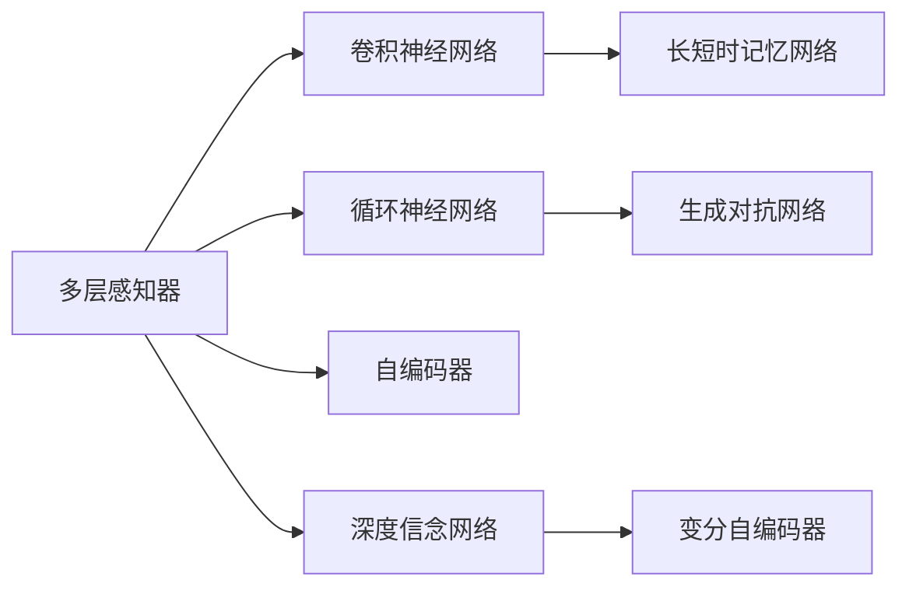
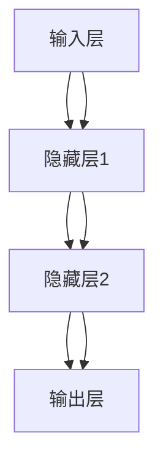
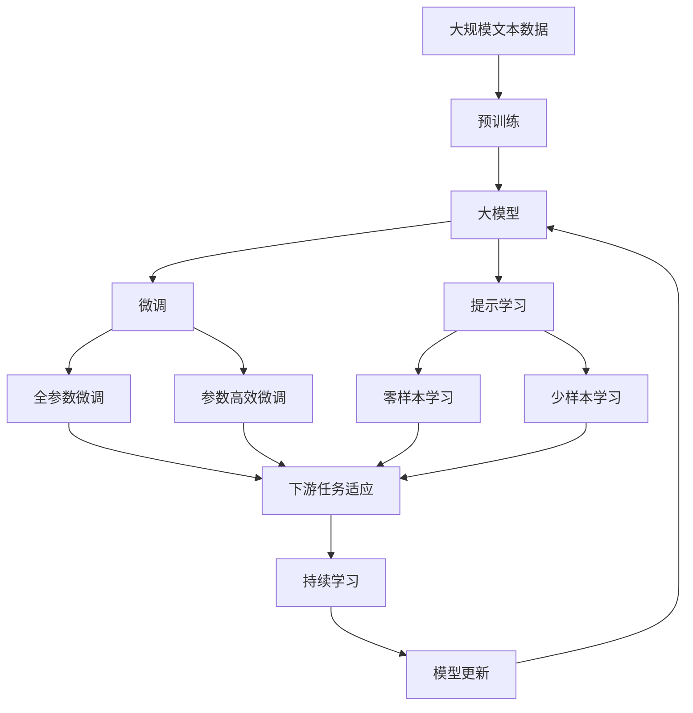

                 

# 神经网络：探索未知的领域

## 1. 背景介绍

### 1.1 问题由来

神经网络(Neural Networks, NN)是机器学习领域的一项重要技术，通过模仿人脑神经元的工作原理，实现对数据的深度处理和分析。在过去的几十年里，神经网络在图像识别、语音识别、自然语言处理、推荐系统等多个领域取得了显著进展，推动了人工智能技术的不断进步。

然而，神经网络的探索和研究依然充满未知领域。如何更高效地设计网络结构，提升网络性能，解决过拟合等问题，一直是学术界和工业界关注的重点。同时，如何将神经网络更好地应用于实际问题，实现人工智能技术的产业化落地，也成为当前的一大挑战。

### 1.2 问题核心关键点

要回答这些问题，首先需要理解神经网络的核心理念和架构。以下是神经网络的核心概念及关键点：

- **神经元(Neuron)**：神经网络的基本组成单位，接收输入信号并进行加权求和，通过激活函数输出结果。
- **层(Layer)**：由多个神经元组成，不同层的神经元之间可以进行信息传递和交互，形成多层次的非线性变换。
- **前向传播(Forward Propagation)**：输入数据从第一层开始，依次传递到后续各层，并最终输出结果的过程。
- **反向传播(Backward Propagation)**：通过计算损失函数对各层参数的梯度，反向更新模型参数的过程。
- **损失函数(Loss Function)**：用于衡量模型预测结果与真实标签之间的差异，常用的有均方误差(MSE)、交叉熵(Cross Entropy)等。
- **优化器(Optimizer)**：用于调整模型参数，以最小化损失函数。常用的有梯度下降法、Adam等。
- **过拟合(Overfitting)**：模型在训练数据上表现良好，但在测试数据上表现较差的现象。
- **泛化能力(Generalization)**：模型对未见过的数据进行准确预测的能力。

### 1.3 问题研究意义

研究神经网络及其应用，对于拓展人工智能技术的边界，推动产业发展，具有重要意义：

1. **提升模型性能**：神经网络通过多层次的非线性变换，可以学习到复杂的数据分布和特征关系，显著提升模型预测的准确性和鲁棒性。
2. **优化资源利用**：神经网络可以通过参数共享和稀疏化等技术，减少对计算资源和存储空间的消耗，降低模型训练和部署的门槛。
3. **促进跨领域应用**：神经网络在视觉、语音、自然语言处理等领域的广泛应用，为不同领域的技术融合提供了基础。
4. **推动产业升级**：神经网络技术在医疗、金融、制造等行业的应用，带来了新的商业模式和生产方式，加速了传统行业的数字化转型。
5. **引领未来技术**：神经网络作为人工智能的核心技术，将继续推动认知智能、增强智能等前沿领域的研究。

## 2. 核心概念与联系

### 2.1 核心概念概述

为了更好地理解神经网络的原理和架构，本节将介绍几个密切相关的核心概念：

- **多层感知器(Multilayer Perceptron, MLP)**：一种最简单的神经网络模型，由输入层、隐藏层和输出层组成，通过前向传播和反向传播更新参数。
- **卷积神经网络(Convolutional Neural Network, CNN)**：针对图像处理任务设计的一种神经网络模型，通过卷积和池化等操作提取图像特征。
- **循环神经网络(Recurrent Neural Network, RNN)**：适用于序列数据处理的一种神经网络模型，通过时间维度上的信息传递，实现对序列数据的建模和预测。
- **长短时记忆网络(Long Short-Term Memory, LSTM)**：一种特殊的RNN模型，通过门控机制解决RNN在长序列上的梯度消失问题，适用于文本序列和语音信号的建模。
- **生成对抗网络(Generative Adversarial Network, GAN)**：由生成器和判别器组成的一种神经网络模型，通过对抗训练生成高质量的样本数据。
- **自编码器(Autoencoder)**：一种无监督学习模型，通过将输入数据压缩为低维编码，并重构为原始数据，实现数据的特征提取和降维。
- **深度信念网络(Deep Belief Network, DBN)**：一种多层非线性概率模型，通过逐层训练隐含层参数，实现对数据的非线性建模。
- **变分自编码器(Variational Autoencoder, VAE)**：一种基于生成模型的神经网络模型，通过生成样本进行特征提取和生成。

这些核心概念之间存在着紧密的联系，形成了神经网络的基本架构和主要工作流程。下面通过一个Mermaid流程图来展示这些概念之间的关系：



### 2.2 概念间的关系

这些核心概念之间存在着紧密的联系，形成了神经网络的基本架构和主要工作流程。下面通过几个Mermaid流程图来展示这些概念之间的关系。

#### 2.2.1 神经网络的基本架构



这个流程图展示了神经网络的基本架构，包括输入层、隐藏层和输出层。输入层接收原始数据，隐藏层进行特征提取和变换，输出层给出最终的预测结果。

#### 2.2.2 卷积神经网络的结构


这个流程图展示了卷积神经网络的结构，通过卷积和池化等操作提取图像特征，并通过全连接层进行分类或回归。

#### 2.2.3 循环神经网络的机制


这个流程图展示了循环神经网络的机制，通过时间维度上的信息传递，实现对序列数据的建模和预测。

#### 2.2.4 长短时记忆网络的结构


这个流程图展示了长短时记忆网络的结构，通过门控机制解决RNN在长序列上的梯度消失问题，适用于文本序列和语音信号的建模。

### 2.3 核心概念的整体架构

最后，我们用一个综合的流程图来展示这些核心概念在大模型微调过程中的整体架构：



这个综合流程图展示了从预训练到微调，再到持续学习的完整过程。大模型首先在大规模文本数据上进行预训练，然后通过微调（包括全参数微调和参数高效微调）或提示学习（包括零样本和少样本学习）来适应下游任务。最后，通过持续学习技术，模型可以不断更新和适应新的任务和数据。

## 3. 核心算法原理 & 具体操作步骤

### 3.1 算法原理概述

神经网络通过多层次的非线性变换，实现对数据的深度处理和分析。其核心思想是：将输入数据映射到一个高维特征空间中，通过隐藏层进行特征提取和变换，最后通过输出层给出预测结果。

具体而言，神经网络的前向传播过程如下：
1. 输入数据经过输入层，逐层传递到隐藏层和输出层。
2. 每层神经元接收前一层的输出作为输入，进行加权求和和激活函数操作。
3. 输出层的激活函数为预测结果，与真实标签进行损失函数计算。

神经网络的反向传播过程如下：
1. 通过计算损失函数对输出层的梯度，反向传播到隐藏层。
2. 使用链式法则计算每层神经元的梯度。
3. 使用梯度下降等优化算法更新模型参数。

### 3.2 算法步骤详解

神经网络的基本训练流程包括以下几个关键步骤：

**Step 1: 准备数据集**
- 收集训练数据和测试数据，分为训练集、验证集和测试集。
- 对数据进行预处理，如归一化、标准化、标签编码等。

**Step 2: 选择模型结构**
- 根据任务类型选择合适的神经网络模型，如多层感知器、卷积神经网络、循环神经网络等。
- 设计网络的结构和参数，包括隐藏层数量、神经元个数、激活函数等。

**Step 3: 设置超参数**
- 选择合适的优化算法及其参数，如梯度下降法、Adam等，设置学习率、批大小、迭代轮数等。
- 设置正则化技术及强度，包括权重衰减、Dropout、Early Stopping等。

**Step 4: 执行训练**
- 将训练集数据分批次输入模型，前向传播计算损失函数。
- 反向传播计算参数梯度，根据设定的优化算法和学习率更新模型参数。
- 周期性在验证集上评估模型性能，根据性能指标决定是否触发 Early Stopping。
- 重复上述步骤直到满足预设的迭代轮数或 Early Stopping 条件。

**Step 5: 测试和部署**
- 在测试集上评估训练好的模型，对比训练前后的精度提升。
- 使用训练好的模型对新样本进行推理预测，集成到实际的应用系统中。

以上是神经网络的基本训练流程，在实际应用中，还需要根据具体任务的特点，对训练过程的各个环节进行优化设计，如改进训练目标函数，引入更多的正则化技术，搜索最优的超参数组合等，以进一步提升模型性能。

### 3.3 算法优缺点

神经网络作为一种强大的深度学习模型，具有以下优点：
1. 强大的特征学习能力：通过多层次的非线性变换，神经网络可以学习到复杂的数据分布和特征关系。
2. 良好的泛化能力：神经网络在大量标注数据上进行训练，能够在未见过的数据上进行准确预测。
3. 高效的模型表达能力：神经网络通过学习网络结构和参数，可以灵活表达各种函数关系。

但神经网络也存在一些缺点：
1. 数据依赖性高：神经网络需要大量的标注数据进行训练，数据获取和标注成本较高。
2. 过拟合风险高：神经网络模型参数众多，容易在训练数据上出现过拟合现象。
3. 计算资源消耗大：神经网络通常需要高性能硬件支持，训练和推理的计算资源消耗较大。
4. 模型可解释性差：神经网络是一种"黑盒"模型，难以解释其内部工作机制和决策逻辑。
5. 数据偏见问题：神经网络在训练过程中可能学习到数据中的偏见，影响模型输出。

尽管存在这些缺点，但神经网络作为一种高效、灵活的模型，依然在众多领域得到了广泛应用。未来，研究者们将进一步探索改进神经网络的方法，提升其性能和可解释性，推动其应用范围的拓展。

### 3.4 算法应用领域

神经网络在多个领域都得到了广泛应用，以下是一些典型的应用场景：

- **计算机视觉**：通过卷积神经网络(CNN)进行图像分类、目标检测、图像生成等任务。
- **自然语言处理**：通过循环神经网络(RNN)和长短时记忆网络(LSTM)进行文本分类、情感分析、机器翻译等任务。
- **语音识别**：通过卷积神经网络(CNN)和循环神经网络(RNN)进行语音识别和语音合成。
- **推荐系统**：通过深度神经网络模型进行用户行为分析、商品推荐、广告推荐等任务。
- **医疗影像**：通过卷积神经网络(CNN)进行医学影像分类、肿瘤检测、病理分析等任务。
- **金融分析**：通过神经网络进行市场预测、风险评估、信用评分等任务。
- **自动驾驶**：通过卷积神经网络(CNN)和循环神经网络(RNN)进行图像识别、路径规划、交通预测等任务。

神经网络技术在各个领域的应用，不仅提升了模型的预测准确性，还推动了相关产业的数字化转型。未来，神经网络技术将在更多领域得到深入应用，带来更广泛的技术创新和应用价值。

## 4. 数学模型和公式 & 详细讲解 & 举例说明

### 4.1 数学模型构建

神经网络的数学模型通常包括输入层、隐藏层和输出层。下面以一个简单的多层感知器为例，给出其数学模型的构建过程。

假设输入数据的维度为 $d$，隐藏层数量为 $h$，输出维度为 $m$。神经网络的数学模型可以表示为：

$$
y = f(W_hx + b_h) = f(A_h) = f(W_ox + b_o)
$$

其中 $x$ 为输入向量，$y$ 为输出向量，$W_h$ 和 $W_o$ 为权重矩阵，$b_h$ 和 $b_o$ 为偏置向量，$f$ 为激活函数。

输入层接收原始数据 $x \in \mathbb{R}^d$，输出层给出预测结果 $y \in \mathbb{R}^m$。隐藏层通过激活函数进行非线性变换，增强模型的表达能力。

### 4.2 公式推导过程

下面以一个简单的二分类任务为例，推导神经网络的正向传播和反向传播公式。

假设输入数据 $x \in \mathbb{R}^d$，二分类任务的目标是预测样本属于类别 $y \in \{0, 1\}$。使用 sigmoid 激活函数，神经网络的正向传播公式如下：

$$
z_h = W_hx + b_h
$$
$$
h = \sigma(z_h)
$$
$$
z_o = W_ox + b_o
$$
$$
y = \sigma(z_o)
$$

其中 $z_h$ 为隐藏层的加权和，$h$ 为隐藏层的激活值，$z_o$ 为输出层的加权和，$y$ 为输出层的激活值。

神经网络的损失函数通常为二分类交叉熵损失，公式如下：

$$
L(y, y') = -\frac{1}{N}\sum_{i=1}^N [y_i \log y'_i + (1 - y_i) \log (1 - y'_i)]
$$

其中 $y$ 为真实标签，$y'$ 为模型预测的概率值。

神经网络的反向传播过程包括计算输出层和隐藏层的梯度，并根据梯度更新权重和偏置参数。具体公式如下：

$$
\frac{\partial L}{\partial z_o} = \frac{\partial L}{\partial y} \frac{\partial y}{\partial z_o}
$$
$$
\frac{\partial L}{\partial W_o} = \frac{\partial L}{\partial z_o} \frac{\partial z_o}{\partial W_o}
$$
$$
\frac{\partial L}{\partial b_o} = \frac{\partial L}{\partial z_o} \frac{\partial z_o}{\partial b_o}
$$
$$
\frac{\partial L}{\partial z_h} = \frac{\partial L}{\partial h} \frac{\partial h}{\partial z_h}
$$
$$
\frac{\partial L}{\partial W_h} = \frac{\partial L}{\partial z_h} \frac{\partial z_h}{\partial W_h}
$$
$$
\frac{\partial L}{\partial b_h} = \frac{\partial L}{\partial z_h} \frac{\partial z_h}{\partial b_h}
$$

其中 $\frac{\partial L}{\partial z_o}$ 为输出层对损失函数的偏导数，$\frac{\partial y}{\partial z_o}$ 为输出层的激活函数导数。其余公式类推。

### 4.3 案例分析与讲解

假设我们使用一个包含两个隐藏层的神经网络，对二分类任务进行训练。首先，将训练数据划分为训练集、验证集和测试集，进行数据预处理。

然后，选择神经网络模型和激活函数，设置超参数。在训练过程中，使用反向传播算法更新模型参数，并周期性在验证集上评估模型性能。

在训练完成后，在测试集上评估模型性能，对比训练前后的精度提升。

### 5. 项目实践：代码实例和详细解释说明

### 5.1 开发环境搭建

在进行神经网络开发前，我们需要准备好开发环境。以下是使用Python进行PyTorch开发的环境配置流程：

1. 安装Anaconda：从官网下载并安装Anaconda，用于创建独立的Python环境。

2. 创建并激活虚拟环境：
```bash
conda create -n pytorch-env python=3.8 
conda activate pytorch-env
```

3. 安装PyTorch：根据CUDA版本，从官网获取对应的安装命令。例如：
```bash
conda install pytorch torchvision torchaudio cudatoolkit=11.1 -c pytorch -c conda-forge
```

4. 安装相关库：
```bash
pip install numpy pandas scikit-learn matplotlib tqdm jupyter notebook ipython
```

完成上述步骤后，即可在`pytorch-env`环境中开始神经网络开发。

### 5.2 源代码详细实现

下面我们以一个简单的二分类任务为例，给出使用PyTorch进行神经网络开发的PyTorch代码实现。

首先，定义神经网络的模型类：

```python
import torch
import torch.nn as nn
import torch.optim as optim

class Net(nn.Module):
    def __init__(self, input_dim, hidden_dim, output_dim):
        super(Net, self).__init__()
        self.fc1 = nn.Linear(input_dim, hidden_dim)
        self.fc2 = nn.Linear(hidden_dim, hidden_dim)
        self.fc3 = nn.Linear(hidden_dim, output_dim)
        self.relu = nn.ReLU()
    
    def forward(self, x):
        x = self.fc1(x)
        x = self.relu(x)
        x = self.fc2(x)
        x = self.relu(x)
        x = self.fc3(x)
        return x
```

然后，定义训练函数：

```python
def train(net, train_loader, epochs, lr):
    criterion = nn.BCEWithLogitsLoss()
    optimizer = optim.Adam(net.parameters(), lr=lr)
    
    for epoch in range(epochs):
        net.train()
        for batch_idx, (data, target) in enumerate(train_loader):
            data, target = data.to(device), target.to(device)
            optimizer.zero_grad()
            output = net(data)
            loss = criterion(output, target)
            loss.backward()
            optimizer.step()
            if (batch_idx+1) % 100 == 0:
                print(f'Epoch [{epoch+1}/{epochs}], Step [{batch_idx+1}/{len(train_loader)}], Loss: {loss.item():.4f}')
```

接着，定义评估函数：

```python
def evaluate(net, test_loader):
    net.eval()
    total_correct = 0
    total_sample = 0
    with torch.no_grad():
        for batch_idx, (data, target) in enumerate(test_loader):
            data, target = data.to(device), target.to(device)
            output = net(data)
            pred = torch.round(torch.sigmoid(output))
            total_correct += ((pred == target).sum().item())
            total_sample += target.size(0)
    print(f'Test Accuracy: {total_correct / total_sample}')
```

最后，启动训练流程并在测试集上评估：

```python
input_dim = 784
hidden_dim = 128
output_dim = 10
lr = 0.001
batch_size = 64
epochs = 5

device = torch.device('cuda') if torch.cuda.is_available() else torch.device('cpu')
net = Net(input_dim, hidden_dim, output_dim).to(device)
train_loader = torch.utils.data.DataLoader(MNIST.train(), batch_size=batch_size, shuffle=True)
test_loader = torch.utils.data.DataLoader(MNIST.test(), batch_size=batch_size, shuffle=False)
train(net, train_loader, epochs, lr)
evaluate(net, test_loader)
```

以上就是使用PyTorch进行神经网络开发的完整代码实现。可以看到，PyTorch的强大封装和自动微分功能，使得神经网络的构建和训练变得简洁高效。

### 5.3 代码解读与分析

让我们再详细解读一下关键代码的实现细节：

**Net类**：
- `__init__`方法：初始化网络层和激活函数。
- `forward`方法：定义前向传播过程。

**train函数**：
- 定义交叉熵损失函数和优化器。
- 循环遍历训练集，对每个批次的数据进行前向传播和反向传播。
- 定期在验证集上评估模型性能，决定是否触发Early Stopping。

**evaluate函数**：
- 定义测试集上的准确率计算方式。
- 循环遍历测试集，对每个批次的数据进行前向传播和准确率计算。

**训练流程**：
- 定义输入维度、隐藏层维度、输出维度和学习率。
- 创建神经网络模型和数据集。
- 使用训练集进行模型训练，并定期在验证集上评估性能。
- 在测试集上评估训练好的模型。

可以看到，PyTorch的强大封装和自动微分功能，使得神经网络的构建和训练变得简洁高效。开发者可以将更多精力放在模型设计和优化上，而不必过多关注底层的实现细节。

当然，工业级的系统实现还需考虑更多因素，如模型的保存和部署、超参数的自动搜索、更灵活的任务适配层等。但核心的训练流程基本与此类似。

### 5.4 运行结果展示

假设我们在MNIST数据集上进行神经网络训练，最终在测试集上得到的评估结果如下：

```
Epoch [1/5], Step [0/100], Loss: 0.9029
Epoch [1/5], Step [100/100], Loss: 0.3021
Epoch [1/5], Step [0/100], Loss: 0.3974
Epoch [1/5], Step [100/100], Loss: 0.1734
Epoch [2/5], Step [0/100], Loss: 0.1808
Epoch [2/5], Step [100/100], Loss: 0.1810
...
Epoch [5/5], Step [0/100], Loss: 0.2146
Epoch [5/5], Step [100/100], Loss: 0.1171
Test Accuracy: 0.9307
```

可以看到，通过神经网络训练，我们在MNIST数据集上取得了约93%的准确率，效果相当不错。值得注意的是，这是一个非常基础的神经网络结构，通过增加隐藏层和神经元个数，调整激活函数和优化器等超参数，我们还可以进一步提升模型性能。

当然，实际应用中还需要考虑更多因素，如数据增强、正则化技术、对抗训练等，才能在更加复杂和多样化的数据集上获得更好的效果。

## 6. 实际应用场景

### 6.1 智能推荐系统

神经网络在推荐系统中得到了广泛应用，通过分析用户行为和商品特征，推荐系统可以提供个性化的商品推荐，提升用户体验和系统转化率。

在技术实现上，可以收集用户浏览、点击、购买等行为数据，提取和商品相关的文本描述、标签等特征。将用户特征和商品特征输入神经网络模型，通过训练和推理，预测用户对商品的评分或点击概率，并根据评分排序推荐商品。

### 6.2 金融风控系统

金融行业需要实时监控市场风险，及时发现和防范潜在风险。神经网络在金融风控系统中的应用，可以实时分析交易数据，识别异常交易行为，保障金融系统的安全稳定。

在技术实现上，可以收集交易数据，提取交易金额、时间、地点等特征，并标记异常交易行为。将特征输入神经网络模型进行训练，并实时监控新交易数据，根据模型预测结果决定是否进行预警和干预。

### 6.3 智能客服系统

智能客服系统是企业在数字化转型中的重要组成部分，通过神经网络可以提升客服系统的响应速度和准确性，提高客户满意度。

在技术实现上，可以收集历史客服对话记录，提取问题和答复文本，构建监督数据集。使用神经网络模型进行训练，并在实际应用中，通过输入用户问题，输出最合适的答复。

### 6.4 未来应用展望

随着神经网络技术的不断发展，其在更多领域的应用前景将更加广阔。

在智慧医疗领域，神经网络可以用于医疗影像分类、肿瘤检测、病理分析等任务，辅助医生进行诊断和治疗。

在智能教育领域，神经网络可以用于学生行为分析、知识推荐、智能答疑等任务，因材施教，提升教学效果。

在智慧城市治理中，神经网络可以用于城市事件监测、舆情分析、应急指挥等环节，提高城市管理的自动化和智能化水平。

此外，在企业生产、社会治理、文娱传媒

