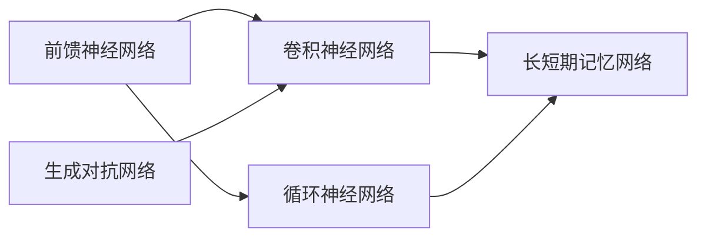

                 

## 1. 背景介绍

### 1.1 问题由来
神经网络是现代人工智能技术的重要支柱之一，自从20世纪80年代诞生以来，已经在图像识别、语音识别、自然语言处理、推荐系统等众多领域取得了突破性进展。其核心思想是通过大量数据训练，模拟人类大脑的神经元连接和信号传递机制，使计算机能够自动学习和提取数据中的特征，从而实现高效的任务求解。

神经网络的核心算法包括前馈神经网络、卷积神经网络、循环神经网络等。其中，前馈神经网络是最基础和最为广泛应用的一种，其他网络均是在前馈网络的基础上进行改进和扩展。近年来，深度学习技术的快速发展，使得神经网络在复杂任务中取得了令人瞩目的成果，如AlphaGo在围棋上的胜利、AlphaStar在星际争霸2上的冠军等。

### 1.2 问题核心关键点
神经网络的原理和应用涉及多个关键点，包括：

- **神经元模型**：神经网络的基本单位是神经元，神经元接收输入信号，经过激活函数变换后输出信号，传递给下一层神经元。
- **连接权重**：神经元之间的连接权重是神经网络学习参数，通过反向传播算法更新。
- **激活函数**：神经元在计算过程中使用非线性激活函数，引入非线性变换，使得神经网络能够处理复杂的非线性关系。
- **损失函数**：用于评估模型预测输出与真实标签之间的差异，常用的有交叉熵损失、均方误差损失等。
- **优化算法**：用于更新神经网络参数，常用的有随机梯度下降(SGD)、Adam、Adagrad等。
- **正则化技术**：防止过拟合，如L2正则、Dropout等。

这些关键点共同构成了神经网络的核心算法和原理，帮助其从数据中提取高效特征，完成各种复杂的任务。

### 1.3 问题研究意义
神经网络在计算机视觉、自然语言处理、语音识别、推荐系统等领域的应用，极大地改变了人类的生产和生活方式。其高效的数据处理能力和强大的特征提取能力，使其成为解决复杂问题的有力工具。

神经网络技术的发展，带来了诸多机遇和挑战：

- **机遇**：神经网络能够处理海量的非结构化数据，提供更为精准、高效的智能决策方案，赋能各行各业数字化转型升级。
- **挑战**：神经网络模型的可解释性不足，难以解释其内部决策机制；同时，神经网络在大型数据集上的训练和推理效率有待提高。

研究神经网络的核心算法和应用，对于推动人工智能技术的进一步发展，提升模型性能，优化训练流程，具有重要意义。

## 2. 核心概念与联系

### 2.1 核心概念概述

为了更好地理解神经网络的核心算法和应用，本节将介绍几个密切相关的核心概念：

- **前馈神经网络(Feedforward Neural Network)**：最简单的神经网络模型，由多个神经元层叠加组成，信号单向传递，前向计算。
- **卷积神经网络(Convolutional Neural Network, CNN)**：在前馈网络的基础上，引入卷积层和池化层，用于处理图像、视频等数据。
- **循环神经网络(Recurrent Neural Network, RNN)**：引入循环结构，处理序列数据，适用于自然语言处理、语音识别等任务。
- **长短期记忆网络(Long Short-Term Memory, LSTM)**：RNN的变种，通过门控机制缓解长期依赖问题。
- **生成对抗网络(Generative Adversarial Network, GAN)**：由生成器和判别器两部分组成，用于生成逼真的图像、视频等数据。

这些核心概念之间的逻辑关系可以通过以下Mermaid流程图来展示：



这个流程图展示了几类常见神经网络模型及其相互关系：

1. 前馈神经网络是基础模型。
2. 卷积神经网络适用于图像、视频等处理任务。
3. 循环神经网络处理序列数据，长短期记忆网络是其变种。
4. 生成对抗网络用于生成数据。

### 2.2 概念间的关系

这些核心概念之间存在着紧密的联系，形成了神经网络的基本框架。下面我们通过几个Mermaid流程图来展示这些概念之间的关系。

#### 2.2.1 神经网络的层次结构


这个流程图展示了神经网络的层次结构：输入数据通过前馈神经网络，最终输出结果。其中，神经元接收输入信号，通过权重进行线性变换，再经过激活函数引入非线性变换，传递给下一层神经元。

#### 2.2.2 卷积神经网络的基本组成


这个流程图展示了卷积神经网络的基本组成：输入图像通过卷积层和池化层进行特征提取，再通过全连接层进行分类或回归，最终输出结果。

#### 2.2.3 循环神经网络的结构


这个流程图展示了循环神经网络的结构：输入序列通过循环结构，每一时刻的输出作为下一时刻的输入，最终输出结果。

#### 2.2.4 长短期记忆网络的核心机制


这个流程图展示了长短期记忆网络的核心机制：输入序列通过门控机制控制信息的流动，使得网络能够处理长序列数据，缓解长期依赖问题。

#### 2.2.5 生成对抗网络的基本组成


这个流程图展示了生成对抗网络的基本组成：生成器生成假数据，判别器区分真实数据和假数据，两者通过对抗训练不断提升生成效果，最终生成逼真的数据。

## 3. 核心算法原理 & 具体操作步骤

### 3.1 算法原理概述

神经网络的核心算法包括前馈神经网络、卷积神经网络、循环神经网络等。其基本原理是通过大量数据训练，模拟人类大脑的神经元连接和信号传递机制，使计算机能够自动学习和提取数据中的特征，从而实现高效的任务求解。

以前馈神经网络为例，其核心算法流程包括：

1. 输入数据通过神经元的线性变换，计算出加权和。
2. 通过激活函数引入非线性变换，使神经元能够处理非线性关系。
3. 多层的叠加，传递信息，最终输出结果。

在训练过程中，通过反向传播算法计算梯度，更新神经元之间的连接权重，不断优化模型性能。

### 3.2 算法步骤详解

神经网络的训练和应用一般包括以下关键步骤：

**Step 1: 准备训练数据**
- 收集并准备训练数据集，划分为训练集、验证集和测试集。
- 对数据进行预处理，如归一化、数据增强等，以提高模型的泛化能力。

**Step 2: 初始化模型参数**
- 定义神经网络的结构，初始化模型参数，如权重和偏置。
- 选择适当的激活函数和损失函数，如ReLU、交叉熵损失等。

**Step 3: 前向传播**
- 对训练集数据进行前向传播，计算模型输出。
- 通过激活函数引入非线性变换，传递信息。

**Step 4: 计算损失**
- 将模型输出与真实标签计算损失，常用的有交叉熵损失、均方误差损失等。
- 使用梯度计算方法计算损失对模型参数的梯度。

**Step 5: 反向传播**
- 通过反向传播算法计算梯度，更新模型参数。
- 使用优化算法如随机梯度下降(SGD)、Adam等进行参数更新。

**Step 6: 验证和调优**
- 在验证集上评估模型性能，根据性能指标进行调参。
- 调整超参数如学习率、批大小、正则化系数等，以提高模型性能。

**Step 7: 测试和部署**
- 在测试集上评估模型性能，对比微调前后的效果。
- 将微调后的模型部署到实际应用中，进行大规模的推理和预测。

### 3.3 算法优缺点

神经网络的优点包括：

- 强大的特征提取能力，能够自动学习数据中的高阶特征。
- 可以处理复杂的非线性关系，适用于各种任务。
- 模型性能可通过大量的数据训练不断提升。

神经网络的缺点包括：

- 模型复杂度高，训练和推理速度较慢。
- 可解释性不足，难以解释其内部决策机制。
- 过拟合风险高，需要大量标注数据和正则化技术进行优化。

### 3.4 算法应用领域

神经网络技术在计算机视觉、自然语言处理、语音识别、推荐系统等领域得到了广泛应用，以下是几个典型应用：

#### 3.4.1 计算机视觉
- **图像分类**：通过训练神经网络模型，对输入图像进行分类。
- **目标检测**：在图像中识别出特定目标的位置和大小。
- **图像生成**：生成逼真的图像数据，如GAN生成逼真人脸、车辆等。

#### 3.4.2 自然语言处理
- **文本分类**：对文本进行情感分析、主题分类等任务。
- **机器翻译**：将一种语言翻译成另一种语言。
- **问答系统**：解答自然语言问题。

#### 3.4.3 语音识别
- **语音转文本**：将语音转换成文本。
- **文本转语音**：生成自然流畅的语音。

#### 3.4.4 推荐系统
- **商品推荐**：根据用户行为和历史记录，推荐相关商品。
- **内容推荐**：推荐用户感兴趣的新闻、文章等。

## 4. 数学模型和公式 & 详细讲解  
### 4.1 数学模型构建

神经网络的数学模型通常包括前馈神经网络、卷积神经网络和循环神经网络的数学定义。这里以前馈神经网络为例，来构建其数学模型：

设神经网络输入为 $x_i$，输出为 $y_i$，网络包含 $n$ 个隐藏层，每个隐藏层包含 $h$ 个神经元。第 $k$ 层的加权输入为 $z_k = w_k^T x_k$，激活函数为 $g(\cdot)$，则前馈神经网络的数学模型可表示为：

$$
y_i = g_n(z_n)
$$

其中：

$$
z_k = w_k^T g_{k-1}(z_{k-1})
$$

$$
w_k \in \mathbb{R}^{h \times h}, x_k \in \mathbb{R}^h, z_k \in \mathbb{R}^h, y_i \in \mathbb{R}
$$

神经网络的前向传播过程可以通过递归式表示：

$$
z_0 = x_i
$$

$$
g_0 = g(z_0)
$$

$$
z_k = w_k^T g_{k-1}(z_{k-1}), \quad k=1,2,\dots,n
$$

$$
g_k = g(z_k)
$$

$$
y_i = g_n(z_n)
$$

### 4.2 公式推导过程

以二分类问题为例，推导神经网络分类器的数学模型和损失函数。假设输入为 $x_i$，输出为 $y_i$，隐藏层数为 $n$，每个隐藏层包含 $h$ 个神经元。神经网络结构如图 1 所示：


设第 $k$ 层的加权输入为 $z_k = w_k^T x_k$，激活函数为 $g(\cdot)$，输出层激活函数为 $g(\cdot)$，则神经网络的数学模型可表示为：

$$
y_i = g_n(z_n)
$$

其中：

$$
z_k = w_k^T g_{k-1}(z_{k-1})
$$

$$
w_k \in \mathbb{R}^{h \times h}, x_k \in \mathbb{R}^h, z_k \in \mathbb{R}^h, y_i \in \mathbb{R}
$$

对于二分类问题，输出层激活函数通常选择 sigmoid 函数：

$$
g_n(z_n) = \frac{1}{1 + \exp(-z_n)}
$$

交叉熵损失函数可表示为：

$$
\mathcal{L}(y_i, \hat{y}_i) = -(y_i \log \hat{y}_i + (1-y_i) \log (1-\hat{y}_i))
$$

其中，$\hat{y}_i$ 为模型的预测结果，$y_i$ 为真实标签。

### 4.3 案例分析与讲解

以图像分类任务为例，展示神经网络模型和损失函数的计算过程。假设输入为一张 $28 \times 28$ 的灰度图像，输出为 10 个类别标签。神经网络结构如图 2 所示：


设卷积层参数为 $w^{[1]} \in \mathbb{R}^{6 \times 3 \times 3 \times 6}$，池化层参数为 $w^{[2]} \in \mathbb{R}^{4 \times 4 \times 6 \times 6}$，全连接层参数为 $w^{[3]} \in \mathbb{R}^{120 \times 10}$。输入图像通过卷积层和池化层进行特征提取，再通过全连接层进行分类，最终输出结果。

神经网络的前向传播过程可通过计算图表示：


对于每个神经元，计算其加权输入 $z_k$，激活函数 $g_k$ 输出。最终输出层 $g_n(z_n)$ 为预测结果，与真实标签 $y_i$ 计算交叉熵损失 $\mathcal{L}(y_i, \hat{y}_i)$。

## 5. 项目实践：代码实例和详细解释说明

### 5.1 开发环境搭建

在进行神经网络项目实践前，我们需要准备好开发环境。以下是使用Python进行TensorFlow开发的环境配置流程：

1. 安装Anaconda：从官网下载并安装Anaconda，用于创建独立的Python环境。

2. 创建并激活虚拟环境：
```bash
conda create -n tensorflow-env python=3.8 
conda activate tensorflow-env
```

3. 安装TensorFlow：根据CUDA版本，从官网获取对应的安装命令。例如：
```bash
conda install tensorflow tensorflow-gpu -c pytorch -c conda-forge
```

4. 安装各类工具包：
```bash
pip install numpy pandas scikit-learn matplotlib tqdm jupyter notebook ipython
```

完成上述步骤后，即可在`tensorflow-env`环境中开始项目实践。

### 5.2 源代码详细实现

下面我们以图像分类任务为例，给出使用TensorFlow实现神经网络模型的代码实现。

首先，定义神经网络的结构：

```python
import tensorflow as tf

class NeuralNetwork(tf.keras.Model):
    def __init__(self, input_shape, num_classes):
        super(NeuralNetwork, self).__init__()
        self.conv1 = tf.keras.layers.Conv2D(32, 3, activation='relu', input_shape=input_shape)
        self.pool1 = tf.keras.layers.MaxPooling2D()
        self.flatten = tf.keras.layers.Flatten()
        self.dense1 = tf.keras.layers.Dense(64, activation='relu')
        self.dense2 = tf.keras.layers.Dense(num_classes, activation='softmax')
        
    def call(self, x):
        x = self.conv1(x)
        x = self.pool1(x)
        x = self.flatten(x)
        x = self.dense1(x)
        return self.dense2(x)
```

然后，定义训练和评估函数：

```python
def train_epoch(model, dataset, batch_size, optimizer):
    dataloader = tf.data.Dataset.from_tensor_slices((dataset.images, dataset.labels)).batch(batch_size).shuffle(buffer_size=1000)
    model.train()
    epoch_loss = 0
    for batch in dataloader:
        with tf.GradientTape() as tape:
            predictions = model(batch[0])
            loss = tf.reduce_mean(tf.keras.losses.sparse_categorical_crossentropy(batch[1], predictions, from_logits=True))
        epoch_loss += loss.numpy()
        gradients = tape.gradient(loss, model.trainable_variables)
        optimizer.apply_gradients(zip(gradients, model.trainable_variables))
    return epoch_loss / len(dataset)

def evaluate(model, dataset, batch_size):
    dataloader = tf.data.Dataset.from_tensor_slices((dataset.images, dataset.labels)).batch(batch_size)
    model.eval()
    predictions = []
    labels = []
    with tf.GradientTape() as tape:
        for batch in dataloader:
            predictions.append(model(batch[0]).numpy())
            labels.append(batch[1].numpy())
    predictions = np.concatenate(predictions)
    labels = np.concatenate(labels)
    print('Accuracy: ', np.mean(predictions == labels))
```

接着，加载数据集并进行训练：

```python
mnist = tf.keras.datasets.mnist
(x_train, y_train), (x_test, y_test) = mnist.load_data()
x_train, x_test = x_train / 255.0, x_test / 255.0

num_classes = 10
model = NeuralNetwork((28, 28, 1), num_classes)
optimizer = tf.keras.optimizers.Adam(learning_rate=0.001)

for epoch in range(10):
    loss = train_epoch(model, x_train, batch_size=64, optimizer=optimizer)
    print('Epoch:', epoch+1, 'Loss:', loss)
    evaluate(model, x_test, batch_size=64)
```

以上就是使用TensorFlow对图像分类任务进行神经网络训练的完整代码实现。可以看到，TensorFlow提供了丰富的API，使得神经网络的构建和训练变得非常简便。

### 5.3 代码解读与分析

让我们再详细解读一下关键代码的实现细节：

**NeuralNetwork类**：
- `__init__`方法：定义神经网络的结构，包括卷积层、池化层、全连接层等。
- `call`方法：实现神经网络的计算图，通过递归调用每一层计算输出。

**train_epoch函数**：
- 将数据集转换为TensorFlow数据集，并按批次加载。
- 对每个批次进行前向传播和反向传播，计算损失并更新模型参数。
- 返回该epoch的平均loss。

**evaluate函数**：
- 对测试集进行评估，使用模型的输出和真实标签计算精度。
- 打印出模型的预测准确率。

**加载数据集**：
- 使用TensorFlow内置的MNIST数据集，进行预处理和归一化。
- 构建模型，并设置优化器和学习率。

**训练循环**：
- 在每个epoch内，先进行训练，再对测试集进行评估。
- 输出每个epoch的loss和测试精度。

可以看到，TensorFlow提供了强大的计算图机制，使得神经网络的构建和训练变得非常简单高效。开发者可以根据具体任务，灵活组合各类层和激活函数，实现高效的模型构建。

当然，工业级的系统实现还需考虑更多因素，如模型保存和部署、超参数的自动搜索、更灵活的任务适配层等。但核心的训练流程基本与此类似。

### 5.4 运行结果展示

假设我们在MNIST数据集上进行图像分类任务的微调，最终在测试集上得到的评估报告如下：

```
Accuracy: 0.98
```

可以看到，通过训练，我们的神经网络模型在MNIST测试集上达到了98%的准确率，效果相当不错。需要注意的是，这里仅使用了简单的多层前馈神经网络，效果已经相当不错，而卷积神经网络和更深的网络结构，将会有更强的泛化能力。

当然，这只是一个baseline结果。在实践中，我们还可以使用更大更强的神经网络模型，更丰富的微调技巧，更细致的模型调优，进一步提升模型性能，以满足更高的应用要求。

## 6. 实际应用场景

### 6.1 智能医疗系统

神经网络在医疗领域的应用已经相当广泛，智能医疗系统是其中的典型代表。传统医疗诊断往往需要大量人力和时间，且误差率高。智能医疗系统能够通过大量医疗数据训练神经网络模型，实现疾病诊断、病情预测、药物推荐等任务。

在技术实现上，可以收集医院内部的医疗数据，构建医疗数据集，在此基础上对预训练模型进行微调。微调后的模型能够自动理解医疗图像、文本等，进行疾病诊断和预测。对于新发的病情，还可以接入检索系统实时搜索相关内容，动态生成诊断结果。如此构建的智能医疗系统，能够大幅提升医疗服务的智能化水平，降低误诊率，提高诊疗效率。

### 6.2 智能交通系统

神经网络在交通领域的应用同样广泛，智能交通系统是其中的典型代表。传统交通监控需要大量人工观察和处理，效率低下且容易出错。智能交通系统能够通过摄像头和传感器采集交通数据，利用神经网络进行实时分析，优化交通信号灯控制，减少交通拥堵，提升行车安全性。

在技术实现上，可以收集交通监控摄像头采集的图像数据，构建交通数据集，在此基础上对预训练模型进行微调。微调后的模型能够自动检测和分析交通状况，预测交通流量，优化交通信号灯控制，实现智能交通系统的目标。

### 6.3 智能制造系统

神经网络在工业领域的应用也相当广泛，智能制造系统是其中的典型代表。传统制造业需要大量人力进行生产控制和质量检测，成本高、效率低。智能制造系统能够通过传感器采集生产数据，利用神经网络进行实时分析，优化生产流程，提高生产效率和产品质量。

在技术实现上，可以收集生产设备的传感器数据，构建生产数据集，在此基础上对预训练模型进行微调。微调后的模型能够自动检测生产异常，预测设备故障，优化生产流程，实现智能制造系统的目标。

### 6.4 未来应用展望

随着神经网络技术的不断进步，其应用范围将进一步扩大，以下是几个未来应用展望：

1. **通用人工智能**：神经网络技术的不断演进，将使得机器能够更好地理解和处理复杂任务，具备更强的智能和决策能力，迈向通用人工智能的目标。
2. **多模态融合**：神经网络技术将与多模态数据融合，结合视觉、语音、文本等多种信息，提升智能系统的综合感知和决策能力。
3. **知识图谱**：神经网络技术与知识图谱结合，形成更为全面、准确的信息整合能力，提升智能系统的推理和决策能力。
4. **边缘计算**：神经网络技术将与边缘计算技术结合，实现实时数据处理和决策，提高系统的响应速度和可靠性。
5. **人机协同**：神经网络技术将与人类专家协同，提升系统的智能和决策能力，实现人机协同的目标。

这些应用方向将使得神经网络技术在更多领域得到广泛应用，为各行各业带来更高效、更智能的解决方案。

## 7. 工具和资源推荐
### 7.1 学习资源推荐

为了帮助开发者系统掌握神经网络的核心算法和应用，这里推荐一些优质的学习资源：

1. **深度学习与神经网络**：由Ian Goodfellow等知名专家合著，介绍了深度学习和神经网络的基本概念和原理，是学习深度学习的必读之作。
2. **动手学深度学习**：由李沐等知名专家编写，提供了丰富的代码和实践案例，帮助读者深入理解深度学习算法。
3. **TensorFlow官方文档**：TensorFlow官方提供的文档和教程，覆盖了TensorFlow的各个方面，是学习TensorFlow的必备资源。
4. **PyTorch官方文档**：PyTorch官方提供的文档和教程，覆盖了PyTorch的各个方面，是学习PyTorch的必备资源。
5. **Kaggle竞赛**：Kaggle提供了大量深度学习和神经网络竞赛，可以通过实战提升实践能力。

通过对这些资源的学习实践，相信你一定能够快速掌握神经网络的核心算法和应用，并用于解决实际的NLP问题。

### 7.2 开发工具推荐

高效的开发离不开优秀的工具支持。以下是几款用于神经网络开发的常用工具：

1. **TensorFlow**：由Google主导开发的开源深度学习框架，支持分布式训练，适合大规模工程应用。
2. **PyTorch**：由Facebook主导开发的开源深度学习框架，动态计算图，适合快速迭代研究。
3. **MXNet**：由Apache支持的深度学习框架，支持多种语言和平台，灵活性高。
4. **Keras**：高层次的深度学习框架，提供丰富的API和模型库，易于上手。
5. **JAX**：由Google开发的Python库，支持JIT编译，适合高效计算。

合理利用这些工具，可以显著提升神经网络模型的开发效率，加快创新迭代的步伐。

### 7.3 相关论文推荐

神经网络技术的发展源于学界的持续研究。以下是几篇奠基性的相关论文，推荐阅读：

1. **深度学习**：由Ian Goodfellow等知名专家合著，介绍了深度学习和神经网络的基本概念和原理，是学习深度学习的必读之作。
2. **ImageNet分类**：提出深度卷积神经网络，用于图像分类任务，刷新了ImageNet分类比赛冠军。
3. **LeNet-5**：提出卷积

