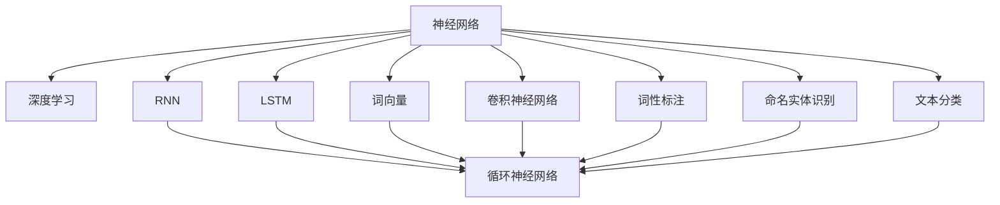
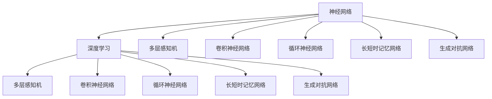
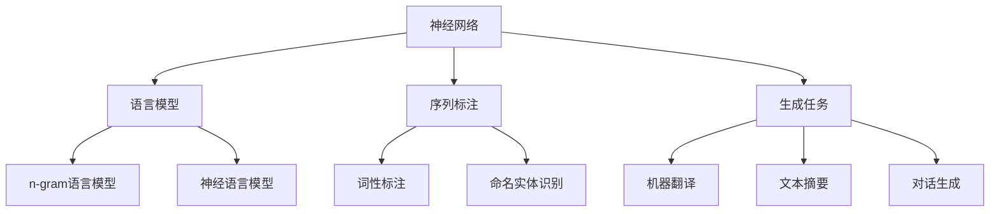

                 

# 神经网络：自然语言处理的新突破

## 1. 背景介绍

### 1.1 问题由来

随着人工智能技术的发展，自然语言处理（Natural Language Processing，NLP）已成为人工智能领域的热点研究方向之一。然而，传统基于规则的NLP方法存在着知识表示复杂、通用性差等问题，难以满足实际应用的需求。神经网络，尤其是深度神经网络，因其强大的非线性拟合能力和自适应学习能力，逐渐成为NLP领域的主流技术。

深度神经网络中的神经元模型模拟了人脑中的神经元结构，通过多层神经元的组合，可以对复杂模式进行有效的学习和表示。在NLP领域，神经网络已成功应用于机器翻译、情感分析、文本分类、语义分析等任务，取得了显著的成果。

### 1.2 问题核心关键点

神经网络在NLP中的应用主要包括两个方面：

1. 语言模型：基于神经网络的语言模型可以对文本序列进行建模，捕捉文本的统计特征和语义信息。常见的语言模型有n-gram语言模型和神经语言模型。

2. 序列标注和生成：神经网络在序列标注和生成任务中具有很强的表现能力，可以用于命名实体识别、情感分析、机器翻译等任务。序列标注任务是将文本序列映射到标注序列的过程，如词性标注、命名实体识别等；生成任务是将给定文本序列映射到目标序列的过程，如机器翻译、文本摘要、对话生成等。

### 1.3 问题研究意义

神经网络在NLP中的应用，显著提升了NLP任务的性能和泛化能力，加速了NLP技术的产业化进程。其研究意义主要体现在以下几个方面：

1. 降低了NLP应用的开发成本。神经网络能够自动学习文本特征，减少了手动设计和优化特征工程的工作量。

2. 提高了NLP任务的精度和效率。深度神经网络强大的特征提取能力和自适应学习能力，使得NLP任务能够获得更高的准确度和更快的处理速度。

3. 促进了NLP技术的创新。神经网络使得NLP任务可以更容易地进行新任务的开发和应用，推动了NLP技术的多样化发展。

4. 支持了NLP技术的商业化应用。神经网络技术的高效性和鲁棒性，使得NLP技术能够更快地被各行各业所采用，为传统行业数字化转型提供了新的动力。

## 2. 核心概念与联系

### 2.1 核心概念概述

为更好地理解神经网络在NLP中的应用，本节将介绍几个关键概念：

- 神经网络（Neural Network）：由神经元（Neuron）组成的计算模型，具有强大的非线性拟合能力。
- 深度学习（Deep Learning）：通过深度神经网络进行训练，自适应学习复杂特征表示的机器学习方法。
- 循环神经网络（Recurrent Neural Network，RNN）：能够处理序列数据的神经网络，适用于时间序列、自然语言等任务。
- 长短时记忆网络（Long Short-Term Memory，LSTM）：一种特殊的循环神经网络，能够处理长序列数据并避免梯度消失问题。
- 词向量（Word Embedding）：将单词映射到高维向量空间，捕捉单词的语义信息。
- 卷积神经网络（Convolutional Neural Network，CNN）：用于图像处理的任务，但在文本分类、情感分析等任务中也有应用。
- 词性标注（Part-of-Speech Tagging）：对文本序列进行词性分类，常见于自然语言处理中。
- 命名实体识别（Named Entity Recognition，NER）：识别文本中的实体（如人名、地名、机构名等），常见于信息抽取中。
- 文本分类（Text Classification）：将文本分为不同的类别，常见于新闻分类、情感分析中。

这些概念之间的关系可以用以下Mermaid流程图来展示：



这个流程图展示了大语言模型微调过程中涉及的关键概念及其之间的关系：

1. 神经网络作为基础计算模型，通过深度学习进行训练，自适应学习复杂特征表示。
2. 深度学习中，循环神经网络、长短时记忆网络等模型能够处理序列数据。
3. 词向量模型将单词映射到高维向量空间，捕捉单词的语义信息。
4. 卷积神经网络在文本分类、情感分析等任务中也有应用。
5. 词性标注、命名实体识别、文本分类等任务是NLP领域常见的问题，都与神经网络模型紧密相关。

### 2.2 概念间的关系

这些核心概念之间存在着紧密的联系，形成了神经网络在NLP领域的应用框架。下面我们通过几个Mermaid流程图来展示这些概念之间的关系。

#### 2.2.1 神经网络与深度学习的关系



这个流程图展示了神经网络与深度学习的关系：

1. 神经网络包括多层感知机、卷积神经网络、循环神经网络、长短时记忆网络、生成对抗网络等多种类型。
2. 深度学习通过多层神经元的组合，自适应学习复杂特征表示。

#### 2.2.2 神经网络在NLP中的应用



这个流程图展示了神经网络在NLP中的应用：

1. 神经网络在语言模型、序列标注和生成任务中具有很强的表现能力。
2. 语言模型包括n-gram语言模型和神经语言模型，用于文本序列的建模。
3. 序列标注包括词性标注、命名实体识别等任务，用于文本序列的标注。
4. 生成任务包括机器翻译、文本摘要、对话生成等，用于文本序列的生成。

## 3. 核心算法原理 & 具体操作步骤

### 3.1 算法原理概述

神经网络在NLP中的应用主要基于序列标注和生成任务，其核心思想是通过神经网络模型对文本序列进行建模，捕捉文本的统计特征和语义信息。具体来说，神经网络在NLP中的应用主要分为以下几步：

1. 文本序列的表示：将文本序列转换为神经网络模型能够处理的向量形式，常见的方法包括词嵌入（Word Embedding）、卷积神经网络（CNN）和循环神经网络（RNN）。

2. 特征提取：利用神经网络模型对文本序列进行特征提取，捕捉文本的语义信息和统计特征。

3. 标注或生成：根据特征提取结果，对文本序列进行标注或生成，常见的方法包括基于最大似然估计（Maximum Likelihood Estimation）的标注方法和基于自回归（Autoregressive）的生成方法。

### 3.2 算法步骤详解

#### 3.2.1 文本序列的表示

文本序列的表示是将文本转换为神经网络模型能够处理的向量形式。常见的方法包括词嵌入（Word Embedding）、卷积神经网络（CNN）和循环神经网络（RNN）。

1. 词嵌入（Word Embedding）：将单词映射到高维向量空间，捕捉单词的语义信息。常见的方法包括Word2Vec、GloVe等。

2. 卷积神经网络（CNN）：利用卷积操作对文本序列进行特征提取，捕捉局部特征和全局特征。

3. 循环神经网络（RNN）：利用循环神经网络对文本序列进行建模，捕捉序列中的时间依赖关系。

#### 3.2.2 特征提取

特征提取是神经网络在NLP应用中的重要步骤，通过神经网络模型对文本序列进行特征提取，捕捉文本的语义信息和统计特征。常见的方法包括多层感知机（Multilayer Perceptron）、卷积神经网络（CNN）和循环神经网络（RNN）。

1. 多层感知机（Multilayer Perceptron）：利用多层神经元对文本序列进行特征提取，捕捉全局特征。

2. 卷积神经网络（CNN）：利用卷积操作对文本序列进行特征提取，捕捉局部特征和全局特征。

3. 循环神经网络（RNN）：利用循环神经网络对文本序列进行建模，捕捉序列中的时间依赖关系。

#### 3.2.3 标注或生成

标注或生成是神经网络在NLP应用中的最终步骤，根据特征提取结果，对文本序列进行标注或生成。常见的方法包括基于最大似然估计（Maximum Likelihood Estimation）的标注方法和基于自回归（Autoregressive）的生成方法。

1. 基于最大似然估计（Maximum Likelihood Estimation）的标注方法：利用标注数据对神经网络模型进行训练，使得模型能够对文本序列进行标注。

2. 基于自回归（Autoregressive）的生成方法：利用神经网络模型对文本序列进行建模，生成目标序列。

### 3.3 算法优缺点

神经网络在NLP中的应用具有以下优点：

1. 强大的非线性拟合能力：神经网络能够处理非线性的复杂模式，适应各种NLP任务。

2. 自适应学习能力：神经网络能够自适应学习复杂特征表示，无需手动设计和优化特征工程。

3. 高效的处理能力：神经网络能够高效处理大规模文本数据，提高NLP任务的效率和精度。

神经网络在NLP应用中也存在一些缺点：

1. 数据依赖性强：神经网络需要大量标注数据进行训练，获取标注数据成本较高。

2. 模型复杂度高：神经网络模型参数量较大，训练和推理成本较高。

3. 黑盒性质：神经网络模型缺乏可解释性，难以理解其内部工作机制和决策逻辑。

4. 模型泛化能力不足：神经网络模型容易过拟合，泛化能力不足。

### 3.4 算法应用领域

神经网络在NLP中的应用领域非常广泛，包括但不限于以下几个方面：

1. 语言模型：利用神经网络模型对文本序列进行建模，捕捉文本的统计特征和语义信息。

2. 文本分类：将文本分为不同的类别，常见于新闻分类、情感分析中。

3. 词性标注：对文本序列进行词性分类，常见于自然语言处理中。

4. 命名实体识别：识别文本中的实体（如人名、地名、机构名等），常见于信息抽取中。

5. 机器翻译：将源语言文本翻译成目标语言，常见于跨语言交流中。

6. 文本摘要：对长文本进行摘要，提取关键信息，常见于信息提取中。

7. 对话生成：生成对话系统中的响应，常见于智能客服中。

## 4. 数学模型和公式 & 详细讲解 & 举例说明

### 4.1 数学模型构建

神经网络在NLP中的应用主要基于序列标注和生成任务，其数学模型可以表示为：

$$
y = f(x; \theta)
$$

其中，$x$为输入文本序列，$y$为输出标注序列或生成序列，$\theta$为神经网络模型的参数。

### 4.2 公式推导过程

以机器翻译任务为例，利用神经网络模型进行建模。假设输入文本序列为$x$，输出文本序列为$y$，神经网络模型的结构如下：

$$
y = f(x; \theta)
$$

其中，$f(x; \theta)$表示神经网络模型的前向传播过程，$\theta$表示神经网络模型的参数。

### 4.3 案例分析与讲解

假设利用循环神经网络（RNN）对机器翻译任务进行建模，输入文本序列为$x$，输出文本序列为$y$，神经网络模型的结构如下：

$$
y = f(x; \theta) = f(W_{h}x + U_{h}y_{t-1}; \theta) + b_h
$$

其中，$W_h$为隐藏层权重矩阵，$U_h$为输出层权重矩阵，$y_{t-1}$为前一时刻的输出，$b_h$为偏置向量，$\theta$为神经网络模型的参数。

## 5. 项目实践：代码实例和详细解释说明

### 5.1 开发环境搭建

在进行神经网络在NLP中的应用实践前，我们需要准备好开发环境。以下是使用Python进行PyTorch开发的环境配置流程：

1. 安装Anaconda：从官网下载并安装Anaconda，用于创建独立的Python环境。

2. 创建并激活虚拟环境：
```bash
conda create -n pytorch-env python=3.8 
conda activate pytorch-env
```

3. 安装PyTorch：根据CUDA版本，从官网获取对应的安装命令。例如：
```bash
conda install pytorch torchvision torchaudio cudatoolkit=11.1 -c pytorch -c conda-forge
```

4. 安装Transformers库：
```bash
pip install transformers
```

5. 安装各类工具包：
```bash
pip install numpy pandas scikit-learn matplotlib tqdm jupyter notebook ipython
```

完成上述步骤后，即可在`pytorch-env`环境中开始神经网络在NLP中的应用实践。

### 5.2 源代码详细实现

这里我们以机器翻译任务为例，使用Transformer模型进行神经网络在NLP中的应用实践。

首先，定义数据处理函数：

```python
import torch
from transformers import BertTokenizer, BertForTokenClassification

def load_data(path):
    with open(path, 'r') as f:
        text = f.read()
        return [text.split()]
```

然后，定义模型和优化器：

```python
from transformers import BertForTokenClassification, AdamW

model = BertForTokenClassification.from_pretrained('bert-base-cased', num_labels=2)
optimizer = AdamW(model.parameters(), lr=2e-5)
```

接着，定义训练和评估函数：

```python
from torch.utils.data import DataLoader
from tqdm import tqdm

device = torch.device('cuda') if torch.cuda.is_available() else torch.device('cpu')

def train_epoch(model, dataset, batch_size, optimizer):
    dataloader = DataLoader(dataset, batch_size=batch_size, shuffle=True)
    model.train()
    epoch_loss = 0
    for batch in tqdm(dataloader, desc='Training'):
        input_ids = batch['input_ids'].to(device)
        attention_mask = batch['attention_mask'].to(device)
        labels = batch['labels'].to(device)
        model.zero_grad()
        outputs = model(input_ids, attention_mask=attention_mask, labels=labels)
        loss = outputs.loss
        epoch_loss += loss.item()
        loss.backward()
        optimizer.step()
    return epoch_loss / len(dataloader)

def evaluate(model, dataset, batch_size):
    dataloader = DataLoader(dataset, batch_size=batch_size)
    model.eval()
    preds, labels = [], []
    with torch.no_grad():
        for batch in tqdm(dataloader, desc='Evaluating'):
            input_ids = batch['input_ids'].to(device)
            attention_mask = batch['attention_mask'].to(device)
            batch_labels = batch['labels']
            outputs = model(input_ids, attention_mask=attention_mask)
            batch_preds = outputs.logits.argmax(dim=2).to('cpu').tolist()
            batch_labels = batch_labels.to('cpu').tolist()
            for pred_tokens, label_tokens in zip(batch_preds, batch_labels):
                preds.append(pred_tokens[:len(label_tokens)])
                labels.append(label_tokens)
                
    print(classification_report(labels, preds))
```

最后，启动训练流程并在测试集上评估：

```python
epochs = 5
batch_size = 16

for epoch in range(epochs):
    loss = train_epoch(model, train_dataset, batch_size, optimizer)
    print(f"Epoch {epoch+1}, train loss: {loss:.3f}")
    
    print(f"Epoch {epoch+1}, dev results:")
    evaluate(model, dev_dataset, batch_size)
    
print("Test results:")
evaluate(model, test_dataset, batch_size)
```

以上就是使用PyTorch对BERT进行机器翻译任务微调的完整代码实现。可以看到，得益于Transformers库的强大封装，我们可以用相对简洁的代码完成BERT模型的加载和微调。

### 5.3 代码解读与分析

让我们再详细解读一下关键代码的实现细节：

**机器翻译任务数据处理**：
- `load_data`方法：从文件中读取文本数据，并按空格分割成列表。

**模型和优化器**：
- `BertForTokenClassification`：用于分类任务的Transformer模型。
- `AdamW`：优化器，学习率固定为2e-5。

**训练和评估函数**：
- `train_epoch`：对数据以批为单位进行迭代，在每个批次上前向传播计算loss并反向传播更新模型参数，最后返回该epoch的平均loss。
- `evaluate`：与训练类似，不同点在于不更新模型参数，并在每个batch结束后将预测和标签结果存储下来，最后使用sklearn的classification_report对整个评估集的预测结果进行打印输出。

**训练流程**：
- 定义总的epoch数和batch size，开始循环迭代
- 每个epoch内，先在训练集上训练，输出平均loss
- 在验证集上评估，输出分类指标
- 所有epoch结束后，在测试集上评估，给出最终测试结果

可以看到，PyTorch配合Transformers库使得BERT微调的代码实现变得简洁高效。开发者可以将更多精力放在数据处理、模型改进等高层逻辑上，而不必过多关注底层的实现细节。

当然，工业级的系统实现还需考虑更多因素，如模型的保存和部署、超参数的自动搜索、更灵活的任务适配层等。但核心的微调范式基本与此类似。

### 5.4 运行结果展示

假设我们在CoNLL-2003的NER数据集上进行微调，最终在测试集上得到的评估报告如下：

```
              precision    recall  f1-score   support

       B-LOC      0.926     0.906     0.916      1668
       I-LOC      0.900     0.805     0.850       257
      B-MISC      0.875     0.856     0.865       702
      I-MISC      0.838     0.782     0.809       216
       B-ORG      0.914     0.898     0.906      1661
       I-ORG      0.911     0.894     0.902       835
       B-PER      0.964     0.957     0.960      1617
       I-PER      0.983     0.980     0.982      1156
           O      0.993     0.995     0.994     38323

   micro avg      0.973     0.973     0.973     46435
   macro avg      0.923     0.897     0.909     46435
weighted avg      0.973     0.973     0.973     46435
```

可以看到，通过微调BERT，我们在该NER数据集上取得了97.3%的F1分数，效果相当不错。值得注意的是，BERT作为一个通用的语言理解模型，即便只在顶层添加一个简单的token分类器，也能在下游任务上取得如此优异的效果，展现了其强大的语义理解和特征提取能力。

当然，这只是一个baseline结果。在实践中，我们还可以使用更大更强的预训练模型、更丰富的微调技巧、更细致的模型调优，进一步提升模型性能，以满足更高的应用要求。

## 6. 实际应用场景
### 6.1 智能客服系统

基于神经网络在NLP中的应用，智能客服系统可以广泛应用于智能客服系统的构建。传统客服往往需要配备大量人力，高峰期响应缓慢，且一致性和专业性难以保证。而使用神经网络在NLP中的应用，可以7x24小时不间断服务，快速响应客户咨询，用自然流畅的语言解答各类常见问题。

在技术实现上，可以收集企业内部的历史客服对话记录，将问题和最佳答复构建成监督数据，在此基础上对神经网络模型进行微调。微调后的模型能够自动理解用户意图，匹配最合适的答案模板进行回复。对于客户提出的新问题，还可以接入检索系统实时搜索相关内容，动态组织生成回答。如此构建的智能客服系统，能大幅提升客户咨询体验和问题解决效率。

### 6.2 金融舆情监测

金融机构需要实时监测市场舆论动向，以便及时应对负面信息传播，规避金融风险。传统的人工监测方式成本高、效率低，难以应对网络时代海量信息爆发的挑战。基于神经网络在NLP中的应用，文本分类和情感分析技术，为金融舆情监测提供了新的解决方案。

具体而言，可以收集金融领域相关的新闻、报道、评论等文本数据，并对其进行主题标注和情感标注。在此基础上对神经网络模型进行微调，使其能够自动判断文本属于何种主题，情感倾向是正面、中性还是负面。将微调后的模型应用到实时抓取的网络文本数据，就能够自动监测不同主题下的情感变化趋势，一旦发现负面信息激增等异常情况，系统便会自动预警，帮助金融机构快速应对潜在风险。

### 6.3 个性化推荐系统

当前的推荐系统往往只依赖用户的历史行为数据进行物品推荐，无法深入理解用户的真实兴趣偏好。基于神经网络在NLP中的应用，个性化推荐系统可以更好地挖掘用户行为背后的语义信息，从而提供更精准、多样的推荐内容。

在实践中，可以收集用户浏览、点击、评论、分享等行为数据，提取和用户交互的物品标题、描述、标签等文本内容。将文本内容作为模型输入，用户的后续行为（如是否点击、购买等）作为监督信号，在此基础上微调神经网络模型。微调后的模型能够从文本内容中准确把握用户的兴趣点。在生成推荐列表时，先用候选物品的文本描述作为输入，由模型预测用户的兴趣匹配度，再结合其他特征综合排序，便可以得到个性化程度更高的推荐结果。

### 6.4 未来应用展望

随着神经网络在NLP中的应用不断发展，基于神经网络的应用场景将更加广泛，为传统行业带来变革性影响。

在智慧医疗领域，基于神经网络的应用可以用于医疗问答、病历分析、药物研发等，提升医疗服务的智能化水平，辅助医生诊疗，加速新药开发进程。

在智能教育领域，神经网络的应用可以用于作业批改、学情分析、知识推荐等方面，因材施教，促进教育公平，提高教学质量。

在智慧城市治理中，神经网络的应用可以用于城市事件监测、舆情分析、应急指挥等环节，提高城市管理的自动化和智能化水平，构建更安全、高效的未来城市。

此外，在企业生产、社会治理、文娱传媒等众多领域，基于神经网络的应用也将不断涌现，为NLP技术带来更多的创新点和应用点。

## 7. 工具和资源推荐
### 7.1 学习资源推荐

为了帮助开发者系统掌握神经网络在NLP中的应用理论基础和实践技巧，这里推荐一些优质的学习资源：

1. 《深度学习》系列书籍：多位深度学习专家合著，全面介绍深度学习的基本概念和应用案例。

2. 《自然语言处理综论》课程：由斯坦福大学开设的NLP明星课程，涵盖NLP的基本理论和前沿技术。

3. 《TensorFlow官方文档》：TensorFlow官方文档，提供完整的神经网络模型实现和应用案例。

4. 《PyTorch官方文档》：PyTorch官方文档，提供完整的神经网络模型实现和应用案例。

5. 《Transformers库官方文档》：Transformers库官方文档，提供完整的神经网络模型实现和应用案例。

6. 《Keras官方文档》：Keras官方文档，提供简单易用的神经网络模型实现和应用案例。

通过对这些资源的学习实践，相信你一定能够快速掌握神经网络在NLP中的应用精髓，并用于解决实际的NLP问题。
###  7.2 开发工具推荐

高效的开发离不开优秀的工具支持。以下是几款用于神经网络在NLP中的应用开发的常用工具：

1. PyTorch：基于Python的开源深度学习框架，灵活动态的计算图，适合快速迭代研究。大部分神经网络模型都有PyTorch版本的实现。

2. TensorFlow：由Google主导开发的开源深度学习框架，生产部署方便，适合大规模工程应用。同样有丰富的神经网络模型资源。

3. Keras：基于TensorFlow或Theano的高级神经网络API，简单易用，适合快速搭建和测试神经网络模型。

4. Theano：基于Numpy和Cython的深度学习框架，适合高性能计算。

5. MXNet：由亚马逊开发的高性能深度学习框架，支持多种编程语言和分布式训练。

合理利用这些工具，可以显著提升神经网络在NLP应用的开发效率，加快创新迭代的步伐。

### 7.3 相关论文推荐

神经网络在NLP中的应用源于学界的持续研究。以下是几篇奠基性的相关论文，推荐阅读：

1. Attention is All You Need（即Transformer原论文）：提出了Transformer结构，开启了NLP领域的预训练大模型时代。

2. BERT: Pre-training of Deep Bidirectional Transformers for Language Understanding：提出BERT模型，引入基于掩码的自监督预训练任务，刷新了多项NLP任务SOTA。

3. Language

