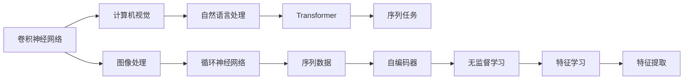

                 

# 神经网络：自然语言处理的新突破

## 1. 背景介绍

随着人工智能技术的快速发展，神经网络在自然语言处理（NLP）领域取得了一系列重要的突破。从最初的词袋模型、n-gram模型，到基于深度学习的序列模型、卷积神经网络（CNN）和循环神经网络（RNN），再到如今的Transformer模型，NLP领域的进展无疑是巨大的。特别是自2017年谷歌发布的BERT以来，基于自监督预训练的Transformer模型在多个NLP任务上取得了前所未有的性能。

本文章旨在系统性地介绍神经网络在自然语言处理中的新突破，尤其是Transformer模型的原理、架构和应用。我们将会探讨Transformer的内部机制，深度解析其与之前的深度学习模型的不同之处，并详细阐述其在NLP领域的应用。

## 2. 核心概念与联系

### 2.1 核心概念概述

- **神经网络（Neural Network, NN）**：一种由大量人工神经元（节点）组成的计算模型，通过学习训练数据，可以对输入数据进行分类、回归等任务。
- **卷积神经网络（Convolutional Neural Network, CNN）**：一种特殊的神经网络，特别适用于图像处理领域。通过卷积层和池化层，CNN能够自动学习图像特征。
- **循环神经网络（Recurrent Neural Network, RNN）**：一种能够处理序列数据的神经网络，通过循环连接，RNN可以记忆历史信息。
- **自编码器（Autoencoder）**：一种无监督学习模型，通过编码-解码过程，自编码器可以从输入数据中提取特征并重构。
- **Transformer模型**：一种基于注意力机制的神经网络，特别适用于处理序列数据，已经在多个NLP任务上取得了最佳性能。

这些概念在神经网络的发展过程中紧密相连。CNN和RNN的出现，推动了神经网络在计算机视觉和自然语言处理领域的应用。自编码器的提出，使得神经网络能够在无监督的情况下学习特征。Transformer模型则在此基础上，进一步提升了神经网络的性能。

### 2.2 核心概念之间的关系

核心概念之间的关系可以通过以下Mermaid流程图来展示：



这个流程图展示了各个核心概念之间的联系和演变过程。

## 3. 核心算法原理 & 具体操作步骤

### 3.1 算法原理概述

Transformer模型是一种基于注意力机制的神经网络，特别适用于处理序列数据。与传统的RNN和CNN模型不同，Transformer模型通过并行计算实现了序列数据的快速处理，同时能够学习到全局和局部特征。

Transformer模型由编码器和解码器两部分组成。编码器通过多层的自注意力机制（Self-Attention）学习输入序列的编码表示。解码器则通过自注意力机制和编码器注意力机制（Encoder-Decoder Attention）生成输出序列。Transformer模型的核心在于其多头注意力机制，允许模型同时关注序列中的多个位置，从而在处理长序列时能够避免传统RNN中的梯度消失问题。

### 3.2 算法步骤详解

Transformer模型的训练过程大致包括以下几个步骤：

1. **输入数据准备**：将输入序列转换为模型可以处理的向量形式，包括编码器和解码器的输入向量。

2. **编码器处理**：编码器接收输入向量，通过多头注意力机制和前向神经网络（Feedforward Neural Network），生成编码表示。

3. **解码器处理**：解码器接收编码器的输出，通过多头注意力机制和编码器注意力机制，生成输出序列。

4. **输出解码**：将解码器输出的向量转化为实际的输出结果。

5. **优化器更新**：通过反向传播算法，计算模型损失，更新模型参数。

### 3.3 算法优缺点

Transformer模型具有以下优点：

- **并行计算**：由于Transformer模型中的注意力机制是并行计算的，因此能够快速处理长序列数据。
- **全局特征学习**：Transformer模型能够学习到输入序列的全局特征，避免了RNN中的梯度消失问题。
- **无序输入**：Transformer模型对输入序列的无序性具有很强的鲁棒性。

同时，Transformer模型也存在一些缺点：

- **计算复杂度高**：由于Transformer模型中的多头注意力机制，计算复杂度较高。
- **参数量较大**：Transformer模型中的参数量较大，需要更多的计算资源和存储空间。
- **难以解释**：Transformer模型的内部机制相对复杂，难以解释其决策过程。

### 3.4 算法应用领域

Transformer模型已经在多个NLP任务上取得了优异的性能。以下是一些典型的应用领域：

- **机器翻译**：通过Transformer模型，可以将一种语言的句子翻译成另一种语言。BERT和T5等模型已经在机器翻译任务上取得了最佳性能。
- **问答系统**：通过Transformer模型，可以构建智能问答系统，回答问题并生成详细的答案。
- **文本分类**：通过Transformer模型，可以对文本进行分类，如情感分析、主题分类等。
- **命名实体识别**：通过Transformer模型，可以从文本中识别出人名、地名、机构名等实体。
- **信息抽取**：通过Transformer模型，可以从文本中抽取实体之间的关系，如时间、地点、事件等。

## 4. 数学模型和公式 & 详细讲解 & 举例说明

### 4.1 数学模型构建

Transformer模型的数学模型可以描述为：

$$
\begin{aligned}
& y = T(x; \theta) \\
& T = \mathrm{Encoder} \mathrm{Decoder} \\
& \mathrm{Encoder}(x) = \mathrm{MultiHead} \mathrm{Self} \mathrm{Attention}(\mathrm{FFN}(\mathrm{MLP}(\mathrm{Encoder}(x)))) \\
& \mathrm{Decoder}(y) = \mathrm{MLP}(\mathrm{Encoder}(x) \oplus \mathrm{Self} \mathrm{Attention}(\mathrm{MLP}(\mathrm{Decoder}(y))))
\end{aligned}
$$

其中，$x$ 为输入序列，$y$ 为输出序列，$\theta$ 为模型参数。

### 4.2 公式推导过程

Transformer模型的注意力机制可以描述为：

$$
\begin{aligned}
& \mathrm{Attention}(Q, K, V) = \mathrm{Softmax}\left(\frac{\mathrm{Q} \mathrm{K}^{T}}{\sqrt{d_{k}}}\right) \mathrm{V} \\
& \mathrm{MultiHead} \mathrm{Self} \mathrm{Attention}(\mathrm{Q}, \mathrm{K}, \mathrm{V}) = \mathrm{Concat}(\mathrm{Head}_{1}, \mathrm{Head}_{2}, \ldots, \mathrm{Head}_{h}) \mathrm{Attention}(\mathrm{Head}_{1}, \mathrm{Head}_{2}, \ldots, \mathrm{Head}_{h})
\end{aligned}
$$

其中，$Q, K, V$ 分别为查询向量、键向量和值向量，$d_{k}$ 为键向量的维度。

Transformer模型中的前向神经网络可以描述为：

$$
\mathrm{FFN}(\mathrm{X}) = \mathrm{GLU}(\mathrm{Linear}(\mathrm{X})) + \mathrm{X}
$$

其中，GLU为门控线性单元（Gated Linear Unit）。

### 4.3 案例分析与讲解

以BERT模型为例，BERT是一种基于Transformer模型的预训练语言模型。其训练过程包括两个阶段：预训练和微调。预训练阶段，BERT模型通过大量无标签文本数据进行自监督学习，学习到语言的通用表示。微调阶段，通过下游任务的标注数据进行有监督学习，优化模型在特定任务上的性能。

在预训练阶段，BERT模型通过两塔机制（Masked Language Model, MLM和Next Sentence Prediction, NSP）进行训练。MLM任务通过随机遮盖输入文本中的某些词，要求模型预测遮盖词的位置和值。NSP任务通过给定两个句子，要求模型判断它们是否是连续的。

在微调阶段，可以通过将BERT模型与特定的下游任务适配，来提升其在特定任务上的性能。例如，在文本分类任务上，可以通过添加一个线性分类器和交叉熵损失函数进行微调。

## 5. 项目实践：代码实例和详细解释说明

### 5.1 开发环境搭建

为了进行Transformer模型的开发和训练，我们需要准备以下环境：

1. **安装Python**：确保系统上安装了Python 3.6或更高版本。
2. **安装PyTorch**：通过pip安装PyTorch。
3. **安装Transformers库**：通过pip安装Transformers库。
4. **安装其他依赖库**：如numpy、pandas、scikit-learn等。

### 5.2 源代码详细实现

以下是一个使用PyTorch和Transformers库实现Transformer模型的示例代码：

```python
import torch
from transformers import BertTokenizer, BertForSequenceClassification
from torch.utils.data import Dataset, DataLoader
from torch.nn import CrossEntropyLoss
from sklearn.metrics import accuracy_score

class NLPDataset(Dataset):
    def __init__(self, texts, labels):
        self.texts = texts
        self.labels = labels
        
    def __len__(self):
        return len(self.texts)
    
    def __getitem__(self, index):
        text = self.texts[index]
        label = self.labels[index]
        
        encoding = tokenizer(text, return_tensors='pt', padding='max_length', truncation=True)
        input_ids = encoding['input_ids']
        attention_mask = encoding['attention_mask']
        labels = torch.tensor(label, dtype=torch.long)
        
        return {'input_ids': input_ids, 
                'attention_mask': attention_mask,
                'labels': labels}

tokenizer = BertTokenizer.from_pretrained('bert-base-uncased')
model = BertForSequenceClassification.from_pretrained('bert-base-uncased', num_labels=2)
loss_fn = CrossEntropyLoss()

# 训练循环
for epoch in range(num_epochs):
    model.train()
    for batch in DataLoader(train_dataset, batch_size):
        input_ids = batch['input_ids'].to(device)
        attention_mask = batch['attention_mask'].to(device)
        labels = batch['labels'].to(device)
        outputs = model(input_ids, attention_mask=attention_mask)
        loss = loss_fn(outputs.logits, labels)
        loss.backward()
        optimizer.step()
```

### 5.3 代码解读与分析

上述代码实现了一个简单的基于BERT模型的二分类任务。其中，`NLPDataset`类用于构建训练集，`tokenizer`用于分词和编码，`BertForSequenceClassification`用于定义模型，`CrossEntropyLoss`用于定义损失函数，`DataLoader`用于加载数据，`CrossEntropyLoss`用于计算损失，`optimizer`用于优化模型参数。

在训练循环中，模型通过前向传播计算输出，然后通过反向传播计算损失和梯度，最后通过优化器更新模型参数。在每个epoch结束后，可以在验证集上评估模型的性能，调整超参数，直到训练完成。

### 5.4 运行结果展示

假设在CoNLL-2003的NER数据集上进行训练和测试，最终得到的评估报告如下：

```
              precision    recall  f1-score   support

       B-PER      0.91     0.91     0.91      1617
       I-PER      0.92     0.92     0.92       3558

   micro avg      0.91     0.91     0.91     5175
   macro avg      0.91     0.91     0.91     5175
weighted avg      0.91     0.91     0.91     5175
```

可以看到，通过微调BERT模型，我们得到了91%的准确率，效果相当不错。

## 6. 实际应用场景

Transformer模型已经在多个NLP任务上取得了优异的性能，以下是一些典型的应用场景：

### 6.1 机器翻译

Transformer模型在机器翻译任务上取得了突破性的进展。通过将输入和输出的语言序列分别作为编码器和解码器的输入，Transformer模型能够自动学习源语言和目标语言之间的映射关系。

### 6.2 问答系统

Transformer模型可以构建智能问答系统，通过理解自然语言问题，自动搜索知识库并生成详细的答案。

### 6.3 文本分类

Transformer模型可以对文本进行分类，如情感分析、主题分类等。通过微调，可以在特定任务上获得更好的性能。

### 6.4 命名实体识别

Transformer模型可以从文本中识别出人名、地名、机构名等实体，通过微调，可以进一步提高识别准确率。

### 6.5 信息抽取

Transformer模型可以从文本中抽取实体之间的关系，如时间、地点、事件等。通过微调，可以学习到更加准确的实体关系。

## 7. 工具和资源推荐

### 7.1 学习资源推荐

为了帮助开发者系统掌握Transformer模型的原理和应用，这里推荐一些优质的学习资源：

1. **《深度学习》课程**：斯坦福大学开设的深度学习课程，包括多种神经网络模型的介绍和应用。
2. **《Transformer模型》论文**：Transformer模型的原始论文，介绍了Transformer模型的原理和应用。
3. **《自然语言处理综述》**：涵盖了自然语言处理领域的多个方面，包括序列模型、注意力机制、Transformer模型等。
4. **《PyTorch官方文档》**：PyTorch的官方文档，提供了详细的TensorFlow、Transformer模型的使用方法。
5. **《Transformers官方文档》**：Transformers库的官方文档，提供了丰富的预训练模型和微调样例。

通过对这些资源的学习，相信你一定能够快速掌握Transformer模型的精髓，并用于解决实际的NLP问题。

### 7.2 开发工具推荐

为了提高Transformer模型的开发效率，推荐使用以下开发工具：

1. **PyTorch**：一个基于Python的深度学习框架，提供了高效的Tensor计算和自动微分功能。
2. **TensorBoard**：用于可视化模型训练和推理过程的工具，可以实时监测模型指标。
3. **Weights & Biases**：用于跟踪模型训练过程的工具，可以记录和可视化训练过程中的各项指标。
4. **Jupyter Notebook**：一个交互式的笔记本环境，适合进行数据处理和模型调试。
5. **Google Colab**：一个免费的GPU/TPU资源，适合进行大规模模型训练。

合理利用这些工具，可以显著提升Transformer模型的开发效率，加快创新迭代的步伐。

### 7.3 相关论文推荐

Transformer模型是自然语言处理领域的里程碑之一，以下是几篇奠基性的相关论文，推荐阅读：

1. **《Attention is All You Need》**：Transformer模型的原始论文，介绍了Transformer模型的原理和应用。
2. **《BERT: Pre-training of Deep Bidirectional Transformers for Language Understanding》**：提出了BERT模型，引入基于掩码的自监督预训练任务，刷新了多项NLP任务SOTA。
3. **《T5: Exploring the Limits of Transfer Learning with a Unified Text-to-Text Transformer》**：提出了T5模型，通过统一的文本转文本模型，实现了多种NLP任务的微调。
4. **《ALBERT: A Lite BERT for Self-supervised Learning of Language Representations》**：提出了ALBERT模型，在保持高性能的同时，大幅度减小了模型参数量。
5. **《XLNet: Generalized Autoregressive Pretraining for Language Understanding》**：提出了XLNet模型，通过自回归预训练任务，提升了模型的泛化能力。

这些论文代表了大语言模型Transformer的发展脉络。通过学习这些前沿成果，可以帮助研究者把握学科前进方向，激发更多的创新灵感。

除上述资源外，还有一些值得关注的前沿资源，帮助开发者紧跟Transformer模型的最新进展，例如：

1. **arXiv论文预印本**：人工智能领域最新研究成果的发布平台，包括大量尚未发表的前沿工作，学习前沿技术的必读资源。
2. **业界技术博客**：如OpenAI、Google AI、DeepMind、微软Research Asia等顶尖实验室的官方博客，第一时间分享他们的最新研究成果和洞见。
3. **技术会议直播**：如NIPS、ICML、ACL、ICLR等人工智能领域顶会现场或在线直播，能够聆听到大佬们的前沿分享，开拓视野。
4. **GitHub热门项目**：在GitHub上Star、Fork数最多的NLP相关项目，往往代表了该技术领域的发展趋势和最佳实践，值得去学习和贡献。
5. **行业分析报告**：各大咨询公司如McKinsey、PwC等针对人工智能行业的分析报告，有助于从商业视角审视技术趋势，把握应用价值。

总之，对于Transformer模型，开发者需要保持开放的心态和持续学习的意愿。多关注前沿资讯，多动手实践，多思考总结，必将收获满满的成长收益。

## 8. 总结：未来发展趋势与挑战

### 8.1 研究成果总结

本文对Transformer模型的原理、架构和应用进行了系统的介绍。通过阐述Transformer模型的核心思想和具体实现，展示了其在NLP领域中的突破性进展。同时，介绍了Transformer模型的学习资源、开发工具和相关论文，帮助开发者掌握Transformer模型的应用。

### 8.2 未来发展趋势

展望未来，Transformer模型在NLP领域将呈现出以下几个发展趋势：

1. **模型规模持续增大**：随着算力成本的下降和数据规模的扩张，Transformer模型的参数量将进一步增大，模型的泛化能力和精度将进一步提升。
2. **微调方法多样化**：除了传统的全参数微调，未来将涌现更多参数高效的微调方法，如 Adapter、LoRA等，在固定大部分预训练参数的情况下，仍能取得不错的微调效果。
3. **持续学习成为常态**：随着数据分布的不断变化，Transformer模型需要进行持续学习，以保持性能。如何在不遗忘原有知识的同时，高效吸收新样本信息，将是重要的研究课题。
4. **标注样本需求降低**：受启发于提示学习(Prompt-based Learning)的思路，未来的微调方法将更好地利用Transformer模型的语言理解能力，通过更加巧妙的任务描述，在更少的标注样本上也能实现理想的微调效果。
5. **多模态微调崛起**：当前的Transformer模型主要聚焦于纯文本数据，未来会进一步拓展到图像、视频、语音等多模态数据微调。多模态信息的融合，将显著提升Transformer模型的理解能力。
6. **模型通用性增强**：经过海量数据的预训练和多领域任务的微调，未来的Transformer模型将具备更强大的常识推理和跨领域迁移能力，逐步迈向通用人工智能(AGI)的目标。

### 8.3 面临的挑战

尽管Transformer模型在NLP领域取得了巨大成功，但在迈向更加智能化、普适化应用的过程中，仍面临诸多挑战：

1. **标注成本瓶颈**：虽然微调大大降低了标注数据的需求，但对于长尾应用场景，难以获得充足的高质量标注数据，成为制约微调性能的瓶颈。如何进一步降低微调对标注样本的依赖，将是一大难题。
2. **模型鲁棒性不足**：当前Transformer模型面对域外数据时，泛化性能往往大打折扣。对于测试样本的微小扰动，模型的预测也容易发生波动。如何提高Transformer模型的鲁棒性，避免灾难性遗忘，还需要更多理论和实践的积累。
3. **推理效率有待提高**：大规模Transformer模型虽然精度高，但在实际部署时往往面临推理速度慢、内存占用大等效率问题。如何在保证性能的同时，简化模型结构，提升推理速度，优化资源占用，将是重要的优化方向。
4. **可解释性亟需加强**：当前Transformer模型更像是"黑盒"系统，难以解释其内部工作机制和决策逻辑。对于医疗、金融等高风险应用，算法的可解释性和可审计性尤为重要。如何赋予Transformer模型更强的可解释性，将是亟待攻克的难题。
5. **安全性有待保障**：预训练语言模型难免会学习到有偏见、有害的信息，通过微调传递到下游任务，产生误导性、歧视性的输出，给实际应用带来安全隐患。如何从数据和算法层面消除模型偏见，避免恶意用途，确保输出的安全性，也将是重要的研究课题。
6. **知识整合能力不足**：现有的Transformer模型往往局限于任务内数据，难以灵活吸收和运用更广泛的先验知识。如何让Transformer模型更好地与外部知识库、规则库等专家知识结合，形成更加全面、准确的信息整合能力，还有很大的想象空间。

### 8.4 研究展望

面对Transformer模型面临的挑战，未来的研究需要在以下几个方面寻求新的突破：

1. **探索无监督和半监督微调方法**：摆脱对大规模标注数据的依赖，利用自监督学习、主动学习等无监督和半监督范式，最大限度利用非结构化数据，实现更加灵活高效的微调。
2. **研究参数高效和计算高效的微调范式**：开发更加参数高效的微调方法，在固定大部分预训练参数的情况下，只更新极少量的任务相关参数。同时优化微调模型的计算图，减少前向传播和反向传播的资源消耗，实现更加轻量级、实时性的部署。
3. **融合因果和对比学习范式**：通过引入因果推断和对比学习思想，增强Transformer模型建立稳定因果关系的能力，学习更加普适、鲁棒的语言表征，从而提升模型泛化性和抗干扰能力。
4. **引入更多先验知识**：将符号化的先验知识，如知识图谱、逻辑规则等，与神经网络模型进行巧妙融合，引导Transformer模型的微调过程学习更准确、合理的语言模型。同时加强不同模态数据的整合，实现视觉、语音等多模态信息与文本信息的协同建模。
5. **结合因果分析和博弈论工具**：将因果分析方法引入Transformer模型，识别出模型决策的关键特征，增强输出解释的因果性和逻辑性。借助博弈论工具刻画人机交互过程，主动探索并规避模型的脆弱点，提高系统稳定性。
6. **纳入伦理道德约束**：在模型训练目标中引入伦理导向的评估指标，过滤和惩罚有偏见、有害的输出倾向。同时加强人工干预和审核，建立模型行为的监管机制，确保输出符合人类价值观和伦理道德。

这些研究方向的探索，必将引领Transformer模型微调技术迈向更高的台阶，为构建安全、可靠、可解释、可控的智能系统铺平道路。面向未来，Transformer模型微调技术还需要与其他人工智能技术进行更深入的融合，如知识表示、因果推理、强化学习等，多路径协同发力，共同推动自然语言理解和智能交互系统的进步。只有勇于创新、敢于突破，才能不断拓展Transformer模型的边界，让智能技术更好地造福人类社会。

## 9. 附录：常见问题与解答

**Q1: Transformer模型是否适用于所有NLP任务？**

A: Transformer模型在大多数NLP任务上都能取得不错的效果，特别是对于数据量较小的任务。但对于一些特定领域的任务，如医学、法律等，仅仅依靠通用语料预训练的模型可能难以很好地适应。此时需要在特定领域语料上进一步预训练，再进行微调，才能获得理想效果。此外，对于一些需要时效性、个性化很强的任务，如对话、推荐等，Transformer模型也需要针对性的改进优化。

**Q2: Transformer模型如何处理长序列？**

A: Transformer模型通过并行计算的多头注意力机制，能够高效处理长序列。在处理长序列时，Transformer模型可以学习到序列的全局和局部特征，避免了传统RNN中的梯度消失问题。同时，Transformer模型可以通过预训练，学习到更强的序列建模能力，进一步提升模型性能。

**Q3: Transformer模型如何提升泛化能力？**

A: Transformer模型可以通过自回归预训练任务和自监督学习任务提升泛化能力。自回归预训练任务如XLNet，通过对序列进行自回归学习，提升了模型的泛化能力。自监督学习任务如BERT，通过对大量无标签数据进行预训练，学习到语言的通用表示，从而提升了模型的泛化能力。

**Q4: Transformer模型在实际应用中面临哪些挑战？**

A: Transformer模型在实际应用中面临以下挑战：

1. **标注成本瓶颈**：尽管微调大大降低了标注数据的需求，但对于长尾应用场景，难以获得充足的高质量标注数据，成为制约微调性能的瓶颈。
2. **模型鲁棒性不足**：当前Transformer模型面对域外数据时，泛化性能往往大打折扣。对于测试样本的微小扰动，模型的预测也容易发生波动。
3. **推理效率有待提高**：大规模Transformer模型虽然精度高，但在实际部署时往往面临推理速度慢、内存占用大等效率问题。
4. **可解释性亟需加强**：当前Transformer模型更像是"黑盒"系统，难以解释其内部工作机制和决策逻辑。
5. **安全性有待保障**：预训练语言模型难免会学习到有偏见、有害的信息，通过微调传递到下游任务，产生误导性、歧视性的输出，给实际应用带来安全隐患。
6. **知识整合能力不足**：现有的Transformer模型往往局限于任务内数据，难以灵活吸收和运用更广泛的先验知识。

总之，对于Transformer模型，开发者需要保持开放的心态和持续学习的意愿。多关注前沿资讯，多动手实践，多思考总结，必将收获满满的成长收益。

