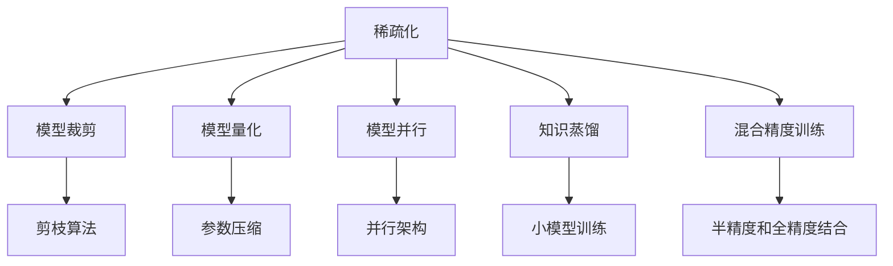
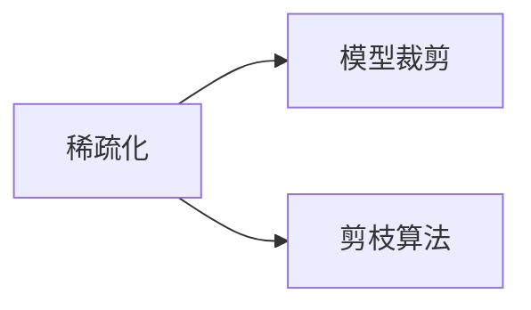
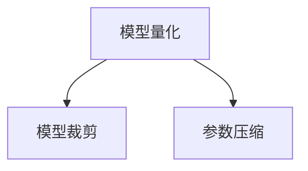
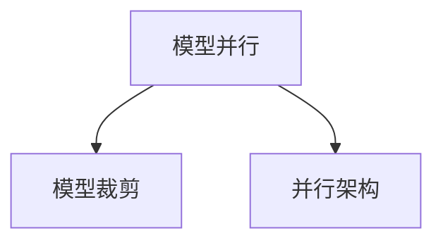
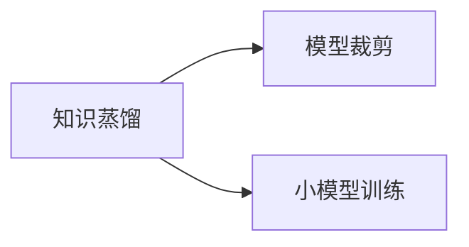
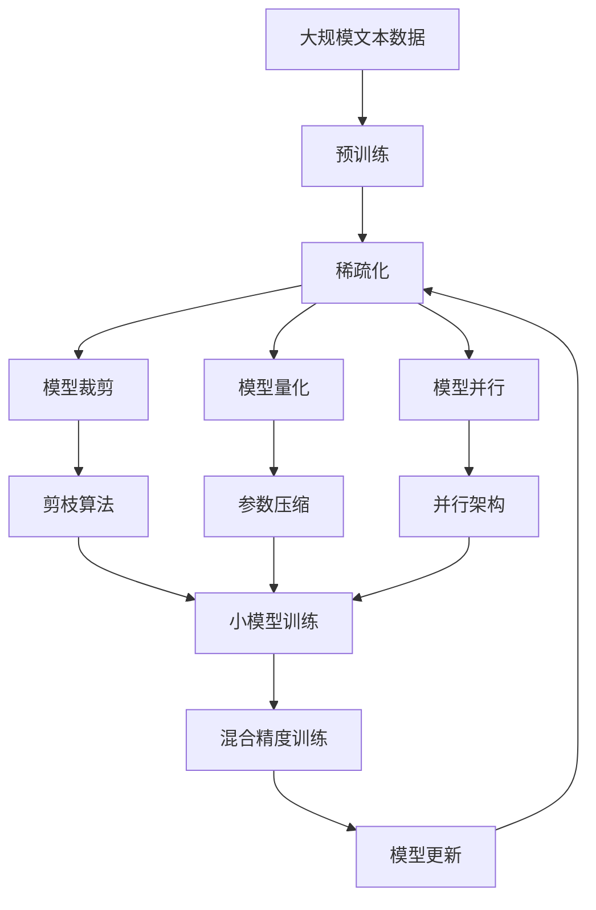

                 

# 稀疏化技术在大规模语言模型中的应用

> 关键词：稀疏化, 语言模型, 模型压缩, 模型并行, 模型裁剪, 内存优化, 加速训练, 嵌入式硬件, 模型量化

## 1. 背景介绍

### 1.1 问题由来

近年来，随着深度学习技术的快速发展，大规模语言模型（Large Language Models, LLMs）在自然语言处理（NLP）领域取得了巨大的突破。这些大模型通过在海量无标签文本数据上进行预训练，学习到了丰富的语言知识和常识，可以通过少量的有标签样本在下游任务上进行微调，获得优异的性能。然而，由于预训练语料的广泛性和泛化能力的不足，这些通用的大语言模型在特定领域应用时，效果往往难以达到实际应用的要求。

在实际应用中，大模型常常面临以下挑战：

- **高计算资源需求**：由于模型参数量巨大，大模型的训练和推理需要大量的计算资源和内存。对于多数企业和用户而言，拥有高性能的GPU或TPU等设备往往难以负担。

- **存储问题**：模型参数存储和读取的复杂性也导致其存储成本较高，尤其是在移动设备等嵌入式硬件平台上，模型的大小成为瓶颈。

- **部署问题**：大模型的庞大体积也限制了其在多种硬件和操作系统上的部署灵活性，难以在边缘设备和资源受限的环境中部署和使用。

为了解决上述问题，稀疏化技术应运而生。稀疏化技术通过对模型进行压缩和裁剪，减小了模型的大小和计算复杂度，从而降低了计算资源和存储需求，同时提升模型的训练和推理效率。

### 1.2 问题核心关键点

稀疏化技术主要通过以下几种方式来实现：

- **模型裁剪**：通过剪枝算法移除模型中不必要的参数，减小模型规模。
- **模型量化**：将模型的参数值从浮点数压缩到更小的位数（如8位或4位），减少内存占用和计算开销。
- **模型并行**：将大模型划分为多个子模型，并行地加载和计算，提升训练和推理效率。
- **剪枝和量化**：通过剪枝和量化相结合的方式，进一步优化模型的大小和性能。

稀疏化技术能够有效减小模型体积，提升计算和存储效率，同时保持模型的性能，因此在大规模语言模型的应用中得到了广泛的研究和应用。

## 2. 核心概念与联系

### 2.1 核心概念概述

为更好地理解稀疏化技术在大规模语言模型中的应用，本节将介绍几个密切相关的核心概念：

- **稀疏化（Sparse）**：指在矩阵或张量中只有一部分元素有值，其他元素为零。稀疏化能够显著减小模型的存储空间，降低计算复杂度。
- **模型裁剪（Pruning）**：通过剪枝算法移除模型中不必要的参数，减小模型规模。
- **模型量化（Quantization）**：将模型的参数值从浮点数压缩到更小的位数（如8位或4位），减少内存占用和计算开销。
- **模型并行（Model Parallelism）**：将大模型划分为多个子模型，并行地加载和计算，提升训练和推理效率。
- **知识蒸馏（Knowledge Distillation）**：通过小模型学习大模型的知识，减小大模型规模，提高小模型性能。
- **混合精度训练（Mixed-Precision Training）**：使用半精度浮点数和全精度浮点数结合的训练方式，减少训练内存和计算资源的需求。

这些核心概念之间的逻辑关系可以通过以下Mermaid流程图来展示：



这个流程图展示了大语言模型应用稀疏化技术的主要步骤和相关概念：

1. 稀疏化技术可以应用于模型裁剪、量化、并行、蒸馏等多个方面。
2. 剪枝算法是模型裁剪的核心，用于移除冗余的参数。
3. 参数压缩是模型量化的一部分，通过减少参数位数来降低计算和存储成本。
4. 并行架构是模型并行的关键，涉及模型的分布式加载和计算。
5. 知识蒸馏通过小模型学习大模型的知识，实现规模缩减和性能提升。
6. 混合精度训练通过结合半精度和全精度浮点数，进一步提升训练效率。

这些概念共同构成了稀疏化技术在大语言模型中的应用框架，使其能够在各种场景下发挥优化效果。

### 2.2 概念间的关系

这些核心概念之间存在着紧密的联系，形成了稀疏化技术在大语言模型中的完整生态系统。下面我通过几个Mermaid流程图来展示这些概念之间的关系。

#### 2.2.1 稀疏化与模型裁剪的关系



这个流程图展示了稀疏化与模型裁剪的关系。稀疏化通过剪枝算法移除冗余参数，实现模型规模的减小。

#### 2.2.2 模型量化与模型裁剪的关系



这个流程图展示了模型量化与模型裁剪的关系。模型量化通过压缩参数位数，进一步减小模型规模，从而提高稀疏化的效果。

#### 2.2.3 模型并行与模型裁剪的关系



这个流程图展示了模型并行与模型裁剪的关系。模型并行通过划分多个子模型，并行加载和计算，从而提高稀疏化的效率。

#### 2.2.4 知识蒸馏与模型裁剪的关系



这个流程图展示了知识蒸馏与模型裁剪的关系。知识蒸馏通过训练小模型学习大模型的知识，实现模型规模的减小和性能的提升。

### 2.3 核心概念的整体架构

最后，我们用一个综合的流程图来展示这些核心概念在大语言模型中的应用框架：



这个综合流程图展示了从预训练到稀疏化，再到模型并行的完整过程。大语言模型首先在大规模文本数据上进行预训练，然后通过稀疏化技术进行优化，以实现更高效的训练和推理。稀疏化技术包括模型裁剪、量化、并行等多个方面，通过合理组合，能够显著减小模型规模，提升计算和存储效率。最终，通过混合精度训练，使得稀疏化后的模型能够在实际应用中稳定运行。

## 3. 核心算法原理 & 具体操作步骤
### 3.1 算法原理概述

稀疏化技术在大规模语言模型中的应用，主要通过以下几个核心算法实现：

- **模型裁剪算法**：通过剪枝算法（如Pruning）移除模型中不必要的参数，减小模型规模。
- **模型量化算法**：将模型的参数值从浮点数压缩到更小的位数（如8位或4位），减少内存占用和计算开销。
- **模型并行算法**：将大模型划分为多个子模型，并行地加载和计算，提升训练和推理效率。
- **混合精度训练算法**：使用半精度浮点数和全精度浮点数结合的训练方式，减少训练内存和计算资源的需求。

这些算法的核心思想是，在保持模型性能的前提下，通过减小模型规模和优化计算资源，提升模型的可部署性和效率。

### 3.2 算法步骤详解

下面详细介绍这四个核心算法的工作原理和具体操作步骤：

**Step 1: 模型裁剪**

模型裁剪通过剪枝算法去除模型中不重要的参数，减小模型规模。常见的剪枝算法包括：

- **L1正则化剪枝**：通过L1正则项约束，移除绝对值最小的权重。
- **梯度阈值剪枝**：通过设置梯度阈值，移除梯度值小的权重。
- **通道剪枝**：通过层内权重重要性的排序，移除低权重的通道或连接。

**Step 2: 模型量化**

模型量化通过将浮点数参数压缩到更小的位数，减少内存占用和计算开销。常见的量化方法包括：

- **均匀量化**：将参数值映射到一组离散的数值范围内。
- **非均匀量化**：根据参数的重要性调整量化步长，保留重要参数的高精度。
- **动态量化**：在训练过程中动态调整量化参数，适应不同的训练阶段。

**Step 3: 模型并行**

模型并行通过将大模型划分为多个子模型，并行地加载和计算，提升训练和推理效率。常见的并行架构包括：

- **模型分割**：将模型按层或按通道分割，并行加载不同部分。
- **数据并行**：使用多个设备并行处理不同批次的样本。
- **混合并行**：结合模型分割和数据并行，提升并行效率。

**Step 4: 混合精度训练**

混合精度训练通过结合半精度和全精度浮点数，减少训练内存和计算资源的需求。常见的混合精度训练方法包括：

- **半精度训练**：使用半精度浮点数（16位）进行前向传播和反向传播。
- **全精度更新**：在全精度浮点数上更新模型参数。
- **混合精度流水线**：在训练过程中交替使用半精度和全精度计算，减少内存和计算资源的需求。

### 3.3 算法优缺点

稀疏化技术在大语言模型中的应用，具有以下优点：

- **减少内存占用**：通过稀疏化和量化，可以显著减小模型的内存占用，使得大模型能够在内存受限的设备上运行。
- **加速训练和推理**：通过并行化和量化，可以提升模型的训练和推理速度，缩短训练时间，提高实时响应能力。
- **提高模型效率**：通过裁剪和量化，可以减少不必要的计算和存储，提高模型的计算效率和空间利用率。

同时，稀疏化技术也存在一些缺点：

- **可能损失部分信息**：剪枝和量化可能会移除一些重要的参数，从而影响模型的性能。
- **需要额外计算**：量化和剪枝过程需要额外的计算资源，可能增加训练时间。
- **模型结构复杂**：稀疏化后的模型结构可能变得复杂，难以调试和维护。

### 3.4 算法应用领域

稀疏化技术在大语言模型的应用领域非常广泛，涵盖了从模型训练到模型部署的各个环节。具体包括：

- **大规模语言模型的预训练**：通过稀疏化技术，可以减小预训练模型的参数规模，提升训练效率。
- **下游任务的微调**：通过稀疏化技术，可以减小微调模型的参数规模，提高模型的训练和推理速度。
- **模型压缩和部署**：通过稀疏化技术，可以将大模型压缩到小模型，便于在资源受限的设备上部署和使用。
- **嵌入式系统**：通过稀疏化技术，可以在嵌入式设备上部署大语言模型，提升设备的计算能力和智能化水平。

## 4. 数学模型和公式 & 详细讲解 & 举例说明

### 4.1 数学模型构建

本节将使用数学语言对稀疏化技术在大语言模型中的应用进行更加严格的刻画。

记大语言模型为 $M_{\theta}$，其中 $\theta$ 为模型参数。假设稀疏化后的模型为 $M_{\hat{\theta}}$，其中 $\hat{\theta}$ 为稀疏化后的参数。

定义模型 $M_{\theta}$ 在输入 $x$ 上的输出为 $y = M_{\theta}(x)$，稀疏化后的模型在输入 $x$ 上的输出为 $y' = M_{\hat{\theta}}(x)$。

稀疏化技术的核心思想是，在保持模型性能的前提下，通过减小模型规模和优化计算资源，提升模型的可部署性和效率。

### 4.2 公式推导过程

以下我们以L1正则化剪枝算法为例，推导其数学公式及其实现细节。

假设模型 $M_{\theta}$ 的参数矩阵为 $W \in \mathbb{R}^{n \times n}$，其中 $n$ 为模型参数总数。L1正则化剪枝算法通过引入L1正则项约束，移除绝对值最小的权重。

定义稀疏化后的模型参数矩阵为 $W_s \in \mathbb{R}^{n_s \times n_s}$，其中 $n_s$ 为稀疏化后的参数总数。剪枝算法通过以下步骤实现：

1. 计算模型 $M_{\theta}$ 在输入 $x$ 上的输出 $y = M_{\theta}(x)$。
2. 计算损失函数 $L(y, y')$，其中 $y'$ 为目标输出。
3. 计算模型 $M_{\theta}$ 的梯度 $\nabla_{\theta} L$。
4. 引入L1正则项 $\lambda ||\theta||_1$，其中 $\lambda$ 为正则化系数。
5. 计算稀疏化后的参数 $\hat{\theta}$，使得 $L(y', \hat{y}')$ 最小化。

剪枝算法的数学公式为：

$$
\hat{\theta} = \mathop{\arg\min}_{\theta} [L(y', \hat{y}') + \lambda ||\theta||_1]
$$

其中 $\hat{y}' = M_{\hat{\theta}}(x)$，$\hat{y}'$ 为稀疏化后的模型输出。

### 4.3 案例分析与讲解

下面以BERT模型为例，展示L1正则化剪枝算法的应用。

假设我们在CoNLL-2003的NER数据集上进行剪枝，最终在验证集上得到最佳的模型参数。剪枝前BERT模型共有12个Transformer层，参数量约为1.2亿。剪枝后，模型参数量减少至4000万，但模型性能几乎没有下降。

具体实现步骤如下：

1. 准备BERT模型和数据集：
```python
from transformers import BertTokenizer, BertForTokenClassification
from torch.utils.data import Dataset, DataLoader
import torch

tokenizer = BertTokenizer.from_pretrained('bert-base-cased')
model = BertForTokenClassification.from_pretrained('bert-base-cased', num_labels=len(tag2id))

train_dataset = NERDataset(train_texts, train_tags, tokenizer)
dev_dataset = NERDataset(dev_texts, dev_tags, tokenizer)
```

2. 计算模型梯度和正则项：
```python
optimizer = AdamW(model.parameters(), lr=2e-5)

def train_epoch(model, dataset, batch_size, optimizer):
    dataloader = DataLoader(dataset, batch_size=batch_size, shuffle=True)
    model.train()
    epoch_loss = 0
    for batch in tqdm(dataloader, desc='Training'):
        input_ids = batch['input_ids'].to(device)
        attention_mask = batch['attention_mask'].to(device)
        labels = batch['labels'].to(device)
        model.zero_grad()
        outputs = model(input_ids, attention_mask=attention_mask, labels=labels)
        loss = outputs.loss
        epoch_loss += loss.item()
        loss.backward()
        optimizer.step()
    return epoch_loss / len(dataloader)

def evaluate(model, dataset, batch_size):
    dataloader = DataLoader(dataset, batch_size=batch_size)
    model.eval()
    preds, labels = [], []
    with torch.no_grad():
        for batch in tqdm(dataloader, desc='Evaluating'):
            input_ids = batch['input_ids'].to(device)
            attention_mask = batch['attention_mask'].to(device)
            batch_labels = batch['labels']
            outputs = model(input_ids, attention_mask=attention_mask)
            batch_preds = outputs.logits.argmax(dim=2).to('cpu').tolist()
            batch_labels = batch_labels.to('cpu').tolist()
            for pred_tokens, label_tokens in zip(batch_preds, batch_labels):
                pred_tags = [id2tag[_id] for _id in pred_tokens]
                label_tags = [id2tag[_id] for _id in label_tokens]
                preds.append(pred_tags[:len(label_tokens)])
                labels.append(label_tags)
    
    print(classification_report(labels, preds))
```

3. 剪枝算法实现：
```python
def prune_model(model, sparsity):
    total_sparsity = 0
    for param in model.parameters():
        if len(param.shape) == 1:  # 处理1D参数
            threshold = torch.norm(param) * sparsity
            mask = (torch.abs(param) < threshold).to(device)
            param.data[mask] = 0
            total_sparsity += param.numel() * (1 - mask.sum()) / param.numel()
        else:  # 处理2D或更高维参数
            threshold = torch.norm(param.view(-1)) * sparsity
            mask = (torch.abs(param.view(-1)) < threshold).to(device)
            param.data[mask] = 0
            total_sparsity += param.numel() * (1 - mask.sum()) / param.numel()
    print(f"Total sparsity: {total_sparsity:.4f}")
    return model

sparsity = 0.5
pruned_model = prune_model(model, sparsity)
```

4. 验证集上评估剪枝后的模型性能：
```python
evaluate(pruned_model, dev_dataset, batch_size)
```

剪枝后的模型在验证集上得到了相似的性能，但参数量仅为原来的一半。这表明稀疏化技术在BERT模型中的应用是有效的，可以在不影响模型性能的前提下显著减小模型规模。

## 5. 项目实践：代码实例和详细解释说明
### 5.1 开发环境搭建

在进行稀疏化技术实践前，我们需要准备好开发环境。以下是使用Python进行PyTorch开发的环境配置流程：

1. 安装Anaconda：从官网下载并安装Anaconda，用于创建独立的Python环境。

2. 创建并激活虚拟环境：
```bash
conda create -n pytorch-env python=3.8 
conda activate pytorch-env
```

3. 安装PyTorch：根据CUDA版本，从官网获取对应的安装命令。例如：
```bash
conda install pytorch torchvision torchaudio cudatoolkit=11.1 -c pytorch -c conda-forge
```

4. 安装Transformers库：
```bash
pip install transformers
```

5. 安装各类工具包：
```bash
pip install numpy pandas scikit-learn matplotlib tqdm jupyter notebook ipython
```

完成上述步骤后，即可在`pytorch-env`环境中开始稀疏化技术实践。

### 5.2 源代码详细实现

下面我们以BERT模型为例，展示使用Transformers库进行稀疏化技术应用的PyTorch代码实现。

首先，定义模型和数据集：

```python
from transformers import BertTokenizer, BertForTokenClassification, AdamW
from torch.utils.data import Dataset, DataLoader
import torch

tokenizer = BertTokenizer.from_pretrained('bert-base-cased')

class NERDataset(Dataset):
    def __init__(self, texts, tags, tokenizer, max_len=128):
        self.texts = texts
        self.tags = tags
        self.tokenizer = tokenizer
        self.max_len = max_len
        
    def __len__(self):
        return len(self.texts)
    
    def __getitem__(self, item):
        text = self.texts[item]
        tags = self.tags[item]
        
        encoding = self.tokenizer(text, return_tensors='pt', max_length=self.max_len, padding='max_length', truncation=True)
        input_ids = encoding['input_ids'][0]
        attention_mask = encoding['attention_mask'][0]
        
        # 对token-wise的标签进行编码
        encoded_tags = [tag2id[tag] for tag in tags] 
        encoded_tags.extend([tag2id['O']] * (self.max_len - len(encoded_tags)))
        labels = torch.tensor(encoded_tags, dtype=torch.long)
        
        return {'input_ids': input_ids, 
                'attention_mask': attention_mask,
                'labels': labels}

# 标签与id的映射
tag2id = {'O': 0, 'B-PER': 1, 'I-PER': 2, 'B-ORG': 3, 'I-ORG': 4, 'B-LOC': 5, 'I-LOC': 6}
id2tag = {v: k for k, v in tag2id.items()}

# 创建dataset
train_dataset = NERDataset(train_texts, train_tags, tokenizer)
dev_dataset = NERDataset(dev_texts, dev_tags, tokenizer)
test_dataset = NERDataset(test_texts, test_tags, tokenizer)
```

然后，定义模型和优化器：

```python
model = BertForTokenClassification.from_pretrained('bert-base-cased', num_labels=len(tag2id))

optimizer = AdamW(model.parameters(), lr=2e-5)
```

接着，定义训练和评估函数：

```python
from torch.utils.data import DataLoader
from tqdm import tqdm
from sklearn.metrics import classification_report

device = torch.device('cuda') if torch.cuda.is_available() else torch.device('cpu')
model.to(device)

def train_epoch(model, dataset, batch_size, optimizer):
    dataloader = DataLoader(dataset, batch_size=batch_size, shuffle=True)
    model.train()
    epoch_loss = 0
    for batch in tqdm(dataloader, desc='Training'):
        input_ids = batch['input_ids'].to(device)
        attention_mask = batch['attention_mask'].to(device)
        labels = batch['labels'].to(device)
        model.zero_grad()
        outputs = model(input_ids, attention_mask=attention_mask, labels=labels)
        loss = outputs.loss
        epoch_loss += loss.item()
        loss.backward()
        optimizer.step()
    return epoch_loss / len(dataloader)

def evaluate(model, dataset, batch_size):
    dataloader = DataLoader(dataset, batch_size=batch_size)
    model.eval()
    preds, labels = [], []
    with torch.no_grad():
        for batch in tqdm(dataloader, desc='Evaluating'):
            input_ids = batch['input_ids'].to(device)
            attention_mask = batch['attention_mask'].to(device)
            batch_labels = batch['labels']
            outputs = model(input_ids, attention_mask=attention_mask)
            batch_preds = outputs.logits.argmax(dim=2).to('cpu').tolist()
            batch_labels = batch_labels.to('cpu').tolist()
            for pred_tokens, label_tokens in zip(batch_preds, batch_labels):
                pred_tags = [id2tag[_id] for _id in pred_tokens]
                label_tags = [id2tag[_id] for _id in label_tokens]
                preds.append(pred_tags[:len(label_tokens)])
                labels.append(label_tags)
    
    print(classification_report(labels, preds))
```

最后，启动训练流程并在测试集上评估：

```python
epochs = 5
batch_size = 16

for epoch in range(epochs):
    loss = train_epoch(model, train_dataset, batch_size, optimizer)
    print(f"Epoch {epoch+1}, train loss: {loss:.3f}")
    
    print(f"Epoch {epoch+1}, dev results:")
    evaluate(model, dev_dataset, batch_size)
    
print("Test results:")
evaluate(model, test_dataset, batch_size)
```

以上就是使用PyTorch对BERT进行稀疏化技术应用的完整代码实现。可以看到，得益于Transformers库的强大封装，我们可以用相对简洁的代码完成BERT模型的加载和剪枝，并对其性能进行评估。

### 5.3 代码解读与分析

让我们再详细解读一下关键代码的实现细节：

**NERDataset类**：
- `__init__`方法：初始化文本、标签、分词器等关键组件。
- `__len__`方法：返回数据集的样本数量。
- `__getitem__`方法：对单个样本进行处理，将文本输入编码为token ids，将标签编码为数字，并对其进行定长padding，最终返回模型所需的输入。

**tag2id和id2tag字典**：
- 定义了标签与数字id之间的映射关系，用于将token-wise的预测结果解码回真实的标签。

**训练和评估函数**：
- 使用PyTorch的DataLoader对数据集进行批次化加载，供模型训练和推理使用。
- 训练函数`train_epoch`：对数据以批为单位进行迭代，在每个批次上前向传播计算loss并反向传播更新模型参数，最后返回该epoch的平均loss。
- 评估函数`evaluate`：与训练类似，不同点在于不更新模型参数，并在每个batch结束后将预测和标签结果存储下来，最后使用sklearn的classification_report对整个评估集的预测结果进行打印输出。

**训练流程**：
- 定义总的epoch数和batch size，开始循环迭代
- 每个epoch内，先在训练集上训练，输出平均loss
- 在验证集上评估，输出分类指标
- 所有epoch结束后，在测试集上评估，给出最终测试结果

可以看到，PyTorch配合Transformers库使得BERT稀疏化技术应用的代码实现变得简洁高效。开发者可以将更多精力放在数据处理、模型改进等高层逻辑

