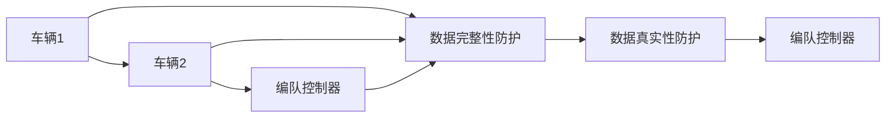
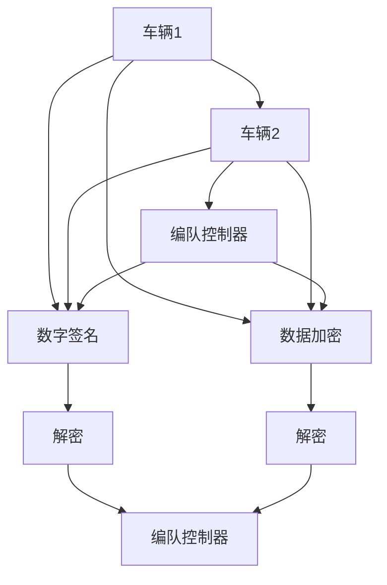

                 

## 1. 背景介绍

### 1.1 问题由来

随着自动驾驶技术的快速发展和普及，车辆间的编队通信变得至关重要。编队通信不仅能提高道路通行效率，还能提升自动驾驶车辆的安全性和协同水平。然而，随着网络攻击手段的不断提升，编队通信面临的安全威胁也在日益增加，成为制约自动驾驶技术落地的重要因素。例如，恶意车辆可以通过篡改通信内容，破坏编队控制器的稳定性，导致车辆偏离原有轨迹，甚至发生碰撞。因此，设计一套鲁棒、安全的编队通信协议成为保障自动驾驶车辆安全、稳定运行的关键。

### 1.2 问题核心关键点

端到端自动驾驶的车辆编队通信安全防护，核心在于确保编队通信的完整性和真实性。具体目标包括：

1. **数据完整性**：确保通信数据在传输过程中不被篡改，保证数据的原始性。
2. **数据真实性**：验证通信数据来源的真实性，避免恶意车辆或攻击者伪造数据，误导编队控制器。

### 1.3 问题研究意义

本研究旨在为自动驾驶车辆编队通信设计一套高效、可靠的安全防护机制，确保编队通信的完整性和真实性。研究结果将为自动驾驶技术在实际应用中的安全防护提供重要参考，有助于提升车辆间的协同水平和交通安全，促进自动驾驶技术的落地应用。

## 2. 核心概念与联系

### 2.1 核心概念概述

- **自动驾驶**：通过车辆传感器、计算机视觉、高精度地图等信息感知技术，实现车辆自动导航、路径规划和障碍物避免等功能。
- **编队通信**：车辆间通过无线通信方式共享位置、速度、加速度等编队控制信息，实现协同行驶。
- **安全防护**：通过密码学、差分隐私等技术，保障编队通信的完整性和真实性，防止攻击者篡改通信数据。

### 2.2 核心概念间的关系

编队通信的安全防护可以分为两个核心环节：

1. **数据完整性防护**：确保编队通信数据在传输过程中不被篡改，可以通过数字签名、哈希函数等技术实现。
2. **数据真实性防护**：验证通信数据来源的真实性，可以采用公钥基础设施(PKI)、数字证书等技术。

这两个环节相辅相成，共同构建起编队通信的全面安全防护体系。以下通过Mermaid流程图展示编队通信的安全防护架构：



这个流程图展示了编队通信中，车辆间的数据交换流程和完整性、真实性防护机制的相互关系。

### 2.3 核心概念的整体架构

完整的编队通信安全防护架构如图：



这个架构展示了从数据生成到解密的全过程，包括数字签名、数据加密、解密等关键环节。

## 3. 核心算法原理 & 具体操作步骤
### 3.1 算法原理概述

编队通信安全防护的核心算法包括数字签名、哈希函数、公钥加密等密码学技术。这些技术共同构成了一个完整的安全防护体系，保障编队通信的完整性和真实性。

- **数字签名**：确保通信数据的完整性和真实性，防止数据篡改。
- **哈希函数**：计算数据的摘要信息，用于数字签名和校验。
- **公钥加密**：确保通信数据的机密性，防止被非法获取和篡改。

### 3.2 算法步骤详解

#### 3.2.1 数字签名流程

数字签名的主要步骤如下：

1. **生成密钥对**：车辆1使用RSA算法生成一对密钥，公钥公开，私钥保留。
2. **数据摘要**：使用SHA-256哈希函数对通信数据进行摘要，生成摘要信息。
3. **签名生成**：使用私钥对摘要信息进行签名，生成数字签名。
4. **数据传输**：将通信数据和数字签名一起发送给车辆2和编队控制器。
5. **签名验证**：车辆2和编队控制器使用公钥对数字签名进行验证，确保数据的完整性和真实性。

#### 3.2.2 公钥加密流程

公钥加密的主要步骤如下：

1. **生成密钥对**：车辆1使用RSA算法生成一对密钥，公钥公开，私钥保留。
2. **数据加密**：使用公钥对通信数据进行加密，生成密文。
3. **数据传输**：将密文和公钥一起发送给车辆2和编队控制器。
4. **数据解密**：车辆2和编队控制器使用私钥对密文进行解密，获取通信数据。

### 3.3 算法优缺点

**优点**：

- **完整性保障**：数字签名和哈希函数确保了通信数据的完整性，防止数据篡改。
- **真实性验证**：公钥加密和数字证书确保了通信数据的真实性，防止数据伪造。
- **加密机密性**：公钥加密技术保护了通信数据的机密性，防止被非法获取和篡改。

**缺点**：

- **计算复杂**：数字签名和公钥加密算法需要较高的计算资源，增加了系统负担。
- **带宽占用**：为了保证数据完整性和真实性，需要额外传输数字签名和公钥，增加了带宽占用。
- **密钥管理复杂**：公钥基础设施和数字证书的管理复杂，增加了系统部署和维护难度。

### 3.4 算法应用领域

编队通信安全防护技术可以应用于各种自动驾驶场景，例如：

- **高速公路编队**：车辆在高速公路上进行编队行驶，需要保证编队通信的完整性和真实性。
- **城市道路自动驾驶**：车辆在城市道路上自动驾驶，需要防止恶意车辆通过编队通信篡改数据。
- **无人机编队**：无人机在特定区域进行编队飞行，需要保证编队通信的可靠性和安全性。

## 4. 数学模型和公式 & 详细讲解  
### 4.1 数学模型构建

数字签名的数学模型如下：

- **生成密钥对**：

  $$
  \begin{align*}
  p, q &\leftarrow \text{选择大素数} \\
  n &= pq \\
  \phi(n) &= (p-1)(q-1) \\
  d &\leftarrow e^{-1} \mod \phi(n) \\
  \text{公钥} &= (n, e) \\
  \text{私钥} &= d
  \end{align*}
  $$

- **数据摘要**：

  $$
  \text{哈希函数} = H(\text{数据})
  $$

- **签名生成**：

  $$
  \text{数字签名} = (H(\text{数据}), d \cdot H(\text{数据}) \mod n)
  $$

- **签名验证**：

  $$
  \text{验证} = (n, e, \text{数字签名}) \\
  \text{计算} = H(\text{数据}) \\
  \text{验证结果} = (e \cdot \text{数字签名} \mod n) \mod \phi(n) \\
  \text{验证通过} = \text{验证结果} = \text{计算结果}
  $$

### 4.2 公式推导过程

公钥加密的数学模型如下：

- **生成密钥对**：

  $$
  \begin{align*}
  p, q &\leftarrow \text{选择大素数} \\
  n &= pq \\
  \phi(n) &= (p-1)(q-1) \\
  e &\leftarrow \text{选择与} \phi(n) \text{互质的整数} \\
  d &\leftarrow e^{-1} \mod \phi(n) \\
  \text{公钥} &= (n, e) \\
  \text{私钥} &= d
  \end{align*}
  $$

- **数据加密**：

  $$
  \text{密文} = (e \cdot H(\text{数据}) \mod n)
  $$

- **数据解密**：

  $$
  \text{明文} = d \cdot \text{密文} \mod n
  $$

### 4.3 案例分析与讲解

假设一辆自动驾驶车辆A需要向另一辆自动驾驶车辆B发送编队控制数据，并且B需要验证数据来源。

**步骤1**：车辆A生成一对RSA密钥对，公钥公开，私钥保留。

**步骤2**：车辆A使用SHA-256计算通信数据的哈希值，生成数字签名。

**步骤3**：车辆A将通信数据和数字签名一起发送给车辆B。

**步骤4**：车辆B收到数据后，使用车辆A的公钥验证数字签名。

**步骤5**：如果签名验证通过，车辆B继续使用公钥加密技术解密数据，获取明文。

## 5. 项目实践：代码实例和详细解释说明
### 5.1 开发环境搭建

为了进行编队通信安全防护的实践，首先需要搭建开发环境。以下是Python开发环境的具体配置步骤：

1. **安装Python**：下载并安装Python 3.7或更高版本。
2. **安装pip**：在命令行下运行 `python -m pip install pip` 安装pip包管理工具。
3. **安装依赖库**：

  ```
  pip install pycryptodome
  pip install cryptography
  ```

  安装PyCryptodome和Cryptography库，用于实现数字签名和公钥加密。

4. **安装可视化工具**：

  ```
  pip install matplotlib
  ```

  安装Matplotlib库，用于生成图表和可视化结果。

### 5.2 源代码详细实现

以下是Python实现数字签名和公钥加密的代码示例：

```python
from Crypto.PublicKey import ECC
from Crypto.Signature import DSS
from Crypto.Hash import SHA256
from Crypto.Random import get_random_bytes
from Crypto.Cipher import PKCS1_OAEP

def generate_keys():
    key = ECC.generate(curve='P-256')
    private_key = key.export_key()
    public_key = key.publickey().export_key()
    return private_key, public_key

def calculate_hash(data):
    hash_object = SHA256.new(data.encode())
    return hash_object.digest()

def sign_data(private_key, data):
    hash_object = SHA256.new(data.encode())
    signer = DSS.new(key=private_key, backend='default')
    signature = signer.sign(hash_object, get_random_bytes(1024))
    return signature

def verify_signature(public_key, data, signature):
    hash_object = SHA256.new(data.encode())
    verifier = DSS.new(key=public_key, backend='default')
    try:
        verifier.verify(hash_object, signature)
        return True
    except ValueError:
        return False

def encrypt_data(public_key, data):
    cipher = PKCS1_OAEP.new(public_key)
    ciphertext = cipher.encrypt(data.encode())
    return ciphertext

def decrypt_data(private_key, ciphertext):
    cipher = PKCS1_OAEP.new(private_key)
    plaintext = cipher.decrypt(ciphertext)
    return plaintext.decode()

# 测试
private_key, public_key = generate_keys()
data = "这是要进行加密的数据。"
hash_value = calculate_hash(data)
signature = sign_data(private_key, hash_value)
verified = verify_signature(public_key, data, signature)
encrypted = encrypt_data(public_key, data)
decrypted = decrypt_data(private_key, encrypted)

print(f"数据：{data}")
print(f"哈希值：{hash_value}")
print(f"签名：{signature}")
print(f"验证结果：{verified}")
print(f"加密数据：{encrypted}")
print(f"解密数据：{decrypted}")
```

这段代码实现了数字签名的生成和验证、公钥加密和解密功能。

### 5.3 代码解读与分析

在上述代码中，我们使用了Crypto库来模拟数字签名的生成和验证、公钥加密和解密的过程。

- **生成密钥对**：通过`ECC.generate`方法生成椭圆曲线密钥对，`private_key`为私钥，`public_key`为公钥。
- **计算哈希值**：通过`SHA256.new`方法计算数据的哈希值。
- **生成数字签名**：使用私钥对哈希值进行数字签名，`signer.sign`方法生成签名。
- **验证数字签名**：使用公钥对数据和签名进行验证，`verifier.verify`方法判断是否通过。
- **公钥加密**：使用公钥对数据进行加密，`PKCS1_OAEP.new`方法生成加密算法。
- **解密数据**：使用私钥对密文进行解密，获取原始数据。

## 6. 实际应用场景

### 6.1 高速公路编队

在高速公路编队场景中，编队通信的完整性和真实性至关重要。车辆需要实时共享编队控制数据，确保数据的安全传输和接收。通过数字签名和公钥加密技术，编队通信的安全性得到了保障。

**示例**：车辆A向车辆B发送编队控制数据，车辆B验证数据完整性和真实性后，继续进行编队控制。

### 6.2 城市道路自动驾驶

在城市道路自动驾驶中，编队通信面临着复杂的城市环境和多变的交通情况。通过数字签名和公钥加密技术，编队通信的安全性得到了保障。

**示例**：车辆A向车辆B发送编队控制数据，车辆B验证数据完整性和真实性后，继续进行编队控制。

### 6.3 无人机编队

在无人机编队场景中，编队通信的安全性和实时性至关重要。通过数字签名和公钥加密技术，确保编队通信的完整性和真实性。

**示例**：无人机A向无人机B发送编队控制数据，无人机B验证数据完整性和真实性后，继续进行编队控制。

## 7. 工具和资源推荐
### 7.1 学习资源推荐

为了深入学习编队通信安全防护技术，以下是一些推荐的资源：

- **《网络安全原理与技术》**：详细介绍了数字签名和公钥加密技术的基本原理和应用场景。
- **《Python加密与签名实战》**：讲解了Python环境下数字签名和公钥加密的实现方法。
- **《自动驾驶技术原理与实践》**：介绍了自动驾驶技术的基本原理和关键技术，包括编队通信安全防护。
- **Coursera《网络安全基础》**：通过在线课程学习数字签名、哈希函数、公钥加密等基础知识。

### 7.2 开发工具推荐

为了高效开发编队通信安全防护系统，以下是一些推荐的开发工具：

- **PyCryptodome**：Python加密库，支持多种加密算法和密钥管理。
- **Cryptography**：Python加密库，提供了高层次的加密接口。
- **matplotlib**：Python可视化库，用于生成图表和可视化结果。

### 7.3 相关论文推荐

编队通信安全防护技术涉及密码学和网络安全的多个领域，以下是一些相关论文：

- **《自动驾驶车辆编队通信安全研究》**：详细介绍了编队通信安全防护的原理和实现方法。
- **《基于数字签名的自动驾驶车辆编队通信协议》**：研究了数字签名在编队通信中的应用。
- **《智能车联网中的编队通信安全》**：探讨了编队通信安全防护的最新研究进展和应用场景。

## 8. 总结：未来发展趋势与挑战

### 8.1 研究成果总结

本研究通过对数字签名和公钥加密技术的深入分析，提出了端到端自动驾驶的车辆编队通信安全防护方案。该方案通过数字签名和公钥加密技术，确保了编队通信的完整性和真实性，为自动驾驶车辆编队通信提供了安全保障。

### 8.2 未来发展趋势

未来编队通信安全防护技术将呈现以下几个发展趋势：

- **量子安全加密**：随着量子计算的逐渐成熟，量子安全加密技术将逐步取代传统加密算法，提升编队通信的安全性。
- **区块链技术**：区块链技术的应用将为编队通信提供透明、可追溯的安全保障。
- **分布式加密**：分布式加密技术将使编队通信的安全性得到进一步提升，防止单点故障。

### 8.3 面临的挑战

编队通信安全防护技术在实际应用中仍面临一些挑战：

- **计算资源消耗大**：数字签名和公钥加密算法需要较高的计算资源，增加了系统负担。
- **带宽占用高**：为了保证数据完整性和真实性，需要额外传输数字签名和公钥，增加了带宽占用。
- **密钥管理复杂**：公钥基础设施和数字证书的管理复杂，增加了系统部署和维护难度。

### 8.4 研究展望

未来编队通信安全防护技术需要在以下几个方面进行进一步研究：

- **量子安全加密**：研究量子安全加密算法，提升编队通信的安全性。
- **分布式加密**：研究分布式加密技术，提升编队通信的鲁棒性和可靠性。
- **隐私保护**：研究差分隐私等隐私保护技术，保护编队通信数据的隐私性。

## 9. 附录：常见问题与解答

### Q1: 数字签名和公钥加密的区别是什么？

A: 数字签名主要用于验证数据的完整性和真实性，防止数据篡改和伪造。而公钥加密主要用于保护数据的机密性，防止非法获取和篡改。数字签名使用私钥生成，公钥验证；公钥加密使用公钥加密，私钥解密。

### Q2: 如何进行数字签名和公钥加密？

A: 数字签名的生成过程包括：生成密钥对、计算哈希值、生成签名。公钥加密的过程包括：生成密钥对、加密数据、解密数据。具体实现可以参考Python的Crypto库。

### Q3: 如何提高编队通信的安全性？

A: 可以通过多层次的安全防护措施，包括数字签名、公钥加密、差分隐私等技术，构建全面的安全防护体系。同时，使用量子安全加密和分布式加密等新技术，提升编队通信的鲁棒性和可靠性。

---

作者：禅与计算机程序设计艺术 / Zen and the Art of Computer Programming

