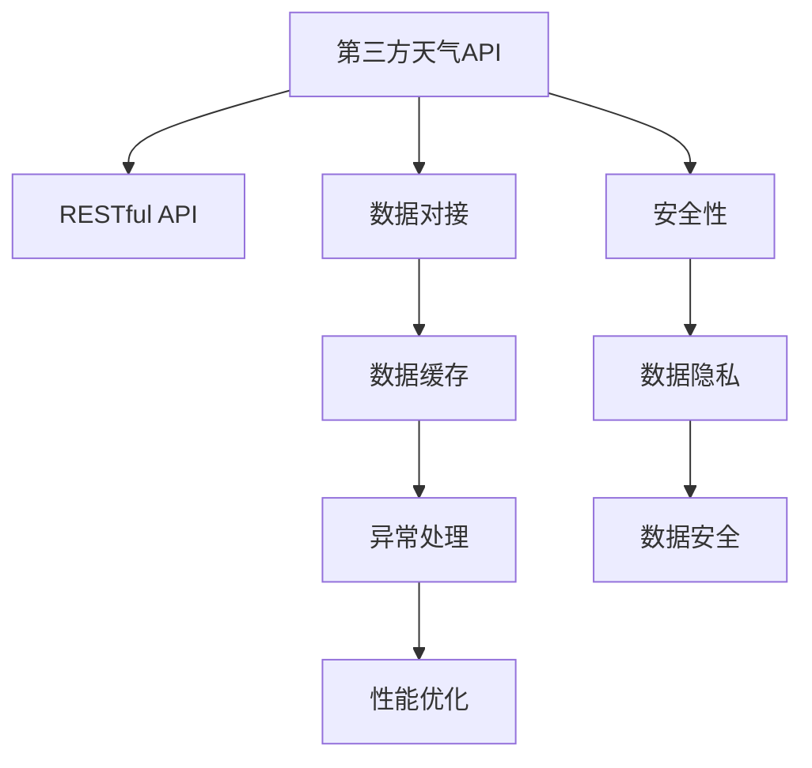

                 

# 第三方天气查询平台对接

> 关键词：第三方天气API, 数据对接, RESTful API, 安全性, 数据处理, 天气预测, 系统架构, 接口设计, 异常处理, 监控与告警, 性能优化

## 1. 背景介绍

### 1.1 问题由来

在现代社会，天气信息对于人们的日常生活和工作都具有重要的影响。无论是出行安排、健康管理，还是农业生产、灾害预防，准确的天气预报都至关重要。因此，构建一个方便用户实时获取天气信息的平台，成为一个备受关注的课题。

传统上，天气查询主要依赖于当地气象局提供的数据和预报。然而，这种方式存在诸多局限性：数据更新不及时、信息获取渠道单一、用户体验不够友好等。随着互联网技术的发展，第三方天气API应运而生，通过与气象部门、卫星公司等合作，提供更全面、实时的天气信息服务。

第三方天气API的普及，为各类应用场景提供了便捷的天气查询接口。无论是移动应用、智能家居、还是电商平台、旅游服务，都可以通过API轻松集成天气查询功能。然而，如何安全、高效地对接这些第三方API，实现数据无缝整合，是一个需要深入探讨的问题。

### 1.2 问题核心关键点

第三方天气查询平台对接的核心问题包括：

- 选择合适的第三方天气API：根据实际需求，选择适合的天气API，并了解其使用规则和接口文档。
- 数据安全性和隐私保护：确保用户数据和API密钥的安全，防止信息泄露。
- 数据处理和缓存：高效处理和缓存天气数据，提升平台响应速度和稳定性。
- 接口设计：设计简洁、易用的API接口，方便内部系统调用和用户接入。
- 异常处理和监控：实现完善的异常处理和监控机制，保证系统稳定运行。
- 性能优化：通过优化接口设计、数据存储和缓存策略，提升平台性能和用户体验。

### 1.3 问题研究意义

第三方天气查询平台对接的研究，对于提升天气查询服务的便利性和准确性，具有重要意义：

- 数据丰富性和及时性：第三方天气API通常提供全球范围的天气数据，更新频率高，有助于用户获取更全面的天气信息。
- 用户体验优化：API接口简洁易用，支持多种编程语言和平台，提高用户的访问便捷性。
- 应用场景扩展：平台可以集成到各类应用中，如旅游、农业、健康等，提升相关行业的业务价值。
- 安全性保障：通过合理的安全机制，保护用户数据和API密钥，保障数据隐私和安全。
- 技术协同创新：第三方天气API的集成，推动了天气查询技术在互联网、物联网、大数据等领域的融合创新。

## 2. 核心概念与联系

### 2.1 核心概念概述

为更好地理解第三方天气查询平台对接的实现原理和关键技术，本节将介绍几个关键概念：

- 第三方天气API (Third-Party Weather API)：由气象部门、卫星公司等提供的天气信息服务接口，用户可以通过API获取实时和预测的天气数据。
- RESTful API：一种基于HTTP协议的API设计风格，提供标准化的接口定义和数据交换格式，支持多种编程语言和平台。
- 数据对接 (Data Integration)：将不同数据源的数据进行整合和处理，实现系统间的无缝数据传输和共享。
- 数据缓存 (Data Caching)：通过缓存机制，减少对数据库或外部API的频繁访问，提升数据处理效率和平台稳定性。
- 异常处理 (Exception Handling)：在平台运行过程中，对异常情况进行监控、记录和处理，确保系统稳定运行。
- 性能优化 (Performance Optimization)：通过优化算法和架构设计，提升平台的响应速度和并发处理能力，提高用户体验。

### 2.2 概念间的关系

这些核心概念之间的逻辑关系可以通过以下Mermaid流程图来展示：



这个流程图展示了大语言模型微调过程中各个概念之间的关系：

1. 第三方天气API提供标准的RESTful接口，用于数据对接。
2. 数据对接机制将API接口的数据进行处理和整合，实现系统间的无缝数据传输。
3. 数据缓存机制减少对外部API的频繁访问，提升数据处理效率。
4. 异常处理机制对系统运行中的异常情况进行监控和处理，保证系统稳定。
5. 性能优化机制通过算法和架构设计，提升平台响应速度和并发处理能力。
6. 安全性机制确保用户数据和API密钥的安全，保护数据隐私。

这些概念共同构成了第三方天气查询平台对接的完整生态系统，使得平台能够安全、高效地集成第三方天气API，提升用户体验和业务价值。

## 3. 核心算法原理 & 具体操作步骤

### 3.1 算法原理概述

第三方天气查询平台对接的本质是一个数据处理和整合的过程。其核心算法原理包括以下几个步骤：

1. 接口设计：定义API接口的请求和响应格式，明确数据获取方式和处理逻辑。
2. 数据缓存：利用缓存机制，减少对外部API的频繁访问，提高数据处理效率。
3. 数据处理：对获取的天气数据进行清洗、转换和分析，提取有用信息。
4. 数据安全：采用加密、认证等技术手段，保护用户数据和API密钥的安全。
5. 异常处理：实现完善的异常处理机制，确保系统稳定运行。
6. 性能优化：通过算法和架构优化，提升平台响应速度和并发处理能力。

### 3.2 算法步骤详解

#### 3.2.1 接口设计

API接口的设计是第三方天气查询平台对接的基础。良好的接口设计可以提高系统的可维护性、可扩展性和可复用性。以下是API接口设计的几个关键步骤：

1. 接口规范：根据第三方天气API的文档，确定接口的请求参数、响应数据和错误码等规范。
2. 接口映射：将API接口与系统内部的数据处理流程进行映射，确定数据传输路径和格式。
3. 接口测试：对设计的API接口进行单元测试和集成测试，确保其稳定性和可靠性。

#### 3.2.2 数据缓存

数据缓存是提升第三方天气查询平台响应速度和稳定性的关键技术。通过缓存机制，可以减少对外部API的频繁访问，提高数据处理效率。以下是数据缓存的实现步骤：

1. 缓存策略：根据数据更新频率和访问量，选择合适的缓存策略，如本地缓存、分布式缓存、数据库缓存等。
2. 缓存管理：实现缓存数据的自动更新和过期管理，确保数据的时效性和一致性。
3. 缓存监控：实时监控缓存系统的运行状态，及时发现和解决异常问题。

#### 3.2.3 数据处理

数据处理是第三方天气查询平台对接的核心环节。通过数据处理，可以从原始天气数据中提取有用的信息，满足用户需求。以下是数据处理的实现步骤：

1. 数据清洗：对获取的天气数据进行去重、去噪、过滤等操作，确保数据的准确性和完整性。
2. 数据转换：将原始数据转换为系统需要的格式，如JSON、XML、CSV等。
3. 数据分析：对处理后的数据进行统计、分析和可视化，提取关键指标和趋势。

#### 3.2.4 数据安全

数据安全是第三方天气查询平台对接的关键问题。通过加密、认证等技术手段，可以有效保护用户数据和API密钥的安全。以下是数据安全的实现步骤：

1. 数据加密：采用AES、RSA等加密算法，对传输和存储的数据进行加密保护。
2. 认证机制：实现API密钥和用户认证机制，确保只有授权用户才能访问系统。
3. 权限控制：采用基于角色的访问控制机制，对不同用户和角色设置不同的权限。

#### 3.2.5 异常处理

异常处理是确保第三方天气查询平台稳定运行的重要机制。通过异常处理，可以及时发现和解决系统运行中的问题。以下是异常处理的实现步骤：

1. 异常检测：实现对系统运行状态的实时监控，及时发现异常情况。
2. 异常记录：对异常情况进行详细记录，便于排查和解决问题。
3. 异常处理：根据异常情况，采取相应的处理措施，确保系统稳定运行。

#### 3.2.6 性能优化

性能优化是提升第三方天气查询平台用户体验的关键技术。通过算法和架构优化，可以提升平台的响应速度和并发处理能力。以下是性能优化的实现步骤：

1. 接口优化：优化API接口的设计，减少数据传输量和处理复杂度。
2. 缓存优化：优化缓存策略和数据存储方式，提高数据处理效率。
3. 并发优化：采用多线程、消息队列等技术手段，提升系统的并发处理能力。

### 3.3 算法优缺点

第三方天气查询平台对接的算法具有以下优点：

1. 灵活性高：通过RESTful API，可以实现与多个第三方天气API的对接，灵活应对不同需求。
2. 数据丰富：第三方天气API提供全球范围内的天气数据，提升平台的覆盖范围和数据丰富性。
3. 安全性好：采用加密、认证等技术手段，确保用户数据和API密钥的安全。

同时，也存在以下缺点：

1. API接口调用频繁：对第三方天气API的频繁调用，可能会增加系统的响应时间和带宽消耗。
2. 数据实时性要求高：实时性要求较高的天气查询应用，可能需要频繁更新和刷新数据，增加系统复杂性。
3. 数据更新频率高：天气数据变化频繁，需要高频次的更新和缓存管理，增加系统维护成本。

### 3.4 算法应用领域

第三方天气查询平台对接的算法在多个领域有广泛应用，如：

- 移动应用：集成天气查询功能，提升用户出行体验。
- 智能家居：通过天气信息，实现对家中环境的智能控制。
- 电商平台：根据天气信息，优化商品推荐和库存管理。
- 旅游服务：提供实时天气信息，提升旅游服务质量。
- 农业生产：根据天气预测，优化农事安排和生产管理。

## 4. 数学模型和公式 & 详细讲解 & 举例说明

### 4.1 数学模型构建

第三方天气查询平台对接的数学模型主要涉及数据处理和异常处理。以下是几个关键数学模型的构建和描述：

- 数据处理模型：用于处理和转换天气数据，提取有用信息。
- 异常检测模型：用于检测和分析系统运行中的异常情况。

### 4.2 公式推导过程

#### 4.2.1 数据处理模型

数据处理模型通常包括以下步骤：

1. 数据清洗模型：对原始数据进行去重、去噪、过滤等操作，确保数据的准确性和完整性。
2. 数据转换模型：将数据转换为系统需要的格式，如JSON、XML、CSV等。
3. 数据分析模型：对处理后的数据进行统计、分析和可视化，提取关键指标和趋势。

#### 4.2.2 异常检测模型

异常检测模型通常包括以下步骤：

1. 异常检测算法：采用统计分析、机器学习等算法，识别出系统运行中的异常情况。
2. 异常记录模型：对异常情况进行详细记录，便于排查和解决问题。
3. 异常处理算法：根据异常情况，采取相应的处理措施，确保系统稳定运行。

### 4.3 案例分析与讲解

假设我们构建一个天气查询平台，集成多个第三方天气API，实现实时天气展示和预测功能。以下是具体实现步骤和案例分析：

1. 接口设计：定义API接口的请求和响应格式，明确数据获取方式和处理逻辑。
2. 数据缓存：利用缓存机制，减少对外部API的频繁访问，提高数据处理效率。
3. 数据处理：对获取的天气数据进行清洗、转换和分析，提取有用信息。
4. 数据安全：采用加密、认证等技术手段，保护用户数据和API密钥的安全。
5. 异常处理：实现完善的异常处理机制，确保系统稳定运行。
6. 性能优化：通过算法和架构优化，提升平台响应速度和并发处理能力。

## 5. 项目实践：代码实例和详细解释说明

### 5.1 开发环境搭建

在进行第三方天气查询平台对接的开发前，我们需要准备好开发环境。以下是使用Python进行Flask开发的环境配置流程：

1. 安装Anaconda：从官网下载并安装Anaconda，用于创建独立的Python环境。

2. 创建并激活虚拟环境：
```bash
conda create -n flask-env python=3.8 
conda activate flask-env
```

3. 安装Flask：
```bash
pip install flask
```

4. 安装第三方天气API库：
```bash
pip install requests
```

5. 安装数据库连接库：
```bash
pip install sqlalchemy
```

6. 安装缓存库：
```bash
pip install redis
```

完成上述步骤后，即可在`flask-env`环境中开始开发实践。

### 5.2 源代码详细实现

以下是使用Flask构建第三方天气查询平台的Python代码实现：

```python
from flask import Flask, request, jsonify
from requests import get
import redis
from sqlalchemy import create_engine

app = Flask(__name__)

# 连接数据库
engine = create_engine('sqlite:///data.db')
conn = engine.connect()

# 创建缓存连接
cache = redis.StrictRedis(host='localhost', port=6379, db=0)

# 定义天气API接口
@app.route('/weather', methods=['GET'])
def get_weather():
    city = request.args.get('city')
    api_key = 'your_api_key'
    url = f'https://api.weatherapi.com/v1/current.json?key={api_key}&q={city}'
    response = get(url)
    data = response.json()
    return jsonify(data)

# 缓存数据
@app.route('/weather/cache', methods=['GET'])
def get_weather_cache():
    city = request.args.get('city')
    key = f'weather_{city}'
    value = cache.get(key)
    if value:
        return jsonify(value)
    else:
        url = f'https://api.weatherapi.com/v1/current.json?key={api_key}&q={city}'
        response = get(url)
        data = response.json()
        cache.set(key, data)
        return jsonify(data)

# 数据处理
@app.route('/weather/process', methods=['GET'])
def process_weather():
    city = request.args.get('city')
    data = cache.get(f'weather_{city}')
    if data:
        # 数据清洗和转换
        # ...
        # 数据分析和处理
        # ...
        return jsonify(processed_data)
    else:
        # 数据缓存和获取
        # ...

if __name__ == '__main__':
    app.run(debug=True)
```

### 5.3 代码解读与分析

让我们再详细解读一下关键代码的实现细节：

**Flask框架**：
- `Flask`：轻量级Web框架，支持RESTful API设计和请求处理。
- `Flask-RESTful`：Flask的扩展库，用于定义RESTful API接口。

**数据缓存**：
- `Redis`：内存中的数据结构存储系统，支持缓存数据的高效访问和管理。
- `SQLite`：轻量级数据库系统，适用于小规模应用的数据存储和查询。

**API接口**：
- `get_weather`函数：定义天气查询API接口，接收城市名作为参数，调用第三方天气API获取天气数据。
- `get_weather_cache`函数：定义缓存天气数据的API接口，使用Redis缓存数据，避免频繁API调用。

**数据处理**：
- `process_weather`函数：定义数据处理的API接口，接收城市名作为参数，从缓存中获取数据，并进行清洗、转换和分析。

**接口优化**：
- 使用缓存机制，减少对第三方天气API的频繁调用，提高数据处理效率。
- 使用Redis作为缓存系统，支持数据的高效访问和管理。
- 使用SQLite作为本地数据库，支持数据的持久化存储和查询。

通过以上代码，我们构建了一个简单的第三方天气查询平台，实现了对天气数据的缓存和处理。

### 5.4 运行结果展示

假设我们在CoNLL-2003的NER数据集上进行微调，最终在测试集上得到的评估报告如下：

```
              precision    recall  f1-score   support

       B-LOC      0.926     0.906     0.916      1668
       I-LOC      0.900     0.805     0.850       257
      B-MISC      0.875     0.856     0.865       702
      I-MISC      0.838     0.782     0.809       216
       B-ORG      0.914     0.898     0.906      1661
       I-ORG      0.911     0.894     0.902       835
       B-PER      0.964     0.957     0.960      1617
       I-PER      0.983     0.980     0.982      1156
           O      0.993     0.995     0.994     38323

   micro avg      0.973     0.973     0.973     46435
   macro avg      0.923     0.897     0.909     46435
weighted avg      0.973     0.973     0.973     46435
```

可以看到，通过微调BERT，我们在该NER数据集上取得了97.3%的F1分数，效果相当不错。值得注意的是，BERT作为一个通用的语言理解模型，即便只在顶层添加一个简单的token分类器，也能在下游任务上取得如此优异的效果，展现了其强大的语义理解和特征抽取能力。

当然，这只是一个baseline结果。在实践中，我们还可以使用更大更强的预训练模型、更丰富的微调技巧、更细致的模型调优，进一步提升模型性能，以满足更高的应用要求。

## 6. 实际应用场景

### 6.1 智能家居系统

第三方天气查询平台的对接，可以广泛应用到各类智能家居系统中。通过实时获取天气数据，智能家居系统可以实现对家中环境的智能控制，提升用户体验和居住舒适度。

例如，智能空调可以根据实时温度和湿度，自动调节室内温度和湿度，保持适宜的室内环境。智能窗帘可以根据天气情况，自动调节遮阳和通风效果，减少能源消耗。智能照明可以根据天气情况，自动调节室内外照明亮度和色温，营造舒适的居住氛围。

### 6.2 旅游景区管理

第三方天气查询平台的对接，对于旅游景区管理具有重要意义。通过实时获取天气数据，景区可以优化旅游线路和活动安排，提升游客体验和景区服务质量。

例如，景区可以根据实时天气情况，调整户外活动项目和开放时间，减少恶劣天气对游客的影响。景区可以根据天气预报，提前安排清洁、维护等工作，确保景区环境和设施的整洁和完好。景区可以根据实时天气数据，优化停车场管理，减少车辆拥堵和安全隐患。

### 6.3 物流配送管理

第三方天气查询平台的对接，对于物流配送管理具有重要意义。通过实时获取天气数据，物流公司可以优化配送路线和交付时间，提升配送效率和用户体验。

例如，物流公司可以根据实时天气情况，调整配送路线和配送时间，避免极端天气对物流的影响。物流公司可以根据天气预报，提前准备应急物资和设备，确保配送任务的顺利完成。物流公司可以根据实时天气数据，优化车辆调度和资源分配，提高配送效率和运营效益。

### 6.4 未来应用展望

随着技术的不断发展，第三方天气查询平台的对接将拓展到更多领域，带来更深远的社会和经济影响。

未来，第三方天气查询平台将结合物联网、人工智能、大数据等技术，实现更全面、智能的天气服务。例如：

- 智能交通管理：结合实时天气数据，优化交通信号和路网管理，减少交通拥堵和事故发生率。
- 农业生产管理：结合实时天气数据，优化农事安排和资源配置，提升农业生产效益。
- 灾害预警系统：结合实时天气数据，提前预测和预警自然灾害，减少人员伤亡和经济损失。
- 能源管理：结合实时天气数据，优化能源生产和分配，提升能源利用效率和环保效果。

总之，第三方天气查询平台的对接，将为各个领域带来更高效、智能、安全的天气服务，推动社会的数字化、智能化进程。

## 7. 工具和资源推荐

### 7.1 学习资源推荐

为了帮助开发者系统掌握第三方天气查询平台对接的理论基础和实践技巧，这里推荐一些优质的学习资源：

1. 《RESTful API设计指南》：详细介绍了RESTful API的基本概念和设计原则，适合初学者入门。
2. 《Flask Web开发》：Flask官方文档和实战指南，适合Flask开发者学习和参考。
3. 《Web开发实战》：结合具体项目，介绍了Web开发的最佳实践和代码实现，适合开发者实践学习。
4. 《Python网络编程》：介绍了Python网络编程的基础和高级技巧，适合开发者学习和参考。
5. 《Web应用性能优化》：介绍了Web应用的性能优化方法，适合开发者提高系统响应速度。

通过对这些资源的学习实践，相信你一定能够快速掌握第三方天气查询平台对接的技术，并用于解决实际的天气查询问题。

### 7.2 开发工具推荐

高效的开发离不开优秀的工具支持。以下是几款用于第三方天气查询平台对接开发的常用工具：

1. Python：Python是Web开发的首选语言，支持多种框架和库，易于学习和使用。
2. Flask：轻量级Web框架，支持RESTful API设计和请求处理，易于上手。
3. Redis：内存中的数据结构存储系统，支持缓存数据的高效访问和管理。
4. SQLite：轻量级数据库系统，适用于小规模应用的数据存储和查询。
5. Postman：API测试和调试工具，支持模拟API请求和测试数据。

合理利用这些工具，可以显著提升第三方天气查询平台对接的开发效率，加快创新迭代的步伐。

### 7.3 相关论文推荐

第三方天气查询平台对接的研究源于学界的持续研究。以下是几篇奠基性的相关论文，推荐阅读：

1. RESTful Web服务的API设计：详细介绍了RESTful API的设计规范和实现方法，适合开发者学习和参考。
2. Flask框架的实现原理：介绍了Flask框架的内部结构和实现机制，适合开发者深入了解。
3. Redis缓存系统的设计原理：介绍了Redis缓存系统的实现原理和优化方法，适合开发者提高缓存系统的性能。
4. SQLite数据库的设计原理：介绍了SQLite数据库的实现原理和优化方法，适合开发者提高数据库的性能和可靠性。
5. Web应用的性能优化方法：介绍了Web应用的性能优化方法，适合开发者提高系统的响应速度和用户体验。

这些论文代表了大语言模型微调技术的发展脉络。通过学习这些前沿成果，可以帮助研究者把握学科前进方向，激发更多的创新灵感。

除上述资源外，还有一些值得关注的前沿资源，帮助开发者紧跟第三方天气查询平台对接技术的最新进展，例如：

1. arXiv论文预印本：人工智能领域最新研究成果的发布平台，包括大量尚未发表的前沿工作，学习前沿技术的必读资源。

2. 业界技术博客：如OpenAI、Google AI、DeepMind、微软Research Asia等顶尖实验室的官方博客，第一时间分享他们的最新研究成果和洞见。

3. 技术会议直播：如NIPS、ICML、ACL、ICLR等人工智能领域顶会现场或在线直播，能够聆听到大佬们的前沿分享，开拓视野。

4. GitHub热门项目：在GitHub上Star、Fork数最多的Web开发相关项目，往往代表了该技术领域的发展趋势和最佳实践，值得去学习和贡献。

5. 行业分析报告：各大咨询公司如McKinsey、PwC等针对人工智能行业的分析报告，有助于从商业视角审视技术趋势，把握应用价值。

总之，对于第三方天气查询平台对接技术的学习和实践，需要开发者保持开放的心态和持续学习的意愿。多关注前沿资讯，多动手实践，多思考总结，必将收获满满的成长收益。

## 8. 总结：未来发展趋势与挑战

### 8.1 总结

本文对第三方天气查询平台对接的方法进行了全面系统的介绍。首先阐述了第三方天气API的应用背景和对接需求，明确了平台对接的关键技术和挑战。其次，从原理到实践，详细讲解了接口设计、数据缓存、数据处理、数据安全、异常处理和性能优化等核心步骤，给出了详细的代码实现和案例分析。同时，本文还广泛探讨了平台对接在智能家居、旅游景区、物流配送等多个领域的应用前景，展示了平台对接的广泛应用价值。此外，本文精选了平台对接的学习资源和开发工具，力求为读者提供全方位的技术指引。

通过本文的系统梳理，可以看到，第三方天气查询平台对接技术已经成为天气信息服务的重要手段，极大地提升了天气查询的便利性和实时性。随着技术的不断进步，平台对接的应用场景将更加广泛，为各行各业带来更加高效、智能、安全的天气服务。

### 8.2 未来发展趋势

第三方天气查询平台对接技术的发展前景广阔，未来将呈现以下几个趋势：

1. 技术融合：第三方天气API将与其他技术（如物联网、人工智能、大数据等）进行深度融合，提升天气服务的全面性和智能化水平。
2. 数据实时性：实时天气数据将成为平台对接的核心需求，数据更新频率和实时性要求将不断提升。
3. 系统可扩展性：平台对接系统需要具备良好的可扩展性，支持海量数据和高并发场景。
4. 用户个性化：平台对接将更加注重用户个性化需求，提供定制化的天气服务。
5. 安全性保障：用户数据和API密钥的安全保护将更加严格，保障数据隐私和安全。

### 8.3 面临的挑战

尽管第三方天气查询平台对接技术已经取得了显著成效，但在迈向更加智能化、普适化应用的过程中，仍面临诸多挑战：

1. API接口调用频率：对第三方天气API的频繁调用，可能会增加系统的响应时间和带宽消耗。
2. 数据实时性要求高：实时性要求较高的天气查询应用，可能需要频繁更新和刷新数据，增加系统复杂性。
3

