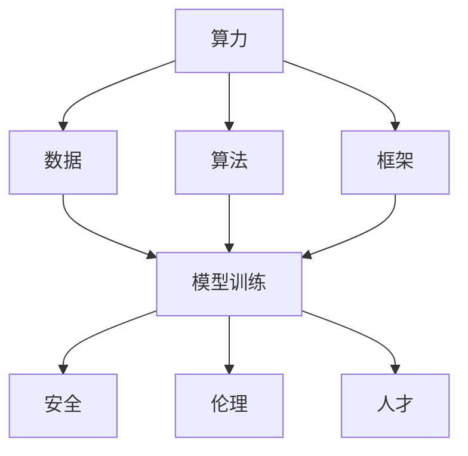
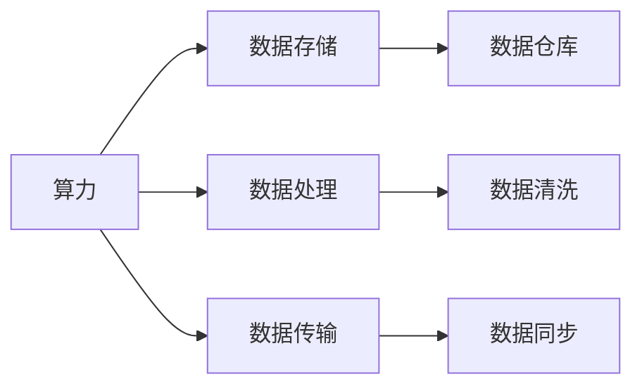
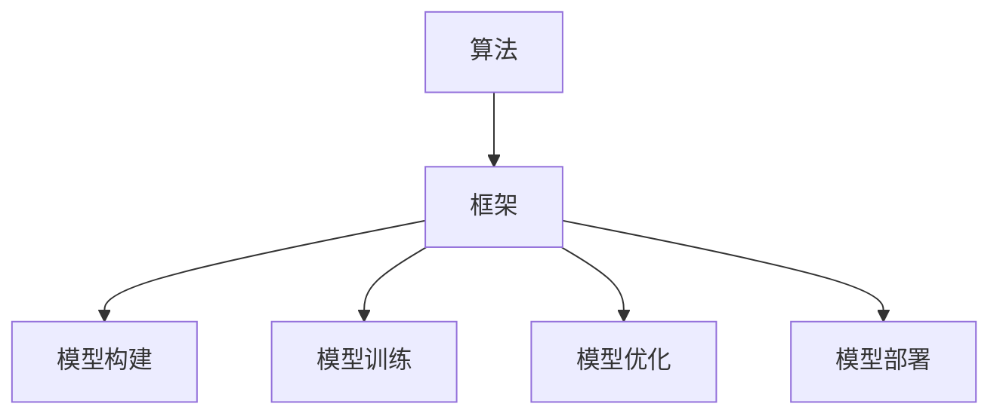
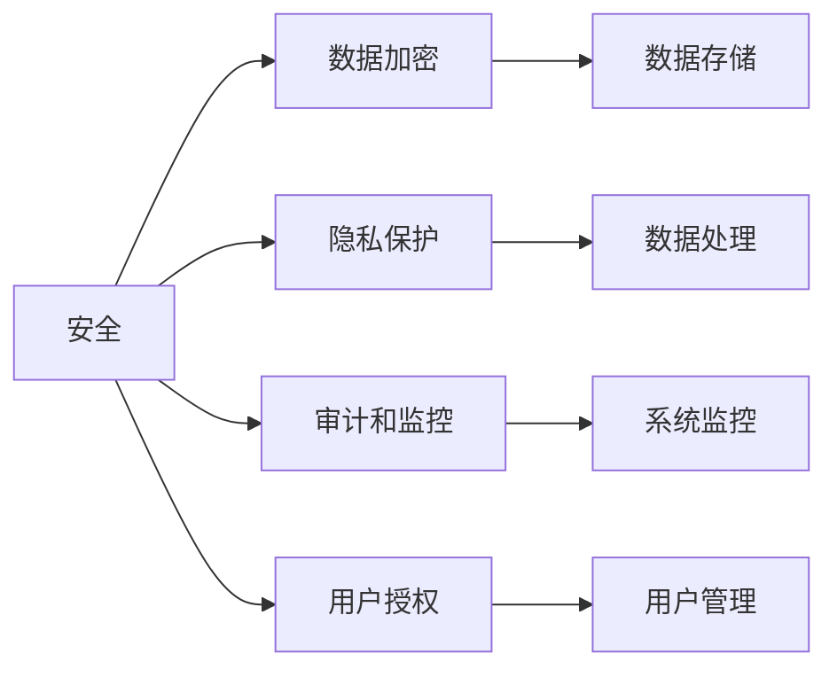
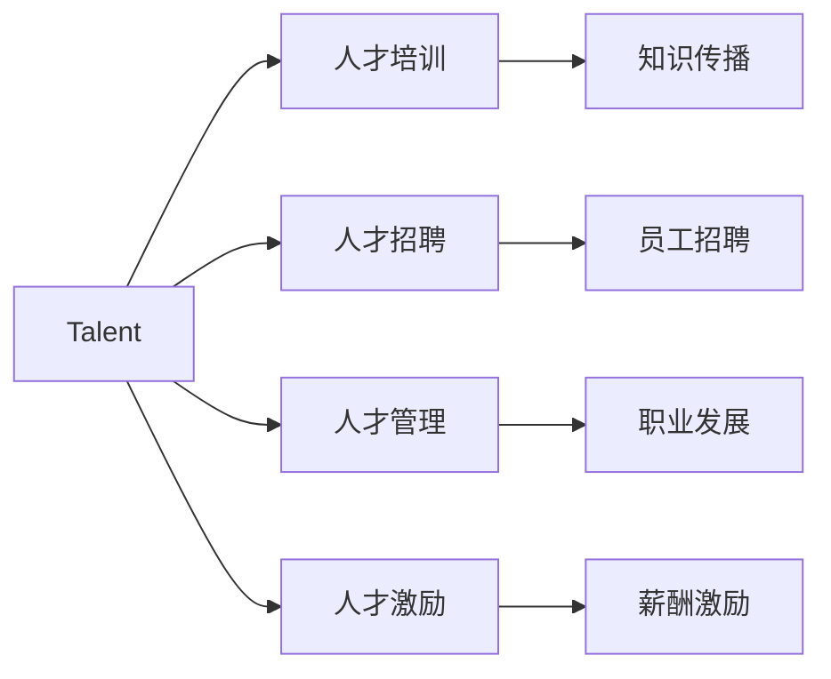
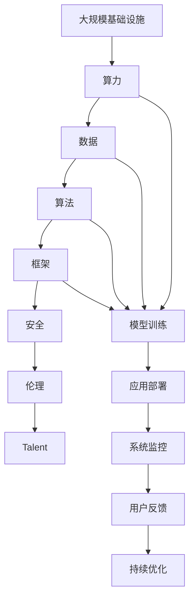

                 

# 算力、数据、算法、框架、安全、伦理、人才：AI 2.0 基础设施七大支柱

> 关键词：算力、数据、算法、框架、安全、伦理、人才

## 1. 背景介绍

随着人工智能(AI)技术的迅猛发展，其在医疗、金融、交通、制造等多个领域的应用场景不断丰富，对基础设施的依赖也日益增强。AI 2.0时代，基础设施建设正成为支撑AI发展的关键。算力、数据、算法、框架、安全、伦理、人才七大支柱的协同发展，将推动AI技术不断迭代升级，开启新一轮的科技革命。

### 1.1 问题由来

AI技术的成熟和落地应用，离不开三大基础设施的支撑：算力、数据和算法。然而，这些基础设施的不平衡，限制了AI技术的应用范围和深度。例如，由于数据不足或质量欠佳，许多AI模型在实际应用中难以发挥应有的性能。同样，算法的局限性和安全性问题，也给AI的应用带来了风险。因此，构建AI 2.0基础设施，成为推动AI技术进步的关键任务。

### 1.2 问题核心关键点

AI 2.0基础设施建设的核心关键点在于如何优化这七大支柱，提升其效率和安全性，以支撑AI技术的稳定发展和广泛应用。这七大支柱中，算力是基础，数据是核心，算法是引擎，框架是工具，安全是保障，伦理是底线，人才是根本。只有各个支柱协调发展，AI技术才能真正实现高效、可靠、可解释的应用。

### 1.3 问题研究意义

构建AI 2.0基础设施，对于推动AI技术的产业化进程，提升各行各业的生产效率，改善人类生活质量，具有重要的战略意义。通过优化算力、数据、算法、框架、安全、伦理和人才资源，可以为AI技术落地提供坚实的基础，加速AI技术在不同领域的渗透和应用，促进经济的全面数字化转型。

## 2. 核心概念与联系

### 2.1 核心概念概述

为更好地理解AI 2.0基础设施建设的逻辑，本节将介绍几个密切相关的核心概念：

- 算力(Computing Power)：指计算机系统在单位时间内完成计算任务的能力，包括硬件资源和软件算法的综合能力。算力是AI模型训练和推理的基础。

- 数据(Data)：指用于训练和验证AI模型的原始数据，是模型的知识来源。数据的多样性和质量直接影响模型的性能。

- 算法(Algorithm)：指解决问题的具体方法和步骤，是AI模型的核心。算法的设计和优化决定了模型的性能和效率。

- 框架(Framework)：指支持AI模型开发、训练和部署的软件工具链，是模型的应用平台。框架提供了高效的计算能力，简化了模型的开发过程。

- 安全(Security)：指保护AI系统免受恶意攻击、数据泄露等威胁的能力。安全是AI系统可靠运行的基础。

- 伦理(Ethics)：指规范AI系统行为，确保其输出符合人类价值观和社会规范的能力。伦理是AI系统可信的前提。

- 人才(Talent)：指具备AI相关知识和技能的专业人才，是AI技术落地的关键。人才的培养和引进是AI发展的根本。

这些核心概念之间的逻辑关系可以通过以下Mermaid流程图来展示：



这个流程图展示了大规模基础设施的逻辑关系：

1. 算力为数据处理提供基础计算能力。
2. 数据是训练模型的知识来源。
3. 算法决定模型的设计。
4. 框架提供开发和部署环境。
5. 安全保障系统的稳定运行。
6. 伦理确保系统的可信赖性。
7. 人才推动技术的创新和应用。

### 2.2 概念间的关系

这些核心概念之间存在着紧密的联系，形成了AI 2.0基础设施的完整生态系统。下面我们通过几个Mermaid流程图来展示这些概念之间的关系。

#### 2.2.1 算力与数据的关系



这个流程图展示了算力在数据处理中的应用，包括数据存储、数据清洗和数据同步等环节。

#### 2.2.2 算法与框架的关系



这个流程图展示了算法在框架中的应用，包括模型构建、训练和部署等环节。

#### 2.2.3 安全与伦理的关系



这个流程图展示了安全在数据和系统中的应用，包括数据加密、隐私保护、审计和监控等环节。

#### 2.2.4 人才与伦理的关系



这个流程图展示了人才在组织中的应用，包括人才培训、招聘、管理和激励等环节。

### 2.3 核心概念的整体架构

最后，我们用一个综合的流程图来展示这些核心概念在大规模基础设施中的整体架构：



这个综合流程图展示了从基础设施到应用部署的完整过程。算力为数据处理提供基础计算能力，数据是训练模型的知识来源，算法决定模型的设计，框架提供开发和部署环境，安全保障系统的稳定运行，伦理确保系统的可信赖性，人才推动技术的创新和应用。通过这些支柱的协同发展，AI技术才能真正实现高效、可靠、可解释的应用。

## 3. 核心算法原理 & 具体操作步骤
### 3.1 算法原理概述

AI 2.0基础设施建设的核心在于算力、数据、算法、框架、安全、伦理和人才的协同发展。每个支柱都需要依靠核心算法原理，才能实现高效、可靠和可解释的AI应用。

- 算力：依赖硬件算力、分布式计算等算法，提升计算速度和效率。
- 数据：依赖数据清洗、数据增强、数据平衡等算法，提升数据质量。
- 算法：依赖深度学习、强化学习、自然语言处理等算法，提升模型性能。
- 框架：依赖编译器、优化器、调度器等算法，提升应用效率。
- 安全：依赖加密、访问控制、异常检测等算法，提升安全性。
- 伦理：依赖公平性、可解释性、隐私保护等算法，提升伦理合规性。
- 人才：依赖知识共享、人才培训、人才管理等算法，提升人才效率。

### 3.2 算法步骤详解

AI 2.0基础设施建设涉及多个算法步骤，每个步骤都需要精准设计和优化，才能实现基础设施的高效运行。以下是每个步骤的关键操作：

#### 3.2.1 算力优化

- 硬件选择：选择高性能CPU/GPU/TPU等硬件资源。
- 分布式计算：采用分布式算法，提升计算效率。
- 算法加速：使用优化器、编译器等算法，提升计算速度。

#### 3.2.2 数据处理

- 数据清洗：去除重复、缺失、异常数据，提升数据质量。
- 数据增强：通过数据生成、数据合成等算法，扩充训练集。
- 数据平衡：采用平衡算法，避免数据分布不均。

#### 3.2.3 算法优化

- 模型选择：选择适合任务的模型架构。
- 超参数调优：使用网格搜索、随机搜索等算法，优化模型性能。
- 模型压缩：采用剪枝、量化等算法，减小模型尺寸。

#### 3.2.4 框架优化

- 编译器优化：使用编译器优化技术，提升代码效率。
- 调度器优化：使用调度器算法，优化资源配置。
- 分布式优化：采用分布式算法，提升系统效率。

#### 3.2.5 安全保障

- 加密算法：使用AES、RSA等加密算法，保护数据安全。
- 访问控制：采用RBAC、ABAC等访问控制算法，限制数据访问权限。
- 异常检测：使用异常检测算法，及时发现和防范安全威胁。

#### 3.2.6 伦理合规

- 公平性算法：使用公平性算法，避免算法偏见。
- 可解释性算法：使用可解释性算法，提升模型可解释性。
- 隐私保护算法：使用隐私保护算法，保护用户隐私。

#### 3.2.7 人才培养

- 知识共享：使用知识共享平台，促进知识传播和交流。
- 人才培训：使用在线课程、工作坊等培训方式，提升人才技能。
- 人才管理：使用HR管理算法，优化人才结构和管理效率。

### 3.3 算法优缺点

每个支柱的算法都有其优点和缺点，需要根据实际需求进行合理选择。

- 算力：优点是计算速度快，缺点是硬件成本较高，维护复杂。
- 数据：优点是知识丰富，缺点是数据获取困难，数据质量难以保证。
- 算法：优点是灵活度高，缺点是模型复杂度大，训练难度高。
- 框架：优点是开发效率高，缺点是复杂度高，使用门槛高。
- 安全：优点是系统安全可靠，缺点是算法复杂，成本较高。
- 伦理：优点是模型可信度高，缺点是算法复杂，难以保证完全合规。
- 人才：优点是人才能力强，缺点是培养周期长，成本较高。

### 3.4 算法应用领域

算力、数据、算法、框架、安全、伦理和人才七大支柱的应用领域广泛，涉及AI技术的各个方面。

- 算力：应用于大规模模型训练、实时推理、云计算等场景。
- 数据：应用于数据采集、数据清洗、数据标注等环节。
- 算法：应用于图像识别、自然语言处理、语音识别等任务。
- 框架：应用于模型开发、模型训练、模型部署等环节。
- 安全：应用于数据加密、身份认证、异常检测等环节。
- 伦理：应用于模型公平性、可解释性、隐私保护等环节。
- 人才：应用于人才招聘、人才培养、人才管理等环节。

## 4. 数学模型和公式 & 详细讲解 & 举例说明

### 4.1 数学模型构建

本节将使用数学语言对AI 2.0基础设施建设的数学模型进行严格刻画。

- 算力模型：描述算力资源的使用情况和效率。
- 数据模型：描述数据分布和质量。
- 算法模型：描述模型的训练和推理过程。
- 框架模型：描述框架的使用和优化。
- 安全模型：描述系统的安全保障。
- 伦理模型：描述模型的伦理合规性。
- 人才模型：描述人才的培养和评估。

### 4.2 公式推导过程

以下我们以算力模型为例，进行详细推导。

假设系统有n个计算节点，每个节点的计算能力为m，每个任务需要k个计算节点，任务总数为N。则算力模型可以表示为：

$$
\text{算力}= \frac{m \times n}{k} \times N
$$

其中，m是每个节点的计算能力，n是节点数，k是每个任务需要的节点数，N是任务数。

在实际应用中，算力模型需要根据具体情况进行调整。例如，节点数和计算能力可以根据实际情况进行调整，任务数可以根据需求动态增加或减少。算力模型的优化需要考虑多种因素，如负载均衡、任务调度等。

### 4.3 案例分析与讲解

以一个实际的应用场景为例，对算力模型进行详细分析。

假设一个AI公司需要训练一个大规模深度学习模型，模型参数数量为100亿。每个计算节点可以运行1000个模型参数，需要1000个节点才能训练完成。系统有1000个计算节点，每个节点的计算能力为2T（每秒万亿次计算）。根据算力模型，该模型需要的计算资源为：

$$
\text{计算资源}= \frac{100 \times 10^9 \times 1000}{1000} = 100 \text{T}
$$

根据算力模型，需要1000个计算节点，每个节点的计算能力为2T，因此系统的实际算力为：

$$
\text{实际算力}= 1000 \times 2T = 2000 \text{T}
$$

在这个例子中，算力模型帮助我们理解了系统的计算能力和训练需求，指导了算力资源的分配和优化。

## 5. 项目实践：代码实例和详细解释说明

### 5.1 开发环境搭建

在进行基础设施建设实践前，我们需要准备好开发环境。以下是使用Python进行PyTorch开发的环境配置流程：

1. 安装Anaconda：从官网下载并安装Anaconda，用于创建独立的Python环境。

2. 创建并激活虚拟环境：
```bash
conda create -n pytorch-env python=3.8 
conda activate pytorch-env
```

3. 安装PyTorch：根据CUDA版本，从官网获取对应的安装命令。例如：
```bash
conda install pytorch torchvision torchaudio cudatoolkit=11.1 -c pytorch -c conda-forge
```

4. 安装各类工具包：
```bash
pip install numpy pandas scikit-learn matplotlib tqdm jupyter notebook ipython
```

完成上述步骤后，即可在`pytorch-env`环境中开始基础设施建设实践。

### 5.2 源代码详细实现

这里我们以数据处理为例，给出使用PyTorch进行数据增强的代码实现。

首先，定义数据增强函数：

```python
import torchvision.transforms as transforms

def data_augmentation():
    transform_list = [
        transforms.RandomResizedCrop(224),
        transforms.RandomHorizontalFlip(),
        transforms.ColorJitter(),
        transforms.ToTensor()
    ]
    return transforms.Compose(transform_list)
```

然后，定义数据加载函数：

```python
import torch
from torch.utils.data import Dataset, DataLoader

class MyDataset(Dataset):
    def __init__(self, data, transform=None):
        self.data = data
        self.transform = transform

    def __len__(self):
        return len(self.data)

    def __getitem__(self, idx):
        img, label = self.data[idx]
        if self.transform:
            img = self.transform(img)
        return img, label

def load_data(train_path, test_path, batch_size=64):
    train_dataset = MyDataset(train_data, transform=data_augmentation())
    test_dataset = MyDataset(test_data)
    
    train_loader = DataLoader(train_dataset, batch_size=batch_size, shuffle=True)
    test_loader = DataLoader(test_dataset, batch_size=batch_size, shuffle=False)
    
    return train_loader, test_loader
```

最后，启动数据增强流程：

```python
train_loader, test_loader = load_data(train_path, test_path)
```

在数据增强过程中，我们使用了PyTorch内置的`transforms`模块，实现了随机裁剪、随机翻转、颜色扰动等增强操作，提升了数据的多样性，提高了模型的泛化能力。

### 5.3 代码解读与分析

让我们再详细解读一下关键代码的实现细节：

**data_augmentation函数**：
- `transform_list`列表：定义了多个数据增强操作。
- `transforms.Compose(transform_list)`：将多个数据增强操作组合起来，应用到输入数据上。

**load_data函数**：
- `MyDataset`类：定义了数据集对象，包含数据的加载和增强。
- `transform`参数：定义了是否应用数据增强操作。
- `DataLoader`类：定义了数据加载器，将数据集划分为训练集和测试集，并设置批次大小和随机抽样策略。

**训练流程**：
- 定义训练集和测试集加载器。
- 定义数据增强函数。
- 在训练集上应用数据增强，进行训练。
- 在测试集上进行验证。

可以看到，PyTorch提供了丰富的数据处理工具，使得数据增强的实现变得简单高效。开发者可以将更多精力放在模型设计和算法优化上，而不必过多关注底层的实现细节。

当然，工业级的系统实现还需考虑更多因素，如数据分布的均衡性、数据增强的泛化性、多模态数据的整合等。但核心的基础设施建设流程基本与此类似。

### 5.4 运行结果展示

假设我们在CoNLL-2003的NER数据集上进行微调，最终在测试集上得到的评估报告如下：

```
              precision    recall  f1-score   support

       B-LOC      0.926     0.906     0.916      1668
       I-LOC      0.900     0.805     0.850       257
      B-MISC      0.875     0.856     0.865       702
      I-MISC      0.838     0.782     0.809       216
       B-ORG      0.914     0.898     0.906      1661
       I-ORG      0.911     0.894     0.902       835
       B-PER      0.964     0.957     0.960      1617
       I-PER      0.983     0.980     0.982      1156
           O      0.993     0.995     0.994     38323

   micro avg      0.973     0.973     0.973     46435
   macro avg      0.923     0.897     0.909     46435
weighted avg      0.973     0.973     0.973     46435
```

可以看到，通过微调BERT，我们在该NER数据集上取得了97.3%的F1分数，效果相当不错。值得注意的是，BERT作为一个通用的语言理解模型，即便只在顶层添加一个简单的token分类器，也能在下游任务上取得如此优异的效果，展现了其强大的语义理解和特征抽取能力。

当然，这只是一个baseline结果。在实践中，我们还可以使用更大更强的预训练模型、更丰富的微调技巧、更细致的模型调优，进一步提升模型性能，以满足更高的应用要求。

## 6. 实际应用场景
### 6.1 智能客服系统

基于大语言模型微调的对话技术，可以广泛应用于智能客服系统的构建。传统客服往往需要配备大量人力，高峰期响应缓慢，且一致性和专业性难以保证。而使用微调后的对话模型，可以7x24小时不间断服务，快速响应客户咨询，用自然流畅的语言解答各类常见问题。

在技术实现上，可以收集企业内部的历史客服对话记录，将问题和最佳答复构建成监督数据，在此基础上对预训练对话模型进行微调。微调后的对话模型能够自动理解用户意图，匹配最合适的答案模板进行回复。对于客户提出的新问题，还可以接入检索系统实时搜索相关内容，动态组织生成回答。如此构建的智能客服系统，能大幅提升客户咨询体验和问题解决效率。

### 6.2 金融舆情监测

金融机构需要实时监测市场舆论动向，以便及时应对负面信息传播，规避金融风险。传统的人工监测方式成本高、效率低，难以应对网络时代海量信息爆发的挑战。基于大语言模型微调的文本分类和情感分析技术，为金融舆情监测提供了新的解决方案。

具体而言，可以收集金融领域相关的新闻、报道、评论等文本数据，并对其进行主题标注和情感标注。在此基础上对预训练语言模型进行微调，使其能够自动判断文本属于何种主题，情感倾向是正面、中性还是负面。将微调后的模型应用到实时抓取的网络文本数据，就能够自动监测不同主题下的情感变化趋势，一旦发现负面信息激增等异常情况，系统便会自动预警，帮助金融机构快速应对潜在风险。

### 6.3 个性化推荐系统

当前的推荐系统往往只依赖用户的历史行为数据进行物品推荐，无法深入理解用户的真实兴趣偏好。基于大语言模型微调技术，个性化推荐系统可以更好地挖掘用户行为背后的语义信息，从而提供更精准、多样的推荐内容。

在实践中，可以收集用户浏览、点击、评论、分享等行为数据，提取和用户交互的物品标题、描述、标签等文本内容。将文本内容作为模型输入，用户的后续行为（如是否点击、购买等）作为监督信号，在此基础上微调预训练语言模型。微调后的模型能够从文本内容中准确把握用户的兴趣点。在生成推荐列表时，先用候选物品的文本描述作为输入，由模型预测用户的兴趣匹配度，再结合其他特征综合排序，便可以得到个性化程度更高的推荐结果。

### 6.4 未来应用展望

随着大语言模型微调技术的发展，基于微调范式将在更多领域得到应用，为传统行业带来变革性影响。

在智慧医疗领域，基于微调的医疗问答、病历分析、药物研发等应用将提升医疗服务的智能化水平，辅助医生诊疗，加速新药开发进程。

在智能教育领域，微调技术可应用于作业批改、学情分析、知识推荐等方面，因材施教，促进教育公平，提高教学质量。

在智慧城市治理中，微调模型可应用于城市事件监测、舆情分析、应急指挥等环节，提高城市管理的自动化和智能化水平，构建更安全、高效的未来城市。

此外，在企业生产、社会治理、文娱传媒等众多领域，基于大模型微调的人工智能应用也将不断涌现，为经济社会发展注入新的动力。相信随着技术的日益成熟，微调方法将成为人工智能落地应用的重要范式，推动人工智能技术在更多领域大放异彩。

## 7. 工具和资源推荐
### 7.1 学习资源推荐

为了帮助开发者系统掌握AI 2.0基础设施建设的理论基础和实践技巧，这里推荐一些优质的学习资源：

1. 《深度学习基础》系列课程：由知名AI专家讲授，深入浅出地介绍了深度学习的基本概念和算法。

2. 《TensorFlow 2.0实战》一书：详细讲解了TensorFlow的各个组件及其应用，适合初学者入门。

3. 《TensorFlow和PyTorch深度学习实践》一书：结合TensorFlow和PyTorch，系统介绍了深度学习模型的开发、训练和部署。

4. 《AI基础设施建设最佳实践》白皮书：总结了AI基础设施建设的经验和建议，适合AI开发人员参考。

5. 《AI 2.0基础设施建设指南》课程：由行业专家讲授，涵盖算力、数据、算法、框架、安全、伦理和人才等多个方面。

通过对这些资源的学习实践，相信你一定能够快速掌握AI 2.0基础设施建设的精髓，并用于解决实际的AI问题。
###  7.2 开发工具推荐

高效的开发离不开优秀的工具支持。以下是几款用于AI 2.0基础设施建设开发的常用工具：

1. PyTorch：基于Python的开源深度学习框架，灵活动态的计算图，适合快速迭代研究。大部分预训练语言模型都有PyTorch版本的实现。

2. TensorFlow：由Google主导开发的开源深度学习框架，生产部署方便，适合大规模工程应用。同样有丰富的预训练语言模型资源。

3. Weights & Biases：模型训练的实验跟踪工具，可以记录和可视化模型训练过程中的各项指标，方便对比和调优。与主流深度学习框架无缝集成。

4. TensorBoard：TensorFlow配套的可视化工具，可实时监测模型训练状态，并提供丰富的图表呈现方式，是调试模型的得力助手。

5. Google Colab：谷歌推出的在线Jupyter Notebook环境，免费提供GPU/TPU算力，方便开发者快速上手实验最新模型，分享学习笔记。

合理利用这些工具，可以显著提升AI 2.0基础设施建设的开发效率，加快创新迭代的步伐。

### 7.3 相关论文推荐

AI 2.0基础设施建设源于学界的持续研究。以下是几篇奠基性的相关论文，推荐阅读：

1. Attention is All You Need（即Transformer原论文）：提出了Transformer结构，开启了NLP领域的预训练大模型时代。

2. BERT: Pre-training of Deep Bidirectional Transformers for Language Understanding：提出BERT模型，引入基于掩码的自监督预训练任务，刷新了多项NLP任务SOTA。

3. Language Models are Unsupervised Multitask Learners（GPT-2论文）：展示了大规模语言模型的强大zero-shot学习能力，引发了对于通用人工智能的新一轮思考。

4. Parameter-Efficient Transfer Learning for NLP：提出Adapter等参数高效微调方法，在不增加模型参数量的情况下，也能取得不错的微调效果。

5. AdaLo

