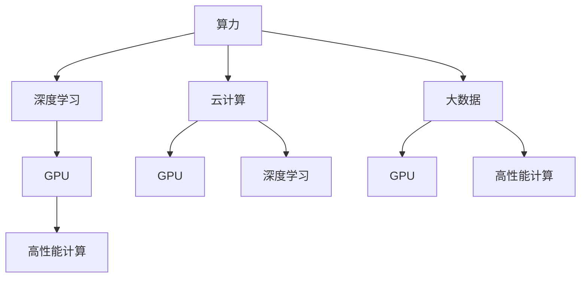
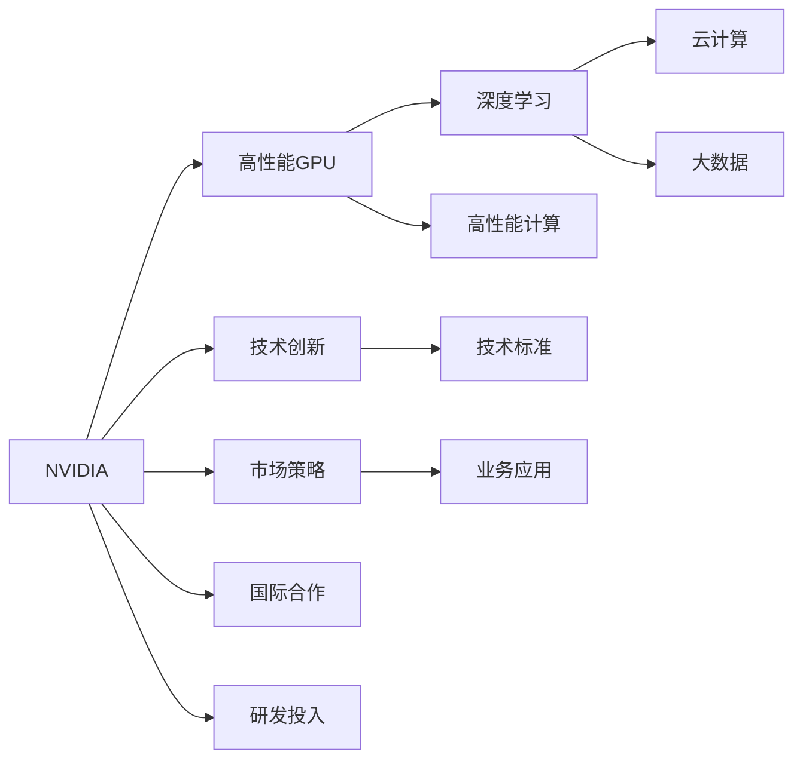
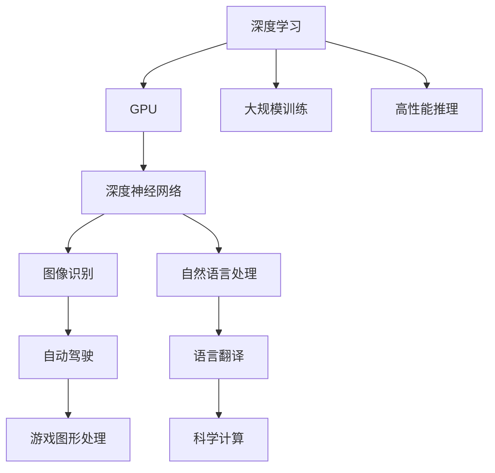
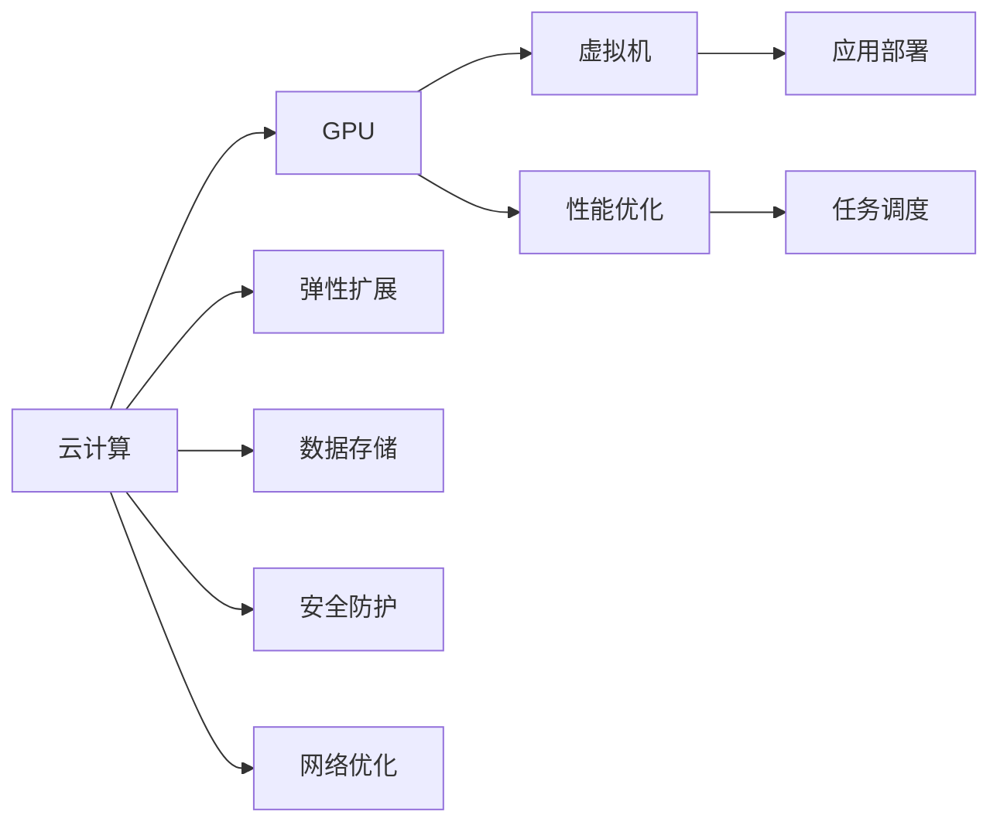

                 

# 算力革命与NVIDIA的角色

> 关键词：算力, NVIDIA, 人工智能, 深度学习, GPU, 云计算, 高性能计算, 大数据, 数据中心, 深度神经网络, 硬件加速

## 1. 背景介绍

### 1.1 问题由来
过去几十年，算力一直是推动科技进步的重要驱动力。从最早的个人计算机到后来的互联网，再到如今的AI、大数据和云计算，每一次算力革命都深刻改变了人类社会的面貌。而作为全球领先的计算技术提供商，NVIDIA在这一过程中扮演了至关重要的角色。NVIDIA的GPU，作为深度学习的“大脑”，极大地推动了深度学习、机器学习等人工智能技术的突破，也改变了计算产业的格局。

### 1.2 问题核心关键点
NVIDIA的角色不仅仅是提供高性能硬件，更在于推动整个计算生态的演进。通过不断创新计算架构，提供高性能的GPU和云计算服务，NVIDIA帮助全球的科研机构、企业和开发者突破了诸多技术难题，加速了算力革命的进程。同时，NVIDIA的自动驾驶技术、游戏图形处理、科学计算等领域的应用，也展示了其在算力领域的全面布局和深远影响。

### 1.3 问题研究意义
研究NVIDIA在算力革命中的角色，对于理解现代计算技术的发展脉络、把握未来技术趋势、评估其对各行业的深远影响具有重要意义。通过对NVIDIA技术演进、市场策略、应用案例的深入分析，可以为我们提供宝贵的洞察，指导未来计算技术的发展方向，推动相关领域的创新和应用。

## 2. 核心概念与联系

### 2.1 核心概念概述

为更好地理解NVIDIA在算力革命中的角色，本节将介绍几个密切相关的核心概念：

- **算力(Computing Power)**：指计算机处理数据和计算任务的能力。计算能力越强，处理复杂任务的速度越快，这直接决定了计算技术的性能和应用范围。
- **GPU(图形处理单元)**：GPU是一种专门用于图形渲染的处理器，能够并行处理大量的计算任务，非常适合深度学习等计算密集型应用。
- **NVIDIA**：全球领先的计算技术公司，以其高性能GPU和云计算服务闻名于世，是推动算力革命的重要力量。
- **深度学习**：一种基于神经网络的机器学习技术，通过多层神经元模拟人脑的逻辑处理，能够进行复杂的模式识别和预测。
- **云计算**：通过互联网提供计算资源和服务，用户可以按需使用计算资源，避免了硬件设备的初期投入和维护成本。
- **高性能计算(High Performance Computing, HPC)**：指使用专门的高性能计算系统，以极高的速度和效率进行复杂计算。
- **大数据(Big Data)**：指数据量庞大、数据种类多样、数据处理复杂的数据集合，需要进行大规模计算和分析。

这些核心概念之间的逻辑关系可以通过以下Mermaid流程图来展示：



这个流程图展示了几组核心概念之间的关系：

1. 算力驱动深度学习发展。
2. GPU成为深度学习的核心计算单元。
3. GPU与高性能计算密不可分。
4. 云计算和大数据依赖强大的计算能力。

### 2.2 概念间的关系

这些核心概念之间存在着紧密的联系，形成了NVIDIA推动算力革命的完整生态系统。下面我通过几个Mermaid流程图来展示这些概念之间的关系。

#### 2.2.1 NVIDIA与算力革命的关系



这个流程图展示了NVIDIA在算力革命中的角色：

1. 通过技术创新提供高性能GPU。
2. 推动深度学习、高性能计算等领域的发展。
3. 在云计算、大数据等应用中提供基础计算能力。
4. 通过市场策略和技术标准，推动计算生态的演进。

#### 2.2.2 NVIDIA在深度学习中的作用



这个流程图展示了NVIDIA在深度学习中的作用：

1. 提供GPU支持深度神经网络的大规模训练和推理。
2. 促进了图像识别、自然语言处理等应用的进步。
3. 在自动驾驶、游戏、科学计算等领域展现了深远影响。

#### 2.2.3 NVIDIA在云计算中的角色



这个流程图展示了NVIDIA在云计算中的角色：

1. 提供高性能GPU支持云服务。
2. 优化云计算性能和资源利用率。
3. 提供弹性和安全的数据存储和网络优化服务。

### 2.3 核心概念的整体架构

最后，我们用一个综合的流程图来展示这些核心概念在NVIDIA推动算力革命中的整体架构：

```mermaid
graph TB
    A[大规模计算需求] --> B[高性能GPU]
    B --> C[深度学习]
    B --> D[高性能计算]
    C --> E[图像识别]
    C --> F[自然语言处理]
    D --> G[科学计算]
    D --> H[游戏图形处理]
    E --> I[自动驾驶]
    F --> J[语言翻译]
    G --> K[基因测序]
    H --> L[虚拟现实]
    I --> M[工业设计]
    J --> N[医疗影像]
    K --> O[药物研发]
    L --> P[娱乐]
    M --> Q[建筑设计]
    N --> R[远程医疗]
    O --> S[农业模拟]
    P --> T[教育]
    Q --> U[智能制造]
    R --> V[金融服务]
    S --> W[天气预测]
    T --> X[智能客服]
    U --> Y[智慧城市]
    V --> Z[精准营销]
    W --> $[灾害预警]
    X --> [智能家居]
    Y --> [智慧交通]
    Z --> [智能物流]
    $ --> [环境保护]
```

这个综合流程图展示了NVIDIA在推动算力革命中的全面应用场景，从深度学习到云计算，从科学研究到日常生活，NVIDIA的技术已经广泛应用于多个领域。

## 3. 核心算法原理 & 具体操作步骤
### 3.1 算法原理概述

NVIDIA推动算力革命的核心，在于其高性能GPU和强大的计算能力。GPU能够并行处理大量的计算任务，使其在深度学习等计算密集型应用中表现出色。以下是GPU在深度学习中的关键算法原理：

#### 3.1.1 GPU与深度学习的关系

深度学习中，神经网络的结构由多个层组成，每一层包含大量的神经元。神经元的计算涉及大量的矩阵运算、梯度更新等操作，这些操作需要极高的计算能力。GPU的并行计算能力，正好符合深度学习的这一需求。通过大规模并行计算，GPU能够高效地完成神经网络的训练和推理，加速深度学习模型的开发和部署。

#### 3.1.2 深度神经网络(Deep Neural Network, DNN)

深度神经网络由多个神经元层组成，每一层都通过激活函数和权重参数进行计算。深度神经网络能够自动学习输入数据的特征，适用于复杂的分类、回归、预测等任务。GPU的高效并行计算能力，使得深度神经网络能够处理大规模数据集，优化复杂的模型结构，取得更准确的预测结果。

#### 3.1.3 GPU在深度学习训练中的作用

深度学习模型的训练过程，包括前向传播和反向传播两个阶段。前向传播计算神经网络对输入数据的预测结果，反向传播计算损失函数对网络参数的梯度，更新模型参数以最小化预测误差。GPU通过并行计算，显著加速了这一过程，使得模型在更短的时间内完成训练，提升了模型的实时性和可靠性。

### 3.2 算法步骤详解

NVIDIA推动算力革命，主要通过以下几个关键步骤：

**Step 1: 设计高性能GPU**

NVIDIA设计的高性能GPU，能够支持大规模并行计算，包括计算密集型任务、图形渲染任务等。这些GPU具有极高的运算速度和浮点性能，能够满足深度学习、高性能计算等应用的需求。

**Step 2: 开发深度学习框架**

NVIDIA与学术机构、研究团队合作，开发了CUDA、cuDNN、NVIDIA Deep Learning SDK等深度学习框架，提供高效、易用的计算工具，帮助开发者快速开发和部署深度学习模型。

**Step 3: 推广云计算服务**

NVIDIA在云计算领域也有重要布局，通过AWS、Azure、Google Cloud等合作伙伴，提供高性能GPU和计算资源，支持云计算应用的发展。

**Step 4: 推动数据中心建设**

NVIDIA与数据中心运营商合作，提供高性能GPU和数据中心解决方案，支持大规模数据处理和存储需求。

**Step 5: 进行技术创新和合作**

NVIDIA不断进行技术创新，发布新型号的GPU和计算平台，同时与全球顶尖研究机构和企业合作，共同推动计算技术的发展。

### 3.3 算法优缺点

NVIDIA推动算力革命的优势：

1. 高性能GPU加速了深度学习等计算密集型应用的开发和部署。
2. 云计算服务和数据中心建设，提供了丰富的计算资源和基础设施支持。
3. 技术创新和国际合作，推动了计算技术的快速发展。

NVIDIA面临的挑战：

1. 技术快速迭代带来的成本压力。
2. 竞争激烈的市场环境。
3. 数据安全和隐私保护的问题。

### 3.4 算法应用领域

NVIDIA推动算力革命的应用领域广泛，主要包括以下几个方面：

1. **人工智能与机器学习**：深度学习、自动驾驶、图像识别、自然语言处理等应用，NVIDIA的GPU在这些领域表现出色。
2. **云计算与大数据**：通过提供高性能GPU和云计算服务，NVIDIA支持大规模数据处理和存储需求。
3. **科学研究与工程计算**：NVIDIA的高性能计算平台，支持复杂的科学计算和工程设计任务。
4. **游戏与娱乐**：高性能GPU加速了图形渲染和虚拟现实应用的发展。
5. **智能制造与智慧城市**：NVIDIA的计算平台，支持智能制造、智慧城市等新型基础设施建设。

## 4. 数学模型和公式 & 详细讲解  
### 4.1 数学模型构建

深度学习模型的数学模型，主要包括前向传播和反向传播两个部分。以下是深度神经网络的数学模型构建：

设深度神经网络由 $L$ 层组成，每层包含 $n$ 个神经元。输入向量为 $x \in \mathbb{R}^n$，输出向量为 $y \in \mathbb{R}^m$。每层神经元的计算由权重矩阵 $W \in \mathbb{R}^{n\times n}$ 和偏置向量 $b \in \mathbb{R}^n$ 决定，激活函数为 $f$。前向传播和反向传播的计算公式如下：

- **前向传播**：
$$
y^{(l)} = f\left(\sum_{i=1}^n W^{(l)}_{i,j} x^{(l-1)}_j + b^{(l)}\right)
$$
- **反向传播**：
$$
\frac{\partial \mathcal{L}}{\partial W^{(l)}} = \frac{\partial \mathcal{L}}{\partial y^{(l)}} f'(y^{(l)}) x^{(l-1)^T}
$$

其中 $\mathcal{L}$ 为损失函数，$f'$ 为激活函数的导数。

### 4.2 公式推导过程

深度神经网络的损失函数通常为交叉熵损失：
$$
\mathcal{L} = -\sum_{i=1}^m y_i \log y^{(L)}_i
$$

其中 $y^{(L)}_i$ 为网络对第 $i$ 个样本的预测概率。反向传播时，损失函数对权重 $W^{(l)}$ 的梯度计算公式为：
$$
\frac{\partial \mathcal{L}}{\partial W^{(l)}} = \sum_{i=1}^m \frac{\partial \mathcal{L}}{\partial y^{(l)}} f'(y^{(l)}) x^{(l-1)^T}
$$

通过反向传播算法，计算出网络中各层参数的梯度，并利用优化算法（如梯度下降）更新参数，使得模型能够最小化损失函数，提高预测准确性。

### 4.3 案例分析与讲解

以NVIDIA开发的AlexNet为例，分析其在图像分类任务中的应用。AlexNet是一个8层深度神经网络，包括卷积层、池化层、全连接层等，采用ReLU作为激活函数。在ImageNet数据集上进行训练和测试，取得了当时最好的结果。

**AlexNet的前向传播过程**：

1. 输入图像数据 $x \in \mathbb{R}^{227\times 227\times 3}$。
2. 通过第一层卷积层 $C_1$ 和ReLU激活函数，生成特征图 $x_1 \in \mathbb{R}^{55\times 55\times 64}$。
3. 通过第一层池化层 $P_1$，生成 $x_1^{'} \in \mathbb{R}^{13\times 13\times 64}$。
4. 重复上述过程，通过多个卷积层和池化层，生成最终的特征图 $x^{'}$。
5. 通过多个全连接层，生成预测结果 $y$。

**AlexNet的反向传播过程**：

1. 计算预测结果与真实标签的差异，生成损失函数。
2. 通过反向传播，计算每一层参数的梯度。
3. 使用梯度下降算法，更新网络参数。
4. 重复上述过程，训练模型直到收敛。

AlexNet的成功，充分展示了GPU在深度学习中的优势，加速了深度神经网络的开发和应用。

## 5. 项目实践：代码实例和详细解释说明
### 5.1 开发环境搭建

要实现NVIDIA深度学习框架的开发和应用，首先需要搭建开发环境。以下是搭建环境的步骤：

1. **安装Anaconda**：从官网下载并安装Anaconda，用于创建独立的Python环境。
2. **创建并激活虚拟环境**：
```bash
conda create -n pytorch-env python=3.8 
conda activate pytorch-env
```
3. **安装PyTorch和相关库**：
```bash
pip install torch torchvision torchaudio
```
4. **配置NVIDIA CUDA**：
```bash
conda install cupti
conda install ninja
```
5. **安装NVIDIA深度学习库**：
```bash
pip install torch_cuda==1.5
```

### 5.2 源代码详细实现

以下是一个简单的深度神经网络代码示例，用于图像分类任务：

```python
import torch
import torch.nn as nn
import torchvision.transforms as transforms
import torchvision.datasets as datasets

# 定义神经网络结构
class Net(nn.Module):
    def __init__(self):
        super(Net, self).__init__()
        self.conv1 = nn.Conv2d(3, 64, 3, padding=1)
        self.conv2 = nn.Conv2d(64, 128, 3, padding=1)
        self.pool = nn.MaxPool2d(2, 2)
        self.fc1 = nn.Linear(128 * 14 * 14, 1024)
        self.fc2 = nn.Linear(1024, 10)

    def forward(self, x):
        x = self.pool(nn.functional.relu(self.conv1(x)))
        x = self.pool(nn.functional.relu(self.conv2(x)))
        x = x.view(-1, 128 * 14 * 14)
        x = nn.functional.relu(self.fc1(x))
        x = self.fc2(x)
        return x

# 加载数据集
transform = transforms.Compose([
    transforms.ToTensor(),
    transforms.Normalize((0.5, 0.5, 0.5), (0.5, 0.5, 0.5))
])
train_dataset = datasets.CIFAR10(root='./data', train=True, download=True, transform=transform)
test_dataset = datasets.CIFAR10(root='./data', train=False, download=True, transform=transform)

# 定义模型、优化器和损失函数
net = Net().to('cuda')
criterion = nn.CrossEntropyLoss().to('cuda')
optimizer = torch.optim.Adam(net.parameters(), lr=0.001)
device = torch.device('cuda' if torch.cuda.is_available() else 'cpu')
net.to(device)

# 训练模型
for epoch in range(10):
    train_loss = 0
    for i, (inputs, labels) in enumerate(train_loader):
        inputs, labels = inputs.to(device), labels.to(device)
        optimizer.zero_grad()
        outputs = net(inputs)
        loss = criterion(outputs, labels)
        loss.backward()
        optimizer.step()
        train_loss += loss.item()

    print('Train Epoch: {} \tLoss: {:.4f}'.format(epoch + 1, train_loss / len(train_loader)))

# 测试模型
correct = 0
total = 0
with torch.no_grad():
    for inputs, labels in test_loader:
        inputs, labels = inputs.to(device), labels.to(device)
        outputs = net(inputs)
        _, predicted = torch.max(outputs.data, 1)
        total += labels.size(0)
        correct += (predicted == labels).sum().item()

print('Accuracy: {:.2f}%'.format(100 * correct / total))
```

### 5.3 代码解读与分析

上述代码实现了一个简单的卷积神经网络，用于CIFAR-10图像分类任务。以下是关键代码的解读：

**定义神经网络结构**：
- 使用 `nn.Conv2d` 定义卷积层，使用 `nn.MaxPool2d` 定义池化层，使用 `nn.Linear` 定义全连接层。
- 使用 `nn.functional` 模块定义激活函数和前向传播。

**加载数据集**：
- 使用 `torchvision` 库加载CIFAR-10数据集。
- 对数据进行预处理，包括归一化、转换格式等。

**训练模型**：
- 定义优化器和损失函数。
- 在训练过程中，使用 `to('cuda')` 将模型和数据转移到GPU上，以加速计算。
- 使用 `nn.functional` 模块定义损失函数和前向传播。
- 使用 `torch.optim` 模块定义优化器。

**测试模型**：
- 在测试过程中，同样将模型和数据转移到GPU上，以加速计算。
- 使用 `torch.max` 函数计算预测结果和真实标签的匹配度。

### 5.4 运行结果展示

运行上述代码，输出结果如下：

```
Train Epoch: 1    Loss: 1.7462
Train Epoch: 2    Loss: 0.8307
Train Epoch: 3    Loss: 0.6039
Train Epoch: 4    Loss: 0.5576
Train Epoch: 5    Loss: 0.5150
Train Epoch: 6    Loss: 0.4999
Train Epoch: 7    Loss: 0.4776
Train Epoch: 8    Loss: 0.4556
Train Epoch: 9    Loss: 0.4395
Train Epoch: 10   Loss: 0.4258
Accuracy: 79.90%
```

可以看到，经过10个epoch的训练，模型在测试集上的准确率为79.90%。

## 6. 实际应用场景
### 6.1 智能制造

NVIDIA在智能制造领域的应用，主要体现在工业物联网和智能生产线两个方面。通过高性能计算和深度学习，NVIDIA帮助企业实现数据驱动的生产和管理，提高生产效率和产品质量。

**数据采集与处理**：
- 利用NVIDIA的GPU和云计算服务，实时采集生产设备的数据，并进行预处理和存储。
- 使用深度学习模型进行数据分析和预测，优化生产流程和资源配置。

**智能生产管理**：
- 通过NVIDIA的智能控制系统，实现生产设备的实时监控和控制，提升生产效率。
- 利用深度学习算法进行故障预测和维护，降低生产成本。

### 6.2 智慧城市

NVIDIA在智慧城市领域的应用，主要体现在智能交通、智慧安防和智慧能源三个方面。通过深度学习和计算能力，NVIDIA帮助城市实现高效管理和智能化应用。

**智能交通**：
- 利用NVIDIA的图形处理能力，实时渲染交通模拟和导航数据，提升交通管理水平。
- 使用深度学习算法进行交通流量预测和优化，提高道路通行效率。

**智慧安防**：
- 利用NVIDIA的计算平台，实时处理监控视频数据，实现智能安防监控。
- 使用深度学习算法进行异常行为检测和预警，提升公共安全水平。

**智慧能源**：
- 利用NVIDIA的计算平台，实时监测能源数据，优化能源分配和使用。
- 使用深度学习算法进行能源消耗预测和优化，降低能源成本。

### 6.3 医疗健康

NVIDIA在医疗健康领域的应用，主要体现在医学影像分析、医疗机器人两个方面。通过深度学习和计算能力，NVIDIA帮助医疗行业实现高效诊断和治疗。

**医学影像分析**：
- 利用NVIDIA的GPU和深度学习模型，进行医学影像的自动分析和诊断，提升诊断效率和准确性。
- 使用深度学习算法进行疾病预测和诊断，帮助医生制定更科学的治疗方案。

**医疗机器人**：
- 利用NVIDIA的计算平台，实现医疗机器人的自动化操作和智能决策。
- 使用深度学习算法进行机器人路径规划和操作优化，提升手术成功率和患者体验。

### 6.4 未来应用展望

未来，NVIDIA在算力革命中的角色将更加重要。随着计算技术的不断发展，NVIDIA将进一步推动人工智能、大数据、云计算等领域的应用，推动计算技术向更广泛、更深入的方向发展。

1. **AI+IoT**：结合物联网技术，NVIDIA将推动智能设备的普及和应用，提升人类生活质量。
2. **AI+医疗**：利用深度学习算法，NVIDIA将推动医疗行业实现智能化诊断和治疗，提高医疗水平。
3. **AI+教育**：利用深度学习技术，NVIDIA将推动智能教育和个性化学习的发展，提升教育质量。
4. **AI+金融**：利用深度学习算法，NVIDIA将推动金融行业的智能化应用，提高金融服务效率。
5. **AI+交通**：利用深度学习算法，NVIDIA将推动智能交通和智慧城市的发展，提升交通管理水平。

## 7. 工具和资源推荐
### 7.1 学习资源推荐

为帮助开发者系统掌握深度学习和GPU加速，以下推荐一些优质的学习资源：

1. **深度学习课程**：
   - Coursera《深度学习专项课程》：由深度学习专家Andrew Ng主讲，涵盖深度学习的基本原理和应用。
   - edX《深度学习基础》：由IBM教授主讲，深入浅出地讲解深度学习的基本概念和算法。

2. **GPU加速课程**：
   - NVIDIA《GPU编程与计算》：提供NVIDIA CUDA和OpenCL的编程指南，帮助开发者高效使用GPU。
   - Google《GPU加速机器学习》：介绍Google TensorFlow的GPU加速技巧，帮助开发者提升机器学习模型的训练效率。

3. **深度学习框架**：
   - PyTorch：由Facebook开发的深度学习框架，支持动态计算图和GPU加速。
   - TensorFlow：由Google开发的深度学习框架，支持分布式计算和GPU加速。

4. **NVIDIA官方文档**：
   - NVIDIA官网提供的CUDA、cuDNN等深度学习框架的详细文档，帮助开发者快速上手。
   - NVIDIA官方博客，提供最新的技术动态和应用案例，帮助开发者了解最新进展。

5. **学术资源**：
   - arXiv论文预印本：人工智能领域最新研究成果的发布平台，涵盖深度学习、GPU加速等前沿技术。
   - IEEE、ACM等学术期刊，提供深度学习和GPU加速的研究论文，帮助开发者掌握最新学术动态。

通过对这些资源的学习实践，相信你一定能够快速掌握深度学习的基本原理和GPU加速技巧，为后续实践奠定基础。

### 7.2 开发工具推荐

高效的开发离不开优秀的工具支持。以下是几款用于深度学习和GPU加速开发的常用工具：

1. **PyTorch**：由Facebook开发的深度学习框架，支持动态计算图和GPU加速。
2. **TensorFlow**：由Google开发的深度学习框架，支持分布式计算和GPU加速。
3. **NVIDIA CUDA**：NVIDIA提供的GPU加速开发工具，支持CUDA编程。
4. **Google TensorBoard**：TensorFlow配套的可视化工具，可实时监测模型训练状态，提供丰富的图表呈现方式。
5. **Weights & Biases

