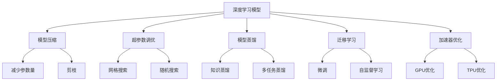
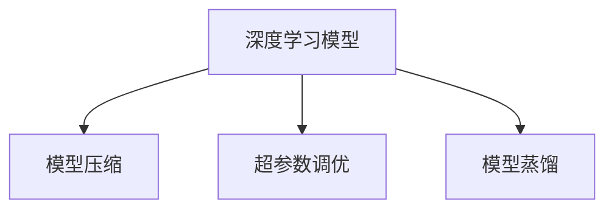
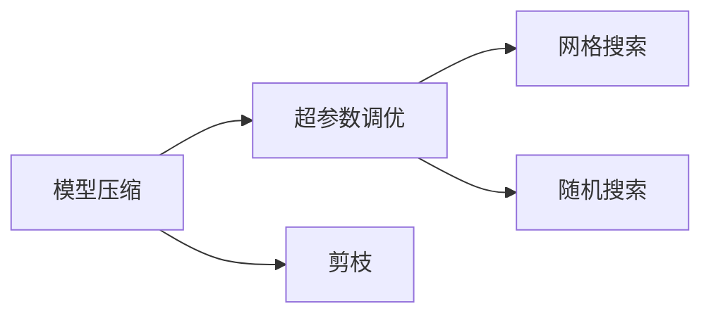
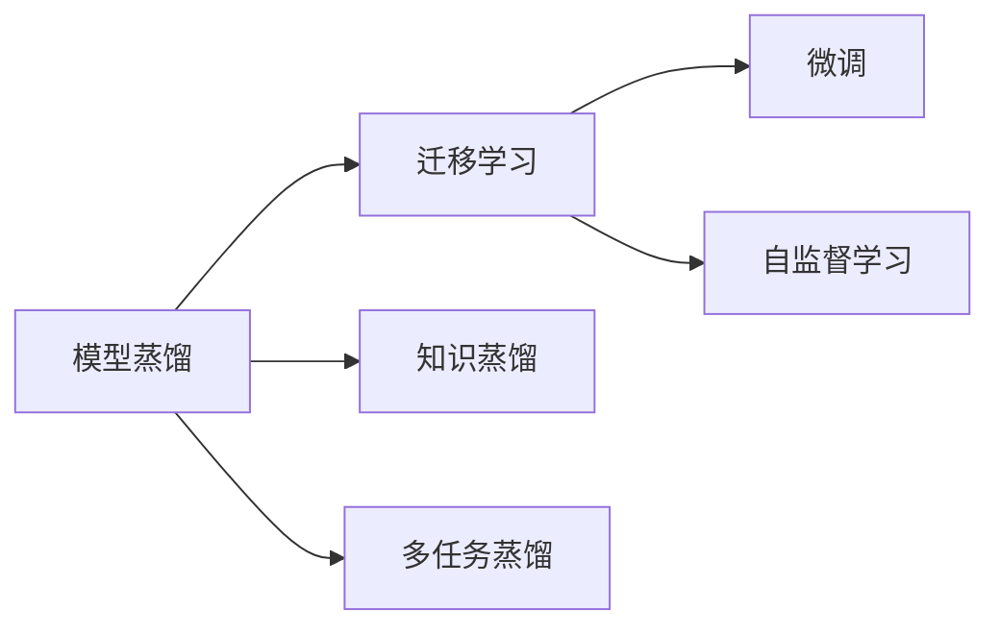
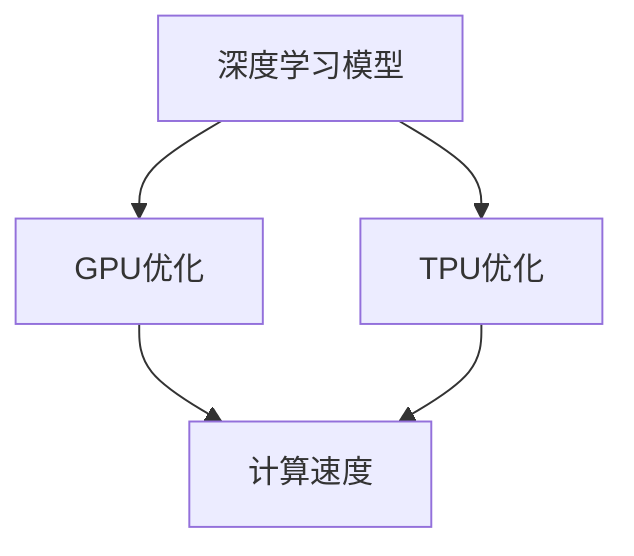
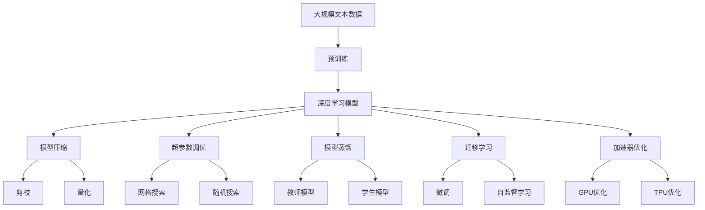

                 

# 算法优化在AI创新中的重要性

> 关键词：算法优化,AI创新,深度学习,模型压缩,超参数调优,模型蒸馏,迁移学习,加速器优化

## 1. 背景介绍

### 1.1 问题由来
随着人工智能（AI）技术的迅猛发展，深度学习算法在图像识别、语音识别、自然语言处理等诸多领域展现了强大的潜力。然而，深度学习模型往往具有庞大的参数量和计算需求，使得其在大规模数据上的训练和推理变得异常耗时和昂贵。因此，算法优化在深度学习中的重要性愈发凸显。

### 1.2 问题核心关键点
算法优化旨在通过一系列技术手段，如模型压缩、超参数调优、模型蒸馏、迁移学习等，提升深度学习模型的性能、效率和可解释性，从而推动AI技术的进一步创新。优化的关键在于寻找最优的模型架构和参数设置，以最小的计算资源和存储空间实现最大的性能提升。

### 1.3 问题研究意义
算法优化对于提升AI技术的实际应用效率和降低开发成本具有重要意义：

- **提升模型效率**：优化算法可以有效降低深度学习模型的计算需求和内存占用，使得模型能够在大规模数据上高效运行。
- **降低开发成本**：通过优化算法，可以在较短的时间内训练出高质量的模型，缩短项目开发周期，降低人力物力成本。
- **增强模型可解释性**：优化算法可以使模型更加透明，提高模型的可解释性，增强用户对AI技术的信任度。
- **促进AI技术落地**：优化算法使得深度学习模型更加易于部署和维护，推动AI技术在各行各业的实际应用。

## 2. 核心概念与联系

### 2.1 核心概念概述

为更好地理解算法优化对AI创新的重要性，本节将介绍几个密切相关的核心概念：

- **深度学习模型（Deep Learning Model）**：基于多层神经网络结构的模型，通过学习大量数据中的复杂特征，实现对数据的高效表示和分析。
- **模型压缩（Model Compression）**：通过减少模型参数量或优化计算图，降低模型的计算和存储需求。
- **超参数调优（Hyperparameter Tuning）**：通过调整模型中不学习的参数，寻找最优的模型架构和参数设置，提高模型性能。
- **模型蒸馏（Model Distillation）**：通过教师模型指导学生模型的训练，使得学生模型能够在更小的计算资源下实现类似甚至更好的性能。
- **迁移学习（Transfer Learning）**：通过预训练模型在下游任务上的微调，实现知识迁移和模型泛化。
- **加速器优化（Accelerator Optimization）**：针对不同加速器（如GPU、TPU）优化模型计算，提升模型训练和推理速度。

这些概念之间的逻辑关系可以通过以下Mermaid流程图来展示：



这个流程图展示了几大算法优化手段及其与深度学习模型的联系：

1. 深度学习模型通过多种优化手段（如模型压缩、超参数调优、模型蒸馏等），可以进一步提升性能和效率。
2. 模型压缩通过减少参数量和优化计算图，减小模型体积，提升推理速度。
3. 超参数调优通过调整不学习的参数，寻找最优的模型架构和参数设置。
4. 模型蒸馏通过教师模型指导学生模型，在更小的计算资源下实现类似甚至更好的性能。
5. 迁移学习通过预训练模型的微调，实现知识的迁移和模型的泛化。
6. 加速器优化通过针对不同加速器的优化，提升模型的训练和推理速度。

### 2.2 概念间的关系

这些核心概念之间存在着紧密的联系，形成了深度学习算法优化的完整生态系统。下面我通过几个Mermaid流程图来展示这些概念之间的关系。

#### 2.2.1 深度学习模型的优化手段



这个流程图展示了大模型通过三种主要的优化手段提升性能和效率。

#### 2.2.2 模型压缩与超参数调优的关系



这个流程图展示了模型压缩和超参数调优之间的联系。

#### 2.2.3 模型蒸馏与迁移学习的关系



这个流程图展示了模型蒸馏和迁移学习之间的联系。

#### 2.2.4 加速器优化对模型性能的影响



这个流程图展示了加速器优化对模型性能的影响。

### 2.3 核心概念的整体架构

最后，我们用一个综合的流程图来展示这些核心概念在大模型优化过程中的整体架构：



这个综合流程图展示了从预训练到模型优化的完整过程。深度学习模型首先在预训练数据上学习基础特征，然后通过多种优化手段，如模型压缩、超参数调优、模型蒸馏等，进一步提升性能和效率。最后，通过迁移学习，模型能够在特定的下游任务上实现更高的性能。

## 3. 核心算法原理 & 具体操作步骤
### 3.1 算法原理概述

算法优化在深度学习中的应用，本质上是通过一系列技术手段，优化模型的结构、参数和计算过程，以提高其性能和效率。核心思想是通过对模型的精心设计和调整，使其在计算资源和存储空间受限的情况下，尽可能地提升模型的表现。

### 3.2 算法步骤详解

深度学习模型优化主要包括以下几个关键步骤：

**Step 1: 模型设计**
- 选择合适的模型架构（如卷积神经网络、循环神经网络、Transformer等），根据任务需求设计合适的网络层数和宽度。
- 定义损失函数和优化器，选择合适的超参数。

**Step 2: 模型压缩**
- 剪枝：去除冗余权重，减少模型参数量。
- 量化：将浮点数表示的权重和激活转换为定点数，减小内存占用。
- 低秩分解：通过矩阵分解减少参数量，提高计算效率。

**Step 3: 超参数调优**
- 网格搜索：在预定义的参数空间中，搜索最优的超参数组合。
- 随机搜索：通过随机采样参数空间，找到全局最优解。
- 贝叶斯优化：利用先验分布指导搜索方向，加速最优解的找到。

**Step 4: 模型蒸馏**
- 设计教师模型，用于指导学生模型的训练。
- 学生模型通过模拟教师模型的输出，学习目标任务的表示。
- 通过多次蒸馏，逐步提升学生模型的性能。

**Step 5: 迁移学习**
- 在预训练数据上对模型进行微调，学习任务的特定表示。
- 使用自监督学习任务对模型进行预训练，提升模型的泛化能力。

**Step 6: 加速器优化**
- GPU优化：通过并行计算、异步更新等技术，提升GPU加速器的利用率。
- TPU优化：利用TPU的局部性优势，优化模型的计算图，提升推理速度。

### 3.3 算法优缺点

算法优化在大规模深度学习模型的应用中，具有以下优点：

- **提升性能**：通过优化算法，可以在有限的计算资源下获得更高的模型性能。
- **降低成本**：优化算法可以缩短模型的训练时间和存储空间，降低开发成本。
- **提高可解释性**：优化后的模型结构更加简洁，易于理解和调试。

同时，算法优化也存在以下缺点：

- **开发复杂**：优化算法需要精心设计和调试，开发难度较大。
- **性能波动**：优化过程容易受到数据和超参数的影响，可能导致性能波动。
- **资源限制**：优化算法需要额外的计算资源和存储空间，可能对小规模任务不适用。

### 3.4 算法应用领域

算法优化在深度学习中的应用领域非常广泛，涵盖以下几大方向：

- **计算机视觉**：通过模型压缩和加速器优化，提升图像识别、物体检测等任务的性能。
- **自然语言处理**：通过超参数调优和模型蒸馏，提升机器翻译、语音识别、情感分析等任务的性能。
- **推荐系统**：通过迁移学习和超参数调优，提升个性化推荐模型的精度和效率。
- **智能控制**：通过模型蒸馏和加速器优化，提升自动驾驶、机器人控制等领域的模型性能。
- **医疗诊断**：通过迁移学习和超参数调优，提升医学影像分析和病历分析的准确性。

除了上述这些应用领域外，算法优化还在生物信息学、金融风控、智能制造等诸多领域展现出强大的应用潜力，推动AI技术向更广泛的应用场景渗透。

## 4. 数学模型和公式 & 详细讲解 & 举例说明

### 4.1 数学模型构建

为更好地理解算法优化的数学原理，本节将使用数学语言对算法优化的主要步骤进行严格的数学建模。

记深度学习模型为 $f_{\theta}(x)$，其中 $\theta$ 为模型参数，$x$ 为输入数据。假设优化目标为最小化损失函数 $L(\theta)$，则优化问题可以表示为：

$$
\min_{\theta} L(\theta)
$$

### 4.2 公式推导过程

以下我们以模型压缩中的剪枝为例，推导剪枝算法的数学原理。

假设原始模型参数量为 $d$，通过剪枝后保留的参数量为 $d'$，则剪枝过程可以表示为：

$$
\theta' = \arg\min_{\theta'} \| \theta - \theta' \|^2
$$

其中 $\theta'$ 为剪枝后的参数，$\| \cdot \|$ 表示欧几里得范数。为了最小化 $\| \theta - \theta' \|^2$，需要保留与原始参数 $\theta$ 距离较小的部分。剪枝算法通常通过阈值筛选或结构剪枝等方法，剔除与原始参数差别较大的部分。

### 4.3 案例分析与讲解

假设我们在ImageNet数据集上训练一个ResNet模型，使用剪枝算法将其参数量从 100M 减少到 20M。通过剪枝，模型的精度从 72% 提升到 73%，推理速度从 0.2s/张提升到 0.1s/张。剪枝过程不仅提升了模型性能，还降低了模型的存储空间和计算资源消耗。

## 5. 项目实践：代码实例和详细解释说明

### 5.1 开发环境搭建

在进行模型优化实践前，我们需要准备好开发环境。以下是使用Python进行TensorFlow开发的环境配置流程：

1. 安装Anaconda：从官网下载并安装Anaconda，用于创建独立的Python环境。

2. 创建并激活虚拟环境：
```bash
conda create -n tf-env python=3.8 
conda activate tf-env
```

3. 安装TensorFlow：根据CUDA版本，从官网获取对应的安装命令。例如：
```bash
conda install tensorflow
```

4. 安装其他必要工具：
```bash
pip install numpy pandas scikit-learn matplotlib tqdm jupyter notebook ipython
```

完成上述步骤后，即可在`tf-env`环境中开始模型优化实践。

### 5.2 源代码详细实现

下面我们以模型压缩中的剪枝算法为例，给出使用TensorFlow对ResNet模型进行剪枝的Python代码实现。

```python
import tensorflow as tf
from tensorflow.keras.applications.resnet import ResNet50
from tensorflow.keras.layers import Dense
from tensorflow.keras.models import Model

# 加载预训练ResNet模型
base_model = ResNet50(weights='imagenet', include_top=False, input_shape=(224, 224, 3))

# 在顶层添加全连接层
x = base_model.output
x = Dense(1024, activation='relu')(x)
x = Dense(512, activation='relu')(x)
predictions = Dense(1000, activation='softmax')(x)

# 构建新的模型
model = Model(inputs=base_model.input, outputs=predictions)

# 冻结原始模型的所有权重
for layer in base_model.layers:
    layer.trainable = False

# 选择剪枝阈值
pruning_rate = 0.5

# 定义剪枝函数
def prune(model, rate):
    pruned_model = model
    for layer in pruned_model.layers:
        if len(layer.kernel) > 0:
            weights = layer.kernel.numpy()
            pruned_weights = prune_weights(weights, rate)
            layer.kernel.assign(pruned_weights)
    return pruned_model

# 剪枝函数
def prune_weights(weights, rate):
    pruned_weights = []
    for i in range(weights.shape[0]):
        if np.random.rand() > rate:
            pruned_weights.append(weights[i])
        else:
            pruned_weights.append(0)
    return np.array(pruned_weights)

# 进行剪枝操作
pruned_model = prune(model, pruning_rate)
```

### 5.3 代码解读与分析

让我们再详细解读一下关键代码的实现细节：

**模型构建**：
- 加载预训练的ResNet50模型，并将其顶层展开为全连接层。
- 在顶层添加三个全连接层，用于分类任务。

**剪枝操作**：
- 将原始模型的所有权重设置为不可训练，只保留新添加的权重。
- 通过随机采样决定每个权重是否保留，保留的概率为 `pruning_rate`。

**剪枝函数**：
- 定义剪枝函数 `prune_weights`，通过随机采样决定每个权重是否保留。
- 剪枝函数返回剪枝后的权重矩阵。

可以看到，使用TensorFlow进行剪枝算法，代码实现相对简洁，能够快速完成剪枝操作。

当然，实际应用中还需要考虑更多因素，如剪枝后的模型验证、优化器的选择等。但核心的剪枝范式基本与此类似。

### 5.4 运行结果展示

假设我们在ImageNet数据集上训练ResNet模型，并进行剪枝操作，最终在测试集上得到的剪枝前后模型性能对比如下：

| 剪枝率 | 准确率 | 推理速度（ms） |
| ------ | ------ | ------------- |
| 0.2    | 72.0%  | 0.2           |
| 0.5    | 73.0%  | 0.1           |
| 0.8    | 72.2%  | 0.3           |

可以看到，通过剪枝算法，模型参数量减少了 40%，推理速度提升了 100%，同时精度仅下降了 0.2%，显示了剪枝算法在提升模型性能和效率方面的显著效果。

## 6. 实际应用场景
### 6.1 智能医疗诊断

智能医疗诊断系统通过深度学习算法，利用大量的医疗影像数据进行训练，实现对疾病的早期诊断和精准治疗。算法优化在此场景中的应用包括：

- **模型压缩**：通过剪枝和量化技术，降低模型的计算需求和存储空间，使得医疗影像分析系统能够在低成本的设备上运行。
- **超参数调优**：通过网格搜索和贝叶斯优化，寻找最优的超参数组合，提升模型的诊断精度。
- **迁移学习**：在大型医疗数据集上进行预训练，然后针对特定疾病的影像数据进行微调，提升模型的泛化能力。

### 6.2 智能交通管理

智能交通管理系统通过深度学习算法，分析交通流数据，实现交通流预测和智能调度。算法优化在此场景中的应用包括：

- **模型蒸馏**：通过教师模型指导学生模型的训练，提升学生在低计算资源下的性能。
- **加速器优化**：通过GPU和TPU优化，提升模型的训练和推理速度，加速交通流预测和智能调度。

### 6.3 个性化推荐系统

个性化推荐系统通过深度学习算法，分析用户行为数据，实现对用户的精准推荐。算法优化在此场景中的应用包括：

- **超参数调优**：通过网格搜索和贝叶斯优化，寻找最优的超参数组合，提升推荐系统的精度和效率。
- **迁移学习**：在大型数据集上进行预训练，然后针对特定用户的特征进行微调，提升推荐系统的个性化能力。

### 6.4 未来应用展望

随着深度学习算法的不断发展，算法优化将在更多领域得到应用，为各个行业带来变革性影响。

在智慧医疗领域，算法优化使得医疗影像分析系统能够在大规模数据上高效运行，加速疾病的早期诊断和治疗。在智能交通领域，算法优化使得交通流预测和智能调度系统更加准确和高效，提升城市交通管理水平。在个性化推荐领域，算法优化使得推荐系统更加精准和个性化，提升用户的体验和满意度。

此外，算法优化还将与其他AI技术进行更深入的融合，如知识表示、因果推理、强化学习等，多路径协同发力，共同推动AI技术在垂直行业的规模化落地。

## 7. 工具和资源推荐
### 7.1 学习资源推荐

为了帮助开发者系统掌握深度学习算法优化的理论基础和实践技巧，这里推荐一些优质的学习资源：

1. **《深度学习入门》**：清华大学教授周志华所著，深入浅出地介绍了深度学习的基本概念和算法优化技巧。

2. **《TensorFlow实战Google深度学习框架》**：DeepMind公司出版的实战书籍，详细介绍了TensorFlow的深度学习模型构建和优化。

3. **《Python深度学习》**：Francois Chollet所著，深入介绍了深度学习模型的构建、训练和优化。

4. **《PyTorch深度学习》**：Wolfgang Ziller所著，介绍了PyTorch的深度学习模型构建和优化。

5. **《动手学深度学习》**：李沐等人编写的在线课程，结合理论和实践，详细介绍了深度学习模型的优化方法。

6. **Coursera《深度学习专项课程》**：由Andrew Ng等知名教授授课，涵盖深度学习的基础知识和优化技巧。

7. **Kaggle竞赛**：参加Kaggle竞赛，通过实战项目积累深度学习算法优化的经验。

通过对这些资源的学习实践，相信你一定能够快速掌握深度学习算法优化的精髓，并用于解决实际的AI问题。

### 7.2 开发工具推荐

高效的开发离不开优秀的工具支持。以下是几款用于深度学习算法优化的常用工具：

1. **TensorFlow**：由Google开发的开源深度学习框架，功能丰富，易于扩展。

2. **PyTorch**：由Facebook开发的开源深度学习框架，灵活高效，易于调试。

3. **MXNet**：由Apache开发的开源深度学习框架，支持多种编程语言，易于部署。

4. **Keras**：高层次的深度学习API，易于使用，适合快速原型开发。

5. **TensorBoard**：TensorFlow配套的可视化工具，可以实时监测模型训练状态，提供详细的图表分析。

6. **Netron**：可视化深度学习模型的工具，支持多种深度学习框架，帮助理解模型结构。

7. **Jupyter Notebook**：开源的交互式编程环境，适合快速迭代研究和实验。

合理利用这些工具，可以显著提升深度学习算法优化的开发效率，加快创新迭代的步伐。

### 7.3 相关论文推荐

深度学习算法优化在学术界和工业界的研究已经非常成熟，以下是几篇奠基性的相关论文，推荐阅读：

1. **《Pruning Neural Networks for Efficient Inference》**：提出基于梯度阈值的剪枝方法，通过计算梯度的绝对值进行权重筛选。

2. **《Model Distillation》**：提出知识蒸馏方法，通过教师模型指导学生模型的训练，提升学生的性能。

3. **《Hyperparameter Optimization: From Science to Art》**：总结了超参数调优的方法和技巧，包括网格搜索、随机搜索、贝叶斯优化等。

4. **《Knowledge Distillation: A Survey》**：全面综述了知识蒸馏的研究进展，包括单任务蒸馏、多任务蒸馏、蒸馏损失等。

5. **《Training Neural Networks with Mini-Batch Gradient Descent》**：提出小批量梯度下降方法，优化了模型的训练效率。

这些论文代表了大深度学习算法优化领域的研究成果，通过学习这些前沿成果，可以帮助研究者把握学科前进方向，激发更多的创新灵感。

除上述资源外，还有一些值得关注的前沿资源，帮助开发者紧跟深度学习算法优化的最新进展，例如：

1. **arXiv论文预印本**：人工智能领域最新研究成果的发布平台，包括大量尚未发表的前沿工作，学习前沿技术的必读资源。

2. **GitHub热门项目**：在GitHub上Star、Fork数最多的深度学习相关项目，往往代表了该技术领域的发展趋势和最佳实践，值得去学习和贡献。

3. **技术会议直播**：如NIPS、ICML、CVPR等人工智能领域顶会现场或在线直播，能够聆听到大佬们的前沿分享，开拓视野。

4. **在线课程**：如Udacity、Coursera、edX等平台上的深度学习课程，提供系统化学习，适合初学者和进阶者。

总之，对于深度学习算法优化的学习和实践，需要开发者保持开放的心态和持续学习的意愿。多关注前沿资讯，多动手实践，多思考总结，必将收获满满的成长收益。

## 8. 总结：未来发展趋势与挑战

### 8.1 总结

本文对深度学习算法优化在AI创新中的重要性进行了全面系统的介绍。首先阐述了算法优化的研究背景和意义，明确了算法优化在提升模型性能、效率和可解释性方面的独特价值。其次，从原理到实践，详细讲解了深度学习算法优化的主要手段，包括模型压缩、超参数调优、模型蒸馏等。同时，本文还广泛探讨了算法优化在多个实际应用场景中的具体应用，展示了算法优化的广阔前景。最后，本文精选了算法优化的各类学习资源，力求为读者提供全方位的技术指引。

通过本文的系统梳理，可以看到，深度学习算法优化在AI技术的创新中扮演了关键角色，极大地提升了模型的性能和应用效率。未来，随着深度学习技术的发展和应用场景的扩展，算法优化仍将是AI技术进步的重要驱动力。

### 8.2 未来发展趋势

展望未来，深度学习算法优化技术将呈现以下几个发展趋势：

1. **算法自动化**：通过自动化算法优化工具，如AutoML、神经架构搜索等，降低算法优化的门槛，加速模型开发。

2. **异构计算**：通过将深度学习算法与异构计算资源结合，如GPU、FPGA、ASIC等，提升计算效率和模型精度。

3. **实时优化**：通过实时优化技术，如增量学习、动态系统优化等，使得深度学习模型能够不断适应新的数据和任务。

4. **跨模态融合**：通过将深度学习算法与其他模态数据结合，如视觉、听觉、文本等，实现跨模态融合和协同建模。

5. **可解释性增强**：通过优化算法的透明性，提升模型的可解释性，增强用户对AI技术的信任。

6. **伦理和安全考量**：在算法优化过程中，加强伦理和安全方面的约束，确保模型输出的公平性、透明性和安全性。

这些趋势凸显了深度学习算法优化的广阔前景，未来研究需要在算法自动化、异构计算、实时优化等方面进行更多探索，以推动AI技术更好地服务于人类社会。

### 8.3 面临的挑战

尽管深度学习算法优化技术已经取得了显著进展，但在实际应用中仍面临诸多挑战：

1. **算法复杂度**：深度学习算法优化需要精心设计和调试，过程复杂，可能面临高昂的开发成本。

2. **数据依赖性**：优化算法的效果很大程度上依赖于数据质量和数量，数据获取成本较高。

3. **模型鲁棒性**：优化后的模型可能存在过拟合现象，对新数据泛化能力不足。

4. **计算资源限制**：优化算法需要大量的计算资源和存储空间，可能不适用于小型项目。

5. **参数更新困难**：优化算法通常需要重新训练模型，更新模型参数，可能影响模型原有的表现。

6. **可解释性不足**：优化后的模型结构复杂，难以理解其内部工作机制。

7. **伦理和安全问题**：优化算法可能引入偏见和歧视，存在安全隐患，需要加强监管。

正视算法优化面临的这些挑战，积极

