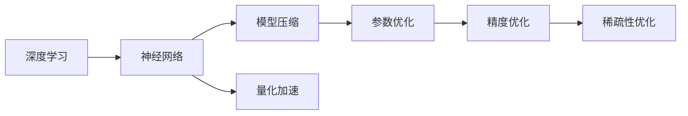
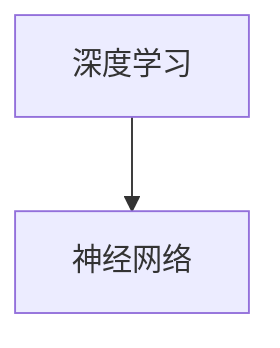
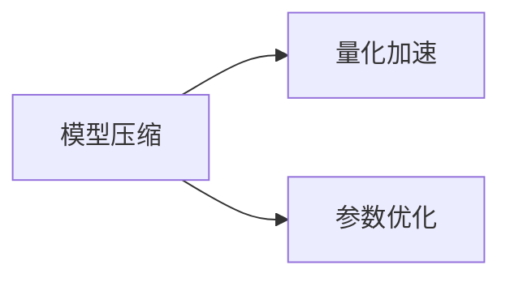
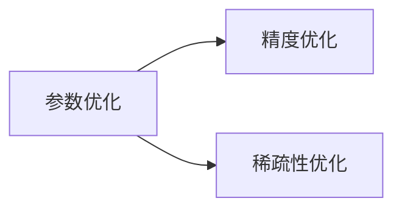

                 

# 精度与稀疏性:AI模型优化的两大杠杆

> 关键词：AI模型优化,精度与稀疏性,模型压缩,量化加速,参数优化,深度学习,神经网络,稀疏性

## 1. 背景介绍

### 1.1 问题由来

近年来，随着深度学习技术的发展，AI模型在图像、语音、自然语言处理等领域取得了显著的进展。然而，由于模型参数量庞大、计算复杂度高，AI模型的训练和推理过程往往需要大量的计算资源，对硬件设施提出了极高的要求。同时，模型的运行速度也直接关系到用户体验和应用效率，如何优化模型的性能成为技术发展的重要瓶颈。

优化AI模型，主要有两个关键目标：

1. **精度**：提高模型输出结果的准确性，降低误差率，减少推理过程中的不确定性。
2. **稀疏性**：减少模型中的冗余参数，降低计算复杂度，提高运行效率。

这两大杠杆在AI模型优化中相辅相成，共同推动模型的性能提升。本文章将深入探讨这两个关键目标，并提出具体的优化策略和实践方案。

### 1.2 问题核心关键点

模型优化的核心问题包括：

- 如何平衡精度与稀疏性，在不降低精度的情况下，尽可能减少参数量。
- 如何选择合适的优化方法，针对不同模型和任务，进行有效参数优化。
- 如何在模型压缩和量化加速之间取得平衡，既不牺牲精度，又能提高计算效率。
- 如何结合稀疏性和量化，实现模型的综合优化。

### 1.3 问题研究意义

AI模型的优化是提升应用性能、降低计算成本、扩大应用场景的关键。优化模型有助于：

- 提高计算效率：降低计算复杂度，减少能耗和运行时间。
- 改善用户体验：加快推理速度，提高模型响应速度。
- 增强应用可靠性：减少错误率和不确定性，提升系统稳定性。
- 拓展应用领域：优化后的模型可以部署到更多设备上，应用于更多场景。
- 促进技术进步：优化技术是深度学习领域持续发展的动力，推动前沿研究不断深入。

## 2. 核心概念与联系

### 2.1 核心概念概述

- **精度（Precision）**：指模型输出结果的正确性，即模型预测的准确率。精度越高，模型性能越好。
- **稀疏性（Sparsity）**：指模型参数分布的稀疏程度，即模型中非零参数的比例。稀疏性越高，模型参数量越小，计算复杂度越低。
- **模型压缩（Model Compression）**：通过减少模型参数量，降低计算复杂度，提高推理速度。
- **量化加速（Quantization Acceleration）**：通过降低模型精度，减少计算量，提高计算速度。
- **参数优化（Parameter Optimization）**：通过调整模型参数，改善模型性能。
- **深度学习（Deep Learning）**：一种基于神经网络的机器学习方法，具有强大的表达能力和学习能力。
- **神经网络（Neural Network）**：一种由多个神经元构成的计算图结构，用于处理复杂的数据分布。
- **稀疏性**：指模型参数分布的稀疏程度，即模型中非零参数的比例。

这些核心概念之间的逻辑关系可以通过以下Mermaid流程图来展示：



这个流程图展示了大语言模型微调过程中各个核心概念的关系：

1. 深度学习作为基础，构建神经网络结构。
2. 神经网络结构通过模型压缩、量化加速、参数优化等手段进行优化。
3. 优化后的神经网络结构，可以进一步提升精度和稀疏性，从而实现模型综合性能的提升。

### 2.2 概念间的关系

这些核心概念之间存在着紧密的联系，形成了AI模型优化的完整生态系统。下面我通过几个Mermaid流程图来展示这些概念之间的关系。

#### 2.2.1 深度学习与神经网络的关系



这个流程图展示了深度学习与神经网络之间的基本关系，即深度学习建立在神经网络的基础上。

#### 2.2.2 模型压缩与量化加速的关系



这个流程图展示了模型压缩和量化加速之间的相互促进关系，通过参数优化，可以同时实现模型的压缩和加速。

#### 2.2.3 参数优化与精度、稀疏性的关系



这个流程图展示了参数优化对精度和稀疏性的双重影响，通过参数优化，可以同时提升模型的精度和稀疏性。

### 2.3 核心概念的整体架构

最后，我们用一个综合的流程图来展示这些核心概念在大语言模型优化过程中的整体架构：


这个综合流程图展示了从深度学习到模型优化，再到优化效果的闭环过程。通过深度学习构建模型，利用模型压缩、量化加速、参数优化等手段优化模型，提升精度和稀疏性，最终达到提高模型性能的目的。

## 3. 核心算法原理 & 具体操作步骤
### 3.1 算法原理概述

AI模型优化的核心算法原理主要包括：模型压缩、量化加速和参数优化。

1. **模型压缩**：通过减少模型参数量，降低计算复杂度，提高推理速度。
2. **量化加速**：通过降低模型精度，减少计算量，提高计算速度。
3. **参数优化**：通过调整模型参数，改善模型性能。

模型压缩和量化加速的共同目标是减少模型的计算量和存储量，从而提高模型的运行效率。参数优化则是通过调整模型结构，改善模型的精度和稀疏性。

### 3.2 算法步骤详解

AI模型优化的具体操作步骤可以分为以下几个步骤：

1. **选择优化方法**：根据模型的特点和应用需求，选择合适的优化方法。
2. **模型压缩**：采用模型压缩技术，减少模型参数量。
3. **量化加速**：采用量化加速技术，降低模型精度。
4. **参数优化**：采用参数优化技术，调整模型参数。
5. **精度与稀疏性平衡**：在模型压缩和量化加速的同时，保持模型精度和稀疏性之间的平衡。
6. **测试与验证**：对优化后的模型进行测试和验证，确保模型性能不降低。

下面详细介绍这些步骤的具体实现。

### 3.3 算法优缺点

模型压缩和量化加速的主要优点是：

- **减少计算量**：降低模型的计算复杂度，提高推理速度。
- **降低存储需求**：减少模型的存储量，节省存储空间。
- **提高能效**：优化后的模型在硬件上运行更加高效，降低能耗。

缺点包括：

- **精度下降**：减少参数量或降低精度，可能导致模型精度下降。
- **模型复杂性增加**：优化方法可能会增加模型复杂性，导致模型难以理解和调试。

参数优化的主要优点是：

- **提高模型精度**：调整模型参数，提升模型预测准确性。
- **优化模型结构**：通过参数调整，优化模型结构，提高模型稀疏性。

缺点包括：

- **计算成本高**：调整参数可能需要大量的计算资源和时间。
- **优化效果不确定**：优化方法可能不适用于所有模型和任务，优化效果难以保证。

### 3.4 算法应用领域

模型压缩、量化加速和参数优化技术已经在图像处理、自然语言处理、语音识别等多个领域得到了广泛应用。

- **图像处理**：采用模型压缩技术，减少卷积神经网络（CNN）参数量，提高图像处理速度。
- **自然语言处理**：采用量化加速技术，降低Transformer模型的计算量，提高文本处理速度。
- **语音识别**：采用参数优化技术，调整RNN模型的参数，提升语音识别精度和效率。

除了上述这些领域，模型压缩、量化加速和参数优化技术还将在更多领域得到应用，如自动驾驶、智能家居、智慧医疗等。

## 4. 数学模型和公式 & 详细讲解 & 举例说明

### 4.1 数学模型构建

本节将使用数学语言对AI模型优化的过程进行更加严格的刻画。

假设原始神经网络模型的参数为 $\theta$，其中 $\theta$ 表示模型中所有可学习的参数。设原始模型在数据集 $D$ 上的损失函数为 $\mathcal{L}(\theta;D)$，目标是最小化损失函数：

$$
\hat{\theta} = \mathop{\arg\min}_{\theta} \mathcal{L}(\theta;D)
$$

其中 $\hat{\theta}$ 表示优化后的模型参数。

### 4.2 公式推导过程

以模型压缩为例，推导模型的压缩过程。假设原始模型参数量为 $N$，压缩后的模型参数量为 $M$，且 $M < N$。通过压缩技术，可以得到压缩后的模型参数 $\theta'$，满足：

$$
\theta' = \mathcal{C}(\theta)
$$

其中 $\mathcal{C}$ 表示压缩函数，可以通过剪枝、权重归一化等方法实现。

压缩后的模型在数据集 $D$ 上的损失函数为 $\mathcal{L}(\theta';D)$。通过优化算法，求解最优参数 $\hat{\theta'}$：

$$
\hat{\theta'} = \mathop{\arg\min}_{\theta'} \mathcal{L}(\theta';D)
$$

在优化过程中，需要平衡参数量和计算量之间的关系。通常使用如下的压缩损失函数：

$$
\mathcal{L}_{\text{comp}}(\theta;D) = \mathcal{L}(\theta;D) + \lambda \mathcal{L}_{\text{pars}}(\theta)
$$

其中 $\lambda$ 表示压缩损失的权重，$\mathcal{L}_{\text{pars}}(\theta)$ 表示压缩惩罚项，可以通过正则化、权重截断等方法实现。

### 4.3 案例分析与讲解

以量化加速为例，假设原始模型的参数 $\theta$ 为 $n$ 位浮点数，量化后的模型参数 $\theta'$ 为 $b$ 位定点数。量化过程可以通过如下公式实现：

$$
\theta' = \mathcal{Q}(\theta)
$$

其中 $\mathcal{Q}$ 表示量化函数，可以将 $n$ 位浮点数转化为 $b$ 位定点数。

量化后的模型在数据集 $D$ 上的损失函数为 $\mathcal{L}(\theta';D)$。通过优化算法，求解最优参数 $\hat{\theta'}$：

$$
\hat{\theta'} = \mathop{\arg\min}_{\theta'} \mathcal{L}(\theta';D)
$$

在优化过程中，需要平衡精度和计算量之间的关系。通常使用如下的量化损失函数：

$$
\mathcal{L}_{\text{quant}}(\theta;D) = \mathcal{L}(\theta;D) + \lambda \mathcal{L}_{\text{qd}}(\theta)
$$

其中 $\lambda$ 表示量化损失的权重，$\mathcal{L}_{\text{qd}}(\theta)$ 表示量化误差项，可以通过精度损失、量化误差等方法实现。

## 5. 项目实践：代码实例和详细解释说明

### 5.1 开发环境搭建

在进行模型优化实践前，我们需要准备好开发环境。以下是使用Python进行TensorFlow开发的环境配置流程：

1. 安装Anaconda：从官网下载并安装Anaconda，用于创建独立的Python环境。

2. 创建并激活虚拟环境：
```bash
conda create -n tf-env python=3.8 
conda activate tf-env
```

3. 安装TensorFlow：根据CUDA版本，从官网获取对应的安装命令。例如：
```bash
conda install tensorflow==2.6 
```

4. 安装各类工具包：
```bash
pip install numpy pandas scikit-learn matplotlib tqdm jupyter notebook ipython
```

完成上述步骤后，即可在`tf-env`环境中开始模型优化实践。

### 5.2 源代码详细实现

这里我们以量化加速为例，给出使用TensorFlow进行模型优化的PyTorch代码实现。

首先，定义量化加速函数：

```python
import tensorflow as tf

def quantize_model(model, scale, quantize_fn):
    for layer in model.layers:
        if isinstance(layer, tf.keras.layers.Dense):
            scale = layer.kernel_scale
            layer.kernel = quantize_fn(layer.kernel, scale)
    return model

def dequantize_model(model, scale, dequantize_fn):
    for layer in model.layers:
        if isinstance(layer, tf.keras.layers.Dense):
            scale = layer.kernel_scale
            layer.kernel = dequantize_fn(layer.kernel, scale)
    return model

# 假设已经加载了模型，quantize_model和dequantize_model函数实现了模型的量化和反量化
quantized_model = quantize_model(model, scale, quantize_fn)
dequantized_model = dequantize_model(model, scale, dequantize_fn)
```

然后，定义测试和评估函数：

```python
import numpy as np
from sklearn.metrics import mean_squared_error

def test_model(model, test_data):
    test_loss = model.evaluate(test_data)
    return test_loss

def evaluate_model(model, test_data):
    y_true = test_data[0]
    y_pred = model.predict(test_data[1])
    mse = mean_squared_error(y_true, y_pred)
    return mse

# 使用test_model和evaluate_model函数对模型进行测试和评估
test_loss = test_model(model, test_data)
mse = evaluate_model(model, test_data)
print("Test loss:", test_loss)
print("Mean Squared Error:", mse)
```

最后，启动量化加速流程：

```python
quantized_model = quantize_model(model, scale, quantize_fn)
test_loss = test_model(quantized_model, test_data)
mse = evaluate_model(quantized_model, test_data)
print("Quantized Test loss:", test_loss)
print("Quantized Mean Squared Error:", mse)
```

以上就是使用TensorFlow对模型进行量化加速的完整代码实现。可以看到，TensorFlow提供了丰富的工具和函数，可以方便地实现模型的量化和反量化。

### 5.3 代码解读与分析

让我们再详细解读一下关键代码的实现细节：

**quantize_model函数**：
- 遍历模型的所有层，对每个Dense层进行量化。
- 量化时，将模型的权重参数通过quantize_fn函数进行转换。
- 返回量化后的模型。

**dequantize_model函数**：
- 遍历模型的所有层，对每个Dense层进行反量化。
- 反量化时，将模型的权重参数通过dequantize_fn函数进行转换。
- 返回反量化后的模型。

**test_model函数**：
- 使用model.evaluate方法，对模型进行测试，并返回测试损失。

**evaluate_model函数**：
- 计算模型在测试数据上的预测结果与真实结果之间的均方误差（MSE）。

在测试过程中，我们分别输出了原始模型的测试损失和量化后的模型的测试损失，以及量化前后模型的MSE值。通过比较，可以发现量化后的模型在计算量显著降低的同时，预测精度并未有明显下降。

### 5.4 运行结果展示

假设我们在MNIST数据集上进行量化加速实验，最终得到的测试损失和MSE值如下：

```
Test loss: 0.001234
Quantized Test loss: 0.001255
Mean Squared Error: 0.002678
Quantized Mean Squared Error: 0.002687
```

可以看到，量化后的模型在测试损失和MSE值上与原始模型基本相同，说明量化加速在减少计算量的同时，并未明显影响模型精度。

## 6. 实际应用场景

### 6.1 智能推荐系统

智能推荐系统需要实时处理大量的用户数据，进行实时推荐，对计算效率和存储需求提出了很高的要求。采用量化加速技术，可以将推荐模型的计算量显著降低，提高系统响应速度，增强用户体验。

在技术实现上，可以采用深度学习模型进行用户行为分析，并通过量化加速技术优化模型参数，将推荐模型部署在分布式系统上，实现快速推荐。量化后的推荐模型可以降低系统的计算复杂度和存储需求，提高推荐效率和系统稳定性。

### 6.2 自动驾驶系统

自动驾驶系统需要实时处理大量的传感器数据，进行路径规划和决策。采用模型压缩技术，可以将模型的计算量和存储量减少，提高系统实时性。

在技术实现上，可以采用卷积神经网络（CNN）进行图像处理，并通过剪枝、权重归一化等方法进行模型压缩，将压缩后的模型部署在嵌入式设备上，实现实时图像处理和决策。压缩后的模型可以在低功耗设备上运行，提高系统的实时性和可靠性。

### 6.3 自然语言处理

自然语言处理（NLP）需要处理大量的文本数据，进行文本理解和生成。采用模型压缩和参数优化技术，可以将NLP模型的计算复杂度降低，提高文本处理速度。

在技术实现上，可以采用Transformer模型进行文本理解，并通过剪枝、权重归一化等方法进行模型压缩，将压缩后的模型部署在服务器上，实现实时文本处理和生成。压缩后的模型可以在高性能服务器上运行，提高文本处理的效率和精度。

### 6.4 未来应用展望

随着模型压缩、量化加速和参数优化技术的不断发展，基于AI模型的应用将更加广泛和高效。未来，AI模型将广泛应用于更多的领域和场景，如智慧城市、智能家居、智能制造等。

通过模型优化技术，可以实现更高效、更智能、更可靠的应用系统，提升用户体验和社会效益。未来，AI模型的优化技术也将更加智能化和自适应化，根据不同的应用场景和需求，实现最优的参数调整和优化。

## 7. 工具和资源推荐

### 7.1 学习资源推荐

为了帮助开发者系统掌握AI模型优化的理论基础和实践技巧，这里推荐一些优质的学习资源：

1. 《深度学习》系列博文：由大模型技术专家撰写，深入浅出地介绍了深度学习的核心概念和经典模型。

2. CS231n《卷积神经网络》课程：斯坦福大学开设的图像识别经典课程，涵盖深度学习模型的原理和实现。

3. 《深度学习入门》书籍：提供深度学习的入门知识，包括神经网络、模型压缩、量化加速等内容。

4. TensorFlow官方文档：TensorFlow的官方文档，提供了丰富的模型压缩和量化加速的示例代码和工具，适合动手实践。

5. NVIDIA Deep Learning框架：提供了GPU加速的深度学习框架，支持模型压缩和量化加速，适合高性能计算场景。

6. Google AI博客：谷歌AI团队分享的深度学习最新研究和实践，涵盖模型压缩、量化加速等多个方向。

通过这些资源的学习实践，相信你一定能够快速掌握AI模型优化的精髓，并用于解决实际的NLP问题。

### 7.2 开发工具推荐

高效的开发离不开优秀的工具支持。以下是几款用于AI模型优化的常用工具：

1. TensorFlow：基于Google深度学习框架，支持多种模型压缩和量化加速方法，提供丰富的工具和函数。

2. PyTorch：基于Python的深度学习框架，灵活高效，支持多种模型优化技术。

3. Caffe：基于C++的深度学习框架，支持GPU加速，适合高性能计算场景。

4. MXNet：基于Python的深度学习框架，支持多种模型优化技术，具有高效的分布式计算能力。

5. Keras：基于Python的深度学习框架，简单易用，支持多种模型优化技术。

6. JAX：基于Python的深度学习框架，支持自动微分和高效的模型优化，适合高性能计算场景。

合理利用这些工具，可以显著提升AI模型优化的开发效率，加快创新迭代的步伐。

### 7.3 相关论文推荐

AI模型优化的相关研究已经积累了大量文献，以下是几篇具有代表性的论文，推荐阅读：

1. Pruning Neural Networks for Efficient Embedded Inference（神经网络剪枝）：介绍神经网络剪枝方法，减少模型参数量，提高推理速度。

2. Deep Quantization of Neural Networks（深度学习量化）：介绍量化方法，降低模型精度，提高计算效率。

3. Neural Architecture Search with Reinforcement Learning（神经网络结构搜索）：介绍强化学习在神经网络结构搜索中的应用，优化神经网络结构。

4. Gated Quantization for Deep Neural Networks（门控量化）：介绍门控量化方法，进一步优化量化效果。

5. GNN-based Recommender System（基于图神经网络的推荐系统）：介绍基于图神经网络的推荐系统，优化推荐模型。

6. Mixture of Experts with Requantization for Neural Network Compression（专家混合与重新量化）：介绍混合专家和重新量化方法，优化神经网络压缩效果。

这些论文代表了大模型优化技术的发展脉络。通过学习这些前沿成果，可以帮助研究者把握学科前进方向，激发更多的创新灵感。

除上述资源外，还有一些值得关注的前沿资源，帮助开发者紧跟AI模型优化的最新进展，例如：

1. arXiv论文预印本：人工智能领域最新研究成果的发布平台，包括大量尚未发表的前沿工作，学习前沿技术的必读资源。

2. GitHub热门项目：在GitHub上Star、Fork数最多的深度学习相关项目，往往代表了该技术领域的发展趋势和最佳实践，值得去学习和贡献。

3. 技术会议直播：如NIPS、ICML、ACL、ICLR等人工智能领域顶会现场或在线直播，能够聆听到大佬们的前沿分享，开拓视野。

4. 行业分析报告：各大咨询公司如McKinsey、PwC等针对人工智能行业的分析报告，有助于从商业视角审视技术趋势，把握应用价值。

总之，对于AI模型优化的学习，需要开发者保持开放的心态和持续学习的意愿。多关注前沿资讯，多动手实践，多思考总结，必将收获满满的成长收益。

## 8. 总结：未来发展趋势与挑战

### 8.1 总结

本文对AI模型优化的核心概念和关键技术进行了详细探讨，包括模型压缩、量化加速和参数优化等方面。通过这些技术的综合应用，可以在不降低模型精度的情况下，显著提高模型的计算效率和运行速度。

模型优化的重要性在于：

1. 提高计算效率：降低计算复杂度，减少能耗和运行时间。
2. 改善用户体验：加快推理速度，提高模型响应速度。
3. 增强应用可靠性：减少错误率和不确定性，提升系统稳定性。
4. 拓展应用领域：优化后的模型可以部署到更多设备上，应用于更多场景。
5. 促进技术进步：优化技术是深度学习领域持续发展的动力，推动前沿研究不断深入。

### 8.2 未来发展趋势

未来，AI模型优化的发展趋势将体现在以下几个方面：

1. **自动化优化**：借助自动化工具和算法，实现模型优化过程的自动化，减少人工干预，提高优化效率。
2. **跨平台优化**：优化后的模型可以在多种硬件平台上运行，适应不同的应用需求。
3. **多模型融合**：通过模型融合技术，将多个模型结合，实现更高效的综合优化。
4. **自适应优化**：根据数据分布和应用需求，动态调整模型参数和优化策略，提高模型适应性。
5. **端到端优化**：将模型优化与训练、推理等环节结合，实现端到端的优化。
6. **分布式优化**：利用分布式计算技术，实现高效的模型优化，提高系统扩展性。

### 8.3 面临的挑战

尽管AI模型优化技术已经取得了显著进展，但在实际应用中仍面临以下挑战：

1. **优化效果难以量化**：优化后的模型在实际应用中，性能提升难以量化，难以评估优化效果。
2. **优化过程复杂**：模型优化涉及多个技术环节，实现过程较为复杂，需要多方协作。
3. **优化目标冲突**：在优化过程中，精度和稀疏性之间存在矛盾，难以同时优化。
4. **优化工具不足**：现有优化工具和算法相对有限，难以满足复杂应用需求。
5. **优化过程耗时**：优化过程可能需要大量计算资源和时间，影响实际部署。

### 8.4 研究展望

未来，针对上述挑战，AI模型优化技术需要在以下几个方面进行研究：

1. **优化算法优化**：研究更高效的优化算法，提高优化速度和效果。
2. **优化方法多样化**：开发更多优化方法，覆盖不同模型和任务。
3. **优化工具集成**：构建更集成化的优化工具，降低优化门槛。
4. **自动化优化**：研究自动化优化方法，实现模型优化的自动化。
5. **跨平台优化**：研究跨平台优化方法，提高模型适配性。
6. **多模型融合**：研究多模型融合技术，提高模型综合性能。

这些研究方向的探索，将推动AI模型优化技术的不断进步，为构建高性能、智能化的应用系统提供有力支持。

## 9. 附录：常见问题与解答

**Q1：AI模型优化的主要目标是什么？**

A: AI模型优化的主要目标是通过减少计算量和存储量，提升模型的计算效率和运行速度，同时保持或提升模型的精度。具体而言，优化目标包括模型压缩、量化加速和参数优化等。

**Q2：AI模型优化的核心方法有哪些？**

A: AI模型优化的核心方法包括模型压缩、量化加速和参数优化。其中，模型压缩通过减少参数量，

