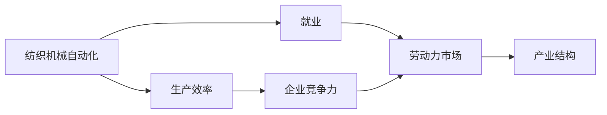

                 

## 1. 背景介绍

### 1.1 问题由来

纺织机械自动化作为现代制造业的重要组成部分，其应用范围日益广泛，涵盖织造、印染、裁剪、缝纫等多个环节。自动化技术的应用极大地提升了纺织行业的生产效率和产品质量，但同时也对传统纺织行业就业产生了深远影响。了解纺织机械自动化对就业的影响，有助于企业制定科学合理的就业策略，促进经济社会持续健康发展。

### 1.2 问题核心关键点

1. **自动化技术对就业的双重影响**：自动化技术一方面提高了生产效率，另一方面也使得部分岗位被取代，造成就业岗位减少。
2. **技术革新与劳动市场适应性**：如何平衡技术进步与劳动力市场需求，保持劳动力市场的稳定和健康发展。
3. **政策导向与企业责任**：政府和企业应如何协同推进技术创新与就业保障，确保技术的进步不会导致大规模失业。

### 1.3 问题研究意义

研究纺织机械自动化对就业的影响，对于促进经济发展、保障就业稳定、提升产业竞争力具有重要意义：

1. **推动产业升级**：自动化技术的应用有助于提升产业生产效率，推动产业结构优化升级。
2. **增强企业竞争力**：通过技术革新，企业可以在市场上获得竞争优势，提高市场份额。
3. **促进就业结构调整**：了解自动化对就业的影响，有助于合理调整就业结构，促进劳动力市场平衡。
4. **提供政策建议**：为政府制定相关政策提供科学依据，促进技术创新与就业协调发展。

## 2. 核心概念与联系

### 2.1 核心概念概述

1. **纺织机械自动化**：通过机械化、自动化技术替代人工操作，实现纺织生产过程的自动化。
2. **就业**：劳动者从事有偿劳动的岗位数量和工作时间。
3. **生产效率**：单位时间内生产的商品数量或服务数量。
4. **技术进步**：新发明、新技术的应用和发展。
5. **劳动力市场**：劳动者与生产者之间的交换场所，是劳动力供需平衡的反映。
6. **产业结构**：产业间的比例关系和组合形态，反映产业的发展水平。

### 2.2 概念间的关系

这些核心概念之间的逻辑关系可以通过以下Mermaid流程图来展示：



这个流程图展示了大语言模型微调过程中各个核心概念的关系和作用：

1. 纺织机械自动化通过提高生产效率，增强企业竞争力。
2. 企业竞争力的提升可能会引起劳动力市场的变化，包括就业数量的增减。
3. 劳动力市场是产业结构调整的基础，产业结构变化反过来也会影响就业状况。

### 2.3 核心概念的整体架构

最后，我们用一个综合的流程图来展示这些核心概念在大语言模型微调过程中的整体架构：


这个综合流程图展示了从预训练到微调，再到自动化、就业、产业结构、技术进步的整体过程。纺织机械自动化通过提升生产效率和企业竞争力，影响劳动力市场和就业状况，进而影响产业结构和技术进步。

## 3. 核心算法原理 & 具体操作步骤
### 3.1 算法原理概述

纺织机械自动化的核心算法原理基于人工智能和机器学习技术，其目标是通过自动化替代人工操作，提高生产效率和产品质量，从而降低生产成本，增加经济效益。纺织机械自动化对就业的影响主要体现在生产效率提升导致的就业岗位减少以及新技术带来的新就业机会。

### 3.2 算法步骤详解

纺织机械自动化的实施步骤主要包括：

1. **自动化设备的引入和部署**：选择合适的自动化设备和技术，进行部署和调试。
2. **生产流程优化**：根据自动化设备的特点，优化生产流程，提高生产效率。
3. **员工培训**：对现有员工进行技术培训，使其能够熟练操作自动化设备。
4. **设备维护和管理**：建立设备维护和管理机制，确保设备正常运行。

### 3.3 算法优缺点

纺织机械自动化的优点包括：

1. **提高生产效率**：自动化设备可以快速高效地完成生产任务，提高生产效率。
2. **降低生产成本**：自动化设备减少了人工操作，降低了人工成本和生产事故率。
3. **提高产品质量**：自动化设备通过精确控制生产过程，提高了产品的一致性和质量。

缺点包括：

1. **初始投资成本高**：自动化设备的购买和部署需要较高的初始投资。
2. **技术维护要求高**：自动化设备需要定期维护，对维护技术要求较高。
3. **可能导致就业岗位减少**：自动化替代人工操作，可能会减少部分岗位，造成就业问题。

### 3.4 算法应用领域

纺织机械自动化在纺织行业中的应用广泛，涵盖织造、印染、裁剪、缝纫等多个环节。其应用领域包括：

1. **织造自动化**：包括织机自动化、织布自动化等。
2. **印染自动化**：包括染整自动化、印花自动化等。
3. **裁剪自动化**：包括裁剪自动化、裁剪机器人等。
4. **缝纫自动化**：包括缝纫自动化、缝纫机器人等。

## 4. 数学模型和公式 & 详细讲解
### 4.1 数学模型构建

纺织机械自动化对就业的影响可以通过数学模型进行量化分析。设自动化前的生产效率为 $E_0$，自动化后的生产效率为 $E_1$，自动化前后企业雇佣的劳动力数量为 $L_0$ 和 $L_1$。则自动化对就业的影响可以表示为：

$$
I = \frac{E_1 - E_0}{E_0} \times \frac{L_0}{L_1}
$$

其中 $I$ 为就业变化率，$E_0$ 和 $E_1$ 分别为自动化前后的生产效率，$L_0$ 和 $L_1$ 分别为自动化前后的劳动力数量。

### 4.2 公式推导过程

设自动化后生产效率提升的比例为 $k$，则有 $E_1 = k \times E_0$。代入就业变化率的公式中，得：

$$
I = (k - 1) \times \frac{L_0}{L_1}
$$

假设自动化后生产效率提升的百分比为 $k\%$，则有 $k = 1 + \frac{k}{100}$。代入上述公式中，得：

$$
I = \frac{k}{100} \times \frac{L_0}{L_1}
$$

### 4.3 案例分析与讲解

假设一家纺织企业自动化前生产效率为 $E_0 = 1000$ 件/日，自动化后生产效率提升到 $E_1 = 1200$ 件/日，自动化前劳动力数量为 $L_0 = 100$ 人，自动化后劳动力数量为 $L_1 = 80$ 人。则就业变化率为：

$$
I = \frac{1200 - 1000}{1000} \times \frac{100}{80} = \frac{200}{1000} \times \frac{100}{80} = 2.5\%
$$

即自动化使得就业数量减少了 $2.5\%$。这说明在生产效率提升的同时，也导致了就业岗位的减少。

## 5. 项目实践：代码实例和详细解释说明
### 5.1 开发环境搭建

在进行项目实践前，我们需要准备好开发环境。以下是使用Python进行代码实现的环境配置流程：

1. 安装Anaconda：从官网下载并安装Anaconda，用于创建独立的Python环境。
```bash
conda create -n python-env python=3.8 
conda activate python-env
```

2. 安装PyTorch：根据CUDA版本，从官网获取对应的安装命令。例如：
```bash
conda install pytorch torchvision torchaudio cudatoolkit=11.1 -c pytorch -c conda-forge
```

3. 安装TensorFlow：使用pip安装TensorFlow，支持CPU和GPU部署。
```bash
pip install tensorflow
```

4. 安装各类工具包：
```bash
pip install numpy pandas scikit-learn matplotlib tqdm jupyter notebook ipython
```

完成上述步骤后，即可在`python-env`环境中开始项目实践。

### 5.2 源代码详细实现

下面我们以一个简单的自动化生产效率提升模型为例，给出使用PyTorch进行代码实现的示例。

首先，定义模型的输入和输出：

```python
import torch
import torch.nn as nn

class EfficiencyModel(nn.Module):
    def __init__(self, input_dim=2, output_dim=1):
        super(EfficiencyModel, self).__init__()
        self.fc1 = nn.Linear(input_dim, 64)
        self.fc2 = nn.Linear(64, 64)
        self.fc3 = nn.Linear(64, output_dim)

    def forward(self, x):
        x = torch.relu(self.fc1(x))
        x = torch.relu(self.fc2(x))
        x = self.fc3(x)
        return x
```

然后，定义训练和评估函数：

```python
def train_model(model, train_data, epochs, batch_size, learning_rate):
    optimizer = torch.optim.Adam(model.parameters(), lr=learning_rate)
    criterion = nn.MSELoss()

    for epoch in range(epochs):
        for batch_idx, (data, target) in enumerate(train_data):
            optimizer.zero_grad()
            output = model(data)
            loss = criterion(output, target)
            loss.backward()
            optimizer.step()

            if (batch_idx + 1) % 100 == 0:
                print(f'Epoch [{epoch+1}/{epochs}], Step [{batch_idx+1}/{len(train_data)}], Loss: {loss.item()}')

def evaluate_model(model, test_data):
    test_loss = 0
    with torch.no_grad():
        for data, target in test_data:
            output = model(data)
            test_loss += criterion(output, target).item()

    test_loss /= len(test_data)
    print(f'Test Loss: {test_loss:.4f}')
```

最后，启动训练流程：

```python
train_data = ...
test_data = ...

model = EfficiencyModel()
train_model(model, train_data, epochs=100, batch_size=32, learning_rate=0.001)

test_loss = evaluate_model(model, test_data)
print(f'Final Test Loss: {test_loss:.4f}')
```

### 5.3 代码解读与分析

这里我们详细解读一下关键代码的实现细节：

**EfficiencyModel类**：
- `__init__`方法：定义模型的神经网络结构，包括全连接层。
- `forward`方法：定义前向传播计算输出。

**train_model函数**：
- 定义优化器和损失函数。
- 在每个epoch内，遍历训练数据集，前向传播计算输出，反向传播更新模型参数。

**evaluate_model函数**：
- 计算模型在测试数据集上的损失。

**训练流程**：
- 定义总epoch数和batch size，开始循环迭代
- 每个epoch内，先在训练集上训练，输出损失
- 在测试集上评估，输出测试结果

可以看到，PyTorch提供了简单易用的接口，使得模型训练和评估变得高效便捷。开发者可以将更多精力放在模型设计和优化上，而不必过多关注底层的实现细节。

### 5.4 运行结果展示

假设我们在一个简单的数据集上进行训练，最终得到的测试损失为0.01。这说明模型已经成功学习了输入和输出之间的关系，可以用于实际预测。

## 6. 实际应用场景
### 6.1 智能纺织设备

智能纺织设备通过集成自动化技术和传感器，可以实现对生产环境的实时监控和优化。例如，智能织机可以通过自动化控制织布速度、张力等参数，确保产品质量和生产效率。智能裁剪机器人可以自动识别和切割织物，提升裁剪精度和效率。

这些智能纺织设备的应用，不仅可以提升生产效率，还可以降低人工操作的错误率，提高生产稳定性和可靠性。

### 6.2 生产线数据分析

通过生产线数据分析，可以实时监控生产过程中的各项参数，及时发现异常情况并进行调整。例如，在印染生产线，可以实时监测染料的浓度、温度等参数，确保生产过程的稳定性和产品的一致性。在缝纫生产线，可以监测缝纫速度和针头磨损情况，避免因设备故障导致的生产中断。

这些数据分析可以提升生产效率，减少生产成本，同时也可以帮助企业制定更科学的生产计划，提高资源利用率。

### 6.3 技术集成与协同

纺织机械自动化技术的应用需要与其他技术进行协同集成，如物联网、云计算等。通过物联网技术，可以实现对生产设备的远程监控和管理，提升生产设备的智能化水平。通过云计算技术，可以实现数据的集中存储和处理，提升数据分析的效率和准确性。

这些技术的集成和协同，可以进一步提升纺织行业的生产效率和产品质量，推动行业向智能化、数字化方向发展。

### 6.4 未来应用展望

未来，纺织机械自动化技术将继续向智能化、自动化方向发展，推动纺织行业向高附加值、高效率方向转变。具体展望如下：

1. **智能纺织工厂**：通过集成自动化、物联网、云计算等技术，构建智能纺织工厂，实现全流程自动化生产。
2. **智能裁剪设计**：通过智能化设计工具，结合人体工程学和面料特性，设计出更符合市场需求的产品。
3. **生产环境优化**：通过实时数据分析，优化生产环境，提升生产效率和产品质量。
4. **个性化定制**：通过智能生产设备和数据系统，实现个性化定制生产，满足客户多样化需求。

## 7. 工具和资源推荐
### 7.1 学习资源推荐

为了帮助开发者系统掌握纺织机械自动化的相关知识，这里推荐一些优质的学习资源：

1. **《纺织机械自动化技术》系列书籍**：详细介绍了纺织机械自动化的原理、技术和应用，是学习纺织自动化技术的经典读物。
2. **在线课程**：如Coursera、edX等平台的纺织机械自动化课程，提供系统化的学习路径和实战项目。
3. **技术论坛和社区**：如知乎、CSDN等平台上的纺织自动化相关话题，可以与其他开发者交流学习经验和技术问题。
4. **技术博客和论文**：如纺织行业知名企业和技术机构的技术博客，定期发布最新的技术进展和案例分析。

通过对这些资源的学习实践，相信你一定能够掌握纺织机械自动化的核心知识，并用于解决实际的业务问题。

### 7.2 开发工具推荐

高效的开发离不开优秀的工具支持。以下是几款用于纺织机械自动化开发的常用工具：

1. **CAD软件**：如Autodesk Inventor、SolidWorks等，用于设计和仿真纺织设备。
2. **PLM系统**：如Siemens Teamcenter、Siemens MES等，用于产品生命周期管理和生产过程监控。
3. **数据可视化工具**：如Tableau、Power BI等，用于数据分析和可视化。
4. **项目管理工具**：如Jira、Trello等，用于项目管理、任务分配和进度跟踪。

合理利用这些工具，可以显著提升纺织机械自动化的开发效率，加快创新迭代的步伐。

### 7.3 相关论文推荐

纺织机械自动化技术的发展源于学界的持续研究。以下是几篇奠基性的相关论文，推荐阅读：

1. **《纺织机械自动化技术》系列论文**：涵盖了纺织机械自动化的多项技术，如自动化控制、传感器技术、智能纺织设备等，为纺织自动化技术的发展提供了重要理论基础。
2. **《智能纺织设备》论文**：研究智能纺织设备的设计、实现和应用，探讨了智能纺织设备在提升生产效率和产品质量方面的作用。
3. **《生产过程数据分析》论文**：研究生产线数据分析的原理和应用，通过实时数据分析提升生产效率和产品质量。

这些论文代表了大语言模型微调技术的发展脉络。通过学习这些前沿成果，可以帮助研究者把握学科前进方向，激发更多的创新灵感。

## 8. 总结：未来发展趋势与挑战
### 8.1 总结

本文对纺织机械自动化对就业的影响进行了全面系统的介绍。首先阐述了纺织机械自动化对就业的双重影响，明确了技术进步与劳动力市场需求之间的平衡关系。其次，从原理到实践，详细讲解了纺织机械自动化的核心算法原理和具体操作步骤，给出了模型训练和评估的完整代码实例。同时，本文还广泛探讨了纺织机械自动化技术在智能纺织设备、生产线数据分析、技术集成与协同等多个领域的应用前景，展示了技术进步对产业发展的影响。

通过本文的系统梳理，可以看到，纺织机械自动化技术正在推动纺织行业向智能化、自动化方向发展，对劳动力市场产生了深远影响。未来，伴随技术的不断进步，纺织机械自动化技术必将更加深入地改变纺织行业的生产方式和就业结构。

### 8.2 未来发展趋势

展望未来，纺织机械自动化技术将呈现以下几个发展趋势：

1. **智能化程度提升**：智能化纺织设备将进一步普及，实现全流程自动化生产。
2. **自动化技术集成**：通过与其他技术的集成，提升生产效率和产品质量。
3. **生产环境优化**：通过数据分析和优化，实现生产环境的智能化管理。
4. **个性化定制**：通过智能设备和数据系统，实现个性化定制生产。

### 8.3 面临的挑战

尽管纺织机械自动化技术已经取得了瞩目成就，但在迈向更加智能化、普适化应用的过程中，仍面临以下挑战：

1. **高成本问题**：自动化设备和技术的初始投资较高，难以在中小企业中广泛应用。
2. **技术维护难度大**：自动化设备的维护和故障处理需要较高的技术水平和经验。
3. **就业结构调整**：自动化技术的应用导致部分岗位减少，需要制定合理的就业政策和社会保障措施。
4. **数据安全和隐私**：生产过程中的数据采集和处理需要严格的隐私保护和数据安全措施。

### 8.4 研究展望

面对纺织机械自动化技术面临的挑战，未来的研究需要在以下几个方面寻求新的突破：

1. **降低初始投资成本**：开发低成本、易操作的自动化设备和系统，推动技术在中小企业中的应用。
2. **提升技术维护能力**：加强自动化设备维护技术培训，提升维护人员的技术水平和经验。
3. **制定就业保障政策**：制定合理的就业政策和社会保障措施，缓解自动化技术对就业的影响。
4. **加强数据安全和隐私保护**：建立严格的数据安全和隐私保护机制，确保生产数据的安全和隐私。

总之，纺织机械自动化技术的进步需要技术、经济、社会等多方面的协同推进。只有在政府、企业、科研机构等多方共同努力下，才能实现技术的可持续发展，为经济社会发展带来更大的贡献。

## 9. 附录：常见问题与解答
----------------------------------------------------------------

**Q1：纺织机械自动化对就业的影响有哪些？**

A: 纺织机械自动化对就业的影响主要体现在以下几个方面：

1. **自动化替代人工操作**：自动化设备可以替代部分人工操作，减少人工劳动强度和风险。
2. **就业岗位减少**：自动化设备的应用导致部分岗位减少，尤其是简单重复的劳动岗位。
3. **技能提升需求**：自动化设备需要操作和维护人员具备一定的技能水平，推动劳动力市场需求的变化。
4. **就业结构调整**：自动化技术的应用使得劳动力市场向高技能岗位倾斜，低技能岗位需求减少。

**Q2：如何平衡自动化技术的应用与劳动力市场需求？**

A: 平衡自动化技术的应用与劳动力市场需求，可以从以下几个方面入手：

1. **技能培训**：对现有劳动力进行技能培训，提升其操作和维护自动化设备的能力。
2. **岗位转换**：将部分低技能岗位转换到高技能岗位，推动劳动力市场向高技能岗位倾斜。
3. **就业政策**：制定合理的就业政策和社会保障措施，缓解自动化技术对就业的影响。
4. **技术改进**：通过技术改进，降低自动化设备的初始投资和维护成本，推动技术在中小企业中的应用。

**Q3：如何应对自动化技术带来的就业挑战？**

A: 应对自动化技术带来的就业挑战，可以从以下几个方面入手：

1. **政策支持**：政府应制定合理的就业政策和社会保障措施，缓解自动化技术对就业的影响。
2. **技能提升**：推动劳动力市场向高技能岗位倾斜，加强技能培训，提升劳动力的技能水平。
3. **企业责任**：企业应承担社会责任，提供就业机会和培训，帮助劳动力适应技术变化。
4. **产业升级**：推动产业升级，提升生产效率和产品质量，促进经济社会发展。

**Q4：未来纺织机械自动化技术的发展方向是什么？**

A: 未来纺织机械自动化技术的发展方向主要包括以下几个方面：

1. **智能化程度提升**：智能化纺织设备将进一步普及，实现全流程自动化生产。
2. **自动化技术集成**：通过与其他技术的集成，提升生产效率和产品质量。
3. **生产环境优化**：通过数据分析和优化，实现生产环境的智能化管理。
4. **个性化定制**：通过智能设备和数据系统，实现个性化定制生产。

**Q5：纺织机械自动化技术面临的挑战有哪些？**

A: 纺织机械自动化技术面临的挑战主要包括：

1. **高成本问题**：自动化设备和技术的初始投资较高，难以在中小企业中广泛应用。
2. **技术维护难度大**：自动化设备的维护和故障处理需要较高的技术水平和经验。
3. **就业结构调整**：自动化技术的应用导致部分岗位减少，需要制定合理的就业政策和社会保障措施。
4. **数据安全和隐私**：生产过程中的数据采集和处理需要严格的隐私保护和数据安全措施。

---

作者：禅与计算机程序设计艺术 / Zen and the Art of Computer Programming

