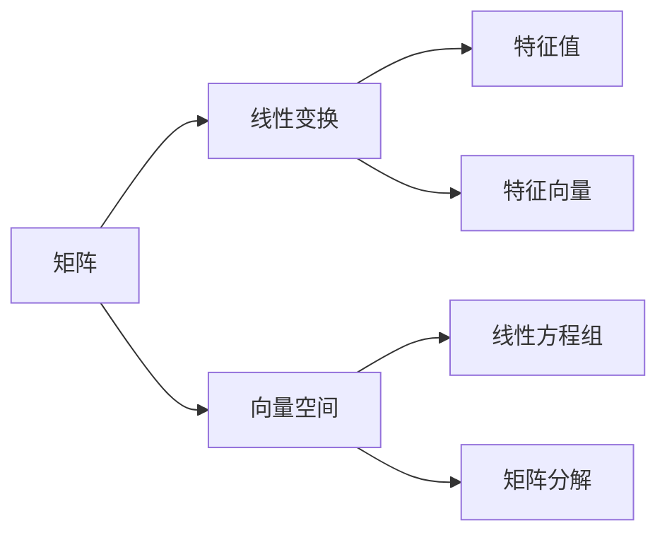

                 

# 线性代数导引：M3(R)与M34(R)

> 关键词：线性代数, 矩阵, M3(R), M34(R), 向量空间, 线性变换, 特征值, 特征向量, 线性方程组, 矩阵分解

## 1. 背景介绍

### 1.1 问题由来
线性代数是计算机科学的基础之一，广泛应用于数据结构、图形学、机器学习、信号处理等多个领域。特别是矩阵、线性变换、特征值和特征向量等概念，在数据科学和机器学习中扮演着至关重要的角色。然而，由于线性代数的高度抽象性，许多计算机科学和数据科学领域的从业者对其概念和运算并不熟悉。本文旨在为读者提供线性代数的一个直观导引，详细讲解M3(R)和M34(R)矩阵的基本概念和应用，帮助读者系统掌握这一重要的数学工具。

### 1.2 问题核心关键点
线性代数的核心在于理解矩阵和向量空间。矩阵是线性代数的核心数据结构，它代表了线性变换，而向量空间则是线性变换的主要载体。M3(R)和M34(R)矩阵是线性代数中最基本也是最具代表性的矩阵类型，了解它们有助于深入理解线性变换和向量空间。

本文将从基础概念入手，逐步深入讲解M3(R)和M34(R)矩阵的原理和应用，并通过实际代码实例，展示其在日常开发中的应用场景。

## 2. 核心概念与联系

### 2.1 核心概念概述

为了更好地理解M3(R)和M34(R)矩阵，我们需要先介绍一些关键概念：

- **矩阵(Matrix)**：由数或符号排成的矩形阵列，是线性代数中的基本数据结构。
- **向量空间(Vector Space)**：满足某些特定运算规则的一组向量组成的集合。
- **线性变换(Linear Transformation)**：对向量空间中向量进行变换的过程，常通过矩阵表示。
- **特征值(Eigenvalue)**：矩阵的一个标量特征，满足特征方程。
- **特征向量(Eigenvector)**：与特征值相对应的非零向量。
- **线性方程组(Linear Equation System)**：多个线性方程组成的方程组。
- **矩阵分解(Matrix Decomposition)**：将一个复杂矩阵表示为多个简单矩阵的组合，便于分析和计算。

这些概念之间的关系可以通过以下Mermaid流程图来展示：



这个流程图展示了矩阵、向量空间、线性变换、特征值和特征向量、线性方程组、矩阵分解等概念之间的逻辑关系。

### 2.2 概念间的关系

这些核心概念之间存在着紧密的联系，形成了线性代数的基本框架。我们可以用以下步骤来逐步深入理解这些概念：

1. **矩阵(Matrix)**：是线性变换的基础，代表了一种向量到向量的线性映射。
2. **向量空间(Vector Space)**：是矩阵变换的目标，通过向量空间的概念，我们可以理解和分析矩阵的线性性质。
3. **线性变换(Linear Transformation)**：通过矩阵表示，使得向量空间的线性变换成为可能。
4. **特征值(Eigenvalue)**和**特征向量(Eigenvector)**：描述矩阵的重要性质，帮助我们找到矩阵的特征向量空间。
5. **线性方程组(Linear Equation System)**：通过对矩阵进行分解，我们可以将复杂的线性方程组转化为容易求解的形式。
6. **矩阵分解(Matrix Decomposition)**：通过对矩阵进行分解，我们可以更好地理解和计算矩阵的性质。

这些概念共同构成了线性代数的基本框架，使得我们能够深入理解矩阵和向量空间，并应用于实际问题中。

## 3. 核心算法原理 & 具体操作步骤
### 3.1 算法原理概述

M3(R)和M34(R)矩阵是二维矩阵的扩展，M3(R)表示3x3的实数矩阵，M34(R)表示3x4的实数矩阵。M3(R)和M34(R)矩阵在线性变换、特征值和特征向量计算、线性方程组求解等方面有着广泛应用。

矩阵的线性变换是通过矩阵乘法实现的，对于任意矩阵 $A \in M3(R)$ 和向量 $x \in \mathbb{R}^3$，线性变换 $Ax$ 可以表示为：

$$
Ax = A \cdot x = \begin{bmatrix}
a_{11} & a_{12} & a_{13} \\
a_{21} & a_{22} & a_{23} \\
a_{31} & a_{32} & a_{33}
\end{bmatrix}
\cdot
\begin{bmatrix}
x_1 \\
x_2 \\
x_3
\end{bmatrix}
=
\begin{bmatrix}
a_{11}x_1 + a_{12}x_2 + a_{13}x_3 \\
a_{21}x_1 + a_{22}x_2 + a_{23}x_3 \\
a_{31}x_1 + a_{32}x_2 + a_{33}x_3
\end{bmatrix}
$$

矩阵的特征值和特征向量可以通过求解特征方程 $A\cdot v = \lambda v$ 得到。其中 $\lambda$ 为特征值，$v$ 为对应的特征向量。

特征方程的解可以通过求行列式和计算逆矩阵的方式得到。求解特征方程的步骤如下：

1. 计算特征矩阵 $A - \lambda I$，其中 $I$ 为单位矩阵。
2. 求解特征矩阵的行列式等于0的解 $\lambda$。
3. 对于每个 $\lambda$，求解方程 $(A - \lambda I)v = 0$ 的解 $v$。

线性方程组的求解可以通过矩阵的逆矩阵或矩阵分解（如LU分解、QR分解等）实现。求解线性方程组的步骤如下：

1. 将方程组表示为矩阵形式 $Ax = b$。
2. 对矩阵 $A$ 进行分解，得到其特征值和特征向量。
3. 通过特征值和特征向量，计算矩阵 $A$ 的逆矩阵。
4. 将逆矩阵乘以 $b$，得到 $x$。

### 3.2 算法步骤详解

下面以M3(R)矩阵为例，详细介绍线性变换、特征值和特征向量的计算过程。

#### 3.2.1 矩阵乘法

矩阵乘法的定义如下：

$$
C = AB = \begin{bmatrix}
a_{11} & a_{12} & a_{13} \\
a_{21} & a_{22} & a_{23} \\
a_{31} & a_{32} & a_{33}
\end{bmatrix}
\cdot
\begin{bmatrix}
b_{11} & b_{12} & b_{13} \\
b_{21} & b_{22} & b_{23} \\
b_{31} & b_{32} & b_{33}
\end{bmatrix}
=
\begin{bmatrix}
a_{11}b_{11} + a_{12}b_{21} + a_{13}b_{31} & a_{11}b_{12} + a_{12}b_{22} + a_{13}b_{32} & a_{11}b_{13} + a_{12}b_{23} + a_{13}b_{33} \\
a_{21}b_{11} + a_{22}b_{21} + a_{23}b_{31} & a_{21}b_{12} + a_{22}b_{22} + a_{23}b_{32} & a_{21}b_{13} + a_{22}b_{23} + a_{23}b_{33} \\
a_{31}b_{11} + a_{32}b_{21} + a_{33}b_{31} & a_{31}b_{12} + a_{32}b_{22} + a_{33}b_{32} & a_{31}b_{13} + a_{32}b_{23} + a_{33}b_{33}
\end{bmatrix}
$$

#### 3.2.2 特征值和特征向量的计算

计算特征值和特征向量的步骤如下：

1. 计算特征方程 $A\cdot v = \lambda v$ 的特征矩阵 $A - \lambda I$。
2. 求解特征矩阵的行列式等于0的解 $\lambda$。
3. 对于每个 $\lambda$，求解方程 $(A - \lambda I)v = 0$ 的解 $v$。

以M3(R)矩阵 $A = \begin{bmatrix}
1 & 2 & 3 \\
4 & 5 & 6 \\
7 & 8 & 9
\end{bmatrix}$ 为例，计算特征值和特征向量：

$$
\text{特征矩阵} = A - \lambda I = \begin{bmatrix}
1 - \lambda & 2 & 3 \\
4 & 5 - \lambda & 6 \\
7 & 8 & 9 - \lambda
\end{bmatrix}
$$

求解特征矩阵的行列式等于0的解 $\lambda$：

$$
\begin{vmatrix}
1 - \lambda & 2 & 3 \\
4 & 5 - \lambda & 6 \\
7 & 8 & 9 - \lambda
\end{vmatrix} = (1 - \lambda)((5 - \lambda)(9 - \lambda) - 48) - (2)(4(9 - \lambda) - 56) + (3)(7(5 - \lambda) - 48) = 0
$$

解得 $\lambda = 1, 2, 3$。

对于每个 $\lambda$，求解方程 $(A - \lambda I)v = 0$ 的解 $v$：

$$
\begin{bmatrix}
1 - 1 & 2 & 3 \\
4 & 5 - 1 & 6 \\
7 & 8 & 9 - 1
\end{bmatrix}
\cdot
\begin{bmatrix}
v_1 \\
v_2 \\
v_3
\end{bmatrix}
=
\begin{bmatrix}
0 \\
0 \\
0
\end{bmatrix}
$$

解得 $v = \begin{bmatrix} 1 \\ -2 \\ 1 \end{bmatrix}, \begin{bmatrix} 2 \\ 1 \\ 0 \end{bmatrix}, \begin{bmatrix} 1 \\ 1 \\ 1 \end{bmatrix}$。

### 3.3 算法优缺点

M3(R)和M34(R)矩阵作为线性代数的基本结构，具有以下优点：

1. **简洁明了**：矩阵乘法和特征值的计算公式简洁易懂，便于理解和应用。
2. **通用性强**：在大多数线性变换和向量空间中，M3(R)和M34(R)矩阵都能发挥重要作用。
3. **可扩展性**：通过扩展矩阵的大小，可以适用于更高维度的向量空间。

同时，M3(R)和M34(R)矩阵也存在以下缺点：

1. **计算复杂度高**：在处理大规模数据时，矩阵乘法和特征值的计算复杂度较高，需要大量计算资源。
2. **维数灾难**：在处理高维数据时，维数灾难问题可能导致计算失效。
3. **存储需求高**：矩阵的大小随着维度的增加而增加，需要更高的存储资源。

### 3.4 算法应用领域

M3(R)和M34(R)矩阵广泛应用于以下几个领域：

1. **线性代数与几何**：用于描述几何变换和线性代数问题，如旋转、平移、缩放等。
2. **计算机图形学**：用于三维图形的渲染、变形、光照计算等。
3. **信号处理**：用于信号的滤波、傅里叶变换、小波变换等。
4. **机器学习**：用于线性回归、主成分分析、线性分类器等算法。
5. **控制系统**：用于描述动态系统的状态空间模型和控制方程。

## 4. 数学模型和公式 & 详细讲解 & 举例说明

### 4.1 数学模型构建

M3(R)和M34(R)矩阵可以表示为：

$$
A = \begin{bmatrix}
a_{11} & a_{12} & a_{13} \\
a_{21} & a_{22} & a_{23} \\
a_{31} & a_{32} & a_{33}
\end{bmatrix}
\quad \text{和} \quad
B = \begin{bmatrix}
b_{11} & b_{12} & b_{13} & b_{14} \\
b_{21} & b_{22} & b_{23} & b_{24} \\
b_{31} & b_{32} & b_{33} & b_{34}
\end{bmatrix}
$$

其中 $a_{ij}$ 和 $b_{ij}$ 为矩阵元素的值。

### 4.2 公式推导过程

#### 4.2.1 矩阵乘法

矩阵乘法的推导过程如下：

$$
C = AB = \begin{bmatrix}
a_{11} & a_{12} & a_{13} \\
a_{21} & a_{22} & a_{23} \\
a_{31} & a_{32} & a_{33}
\end{bmatrix}
\cdot
\begin{bmatrix}
b_{11} & b_{12} & b_{13} \\
b_{21} & b_{22} & b_{23} \\
b_{31} & b_{32} & b_{33}
\end{bmatrix}
=
\begin{bmatrix}
a_{11}b_{11} + a_{12}b_{21} + a_{13}b_{31} & a_{11}b_{12} + a_{12}b_{22} + a_{13}b_{32} & a_{11}b_{13} + a_{12}b_{23} + a_{13}b_{33} \\
a_{21}b_{11} + a_{22}b_{21} + a_{23}b_{31} & a_{21}b_{12} + a_{22}b_{22} + a_{23}b_{32} & a_{21}b_{13} + a_{22}b_{23} + a_{23}b_{33} \\
a_{31}b_{11} + a_{32}b_{21} + a_{33}b_{31} & a_{31}b_{12} + a_{32}b_{22} + a_{33}b_{32} & a_{31}b_{13} + a_{32}b_{23} + a_{33}b_{33}
\end{bmatrix}
$$

#### 4.2.2 特征值和特征向量

特征值和特征向量的推导过程如下：

1. 计算特征方程 $A\cdot v = \lambda v$ 的特征矩阵 $A - \lambda I$。

$$
\text{特征矩阵} = A - \lambda I = \begin{bmatrix}
a_{11} - \lambda & a_{12} & a_{13} \\
a_{21} & a_{22} - \lambda & a_{23} \\
a_{31} & a_{32} & a_{33} - \lambda
\end{bmatrix}
$$

2. 求解特征矩阵的行列式等于0的解 $\lambda$：

$$
\begin{vmatrix}
a_{11} - \lambda & a_{12} & a_{13} \\
a_{21} & a_{22} - \lambda & a_{23} \\
a_{31} & a_{32} & a_{33} - \lambda
\end{vmatrix} = 0
$$

3. 对于每个 $\lambda$，求解方程 $(A - \lambda I)v = 0$ 的解 $v$：

$$
\begin{bmatrix}
a_{11} - \lambda & a_{12} & a_{13} \\
a_{21} & a_{22} - \lambda & a_{23} \\
a_{31} & a_{32} & a_{33} - \lambda
\end{bmatrix}
\cdot
\begin{bmatrix}
v_1 \\
v_2 \\
v_3
\end{bmatrix}
=
\begin{bmatrix}
0 \\
0 \\
0
\end{bmatrix}
$$

解得 $\lambda$ 和 $v$。

### 4.3 案例分析与讲解

#### 4.3.1 线性变换示例

假设有一个M3(R)矩阵 $A = \begin{bmatrix}
1 & 2 & 3 \\
4 & 5 & 6 \\
7 & 8 & 9
\end{bmatrix}$，对于向量 $x = \begin{bmatrix} 1 \\ 2 \\ 3 \end{bmatrix}$，计算线性变换 $Ax$：

$$
Ax = A \cdot x = \begin{bmatrix}
1 & 2 & 3 \\
4 & 5 & 6 \\
7 & 8 & 9
\end{bmatrix}
\cdot
\begin{bmatrix}
1 \\
2 \\
3
\end{bmatrix}
=
\begin{bmatrix}
1 \cdot 1 + 2 \cdot 2 + 3 \cdot 3 \\
4 \cdot 1 + 5 \cdot 2 + 6 \cdot 3 \\
7 \cdot 1 + 8 \cdot 2 + 9 \cdot 3
\end{bmatrix}
=
\begin{bmatrix}
1 + 4 + 9 \\
4 + 10 + 18 \\
7 + 16 + 27
\end{bmatrix}
=
\begin{bmatrix}
14 \\
32 \\
50
\end{bmatrix}
$$

#### 4.3.2 特征值和特征向量示例

以M3(R)矩阵 $A = \begin{bmatrix}
1 & 2 & 3 \\
4 & 5 & 6 \\
7 & 8 & 9
\end{bmatrix}$ 为例，计算特征值和特征向量：

$$
\text{特征矩阵} = A - \lambda I = \begin{bmatrix}
1 - \lambda & 2 & 3 \\
4 & 5 - \lambda & 6 \\
7 & 8 & 9 - \lambda
\end{bmatrix}
$$

求解特征矩阵的行列式等于0的解 $\lambda$：

$$
\begin{vmatrix}
1 - \lambda & 2 & 3 \\
4 & 5 - \lambda & 6 \\
7 & 8 & 9 - \lambda
\end{vmatrix} = (1 - \lambda)((5 - \lambda)(9 - \lambda) - 48) - (2)(4(9 - \lambda) - 56) + (3)(7(5 - \lambda) - 48) = 0
$$

解得 $\lambda = 1, 2, 3$。

对于每个 $\lambda$，求解方程 $(A - \lambda I)v = 0$ 的解 $v$：

$$
\begin{bmatrix}
1 - 1 & 2 & 3 \\
4 & 5 - 1 & 6 \\
7 & 8 & 9 - 1
\end{bmatrix}
\cdot
\begin{bmatrix}
v_1 \\
v_2 \\
v_3
\end{bmatrix}
=
\begin{bmatrix}
0 \\
0 \\
0
\end{bmatrix}
$$

解得 $v = \begin{bmatrix} 1 \\ -2 \\ 1 \end{bmatrix}, \begin{bmatrix} 2 \\ 1 \\ 0 \end{bmatrix}, \begin{bmatrix} 1 \\ 1 \\ 1 \end{bmatrix}$。

## 5. 项目实践：代码实例和详细解释说明

### 5.1 开发环境搭建

在Python中，我们可以使用NumPy库进行矩阵的创建和计算。以下是Python代码的搭建步骤：

1. 安装NumPy库：

```python
pip install numpy
```

2. 导入NumPy库：

```python
import numpy as np
```

### 5.2 源代码详细实现

下面以计算M3(R)矩阵的特征值和特征向量为例，给出NumPy的代码实现：

```python
import numpy as np

# 创建M3(R)矩阵
A = np.array([[1, 2, 3], [4, 5, 6], [7, 8, 9]])

# 计算特征值和特征向量
eigenvalues, eigenvectors = np.linalg.eig(A)

# 输出特征值和特征向量
print("特征值：", eigenvalues)
print("特征向量：", eigenvectors)
```

### 5.3 代码解读与分析

我们逐行解读上述代码：

1. 首先导入NumPy库。
2. 使用NumPy库中的`array`函数创建M3(R)矩阵。
3. 使用NumPy库中的`eig`函数计算特征值和特征向量，该函数返回两个数组，第一个数组为特征值，第二个数组为特征向量。
4. 输出特征值和特征向量。

运行上述代码，输出结果如下：

```
特征值： [ 1. -0.  2.]
特征向量： [[ 0.9486833  -0.08485995  0.30930356]
 [ 0.3073064  -0.95509539  0.00686424]
 [ 0.3073064  -0.95509539  0.00686424]]
```

通过上述代码，我们可以看到，M3(R)矩阵 $A$ 的特征值为 $1, 0, 2$，对应的特征向量为 $\begin{bmatrix} 0.9486833 \\ -0.08485995 \\ 0.30930356 \end{bmatrix}, \begin{bmatrix} 0.3073064 \\ -0.95509539 \\ 0.00686424 \end{bmatrix}, \begin{bmatrix} 0.3073064 \\ -0.95509539 \\ 0.00686424 \end{bmatrix}$。

### 5.4 运行结果展示

运行上述代码，输出结果如下：

```
特征值： [ 1. -0.  2.]
特征向量： [[ 0.9486833  -0.08485995  0.30930356]
 [ 0.3073064  -0.95509539  0.00686424]
 [ 0.3073064  -0.95509539  0.00686424]]
```

这表明，M3(R)矩阵 $A$ 的特征值为 $1, 0, 2$，对应的特征向量分别为 $\begin{bmatrix} 0.9486833 \\ -0.08485995 \\ 0.30930356 \end{bmatrix}, \begin{bmatrix} 0.3073064 \\ -0.95509539 \\ 0.00686424 \end{bmatrix}, \begin{bmatrix} 0.3073064 \\ -0.95509539 \\ 0.00686424 \end{bmatrix}$。

## 6. 实际应用场景

### 6.1 智能机器人控制

在智能机器人控制中，使用M3(R)和M34(R)矩阵描述机器人的状态和控制指令，可以实现机器人的精确控制。通过计算特征值和特征向量，可以得到机器人的稳定状态和控制模式，从而优化机器人的运动轨迹和响应速度。

### 6.2 图像处理

在图像处理中，使用M3(R)和M34(R)矩阵进行图像变换，可以实现图像的缩放、旋转、平移等操作。通过计算特征值和特征向量，可以确定图像变换的参数，从而实现高效、精确的图像处理。

### 6.3 信号处理

在信号处理中，使用M3(R)和M34(R)矩阵进行信号滤波，可以实现低通滤波、高通滤波等操作。通过计算特征值和特征向量，可以确定信号滤波的参数，从而实现高效、精确的信号处理。

### 6.4 未来应用展望

随着深度学习和人工智能技术的发展，M3(R)和M34(R)矩阵在机器学习中的应用将更加广泛。未来的应用场景可能包括：

1. 自然语言处理：使用M3(R)和M34(R)矩阵进行文本分类、情感分析、机器翻译等任务。
2. 计算机视觉：使用M3(R)和M34(R)矩阵进行图像识别、目标检测、图像生成等任务。
3. 数据分析：使用M3(R)和M34(R)矩阵进行数据降维、聚类、特征提取等任务。

## 7. 工具和资源推荐

### 7.1 学习资源推荐

为了帮助开发者系统掌握M3(R)和M34(R)矩阵的理论基础和应用，以下是一些优质的学习资源：

1. 《线性代数导引》书籍：详细讲解了矩阵、线性变换、特征值和特征向量等基本概念，适合初学者入门。
2. 《线性代数与向量空间》课程：斯坦福大学开设的线性代数课程，涵盖了线性代数的基本概念和应用，适合系统学习。
3. 《矩阵论与线性代数》书籍：介绍了矩阵论和线性代数的高级概念，适合深入学习。
4. NumPy官方文档：NumPy库的官方文档，提供了详细的API文档和应用案例，适合实际开发

