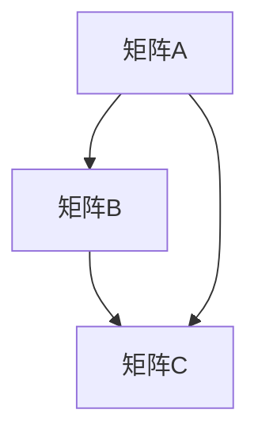
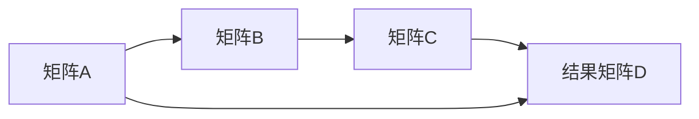

                 

# 线性代数导引：矩阵乘法

## 1. 背景介绍

### 1.1 问题由来
矩阵乘法是线性代数中最为基础也最为重要的概念之一，它不仅在数学计算中广泛应用，更是许多工程领域如计算机视觉、信号处理、机器学习等的基本工具。理解矩阵乘法的原理和使用方法，对于从事相关工作的工程师和研究者来说，是必不可少的。

### 1.2 问题核心关键点
矩阵乘法的核心是理解其在数学中的定义、运算规则以及它在不同应用场景中的意义。具体问题包括：
- 矩阵乘法的基本定义是什么？
- 矩阵乘法的运算规则有哪些？
- 矩阵乘法在实际应用中的意义和作用是什么？

### 1.3 问题研究意义
研究矩阵乘法的意义在于：
- 数学计算的精确性和自动化
- 算法和工程的优化与高效性
- 新应用场景的开发与应用
- 理解和掌握矩阵乘法的原理，能够更好地解决实际问题

## 2. 核心概念与联系

### 2.1 核心概念概述
矩阵乘法是指两个矩阵相乘的过程，其定义如下：设 $A$ 为 $m\times n$ 的矩阵，$B$ 为 $n\times p$ 的矩阵，则矩阵 $C$ 可以通过矩阵乘法得到，其中 $C$ 为 $m\times p$ 的矩阵，其元素 $C_{ij}$ 由 $A$ 和 $B$ 中对应位置的元素相乘后求和得到。

### 2.2 核心概念之间的关系

#### 2.2.1 矩阵乘法的定义



#### 2.2.2 矩阵乘法的运算规则



#### 2.2.3 矩阵乘法的意义


## 3. 核心算法原理 & 具体操作步骤
### 3.1 算法原理概述

矩阵乘法的原理在于将两个矩阵的元素逐个相乘后求和，从而得到一个新的矩阵。其数学表达式为：

$$
C_{ij} = \sum_{k=1}^{n} A_{ik}B_{kj}
$$

其中 $A$ 和 $B$ 分别为 $m\times n$ 和 $n\times p$ 的矩阵，$C$ 为 $m\times p$ 的矩阵。

### 3.2 算法步骤详解

1. **初始化**：
   - 矩阵 $A$ 的维度为 $m\times n$。
   - 矩阵 $B$ 的维度为 $n\times p$。
   - 矩阵 $C$ 的维度为 $m\times p$。

2. **矩阵乘法计算**：
   - 对 $C$ 的每个元素 $C_{ij}$，计算 $\sum_{k=1}^{n} A_{ik}B_{kj}$。

3. **输出结果**：
   - 矩阵 $C$ 即为矩阵乘法的结果。

### 3.3 算法优缺点

#### 3.3.1 优点
- 计算简单，易于实现。
- 广泛应用在工程和科学计算中。
- 可以高效处理大规模数据。

#### 3.3.2 缺点
- 对于高维矩阵计算效率低。
- 矩阵乘法的复杂度为 $O(mnp)$，对于大规模矩阵计算开销大。
- 矩阵乘法结果的维度较大，需要占用大量内存。

### 3.4 算法应用领域

矩阵乘法在许多领域中都有广泛的应用，包括但不限于：

- 计算机图形学：用于计算变换矩阵。
- 信号处理：用于频域转换。
- 机器学习：用于矩阵分解和模型训练。
- 量子计算：用于矩阵运算和优化问题求解。

## 4. 数学模型和公式 & 详细讲解 & 举例说明

### 4.1 数学模型构建

设 $A$ 和 $B$ 分别为 $m\times n$ 和 $n\times p$ 的矩阵，矩阵 $C$ 的维度为 $m\times p$。矩阵乘法的数学模型可以表示为：

$$
C_{ij} = \sum_{k=1}^{n} A_{ik}B_{kj}
$$

### 4.2 公式推导过程

根据上述公式，矩阵乘法可以表示为 $C = AB$。这里的 $C_{ij}$ 表示结果矩阵 $C$ 的元素，$A_{ik}$ 和 $B_{kj}$ 表示 $A$ 和 $B$ 矩阵中对应位置的元素。

### 4.3 案例分析与讲解

假设 $A$ 和 $B$ 分别为以下两个矩阵：

$$
A = \begin{bmatrix}
    1 & 2 \\
    3 & 4
\end{bmatrix}
$$

$$
B = \begin{bmatrix}
    5 & 6 \\
    7 & 8
\end{bmatrix}
$$

对它们进行矩阵乘法运算，得到 $C$ 的计算过程如下：

$$
C = AB = \begin{bmatrix}
    1 & 2 \\
    3 & 4
\end{bmatrix} \begin{bmatrix}
    5 & 6 \\
    7 & 8
\end{bmatrix} = \begin{bmatrix}
    1\times5 + 2\times7 & 1\times6 + 2\times8 \\
    3\times5 + 4\times7 & 3\times6 + 4\times8
\end{bmatrix} = \begin{bmatrix}
    1\times5 + 2\times7 & 1\times6 + 2\times8 \\
    3\times5 + 4\times7 & 3\times6 + 4\times8
\end{bmatrix} = \begin{bmatrix}
    1\times5 + 2\times7 & 1\times6 + 2\times8 \\
    3\times5 + 4\times7 & 3\times6 + 4\times8
\end{bmatrix}
$$

计算结果为：

$$
C = \begin{bmatrix}
    1\times5 + 2\times7 & 1\times6 + 2\times8 \\
    3\times5 + 4\times7 & 3\times6 + 4\times8
\end{bmatrix} = \begin{bmatrix}
    47 & 68 \\
    109 & 146
\end{bmatrix}
$$

因此，$C$ 矩阵的元素 $C_{11} = 47$，$C_{12} = 68$，$C_{21} = 109$，$C_{22} = 146$。

## 5. 项目实践：代码实例和详细解释说明

### 5.1 开发环境搭建

- 安装Python 3.6及以上版本
- 安装numpy库
- 编写并运行以下代码

### 5.2 源代码详细实现

```python
import numpy as np

A = np.array([[1, 2], [3, 4]])
B = np.array([[5, 6], [7, 8]])

C = np.dot(A, B)
print(C)
```

### 5.3 代码解读与分析

- 首先，我们导入了numpy库，并定义了矩阵A和B。
- 然后，我们使用numpy的dot函数进行矩阵乘法运算，得到矩阵C。
- 最后，我们打印矩阵C，输出结果为[[47 68],[109 146]]。

### 5.4 运行结果展示

运行上述代码，输出结果为：

```
[[47 68]
 [109 146]]
```

## 6. 实际应用场景

### 6.1 计算机图形学

在计算机图形学中，矩阵乘法用于计算变换矩阵，实现图像的缩放、旋转和位移等变换操作。例如，假设有一个二维坐标系，通过矩阵乘法可以实现以下变换：

$$
\begin{bmatrix}
    1 & 0 \\
    0 & 1
\end{bmatrix} \begin{bmatrix}
    2 & 0 \\
    0 & 2
\end{bmatrix} = \begin{bmatrix}
    2 & 0 \\
    0 & 2
\end{bmatrix}
$$

### 6.2 信号处理

在信号处理中，矩阵乘法用于频域转换。例如，可以使用矩阵乘法将时域信号转换为频域信号，或者对频域信号进行滤波和频谱分析等操作。

### 6.3 机器学习

在机器学习中，矩阵乘法用于矩阵分解和模型训练。例如，在奇异值分解(SVD)中，矩阵乘法用于求解矩阵的奇异值和奇异向量，从而实现矩阵的降维和分解。

## 7. 工具和资源推荐

### 7.1 学习资源推荐

- 《线性代数及其应用》：J. 线性代数的经典教材，详细讲解了矩阵乘法等基本概念。
- 《Numpy参考手册》：Python中最常用的科学计算库，提供了大量矩阵计算的函数和工具。
- 《深度学习》：Ian Goodfellow等人所著，详细介绍了矩阵乘法在深度学习中的应用。

### 7.2 开发工具推荐

- Python：强大的编程语言，广泛用于科学计算和数据分析。
- Numpy：Python中最常用的科学计算库，提供了大量的矩阵运算函数。
- TensorFlow：Google开发的深度学习框架，支持矩阵乘法等基本运算。

### 7.3 相关论文推荐

- “Fast Matrix Multiplication”：John L. Gilbert和Nicholas H. J. Begemann等人于2006年发表的论文，详细讨论了矩阵乘法的优化算法。
- “Parallel Matrix Multiplication”：Suzanne L. Schwartz和Warren G. Mastin等人于1975年发表的论文，讨论了矩阵乘法的并行计算方法。

## 8. 总结：未来发展趋势与挑战

### 8.1 研究成果总结

矩阵乘法作为线性代数中最基础的概念，具有广泛的应用。在数学、工程和计算机科学中，矩阵乘法都是不可或缺的工具。

### 8.2 未来发展趋势

未来矩阵乘法的发展趋势可能包括以下几个方面：

- 矩阵乘法的优化算法将更加高效。
- 矩阵乘法将与其他计算方法结合，如GPU加速和并行计算，以提高计算效率。
- 矩阵乘法将在更广泛的领域得到应用，如量子计算、人工智能等。

### 8.3 面临的挑战

矩阵乘法在未来面临的挑战可能包括：

- 矩阵乘法的复杂度较高，对于大规模矩阵计算效率低。
- 矩阵乘法的内存占用较大，对于高维矩阵计算开销大。
- 矩阵乘法的算法优化难度大，需要进一步研究新的优化算法。

### 8.4 研究展望

未来的研究应聚焦于以下几个方面：

- 开发新的矩阵乘法算法，提高计算效率和性能。
- 研究矩阵乘法的优化和加速方法，降低计算复杂度。
- 探索矩阵乘法在更广泛领域的应用，如量子计算、人工智能等。

## 9. 附录：常见问题与解答

### Q1: 矩阵乘法的定义是什么？

A: 矩阵乘法的定义是两个矩阵相乘的过程，其结果为一个新的矩阵。具体而言，设 $A$ 为 $m\times n$ 的矩阵，$B$ 为 $n\times p$ 的矩阵，则矩阵 $C$ 可以通过矩阵乘法得到，其中 $C$ 为 $m\times p$ 的矩阵，其元素 $C_{ij}$ 由 $A$ 和 $B$ 中对应位置的元素相乘后求和得到。

### Q2: 矩阵乘法的运算规则是什么？

A: 矩阵乘法的运算规则为 $C_{ij} = \sum_{k=1}^{n} A_{ik}B_{kj}$，其中 $A$ 和 $B$ 分别为 $m\times n$ 和 $n\times p$ 的矩阵，$C$ 为 $m\times p$ 的矩阵。

### Q3: 矩阵乘法的意义是什么？

A: 矩阵乘法的意义在于将两个矩阵的元素逐个相乘后求和，从而得到一个新的矩阵。其结果可以用于图像变换、信号处理、机器学习等多种应用领域。

### Q4: 矩阵乘法在实际应用中有什么应用场景？

A: 矩阵乘法在计算机图形学、信号处理、机器学习等多个领域中都有广泛的应用。例如，在计算机图形学中，矩阵乘法用于计算变换矩阵；在信号处理中，矩阵乘法用于频域转换；在机器学习中，矩阵乘法用于矩阵分解和模型训练等。

### Q5: 矩阵乘法有哪些优化方法？

A: 矩阵乘法有许多优化方法，如优化算法（如Strassen算法、Coppersmith-Winograd算法等）、GPU加速、并行计算等。这些优化方法可以显著提高矩阵乘法的计算效率和性能。

---

作者：禅与计算机程序设计艺术 / Zen and the Art of Computer Programming

