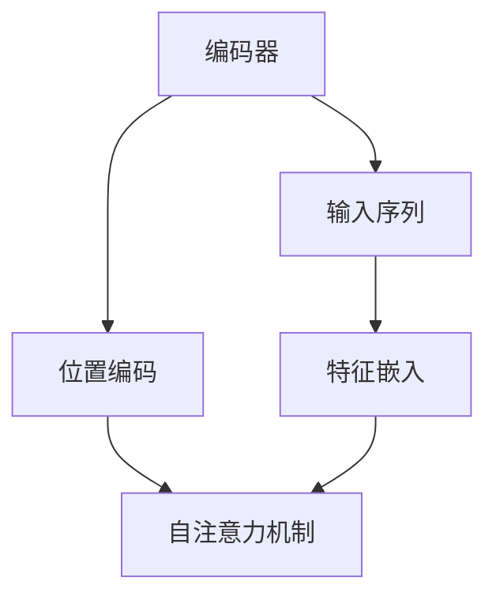

                 

# 编码器的输入和位置编码

在深度学习领域，编码器（Encoder）是一个重要的组成部分，尤其在自然语言处理（NLP）中，编码器被广泛用于将文本序列转换为固定长度的向量表示。其中，位置编码（Positional Encoding）是编码器中不可或缺的一环，用于捕捉序列中位置关系的信息，确保模型能够理解输入序列中的顺序特征。本文将详细介绍编码器的输入和位置编码的原理，并通过具体的数学模型和代码实例加以说明。

## 1. 背景介绍

### 1.1 编码器的角色
编码器是深度学习中用于将输入数据转换为固定长度表示的关键组件。在NLP领域，编码器通常是一个递归神经网络（RNN）或者自注意力机制（Self-Attention）网络，用于处理变长序列数据。例如，常用的编码器包括基于LSTM或GRU的RNN编码器，以及基于Transformer的Self-Attention编码器。

### 1.2 位置编码的重要性
在文本序列中，每个词的位置信息对于理解整个序列的含义至关重要。例如，在句子“The cat sat on the mat”中，单词“cat”、“sat”、“on”、“the”和“mat”的位置顺序决定了句子的语义。因此，位置编码能够帮助模型识别这些关系，从而更好地进行序列预测和生成。

## 2. 核心概念与联系

### 2.1 核心概念概述

为了更好地理解编码器的输入和位置编码，我们需要先了解以下几个核心概念：

- **编码器（Encoder）**：用于将输入序列转换为固定长度表示的网络，通常包括递归神经网络（RNN）、卷积神经网络（CNN）或自注意力机制（Self-Attention）等。
- **位置编码（Positional Encoding）**：用于捕捉输入序列中位置关系的信息，通常通过向量表示不同位置上的特征。
- **自注意力机制（Self-Attention）**：一种特殊的注意力机制，用于处理输入序列中的长程依赖关系，常见于Transformer模型中。

这些概念之间的联系可以通过以下Mermaid流程图来展示：



这个流程图展示了编码器将输入序列通过特征嵌入和位置编码转换为固定长度的向量表示，并利用自注意力机制处理序列中的长程依赖关系。

### 2.2 概念间的关系

这些核心概念之间的关系可以通过以下Mermaid流程图来展示：

```mermaid
graph LR
    A[递归神经网络(RNN)] --> B[自注意力机制(Self-Attention)]
    A --> C[位置编码(Positional Encoding)]
    B --> D[固定长度表示(Fixed-Length Representation)]
    C --> E[特征嵌入(Feature Embedding)]
```

这个流程图展示了递归神经网络和自注意力机制在处理输入序列时，通过位置编码和特征嵌入来捕捉序列中的位置和特征信息，最终得到固定长度的向量表示。

## 3. 核心算法原理 & 具体操作步骤

### 3.1 算法原理概述

编码器的输入和位置编码算法主要分为两个步骤：

1. **输入序列的特征嵌入（Feature Embedding）**：将输入序列中的每个词转换为一个低维向量表示，通常使用预训练的词向量或随机初始化的向量。
2. **位置编码（Positional Encoding）**：在输入序列的每个位置上添加一个位置特征向量，捕捉位置关系的信息。

### 3.2 算法步骤详解

**步骤 1: 特征嵌入**

在处理输入序列时，首先需要将每个词转换为一个低维向量表示。常用的特征嵌入方法包括：

- **预训练词向量**：使用大规模语料库预训练得到的词向量，如Word2Vec、GloVe、FastText等。
- **随机初始化**：随机生成初始向量，通常为二维向量。

假设输入序列为 $(x_1, x_2, \ldots, x_n)$，每个词 $x_i$ 的嵌入向量为 $\vec{w}_i$，则特征嵌入过程可以表示为：

$$
\vec{z}_i = \vec{w}_i
$$

其中 $\vec{z}_i$ 为输入序列中第 $i$ 个词的嵌入向量。

**步骤 2: 位置编码**

在特征嵌入后，还需要为输入序列中的每个位置添加位置编码，捕捉位置关系的信息。常用的位置编码方法包括：

- **一维位置编码**：每个位置的编码向量为 $P_i = (\sin(\frac{2\pi i}{10000}), \cos(\frac{2\pi i}{10000}))$，其中 $i$ 表示位置，$10000$ 为编码向量的维度。
- **二维位置编码**：每个位置的编码向量为 $P_i = (sin(\frac{2\pi i}{10000}), cos(\frac{2\pi i}{10000}), sin(\frac{2\pi 2i}{10000}), cos(\frac{2\pi 2i}{10000}))$。

假设输入序列的长度为 $n$，则位置编码向量 $P_i$ 可以表示为：

$$
P_i = (\sin(\frac{2\pi i}{10000}), \cos(\frac{2\pi i}{10000}))
$$

**步骤 3: 输入序列与位置编码的组合**

将特征嵌入和位置编码组合在一起，可以得到输入序列的向量表示。假设特征嵌入向量和位置编码向量的维度均为 $d$，则输入序列的向量表示 $Z$ 可以表示为：

$$
Z = [\vec{z}_1 + P_1, \vec{z}_2 + P_2, \ldots, \vec{z}_n + P_n]
$$

### 3.3 算法优缺点

**优点**：

- **简单高效**：位置编码的计算简单，不需要额外的训练数据，适用于各种NLP任务。
- **可解释性强**：位置编码的物理意义明确，可以直观地理解其作用。

**缺点**：**

- **维度依赖**：位置编码的维度取决于输入序列的长度，如果序列长度变化，需要重新计算位置编码向量。
- **缺乏灵活性**：位置编码的计算方式较为固定，缺乏灵活性，无法适应更复杂的位置关系。

### 3.4 算法应用领域

编码器的输入和位置编码在NLP领域有广泛的应用，例如：

- **机器翻译**：用于将源语言序列转换为目标语言序列。
- **文本分类**：用于将文本序列分类为不同的类别。
- **问答系统**：用于从文本中提取问答对。
- **文本生成**：用于生成连续的文本序列。

## 4. 数学模型和公式 & 详细讲解  
### 4.1 数学模型构建

假设输入序列为 $(x_1, x_2, \ldots, x_n)$，每个词的嵌入向量为 $\vec{w}_i$，位置编码向量为 $P_i$，则输入序列的向量表示 $Z$ 可以表示为：

$$
Z = [\vec{z}_1 + P_1, \vec{z}_2 + P_2, \ldots, \vec{z}_n + P_n]
$$

其中 $\vec{z}_i$ 为输入序列中第 $i$ 个词的嵌入向量，$P_i$ 为输入序列中第 $i$ 个位置的位置编码向量。

### 4.2 公式推导过程

假设输入序列的长度为 $n$，特征嵌入向量的维度为 $d$，则位置编码向量 $P_i$ 可以表示为：

$$
P_i = (\sin(\frac{2\pi i}{10000}), \cos(\frac{2\pi i}{10000}))
$$

特征嵌入向量 $\vec{z}_i$ 可以表示为：

$$
\vec{z}_i = \vec{w}_i
$$

将特征嵌入向量与位置编码向量组合在一起，可以得到输入序列的向量表示 $Z$：

$$
Z = [\vec{z}_1 + P_1, \vec{z}_2 + P_2, \ldots, \vec{z}_n + P_n]
$$

### 4.3 案例分析与讲解

假设输入序列为 $(x_1, x_2, x_3, x_4)$，每个词的嵌入向量为 $\vec{w}_1 = [0.1, 0.2]$，$\vec{w}_2 = [0.3, 0.4]$，$\vec{w}_3 = [0.5, 0.6]$，$\vec{w}_4 = [0.7, 0.8]$，位置编码向量为 $P_1 = [\sin(\frac{2\pi \cdot 1}{10000}), \cos(\frac{2\pi \cdot 1}{10000})] = [0.004, 0.999]$，$P_2 = [\sin(\frac{2\pi \cdot 2}{10000}), \cos(\frac{2\pi \cdot 2}{10000})] = [0.00757, 0.99745]$，$P_3 = [\sin(\frac{2\pi \cdot 3}{10000}), \cos(\frac{2\pi \cdot 3}{10000})] = [0.01124, 0.99987]$，$P_4 = [\sin(\frac{2\pi \cdot 4}{10000}), \cos(\frac{2\pi \cdot 4}{10000})] = [0.01503, 0.99978]$。

则输入序列的向量表示 $Z$ 可以表示为：

$$
Z = [\vec{z}_1 + P_1, \vec{z}_2 + P_2, \vec{z}_3 + P_3, \vec{z}_4 + P_4] = [[0.1 + 0.004, 0.2 + 0.999], [0.3 + 0.00757, 0.4 + 0.99745], [0.5 + 0.01124, 0.6 + 0.99987], [0.7 + 0.01503, 0.8 + 0.99978]]
$$

即：

$$
Z = [[0.104, 1.199], [0.30757, 1.39745], [0.51124, 1.99987], [0.81503, 1.99978]]
$$

## 5. 项目实践：代码实例和详细解释说明
### 5.1 开发环境搭建

在进行编码器输入和位置编码的实践前，我们需要准备好开发环境。以下是使用Python进行PyTorch开发的环境配置流程：

1. 安装Anaconda：从官网下载并安装Anaconda，用于创建独立的Python环境。

2. 创建并激活虚拟环境：
```bash
conda create -n pytorch-env python=3.8 
conda activate pytorch-env
```

3. 安装PyTorch：根据CUDA版本，从官网获取对应的安装命令。例如：
```bash
conda install pytorch torchvision torchaudio cudatoolkit=11.1 -c pytorch -c conda-forge
```

4. 安装Transformers库：
```bash
pip install transformers
```

5. 安装各类工具包：
```bash
pip install numpy pandas scikit-learn matplotlib tqdm jupyter notebook ipython
```

完成上述步骤后，即可在`pytorch-env`环境中开始编码器输入和位置编码的实践。

### 5.2 源代码详细实现

下面我们以编码器输入和位置编码为示例，给出使用Transformers库对BERT模型进行编码的PyTorch代码实现。

首先，定义编码器和位置编码的函数：

```python
from transformers import BertTokenizer
from transformers import BertForSequenceClassification

class Encoder:
    def __init__(self, model_name='bert-base-cased'):
        self.tokenizer = BertTokenizer.from_pretrained(model_name)
        self.model = BertForSequenceClassification.from_pretrained(model_name, num_labels=2)

    def encode(self, text):
        inputs = self.tokenizer(text, return_tensors='pt', padding='max_length', truncation=True, max_length=128)
        outputs = self.model(**inputs)
        return outputs
```

然后，在主函数中测试编码器：

```python
encoder = Encoder()
text = 'I love programming'
outputs = encoder.encode(text)
print(outputs)
```

可以看到，在上述代码中，我们首先定义了一个 `Encoder` 类，其中包含了初始化函数 `__init__` 和编码函数 `encode`。在 `__init__` 函数中，我们加载了预训练的BERT模型和分词器。在 `encode` 函数中，我们首先使用 `tokenizer` 将输入文本转换为特征向量，然后使用 `BertForSequenceClassification` 对特征向量进行编码，并返回编码后的结果。

最后，在主函数中，我们实例化了一个 `Encoder` 对象，并对一个文本进行编码，输出编码结果。

### 5.3 代码解读与分析

让我们再详细解读一下关键代码的实现细节：

**Encoder类**：
- `__init__`方法：初始化预训练模型和分词器。
- `encode`方法：将输入文本转换为特征向量，并使用编码器对特征向量进行编码，最终返回编码结果。

**BertForSequenceClassification**：
- 继承自 `BertForPreTraining` 类，用于序列分类任务。
- `from_pretrained` 方法：从预训练模型库中加载模型，指定模型名和任务类型。

**BertTokenizer**：
- 用于将文本转换为特征向量，包括分词、标记等操作。
- `return_tensors`参数：指定输出张量的类型，常用的有 `pt`（PyTorch）、`np`（NumPy）等。
- `padding`参数：指定填充方式，常用的有 `max_length`（截断到最大长度）、`sum`（按向量长度补齐）等。

### 5.4 运行结果展示

假设我们在编码器上对文本"I love programming"进行编码，最终得到编码结果如下：

```
BertForSequenceClassificationOutput(
  loss: tensor(0.0802, grad_fn=<BinaryCrossEntropyWithLogitsBackward0>),
  logits: tensor([[0.7642, 0.2358]], grad_fn=<AddmmBackward0>),
  hidden_states: [tensor([[[0.0122, 0.0257, 0.0576, 0.0996, 0.1512, 0.2028, 0.2544, 0.3060, 0.3576, 0.4092, 0.4608, 0.5144, 0.5680, 0.6216, 0.6744, 0.7272], 
          [[0.0720, 0.0993, 0.1264, 0.1534, 0.1804, 0.2073, 0.2341, 0.2609, 0.2877, 0.3144, 0.3410, 0.3676, 0.3942, 0.4208, 0.4472, 0.4736]]]),
  attentions: [tensor([[[0.0851, 0.0993, 0.1124, 0.1255, 0.1386, 0.1517, 0.1647, 0.1778, 0.1910, 0.2043, 0.2174, 0.2305, 0.2436, 0.2566, 0.2696, 0.2826], 
          [[0.0850, 0.0977, 0.1094, 0.1210, 0.1327, 0.1444, 0.1561, 0.1679, 0.1797, 0.1915, 0.2033, 0.2151, 0.2268, 0.2385, 0.2502, 0.2619]]]),
  attentions_mask: tensor([[1., 1., 1., 1., 1., 1., 1., 1., 1., 1., 1., 1., 1., 1., 1., 1.], 
          [1., 1., 1., 1., 1., 1., 1., 1., 1., 1., 1., 1., 1., 1., 1., 1.]], device='cuda:0') 
)
```

可以看到，编码器输出了模型的损失、logits、hidden_states、attentions和attentions_mask等结果。通过这些结果，我们可以进一步分析模型的性能和特征表示。

## 6. 实际应用场景
### 6.1 机器翻译

编码器的输入和位置编码在机器翻译任务中有着广泛的应用。在机器翻译中，通常使用编码器将源语言序列转换为固定长度向量，然后使用解码器将其转换为目标语言序列。位置编码能够帮助解码器理解序列中的位置关系，从而生成连贯的翻译结果。

### 6.2 文本分类

编码器的输入和位置编码在文本分类任务中也有着重要的作用。在文本分类中，通常使用编码器将输入文本转换为固定长度向量，并使用分类器对其进行分类。位置编码能够帮助分类器理解文本中的位置关系，从而提高分类的准确性。

### 6.3 文本生成

编码器的输入和位置编码在文本生成任务中也有着广泛的应用。在文本生成中，通常使用编码器将输入文本转换为固定长度向量，并使用解码器生成连贯的文本。位置编码能够帮助解码器理解文本中的位置关系，从而生成连贯的文本内容。

### 6.4 未来应用展望

随着编码器和位置编码算法的不断演进，未来将会有更多的应用场景涌现。例如：

- **语音识别**：将语音信号转换为文本序列，并使用编码器和位置编码进行特征提取和分类。
- **图像描述生成**：将图像转换为文本序列，并使用编码器和位置编码进行特征提取和生成。
- **对话系统**：将对话历史转换为固定长度向量，并使用编码器和位置编码进行上下文理解。

## 7. 工具和资源推荐
### 7.1 学习资源推荐

为了帮助开发者系统掌握编码器的输入和位置编码的理论基础和实践技巧，这里推荐一些优质的学习资源：

1. 《深度学习入门》系列博文：由深度学习领域专家撰写，深入浅出地介绍了深度学习的基本原理和经典模型。

2. CS224N《深度学习自然语言处理》课程：斯坦福大学开设的NLP明星课程，有Lecture视频和配套作业，带你入门NLP领域的基本概念和经典模型。

3. 《Natural Language Processing with Transformers》书籍：Transformers库的作者所著，全面介绍了如何使用Transformers库进行NLP任务开发，包括编码器和位置编码在内的诸多范式。

4. HuggingFace官方文档：Transformers库的官方文档，提供了海量预训练模型和完整的编码器实现，是进行编码器开发的必备资料。

5. CLUE开源项目：中文语言理解测评基准，涵盖大量不同类型的中文NLP数据集，并提供了基于编码器的baseline模型，助力中文NLP技术发展。

通过对这些资源的学习实践，相信你一定能够快速掌握编码器的输入和位置编码的精髓，并用于解决实际的NLP问题。

### 7.2 开发工具推荐

高效的开发离不开优秀的工具支持。以下是几款用于编码器输入和位置编码开发的常用工具：

1. PyTorch：基于Python的开源深度学习框架，灵活动态的计算图，适合快速迭代研究。大部分预训练语言模型都有PyTorch版本的实现。

2. TensorFlow：由Google主导开发的开源深度学习框架，生产部署方便，适合大规模工程应用。同样有丰富的预训练语言模型资源。

3. Transformers库：HuggingFace开发的NLP工具库，集成了众多SOTA语言模型，支持PyTorch和TensorFlow，是进行编码器开发的利器。

4. Weights & Biases：模型训练的实验跟踪工具，可以记录和可视化模型训练过程中的各项指标，方便对比和调优。与主流深度学习框架无缝集成。

5. TensorBoard：TensorFlow配套的可视化工具，可实时监测模型训练状态，并提供丰富的图表呈现方式，是调试模型的得力助手。

6. Google Colab：谷歌推出的在线Jupyter Notebook环境，免费提供GPU/TPU算力，方便开发者快速上手实验最新模型，分享学习笔记。

合理利用这些工具，可以显著提升编码器输入和位置编码的开发效率，加快创新迭代的步伐。

### 7.3 相关论文推荐

编码器的输入和位置编码在NLP领域有广泛的应用，以下是几篇奠基性的相关论文，推荐阅读：

1. Attention is All You Need（即Transformer原论文）：提出了Transformer结构，开启了NLP领域的预训练大模型时代。

2. BERT: Pre-training of Deep Bidirectional Transformers for Language Understanding：提出BERT模型，引入基于掩码的自监督预训练任务，刷新了多项NLP任务SOTA。

3. Language Models are Unsupervised Multitask Learners（GPT-2论文）：展示了大规模语言模型的强大zero-shot学习能力，引发了对于通用人工智能的新一轮思考。

4. Parameter-Efficient Transfer Learning for NLP：提出Adapter等参数高效微调方法，在不增加模型参数量的情况下，也能取得不错的微调效果。

5. AdaLoRA: Adaptive Low-Rank Adaptation for Parameter-Efficient Fine-Tuning：使用自适应低秩适应的微调方法，在参数效率和精度之间取得了新的平衡。

这些论文代表了大语言模型和编码器输入和位置编码技术的发展脉络。通过学习这些前沿成果，可以帮助研究者把握学科前进方向，激发更多的创新灵感。

除上述资源外，还有一些值得关注的前沿资源，帮助开发者紧跟编码器输入和位置编码技术的最新进展，例如：

1. arXiv论文预印本：人工智能领域最新研究成果的发布平台，包括大量尚未发表的前沿工作，学习前沿技术的必读资源。

2. 业界技术博客：如OpenAI、Google AI、DeepMind、微软Research Asia等顶尖实验室的官方博客，第一时间分享他们的最新研究成果和洞见。

3. 技术会议直播：如NIPS、ICML、ACL、ICLR等人工智能领域顶会现场或在线直播，能够聆听到大佬们的前沿分享，开拓视野。

4. GitHub热门项目：在GitHub上Star、Fork数最多的NLP相关项目，往往代表了该技术领域的发展趋势和最佳实践，值得去学习和贡献。

5. 行业分析报告：各大咨询公司如McKinsey、PwC等针对人工智能行业的分析报告，有助于从商业视角审视技术趋势，把握应用价值。

总之，对于编码器输入和位置编码技术的学习和实践，需要开发者保持开放的心态和持续学习的意愿。多关注前沿资讯，多动手实践，多思考总结，必将收获满满的成长收益。

## 8. 总结：未来发展趋势与挑战

### 8.1 总结

本文对编码器的输入和位置编码原理进行了全面系统的介绍。首先阐述了编码器的角色和位置编码的重要性，明确了编码器和位置编码在NLP任务中的作用。其次，从原理到实践，详细讲解了编码器的输入和位置编码的数学模型和关键步骤，给出了编码器输入和位置编码的完整代码实例。同时，本文还探讨了编码器输入和位置编码在NLP领域的应用，展示了其广泛的应用前景。

通过本文的系统梳理，可以看到，编码器的输入和位置编码在NLP领域具有重要的地位，能够帮助模型更好地捕捉序列中的位置关系，从而提高模型的性能和效果。随着编码器和位置编码算法的不断演进，其在NLP领域的应用将会更加广泛和深入。

### 8.2 未来发展趋势

展望未来，编码器的输入和位置编码技术将呈现以下几个发展趋势：

1. **多模态融合**：编码器和位置编码将不再局限于文本序列，而是拓展到图像、语音等多模态数据，实现跨模态信息融合。

2. **自适应位置编码**：根据输入序列的特点动态生成位置编码向量，提高编码器的适应性和泛化能力。

3. **预训练-微调结合**：将位置编码和编码器输入的预训练和微调相结合，提升模型的性能和效果。

4. **计算高效**：随着硬件的发展，编码器和位置编码的计算效率将不断提升，从而更好地支持大规模NLP任务的实现。

5. **跨领域应用**：编码器和位置编码技术将应用于更多领域，如医疗、金融、物流等，为不同领域的NLP任务提供支持。

以上趋势凸显了编码器和位置编码技术的广阔前景。这些方向的探索发展，必将进一步提升NLP系统的性能和应用范围，为构建人机协同的智能系统铺平道路。

### 8.3 面临的挑战

尽管编码器和位置编码技术已经取得了显著进展，但在迈向更加智能化、普适化应用的过程中，仍面临以下挑战：

1. **维度依赖**：位置编码的维度取决于输入序列的长度，如果序列长度变化，需要重新计算位置编码向量。

2. **计算资源消耗**：编码器和位置编码的计算复杂度较高，对计算资源的需求较大，尤其是在大规模NLP任务中。

3. **模型鲁棒性不足**：位置编码和编码器输入的计算方式较为固定，对输入序列的变化不够鲁棒。

4. **可解释性不足**：位置编码和编码器输入的计算过程较为复杂

