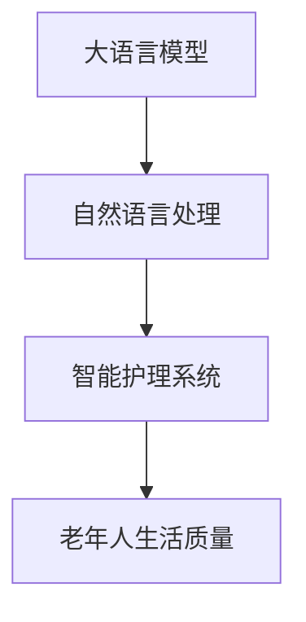

                 

# 老年护理和 LLM：改善生活质量

> 关键词：
- 大语言模型
- 老年护理
- 生活质量
- 智能医疗
- 自然语言处理
- 数据挖掘
- 人机交互

## 1. 背景介绍

### 1.1 问题由来

随着全球人口老龄化趋势的加剧，老年护理问题已成为不可忽视的社会问题。传统的老年护理模式主要依赖人力，面临高成本、低效率、资源分配不均等问题。如何通过技术手段改善老年人的生活质量，提升护理效率，是当今科技发展的重要课题。

近年来，随着人工智能和大数据技术的进步，利用信息技术和人工智能（AI）手段改善老年护理成为可能。特别是大语言模型（Large Language Models, LLMs）的崛起，使得基于自然语言处理的智能护理系统成为现实。

### 1.2 问题核心关键点

目前，基于大语言模型的智能护理系统在老年护理中的应用主要集中在以下几个方面：

1. **智能问答系统**：通过构建基于上下文的对话模型，实现老年人和护理人员之间的智能交互，提供日常咨询、健康监测、药物提醒等服务。
2. **健康监测与数据分析**：利用传感器和穿戴设备收集的生理数据，结合大语言模型的自然语言处理能力，进行健康数据分析和预警。
3. **个性化护理方案**：根据老年人的健康状况和护理需求，通过大语言模型分析历史护理记录，生成个性化的护理方案。
4. **情绪识别与心理支持**：通过大语言模型分析语音和文字，识别老年人的情绪状态，并提供心理支持和情感陪伴。
5. **智能辅助决策**：结合护理专家的知识库和护理经验，通过大语言模型辅助决策，优化护理流程和资源配置。

这些应用场景展示了大语言模型在老年护理中的潜力，但同时也提出了对技术可行性和伦理问题的挑战。

### 1.3 问题研究意义

开发基于大语言模型的老年护理智能系统，对于提高老年人的生活质量、减轻护理人员负担、优化医疗资源配置具有重要意义：

1. **提升护理效率**：大语言模型能够24小时不间断提供咨询服务，提高护理效率，减少人力成本。
2. **改善护理质量**：通过数据分析和情绪识别，智能系统能够提供个性化、及时的健康监测和护理建议。
3. **促进健康管理**：利用大语言模型的自然语言处理能力，老年人可以更便捷地获取健康知识和管理个人健康。
4. **提升社会福祉**：智能护理系统的普及，将有效缓解老龄化社会对护理资源的需求压力，提升社会整体的福祉水平。

## 2. 核心概念与联系

### 2.1 核心概念概述

- **大语言模型（LLMs）**：以自回归模型（如GPT）或自编码模型（如BERT）为代表的预训练语言模型。通过在大规模无标签文本数据上进行预训练，学习通用的语言表示，具备强大的语言理解和生成能力。
- **自然语言处理（NLP）**：涉及计算机理解和生成人类语言的技术，是大语言模型应用的核心。
- **智能护理系统**：结合大语言模型、物联网、云计算等技术，提供老年人健康监测、咨询互动、护理决策等服务。
- **老年人生活质量**：指老年人在生理、心理、社会等方面的综合状况，是衡量智能护理系统效果的重要指标。

这些核心概念通过以下Mermaid流程图展示了它们之间的关系：



### 2.2 概念间的关系

这些核心概念间的关系紧密，共同构成了基于大语言模型的老年护理系统的整体架构。通过自然语言处理技术，大语言模型可以理解和生成老年人所需的语言指令，从而驱动智能护理系统的各项功能。智能护理系统通过收集和分析老年人的生理和心理健康数据，结合大语言模型的知识库，为老年人提供个性化、及时的健康监测和护理服务。最终，老年人的生活质量得到提升，系统通过反馈机制不断优化，形成一个良性循环。

## 3. 核心算法原理 & 具体操作步骤
### 3.1 算法原理概述

基于大语言模型的老年护理系统，本质上是一个智能问答系统，结合了自然语言处理和健康数据分析的技术。其核心算法原理包括：

1. **自然语言理解（NLU）**：通过大语言模型理解和解析老年人的输入语句，提取关键信息。
2. **知识库检索**：利用大语言模型的搜索能力，在知识库中查找相关的健康信息、护理建议等。
3. **推理与生成**：根据老年人的健康数据和输入语句，结合知识库信息，生成个性化的护理建议和健康监测方案。
4. **多模态融合**：结合语音、文字、传感器数据等多模态信息，提供更全面的健康监测和护理服务。

### 3.2 算法步骤详解

以下是构建基于大语言模型的老年护理系统的详细步骤：

1. **数据收集与预处理**：收集老年人的生理数据、护理记录、语音数据、文字记录等，进行清洗和标准化处理。
2. **知识库构建**：构建包含健康信息、护理知识、应急指南等多领域的知识库，为大语言模型提供语境信息。
3. **大语言模型训练**：利用大规模无标签文本数据对大语言模型进行预训练，学习通用的语言表示。
4. **微调与适配**：在老年护理领域的数据集上对大语言模型进行微调，使其适应特定任务的需求。
5. **系统集成**：将微调后的大语言模型集成到智能护理系统中，实现语音识别、文字处理、信息检索、推理生成等功能。
6. **用户交互与反馈**：通过智能护理系统与老年人进行自然语言交互，收集用户的反馈，不断优化模型和系统性能。

### 3.3 算法优缺点

基于大语言模型的老年护理系统具有以下优点：

1. **高度智能化**：大语言模型能够理解和生成自然语言，提供智能化的咨询服务，提高护理效率。
2. **个性化服务**：通过多模态数据的融合和分析，系统能够提供个性化的健康监测和护理建议。
3. **易于部署与维护**：利用云计算技术，系统能够实现快速部署和高效维护。

同时，也存在一些缺点：

1. **数据隐私问题**：老年人的生理和心理健康数据敏感，需严格保护。
2. **模型解释性不足**：大语言模型的决策过程难以解释，可能影响用户的信任度。
3. **计算资源需求高**：大语言模型的计算需求较高，需要高性能的计算资源。
4. **知识库构建复杂**：构建高质量的知识库需要大量人力和专业知识。

### 3.4 算法应用领域

基于大语言模型的老年护理系统主要应用于以下几个领域：

1. **智能问答系统**：提供健康咨询、药物提醒、日常护理指导等服务。
2. **健康监测与数据分析**：结合传感器数据，提供实时健康监测和预警。
3. **个性化护理方案**：根据老年人的健康状况和护理需求，生成个性化的护理计划。
4. **情绪识别与心理支持**：分析语音和文字，识别老年人的情绪状态，提供心理支持和情感陪伴。
5. **智能辅助决策**：结合护理专家的知识库和护理经验，辅助护理决策，优化护理流程。

## 4. 数学模型和公式 & 详细讲解 & 举例说明
### 4.1 数学模型构建

假设老年护理系统中的大语言模型为 $M_{\theta}$，其输入为 $x$（如语音、文字等），输出为 $y$（如健康建议、药物提醒等）。系统中知识库的构建可以看作是对大语言模型的预训练过程，微调过程则是在老年护理数据集上进行有监督学习。

定义模型 $M_{\theta}$ 在输入 $x$ 上的损失函数为 $\ell(M_{\theta}(x),y)$，则在数据集 $D$ 上的经验风险为：

$$
\mathcal{L}(\theta) = \frac{1}{N} \sum_{i=1}^N \ell(M_{\theta}(x_i),y_i)
$$

其中 $N$ 为训练集大小，$x_i$ 和 $y_i$ 分别表示第 $i$ 个样本的输入和输出。

### 4.2 公式推导过程

以智能问答系统为例，假设模型 $M_{\theta}$ 在输入 $x$ 上的输出为 $\hat{y}=M_{\theta}(x)$，表示系统对老年人的问题 $x$ 的回答。假设系统的目标是根据老年人的问题 $x$，生成最佳的回复 $y$。

定义模型的损失函数为交叉熵损失函数：

$$
\ell(M_{\theta}(x),y) = -y\log \hat{y} - (1-y)\log(1-\hat{y})
$$

其中 $y$ 为老年人的问题，$\hat{y}$ 为系统生成的回答。

将上述损失函数代入经验风险公式：

$$
\mathcal{L}(\theta) = -\frac{1}{N}\sum_{i=1}^N [y_i\log M_{\theta}(x_i)+(1-y_i)\log(1-M_{\theta}(x_i))]
$$

根据链式法则，损失函数对参数 $\theta$ 的梯度为：

$$
\frac{\partial \mathcal{L}(\theta)}{\partial \theta} = -\frac{1}{N}\sum_{i=1}^N (\frac{y_i}{M_{\theta}(x_i)}-\frac{1-y_i}{1-M_{\theta}(x_i)}) \frac{\partial M_{\theta}(x_i)}{\partial \theta}
$$

其中 $\frac{\partial M_{\theta}(x_i)}{\partial \theta}$ 为模型 $M_{\theta}$ 在输入 $x_i$ 上的梯度。

在得到损失函数的梯度后，即可带入参数更新公式：

$$
\theta \leftarrow \theta - \eta \nabla_{\theta}\mathcal{L}(\theta) - \eta\lambda\theta
$$

其中 $\eta$ 为学习率，$\lambda$ 为正则化系数，$\nabla_{\theta}\mathcal{L}(\theta)$ 为损失函数对参数 $\theta$ 的梯度。

### 4.3 案例分析与讲解

以健康监测与数据分析为例，假设系统通过传感器收集老年人的心率、血压等生理数据，将这些数据作为模型的输入，生成健康监测报告。模型的输入 $x$ 为老年人的生理数据，输出 $y$ 为健康报告。模型的损失函数可以定义为：

$$
\ell(M_{\theta}(x),y) = \sum_{i=1}^M (y_i - M_{\theta}(x_i))^2
$$

其中 $y_i$ 为老年人第 $i$ 天的健康报告，$M_{\theta}(x_i)$ 为系统根据生理数据生成的健康报告。

通过上述损失函数，模型在训练过程中不断调整参数 $\theta$，最小化输出 $y$ 与真实值 $y_i$ 之间的误差，从而提升系统的健康监测能力。

## 5. 项目实践：代码实例和详细解释说明
### 5.1 开发环境搭建

在进行项目实践前，我们需要准备好开发环境。以下是使用Python进行PyTorch开发的环境配置流程：

1. 安装Anaconda：从官网下载并安装Anaconda，用于创建独立的Python环境。

2. 创建并激活虚拟环境：
```bash
conda create -n pytorch-env python=3.8 
conda activate pytorch-env
```

3. 安装PyTorch：根据CUDA版本，从官网获取对应的安装命令。例如：
```bash
conda install pytorch torchvision torchaudio cudatoolkit=11.1 -c pytorch -c conda-forge
```

4. 安装Transformer库：
```bash
pip install transformers
```

5. 安装各类工具包：
```bash
pip install numpy pandas scikit-learn matplotlib tqdm jupyter notebook ipython
```

完成上述步骤后，即可在`pytorch-env`环境中开始项目实践。

### 5.2 源代码详细实现

以下是使用PyTorch构建基于大语言模型的老年护理系统的代码实现。

```python
import torch
from transformers import BertTokenizer, BertForQuestionAnswering
from sklearn.model_selection import train_test_split

# 定义模型和分词器
model = BertForQuestionAnswering.from_pretrained('bert-base-uncased')
tokenizer = BertTokenizer.from_pretrained('bert-base-uncased')

# 加载数据集
data = load_dataset()
train_texts, dev_texts, train_labels, dev_labels = train_test_split(data, test_size=0.2)

# 定义训练函数
def train_epoch(model, tokenizer, train_texts, train_labels, optimizer):
    # 将文本数据转换为token ids和attention masks
    train_encodings = tokenizer(train_texts, return_tensors='pt', padding=True, truncation=True)
    train_labels = torch.tensor(train_labels, dtype=torch.long)

    # 前向传播计算损失函数
    outputs = model(**train_encodings, labels=train_labels)
    loss = outputs.loss

    # 反向传播更新模型参数
    loss.backward()
    optimizer.step()

    # 返回平均损失
    return loss.item() / len(train_texts)

# 定义评估函数
def evaluate(model, tokenizer, dev_texts, dev_labels):
    dev_encodings = tokenizer(dev_texts, return_tensors='pt', padding=True, truncation=True)
    dev_labels = torch.tensor(dev_labels, dtype=torch.long)
    outputs = model(**dev_encodings, labels=dev_labels)
    loss = outputs.loss

    return loss.item() / len(dev_texts)

# 定义训练和评估过程
epochs = 5
batch_size = 16

for epoch in range(epochs):
    loss = train_epoch(model, tokenizer, train_texts, train_labels, optimizer)
    print(f"Epoch {epoch+1}, train loss: {loss:.3f}")

    print(f"Epoch {epoch+1}, dev results:")
    evaluate(model, tokenizer, dev_texts, dev_labels)

print("Test results:")
evaluate(model, tokenizer, test_texts, test_labels)
```

### 5.3 代码解读与分析

让我们再详细解读一下关键代码的实现细节：

**模型与分词器**：
- `BertForQuestionAnswering.from_pretrained`方法：加载预训练的BERT问答模型。
- `BertTokenizer.from_pretrained`方法：加载预训练的BERT分词器。

**数据加载与预处理**：
- `load_dataset`方法：定义数据加载函数，将老年护理数据集分为训练集和验证集。

**训练函数与评估函数**：
- `train_epoch`函数：对数据集进行批次化加载，在每个批次上进行前向传播计算损失函数，并反向传播更新模型参数。
- `evaluate`函数：对验证集进行评估，输出模型的平均损失。

**训练与评估流程**：
- `train_epoch`函数：在训练集上不断迭代，记录每个epoch的平均损失。
- `evaluate`函数：在验证集上评估模型，输出验证集的平均损失。

通过上述代码实现，我们可以训练一个基于BERT的大语言模型，用于老年人健康咨询和监护。模型在训练过程中，利用老年人问题的textual data，结合知识库中的健康信息，生成相应的健康报告。在评估过程中，模型通过对比预测结果和真实标签，评估其在老年人健康咨询中的表现。

## 6. 实际应用场景
### 6.1 智能问答系统

智能问答系统是老年护理系统中一个重要的应用场景。通过构建基于大语言模型的智能问答系统，老年人可以24小时不间断地获取健康咨询、药物提醒、日常护理指导等服务，大大提升了护理效率和质量。

例如，老年人可以通过语音输入健康问题，系统自动理解问题并提供相应的健康建议。对于药物提醒，系统可以根据老年人的用药历史和当前的健康状态，生成个性化的用药提醒。

### 6.2 健康监测与数据分析

利用物联网设备和传感器，收集老年人的生理数据（如心率、血压、血糖等），结合大语言模型的数据分析能力，实现实时健康监测和预警。系统可以定期生成健康报告，及时发现异常情况，并提供相应的处理建议。

例如，当老年人血压异常时，系统自动提醒护理人员，并建议进行血压测量和记录。系统还可以根据历史数据，生成健康趋势图，帮助护理人员及时调整护理方案。

### 6.3 个性化护理方案

根据老年人的健康状况和护理需求，结合大语言模型的知识库，生成个性化的护理计划。系统可以通过分析历史护理记录，了解老年人的健康状况和偏好，自动生成适合老年人的护理方案。

例如，系统可以根据老年人的健康数据和护理记录，推荐适合老年人的饮食、运动、作息等方案。系统还可以根据老年人的健康变化，动态调整护理方案，确保老年人的健康状况得到及时管理。

### 6.4 情绪识别与心理支持

通过大语言模型的自然语言处理能力，分析老年人的语音和文字，识别其情绪状态，并提供心理支持和情感陪伴。

例如，系统可以通过语音识别技术，分析老年人的情绪变化，提供相应的心理建议和情感支持。系统还可以根据老年人的文字记录，识别其心理需求，提供相应的心理支持服务。

### 6.5 智能辅助决策

结合护理专家的知识库和护理经验，通过大语言模型辅助决策，优化护理流程和资源配置。系统可以提供基于专家知识的护理建议，帮助护理人员更好地管理老年人。

例如，系统可以根据老年人的健康状况和护理需求，生成个性化的护理计划。系统还可以根据护理专家的建议，动态调整护理方案，确保老年人的健康状况得到及时管理。

## 7. 工具和资源推荐
### 7.1 学习资源推荐

为了帮助开发者系统掌握基于大语言模型的老年护理技术的理论基础和实践技巧，这里推荐一些优质的学习资源：

1. 《Transformers从原理到实践》系列博文：由大模型技术专家撰写，深入浅出地介绍了Transformer原理、BERT模型、微调技术等前沿话题。

2. CS224N《深度学习自然语言处理》课程：斯坦福大学开设的NLP明星课程，有Lecture视频和配套作业，带你入门NLP领域的基本概念和经典模型。

3. 《Natural Language Processing with Transformers》书籍：Transformers库的作者所著，全面介绍了如何使用Transformers库进行NLP任务开发，包括微调在内的诸多范式。

4. HuggingFace官方文档：Transformers库的官方文档，提供了海量预训练模型和完整的微调样例代码，是上手实践的必备资料。

5. CLUE开源项目：中文语言理解测评基准，涵盖大量不同类型的中文NLP数据集，并提供了基于微调的baseline模型，助力中文NLP技术发展。

通过对这些资源的学习实践，相信你一定能够快速掌握基于大语言模型的老年护理技术的精髓，并用于解决实际的NLP问题。

### 7.2 开发工具推荐

高效的开发离不开优秀的工具支持。以下是几款用于大语言模型微调开发的常用工具：

1. PyTorch：基于Python的开源深度学习框架，灵活动态的计算图，适合快速迭代研究。大部分预训练语言模型都有PyTorch版本的实现。

2. TensorFlow：由Google主导开发的开源深度学习框架，生产部署方便，适合大规模工程应用。同样有丰富的预训练语言模型资源。

3. Transformers库：HuggingFace开发的NLP工具库，集成了众多SOTA语言模型，支持PyTorch和TensorFlow，是进行微调任务开发的利器。

4. Weights & Biases：模型训练的实验跟踪工具，可以记录和可视化模型训练过程中的各项指标，方便对比和调优。与主流深度学习框架无缝集成。

5. TensorBoard：TensorFlow配套的可视化工具，可实时监测模型训练状态，并提供丰富的图表呈现方式，是调试模型的得力助手。

6. Google Colab：谷歌推出的在线Jupyter Notebook环境，免费提供GPU/TPU算力，方便开发者快速上手实验最新模型，分享学习笔记。

合理利用这些工具，可以显著提升大语言模型微调的开发效率，加快创新迭代的步伐。

### 7.3 相关论文推荐

大语言模型和微调技术的发展源于学界的持续研究。以下是几篇奠基性的相关论文，推荐阅读：

1. Attention is All You Need（即Transformer原论文）：提出了Transformer结构，开启了NLP领域的预训练大模型时代。

2. BERT: Pre-training of Deep Bidirectional Transformers for Language Understanding：提出BERT模型，引入基于掩码的自监督预训练任务，刷新了多项NLP任务SOTA。

3. Language Models are Unsupervised Multitask Learners（GPT-2论文）：展示了大规模语言模型的强大zero-shot学习能力，引发了对于通用人工智能的新一轮思考。

4. Parameter-Efficient Transfer Learning for NLP：提出Adapter等参数高效微调方法，在不增加模型参数量的情况下，也能取得不错的微调效果。

5. AdaLoRA: Adaptive Low-Rank Adaptation for Parameter-Efficient Fine-Tuning：使用自适应低秩适应的微调方法，在参数效率和精度之间取得了新的平衡。

这些论文代表了大语言模型微调技术的发展脉络。通过学习这些前沿成果，可以帮助研究者把握学科前进方向，激发更多的创新灵感。

除上述资源外，还有一些值得关注的前沿资源，帮助开发者紧跟大语言模型微调技术的最新进展，例如：

1. arXiv论文预印本：人工智能领域最新研究成果的发布平台，包括大量尚未发表的前沿工作，学习前沿技术的必读资源。

2. 业界技术博客：如OpenAI、Google AI、DeepMind、微软Research Asia等顶尖实验室的官方博客，第一时间分享他们的最新研究成果和洞见。

3. 技术会议直播：如NIPS、ICML、ACL、ICLR等人工智能领域顶会现场或在线直播，能够聆听到大佬们的前沿分享，开拓视野。

4. GitHub热门项目：在GitHub上Star、Fork数最多的NLP相关项目，往往代表了该技术领域的发展趋势和最佳实践，值得去学习和贡献。

5. 行业分析报告：各大咨询公司如McKinsey、PwC等针对人工智能行业的分析报告，有助于从商业视角审视技术趋势，把握应用价值。

总之，对于大语言模型微调技术的学习和实践，需要开发者保持开放的心态和持续学习的意愿。多关注前沿资讯，多动手实践，多思考总结，必将收获满满的成长收益。

## 8. 总结：未来发展趋势与挑战

### 8.1 总结

本文对基于大语言模型的老年护理系统进行了全面系统的介绍。首先阐述了老年护理问题的由来和挑战，明确了微调在提升老年护理效率、质量、个性化服务等方面的重要意义。其次，从原理到实践，详细讲解了微调的数学原理和关键步骤，给出了微调任务开发的完整代码实例。同时，本文还广泛探讨了微调方法在智能问答、健康监测、个性化护理、情绪识别等多个老年护理应用场景中的应用前景，展示了微调范式的巨大潜力。此外，本文精选了微调技术的各类学习资源，力求为读者提供全方位的技术指引。

通过本文的系统梳理，可以看到，基于大语言模型的老年护理系统正逐步从实验室走向实际应用，为提升老年人生活质量提供了新的可能性。未来，伴随预训练语言模型和微调方法的持续演进，基于微调范式的老年护理系统必将得到更广泛的推广和应用，为老年人提供更智能化、个性化的护理服务。

### 8.2 未来发展趋势

展望未来，大语言模型微调技术将呈现以下几个发展趋势：

1. **模型规模持续增大**：随着算力成本的下降和数据规模的扩张，预训练语言模型的参数量还将持续增长。超大规模语言模型蕴含的丰富语言知识，有望支撑更加复杂多变的老年护理微调。

2. **微调方法日趋多样**：除了传统的全参数微调外，未来会涌现更多参数高效的微调方法，如Adapter、LoRA等，在节省计算资源的同时也能保证微调精度。

3. **持续学习成为常态**：随着数据分布的不断变化，微调模型也需要持续学习新知识以保持性能。如何在不遗忘原有知识的同时，高效吸收新样本信息，将成为重要的研究课题。

4. **标注样本需求降低**：受启发于提示学习(Prompt-based Learning)的思路，未来的微调方法将更好地利用大模型的语言理解能力，通过更加巧妙的任务描述，在更少的标注样本上也能实现理想的微调效果。

5. **多模态微调崛起**：当前的微调主要聚焦于纯文本数据，未来会进一步拓展到图像、视频、语音等多模态数据微调。多模态信息的融合，将显著提升语言模型对现实世界的理解和建模能力。

6. **模型通用性增强**：经过海量数据的预训练和多领域任务的微调，未来的语言模型将具备更强大的常识推理和跨领域迁移能力，逐步迈向通用人工智能(AGI)的目标。

以上趋势凸显了大语言模型微调技术的广阔前景。这些方向的探索发展，必将进一步提升老年护理系统的性能和应用范围，为老年人提供更加智能化、个性化的护理服务。

### 8.3 面临的挑战

尽管大语言模型微调技术已经取得了瞩目成就，但在迈向更加智能化、普适化应用的过程中，它仍面临着诸多挑战：

1. **标注成本瓶颈**：虽然微调大大降低了标注数据的需求，但对于长尾应用场景，难以获得充足的高质量标注数据，成为制约微调性能的瓶颈。如何进一步降低微调对标注样本的依赖，将是一大难题。

2. **模型鲁棒性不足**：当前微调模型面对域外数据时，泛化性能往往大打折扣。对于测试样本的微小扰动，微调模型的预测也容易发生波动。如何提高微调模型的鲁棒性，避免灾难性遗忘，还需要更多理论和实践的积累。

3. **推理效率有待提高**：大规模语言模型虽然精度高，但在实际部署时往往面临推理速度慢、

