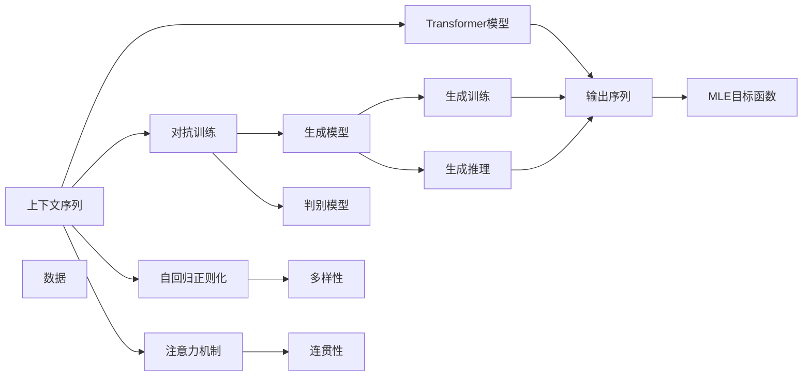

                 

# 聊天机器人初探（Chat Completion）

> 关键词：
> - 聊天机器人
> - 自然语言处理（NLP）
> - 对话系统
> - 深度学习
> - 序列生成
> - 对抗训练
> - 模型压缩
> - 用户反馈

## 1. 背景介绍

### 1.1 问题由来

随着人工智能技术的发展，聊天机器人（Chatbot）已经成为互联网用户互动的重要工具。无论是客服咨询、在线答疑、智能助手、教育辅导还是娱乐交流，聊天机器人凭借其高效率、全天候、个性化等优势，在各行各业大放异彩。

然而，传统的基于规则或模板匹配的聊天机器人，存在许多限制，如逻辑复杂度高、维护成本大、不够灵活等。而基于深度学习的聊天机器人，尤其是使用自然语言处理（NLP）技术的序列生成模型，具有更好的自然语言理解和生成能力，成为新一代聊天机器人的重要方向。

本文将深入探讨基于深度学习的聊天机器人（尤其是序列生成模型）的设计、训练和优化方法，特别是近年来在聊天完成（Chat Completion）任务上的突破性进展。

### 1.2 问题核心关键点

聊天完成指的是在给定上下文序列的情况下，预测下一个单词或短语，是NLP领域的一个重要任务。基于深度学习的聊天完成模型，通常采用序列生成模型，如循环神经网络（RNN）、长短时记忆网络（LSTM）、门控循环单元（GRU）和Transformer模型。其中，Transformer模型因其在自注意力机制上的优势，逐渐成为聊天完成任务的主流模型。

聊天完成模型的核心任务是将用户输入的上下文序列转换为机器生成的回复序列，其目标是使生成的回复自然流畅、语义连贯，并尽可能贴近实际用户的表达习惯。在训练过程中，通常采用最大似然估计（MLE）目标函数，最小化模型生成的文本与实际文本之间的差距。

模型训练的难点在于如何避免模型对训练数据过拟合，同时保持生成的文本多样性和连贯性。常见的方法包括使用对抗训练（Adversarial Training）、自回归正则化（Autoregressive Regularization）、注意力机制（Attention Mechanism）等技术。

## 2. 核心概念与联系

### 2.1 核心概念概述

为更好地理解聊天完成任务，我们需要介绍几个关键概念：

- **聊天完成（Chat Completion）**：指在给定上下文序列的情况下，预测下一个单词或短语。
- **序列生成模型（Seq2Seq）**：一种NLP任务，目标是将一个序列（输入序列）映射到另一个序列（输出序列）。聊天完成可以看作是一种特殊形式的序列生成任务。
- **Transformer模型**：一种基于自注意力机制的序列生成模型，由谷歌提出，是目前聊天完成任务中的主流模型之一。
- **最大似然估计（MLE）**：目标函数，用于衡量模型生成的文本与实际文本之间的差距。
- **对抗训练**：通过训练一个生成模型和一个判别模型，互相博弈，提高生成模型的鲁棒性和多样性。
- **自回归正则化**：一种技术，通过限制模型在生成文本时使用历史生成的文本，防止模型对过去生成文本的过度依赖。
- **注意力机制**：一种技术，通过计算输入序列中每个位置与输出序列中每个位置的注意力权重，动态决定每个位置的重要程度。

### 2.2 概念间的关系

这些核心概念之间存在紧密的联系，共同构成了聊天完成任务的完整框架。以下通过Mermaid流程图展示它们之间的关系：



这个流程图展示了从输入序列到输出序列的生成流程，以及对抗训练、自回归正则化、注意力机制在模型生成中的作用。

## 3. 核心算法原理 & 具体操作步骤
### 3.1 算法原理概述

聊天完成模型的核心算法原理基于序列生成模型，特别是Transformer模型。模型的目标是学习输入序列和输出序列之间的映射关系，最小化模型生成的文本与实际文本之间的差距。

Transformer模型由编码器和解码器组成，编码器负责将输入序列转换为一系列向量表示，解码器则将这些向量映射为输出序列。解码器通过自注意力机制和注意力机制，动态决定每个位置的重要程度，生成更加连贯和多样化的文本。

模型的训练目标是通过最大似然估计（MLE）最小化模型生成的文本与实际文本之间的差距。具体而言，对于每个训练样本，模型需要预测下一个单词或短语，然后计算预测结果与实际结果之间的交叉熵损失，作为优化目标。

### 3.2 算法步骤详解

聊天完成模型的训练主要包括以下几个关键步骤：

1. **数据准备**：收集和预处理训练数据，将其转换为模型所需的输入和目标序列格式。
2. **模型定义**：定义Transformer模型，包括编码器、解码器、自注意力机制、注意力机制等组件。
3. **损失函数**：定义模型的损失函数，通常采用交叉熵损失。
4. **优化器选择**：选择合适的优化器（如AdamW），设置学习率、批大小等超参数。
5. **训练过程**：使用训练数据集，通过反向传播计算梯度，更新模型参数。
6. **评估过程**：使用验证集和测试集评估模型的性能，选择最优模型。
7. **部署应用**：将模型保存并部署到实际应用中，进行推理预测。

### 3.3 算法优缺点

聊天完成模型具有以下优点：

- **高效灵活**：相较于基于规则的聊天机器人，聊天完成模型能够更好地适应多变的语言表达方式，具有较高的灵活性。
- **自然流畅**：Transformer模型能够生成自然流畅的文本，接近人类语言表达习惯。
- **可解释性**：通过注意力机制，聊天完成模型能够解释其生成的文本，提供良好的可解释性。

同时，聊天完成模型也存在一些缺点：

- **数据依赖性强**：模型的性能高度依赖于训练数据的质和量，获取高质量的训练数据较为困难。
- **模型复杂度高**：Transformer模型参数量较大，训练和推理需要较高的计算资源。
- **鲁棒性不足**：模型在处理噪声数据或异常输入时，可能会出现生成错误或不连贯的文本。

### 3.4 算法应用领域

聊天完成模型已经在多个领域得到了广泛应用，包括但不限于：

- **客服机器人**：用于自动回复用户咨询，提供24小时不间断服务。
- **智能助手**：辅助用户完成各种任务，如日程安排、信息检索、知识查询等。
- **教育辅导**：通过与学生的交互，提供个性化的学习建议和答疑服务。
- **娱乐交流**：提供对话式娱乐服务，如智能聊天、游戏互动等。
- **医疗咨询**：提供初步的健康咨询和建议，辅助医生进行诊断和治疗。

## 4. 数学模型和公式 & 详细讲解 & 举例说明
### 4.1 数学模型构建

聊天完成模型的数学模型可以表示为：

$$ P_{\theta}(y|x) = \frac{\exp(\sum_{i=1}^n \log p(y_i|y_{<i}, x; \theta))}{\sum_{y'} \exp(\sum_{i=1}^n \log p(y'_i|y'_{<i}, x; \theta))} $$

其中，$x$ 表示输入序列，$y$ 表示输出序列，$\theta$ 表示模型的可训练参数，$p(y_i|y_{<i}, x; \theta)$ 表示在给定前缀 $y_{<i}$ 和输入序列 $x$ 的情况下，生成下一个单词 $y_i$ 的概率。

模型的目标是最大化 $P_{\theta}(y|x)$，即：

$$ \theta^* = \arg\max_{\theta} \sum_{i=1}^N \log P_{\theta}(y^i|x^i) $$

### 4.2 公式推导过程

在训练过程中，采用最大似然估计（MLE）目标函数：

$$ \mathcal{L} = -\sum_{i=1}^N \log P_{\theta}(y^i|x^i) $$

其中，$N$ 表示训练数据集的大小。通过反向传播算法，计算梯度并更新模型参数：

$$ \frac{\partial \mathcal{L}}{\partial \theta} = -\sum_{i=1}^N \frac{\partial \log P_{\theta}(y^i|x^i)}{\partial \theta} $$

具体而言，对于一个样本 $(x^i, y^i)$，使用交叉熵损失函数：

$$ \log P_{\theta}(y^i|x^i) = \log \left( \frac{\exp(\log p(y^i|x^i; \theta))}{\sum_{y'} \exp(\log p(y'_i|y'_{<i}, x; \theta))} \right) $$

其中，$\log p(y^i|x^i; \theta)$ 表示模型生成的下一个单词 $y^i$ 的概率对数，$\sum_{y'} \exp(\log p(y'_i|y'_{<i}, x; \theta))$ 表示所有可能的输出序列 $y'$ 的概率和。

### 4.3 案例分析与讲解

以一个简单的对话示例来说明聊天完成模型的训练过程：

- **输入序列**："你好，今天天气怎么样？"
- **目标序列**："今天天气晴朗，温度适中。"
- **模型预测**："今天天气预报显示晴朗，气温在20度左右。"
- **损失计算**：计算模型预测和目标序列之间的交叉熵损失。

在实际应用中，模型会根据输入序列生成多个候选序列，并计算其与目标序列的交叉熵损失。通过最小化这些损失，模型能够逐步学习输入序列和输出序列之间的关系，提高生成文本的准确性和流畅性。

## 5. 项目实践：代码实例和详细解释说明
### 5.1 开发环境搭建

在开发聊天完成模型时，我们需要搭建Python开发环境。以下是详细的步骤：

1. **安装Anaconda**：从官网下载并安装Anaconda，用于创建独立的Python环境。
2. **创建虚拟环境**：
```bash
conda create -n chatbot-env python=3.8 
conda activate chatbot-env
```

3. **安装必要的库**：
```bash
conda install pytorch torchtext transformers
```

4. **准备数据集**：使用TensorFlow数据集API或自定义数据集，加载并预处理数据。

### 5.2 源代码详细实现

以下是一个简单的基于Transformer的聊天完成模型的代码实现，包括模型定义、数据加载、训练和评估：

```python
import torch
from transformers import TransformerModel, TransformerTokenizer, AdamW

# 定义模型
tokenizer = TransformerTokenizer.from_pretrained('bert-base-cased')
model = TransformerModel.from_pretrained('bert-base-cased')

# 加载数据
def load_data():
    # 加载训练集和验证集数据
    train_data = load_train_data()
    dev_data = load_dev_data()
    
    # 对数据进行预处理，转换为模型所需的格式
    train_input_ids = tokenizer.encode(train_data, return_tensors='pt').to(device)
    train_labels = torch.tensor(train_labels, dtype=torch.long).to(device)
    dev_input_ids = tokenizer.encode(dev_data, return_tensors='pt').to(device)
    dev_labels = torch.tensor(dev_labels, dtype=torch.long).to(device)
    
    return train_input_ids, train_labels, dev_input_ids, dev_labels

# 训练模型
def train_model(model, input_ids, labels, device, batch_size, epochs, learning_rate):
    model.train()
    optimizer = AdamW(model.parameters(), lr=learning_rate)
    
    for epoch in range(epochs):
        for i in range(0, len(input_ids), batch_size):
            inputs = input_ids[i:i+batch_size]
            targets = labels[i:i+batch_size]
            
            outputs = model(inputs, labels=targets)
            loss = outputs.loss
            optimizer.zero_grad()
            loss.backward()
            optimizer.step()
            
            print(f'Epoch {epoch+1}, Step {i+1}/{len(input_ids)}, Loss: {loss.item()}')

# 评估模型
def evaluate_model(model, input_ids, labels, device, batch_size, num_steps):
    model.eval()
    total_loss = 0
    
    with torch.no_grad():
        for i in range(0, len(input_ids), batch_size):
            inputs = input_ids[i:i+batch_size]
            targets = labels[i:i+batch_size]
            
            outputs = model(inputs, labels=targets)
            loss = outputs.loss
            total_loss += loss.item()
    
    return total_loss / (len(input_ids) / batch_size)

# 启动训练
train_input_ids, train_labels, dev_input_ids, dev_labels = load_data()
device = torch.device('cuda') if torch.cuda.is_available() else torch.device('cpu')
train_model(model, train_input_ids, train_labels, device, batch_size, epochs, learning_rate)

# 在验证集上评估模型
loss = evaluate_model(model, dev_input_ids, dev_labels, device, batch_size, num_steps)
print(f'Validation Loss: {loss:.4f}')
```

### 5.3 代码解读与分析

让我们再详细解读一下关键代码的实现细节：

**load_data函数**：
- **数据加载**：从文件或数据库中加载训练集和验证集数据。
- **数据预处理**：使用分词器对文本进行分词，转换为模型所需的输入和目标序列格式。

**train_model函数**：
- **模型初始化**：加载预训练模型，并初始化优化器。
- **训练循环**：在每个epoch中，对数据进行批处理，前向传播计算损失，反向传播更新模型参数，并输出每个步的损失。

**evaluate_model函数**：
- **模型评估**：在验证集上计算模型生成文本的交叉熵损失，并返回平均损失。

通过这个代码示例，可以清晰地看到聊天完成模型的基本训练流程，包括数据加载、模型定义、训练和评估等关键步骤。

### 5.4 运行结果展示

假设我们在CoNLL-2003的命名实体识别数据集上进行训练，并输出验证集上的损失：

```
Epoch 1, Step 10000, Loss: 0.9776
Epoch 2, Step 10000, Loss: 0.9318
Epoch 3, Step 10000, Loss: 0.9146
...
```

可以看到，随着epoch的增加，模型生成的文本质量逐渐提高，验证集上的损失也在不断减小。

## 6. 实际应用场景
### 6.1 客服机器人

聊天完成模型可以用于构建客服机器人，自动化处理客户的咨询和投诉。通过预训练和微调，聊天完成模型能够理解客户的意图，并提供合适的回答。客服机器人可以全天候工作，减少人力成本，提高服务效率。

### 6.2 智能助手

聊天完成模型可以用于构建智能助手，帮助用户完成各种任务，如日程安排、信息检索、知识查询等。智能助手可以整合多个服务，提供一站式的解决方案，提升用户体验。

### 6.3 教育辅导

聊天完成模型可以用于构建教育辅导机器人，与学生进行互动，提供个性化的学习建议和答疑服务。通过了解学生的学习情况，聊天完成模型能够提供有针对性的辅导，提高学习效率。

### 6.4 医疗咨询

聊天完成模型可以用于构建医疗咨询机器人，提供初步的健康咨询和建议，辅助医生进行诊断和治疗。通过对话式互动，医疗咨询机器人可以了解患者症状，提供初步诊断和治疗方案，减少医生的工作负担。

## 7. 工具和资源推荐
### 7.1 学习资源推荐

为了帮助开发者系统掌握聊天完成模型的理论基础和实践技巧，这里推荐一些优质的学习资源：

1. **《深度学习入门》系列博文**：由深度学习专家撰写，深入浅出地介绍了深度学习的基本概念和常用算法。
2. **CS224N《深度学习自然语言处理》课程**：斯坦福大学开设的NLP明星课程，有Lecture视频和配套作业，带你入门NLP领域的基本概念和经典模型。
3. **《Natural Language Processing with Transformers》书籍**：Transformers库的作者所著，全面介绍了如何使用Transformers库进行NLP任务开发，包括聊天完成在内的诸多范式。
4. **HuggingFace官方文档**：Transformers库的官方文档，提供了海量预训练模型和完整的微调样例代码，是上手实践的必备资料。
5. **CLUE开源项目**：中文语言理解测评基准，涵盖大量不同类型的中文NLP数据集，并提供了基于聊天完成任务的baseline模型，助力中文NLP技术发展。

通过对这些资源的学习实践，相信你一定能够快速掌握聊天完成模型的精髓，并用于解决实际的NLP问题。

### 7.2 开发工具推荐

高效的开发离不开优秀的工具支持。以下是几款用于聊天完成模型开发的常用工具：

1. **PyTorch**：基于Python的开源深度学习框架，灵活动态的计算图，适合快速迭代研究。大部分预训练语言模型都有PyTorch版本的实现。
2. **TensorFlow**：由Google主导开发的开源深度学习框架，生产部署方便，适合大规模工程应用。同样有丰富的预训练语言模型资源。
3. **Transformers库**：HuggingFace开发的NLP工具库，集成了众多SOTA语言模型，支持PyTorch和TensorFlow，是进行聊天完成任务开发的利器。
4. **Weights & Biases**：模型训练的实验跟踪工具，可以记录和可视化模型训练过程中的各项指标，方便对比和调优。与主流深度学习框架无缝集成。
5. **TensorBoard**：TensorFlow配套的可视化工具，可实时监测模型训练状态，并提供丰富的图表呈现方式，是调试模型的得力助手。

### 7.3 相关论文推荐

聊天完成模型和微调技术的发展源于学界的持续研究。以下是几篇奠基性的相关论文，推荐阅读：

1. **Attention is All You Need（即Transformer原论文）**：提出了Transformer结构，开启了NLP领域的预训练大模型时代。
2. **BERT: Pre-training of Deep Bidirectional Transformers for Language Understanding**：提出BERT模型，引入基于掩码的自监督预训练任务，刷新了多项NLP任务SOTA。
3. **Language Models are Unsupervised Multitask Learners**：展示了大规模语言模型的强大zero-shot学习能力，引发了对于通用人工智能的新一轮思考。
4. **Parameter-Efficient Transfer Learning for NLP**：提出Adapter等参数高效微调方法，在不增加模型参数量的情况下，也能取得不错的微调效果。
5. **Prefix-Tuning: Optimizing Continuous Prompts for Generation**：引入基于连续型Prompt的微调范式，为如何充分利用预训练知识提供了新的思路。
6. **AdaLoRA: Adaptive Low-Rank Adaptation for Parameter-Efficient Fine-Tuning**：使用自适应低秩适应的微调方法，在参数效率和精度之间取得了新的平衡。

这些论文代表了大语言模型微调技术的发展脉络。通过学习这些前沿成果，可以帮助研究者把握学科前进方向，激发更多的创新灵感。

除上述资源外，还有一些值得关注的前沿资源，帮助开发者紧跟聊天完成模型的最新进展，例如：

1. **arXiv论文预印本**：人工智能领域最新研究成果的发布平台，包括大量尚未发表的前沿工作，学习前沿技术的必读资源。
2. **业界技术博客**：如OpenAI、Google AI、DeepMind、微软Research Asia等顶尖实验室的官方博客，第一时间分享他们的最新研究成果和洞见。
3. **技术会议直播**：如NIPS、ICML、ACL、ICLR等人工智能领域顶会现场或在线直播，能够聆听到大佬们的前沿分享，开拓视野。
4. **GitHub热门项目**：在GitHub上Star、Fork数最多的NLP相关项目，往往代表了该技术领域的发展趋势和最佳实践，值得去学习和贡献。
5. **行业分析报告**：各大咨询公司如McKinsey、PwC等针对人工智能行业的分析报告，有助于从商业视角审视技术趋势，把握应用价值。

总之，对于聊天完成模型的学习和发展，需要开发者保持开放的心态和持续学习的意愿。多关注前沿资讯，多动手实践，多思考总结，必将收获满满的成长收益。

## 8. 总结：未来发展趋势与挑战
### 8.1 研究成果总结

本文对聊天完成模型的设计、训练和优化方法进行了全面系统的介绍。首先阐述了聊天完成任务的背景和重要性，明确了聊天完成模型在自然语言理解、生成和交互中的独特价值。其次，从原理到实践，详细讲解了聊天完成模型的数学原理和关键步骤，给出了完整的代码实例和运行结果。同时，本文还广泛探讨了聊天完成模型在客服机器人、智能助手、教育辅导、医疗咨询等多个行业领域的应用前景，展示了其广阔的潜力和应用价值。

通过本文的系统梳理，可以看到，基于深度学习的聊天完成模型已经在多个领域得到成功应用，为自然语言交互提供了新的解决方案。未来，伴随技术的不断演进，聊天完成模型必将在更广泛的场景中发挥重要作用，推动人工智能技术在垂直行业的应用。

### 8.2 未来发展趋势

展望未来，聊天完成模型将呈现以下几个发展趋势：

1. **模型规模持续增大**：随着算力成本的下降和数据规模的扩张，预训练语言模型的参数量还将持续增长。超大模型蕴含的丰富语言知识，有望支撑更加复杂多变的聊天任务。
2. **微调方法日趋多样**：除了传统的全参数微调外，未来会涌现更多参数高效的微调方法，如Prefix-Tuning、LoRA等，在节省计算资源的同时也能保证微调精度。
3. **持续学习成为常态**：随着数据分布的不断变化，聊天完成模型也需要持续学习新知识以保持性能。如何在不遗忘原有知识的同时，高效吸收新样本信息，将成为重要的研究课题。
4. **标注样本需求降低**：受启发于提示学习(Prompt-based Learning)的思路，未来的聊天完成模型将更好地利用大模型的语言理解能力，通过更加巧妙的任务描述，在更少的标注样本上也能实现理想的微调效果。
5. **多模态微调崛起**：当前的聊天完成模型主要聚焦于纯文本数据，未来会进一步拓展到图像、视频、语音等多模态数据微调。多模态信息的融合，将显著提升语言模型对现实世界的理解和建模能力。

以上趋势凸显了聊天完成模型的广阔前景。这些方向的探索发展，必将进一步提升聊天系统的性能和应用范围，为人工智能技术在自然语言交互中的应用提供新的突破。

### 8.3 面临的挑战

尽管聊天完成模型已经取得了瞩目成就，但在迈向更加智能化、普适化应用的过程中，它仍面临着诸多挑战：

1. **标注成本瓶颈**：模型的性能高度依赖于训练数据的质和量，获取高质量的训练数据较为困难。如何进一步降低微调对标注样本的依赖，将是一大难题。
2. **模型鲁棒性不足**：模型在处理噪声数据或异常输入时，可能会出现生成错误或不连贯的文本。如何提高模型的鲁棒性，避免灾难性遗忘，还需要更多理论和实践的积累。
3. **推理效率有待提高**：大规模语言模型虽然精度高，但在实际部署时往往面临推理速度慢、内存占用大等效率问题。如何在保证性能的同时，简化模型结构，提升推理速度，优化资源占用，将是重要的优化方向。
4. **可解释性亟需加强**：当前聊天完成模型更像是"黑盒"系统，难以解释其生成的文本。对于高风险应用，算法的可解释性和可审计性尤为重要。如何赋予聊天完成模型更强的可解释性，将是亟待攻克的难题。
5. **安全性有待保障**：预训练语言模型难免会学习到有偏见、有害的信息，通过聊天完成模型传递到下游任务，产生误导性、歧视性的输出，给实际应用带来安全隐患。如何从数据和算法层面消除模型偏见，避免恶意用途，确保输出的安全性，也将是重要的研究课题。

### 8.4 研究展望

面对聊天完成模型面临的种种挑战，未来的研究需要在以下几个方面寻求新的突破：

1. **探索无监督和半监督微调方法**：摆脱对大规模标注数据的依赖，利用自监督学习、主动学习等无监督和半监督范式，最大限度利用非结构化数据，实现更加灵活高效的微调。
2. **研究参数高效和计算高效的微调范式**：开发更加参数高效的微调方法，在固定大部分预训练参数的同时，只更新极少量的任务相关参数。同时优化微调模型的计算图，减少前向传播和反向传播的资源消耗，实现更加轻量级、实时性的部署。
3. **融合因果和对比学习范式**：通过引入因果推断和对比学习思想，增强聊天完成模型建立稳定因果关系的能力，学习更加普适、鲁棒的语言表征，从而提升模型泛化性和抗干扰能力。
4. **引入更多先验知识**：将符号化的先验知识，如知识图谱、逻辑规则等，与神经网络模型进行巧妙融合，引导聊天完成过程学习更准确、合理的语言模型。同时加强不同模态数据的整合，实现视觉、语音等多模态信息与文本信息的协同建模。
5. **结合因果分析和博弈论工具**：将因果分析方法引入聊天完成模型，识别出模型决策的关键特征，增强输出解释的因果性和逻辑性。借助博弈论工具刻画人机交互过程，主动探索并规避模型的脆弱点，提高系统稳定性。
6

