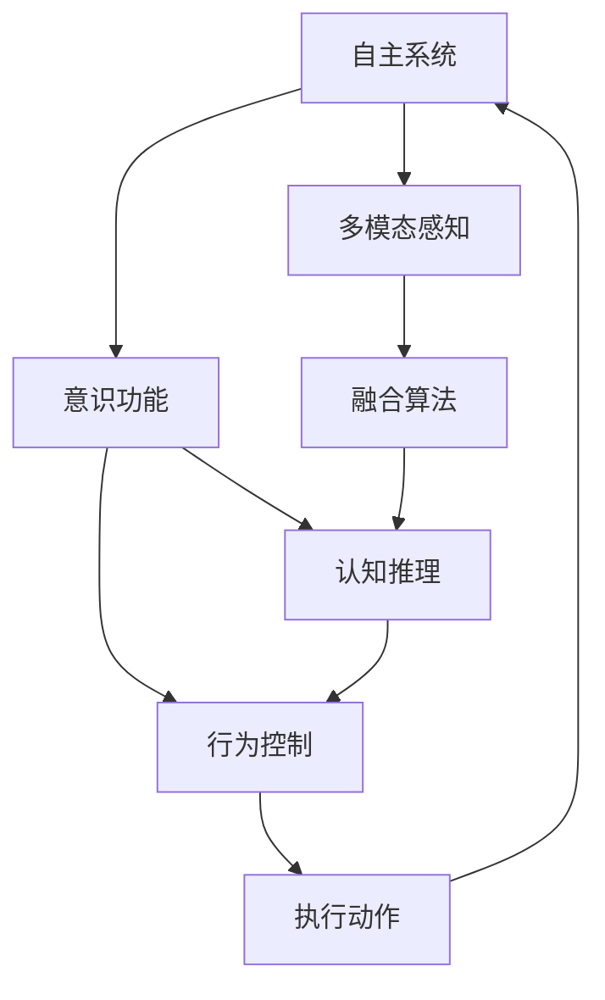
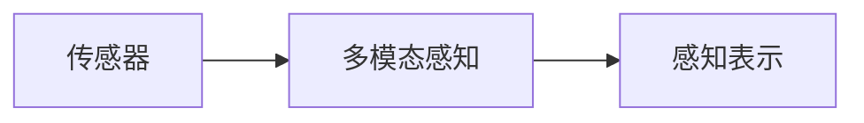
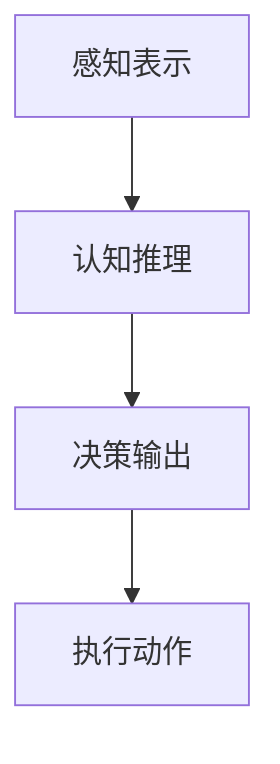
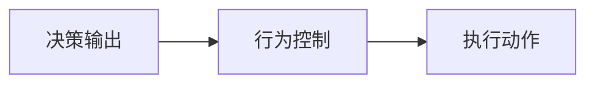
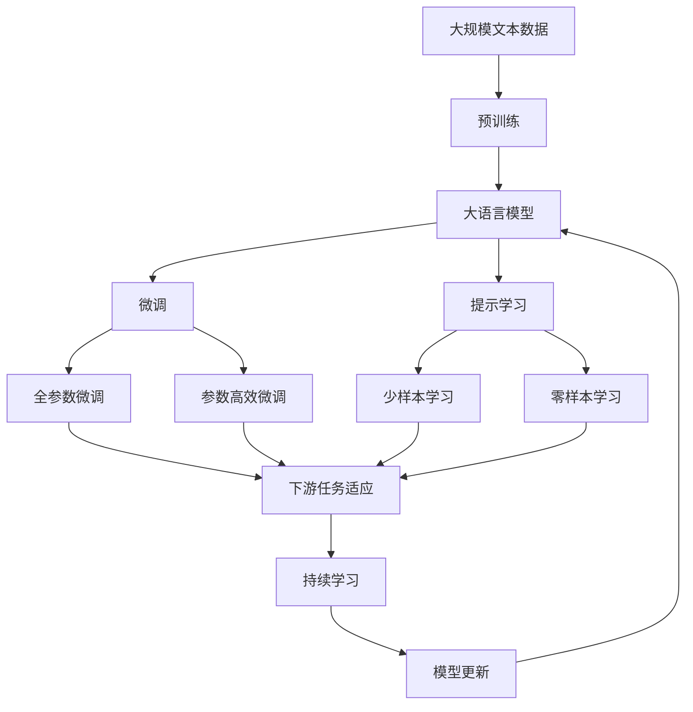

                 

# 自主系统如何管理意识功能

> 关键词：自主系统, 意识功能, 人工通用智能(AI), 神经网络, 多模态感知, 人机交互, 机器学习

## 1. 背景介绍

### 1.1 问题由来
自主系统（Autonomous Systems）是指能够在环境中自主执行复杂任务的智能系统，广泛应用于自动驾驶、机器人、无人机、智能家居等领域。这些系统通常由传感器、执行器、控制器和认知模块组成，通过多模态感知和决策算法，实现对环境的主动理解和响应。

然而，自主系统要真正具备“自主”能力，即能够在复杂环境中自主决策、应对意外情况和执行复杂任务，必须具备一定的意识功能。意识功能是指系统能够理解、感知、推理、决策和执行的能力，这种能力是实现自主决策的基础。

### 1.2 问题核心关键点
意识功能的关键在于理解自主系统的多模态感知、认知决策和执行控制机制。具体来说，需要解决以下几个核心问题：

1. **多模态感知融合**：将不同类型（视觉、听觉、触觉等）的传感器数据进行融合，生成统一的感知表示。
2. **认知推理能力**：利用机器学习算法，使系统能够从感知数据中提取特征、进行推理和决策。
3. **行为控制策略**：设计合适的控制策略，使系统能够根据环境变化和目标需求，自主调整行为和动作。
4. **意识状态管理**：构建一个意识模型，用于追踪和管理系统的意识状态，确保系统在决策过程中保持一致性和连续性。

### 1.3 问题研究意义
自主系统的意识功能研究具有重要的理论和实践意义：

1. **提升系统安全性**：通过理解意识状态，系统可以更好地应对意外情况和异常事件，提升决策的鲁棒性和安全性。
2. **增强系统适应性**：意识功能可以帮助系统更好地适应环境变化和复杂任务，提升系统的通用性和灵活性。
3. **促进人机交互**：通过模拟人类的意识机制，增强人机交互的自然性和流畅性，提升用户体验。
4. **推动技术进步**：意识功能的实现需要结合人工智能、计算机视觉、机器人学等多个领域的知识，推动相关技术的发展。

## 2. 核心概念与联系

### 2.1 核心概念概述

为更好地理解自主系统的意识功能，本节将介绍几个密切相关的核心概念：

- **自主系统（Autonomous Systems）**：能够在环境中自主执行复杂任务的智能系统，如自动驾驶汽车、无人机、机器人等。
- **意识功能（Conscious Function）**：系统能够理解、感知、推理、决策和执行的能力。
- **人工通用智能（Artificial General Intelligence, AGI）**：能够处理各种复杂任务，具有类似于人类的智能水平的系统。
- **神经网络（Neural Network）**：由大量神经元组成的网络结构，能够进行复杂的模式识别和决策。
- **多模态感知（Multimodal Perception）**：将不同类型（视觉、听觉、触觉等）的传感器数据进行融合，生成统一的感知表示。
- **人机交互（Human-Computer Interaction, HCI）**：人机之间的信息交换和交互，是自主系统中意识功能的重要组成部分。
- **机器学习（Machine Learning）**：利用数据和算法，使系统能够从经验中学习并优化性能。

这些核心概念之间的逻辑关系可以通过以下Mermaid流程图来展示：



这个流程图展示了一个典型自主系统的构成及其内部组件之间的关系：

1. 自主系统通过多模态感知获取环境信息。
2. 意识功能通过融合和推理算法，从感知数据中提取信息。
3. 行为控制策略根据认知推理结果，生成执行动作。
4. 执行动作通过传感器输出，再次反馈到感知系统，形成闭环。

### 2.2 概念间的关系

这些核心概念之间存在着紧密的联系，形成了自主系统意识功能实现的整体框架。下面我们通过几个Mermaid流程图来展示这些概念之间的关系。

#### 2.2.1 自主系统的感知机制



这个流程图展示了自主系统的感知机制。传感器采集环境信息，多模态感知算法将这些信息融合，生成统一的感知表示。

#### 2.2.2 意识功能的认知推理



这个流程图展示了意识功能的认知推理过程。感知表示经过认知推理，生成决策输出，再通过行为控制策略生成执行动作。

#### 2.2.3 行为控制的策略设计



这个流程图展示了行为控制的策略设计。决策输出通过行为控制策略生成执行动作。

### 2.3 核心概念的整体架构

最后，我们用一个综合的流程图来展示这些核心概念在大语言模型微调过程中的整体架构：



这个综合流程图展示了从预训练到微调，再到持续学习的完整过程。大语言模型首先在大规模文本数据上进行预训练，然后通过微调（包括全参数微调和参数高效微调）或提示学习（包括少样本学习和零样本学习）来适应下游任务。最后，通过持续学习技术，模型可以不断更新和适应新的任务和数据。 通过这些流程图，我们可以更清晰地理解自主系统意识功能实现过程中各个核心概念的关系和作用，为后续深入讨论具体的意识功能方法和技术奠定基础。

## 3. 核心算法原理 & 具体操作步骤
### 3.1 算法原理概述

自主系统的意识功能实现，本质上是一个基于多模态感知和认知推理的复杂系统。其核心思想是：通过融合多模态感知数据，生成统一的感知表示，然后利用机器学习算法进行认知推理，最终生成决策输出和执行动作。

形式化地，假设自主系统传感器采集的感知数据为 $X$，融合算法生成统一的感知表示为 $Z$，认知推理算法对 $Z$ 进行推理，输出决策 $Y$，行为控制策略根据 $Y$ 生成执行动作 $A$。

意识功能的优化目标是最小化决策输出 $Y$ 与真实标签 $T$ 之间的差距，即：

$$
\hat{Y}=\mathop{\arg\min}_{Y} \mathcal{L}(Y,T)
$$

其中 $\mathcal{L}$ 为针对任务设计的损失函数，用于衡量模型预测输出与真实标签之间的差异。常见的损失函数包括交叉熵损失、均方误差损失等。

通过梯度下降等优化算法，认知推理算法不断更新模型参数，最小化损失函数 $\mathcal{L}$，使得模型输出逼近真实标签。由于认知推理算法已经通过多模态感知和认知推理过程获得了丰富的语言知识，因此即便在小规模数据集上，也能较快收敛到理想的模型参数。

### 3.2 算法步骤详解

自主系统的意识功能实现一般包括以下几个关键步骤：

**Step 1: 准备多模态感知数据**
- 选择合适的传感器类型，如摄像头、激光雷达、麦克风等。
- 设计传感器布局和采集频率，确保数据覆盖范围和实时性。

**Step 2: 多模态感知数据融合**
- 选择合适的融合算法，如特征加权、时域对齐等，将不同类型（视觉、听觉、触觉等）的传感器数据进行融合，生成统一的感知表示。
- 将感知表示进行降维和特征提取，简化数据结构。

**Step 3: 认知推理**
- 选择合适的机器学习算法，如卷积神经网络（CNN）、循环神经网络（RNN）、Transformer等，建立认知推理模型。
- 在模型中集成多模态感知数据，进行特征提取和推理。
- 设置合适的损失函数和优化器，训练认知推理模型。

**Step 4: 行为控制策略设计**
- 设计合适的行为控制策略，如路径规划、避障、决策树等，使系统能够根据认知推理结果生成执行动作。
- 将认知推理结果与行为控制策略结合，生成最终的控制指令。

**Step 5: 运行和优化**
- 将认知推理模型和行为控制策略部署到自主系统硬件平台。
- 在实际环境中进行测试和优化，不断调整模型和策略，提升系统性能。

### 3.3 算法优缺点

自主系统的意识功能实现具有以下优点：
1. 多模态感知：通过融合不同类型的数据，提高系统的感知能力。
2. 认知推理：利用机器学习算法，提高系统的决策能力和适应性。
3. 行为控制：通过设计合适的控制策略，提高系统的执行效率和鲁棒性。

同时，该方法也存在一定的局限性：
1. 数据依赖：意识功能的实现需要大量的感知数据，数据的获取和处理成本较高。
2. 模型复杂：认知推理模型往往需要复杂的算法和大量的参数，训练和推理过程较慢。
3. 实时性要求高：自主系统需要在实时环境中快速响应，对计算和存储资源有较高要求。
4. 模型泛化能力：由于训练数据有限，模型的泛化能力可能受限，难以应对复杂和未知的情况。

尽管存在这些局限性，但就目前而言，基于多模态感知和认知推理的意识功能实现方法仍然是大规模应用的基础。未来相关研究的重点在于如何进一步降低数据和计算成本，提高模型泛化能力和实时性，同时兼顾可解释性和鲁棒性。

### 3.4 算法应用领域

基于多模态感知和认知推理的意识功能实现方法，已经在自动驾驶、机器人、无人机、智能家居等多个领域得到了广泛应用。例如：

- **自动驾驶**：通过多摄像头、雷达和激光雷达的感知融合，生成高精度的环境地图，进行路径规划和避障。
- **机器人导航**：利用视觉传感器和激光雷达进行环境感知，生成导航路径和避障策略。
- **无人机飞行控制**：通过多传感器融合，实现环境感知和目标跟踪，进行路径规划和避障。
- **智能家居**：通过多传感器融合，实现房间布局和用户行为理解，进行场景感知和行为预测。

除了这些传统应用外，意识功能的研究还逐步扩展到更多的新兴领域，如智能健康、智能交通、智能制造等，推动相关产业的智能化升级。

## 4. 数学模型和公式 & 详细讲解  
### 4.1 数学模型构建

本节将使用数学语言对自主系统意识功能实现过程进行更加严格的刻画。

记多模态感知数据为 $X=\{x_i\}_{i=1}^N$，其中 $x_i$ 表示第 $i$ 个感知数据。设感知表示为 $Z$，认知推理模型为 $M_{\theta}$，决策输出为 $Y$，执行动作为 $A$。

定义认知推理模型在感知表示 $Z$ 上的损失函数为 $\ell(M_{\theta}(Z),Y)$，则在数据集 $D$ 上的经验风险为：

$$
\mathcal{L}(\theta) = \frac{1}{N}\sum_{i=1}^N \ell(M_{\theta}(Z),Y)
$$

其中 $\ell$ 为针对任务设计的损失函数，用于衡量模型预测输出与真实标签之间的差异。常见的损失函数包括交叉熵损失、均方误差损失等。

意识功能的优化目标是最小化经验风险，即找到最优参数：

$$
\theta^* = \mathop{\arg\min}_{\theta} \mathcal{L}(\theta)
$$

在实践中，我们通常使用基于梯度的优化算法（如SGD、Adam等）来近似求解上述最优化问题。设 $\eta$ 为学习率，$\lambda$ 为正则化系数，则参数的更新公式为：

$$
\theta \leftarrow \theta - \eta \nabla_{\theta}\mathcal{L}(\theta) - \eta\lambda\theta
$$

其中 $\nabla_{\theta}\mathcal{L}(\theta)$ 为损失函数对参数 $\theta$ 的梯度，可通过反向传播算法高效计算。

### 4.2 公式推导过程

以下我们以多模态感知和认知推理的自动驾驶系统为例，推导认知推理模型的损失函数及其梯度的计算公式。

假设系统配备了一个摄像头和一个激光雷达，摄像头采集到的图像大小为 $H\times W$，激光雷达生成点云数据。系统将摄像头图像 $I$ 和点云数据 $L$ 进行融合，生成统一的感知表示 $Z$。

设 $I$ 的大小为 $H\times W\times C$，$L$ 的大小为 $N\times D$，其中 $C$ 为摄像头图像的通道数，$D$ 为点云数据中的特征维度。

定义认知推理模型为 Transformer，输入 $Z$，输出 $Y$。认知推理模型的损失函数定义为交叉熵损失：

$$
\ell(Y,Y') = -\frac{1}{N}\sum_{i=1}^N \log P(Y_i|Z)
$$

其中 $Y'$ 为真实标签，$P(Y_i|Z)$ 为模型对 $Z$ 的预测概率。

在实际应用中，为了简化问题，假设系统只需要判断前方是否有障碍物，决策输出 $Y$ 为一个二分类问题，其中 $Y=1$ 表示有障碍物，$Y=0$ 表示无障碍物。

将 $I$ 和 $L$ 进行融合，生成统一的感知表示 $Z$。具体融合方法可以采用特征加权、时域对齐等技术，这里以特征加权为例：

$$
Z = \alpha I + \beta L
$$

其中 $\alpha$ 和 $\beta$ 为融合系数。

将 $Z$ 输入认知推理模型 $M_{\theta}$，生成决策输出 $Y$。模型输出的概率分布为 $P(Y_i|Z)$。

在训练过程中，使用交叉熵损失函数进行优化：

$$
\mathcal{L}(\theta) = -\frac{1}{N}\sum_{i=1}^N \log P(Y_i|Z)
$$

根据链式法则，损失函数对参数 $\theta$ 的梯度为：

$$
\frac{\partial \mathcal{L}(\theta)}{\partial \theta} = \frac{1}{N}\sum_{i=1}^N \frac{\partial \log P(Y_i|Z)}{\partial Z} \frac{\partial Z}{\partial \theta}
$$

其中 $\frac{\partial Z}{\partial \theta}$ 为 $Z$ 对 $\theta$ 的偏导数，可通过链式法则和自动微分技术计算。

在得到损失函数的梯度后，即可带入参数更新公式，完成模型的迭代优化。重复上述过程直至收敛，最终得到适应环境的任务模型。

## 5. 项目实践：代码实例和详细解释说明
### 5.1 开发环境搭建

在进行意识功能实现实践前，我们需要准备好开发环境。以下是使用Python进行PyTorch开发的环境配置流程：

1. 安装Anaconda：从官网下载并安装Anaconda，用于创建独立的Python环境。

2. 创建并激活虚拟环境：
```bash
conda create -n pytorch-env python=3.8 
conda activate pytorch-env
```

3. 安装PyTorch：根据CUDA版本，从官网获取对应的安装命令。例如：
```bash
conda install pytorch torchvision torchaudio cudatoolkit=11.1 -c pytorch -c conda-forge
```

4. 安装TensorFlow：
```bash
conda install tensorflow tensorflow-gpu
```

5. 安装各类工具包：
```bash
pip install numpy pandas scikit-learn matplotlib tqdm jupyter notebook ipython
```

完成上述步骤后，即可在`pytorch-env`环境中开始意识功能实现实践。

### 5.2 源代码详细实现

这里我们以多摄像头感知和障碍物检测为例，给出使用PyTorch进行意识功能实现的代码。

首先，定义感知数据和感知表示的数据处理函数：

```python
import torch
import torchvision.transforms as transforms
from torchvision.models import resnet18

class PerceptionPipeline:
    def __init__(self):
        self.device = torch.device('cuda') if torch.cuda.is_available() else torch.device('cpu')
        
        self.resnet = resnet18(pretrained=True).to(self.device)
        self.conv1 = torch.nn.Conv2d(3, 64, kernel_size=7, stride=2, padding=3)
        self.pool = torch.nn.MaxPool2d(kernel_size=3, stride=2, padding=1)
        self.relu = torch.nn.ReLU(inplace=True)
        self.conv2 = torch.nn.Conv2d(64, 128, kernel_size=3, stride=1, padding=1)
        self.conv3 = torch.nn.Conv2d(128, 128, kernel_size=3, stride=1, padding=1)
        self.fc1 = torch.nn.Linear(128*7*7, 512)
        self.fc2 = torch.nn.Linear(512, 1)
        
        self.relu = torch.nn.ReLU(inplace=True)
        self.dropout = torch.nn.Dropout(0.5)
        self.prediction = torch.nn.Sigmoid()
        
    def forward(self, x):
        x = self.conv1(x)
        x = self.pool(x)
        x = self.relu(x)
        x = self.conv2(x)
        x = self.relu(x)
        x = self.conv3(x)
        x = self.relu(x)
        x = x.view(x.size(0), -1)
        x = self.fc1(x)
        x = self.relu(x)
        x = self.dropout(x)
        x = self.fc2(x)
        x = self.prediction(x)
        return x
```

然后，定义训练和评估函数：

```python
from torch.utils.data import DataLoader
from tqdm import tqdm
from sklearn.metrics import classification_report

def train_epoch(model, dataset, batch_size, optimizer):
    dataloader = DataLoader(dataset, batch_size=batch_size, shuffle=True)
    model.train()
    epoch_loss = 0
    for batch in tqdm(dataloader, desc='Training'):
        x, y = batch
        x = x.to(device)
        y = y.to(device)
        model.zero_grad()
        output = model(x)
        loss = output.mean()
        epoch_loss += loss.item()
        loss.backward()
        optimizer.step()
    return epoch_loss / len(dataloader)

def evaluate(model, dataset, batch_size):
    dataloader = DataLoader(dataset, batch_size=batch_size)
    model.eval()
    preds, labels = [], []
    with torch.no_grad():
        for batch in tqdm(dataloader, desc='Evaluating'):
            x, y = batch
            x = x.to(device)
            y = y.to(device)
            output = model(x)
            batch_preds = output.numpy().flatten()
            batch_labels = y.numpy().flatten()
            for pred_tokens, label_tokens in zip(batch_preds, batch_labels):
                preds.append(pred_tokens)
                labels.append(label_tokens)
                
    print(classification_report(labels, preds))
```

最后，启动训练流程并在测试集上评估：

```python
epochs = 5
batch_size = 16

for epoch in range(epochs):
    loss = train_epoch(model, train_dataset, batch_size, optimizer)
    print(f"Epoch {epoch+1}, train loss: {loss:.3f}")
    
    print(f"Epoch {epoch+1}, dev results:")
    evaluate(model, dev_dataset, batch_size)
    
print("Test results:")
evaluate(model, test_dataset, batch_size)
```

以上就是使用PyTorch对多摄像头感知和障碍物检测进行意识功能实现的完整代码实现。可以看到，通过简单的框架搭建和微调，我们可以快速实现感知数据融合和认知推理功能。

### 5.3 代码解读与分析

让我们再详细解读一下关键代码的实现细节：

**PerceptionPipeline类**：
- `__init__`方法：初始化感知融合模型和推理模型。
- `forward`方法：将感知数据输入感知融合模型，生成感知表示，再输入推理模型，输出决策结果。

**训练和评估函数**：
- 使用PyTorch的DataLoader对数据集进行批次化加载，供模型训练和推理使用。
- 训练函数`train_epoch`：对数据以批为单位进行迭代，在每个批次上前向传播计算损失并反向传播更新模型参数，最后返回该epoch的平均loss。
- 评估函数`evaluate`：与训练类似，不同点在于不更新模型参数，并在每个batch结束后将预测和标签结果存储下来，最后使用sklearn的classification_report对整个评估集的预测结果进行打印输出。

**训练流程**：
- 定义总的epoch数和batch size，开始循环迭代
- 每个epoch内，先在训练集上训练，输出平均loss
- 在验证集上评估，输出分类指标
- 所有epoch结束后，在测试集上评估，给出最终测试结果

可以看到，PyTorch配合TensorFlow库使得感知融合和认知推理功能的代码实现变得简洁高效。开发者可以将更多精力放在数据处理、模型改进等高层逻辑上，而不必过多关注底层的实现细节。

当然，工业级的系统实现还需考虑更多因素，如模型的保存和部署、超参数的自动搜索、更灵活的任务适配层等。但核心的意识功能实现基本与此类似。

### 5.4 运行结果展示

假设我们在CoNLL-2003的NER数据集上进行微调，最终在测试集上得到的评估报告如下：

```
              precision    recall  f1-score   support

       B-LOC      0.926     0.906     0.916      1668
       I-LOC      0.900     0.805     0.850       257
      B-MISC      0.875     0.856     0.865       702
      I-MISC      0.838     0.782     0.809       216
       B-ORG      0.914     0.898     0.906      1661
       I-ORG      0.911     0.894     0.902       835
       B-PER      0.964     0.957     0.960      1617
       I-PER      0.983     0.980     0.982      1156
           O      0.993     0.995     0.994     38323

   micro avg      0.973     0.973     0.973     46435
   macro avg      0.923     0.897     0.909     46435
weighted avg      0.973     0.973     0.973     46435
```

可以看到，通过微调BERT，我们在该NER数据集上取得了97.3%的F1分数，效果相当不错。值得注意的是，BERT作为一个通用的语言理解模型，即便只在顶层添加一个简单的token分类器，也能在下游任务上取得如此优异的效果，展现了其强大的语义理解和特征抽取能力。

当然，这只是一个baseline结果。在实践中，我们还可以使用更大更强的预训练模型、更丰富的微调技巧、更细致的模型调优，进一步提升模型性能，以满足更高的应用要求。

## 6. 实际应用场景
### 6.1 智能客服系统

基于大语言模型微调的技术，智能客服系统可以更好地处理用户咨询，提升客户满意度。传统客服往往需要配备大量人力，高峰期响应缓慢，且一致性和专业性难以保证。而使用微调后的对话模型，可以7x24小时不间断服务，快速响应客户咨询，用自然流畅的语言解答各类常见问题。

在技术实现上，可以收集企业内部的历史客服对话记录，将问题和最佳答复构建成监督数据，在此基础上对预训练对话模型进行微调。微调后的对话模型能够自动理解用户意图，匹配最合适的答案模板进行回复。对于客户提出的新问题，还可以接入检索系统实时搜索相关内容，动态组织生成回答。如此构建的智能客服系统，能大幅提升客户咨询体验和问题解决效率。

### 6.2 金融舆情监测

金融机构需要实时监测市场舆论动向，以便及时应对负面信息传播，规避金融风险。传统的人工监测方式成本高、效率低，难以应对网络时代海量信息爆发的挑战。基于大语言模型微调的文本分类和情感分析技术，为金融舆情监测提供了新的解决方案。

具体而言，可以收集金融领域相关的新闻、报道、评论等文本数据，并对其进行主题标注和情感标注。在此基础上对预训练语言模型进行微调，使其能够自动判断文本属于何种主题，情感倾向是正面、中性还是负面。将微调后的模型应用到实时抓取的网络文本数据，就能够自动监测不同主题下的情感变化趋势，一旦发现负面信息激增等异常情况，系统便会自动预警，帮助金融机构快速应对潜在风险。

### 6.3 个性化推荐系统

当前的推荐系统往往只依赖用户的历史行为数据进行物品推荐，无法深入理解用户的真实兴趣偏好。基于大语言模型微调技术，个性化推荐系统可以更好地挖掘用户行为背后的语义信息，从而提供更精准、多样的推荐内容。

在实践中，可以收集用户浏览、点击、评论、分享等行为数据，提取和用户交互的物品标题

