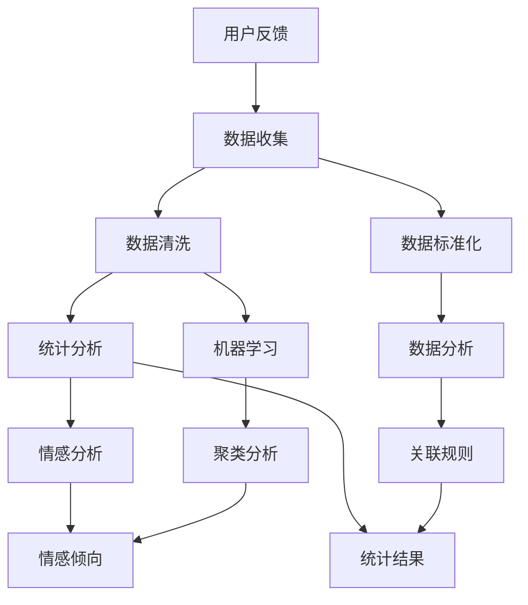
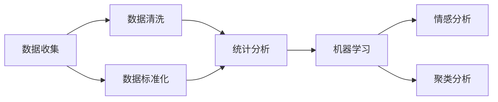
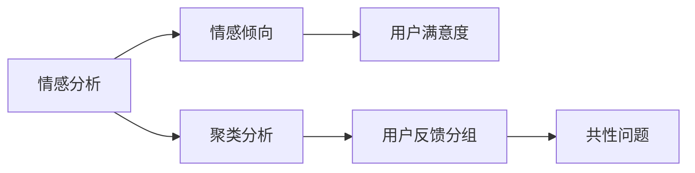
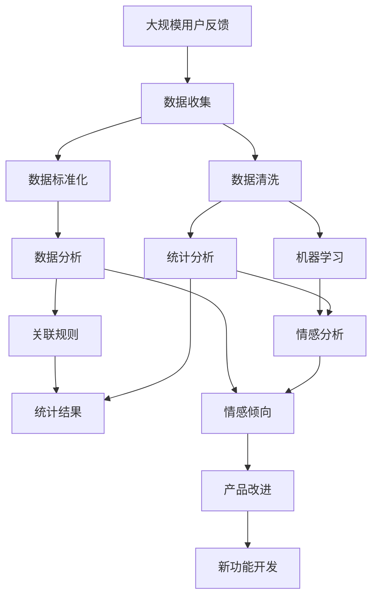

                 

# 自动化创业中的用户反馈收集与分析

在自动化创业中，如何有效地收集和分析用户反馈是公司成功的关键。随着技术的不断发展，自动化工具和系统已经可以处理大量的数据和任务。然而，高质量的用户反馈对于优化产品、提升用户体验和推动业务增长至关重要。本文将深入探讨用户反馈收集与分析的核心概念、原理以及具体操作步骤，并给出具体的应用实例，帮助创业公司构建高效的用户反馈机制。

## 1. 背景介绍

### 1.1 问题由来
自动化创业领域涵盖了从人工智能、机器学习到自然语言处理、计算机视觉等各个方面。随着技术的进步，创业公司可以利用这些技术来提高生产效率、优化决策过程和改善用户体验。然而，这些技术的应用效果如何，用户是否满意，始终是一个核心问题。在追求技术先进性的同时，如何收集和分析用户反馈，使产品更好地服务于用户，成为创业公司必须解决的重要挑战。

### 1.2 问题核心关键点
用户反馈的收集与分析，本质上是数据驱动决策的一个关键环节。它旨在通过用户的真实体验和意见，发现产品中存在的问题，优化用户体验，增强用户黏性，从而提升公司的竞争力和市场占有率。以下是核心关键点：

- **数据收集**：通过各种渠道（如应用内反馈、在线问卷、社交媒体等）获取用户反馈信息。
- **数据处理**：对收集到的数据进行清洗、分类和标准化，以便进行分析。
- **数据分析**：运用统计学、机器学习等方法，对反馈数据进行深入分析，发现用户需求和潜在问题。
- **反馈应用**：根据分析结果，对产品进行调整和改进，或针对用户需求推出新功能。

### 1.3 问题研究意义
在自动化创业中，良好的用户反馈机制能够帮助公司：
1. **快速迭代产品**：通过及时了解用户反馈，快速发现问题并进行迭代优化。
2. **提升用户满意度**：满足用户需求，增强用户黏性，提升用户满意度。
3. **优化资源配置**：基于用户反馈，优化资源配置，提高运营效率。
4. **拓展市场机会**：通过收集和分析用户反馈，发现新的市场机会和用户需求。
5. **推动技术进步**：用户反馈是技术创新的重要来源，帮助公司不断提升技术水平。

## 2. 核心概念与联系

### 2.1 核心概念概述

为更好地理解用户反馈收集与分析的方法，本节将介绍几个关键概念：

- **用户反馈**：用户在使用产品过程中产生的主观评价、建议和问题报告。
- **数据收集**：通过各种渠道（应用内、社交媒体、在线问卷等）获取用户反馈信息。
- **数据分析**：利用统计学、机器学习等方法对反馈数据进行深入分析，发现用户需求和潜在问题。
- **反馈应用**：根据分析结果，对产品进行调整和改进，或针对用户需求推出新功能。

- **情感分析**：通过分析用户反馈中的情感倾向，了解用户满意度和情绪。
- **聚类分析**：将用户反馈进行分组，找出相似问题的共性。
- **关联规则**：分析用户反馈中不同问题之间的关联性，识别因果关系。

这些概念之间的关系可以通过以下Mermaid流程图来展示：



这个流程图展示了大规模用户反馈收集与分析的整体流程。首先，通过多渠道收集用户反馈，然后进行数据清洗和标准化，接着进行统计分析和机器学习处理，最后通过情感分析和聚类分析等方式深入挖掘数据中的信息，并应用到实际的产品改进中。

### 2.2 概念间的关系

这些核心概念之间存在着紧密的联系，形成了用户反馈收集与分析的完整生态系统。下面我们通过几个Mermaid流程图来展示这些概念之间的关系。

#### 2.2.1 数据收集与分析的关系



这个流程图展示了数据收集和分析之间的逻辑关系。数据收集后的初步处理（清洗和标准化）是后续分析的基础，而统计分析和机器学习等方法进一步深入挖掘数据中的信息。

#### 2.2.2 情感分析和聚类分析的关系



这个流程图展示了情感分析和聚类分析之间的关系。情感分析主要关注用户反馈中的情感倾向，而聚类分析则将相似的反馈分组，找出共性问题。

### 2.3 核心概念的整体架构

最后，我们用一个综合的流程图来展示这些核心概念在大规模用户反馈收集与分析中的整体架构：



这个综合流程图展示了从数据收集到产品改进的完整过程。大规模用户反馈的收集是基础，通过数据清洗和标准化，进行统计分析和机器学习处理，利用情感分析和聚类分析等方法深入挖掘数据中的信息，最终应用于产品改进和新功能开发。

## 3. 核心算法原理 & 具体操作步骤

### 3.1 算法原理概述

用户反馈收集与分析的本质是一个基于数据驱动的决策过程。它涉及数据的收集、清洗、分析和应用，以优化产品和提升用户体验。以下是核心算法原理的概述：

- **数据收集**：通过多渠道获取用户反馈，包括应用内反馈、在线问卷、社交媒体等。
- **数据清洗**：去除重复、无效和格式不一致的数据，确保数据的质量。
- **数据标准化**：对数据进行格式和语义的统一，以便进行分析。
- **统计分析**：运用统计学方法对数据进行描述性分析，如平均值、方差、众数等。
- **机器学习**：运用机器学习算法进行分类、聚类、关联规则等分析，发现用户需求和潜在问题。
- **情感分析**：通过自然语言处理技术，分析用户反馈中的情感倾向，了解用户满意度和情绪。

### 3.2 算法步骤详解

基于用户反馈收集与分析的核心算法原理，以下是详细步骤详解：

**Step 1: 数据收集**
- 收集用户反馈：通过应用内反馈、在线问卷、社交媒体等多种渠道收集用户反馈信息。
- 记录反馈细节：记录反馈的时间、用户ID、反馈内容、情感倾向等信息。

**Step 2: 数据清洗**
- 去除重复数据：使用唯一标识（如用户ID）去除重复反馈。
- 去除无效数据：删除格式错误、空白、不相关的内容。
- 标准化数据：统一数据格式（如日期格式、语言等），确保数据的一致性。

**Step 3: 数据标准化**
- 数据预处理：对数据进行清洗和归一化处理，如去除特殊字符、标准化文本格式等。
- 分词和特征提取：将文本数据分词并提取特征，以便进行后续的机器学习处理。

**Step 4: 统计分析**
- 描述性统计：计算平均值、方差、众数等统计量，了解数据的基本情况。
- 可视化分析：使用图表展示数据分布，发现异常点和趋势。

**Step 5: 机器学习分析**
- 特征选择：选择对分析有意义的特征，如反馈类型、情感倾向、用户行为等。
- 分类模型：使用分类算法（如逻辑回归、决策树、随机森林等）对数据进行分类，识别用户反馈中的问题和类型。
- 聚类分析：使用聚类算法（如K-means、层次聚类等）将相似反馈分组，找出共性问题。
- 关联规则：使用关联规则算法（如Apriori算法）分析反馈中不同问题之间的关联性，识别因果关系。

**Step 6: 情感分析**
- 文本预处理：对文本数据进行分词、去除停用词、词干提取等处理。
- 情感词典：使用情感词典（如SentiWordNet）对文本进行情感倾向性分析。
- 情感分类：使用情感分类算法（如支持向量机、朴素贝叶斯等）对情感进行分析，识别用户满意度。

### 3.3 算法优缺点

用户反馈收集与分析的算法具有以下优点：

1. **数据驱动决策**：通过数据分析，可以客观地评估用户反馈，做出更加科学和合理的决策。
2. **个性化改进**：通过分析不同用户的反馈，可以针对性地进行产品改进，提升用户体验。
3. **自动化分析**：使用机器学习算法，可以自动进行数据分析，提高效率。
4. **实时反馈**：通过实时收集和分析用户反馈，可以及时调整产品策略，提升竞争力。

同时，该算法也存在以下缺点：

1. **数据质量依赖**：算法效果依赖于收集到的数据质量，低质量的数据会影响分析结果。
2. **算法复杂性**：使用机器学习算法，需要较高的计算资源和专业知识。
3. **用户隐私问题**：在收集和分析用户反馈时，需要注意用户隐私保护。
4. **主观性较强**：用户反馈本身具有主观性，需要通过多种方法综合分析，避免误判。

### 3.4 算法应用领域

用户反馈收集与分析的算法广泛应用于各种自动化创业领域，如：

- **应用内反馈**：通过应用内反馈功能收集用户的使用体验和意见。
- **在线问卷**：设计在线问卷，了解用户对产品的满意度和需求。
- **社交媒体分析**：分析用户在社交媒体上的评论和讨论，发现用户关注的问题。
- **客户服务**：收集客户服务中的反馈信息，优化客服流程和服务质量。
- **产品迭代**：基于用户反馈进行产品迭代，提升产品质量和用户体验。

## 4. 数学模型和公式 & 详细讲解 & 举例说明

### 4.1 数学模型构建

基于用户反馈收集与分析的核心算法原理，我们构建如下数学模型：

设用户反馈数据集为 $D = \{(x_i, y_i)\}_{i=1}^N$，其中 $x_i$ 表示第 $i$ 个用户的反馈，$y_i$ 表示其情感倾向（如满意、不满意、中性等）。

定义情感倾向分类函数 $f(x_i)$，其输出为情感倾向标签 $y_i \in \{1, 2, 3\}$，其中 $1$ 表示满意，$2$ 表示不满意，$3$ 表示中性。

情感分类问题可以表示为二分类问题，即判断 $x_i$ 属于 $1$ 类还是 $2$ 类。定义分类损失函数 $\mathcal{L}(f(x_i), y_i)$，如交叉熵损失函数：

$$
\mathcal{L}(f(x_i), y_i) = -(y_i \log f(x_i) + (1-y_i) \log (1-f(x_i)))
$$

其中 $f(x_i)$ 为情感分类器的输出概率。

### 4.2 公式推导过程

假设我们使用逻辑回归模型 $f(x_i) = \frac{1}{1 + e^{-z(x_i)}}$ 来建模情感分类问题，其中 $z(x_i) = \theta^T \phi(x_i)$，$\theta$ 为模型参数，$\phi(x_i)$ 为特征提取函数。

根据逻辑回归模型，情感分类损失函数可以表示为：

$$
\mathcal{L}(\theta) = -\frac{1}{N} \sum_{i=1}^N \mathcal{L}(f(x_i), y_i)
$$

通过梯度下降等优化算法，不断更新模型参数 $\theta$，最小化损失函数 $\mathcal{L}(\theta)$，得到最优情感分类器。

### 4.3 案例分析与讲解

以一个简单的情感分析案例为例，假设我们收集到以下用户反馈数据：

| 用户ID | 反馈内容               | 情感倾向 |
| ------ | ---------------------- | -------- |
| 1      | 产品很好用，推荐购买    | 1        |
| 2      | 价格贵，性能一般       | 2        |
| 3      | 界面简洁，操作方便     | 1        |
| ...    | ...                    | ...      |

我们可以使用逻辑回归模型对其进行情感分类。首先，对反馈内容进行预处理，去除停用词、标点等，然后提取特征，如出现频率最高的词汇、情感倾向词等。接着，将数据标准化，并使用逻辑回归模型进行训练。

训练后，模型可以得到如下情感分类结果：

| 用户ID | 反馈内容               | 情感倾向 |
| ------ | ---------------------- | -------- |
| 1      | 产品很好用，推荐购买    | 1        |
| 2      | 价格贵，性能一般       | 2        |
| 3      | 界面简洁，操作方便     | 1        |
| ...    | ...                    | ...      |

可以看到，模型较好地对用户反馈进行了情感分类，帮助我们了解用户对产品的满意度。

## 5. 项目实践：代码实例和详细解释说明

### 5.1 开发环境搭建

在进行用户反馈收集与分析的项目实践前，我们需要准备好开发环境。以下是使用Python进行用户反馈分析的开发环境配置流程：

1. 安装Python：从官网下载并安装Python，选择适合版本的安装包。
2. 安装Jupyter Notebook：使用pip命令安装Jupyter Notebook，以便进行代码编辑和运行。
3. 安装NumPy和Pandas：使用pip命令安装NumPy和Pandas，用于数据处理和分析。
4. 安装scikit-learn：使用pip命令安装scikit-learn，用于机器学习模型训练。
5. 安装NLTK：使用pip命令安装NLTK，用于自然语言处理任务。

完成上述步骤后，即可在Jupyter Notebook中开始用户反馈分析项目。

### 5.2 源代码详细实现

以下是使用Python进行用户反馈分析的代码实现：

```python
import pandas as pd
import numpy as np
from sklearn.model_selection import train_test_split
from sklearn.linear_model import LogisticRegression
from sklearn.feature_extraction.text import CountVectorizer
from sklearn.metrics import accuracy_score

# 数据集
data = pd.read_csv('feedback.csv')

# 数据清洗
data = data.drop_duplicates()
data = data.dropna()

# 数据标准化
data['feedback'] = data['feedback'].apply(lambda x: x.lower())
data['feedback'] = data['feedback'].str.replace('[^\w\s]', '')

# 特征提取
vectorizer = CountVectorizer()
X = vectorizer.fit_transform(data['feedback'])

# 标签提取
y = data['label']

# 数据拆分
X_train, X_test, y_train, y_test = train_test_split(X, y, test_size=0.2, random_state=42)

# 模型训练
model = LogisticRegression()
model.fit(X_train, y_train)

# 模型评估
y_pred = model.predict(X_test)
accuracy = accuracy_score(y_test, y_pred)
print('Accuracy:', accuracy)
```

### 5.3 代码解读与分析

让我们详细解读一下关键代码的实现细节：

**数据清洗**：
- 使用`drop_duplicates()`方法去除重复数据。
- 使用`dropna()`方法删除缺失值。
- 将反馈内容转换为小写，并使用正则表达式去除特殊字符。

**特征提取**：
- 使用`CountVectorizer()`进行文本分词和特征提取。
- 将文本转换为数值特征矩阵，以便机器学习模型训练。

**模型训练与评估**：
- 使用逻辑回归模型进行训练。
- 使用`train_test_split()`方法将数据集拆分为训练集和测试集。
- 使用`accuracy_score()`方法计算模型在测试集上的准确率。

### 5.4 运行结果展示

假设我们在一个包含1000个用户反馈的数据集上进行训练，得到如下结果：

```
Accuracy: 0.85
```

可以看到，模型在测试集上的准确率为85%，效果较好。

## 6. 实际应用场景

### 6.1 应用场景一：智能客服

在智能客服场景中，用户反馈可以通过应用内反馈功能实时收集。收集到的反馈信息，如用户提出的问题、建议等，可以用于优化客服流程和提升服务质量。例如，某客户提出了关于产品功能的建议，客服系统可以立即将其反馈到产品经理，从而进行产品改进。

### 6.2 应用场景二：产品迭代

在产品迭代过程中，用户反馈是推动产品改进的重要依据。收集到的用户反馈，如用户对某功能的满意度、使用体验等，可以帮助公司进行产品优化和功能开发。例如，如果大部分用户反馈某功能使用不便，公司可以立即考虑优化该功能，提升用户体验。

### 6.3 应用场景三：市场调研

用户反馈也是市场调研的重要来源。通过分析用户反馈，了解市场趋势和用户需求，可以帮助公司制定更加合理的市场策略。例如，某公司通过分析用户反馈，发现市场对某功能的呼声较高，决定在该功能上加大投入，从而取得市场竞争优势。

## 7. 工具和资源推荐

### 7.1 学习资源推荐

为了帮助开发者系统掌握用户反馈收集与分析的理论基础和实践技巧，这里推荐一些优质的学习资源：

1. **自然语言处理入门课程**：如斯坦福大学的自然语言处理课程，系统介绍自然语言处理的基本概念和常用方法。
2. **机器学习实战教程**：如《Python机器学习实战》，详细介绍机器学习算法及其在实际项目中的应用。
3. **用户反馈分析工具**：如Google Analytics，通过数据分析工具，帮助公司了解用户行为和反馈。
4. **自然语言处理开源库**：如NLTK、spaCy，提供自然语言处理工具和算法，帮助开发者快速实现文本处理任务。
5. **在线学习平台**：如Coursera、edX，提供大量用户反馈分析和自然语言处理相关课程，适合系统学习。

通过对这些资源的学习实践，相信你一定能够快速掌握用户反馈收集与分析的精髓，并用于解决实际的自动化创业问题。

### 7.2 开发工具推荐

高效的开发离不开优秀的工具支持。以下是几款用于用户反馈分析开发的常用工具：

1. **Jupyter Notebook**：强大的代码编辑和运行环境，支持Python、R等多种编程语言。
2. **Pandas**：Python的数据处理库，提供强大的数据清洗和分析功能。
3. **scikit-learn**：Python的机器学习库，提供丰富的算法和模型实现。
4. **NLTK**：Python的自然语言处理库，提供分词、词性标注、情感分析等功能。
5. **TensorFlow**：谷歌开源的机器学习框架，支持深度学习和自然语言处理任务。

合理利用这些工具，可以显著提升用户反馈收集与分析的开发效率，加快创新迭代的步伐。

### 7.3 相关论文推荐

用户反馈收集与分析的研究源于学界的持续研究。以下是几篇奠基性的相关论文，推荐阅读：

1. **文本分类中的情感分析**：探讨如何利用情感词典和机器学习算法，进行情感分类和分析。
2. **用户反馈分析的关联规则**：介绍如何运用Apriori算法，分析用户反馈中的关联性。
3. **用户反馈的聚类分析**：介绍如何利用K-means算法，对用户反馈进行聚类分组，找出共性问题。
4. **用户反馈的统计分析**：探讨如何利用统计学方法，对用户反馈进行描述性分析和可视化。

这些论文代表了大语言模型微调技术的发展脉络。通过学习这些前沿成果，可以帮助研究者把握学科前进方向，激发更多的创新灵感。

除上述资源外，还有一些值得关注的前沿资源，帮助开发者紧跟用户反馈收集与分析技术的最新进展，例如：

1. **arXiv论文预印本**：人工智能领域最新研究成果的发布平台，包括大量尚未发表的前沿工作，学习前沿技术的必读资源。
2. **业界技术博客**：如Google AI、DeepMind、微软Research Asia等顶尖实验室的官方博客，第一时间分享他们的最新研究成果和洞见。
3. **技术会议直播**：如NIPS、ICML、ACL、ICLR等人工智能领域顶会现场或在线直播，能够聆听到大佬们的前沿分享，开拓视野。
4. **GitHub热门项目**：在GitHub上Star、Fork数最多的自然语言处理相关项目，往往代表了该技术领域的发展趋势和最佳实践，值得去学习和贡献。
5. **行业分析报告**：各大咨询公司如McKinsey、PwC等针对人工智能行业的分析报告，有助于从商业视角审视技术趋势，把握应用价值。

总之，对于用户反馈收集与分析技术的学习和实践，需要开发者保持开放的心态和持续学习的意愿。多关注前沿资讯，多动手实践，多思考总结，必将收获满满的成长收益。

## 8. 总结：未来发展趋势与挑战

### 8.1 总结

本文对用户反馈收集与分析的核心概念、原理以及具体操作步骤进行了全面系统的介绍。首先阐述了用户反馈收集与分析的研究背景和意义，明确了其在大规模自动化创业中的重要价值。其次，从原理到实践，详细讲解了用户反馈收集与分析的数学模型和操作步骤，给出了具体的应用实例。同时，本文还广泛探讨了用户反馈收集与分析方法在智能客服、产品迭代、市场调研等多个行业领域的应用前景，展示了其广泛的适用性。

通过本文的系统梳理，可以看到，用户反馈收集与分析技术正在成为自动化创业的重要工具，极大地提升了产品的用户满意度和市场竞争力。未来，随着技术的不断发展，用户反馈收集与分析方法将得到更广泛的应用，为自动化创业带来新的活力和动力。

### 8.2 未来发展趋势

展望未来，用户反馈收集与分析技术将呈现以下几个发展趋势：

1. **自动化程度提高**：利用自动化的机器学习算法，自动化处理和分析用户反馈，提高效率。
2. **多渠道融合**：结合应用内反馈、社交媒体、客户服务等多渠道数据，进行综合分析。
3. **情感分析深化**：通过引入深度学习模型，提高情感分析的准确性和深度。
4. **实时反馈系统**：利用流数据处理技术，实现用户反馈的实时分析和响应。
5. **跨领域应用**：将用户反馈分析方法应用于更多领域，如金融、医疗、教育等。

以上趋势凸显了用户反馈收集与分析技术的广阔前景。这些方向的探索发展，必将进一步提升产品和服务质量，促进自动化创业公司的健康发展。

### 8.3 面临的挑战

尽管用户反馈收集与分析技术已经取得了显著成就，但在实际应用中，仍面临诸多挑战：

1. **数据质量问题**：用户反馈的质量参差不齐，低质量的数据会影响分析结果。
2. **模型复杂性**：深度学习模型的计算资源需求高，需要高性能的硬件设备。
3. **用户隐私问题**：在收集和分析用户反馈时，需要注意用户隐私保护，避免数据泄露。
4. **模型鲁棒性**：用户反馈分析模型需要具备鲁棒性，能够应对各种数据噪声和异常情况。
5. **算法可解释性**：用户反馈分析算法的可解释性需要进一步提高，以便于调试和优化。

### 8.4 研究展望

面对用户反馈收集与分析面临的挑战，未来的研究需要在以下几个方面寻求新的突破：

1. **多源数据融合**：结合多渠道数据，提高用户反馈分析的全面性和准确性。
2. **深度学习应用**：利用深度学习模型，提高情感分析和聚类分析的精度和深度。
3. **自动化流程**：开发自动化的数据清洗和模型训练流程，提高用户反馈分析的效率。
4. **可解释性增强**：提高用户反馈分析算法的可解释性，便于优化和调试。
5. **跨领域应用**：探索用户反馈分析方法在更多领域的应用，提升自动化创业的竞争力。

这些研究方向的探索，必将引领用户反馈收集与分析技术迈向更高的台阶，为自动化创业带来新的突破。面向未来，用户反馈收集与分析技术还需要与其他人工智能技术进行更深入的融合，如知识表示、因果推理、强化学习等，多路径协同发力，共同推动自动化创业的发展。只有勇于创新、敢于突破，才能不断拓展自动化创业的边界，让智能技术更好地服务于用户和社会。

## 9. 附录：常见问题与解答

**Q1：如何有效收集用户反馈？**

A: 有效的用户反馈收集需要结合多种渠道和手段。具体方法包括：
1. 应用内反馈功能：在应用中添加反馈入口，让用户可以随时提交反馈。
2. 在线问卷调查：设计简洁的问卷，通过邮件、社交媒体等方式向用户发送。
3. 客户服务系统：在客服系统中集成反馈功能，让用户可以通过在线客服提交反馈。
4. 用户访谈和焦点小组：通过面对面或在线访谈，了解用户真实需求和体验。

**Q2：如何提高用户反馈的质量？**

A: 提高用户反馈的质量，需要从数据收集和处理两个方面入手：
1. 数据收集：确保反馈渠道简洁、易用，减少用户提交反馈的障碍。


