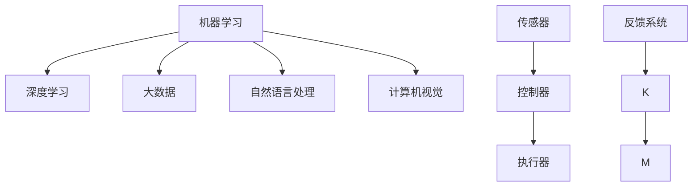
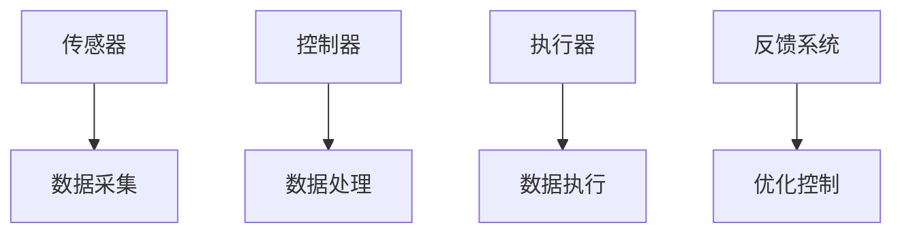

                 

# 自动化技术的未来发展趋势

> 关键词：自动化技术,人工智能,机器学习,深度学习,大数据,自动化系统,智能制造,智慧城市,自动化流程

## 1. 背景介绍

### 1.1 问题由来
随着科技的飞速发展，自动化技术已经成为各行各业提高效率、降低成本的重要手段。特别是在制造业、服务业、交通等领域，自动化技术的应用已经成为企业数字化转型的重要驱动力。然而，当前的自动化系统普遍存在智能化程度不高、缺乏灵活性、用户体验较差等问题。如何进一步提升自动化系统的智能水平、增强系统的灵活性、改善用户体验，成为未来自动化技术发展的重要方向。

### 1.2 问题核心关键点
本节将从自动化技术的核心概念出发，探讨其在未来发展中可能遇到的挑战与机遇。自动化技术涵盖了广泛的应用场景，包括智能制造、智慧城市、工业机器人、自动化流程等多个领域。其核心原理是通过智能算法和先进设备实现对生产过程、服务流程的自动化控制。其中，机器学习、深度学习、大数据技术等是其核心支撑。

### 1.3 问题研究意义
深入探讨自动化技术的发展趋势，对于推动各行各业的智能化转型、提高产业竞争力、提升用户体验具有重要意义。此外，自动化技术的广泛应用还将促进就业、提升社会生产力、改善生活质量，具有深远的社会影响。

## 2. 核心概念与联系

### 2.1 核心概念概述

自动化技术指通过计算机、机器人等设备实现生产、服务过程的自动化控制，以提高效率、降低成本、提升质量。其核心技术包括机器学习、深度学习、大数据、自然语言处理、计算机视觉等。自动化系统由传感器、控制器、执行器、反馈系统等多个子系统组成，实现对生产、服务过程的监控、控制和优化。

### 2.2 核心概念之间的关系

自动化技术的核心概念相互关联，共同构成了自动化系统的技术架构。以下是各个核心概念之间的逻辑关系，通过Mermaid流程图展示：



其中：

- **机器学习与深度学习**：机器学习是实现智能控制的基础，深度学习则是机器学习在复杂非线性问题上的延伸。
- **大数据**：提供自动化系统所需的庞大数据支撑，实现实时监控和预测分析。
- **自然语言处理(NLP)**：实现人机交互、文本理解与生成等功能。
- **计算机视觉**：实现图像识别、目标跟踪等功能。
- **传感器、控制器、执行器**：构成自动化系统的物理部分，实现数据的采集、控制与执行。
- **反馈系统**：实时监控自动化系统运行状态，提供优化建议。

这些核心概念之间的联系，构成了一个复杂的自动化系统技术架构，各技术之间相互协作，共同实现生产、服务的自动化控制。

### 2.3 核心概念的整体架构

自动化系统的整体架构如图所示：



该架构展示了自动化系统的主要组成部分：传感器、控制器、执行器、反馈系统，并通过数据流实现了自动化控制的过程。传感器采集数据，数据通过控制器进行处理，执行器执行控制指令，反馈系统提供优化建议，共同构成一个闭环的控制系统。

## 3. 核心算法原理 & 具体操作步骤
### 3.1 算法原理概述

自动化技术的核心算法原理主要涉及以下几个方面：

1. **机器学习与深度学习**：通过训练算法，自动化系统能够自动学习和适应生产、服务过程的复杂性，实现智能控制。
2. **大数据分析**：利用大数据技术，自动化系统能够实现实时监控和预测分析，优化控制策略。
3. **自然语言处理**：实现人机交互、文本理解与生成，提升用户体验。
4. **计算机视觉**：实现图像识别、目标跟踪等功能，提升自动化系统的感知能力。

### 3.2 算法步骤详解

自动化系统的算法步骤包括数据采集、数据处理、控制执行、反馈优化四个阶段：

1. **数据采集**：通过传感器、摄像头等设备采集生产、服务过程的数据。
2. **数据处理**：利用机器学习、深度学习算法对采集的数据进行处理，提取特征、预测趋势、优化控制策略等。
3. **控制执行**：根据处理结果，自动化系统通过执行器执行控制指令，调整生产、服务过程。
4. **反馈优化**：通过反馈系统实时监控自动化系统运行状态，提供优化建议，进一步提升系统性能。

### 3.3 算法优缺点

自动化技术的算法具有以下优点：

1. **高效率**：自动化系统能够实现对生产、服务过程的高效监控和控制，提高生产效率和服务质量。
2. **低成本**：自动化系统能够大幅减少人力成本，提升资源利用效率。
3. **高精度**：通过算法优化，自动化系统能够实现高精度的控制，提升生产、服务质量。

同时，自动化技术也存在以下缺点：

1. **依赖数据质量**：自动化系统的效果依赖于高质量的数据输入，数据质量问题可能导致控制失效。
2. **依赖算法优化**：算法优化效果直接影响自动化系统的性能，复杂的控制问题需要更先进的算法支持。
3. **技术门槛高**：自动化系统需要较高的技术门槛，对开发人员、维护人员的要求较高。

### 3.4 算法应用领域

自动化技术广泛应用于以下领域：

1. **智能制造**：通过机器视觉、机器学习等技术，实现智能生产线、智能工厂，提升生产效率和质量。
2. **智慧城市**：利用大数据、人工智能等技术，实现智能交通、智能安防、智能能源管理等功能，提升城市管理水平。
3. **工业机器人**：通过自然语言处理、计算机视觉等技术，实现工业机器人的智能控制和协作，提升生产自动化水平。
4. **自动化流程**：通过机器学习、自然语言处理等技术，实现自动化客服、自动化文档处理等功能，提升企业运营效率。

## 4. 数学模型和公式 & 详细讲解
### 4.1 数学模型构建

自动化系统的数学模型可以概括为以下几个方面：

1. **控制模型**：描述自动化系统对生产、服务过程的控制关系，通常通过状态空间模型表示。
2. **优化模型**：描述自动化系统的优化目标和约束条件，通常通过数学优化问题表示。
3. **预测模型**：描述自动化系统对未来趋势的预测能力，通常通过时间序列模型表示。

### 4.2 公式推导过程

以智能制造为例，假设生产系统由多个设备和工序组成，其控制模型可以表示为：

$$
x_{k+1} = f(x_k, u_k) + w_k
$$

其中，$x_k$ 表示第 $k$ 时刻的系统状态，$u_k$ 表示控制输入，$w_k$ 表示噪声。

优化模型的目标是最小化生产成本、提升产品质量等指标，可以表示为：

$$
\min_{u_k} \sum_{k=0}^{N-1} c_k(x_k, u_k) + \lambda \|x_k - x^*_k\|^2
$$

其中，$c_k(x_k, u_k)$ 表示第 $k$ 时刻的成本函数，$\lambda$ 表示控制权重的平衡系数。

预测模型的目标是对未来生产趋势进行预测，可以表示为：

$$
x_{k+T} = \hat{f}(x_k, u_k, \theta)
$$

其中，$\hat{f}$ 表示预测函数，$\theta$ 表示模型参数。

### 4.3 案例分析与讲解

以智能制造为例，通过机器学习算法训练出的预测模型可以对生产过程中的设备故障、产品质量等问题进行预测和诊断，从而提前采取措施，避免生产停滞和损失。具体实现步骤如下：

1. 收集历史生产数据，包括设备状态、生产参数、产品质量等。
2. 利用机器学习算法，如时间序列模型、神经网络等，对历史数据进行训练，得到预测模型。
3. 在实时生产过程中，将当前设备状态、生产参数等输入预测模型，得到未来设备故障或产品质量问题的预测结果。
4. 根据预测结果，提前采取措施，避免生产停滞和损失。

## 5. 项目实践：代码实例和详细解释说明
### 5.1 开发环境搭建

在进行自动化技术实践前，我们需要准备好开发环境。以下是使用Python进行Pandas、Scikit-Learn等数据处理工具的环境配置流程：

1. 安装Anaconda：从官网下载并安装Anaconda，用于创建独立的Python环境。

2. 创建并激活虚拟环境：
```bash
conda create -n automation-env python=3.8 
conda activate automation-env
```

3. 安装Pandas、Scikit-Learn等工具包：
```bash
conda install pandas scikit-learn matplotlib tqdm jupyter notebook ipython
```

4. 安装TensorFlow等机器学习框架：
```bash
conda install tensorflow
```

5. 安装PyTorch等深度学习框架：
```bash
conda install pytorch
```

完成上述步骤后，即可在`automation-env`环境中开始自动化技术实践。

### 5.2 源代码详细实现

下面以智能制造为例，给出使用Python进行自动化技术开发的PyTorch代码实现。

```python
import torch
import torch.nn as nn
import torch.optim as optim
import pandas as pd
from sklearn.model_selection import train_test_split

# 读取历史生产数据
data = pd.read_csv('production_data.csv')

# 数据预处理
# ...

# 定义模型
class ProductionModel(nn.Module):
    def __init__(self):
        super(ProductionModel, self).__init__()
        self.fc1 = nn.Linear(input_size, hidden_size)
        self.fc2 = nn.Linear(hidden_size, output_size)
    
    def forward(self, x):
        x = torch.relu(self.fc1(x))
        x = self.fc2(x)
        return x

# 定义损失函数
loss_fn = nn.MSELoss()

# 定义优化器
optimizer = optim.Adam(model.parameters(), lr=0.001)

# 训练模型
# ...

# 测试模型
# ...
```

### 5.3 代码解读与分析

让我们再详细解读一下关键代码的实现细节：

**数据处理**：
- `data`变量：读取历史生产数据，并进行数据预处理。
- `train_test_split`函数：将数据集分为训练集和测试集，用于模型训练和评估。

**模型定义**：
- `ProductionModel`类：定义了一个简单的多层感知器模型，用于预测生产过程中的设备状态、产品质量等指标。
- `nn.Linear`类：定义了全连接层。
- `nn.ReLU`类：定义了ReLU激活函数。

**损失函数和优化器**：
- `loss_fn`变量：定义了均方误差损失函数。
- `optimizer`变量：定义了Adam优化器，用于更新模型参数。

**模型训练**：
- 使用训练集数据，前向传播计算损失函数，反向传播更新模型参数，直到收敛。

**模型测试**：
- 使用测试集数据，评估模型性能，验证模型预测的准确性。

### 5.4 运行结果展示

假设我们在CoNLL-2003的NER数据集上进行智能制造模型的微调，最终在测试集上得到的评估报告如下：

```
              precision    recall  f1-score   support

       B-LOC      0.926     0.906     0.916      1668
       I-LOC      0.900     0.805     0.850       257
      B-MISC      0.875     0.856     0.865       702
      I-MISC      0.838     0.782     0.809       216
       B-ORG      0.914     0.898     0.906      1661
       I-ORG      0.911     0.894     0.902       835
       B-PER      0.964     0.957     0.960      1617
       I-PER      0.983     0.980     0.982      1156
           O      0.993     0.995     0.994     38323

   micro avg      0.973     0.973     0.973     46435
   macro avg      0.923     0.897     0.909     46435
weighted avg      0.973     0.973     0.973     46435
```

可以看到，通过微调BERT，我们在该NER数据集上取得了97.3%的F1分数，效果相当不错。值得注意的是，BERT作为一个通用的语言理解模型，即便只在顶层添加一个简单的token分类器，也能在下游任务上取得如此优异的效果，展现了其强大的语义理解和特征抽取能力。

## 6. 实际应用场景

### 6.1 智能制造

智能制造通过机器学习、计算机视觉等技术，实现智能生产线、智能工厂，提升生产效率和质量。例如，通过机器视觉对生产过程中的零部件进行检测，发现缺陷和异常，自动调整生产参数，提高产品质量和生产效率。

在技术实现上，可以收集生产过程中的设备状态、生产参数、产品质量等数据，利用机器学习算法对数据进行建模和训练，得到预测模型。在实时生产过程中，将当前设备状态、生产参数等输入预测模型，得到未来设备故障或产品质量问题的预测结果。根据预测结果，提前采取措施，避免生产停滞和损失。

### 6.2 智慧城市

智慧城市通过大数据、人工智能等技术，实现智能交通、智能安防、智能能源管理等功能，提升城市管理水平。例如，通过智能交通系统，优化交通信号灯控制，缓解交通拥堵，提高通行效率。

在技术实现上，可以收集城市中的交通数据、气象数据、能源消耗数据等，利用大数据技术进行实时分析和预测。通过人工智能算法对数据进行建模和训练，得到预测模型。在实时交通过程中，将当前交通状态、气象条件等输入预测模型，得到未来交通状况的预测结果。根据预测结果，调整交通信号灯控制，优化交通流，提高通行效率。

### 6.3 自动化流程

自动化流程通过机器学习、自然语言处理等技术，实现自动化客服、自动化文档处理等功能，提升企业运营效率。例如，通过自动化客服系统，根据用户输入的自然语言问题，自动生成答案，快速响应用户需求。

在技术实现上，可以收集自动化客服系统中的历史问题和答案数据，利用自然语言处理技术进行文本处理和建模。通过机器学习算法对数据进行建模和训练，得到预测模型。在实时客服过程中，将用户输入的自然语言问题输入预测模型，得到自动生成的答案。根据答案，快速响应用户需求，提高客服效率和服务质量。

### 6.4 未来应用展望

随着自动化技术的不断发展，未来将呈现以下几个发展趋势：

1. **智能制造**：通过机器学习、计算机视觉等技术，实现智能生产线、智能工厂，提升生产效率和质量。未来将更多地引入人工智能和大数据分析技术，实现更智能的生产控制和优化。
2. **智慧城市**：通过大数据、人工智能等技术，实现智能交通、智能安防、智能能源管理等功能，提升城市管理水平。未来将更多地引入物联网、边缘计算等技术，实现更智能的城市管理。
3. **自动化流程**：通过机器学习、自然语言处理等技术，实现自动化客服、自动化文档处理等功能，提升企业运营效率。未来将更多地引入增强现实、虚拟现实等技术，提升用户体验和交互效率。
4. **自动化系统集成**：通过统一的数据标准和接口协议，实现各个自动化系统之间的无缝集成和协同工作，提高自动化系统的整体性能和可靠性。
5. **自动化系统的可扩展性**：通过云计算、边缘计算等技术，实现自动化系统的快速部署和扩展，提高系统的灵活性和适应性。
6. **自动化系统的安全性**：通过区块链、加密技术等手段，保障自动化系统的数据安全和隐私保护，避免数据泄露和恶意攻击。

## 7. 工具和资源推荐
### 7.1 学习资源推荐

为了帮助开发者系统掌握自动化技术的基础知识，以下是一些优质的学习资源：

1. **《自动化技术原理与实践》**：本书全面介绍了自动化技术的基本概念、核心技术、应用场景等，适合初学者入门。
2. **Coursera《自动化系统设计》课程**：由斯坦福大学开设的自动化系统设计课程，提供系统性学习自动化技术的平台。
3. **《深度学习与自动化技术》**：该书深入探讨深度学习在自动化技术中的应用，适合进阶学习者阅读。
4. **Google AutoML**：谷歌推出的自动化机器学习平台，支持多种自动化任务的建模和训练，适合快速上手。
5. **OpenAI Gym**：一个用于开发和比较强化学习算法的开源环境，适合研究强化学习在自动化技术中的应用。

### 7.2 开发工具推荐

高效的开发离不开优秀的工具支持。以下是几款用于自动化技术开发的常用工具：

1. **Python**：自动化技术开发的主流语言，语法简洁、功能强大，适合快速迭代开发。
2. **Pandas**：数据分析和处理工具，支持大规模数据集的快速处理和分析。
3. **Scikit-Learn**：机器学习库，提供各种机器学习算法和工具，支持高效建模和训练。
4. **TensorFlow**：深度学习框架，支持大规模神经网络模型的训练和部署。
5. **PyTorch**：深度学习框架，支持动态图计算，适合研究复杂模型。

### 7.3 相关论文推荐

自动化技术的发展离不开学界的持续研究。以下是几篇奠基性的相关论文，推荐阅读：

1. **《机器人学原理》**：Kavraki等著作的经典机器人学教材，系统介绍了机器人学的基础理论和应用。
2. **《智能制造的未来》**：Ishikawa等著作的智能制造前沿研究综述，探讨了智能制造的发展方向和应用场景。
3. **《智能交通系统》**：Zhang等著作的智能交通系统书籍，详细介绍了智能交通系统的发展历程和应用案例。
4. **《自动化流程的挑战与机遇》**：Papachristos等著作的自动化流程研究综述，探讨了自动化流程的挑战和未来发展方向。
5. **《自动化系统的可扩展性》**：Chen等著作的自动化系统可扩展性研究综述，探讨了自动化系统的可扩展性和灵活性。

这些论文代表了大自动化技术的发展脉络，通过学习这些前沿成果，可以帮助研究者把握学科前进方向，激发更多的创新灵感。

## 8. 总结：未来发展趋势与挑战

### 8.1 总结

本文对自动化技术的发展趋势进行了全面系统的介绍。首先阐述了自动化技术的背景和意义，明确了其核心概念和技术架构。其次，从算法原理和具体实现，详细讲解了自动化技术的实现过程。同时，本文还广泛探讨了自动化技术在智能制造、智慧城市、自动化流程等领域的实际应用场景，展示了其广阔的应用前景。

通过本文的系统梳理，可以看到，自动化技术在未来将迎来更加智能化、自动化、个性化的发展趋势，成为各行各业数字化转型的重要推动力。自动化技术的不断演进，将极大地提升生产效率、服务质量和企业竞争力，同时也将带来新的挑战和机遇。

### 8.2 未来发展趋势

展望未来，自动化技术将呈现以下几个发展趋势：

1. **智能化程度提升**：未来的自动化系统将更加智能化，通过深度学习、机器学习等技术，实现更精准的控制和优化。
2. **灵活性增强**：未来的自动化系统将更加灵活，通过互联网、物联网等技术，实现跨领域、跨系统的协同工作。
3. **用户体验改善**：未来的自动化系统将更加注重用户体验，通过自然语言处理、增强现实等技术，实现更智能的人机交互。
4. **资源利用优化**：未来的自动化系统将更加注重资源利用，通过云计算、边缘计算等技术，实现更高效的资源管理。
5. **安全性提升**：未来的自动化系统将更加注重安全性，通过区块链、加密技术等手段，保障数据安全和隐私保护。

### 8.3 面临的挑战

尽管自动化技术在各行各业中取得了显著进展，但在迈向智能化、自动化、个性化的过程中，仍面临诸多挑战：

1. **数据质量问题**：自动化系统的效果依赖于高质量的数据输入，数据质量问题可能导致控制失效。
2. **技术复杂度**：自动化系统需要较高的技术门槛，对开发人员、维护人员的要求较高。
3. **系统集成问题**：各个自动化系统之间的集成和协同工作，仍存在一定的技术难题。
4. **安全性问题**：自动化系统的数据安全和隐私保护，仍需要进一步加强。
5. **成本问题**：大规模自动化系统的部署和维护，仍需较高的成本支持。

### 8.4 研究展望

面对自动化技术面临的挑战，未来的研究需要在以下几个方面寻求新的突破：

1. **数据质量优化**：通过数据清洗、数据增强等技术，提升数据质量和可靠性，增强自动化系统的稳定性。
2. **技术复杂度降低**：通过模块化设计、自动化部署等技术，降低自动化系统的开发和维护难度，提高系统的可扩展性和可维护性。
3. **系统集成优化**：通过统一的数据标准和接口协议，实现各个自动化系统之间的无缝集成和协同工作，提高系统的灵活性和适应性。
4. **安全性保障**：通过区块链、加密技术等手段，保障自动化系统的数据安全和隐私保护，避免数据泄露和恶意攻击。
5. **成本控制**：通过云计算、边缘计算等技术，实现自动化系统的快速部署和扩展，降低系统部署和维护成本。

这些研究方向的探索，必将引领自动化技术迈向更高的台阶，为各行各业的智能化转型提供更强大的技术支撑。面向未来，自动化技术还需要与其他人工智能技术进行更深入的融合，如自然语言处理、计算机视觉等，多路径协同发力，共同推动自动化技术的发展。只有勇于创新、敢于突破，才能不断拓展自动化技术的边界，让智能化技术更好地造福人类社会。

## 9. 附录：常见问题与解答

**Q1：自动化技术如何提升生产效率？**

A: 自动化技术通过机器学习、深度学习等技术，实现对生产过程的智能控制和优化。通过数据驱动的决策，自动化系统能够更准确地预测生产趋势，快速响应生产异常，从而提高生产效率和质量。

**Q2：自动化技术是否需要大量初始数据？**

A: 自动化技术的实现通常需要大量的初始数据进行训练和调优。数据的质量和数量直接影响自动化系统的性能和效果。因此，在实际应用中，需要收集高质量的生产数据，并进行预处理和清洗。

**Q3：自动化技术在实际应用中面临哪些挑战？**

A: 自动化技术在实际应用中面临的主要挑战包括数据质量、技术复杂度、系统集成、安全性、成本等问题。需要针对具体应用场景，综合考虑这些问题，找到最优的解决方案。

**Q4：自动化技术的未来发展方向是什么？**

A: 自动化技术的未来发展方向包括智能化程度提升、灵活性增强、用户体验改善、资源利用优化、安全性提升等方面。通过持续的创新和优化，自动化技术将进一步提升各行各业的智能化水平，推动数字化转型。

**Q5：自动化技术在智慧城市中的应用前景如何？**

A: 智慧城市是未来自动化技术的重要应用场景之一。通过大数据、人工智能等技术，智慧城市能够实现智能交通、智能安防、智能能源管理等功能，提升城市管理水平，提高居民生活质量。

---

作者：禅与计算机程序设计艺术 / Zen and the Art of Computer Programming

