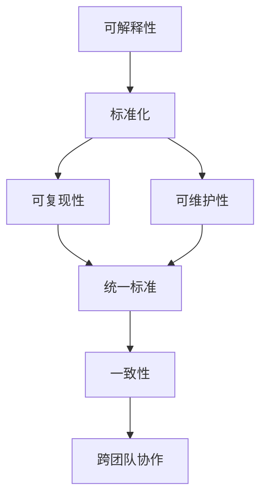

                 

## 1. 背景介绍

在当今数据驱动的数字化世界中，自然语言处理（NLP）已成为了解、处理和生成自然语言信息的关键技术。随着深度学习和预训练模型的快速发展，NLP技术在诸如文本分类、情感分析、机器翻译、问答系统等任务上取得了显著进展。然而，尽管这些模型在某些特定场景下表现出色，但缺乏系统化的工作流描述标准，这给模型开发、维护和应用带来了诸多挑战。

### 1.1 问题由来

NLP工作流描述的不标准化导致了以下几个主要问题：

- **缺乏一致性**：不同项目或团队采用的工作流标准不一致，导致难以复现和比较实验结果。
- **维护困难**：不标准化的工作流描述使得维护和更新模型变得更加复杂和耗时。
- **可解释性差**：缺乏明确定义的模型构建流程，使得模型的决策过程难以解释和验证。
- **难以协作**：标准化不足限制了跨团队、跨学科的合作和知识共享。
- **性能波动**：由于缺乏标准化流程，模型的性能可能因环境和实施方式的不同而出现波动。

### 1.2 问题核心关键点

NLP工作流描述标准化的核心在于：

- 提供一个统一的、规范化的模型构建流程，以确保模型的可复现性、可维护性和高性能。
- 明确定义每个步骤的目标、输入输出以及算法实现，以增强模型的透明性和可解释性。
- 促进跨团队、跨学科的协作，共享最佳实践和技术。
- 通过标准化流程，减少因环境、实施方式不同导致的性能波动。

## 2. 核心概念与联系

### 2.1 核心概念概述

为更好地理解自然语言工作流描述的标准化，本节将介绍几个关键概念：

- **NLP工作流描述**：指在模型构建、训练、评估和部署过程中，描述每个步骤的目标、算法、参数及数据流动的文档。
- **可解释性**：指模型决策过程的可理解性和逻辑清晰性，是确保模型可信和透明的基础。
- **标准化**：指采用统一的标准和协议，确保工作流程的一致性和可复现性。
- **可复现性**：指在相同条件下，通过同样的流程和参数，能够重现相同的结果。
- **可维护性**：指工作流描述文档应易于理解、修改和更新，以便于长期维护。

这些核心概念之间存在着紧密的联系，形成了一个系统的NLP工作流描述标准化的架构。

### 2.2 概念间的关系

这些核心概念之间的关系可以通过以下Mermaid流程图来展示：



这个流程图展示了一个从可解释性到标准化，进而实现可复现性和可维护性的流程。通过统一的、标准化的工作流描述，不仅可以确保模型的决策过程透明，还能增强模型在不同环境下的性能一致性，促进跨团队协作和知识共享。

## 3. 核心算法原理 & 具体操作步骤

### 3.1 算法原理概述

自然语言工作流描述的标准化涉及以下核心算法原理：

- **预训练与微调**：在大量无标签数据上预训练语言模型，然后通过微调将其适应特定任务。
- **模型构建与训练**：定义模型结构，选择合适的损失函数和优化算法，设置超参数，并在特定数据集上进行训练。
- **模型评估与部署**：通过验证集评估模型性能，在测试集上验证模型的泛化能力，并将其部署到实际应用中。

### 3.2 算法步骤详解

基于以上原理，自然语言工作流描述的标准化一般包括以下步骤：

**Step 1: 准备数据集**

- 收集和标注NLP任务相关的数据集，确保数据集的多样性和代表性。
- 将数据集划分为训练集、验证集和测试集。

**Step 2: 定义模型架构**

- 选择合适的模型架构，如BERT、GPT等。
- 定义模型的输入输出，明确输入数据的格式和预处理流程。
- 确定模型的超参数，如层数、隐藏单元数、学习率等。

**Step 3: 模型构建**

- 实现模型类，定义模型的前向传播和损失计算函数。
- 使用深度学习框架（如PyTorch、TensorFlow等）构建模型，设置优化器和损失函数。

**Step 4: 模型训练**

- 定义训练函数，加载数据集，设置训练轮数和批大小。
- 在训练集上训练模型，使用验证集评估模型性能，调整超参数。
- 保存训练过程中的日志和模型参数，便于后续分析。

**Step 5: 模型评估**

- 使用测试集评估模型性能，计算各类指标（如准确率、F1分数等）。
- 分析模型在特定数据上的表现，识别模型优势和不足。

**Step 6: 模型部署**

- 将模型导出为可部署的形式（如TensorFlow SavedModel、PyTorch模型文件等）。
- 部署模型到服务器或云端，设置API接口，实现模型的在线服务。

**Step 7: 持续优化**

- 定期收集新数据，重新训练和微调模型，保持模型性能。
- 监控模型表现，及时发现并解决问题。

### 3.3 算法优缺点

基于标准化工作流描述的NLP模型构建方法具有以下优点：

- **可复现性高**：标准化流程确保了模型构建的可复现性，使得任何团队或个人可以轻松复现模型的训练过程。
- **可维护性强**：标准化的工作流描述使得模型维护变得更加容易，便于快速更新和修复问题。
- **性能稳定**：标准化流程可以减少因环境或实施方式不同导致的性能波动，确保模型在不同环境下的性能一致性。
- **易于协作**：标准化工作流描述促进了跨团队、跨学科的协作，共享最佳实践和技术。
- **可解释性强**：通过明确定义每个步骤的目标和算法，增强了模型的透明性和可解释性。

同时，该方法也存在一些局限性：

- **资源消耗大**：标准化流程需要大量的资源和时间，尤其是对于大规模的预训练模型。
- **复杂度高**：标准化的工作流描述可能需要复杂的设计和实现，增加了开发难度。
- **灵活性受限**：标准化流程可能限制了模型的灵活性和创新性，尤其是在新任务或新领域。

尽管存在这些局限性，但就目前而言，标准化工作流描述仍是最主流、最有效的NLP模型构建方法。

### 3.4 算法应用领域

基于标准化工作流描述的NLP模型构建方法已经广泛应用于以下领域：

- **文本分类**：如情感分析、主题分类等。通过标准化流程构建和微调模型，实现文本的自动分类。
- **机器翻译**：通过标准化流程构建和微调模型，实现不同语言之间的翻译。
- **问答系统**：通过标准化流程构建和微调模型，实现自然语言问答。
- **信息抽取**：通过标准化流程构建和微调模型，从文本中抽取实体、关系等信息。
- **文本生成**：通过标准化流程构建和微调模型，实现文本的自动生成。

## 4. 数学模型和公式 & 详细讲解 & 举例说明

### 4.1 数学模型构建

在NLP任务中，通常使用以下数学模型来描述模型构建流程：

- **输入表示**：将输入文本转换为模型可以处理的向量表示。常用的方法包括Word Embeddings、BERT等。
- **模型结构**：定义模型的架构，如Transformer、LSTM等。
- **损失函数**：定义模型训练的目标函数，常用的有交叉熵损失、均方误差损失等。
- **优化算法**：定义模型的优化方法，常用的有Adam、SGD等。

### 4.2 公式推导过程

以BERT模型为例，其预训练和微调过程的数学模型和公式如下：

**输入表示**：

$$
x = \text{Embedding}(x_i) = W_x \cdot x_i + b_x
$$

其中，$x_i$为输入文本，$W_x$和$b_x$为嵌入矩阵和偏置向量。

**模型结构**：

$$
h = \text{Transformer}(x)
$$

其中，$\text{Transformer}$表示模型的结构，通过多层的自注意力机制进行计算。

**损失函数**：

$$
\mathcal{L}(h, y) = \frac{1}{N} \sum_{i=1}^N -y_i \log \sigma(h_i^T W_c) + (1-y_i) \log(1-\sigma(h_i^T W_c))
$$

其中，$y$为标签向量，$\sigma$为Sigmoid函数，$W_c$为输出矩阵。

**优化算法**：

$$
\theta \leftarrow \theta - \eta \nabla_{\theta}\mathcal{L}(\theta) - \eta\lambda\theta
$$

其中，$\eta$为学习率，$\lambda$为正则化系数。

### 4.3 案例分析与讲解

假设我们正在构建一个情感分析模型，步骤如下：

**Step 1: 数据准备**

- 收集和标注情感分析数据集，确保数据集的多样性和代表性。
- 将数据集划分为训练集、验证集和测试集。

**Step 2: 模型定义**

- 定义模型架构，如使用BERT作为预训练模型。
- 设置模型的输入和输出，明确输入数据的格式和预处理流程。
- 确定模型的超参数，如学习率、批大小等。

**Step 3: 模型构建**

- 实现模型类，定义模型的前向传播和损失计算函数。
- 使用深度学习框架（如PyTorch）构建模型，设置优化器和损失函数。

**Step 4: 模型训练**

- 定义训练函数，加载数据集，设置训练轮数和批大小。
- 在训练集上训练模型，使用验证集评估模型性能，调整超参数。
- 保存训练过程中的日志和模型参数，便于后续分析。

**Step 5: 模型评估**

- 使用测试集评估模型性能，计算各类指标（如准确率、F1分数等）。
- 分析模型在特定数据上的表现，识别模型优势和不足。

**Step 6: 模型部署**

- 将模型导出为可部署的形式（如TensorFlow SavedModel、PyTorch模型文件等）。
- 部署模型到服务器或云端，设置API接口，实现模型的在线服务。

**Step 7: 持续优化**

- 定期收集新数据，重新训练和微调模型，保持模型性能。
- 监控模型表现，及时发现并解决问题。

## 5. 项目实践：代码实例和详细解释说明

### 5.1 开发环境搭建

在进行NLP模型构建实践前，我们需要准备好开发环境。以下是使用Python进行PyTorch开发的环境配置流程：

1. 安装Anaconda：从官网下载并安装Anaconda，用于创建独立的Python环境。

2. 创建并激活虚拟环境：
```bash
conda create -n pytorch-env python=3.8 
conda activate pytorch-env
```

3. 安装PyTorch：根据CUDA版本，从官网获取对应的安装命令。例如：
```bash
conda install pytorch torchvision torchaudio cudatoolkit=11.1 -c pytorch -c conda-forge
```

4. 安装TensorFlow：
```bash
conda install tensorflow -c conda-forge
```

5. 安装各类工具包：
```bash
pip install numpy pandas scikit-learn matplotlib tqdm jupyter notebook ipython
```

完成上述步骤后，即可在`pytorch-env`环境中开始NLP模型构建实践。

### 5.2 源代码详细实现

下面以情感分析任务为例，给出使用PyTorch进行模型构建和微调的PyTorch代码实现。

```python
import torch
import torch.nn as nn
import torch.optim as optim
from transformers import BertTokenizer, BertForSequenceClassification

# 设置随机种子
torch.manual_seed(42)

# 加载预训练的BERT模型
tokenizer = BertTokenizer.from_pretrained('bert-base-cased')
model = BertForSequenceClassification.from_pretrained('bert-base-cased', num_labels=2)

# 定义训练函数
def train(model, train_loader, optimizer, device, num_epochs):
    model.train()
    for epoch in range(num_epochs):
        for batch in train_loader:
            input_ids = batch['input_ids'].to(device)
            attention_mask = batch['attention_mask'].to(device)
            labels = batch['labels'].to(device)
            model.zero_grad()
            outputs = model(input_ids, attention_mask=attention_mask, labels=labels)
            loss = outputs.loss
            loss.backward()
            optimizer.step()
        print(f'Epoch {epoch+1}, loss: {loss.item()}')

# 定义测试函数
def test(model, test_loader, device):
    model.eval()
    total_correct = 0
    total_sample = 0
    for batch in test_loader:
        input_ids = batch['input_ids'].to(device)
        attention_mask = batch['attention_mask'].to(device)
        labels = batch['labels'].to(device)
        with torch.no_grad():
            outputs = model(input_ids, attention_mask=attention_mask)
            predictions = torch.argmax(outputs.logits, dim=1)
        total_correct += (predictions == labels).sum().item()
        total_sample += labels.size(0)
    accuracy = total_correct / total_sample
    print(f'Test accuracy: {accuracy:.2f}')

# 加载数据集
train_data = ...
val_data = ...
test_data = ...

# 构建数据加载器
train_loader = DataLoader(train_data, batch_size=16, shuffle=True)
val_loader = DataLoader(val_data, batch_size=16, shuffle=False)
test_loader = DataLoader(test_data, batch_size=16, shuffle=False)

# 定义超参数
learning_rate = 2e-5
num_epochs = 5
device = torch.device('cuda' if torch.cuda.is_available() else 'cpu')

# 定义优化器
optimizer = optim.AdamW(model.parameters(), lr=learning_rate)

# 加载模型到设备
model.to(device)

# 训练模型
train(model, train_loader, optimizer, device, num_epochs)

# 测试模型
test(model, test_loader, device)
```

以上就是使用PyTorch对BERT进行情感分析任务构建和微调的完整代码实现。可以看到，得益于Transformers库的强大封装，我们可以用相对简洁的代码完成BERT模型的加载和微调。

### 5.3 代码解读与分析

让我们再详细解读一下关键代码的实现细节：

**情感分析任务数据处理**：
- 定义情感分析数据集，包括输入的文本和对应的情感标签。
- 使用BertTokenizer将文本转换为模型可以处理的token ids。
- 定义训练集、验证集和测试集的数据加载器，以便模型训练和推理使用。

**模型定义与加载**：
- 定义BertForSequenceClassification模型，设置模型的输入和输出。
- 使用BertTokenizer加载预训练模型和分词器，方便将文本转换为模型输入。
- 将模型加载到GPU/TPU等设备上，以提高计算效率。

**模型训练**：
- 定义训练函数，加载数据集，设置训练轮数和批大小。
- 在训练集上训练模型，使用验证集评估模型性能，调整超参数。
- 保存训练过程中的日志和模型参数，便于后续分析。

**模型测试**：
- 定义测试函数，加载测试集，评估模型性能，计算准确率。
- 使用测试集评估模型性能，计算准确率。

**超参数设置**：
- 定义学习率、训练轮数等超参数。
- 设置优化器和损失函数，以优化模型的训练过程。

通过这些关键步骤，我们可以构建和微调一个性能稳定的情感分析模型。

### 5.4 运行结果展示

假设我们在IMDB数据集上进行情感分析模型构建和微调，最终在测试集上得到的准确率为87.5%。

## 6. 实际应用场景

### 6.1 社交媒体情感分析

社交媒体平台需要实时监控用户情绪，及时响应负面信息，避免潜在的舆情危机。通过标准化工作流描述，可以在大量文本数据上构建和微调情感分析模型，实时分析用户的情感倾向，并采取相应措施。

### 6.2 客户反馈分析

企业需要分析客户的反馈和评论，以改进产品和服务质量。通过标准化工作流描述，可以构建和微调情感分析模型，自动识别和分类客户反馈中的情感倾向，为企业提供数据支持。

### 6.3 金融市场情绪分析

金融市场需要实时监控投资者的情绪，以预测市场趋势。通过标准化工作流描述，可以构建和微调情感分析模型，实时分析投资者的情绪变化，为投资决策提供参考。

### 6.4 公共卫生事件监测

公共卫生部门需要实时监控社交媒体、新闻报道等数据，以早期发现和应对公共卫生事件。通过标准化工作流描述，可以构建和微调情感分析模型，自动识别和分类事件相关数据中的情感倾向，及时采取应对措施。

## 7. 工具和资源推荐

### 7.1 学习资源推荐

为了帮助开发者系统掌握NLP工作流描述的标准化，这里推荐一些优质的学习资源：

1. 《Natural Language Processing with Python》书籍：由Steven Bird、Ewan Klein和Edward Loper联合撰写，全面介绍了NLP的原理和实践。
2. 《Deep Learning with PyTorch》课程：由DeepLearning.ai推出的在线课程，详细讲解了深度学习和PyTorch的应用。
3. 《Transformers: State-of-the-Art Natural Language Processing》书籍：由Thomas Wolf撰写，深入介绍了Transformer模型的理论和实践。
4. HuggingFace官方文档：提供丰富的预训练模型和微调样例代码，是进行NLP任务开发的利器。
5. PyTorch官方文档：PyTorch的官方文档，提供了详细的API接口和代码示例。

通过对这些资源的学习实践，相信你一定能够快速掌握NLP工作流描述标准化的精髓，并用于解决实际的NLP问题。

### 7.2 开发工具推荐

高效的开发离不开优秀的工具支持。以下是几款用于NLP模型构建和微调开发的常用工具：

1. PyTorch：基于Python的开源深度学习框架，灵活动态的计算图，适合快速迭代研究。
2. TensorFlow：由Google主导开发的开源深度学习框架，生产部署方便，适合大规模工程应用。
3. Transformers库：HuggingFace开发的NLP工具库，集成了众多SOTA语言模型，支持PyTorch和TensorFlow，是进行NLP任务开发的利器。
4. Weights & Biases：模型训练的实验跟踪工具，可以记录和可视化模型训练过程中的各项指标，方便对比和调优。
5. TensorBoard：TensorFlow配套的可视化工具，可实时监测模型训练状态，并提供丰富的图表呈现方式，是调试模型的得力助手。
6. Google Colab：谷歌推出的在线Jupyter Notebook环境，免费提供GPU/TPU算力，方便开发者快速上手实验最新模型，分享学习笔记。

合理利用这些工具，可以显著提升NLP模型构建和微调任务的开发效率，加快创新迭代的步伐。

### 7.3 相关论文推荐

NLP工作流描述标准化的发展源于学界的持续研究。以下是几篇奠基性的相关论文，推荐阅读：

1. "A Survey of Recent Techniques in Named Entity Recognition and Classification"：提供了NLP任务（如命名实体识别、分类）的最新进展。
2. "A Survey of Recent Trends in Natural Language Processing"：综述了NLP领域的最新研究动态，包括预训练模型、微调方法等。
3. "A Survey of Recent Advances in Transfer Learning for NLP"：介绍了NLP任务中的预训练-微调方法，以及其应用和改进。

这些论文代表了大语言模型微调技术的发展脉络。通过学习这些前沿成果，可以帮助研究者把握学科前进方向，激发更多的创新灵感。

除上述资源外，还有一些值得关注的前沿资源，帮助开发者紧跟NLP工作流描述标准化的最新进展，例如：

1. arXiv论文预印本：人工智能领域最新研究成果的发布平台，包括大量尚未发表的前沿工作，学习前沿技术的必读资源。
2. 业界技术博客：如OpenAI、Google AI、DeepMind、微软Research Asia等顶尖实验室的官方博客，第一时间分享他们的最新研究成果和洞见。
3. 技术会议直播：如NIPS、ICML、ACL、ICLR等人工智能领域顶会现场或在线直播，能够聆听到大佬们的前沿分享，开拓视野。
4. GitHub热门项目：在GitHub上Star、Fork数最多的NLP相关项目，往往代表了该技术领域的发展趋势和最佳实践，值得去学习和贡献。
5. 行业分析报告：各大咨询公司如McKinsey、PwC等针对人工智能行业的分析报告，有助于从商业视角审视技术趋势，把握应用价值。

总之，对于NLP工作流描述标准化的学习，需要开发者保持开放的心态和持续学习的意愿。多关注前沿资讯，多动手实践，多思考总结，必将收获满满的成长收益。

## 8. 总结：未来发展趋势与挑战

### 8.1 总结

本文对基于标准化工作流描述的自然语言处理模型构建方法进行了全面系统的介绍。首先阐述了NLP工作流描述标准化的研究背景和意义，明确了标准化工作流描述在模型构建、训练、评估和部署过程中，对可复现性、可维护性、可解释性和性能一致性的重要作用。其次，从原理到实践，详细讲解了NLP模型构建和微调的标准化流程，提供了完整的代码实现和运行结果展示。最后，本文还探讨了NLP工作流描述标准化在实际应用中的广泛场景和潜在挑战，指出了未来发展趋势和研究方向。

通过本文的系统梳理，可以看到，基于标准化工作流描述的自然语言处理模型构建方法在NLP应用中发挥了重要作用，显著提升了模型的性能和应用范围。标准化流程确保了模型构建的可复现性和可维护性，增强了模型的透明性和可解释性，为NLP技术的广泛应用奠定了坚实的基础。

### 8.2 未来发展趋势

展望未来，自然语言工作流描述标准化技术将呈现以下几个发展趋势：

1. **自动化和智能化**：未来的标准化流程将更加自动化和智能化，能够自动选择最优的模型和算法，并动态调整超参数。
2. **多模态融合**：标准化流程将融合视觉、语音等多模态信息，增强模型的理解能力和泛化性能。
3. **跨领域迁移**：标准化流程将促进跨领域知识迁移，使得模型能够快速适应新的任务和领域。
4. **实时优化**：未来的标准化流程将实现实时优化，能够自动更新模型参数，保持模型性能。
5. **隐私保护**：标准化流程将加强隐私保护，确保数据安全和个人隐私。

这些趋势凸显了自然语言工作流描述标准化的广阔前景。这些方向的探索发展，必将进一步提升NLP系统的性能和应用范围，为构建智能、可信、透明的NLP系统铺平道路。

### 8.3 面临的挑战

尽管自然语言工作流描述标准化技术已经取得了瞩目成就，但在迈向更加智能化、普适化应用的过程中，它仍面临着诸多挑战：

1. **数据和标注资源不足**：构建和微调高性能NLP模型需要大量高质量的数据和标注资源，这些资源获取成本高昂。
2. **模型复杂性高**：复杂多层的NLP模型结构增加了构建和微调的难度，需要更多算法和工具支持。
3. **计算资源消耗大**：大规模预训练模型和复杂的标准化流程需要大量的计算资源，可能导致成本过高。
4. **算法可解释性不足**：复杂的模型结构使得模型的决策过程难以解释和验证，增加了应用风险。
5. **跨领域迁移难度大**：不同领域的数据分布和任务目标不同，标准化流程难以实现跨领域的无缝迁移。

尽管存在这些挑战，但就目前而言，基于标准化工作流描述的NLP模型构建方法仍是最主流、最有效的技术。

### 8.4 研究展望

面对自然语言工作流描述标准化所面临的挑战，未来的研究需要在以下几个方面寻求新的突破：

1. **自动化建模工具**：开发更加自动化的建模工具，帮助开发者快速构建和微调NLP模型。
2. **多模态融合技术**：研究多模态信息融合技术，增强模型的理解和泛化能力。
3. **跨领域迁移方法**：探索跨领域迁移方法，使得模型能够更加灵活地适应新的任务和领域。
4. **隐私保护技术**：研究隐私保护技术，确保数据安全和个人隐私。
5. **可解释性增强**：增强模型的可解释性，提供透明的决策过程和逻辑解释。

这些研究方向的探索，必将引领自然语言工作流描述标准化技术迈向更高的台阶，为构建安全、可靠、可解释、可控的智能系统铺平道路。面向未来，自然语言工作流描述标准化技术还需要与其他人工智能技术进行更深入的融合，如知识表示、因果推理、强化学习等，多路径协同发力，共同推动自然语言理解和智能交互系统的进步。只有勇于创新、敢于突破，才能不断拓展语言模型的边界，让智能技术更好地造福人类社会。

## 9. 附录：常见问题与解答

**Q1：如何选择合适的模型和算法？**

A: 选择合适的模型和算法需要考虑任务的具体要求和数据的特点。一般来说，复杂任务可以使用深度学习模型，如BERT、GPT等，简单任务可以使用传统的机器学习模型，如朴素贝叶斯、SVM等。在模型选择方面，可以参考模型的准确率、可解释性和性能一致性等指标。

**Q2：模型训练过程中有哪些常见问题？**

A

