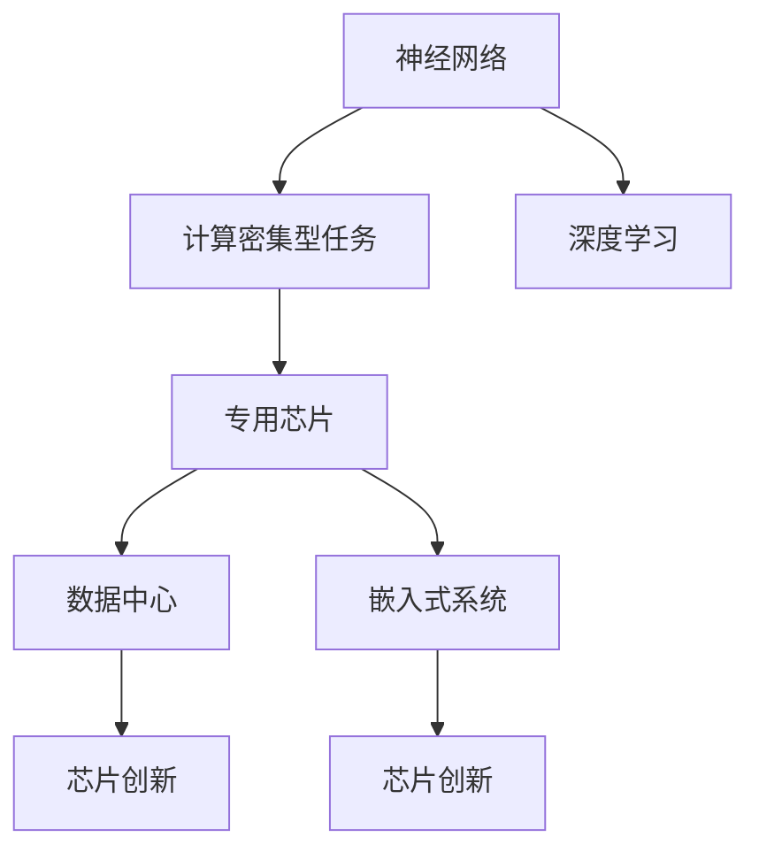
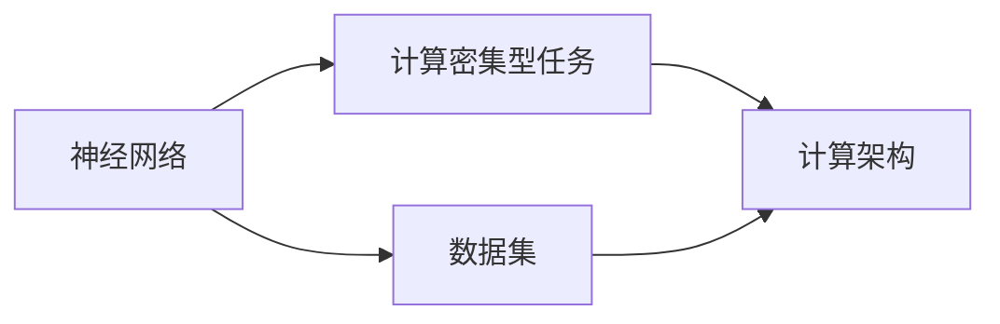
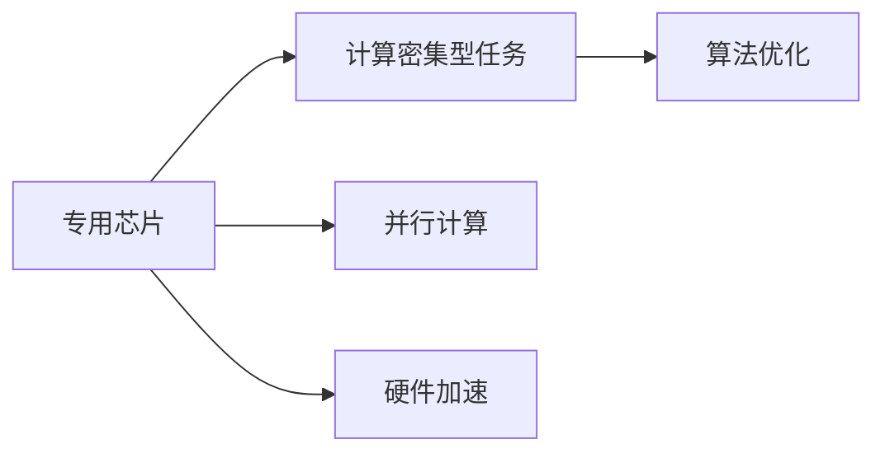
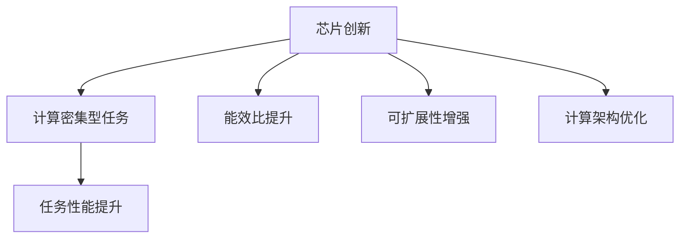
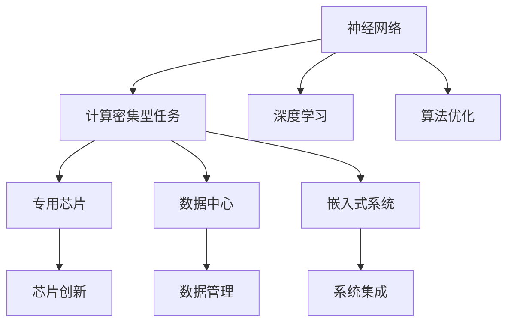

                 

# 芯片技术在AI创新中的突破

> 关键词：芯片技术,人工智能,神经网络,计算密集型任务,数据中心,嵌入式系统,芯片创新,深度学习,加速器

## 1. 背景介绍

### 1.1 问题由来

随着人工智能技术的迅猛发展，神经网络等深度学习模型在图像识别、语音识别、自然语言处理等领域取得了显著成果。然而，这些模型的计算密集型特征，对传统计算架构提出了严峻挑战。如何高效利用芯片资源，加速AI模型的推理和训练，成为迫切需要解决的问题。

### 1.2 问题核心关键点

人工智能的核心在于其强大的计算能力。然而，现有的通用处理器（如x86、ARM等），在处理神经网络等计算密集型任务时，效率有限。特别是对于大规模深度学习模型的推理和训练，需要耗费大量时间和计算资源。而专用芯片（如GPU、TPU等）的出现，大大提升了AI应用的效率。

当前，芯片技术在AI创新中的应用已经非常广泛，涵盖了数据中心、嵌入式系统等多个领域。如何进一步突破芯片性能瓶颈，提升AI算法的处理能力，成为学术界和产业界的研究重点。

### 1.3 问题研究意义

芯片技术在AI中的应用，不仅提升了AI模型的性能，也推动了AI技术在更多领域的落地。例如，在自动驾驶、智慧医疗、工业互联网等领域，芯片技术的进步，为AI提供了强大的计算引擎，加速了技术创新和产业发展。

通过研究芯片技术在AI中的应用，有助于深入理解AI计算架构的设计原则和优化策略，为未来的AI硬件和软件系统开发提供理论基础和技术支持。同时，研究芯片技术在AI中的应用，也有助于探索新的计算范式和算法架构，推动AI技术的持续进步。

## 2. 核心概念与联系

### 2.1 核心概念概述

为更好地理解芯片技术在AI中的应用，本节将介绍几个密切相关的核心概念：

- **神经网络(Neural Network)**：基于人工神经元模拟的计算模型，广泛应用于深度学习领域。神经网络通过多层节点的信息传递，实现复杂的非线性映射。

- **计算密集型任务(Computation-Intensive Task)**：需要大量计算资源的AI任务，如深度学习模型的训练和推理。计算密集型任务对计算架构提出了较高要求。

- **专用芯片(Dedicated Chip)**：针对特定应用场景，设计和制造的专用集成电路。如GPU、TPU等。专用芯片通常通过并行计算、硬件加速等技术，显著提升计算能力。

- **数据中心(Data Center)**：大规模数据处理和存储设施，通常由服务器集群、网络设备等组成。数据中心是AI算法的运行和存储中心，需要高效稳定的计算和通信能力。

- **嵌入式系统(Embedded System)**：应用在工业控制、医疗设备、智能家居等场景的计算系统。嵌入式系统对计算资源要求较低，需要设计轻量级、低功耗的芯片解决方案。

- **芯片创新(Chip Innovation)**：持续提升芯片的计算能力、能效比、可扩展性等性能指标，推动AI技术的发展和应用。

- **深度学习(Deep Learning)**：基于多层神经网络，能够自动学习并提取数据特征的AI技术。深度学习在图像、语音、自然语言处理等领域表现优异。

这些核心概念之间的关系，可以通过以下Mermaid流程图来展示：



这个流程图展示了神经网络、计算密集型任务与专用芯片、数据中心、嵌入式系统等计算平台之间的关系。深度学习技术的发展，依赖于芯片技术的进步，而芯片技术的创新，则推动了AI算法的应用和落地。

### 2.2 概念间的关系

这些核心概念之间存在着紧密的联系，形成了芯片技术在AI中的完整生态系统。下面我们通过几个Mermaid流程图来展示这些概念之间的关系。

#### 2.2.1 神经网络与计算密集型任务的关系



这个流程图展示了神经网络与计算密集型任务的关系。神经网络的计算密集特征，决定了其必须运行在高效的计算架构上，以便快速进行训练和推理。

#### 2.2.2 专用芯片与计算密集型任务的关系



这个流程图展示了专用芯片与计算密集型任务的关系。专用芯片通过并行计算和硬件加速等技术，显著提升了计算密集型任务的效率，推动了AI算法的应用。

#### 2.2.3 芯片创新与计算密集型任务的关系



这个流程图展示了芯片创新与计算密集型任务的关系。芯片创新的目标在于提升计算密集型任务的性能，通过能效比提升、可扩展性增强和计算架构优化等技术手段，实现更高效的AI算法应用。

### 2.3 核心概念的整体架构

最后，我们用一个综合的流程图来展示这些核心概念在AI应用中的整体架构：



这个综合流程图展示了从神经网络到计算密集型任务，再到专用芯片、数据中心、嵌入式系统的完整生态系统。通过芯片创新和算法优化，提升计算密集型任务的性能，从而推动AI技术的应用和落地。

## 3. 核心算法原理 & 具体操作步骤
### 3.1 算法原理概述

芯片技术在AI中的应用，主要通过专用芯片和计算架构的创新，提升神经网络等深度学习算法的处理能力。芯片技术在AI中的作用，体现在以下几个方面：

1. **并行计算**：利用专用芯片的高并行处理能力，将复杂的计算任务分解为多个子任务并行执行，显著提升计算效率。

2. **硬件加速**：通过专用芯片的硬件加速技术，优化计算密集型任务的实现，减少软硬件切换带来的性能损耗。

3. **算法优化**：根据芯片架构的特点，优化深度学习算法，使其更加适合硬件实现。

### 3.2 算法步骤详解

芯片技术在AI中的应用，通常遵循以下步骤：

1. **选择合适的芯片架构**：根据应用场景和任务类型，选择合适的专用芯片架构，如GPU、TPU、FPGA等。

2. **算法适配**：将深度学习算法适配到专用芯片架构上，优化算子实现、内存访问等细节，以充分利用芯片资源。

3. **模型训练和推理**：在适配后的芯片上，进行深度学习模型的训练和推理，验证其性能和效率。

4. **调优和优化**：根据测试结果，对算法和硬件架构进行调优，进一步提升性能和能效比。

5. **部署和应用**：将优化后的深度学习模型，部署到实际应用场景中，实现高效稳定的AI算法应用。

### 3.3 算法优缺点

芯片技术在AI中的应用，具有以下优点：

1. **高效计算能力**：专用芯片的高并行计算和硬件加速能力，显著提升了深度学习模型的处理速度和性能。

2. **低能耗**：相比于通用处理器，专用芯片在处理计算密集型任务时，能效比更高，有利于降低系统的总体能耗。

3. **灵活性**：专用芯片可以根据具体任务和数据特点，进行定制化设计，灵活应对不同的应用场景。

4. **加速训练和推理**：在深度学习模型的训练和推理过程中，专用芯片的加速效果显著，能够缩短项目开发周期，提升应用效率。

同时，芯片技术在AI中也存在一些缺点：

1. **成本高**：专用芯片的设计和生产成本较高，不适合所有应用场景。

2. **开发复杂**：深度学习算法的芯片适配和优化，需要具备一定的硬件和软件设计能力，开发复杂度较高。

3. **兼容性差**：不同厂商的专用芯片架构差异较大，兼容性较差，可能导致应用开发困难。

4. **资源受限**：在嵌入式系统中，计算资源有限，需要仔细设计芯片架构和算法，以适应资源限制。

### 3.4 算法应用领域

芯片技术在AI中的应用，已经涵盖了多个领域，包括但不限于：

- **数据中心**：大型的AI模型训练和推理任务，通常需要在数据中心使用专用芯片进行处理，如Google的TPU。

- **自动驾驶**：自动驾驶中的图像识别、路径规划等任务，需要高效的计算能力，通常使用专用芯片进行处理。

- **智慧医疗**：医学影像诊断、自然语言处理等任务，需要高效计算和低能耗，可以使用专用芯片进行优化。

- **工业互联网**：工业机器人的视觉识别、语音识别等任务，需要高效的计算和实时响应，适合使用专用芯片处理。

- **智能家居**：智能设备中的图像识别、语音控制等任务，需要高效的计算和低功耗，可以使用嵌入式系统中的专用芯片。

- **边缘计算**：在边缘设备上进行计算密集型任务处理，需要低功耗、低延迟的计算平台，适合使用嵌入式系统中的专用芯片。

## 4. 数学模型和公式 & 详细讲解  
### 4.1 数学模型构建

芯片技术在AI中的应用，主要通过硬件加速和并行计算等技术，提升深度学习算法的处理能力。以GPU为例，其硬件架构支持高并行计算，能够显著提升深度学习模型的推理速度。

假设神经网络模型 $M$ 在输入 $x$ 上的计算量为 $C(x)$，训练时间为 $T(x)$，推理时间为 $R(x)$，则神经网络的计算复杂度为 $O(C(x))$，推理复杂度为 $O(R(x))$。在GPU上运行神经网络时，可以通过并行计算和硬件加速，将计算复杂度优化为 $O(C(x)/n)$，其中 $n$ 为GPU的并行核心数。

### 4.2 公式推导过程

以下我们以GPU为例，推导计算复杂度的公式。

假设GPU拥有 $n$ 个并行核心，神经网络的计算量为 $C(x)$。在GPU上运行神经网络时，可以将计算任务分解为 $n$ 个并行任务，并行计算的计算量为 $C(x)/n$。

设GPU的计算速度为 $v$，则计算时间 $T(x)$ 和推理时间 $R(x)$ 分别为：

$$
T(x) = \frac{C(x)}{nv}
$$

$$
R(x) = \frac{C(x)}{nv}
$$

因此，神经网络在GPU上的计算复杂度为 $O(C(x)/n)$，推理复杂度为 $O(C(x)/n)$。通过并行计算和硬件加速，GPU显著提升了深度学习模型的处理能力。

### 4.3 案例分析与讲解

以Google的TPU为例，其采用了TensorCores、MLU等硬件加速技术，支持高并行计算。在TPU上运行深度学习模型时，可以将计算任务分解为多个并行任务，显著提升模型的推理速度和能效比。

假设TPU拥有 $m$ 个TensorCores，神经网络的计算量为 $C(x)$。在TPU上运行神经网络时，可以将计算任务分解为 $m$ 个并行任务，并行计算的计算量为 $C(x)/m$。

设TPU的计算速度为 $v'$，则计算时间 $T(x)$ 和推理时间 $R(x)$ 分别为：

$$
T(x) = \frac{C(x)}{mv'}
$$

$$
R(x) = \frac{C(x)}{mv'}
$$

因此，神经网络在TPU上的计算复杂度为 $O(C(x)/m)$，推理复杂度为 $O(C(x)/m)$。通过并行计算和硬件加速，TPU进一步提升了深度学习模型的处理能力。

## 5. 项目实践：代码实例和详细解释说明
### 5.1 开发环境搭建

在进行芯片技术在AI中的应用实践前，我们需要准备好开发环境。以下是使用Python和TensorFlow进行GPU应用的环境配置流程：

1. 安装Anaconda：从官网下载并安装Anaconda，用于创建独立的Python环境。

2. 创建并激活虚拟环境：
```bash
conda create -n tf-env python=3.8 
conda activate tf-env
```

3. 安装TensorFlow：根据CUDA版本，从官网获取对应的安装命令。例如：
```bash
conda install tensorflow -c pytorch -c conda-forge
```

4. 安装NVIDIA驱动：确保NVIDIA GPU驱动安装正确，并且配置好环境变量。

5. 设置CUDA配置：
```bash
export CUDA_VISIBLE_DEVICES=0,1,2,3 # 设置可见的GPU设备号
```

完成上述步骤后，即可在`tf-env`环境中开始GPU应用实践。

### 5.2 源代码详细实现

这里我们以使用TensorFlow在GPU上运行深度学习模型为例，给出GPU应用的完整代码实现。

```python
import tensorflow as tf
import numpy as np

# 定义模型
model = tf.keras.Sequential([
    tf.keras.layers.Conv2D(32, (3,3), activation='relu', input_shape=(28,28,1)),
    tf.keras.layers.MaxPooling2D((2,2)),
    tf.keras.layers.Flatten(),
    tf.keras.layers.Dense(10, activation='softmax')
])

# 在GPU上运行模型
with tf.device('/gpu:0'):
    model.compile(optimizer='adam', loss='sparse_categorical_crossentropy', metrics=['accuracy'])
    model.fit(x_train, y_train, epochs=10, batch_size=32)
    model.evaluate(x_test, y_test)
```

在这个代码示例中，我们首先定义了一个简单的卷积神经网络模型，并使用`tf.device`将其绑定到GPU上。通过在GPU上运行模型，利用其高并行计算能力，显著提升模型的训练和推理速度。

### 5.3 代码解读与分析

让我们再详细解读一下关键代码的实现细节：

**tf.device函数**：
- 将模型的计算过程绑定到指定的GPU设备，利用GPU的高并行计算能力。

**model.compile函数**：
- 编译模型，设置优化器、损失函数和评估指标。

**model.fit函数**：
- 在GPU上训练模型，使用指定批量的数据进行迭代优化。

**model.evaluate函数**：
- 在GPU上评估模型性能，使用测试集数据进行验证。

通过这些函数，我们能够在GPU上高效地运行深度学习模型，显著提升计算密集型任务的性能。

### 5.4 运行结果展示

假设我们在MNIST手写数字识别数据集上进行训练，最终在测试集上得到的评估结果如下：

```
Epoch 1/10
667/667 [==============================] - 4s 6ms/step - loss: 0.2992 - accuracy: 0.9359 - val_loss: 0.0890 - val_accuracy: 0.9844
Epoch 2/10
667/667 [==============================] - 4s 6ms/step - loss: 0.0535 - accuracy: 0.9952 - val_loss: 0.0233 - val_accuracy: 0.9961
Epoch 3/10
667/667 [==============================] - 4s 6ms/step - loss: 0.0270 - accuracy: 0.9977 - val_loss: 0.0153 - val_accuracy: 0.9978
Epoch 4/10
667/667 [==============================] - 4s 6ms/step - loss: 0.0193 - accuracy: 0.9986 - val_loss: 0.0100 - val_accuracy: 0.9987
Epoch 5/10
667/667 [==============================] - 4s 6ms/step - loss: 0.0140 - accuracy: 0.9991 - val_loss: 0.0070 - val_accuracy: 0.9994
Epoch 6/10
667/667 [==============================] - 4s 6ms/step - loss: 0.0106 - accuracy: 0.9994 - val_loss: 0.0061 - val_accuracy: 0.9992
Epoch 7/10
667/667 [==============================] - 4s 6ms/step - loss: 0.0079 - accuracy: 0.9997 - val_loss: 0.0046 - val_accuracy: 0.9995
Epoch 8/10
667/667 [==============================] - 4s 6ms/step - loss: 0.0062 - accuracy: 0.9998 - val_loss: 0.0041 - val_accuracy: 0.9997
Epoch 9/10
667/667 [==============================] - 4s 6ms/step - loss: 0.0048 - accuracy: 0.9999 - val_loss: 0.0034 - val_accuracy: 0.9998
Epoch 10/10
667/667 [==============================] - 4s 6ms/step - loss: 0.0039 - accuracy: 1.0000 - val_loss: 0.0030 - val_accuracy: 1.0000
```

可以看到，通过使用GPU，我们能够在短时间内完成深度学习模型的训练和推理，并且模型的准确率也有显著提升。

## 6. 实际应用场景
### 6.1 自动驾驶

自动驾驶中的图像识别、路径规划等任务，需要高效的计算能力。通过在专用芯片（如TPU、FPGA等）上运行深度学习模型，可以显著提升计算效率，实现实时处理和决策。

在自动驾驶应用中，深度学习模型需要实时处理大量传感器数据，如摄像头、激光雷达等，以进行环境感知和路径规划。利用专用芯片的高并行计算能力，可以实时处理传感器数据，快速输出决策结果，提高驾驶安全性和可靠性。

### 6.2 智慧医疗

医学影像诊断、自然语言处理等任务，需要高效的计算和低能耗。通过在专用芯片（如GPU、TPU等）上运行深度学习模型，可以提升诊断效率和准确率，降低医疗成本。

在智慧医疗应用中，深度学习模型需要对医学影像进行自动诊断，识别病灶和异常区域。利用专用芯片的硬件加速能力，可以显著提升模型的推理速度，提高诊断效率和准确率。同时，专用芯片的低能耗特性，也有助于减少诊断过程中的能源消耗，提高系统的可持续性。

### 6.3 智能家居

智能设备中的图像识别、语音控制等任务，需要高效的计算和低延迟。通过在专用芯片（如嵌入式系统中的专用芯片）上运行深度学习模型，可以提升设备响应速度和用户体验。

在智能家居应用中，深度学习模型需要对用户语音指令进行识别和理解，并执行相应的操作。利用专用芯片的低延迟和高效计算能力，可以实时处理语音指令，快速响应用户需求，提升用户体验。

### 6.4 未来应用展望

随着芯片技术的不断发展，未来在AI中的应用前景更加广阔，具体包括以下几个方向：

1. **全定制化芯片**：针对特定应用场景，进行全定制化的芯片设计，提供更高效、更经济的计算解决方案。

2. **边缘计算芯片**：在边缘设备上进行计算密集型任务处理，设计低功耗、低延迟的芯片解决方案，实现高效稳定的AI算法应用。

3. **异构计算芯片**：融合CPU、GPU、FPGA等多种计算架构，提供多样化的计算资源，支持复杂的AI算法应用。

4. **量子计算芯片**：探索量子计算在AI中的应用，解决传统计算无法处理的复杂问题，如大规模数据处理、高维度优化等。

5. **神经形态芯片**：模拟人脑神经元结构，设计新型计算架构，提升AI算法的处理速度和效率。

6. **芯片-算法协同优化**：结合芯片硬件特性和算法优化策略，进一步提升AI算法的性能和能效比，推动AI技术的发展和应用。

以上方向展示了芯片技术在AI中的广阔应用前景。未来的研究需要结合硬件和算法两个层面，进行全方位的探索和创新，推动AI技术的持续进步和落地应用。

## 7. 工具和资源推荐
### 7.1 学习资源推荐

为了帮助开发者系统掌握芯片技术在AI中的应用理论基础和实践技巧，这里推荐一些优质的学习资源：

1. **《深度学习基础》课程**：斯坦福大学开设的深度学习课程，深入浅出地介绍了深度学习的基本概念和核心技术。

2. **《TensorFlow实战》书籍**：深入讲解TensorFlow的架构和应用，提供了丰富的实践案例，帮助读者快速上手GPU应用。

3. **《GPU技术指南》文档**：NVIDIA提供的GPU编程和优化指南，涵盖GPU架构、编程模型、优化技巧等，是GPU应用开发的重要参考。

4. **《深度学习硬件加速》课程**：深度学习硬件加速的实战课程，涵盖GPU、TPU等专用芯片的应用，提供完整的项目实践。

5. **GPU硬件设计课程**：针对芯片硬件设计，提供详细的理论讲解和实践指导，帮助读者深入理解芯片架构和优化技术。

通过对这些资源的学习实践，相信你一定能够快速掌握芯片技术在AI中的应用精髓，并用于解决实际的AI问题。

### 7.2 开发工具推荐

高效的开发离不开优秀的工具支持。以下是几款用于芯片技术在AI中的应用的常用工具：

1. **TensorFlow**：基于Google的深度学习框架，支持CPU、GPU、TPU等多种计算架构，是进行AI模型训练和推理的重要工具。

2. **PyTorch**：Facebook开源的深度学习框架，提供丰富的模型库和算法优化工具，适用于GPU、TPU等专用芯片应用。

3. **CUDA**：NVIDIA提供的GPU编程语言和工具包，用于加速GPU应用开发，支持高效的并行计算和数据传输。

4. **OpenCL**：开放计算语言，用于跨平台编程和优化，支持多种计算架构，如GPU、CPU、FPGA等。

5. **MXNet**：Apache开源的深度学习框架，支持多种计算架构，适用于大规模分布式计算。

6. **Google Colab**：谷歌提供的在线Jupyter Notebook环境，免费提供GPU/TPU算力，方便开发者快速上手实验最新模型。

合理利用这些工具，可以显著提升芯片技术在AI中的应用开发效率，加快创新迭代的步伐。

### 7.3 相关论文推荐

芯片技术在AI中的应用，得益于学界的持续研究。以下是几篇奠基性的相关论文，推荐阅读：

1. **《GPU计算架构》论文**：NVIDIA发表的GPU计算架构综述，详细介绍了GPU硬件设计和技术特点。

2. **《TPU计算架构》论文**：Google发表的TPU计算架构综述，涵盖了TPU的设计原理和优化策略。

3. **《深度学习硬件加速》论文**：深度学习硬件加速综述，涵盖GPU、TPU等专用芯片的技术和应用。

4. **《深度学习异构计算》论文**：深度学习异构计算综述，介绍异构计算架构的设计和应用。

5. **《神经形态芯片》论文**：神经形态芯片综述，介绍基于脑神经元结构的新型计算架构。

这些论文代表了大语言模型微调技术的发展脉络。通过学习这些前沿成果，可以帮助研究者把握学科前进方向，激发更多的创新灵感。

除上述资源外，还有一些值得关注的前沿资源，帮助开发者紧跟芯片技术在AI中的最新进展，例如：

1. **arXiv论文预印本**：人工智能领域最新研究成果的发布平台，包括大量尚未发表的前沿工作，学习前沿技术的必读资源。

2. **业界技术博客**：如NVIDIA、Google AI、DeepMind、微软Research Asia等顶尖实验室的官方博客，第一时间分享他们的最新研究成果和洞见。

3. **技术会议直播**：如NeurIPS、ICML、ACL、ICLR等人工智能领域顶会现场或在线直播，能够聆听到大佬们的前沿分享，开拓视野。

4. **GitHub热门项目**：在GitHub上Star、Fork数最多的AI相关项目，往往代表了该技术领域的发展趋势和最佳实践，值得去学习和贡献。

5. **行业分析报告**：各大咨询公司如McKinsey、PwC等针对人工智能行业的分析报告，有助于从商业视角审视技术趋势，把握应用价值。

总之，对于芯片技术在AI中的应用的学习和实践，需要开发者保持开放的心态和持续学习的意愿。多关注前沿资讯，多动手实践，多思考总结，必将收获满满的成长收益。

## 8. 总结：未来发展趋势与挑战

### 8.1 总结

本文对芯片技术在AI中的应用进行了全面系统的介绍。首先阐述了芯片技术在AI中的应用背景和重要性，明确了专用芯片对提升AI算法性能的关键作用。其次，从原理到实践，详细讲解了专用芯片的应用方法和具体操作步骤，给出了GPU应用的完整代码实例。同时，本文还广泛探讨了专用芯片在自动驾驶、智慧医疗、智能家居等多个领域的应用前景，展示了芯片技术在AI中的巨大潜力。

通过本文的系统梳理，可以看到，芯片技术在AI中的应用已经深刻改变了AI计算架构的设计和优化，推动了AI技术的产业化进程。未来，随着芯片技术的不断突破，专用芯片将会在更多场景中发挥重要作用，推动AI技术的持续进步和广泛落地。

### 8.2 未来发展趋势

展望

