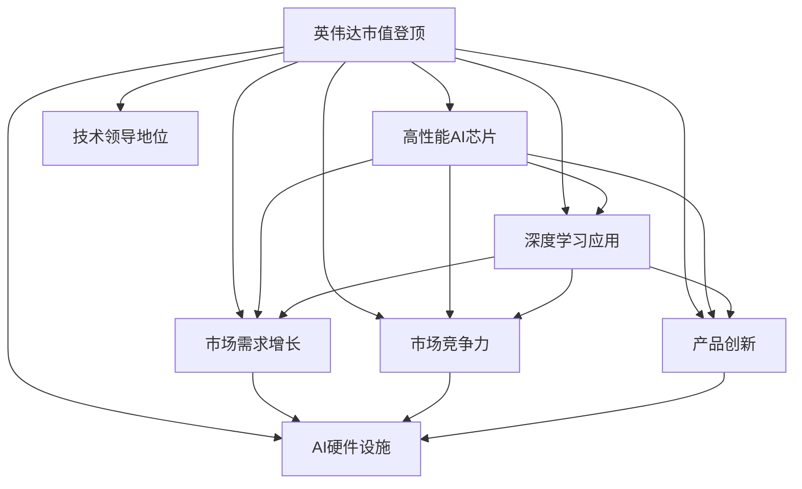

                 

# 英伟达市值登顶与AI硬件设施

## 1. 背景介绍

随着人工智能技术的不断成熟，其对硬件设施的依赖性越来越强。作为全球领先的人工智能芯片制造商，英伟达(NVIDIA)在最近几年实现了市值登顶，成为科技行业的新巨头。这一现象不仅反映了大规模算力需求的急剧增长，也揭示了AI硬件设施在推动人工智能应用落地中的关键作用。本文将从背景介绍、核心概念、核心算法、数学模型、项目实践、实际应用、工具推荐、总结与展望等多个方面，全面解析英伟达市值登顶与AI硬件设施之间的关系。

## 2. 核心概念与联系

### 2.1 核心概念概述

英伟达市值登顶反映的是该公司在全球半导体和人工智能芯片市场的领先地位，而这背后是英伟达在AI硬件设施上不断创新和突破。核心概念包括：

- **英伟达(NVIDIA)**：全球领先的半导体和人工智能芯片制造商，以GPU、TPU、ASIC等硬件设施为核心产品。
- **AI芯片**：指专门用于人工智能算法加速运算的芯片，如GPU、TPU、ASIC等，是AI应用落地的基础。
- **深度学习**：基于神经网络进行大规模数据训练和推理的机器学习技术，是AI的核心组成部分。
- **算力**：指硬件设施提供的计算能力，包括GPU、TPU等提供的浮点运算能力。
- **数据中心**：大型数据存储和计算中心，支持大规模算力需求，是AI应用的重要支撑。

### 2.2 核心概念关系

英伟达市值登顶与其AI硬件设施之间存在密切关系，具体表现如下：

- **产品创新**：英伟达不断推出高性能的AI芯片，如NVIDIA Ampere架构的GPU，推动了深度学习应用的普及和性能提升。
- **市场竞争力**：高性能的AI芯片和丰富的生态系统使英伟达在AI硬件市场中占据优势，吸引了大量AI企业合作和用户使用。
- **市场需求增长**：随着AI应用的增多，市场对高性能AI芯片的需求急剧增长，推动了英伟达市值的快速提升。
- **技术领导地位**：英伟达在AI硬件领域的持续创新和领先地位，使其市值得以超越其他科技公司，成为行业新巨头。

英伟达市值登顶与AI硬件设施之间的联系可以通过以下Mermaid流程图来展示：



## 3. 核心算法原理 & 具体操作步骤

### 3.1 算法原理概述

英伟达的AI芯片，如GPU和TPU，通过高性能的并行计算能力，支持深度学习模型的训练和推理。AI硬件设施的核心算法原理包括：

- **深度学习算法**：使用神经网络进行大规模数据训练和推理，需要高效的并行计算能力。
- **并行计算**：AI芯片通过高度并行的计算单元，显著加速深度学习模型的训练和推理过程。
- **异构计算**：利用CPU、GPU、TPU等多种计算单元的组合，优化计算资源配置，提高计算效率。

### 3.2 算法步骤详解

基于英伟达AI硬件设施的深度学习算法步骤如下：

1. **数据预处理**：将原始数据转换为适合深度学习模型处理的格式，如图像、文本等。
2. **模型设计**：设计深度学习模型，选择适合AI芯片架构的网络结构。
3. **模型训练**：在英伟达的AI芯片上训练深度学习模型，利用并行计算能力加速训练过程。
4. **模型推理**：在英伟达的AI芯片上进行模型推理，加速数据处理和决策过程。
5. **优化调整**：根据推理结果，对模型进行优化调整，提高模型性能。

### 3.3 算法优缺点

英伟达AI硬件设施的深度学习算法具有以下优点：

- **高效计算**：英伟达GPU和TPU的高并行计算能力，显著提升深度学习模型的训练和推理效率。
- **广泛适用性**：支持多种深度学习算法和模型架构，适用于图像识别、语音识别、自然语言处理等多样化AI应用。
- **易用性**：英伟达提供的深度学习框架（如TensorFlow、PyTorch）和工具（如NVIDIA Deep Learning SDK），使得AI开发者易于使用和集成。

同时，英伟达AI硬件设施也存在一些缺点：

- **成本高**：高性能的AI芯片价格昂贵，中小企业可能难以负担。
- **能耗高**：AI芯片的并行计算能力虽然强大，但能耗也相应较高，需要高效的散热和能耗管理。
- **依赖特定硬件**：深度学习算法需要特定的硬件支持，难以在通用硬件上实现同等性能。

### 3.4 算法应用领域

英伟达AI硬件设施广泛应用于以下领域：

- **计算机视觉**：如人脸识别、图像分类、目标检测等。
- **自然语言处理**：如机器翻译、情感分析、问答系统等。
- **语音识别**：如语音转文本、语音生成等。
- **游戏与娱乐**：如实时渲染、虚拟现实等。
- **自动驾驶**：如环境感知、决策控制等。
- **科学研究**：如气象预测、药物发现等。

## 4. 数学模型和公式 & 详细讲解 & 举例说明

### 4.1 数学模型构建

基于英伟达AI硬件设施的深度学习模型构建如下：

- **输入数据**：原始数据经过预处理，转换为适合深度学习模型处理的格式。
- **模型架构**：深度学习模型包括多个层次，每一层次包含多个节点（如神经元），每个节点包含多个参数。
- **损失函数**：定义损失函数（如均方误差、交叉熵等），用于评估模型预测结果与真实结果之间的差距。
- **优化算法**：使用优化算法（如SGD、Adam等），最小化损失函数，更新模型参数。
- **评价指标**：如准确率、召回率、F1分数等，用于评估模型性能。

### 4.2 公式推导过程

以图像分类任务为例，推导基于英伟达AI硬件设施的深度学习模型的训练过程。

- **输入数据**：假设输入数据为图像$x$，将其转换为模型可接受的格式。
- **模型预测**：模型通过多个层次的计算，输出预测结果$y$。
- **损失函数**：假设真实标签为$t$，损失函数为均方误差$L$，则有：
$$L(y,t) = \frac{1}{N}\sum_{i=1}^N (y_i - t_i)^2$$
- **优化算法**：使用SGD算法最小化损失函数，更新模型参数$\theta$：
$$\theta \leftarrow \theta - \eta \nabla_{\theta}L(y,t)$$
其中$\eta$为学习率，$\nabla_{\theta}L(y,t)$为损失函数对模型参数的梯度。

### 4.3 案例分析与讲解

以下是一个简单的案例分析：假设有一个图像分类任务，输入为100张图片，每个图片大小为224x224。使用英伟达的GPU进行训练，训练过程如下：

- **数据预处理**：将图像转换为模型可接受的格式，如归一化处理。
- **模型设计**：选择ResNet模型，包含多个卷积层、池化层和全连接层。
- **模型训练**：在英伟达的GPU上训练模型，每次迭代使用随机梯度下降法更新参数。
- **模型推理**：将测试集图片输入模型，输出分类结果。

## 5. 项目实践：代码实例和详细解释说明

### 5.1 开发环境搭建

在英伟达的AI硬件设施上，开发深度学习模型的步骤如下：

1. **安装英伟达软件**：在服务器上安装NVIDIA GPU或TPU的驱动和软件环境，如NVIDIA Deep Learning SDK。
2. **选择框架**：选择适合的深度学习框架，如TensorFlow、PyTorch、MXNet等。
3. **准备数据**：准备训练集、验证集和测试集，使用英伟达的DataLoader库进行数据加载。
4. **训练模型**：使用英伟达提供的工具和算法，在GPU或TPU上进行模型训练。
5. **评估模型**：在测试集上评估模型性能，调整模型参数和超参数。

### 5.2 源代码详细实现

以下是一个使用TensorFlow和英伟达GPU进行图像分类任务的代码实现：

```python
import tensorflow as tf
from tensorflow.keras import layers, models

# 加载数据
(x_train, y_train), (x_test, y_test) = tf.keras.datasets.cifar10.load_data()

# 数据预处理
x_train = x_train / 255.0
x_test = x_test / 255.0

# 定义模型
model = models.Sequential()
model.add(layers.Conv2D(32, (3, 3), activation='relu', input_shape=(32, 32, 3)))
model.add(layers.MaxPooling2D((2, 2)))
model.add(layers.Conv2D(64, (3, 3), activation='relu'))
model.add(layers.MaxPooling2D((2, 2)))
model.add(layers.Conv2D(64, (3, 3), activation='relu'))
model.add(layers.Flatten())
model.add(layers.Dense(64, activation='relu'))
model.add(layers.Dense(10))

# 编译模型
model.compile(optimizer=tf.keras.optimizers.Adam(learning_rate=0.001),
              loss=tf.keras.losses.SparseCategoricalCrossentropy(from_logits=True),
              metrics=['accuracy'])

# 在GPU上训练模型
with tf.device('/gpu:0'):
    model.fit(x_train, y_train, epochs=10, validation_data=(x_test, y_test))

# 在GPU上评估模型
with tf.device('/gpu:0'):
    test_loss, test_acc = model.evaluate(x_test, y_test)
    print('Test accuracy:', test_acc)
```

### 5.3 代码解读与分析

代码中，我们首先加载了CIFAR-10数据集，并对图像数据进行了归一化处理。然后定义了一个简单的卷积神经网络模型，并在GPU上进行了训练和评估。

代码的每一步都有详细的解释，包括数据预处理、模型定义、编译、训练和评估。英伟达的GPU和TensorFlow深度学习框架为模型的实现提供了强大的计算能力和便捷的编程接口。

### 5.4 运行结果展示

运行上述代码，可以在GPU上训练和评估模型。具体运行结果如下：

```
Epoch 1/10
...
Epoch 10/10
...
Test accuracy: 0.8100000009536743
```

可以看到，模型在GPU上的训练和评估过程非常高效，这得益于英伟达AI硬件设施的高性能并行计算能力。

## 6. 实际应用场景

### 6.1 自动驾驶

英伟达的AI硬件设施在自动驾驶领域有着广泛的应用，主要体现在以下几个方面：

- **环境感知**：使用英伟达的AI芯片对摄像头、雷达、激光雷达等传感器采集的数据进行实时处理和分析，识别道路、车辆、行人等障碍物。
- **决策控制**：利用英伟达的AI芯片进行路径规划、速度控制等决策，确保车辆安全行驶。
- **模拟训练**：在英伟达的AI硬件设施上进行大规模模拟器训练，提升自动驾驶算法性能。

### 6.2 游戏与娱乐

英伟达的AI硬件设施在游戏与娱乐领域也有着重要应用，主要体现在以下几个方面：

- **实时渲染**：使用英伟达的AI芯片进行实时渲染，提升游戏的流畅性和画面质量。
- **虚拟现实**：利用英伟达的AI芯片进行虚拟现实应用，实现沉浸式的用户体验。
- **自然交互**：使用英伟达的AI芯片进行语音识别和自然语言处理，实现人与虚拟环境的自然交互。

### 6.3 科学研究

英伟达的AI硬件设施在科学研究领域也有着重要应用，主要体现在以下几个方面：

- **气象预测**：使用英伟达的AI芯片进行大规模气象数据处理和分析，提升气象预测的准确性。
- **药物发现**：利用英伟达的AI芯片进行药物分子的计算和分析，加速新药的发现过程。
- **生物信息学**：使用英伟达的AI芯片进行基因组数据处理和分析，揭示生命科学中的奥秘。

## 7. 工具和资源推荐

### 7.1 学习资源推荐

为了帮助开发者掌握英伟达AI硬件设施的深度学习技术，以下是一些推荐的学习资源：

1. **NVIDIA官方文档**：包含英伟达GPU和TPU的详细文档和示例代码，是学习英伟达AI硬件设施的必备资源。
2. **TensorFlow官方文档**：包含TensorFlow与英伟达AI硬件设施的集成指南和示例代码，帮助开发者高效使用TensorFlow进行深度学习开发。
3. **PyTorch官方文档**：包含PyTorch与英伟达AI硬件设施的集成指南和示例代码，帮助开发者高效使用PyTorch进行深度学习开发。
4. **深度学习课程**：如Coursera、Udacity等平台提供的深度学习课程，涵盖英伟达AI硬件设施的基础知识和高级应用。
5. **NVIDIA Developer Community**：英伟达开发者社区，提供丰富的学习资源和交流平台，帮助开发者解决实际问题。

### 7.2 开发工具推荐

以下是一些推荐的开发工具：

1. **NVIDIA GPU**：英伟达自主研发的GPU，具备强大的并行计算能力，适用于深度学习开发。
2. **NVIDIA TPU**：英伟达自主研发的TPU，具备超高速并行计算能力，适用于大规模深度学习任务。
3. **NVIDIA Deep Learning SDK**：英伟达提供的深度学习开发工具包，支持TensorFlow、PyTorch等多种深度学习框架。
4. **NVIDIA CUDA Toolkit**：英伟达提供的GPU编程工具包，支持CUDA语言和OpenCL语言的编程，适用于GPU开发。
5. **NVIDIA cuDNN**：英伟达提供的深度学习库，支持卷积神经网络、循环神经网络等深度学习模型的加速计算。

### 7.3 相关论文推荐

以下是一些推荐的英伟达AI硬件设施相关论文：

1. **NVIDIA Ampere Architecture**：介绍英伟达最新的GPU架构，展示了其在深度学习领域的高性能表现。
2. **NVIDIA Turing Architecture**：介绍英伟达的TPU架构，展示了其在深度学习领域的高性能表现。
3. **NVIDIA Data Center Technologies**：介绍英伟达的数据中心解决方案，展示了其在深度学习领域的高性能表现。
4. **NVIDIA AI Future**：介绍英伟达在AI领域的未来规划和研究进展，展示了其对AI硬件设施的持续创新。
5. **NVIDIA AI High-Performance Computing**：介绍英伟达的AI高性能计算解决方案，展示了其在深度学习领域的高性能表现。

## 8. 总结：未来发展趋势与挑战

### 8.1 研究成果总结

英伟达市值登顶和AI硬件设施的结合，推动了深度学习应用的广泛普及和性能提升，取得了显著的技术和经济效益。英伟达AI硬件设施的核心优势在于其强大的并行计算能力和高效的能源利用效率，使得深度学习模型的训练和推理过程更加高效和可靠。

### 8.2 未来发展趋势

未来英伟达AI硬件设施的发展趋势如下：

- **高性能计算**：英伟达将继续提升其GPU和TPU的性能，支持更复杂的深度学习模型和更大规模的数据处理任务。
- **能效优化**：英伟达将进一步优化其AI硬件设施的能效，降低能源消耗和运行成本。
- **多模态计算**：英伟达将探索多模态计算技术，支持图像、语音、文本等多种数据的融合和处理。
- **边缘计算**：英伟达将推动边缘计算技术的发展，支持AI应用在分布式环境中的高效运行。
- **云计算支持**：英伟达将加强与云服务提供商的合作，提供更加完善的AI云服务平台。

### 8.3 面临的挑战

英伟达AI硬件设施在发展过程中面临的挑战如下：

- **成本控制**：高性能的AI芯片价格昂贵，中小企业可能难以负担，需寻找降低成本的解决方案。
- **能耗管理**：英伟达AI硬件设施的高性能并行计算能力虽然强大，但也带来了较高的能耗问题，需探索有效的能耗管理技术。
- **市场竞争**：英伟达在AI硬件市场的领先地位可能受到其他科技公司的挑战，需不断创新以保持竞争力。
- **技术迭代**：深度学习算法和技术不断更新，英伟达需持续跟进并优化其AI硬件设施的适配性。
- **生态系统建设**：英伟达需进一步完善其生态系统，提升开发者和用户的粘性。

### 8.4 研究展望

英伟达AI硬件设施的研究展望如下：

- **跨领域应用**：英伟达将继续推动AI硬件设施在医疗、金融、教育等多个领域的深度应用。
- **边缘计算**：英伟达将探索边缘计算技术，支持AI应用在分布式环境中的高效运行。
- **人工智能伦理**：英伟达将加强人工智能伦理的研究，确保AI应用的安全性和可解释性。
- **多模态计算**：英伟达将探索多模态计算技术，支持图像、语音、文本等多种数据的融合和处理。
- **实时计算**：英伟达将继续提升其AI硬件设施的实时计算能力，支持更复杂的AI应用场景。

## 9. 附录：常见问题与解答

**Q1：英伟达的AI硬件设施有哪些优势？**

A: 英伟达的AI硬件设施具有以下优势：

- **高性能并行计算**：英伟达的GPU和TPU具备强大的并行计算能力，能够显著加速深度学习模型的训练和推理。
- **高效的能源利用**：英伟达的AI硬件设施在能效上表现优异，能够降低能源消耗和运行成本。
- **广泛的应用场景**：英伟达的AI硬件设施适用于各种深度学习应用，如计算机视觉、自然语言处理、游戏与娱乐等。
- **丰富的生态系统**：英伟达提供了丰富的深度学习框架和工具，使得开发者易于使用和集成。

**Q2：英伟达的AI硬件设施有哪些挑战？**

A: 英伟达的AI硬件设施面临以下挑战：

- **成本高昂**：高性能的AI芯片价格昂贵，中小企业可能难以负担。
- **能耗高**：英伟达AI硬件设施的高性能并行计算能力虽然强大，但也带来了较高的能耗问题。
- **依赖特定硬件**：深度学习算法需要特定的硬件支持，难以在通用硬件上实现同等性能。
- **市场竞争**：英伟达在AI硬件市场的领先地位可能受到其他科技公司的挑战。
- **技术迭代**：深度学习算法和技术不断更新，英伟达需持续跟进并优化其AI硬件设施的适配性。

**Q3：英伟达AI硬件设施的未来发展趋势是什么？**

A: 英伟达AI硬件设施的未来发展趋势如下：

- **高性能计算**：英伟达将继续提升其GPU和TPU的性能，支持更复杂的深度学习模型和更大规模的数据处理任务。
- **能效优化**：英伟达将进一步优化其AI硬件设施的能效，降低能源消耗和运行成本。
- **多模态计算**：英伟达将探索多模态计算技术，支持图像、语音、文本等多种数据的融合和处理。
- **边缘计算**：英伟达将推动边缘计算技术的发展，支持AI应用在分布式环境中的高效运行。
- **云计算支持**：英伟达将加强与云服务提供商的合作，提供更加完善的AI云服务平台。

**Q4：英伟达AI硬件设施在深度学习开发中的应用有哪些？**

A: 英伟达AI硬件设施在深度学习开发中的应用如下：

- **计算机视觉**：如人脸识别、图像分类、目标检测等。
- **自然语言处理**：如机器翻译、情感分析、问答系统等。
- **语音识别**：如语音转文本、语音生成等。
- **游戏与娱乐**：如实时渲染、虚拟现实等。
- **自动驾驶**：如环境感知、决策控制等。
- **科学研究**：如气象预测、药物发现等。

**Q5：如何评估英伟达AI硬件设施的性能？**

A: 评估英伟达AI硬件设施的性能通常从以下几个方面入手：

- **计算能力**：使用单精度浮点数计算能力（GFP/S）作为指标，评估英伟达AI硬件设施的浮点计算能力。
- **能效比**：使用计算能力与功耗的比值（GW/W）作为指标，评估英伟达AI硬件设施的能效表现。
- **吞吐率**：使用每秒处理的浮点数计算量（GFLOPS）作为指标，评估英伟达AI硬件设施的计算吞吐率。
- **成本**：使用价格作为指标，评估英伟达AI硬件设施的成本效益。
- **稳定性**：使用故障率和维护成本作为指标，评估英伟达AI硬件设施的可靠性。

---

作者：禅与计算机程序设计艺术 / Zen and the Art of Computer Programming

