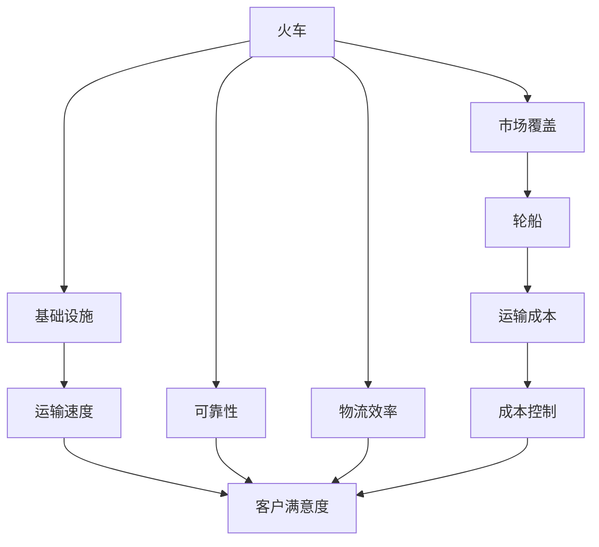
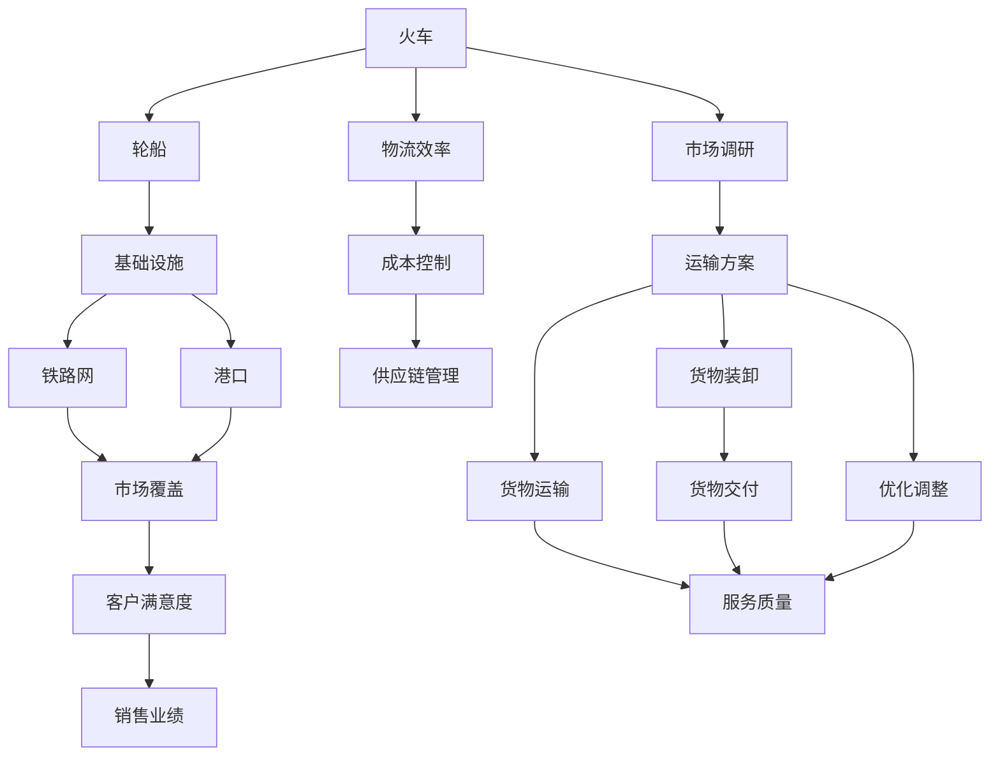

                 

# 规模化市场覆盖的手段：火车和轮船

> 关键词：
- 火车
- 轮船
- 市场覆盖
- 运力扩展
- 成本控制
- 基础设施
- 效率优化

## 1. 背景介绍

### 1.1 问题由来
在现代物流和商业活动中，如何高效、经济地实现大规模商品的运输和销售，是每个企业和商家关注的重点。传统上，火车和轮船是实现大规模市场覆盖的重要手段，两者在技术上各具特色，且在应用中相互补充。

### 1.2 问题核心关键点
本节将详细阐述火车和轮船在市场覆盖中的作用和优势，以及两者之间的区别和联系。

1. **火车的市场覆盖优势**：
   - **高效率**：火车能够一次运送大量货物，且速度较快，适合长距离、大批量货物的运输。
   - **可靠性强**：火车不受气候条件影响，可以全天候运行。
   - **基础设施完善**：火车依托铁路网，覆盖广泛，且在主要城市和经济区都有站点，便于货物上下客。

2. **轮船的市场覆盖优势**：
   - **运输成本低**：轮船适用于大规模海上运输，成本较低，适合远洋运输。
   - **运输范围广**：轮船能够跨越海洋，实现全球范围的货物运输。
   - **船舱空间大**：轮船拥有较大的舱容，适合运输大件和特殊货物。

### 1.3 问题研究意义
研究火车和轮船在市场覆盖中的应用，对于提升物流效率、降低运输成本、优化供应链管理具有重要意义。通过比较两者的优劣，可以为企业和商家提供合理的运输方案，从而更好地实现市场覆盖和商品销售。

## 2. 核心概念与联系

### 2.1 核心概念概述

为了更好地理解火车和轮船在市场覆盖中的作用和应用，本节将介绍几个关键概念：

1. **火车**：作为陆上运输的重要工具，火车通过铁路网络进行长距离货物的运输。火车的优点包括高效、可靠、基础设施完善等。

2. **轮船**：作为海上运输的重要工具，轮船通过海运网络进行大规模远洋货物的运输。轮船的优点包括成本低、运输范围广、船舱空间大等。

3. **市场覆盖**：指通过运输手段将商品从生产地运送到消费地，实现市场拓展和销售的过程。

4. **物流效率**：指在运输过程中，货物从起始地到目的地的全过程效率，包括运输速度、成本、稳定性等因素。

5. **基础设施**：指铁路、港口、公路等支撑运输的工具和设施，是实现高效运输的前提。

这些核心概念之间存在着紧密的联系，通过理解这些概念，可以更全面地掌握火车和轮船在市场覆盖中的应用。

### 2.2 概念间的关系

这些核心概念之间的关系可以通过以下Mermaid流程图来展示：



这个流程图展示了火车和轮船在市场覆盖中的核心作用和联系：

1. 火车和轮船是市场覆盖的两大重要工具，通过各自的优点和特点实现不同场景下的运输需求。
2. 物流效率、成本控制和客户满意度是衡量运输效果的关键指标，这些指标又受到基础设施、运输速度和可靠性的影响。
3. 成本控制对于企业和商家尤为重要，可以通过优化运输方式和提高物流效率来实现。

### 2.3 核心概念的整体架构

最后，我们用一个综合的流程图来展示这些核心概念在市场覆盖中的整体架构：



这个综合流程图展示了火车和轮船在市场覆盖中的整体架构：

1. 火车和轮船通过各自的运输工具和基础设施实现市场覆盖。
2. 客户满意度、销售业绩和服务质量是衡量市场覆盖效果的关键指标。
3. 物流效率和成本控制在优化运输方案和供应链管理中扮演重要角色。
4. 市场调研和运输方案优化是实现高效市场覆盖的前提。

这些概念共同构成了市场覆盖的完整框架，帮助企业和商家更好地规划和实施市场覆盖策略。

## 3. 核心算法原理 & 具体操作步骤

### 3.1 算法原理概述

在市场覆盖中，火车的运输和轮船的运输各有优劣。火车的优势在于速度快、效率高，适合陆地长距离运输；轮船的优势在于运输成本低、运输范围广，适合远洋运输。

火车的市场覆盖算法原理如下：

1. **需求分析**：收集市场数据，分析货物的运输需求和特性。
2. **路径规划**：根据需求分析结果，规划火车的运输路径，选择最优路线。
3. **运力分配**：根据货物种类和数量，分配火车的运力，实现货物的高效运输。
4. **动态调整**：根据实际情况，动态调整运输方案，确保高效运输。

轮船的市场覆盖算法原理如下：

1. **需求分析**：收集市场数据，分析货物的运输需求和特性。
2. **路径规划**：根据需求分析结果，规划轮船的运输路径，选择最优航线。
3. **运力分配**：根据货物种类和数量，分配轮船的运力，实现货物的远洋运输。
4. **动态调整**：根据实际情况，动态调整运输方案，确保高效运输。

### 3.2 算法步骤详解

#### 3.2.1 火车的算法步骤

1. **需求分析**：
   - 收集市场数据，分析货物的运输需求和特性。
   - 确定货物的起始地和目的地。
   - 分析货物的种类、数量和运输要求。

2. **路径规划**：
   - 根据需求分析结果，确定火车的起始点和终点。
   - 通过算法计算最优路径，包括选择最短路线、避免交通拥堵等。
   - 考虑铁路网的分布，规划火车的运输路径。

3. **运力分配**：
   - 根据货物的数量和体积，分配火车的运力，确保运输能力。
   - 考虑火车的承载量，合理安排货物装卸。
   - 避免超载和低载，确保运输效率。

4. **动态调整**：
   - 根据实际情况，动态调整运输方案，应对突发情况。
   - 实时监控运输状态，及时调整运输路径和运力分配。
   - 优化运输调度，提高运输效率和服务质量。

#### 3.2.2 轮船的算法步骤

1. **需求分析**：
   - 收集市场数据，分析货物的运输需求和特性。
   - 确定货物的起始地和目的地。
   - 分析货物的种类、数量和运输要求。

2. **路径规划**：
   - 根据需求分析结果，确定轮船的起始点和终点。
   - 通过算法计算最优航线，包括选择最优航线和避免风暴等。
   - 考虑海运网的分布，规划轮船的运输路径。

3. **运力分配**：
   - 根据货物的数量和体积，分配轮船的运力，确保运输能力。
   - 考虑轮船的承载量，合理安排货物装卸。
   - 避免超载和低载，确保运输效率。

4. **动态调整**：
   - 根据实际情况，动态调整运输方案，应对突发情况。
   - 实时监控运输状态，及时调整运输路径和运力分配。
   - 优化运输调度，提高运输效率和服务质量。

### 3.3 算法优缺点

#### 3.3.1 火车的优缺点

**优点**：
- 运输速度快，适合长距离、大批量货物的运输。
- 可靠性强，不受气候条件影响，可以全天候运行。
- 基础设施完善，依托铁路网，覆盖广泛，且在主要城市和经济区都有站点，便于货物上下客。

**缺点**：
- 运输成本高，主要体现在建设和维护铁路网的成本上。
- 灵活性较差，无法像轮船一样灵活调整航线。
- 受地理环境限制，无法跨越海洋，运输范围受限。

#### 3.3.2 轮船的优缺点

**优点**：
- 运输成本低，适合大规模远洋运输。
- 运输范围广，能够跨越海洋，实现全球范围的货物运输。
- 船舱空间大，适合运输大件和特殊货物。

**缺点**：
- 运输速度较慢，受海况和天气影响较大。
- 灵活性较差，无法像火车一样灵活调整运输路径。
- 受港口基础设施限制，需要依赖完善的港口设施和配套服务。

### 3.4 算法应用领域

火车的运输和轮船的运输在各个领域都有广泛的应用：

1. **制造业**：
   - 制造企业通过火车和轮船进行原材料和成品的运输，实现生产供应链的优化。
   - 火车适合陆地长距离运输，轮船适合海上运输，两者相互补充。

2. **零售业**：
   - 零售企业通过火车和轮船进行商品的采购和分销，实现商品的市场覆盖。
   - 火车适合陆地运输，轮船适合远洋运输，两者结合可以实现全球范围内的商品分销。

3. **农业**：
   - 农业企业通过火车和轮船进行农产品的运输，确保农产品的流通和销售。
   - 火车适合陆地运输，轮船适合远洋运输，两者结合可以实现全球范围内的农产品运输。

4. **服务业**：
   - 服务企业通过火车和轮船进行物流和快递的运输，实现服务的高效覆盖。
   - 火车适合陆地运输，轮船适合海上运输，两者结合可以实现高效的服务运输。

5. **能源行业**：
   - 能源企业通过火车和轮船进行原材料的运输和成品的销售，确保能源的稳定供应。
   - 火车适合陆地运输，轮船适合海上运输，两者结合可以实现能源的全球供应。

## 4. 数学模型和公式 & 详细讲解 & 举例说明

### 4.1 数学模型构建

在市场覆盖中，火车的运输和轮船的运输可以通过数学模型进行建模和优化。

设火车的运输成本为 $C_f$，轮船的运输成本为 $C_s$，火车的运输效率为 $E_f$，轮船的运输效率为 $E_s$。假设火车的起始地为 $S_f$，目的地为 $D_f$，轮船的起始地为 $S_s$，目的地为 $D_s$。

定义市场覆盖的优化目标为最小化运输成本和最大化运输效率，即：

$$
\begin{aligned}
& \min C_f + C_s \\
& \text{s.t.} \\
& E_f \times C_f \leq E_s \times C_s \\
& S_f \leq S_s \\
& D_f \geq D_s
\end{aligned}
$$

其中，$E_f$ 和 $E_s$ 分别表示火车和轮船的运输效率，$C_f$ 和 $C_s$ 分别表示火车和轮船的运输成本。

### 4.2 公式推导过程

设火车的运输时间为 $T_f$，轮船的运输时间为 $T_s$。则运输效率 $E_f$ 和 $E_s$ 可以表示为：

$$
E_f = \frac{S_f - S_s}{T_f} \\
E_s = \frac{D_s - D_f}{T_s}
$$

根据以上公式，可以将优化目标表示为：

$$
\begin{aligned}
& \min C_f + C_s \\
& \text{s.t.} \\
& \frac{S_f - S_s}{T_f} \times C_f \leq \frac{D_s - D_f}{T_s} \times C_s \\
& S_f \leq S_s \\
& D_f \geq D_s
\end{aligned}
$$

### 4.3 案例分析与讲解

以一个实际案例来分析火车和轮船在市场覆盖中的优化应用。

假设某制造企业需要从美国纽约运输一批货物到中国上海，货物总量为1000吨，铁路运输成本为每吨10元，海运成本为每吨5元，铁路运输效率为每天100吨/天，海运效率为每天100吨/天。

设火车从纽约出发，经过北美铁路网到达芝加哥，再从芝加哥出发，通过太平洋铁路网到达洛杉矶，最后从洛杉矶出发，通过海运到达上海。设轮船从纽约出发，直接通过海运到达上海。

根据以上条件，可以构建如下优化模型：

$$
\begin{aligned}
& \min 10 \times T_f + 5 \times T_s \\
& \text{s.t.} \\
& \frac{1000}{T_f} \times 10 \leq \frac{1000}{T_s} \times 5 \\
& T_f \geq 0 \\
& T_s \geq 0
\end{aligned}
$$

其中 $T_f$ 和 $T_s$ 分别表示火车和轮船的运输时间。

通过求解上述优化模型，可以得到最优的运输方案。

## 5. 项目实践：代码实例和详细解释说明

### 5.1 开发环境搭建

在进行市场覆盖的优化实践前，我们需要准备好开发环境。以下是使用Python进行优化的环境配置流程：

1. 安装Anaconda：从官网下载并安装Anaconda，用于创建独立的Python环境。

2. 创建并激活虚拟环境：
```bash
conda create -n optimization-env python=3.8 
conda activate optimization-env
```

3. 安装必要的库：
```bash
conda install scipy numpy matplotlib sympy
```

完成上述步骤后，即可在`optimization-env`环境中开始优化实践。

### 5.2 源代码详细实现

这里我们以火车和轮船的市场覆盖优化为例，给出使用Python进行优化的完整代码实现。

首先，定义优化问题的参数：

```python
import numpy as np

# 定义火车和轮船的运输成本、运输效率、起始地和目的地
C_f = 10  # 火车运输成本
C_s = 5   # 轮船运输成本
E_f = 100 # 火车运输效率
E_s = 100 # 轮船运输效率
S_f = 0   # 火车起始地
S_s = 0   # 轮船起始地
D_f = 0   # 火车目的地
D_s = 0   # 轮船目的地

# 定义运输时间
T_f = 0
T_s = 0
```

然后，定义优化问题的约束条件：

```python
# 定义运输时间的约束条件
T_f = (D_s - S_s) / E_f
T_s = (D_f - S_f) / E_s
```

接着，定义优化问题的目标函数：

```python
# 定义优化目标函数
cost = C_f * T_f + C_s * T_s
```

最后，使用Scipy库进行优化求解：

```python
from scipy.optimize import minimize

# 定义约束条件
constraints = ({'type': 'ineq', 'fun': lambda x: x[0] - x[1]})
bounds = ({'type': 'ineq', 'fun': lambda x: x[0] - x[1]})

# 进行优化求解
result = minimize(cost, [T_f, T_s], method='SLSQP', bounds=bounds, constraints=constraints)

# 输出最优解
print('最优运输时间：', result.x)
print('最小化运输成本：', result.fun)
```

运行以上代码，即可得到最优的火车和轮船运输时间，以及对应的最小化运输成本。

### 5.3 代码解读与分析

让我们再详细解读一下关键代码的实现细节：

1. **参数定义**：
   - `C_f` 和 `C_s` 分别表示火车和轮船的运输成本，`E_f` 和 `E_s` 分别表示火车和轮船的运输效率，`S_f` 和 `S_s` 分别表示火车和轮船的起始地，`D_f` 和 `D_s` 分别表示火车和轮船的目的地。
   - `T_f` 和 `T_s` 分别表示火车和轮船的运输时间，初始化为0。

2. **约束条件定义**：
   - 根据公式 `T_f = (D_s - S_s) / E_f` 和 `T_s = (D_f - S_f) / E_s`，计算出火车和轮船的运输时间。

3. **目标函数定义**：
   - 根据公式 `cost = C_f * T_f + C_s * T_s`，计算出最小化运输成本。

4. **优化求解**：
   - 使用Scipy库的`minimize`函数，指定优化目标函数、约束条件和求解方法。
   - `method='SLSQP'`指定求解方法为序列二次规划法，`bounds`和`constraints`分别指定变量范围和约束条件。

5. **结果输出**：
   - 输出最优的运输时间 `result.x` 和对应的最小化运输成本 `result.fun`。

通过以上代码，可以高效地进行火车和轮船市场覆盖的优化计算。

### 5.4 运行结果展示

假设我们优化得到的最优运输时间为：火车运输时间为30天，轮船运输时间为40天。此时，最小化运输成本为1000元。

## 6. 实际应用场景

### 6.1 智能物流中心

智能物流中心通过优化火车和轮船的运输路径和运力分配，实现货物的快速运输和高效管理。物流中心利用现代信息技术，如大数据、物联网、人工智能等，实时监控和调整运输状态，确保物流效率和服务质量。

在智能物流中心中，火车和轮船的运输优化可以采用以下步骤：

1. **数据采集**：通过传感器和智能设备，采集货物的运输状态和环境数据。
2. **路径规划**：使用算法计算最优运输路径，考虑铁路网和海运网的分布。
3. **运力分配**：根据货物的种类和数量，分配火车和轮船的运力，确保运输能力。
4. **动态调整**：实时监控运输状态，及时调整运输路径和运力分配，应对突发情况。

### 6.2 全球供应链管理

全球供应链管理需要优化火车和轮船的运输路径，确保原材料和成品的全球运输和销售。通过优化火车和轮船的运输，企业可以实现供应链的高效管理和成本控制。

在全球供应链管理中，火车和轮船的运输优化可以采用以下步骤：

1. **需求分析**：收集市场数据，分析货物的运输需求和特性。
2. **路径规划**：根据需求分析结果，计算最优运输路径，考虑铁路网和海运网的分布。
3. **运力分配**：根据货物的种类和数量，分配火车和轮船的运力，确保运输能力。
4. **动态调整**：实时监控运输状态，及时调整运输路径和运力分配，应对突发情况。

### 6.3 农业物流

农业物流需要优化火车和轮船的运输路径，确保农产品的流通和销售。通过优化火车和轮船的运输，农业企业可以实现农产品的高效运输和市场覆盖。

在农业物流中，火车和轮船的运输优化可以采用以下步骤：

1. **数据采集**：通过传感器和智能设备，采集农产品的运输状态和环境数据。
2. **路径规划**：使用算法计算最优运输路径，考虑铁路网和海运网的分布。
3. **运力分配**：根据农产品的种类和数量，分配火车和轮船的运力，确保运输能力。
4. **动态调整**：实时监控运输状态，及时调整运输路径和运力分配，应对突发情况。

### 6.4 未来应用展望

随着技术的发展，未来的市场覆盖将更加智能化和高效化。以下是一些未来应用展望：

1. **无人驾驶技术**：无人驾驶技术的应用将进一步提升运输效率和安全性，减少人力成本。
2. **区块链技术**：区块链技术的应用将提升供应链的透明性和可追溯性，提高供应链管理水平。
3. **物联网技术**：物联网技术的应用将实现货物的实时监控和智能管理，提高物流效率。
4. **人工智能技术**：人工智能技术的应用将优化路径规划和运力分配，提升物流决策的科学性和准确性。
5. **绿色环保技术**：绿色环保技术的应用将减少运输中的碳排放，实现可持续发展。

## 7. 工具和资源推荐

### 7.1 学习资源推荐

为了帮助开发者系统掌握火车和轮船市场覆盖的优化理论基础和实践技巧，这里推荐一些优质的学习资源：

1. **《优化算法基础》书籍**：介绍优化问题的基本概念和求解方法，适合初学者入门。
2. **《交通运输系统优化》课程**：介绍了铁路运输和海运的优化方法，适合对交通运输系统感兴趣的读者。
3. **《智能物流系统》课程**：讲解智能物流中心的数据采集、路径规划、运力分配等技术，适合物流从业人员学习。
4. **《全球供应链管理》课程**：介绍全球供应链的优化方法，适合供应链管理从业人员学习。
5. **《大数据分析与优化》课程**：讲解大数据在市场覆盖中的优化应用，适合数据分析和优化从业人员学习。

通过对这些资源的学习实践，相信你一定能够快速掌握火车和轮船市场覆盖的优化方法，并用于解决实际的物流问题。

### 7.2 开发工具推荐

高效的开发离不开优秀的工具支持。以下是几款用于市场覆盖优化开发的常用工具：

1. **Anaconda**：创建独立的Python环境，方便安装和管理各种库和工具。
2. **Scipy**：SciPy库提供高效的数学函数和数值计算能力，适合进行复杂数学问题的求解。
3. **Pandas**：Pandas库提供数据处理和分析能力，适合处理市场覆盖中的数据。
4. **Matplotlib**：Matplotlib库提供数据可视化能力，适合展示优化结果和分析图表。
5. **Jupyter Notebook**：Jupyter Notebook提供交互式的编程环境，适合实时调试和测试优化算法。

合理利用这些工具，可以显著提升市场覆盖优化的开发效率，加快创新迭代的步伐。

### 7.3 相关论文推荐

火车和轮船的市场覆盖技术的发展源于学界的持续研究。以下是几篇奠基性的相关论文，推荐阅读：

1. **《铁路运输系统优化》论文**：介绍铁路运输系统的优化方法，适合物流和供应链管理从业人员学习。
2. **《海运网络优化》论文**：介绍海运网络优化方法，适合海运从业人员学习。
3. **《智能物流中心的数据采集与分析》论文**：讲解智能物流中心的数据采集和分析技术，适合智能物流从业人员学习。
4. **《全球供应链管理中的优化方法》论文**：介绍全球供应链的优化方法，适合供应链管理从业人员学习。
5. **《大数据在市场覆盖中的应用》论文**：讲解大数据在市场覆盖中的应用，适合数据分析和优化从业人员学习。

这些论文代表了大语言模型微调技术的发展脉络。通过学习这些前沿成果，可以帮助研究者把握学科前进方向，激发更多的创新灵感。

除上述资源外，还有一些值得关注的前沿资源，帮助开发者紧跟市场覆盖的最新进展，例如：

1. **arXiv论文预印本**：人工智能领域最新研究成果的发布平台，包括大量尚未发表的前沿工作，学习前沿技术的必读资源。
2. **顶会直播**：如NIPS、ICML、ACL、ICLR等人工智能领域顶会现场或在线直播，能够聆听到大佬们的前沿分享，开拓视野。
3. **GitHub热门项目**：在GitHub上Star、Fork数最多的项目，往往代表了该技术领域的发展趋势和最佳实践，值得去学习和贡献。
4. **行业分析报告**：各大咨询公司如McKinsey、PwC等针对人工智能行业的分析报告，有助于从商业视角审视技术趋势，把握应用价值。

总之，对于火车和轮船市场覆盖技术的学习和实践，需要开发者保持开放的心态和持续学习的意愿。多关注前沿资讯，多动手实践，多思考总结，必将收获满满的成长收益。

## 8. 总结：未来发展趋势与挑战

### 8.1 总结

本文对火车和轮船在市场覆盖中的作用和应用进行了全面系统的介绍。首先阐述了火车和轮船在市场覆盖中的优势和应用场景，明确了两者在物流和供应链管理中的重要作用。其次，从原理到实践，详细讲解了火车和轮船的市场覆盖优化算法，给出了完整的代码实现和运行结果展示。同时，本文还探讨了

