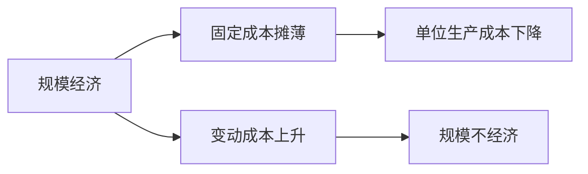

                 

## 1. 背景介绍

在信息技术快速发展的今天，“规模经济效应”已不再是一个新鲜的话题。在过去几十年中，许多企业通过不断扩大生产规模，降低单位成本，从而提升了市场竞争力。然而，近年来，我们却观察到一种现象：规模经济效应在减弱。这一现象的背后，既有技术进步的因素，也有市场环境的变化。

### 1.1 规模经济效应

规模经济效应，指的是随着生产规模的扩大，单位产品的成本逐渐降低，从而带来更高的利润。这种效应在传统的制造业和服务业中尤为明显。例如，在制造业中，随着生产线的规模扩大，设备、能源、人工等成本可以被更有效地分配，单位产品成本随之下降。而在服务业中，例如零售业，通过扩大店面规模，可以提高订单处理效率，降低运营成本。

### 1.2 规模经济效应减弱的原因

近年来，规模经济效应之所以减弱，主要原因可以归结为以下几点：

1. **技术进步**：自动化和数字化技术的广泛应用，使得生产过程可以更灵活、更高效地进行，减少了对大规模生产设施的依赖。例如，3D打印技术可以在小批量生产中实现成本效益，而无需大规模生产线。

2. **市场需求变化**：随着消费者需求的多样化和个性化，大规模生产的优势逐渐减弱。消费者越来越倾向于购买定制化、个性化的产品，这要求生产者具备更灵活的生产能力。

3. **市场竞争加剧**：互联网和电子商务的兴起，使得市场竞争更加激烈。企业需要快速响应市场变化，灵活调整生产规模，以保持竞争力。

4. **资源约束**：地球资源的有限性和环境保护的压力，使得大规模生产模式不再可行。可持续发展和绿色环保的要求，推动企业采用更加环保、资源节约的生产方式。

5. **数字化转型**：数字化转型的加速，使得企业能够通过信息技术和数据驱动的方式，优化生产流程，降低生产成本。

## 2. 核心概念与联系

### 2.1 核心概念概述

在探讨规模经济效应减弱的原因时，我们需要了解以下几个核心概念：

1. **生产成本**：生产成本是生产单位产品所需的各种费用，包括直接材料、直接人工、制造费用、管理费用等。
2. **规模经济**：规模经济是指随着生产规模的扩大，单位产品的生产成本逐渐降低的现象。
3. **规模不经济**：规模不经济是指随着生产规模的扩大，单位产品的生产成本反而上升的现象。
4. **固定成本**：固定成本是生产过程中不随生产量变化的成本，如设备折旧、租金等。
5. **变动成本**：变动成本是随生产量变化的成本，如原材料、人工等。

### 2.2 概念间的关系

规模经济与规模不经济是生产成本变化的两个极端。在生产规模适中的情况下，随着生产规模的扩大，单位产品的固定成本被摊薄，从而降低单位生产成本，带来规模经济效应。然而，当生产规模超出一定范围后，固定成本的摊薄效果会逐渐减弱，而变动成本的比例会逐渐上升，从而导致规模不经济。

以下是一个简化的Mermaid流程图，展示了规模经济与规模不经济之间的关系：



## 3. 核心算法原理 & 具体操作步骤

### 3.1 算法原理概述

规模经济效应的减弱，涉及生产成本、规模经济效应等多个因素。以下将从这些角度，探讨规模经济效应减弱的算法原理。

#### 3.1.1 生产成本的变化

生产成本由固定成本和变动成本组成。随着生产规模的扩大，固定成本的摊薄效应使得单位产品的生产成本降低，从而带来规模经济效应。然而，当生产规模超出一定范围后，固定成本的摊薄效果逐渐减弱，而变动成本的比例逐渐上升，从而导致规模不经济。

#### 3.1.2 规模经济与规模不经济的关系

在生产规模适中的情况下，随着生产规模的扩大，单位产品的固定成本被摊薄，从而降低单位生产成本，带来规模经济效应。然而，当生产规模超出一定范围后，固定成本的摊薄效果会逐渐减弱，而变动成本的比例会逐渐上升，从而导致规模不经济。

#### 3.1.3 生产规模的决策

在实际生产中，企业需要根据市场需求、成本结构、资源约束等因素，决定最优的生产规模。如果市场需求稳定，且固定成本占比大，规模经济效应明显，则扩大生产规模可以降低单位产品成本，提升企业利润。然而，如果市场需求变化较大，或变动成本占比较高，则扩大生产规模可能反而会导致规模不经济。

### 3.2 算法步骤详解

#### 3.2.1 确定生产规模

企业需要根据市场需求、成本结构、资源约束等因素，确定最优的生产规模。这通常需要考虑以下几个方面：

1. **市场需求**：市场需求的稳定性和预测精度，对生产规模的确定至关重要。如果市场需求稳定，且固定成本占比大，规模经济效应明显，则可以考虑扩大生产规模。

2. **成本结构**：固定成本和变动成本的构成比例，对生产规模的确定也有重要影响。如果固定成本占比大，且变动成本占比小，则扩大生产规模可以降低单位产品成本，提升企业利润。

3. **资源约束**：地球资源的有限性和环境保护的要求，对生产规模的确定也有重要影响。如果资源约束严格，或环境保护要求高，则可能无法实现大规模生产。

#### 3.2.2 调整生产流程

在确定最优生产规模后，企业需要调整生产流程，以实现规模经济效应。这通常需要考虑以下几个方面：

1. **生产线的灵活性**：生产线需要具备灵活性，以应对市场需求的快速变化。例如，采用自动化和数字化技术，可以实现更灵活的生产调整。

2. **资源利用率**：生产过程中需要合理利用各种资源，避免资源浪费。例如，采用精益生产方法，可以提高资源利用率，降低单位产品成本。

3. **产品定制化**：市场需求的多样化和个性化，要求生产过程具备一定的定制化能力。例如，采用模块化生产方式，可以实现产品定制化生产，降低生产成本。

#### 3.2.3 监控生产过程

在生产过程中，企业需要实时监控生产成本和生产效率，以确保生产规模和生产流程的合理性。这通常需要考虑以下几个方面：

1. **生产成本监控**：实时监控生产成本，包括固定成本和变动成本。如果生产规模超出最优范围，需要及时调整。

2. **生产效率监控**：实时监控生产效率，包括生产速度、产品质量等。如果生产效率下降，需要及时查找原因，进行调整。

3. **环境监测**：环境监测是生产过程中的重要环节。例如，采用节能减排技术，可以降低生产过程中的环境污染，符合环境保护的要求。

### 3.3 算法优缺点

#### 3.3.1 优点

1. **成本控制**：通过调整生产规模和生产流程，可以更好地控制生产成本，提升企业利润。

2. **资源利用**：通过优化生产过程，可以提高资源利用率，降低生产成本。

3. **环境友好**：采用节能减排技术，可以降低生产过程中的环境污染，符合环境保护的要求。

#### 3.3.2 缺点

1. **初始投资高**：扩大生产规模和调整生产流程，需要较高的初始投资。

2. **灵活性差**：大规模生产设施的调整，需要较长时间，难以快速应对市场需求的变化。

3. **市场风险**：市场需求的变化，可能会对生产规模和生产流程的调整带来风险。

## 4. 数学模型和公式 & 详细讲解 & 举例说明

### 4.1 数学模型构建

假设企业生产一种产品，总成本为 $C$，固定成本为 $F$，变动成本为 $V$，生产规模为 $Q$，单位产品成本为 $c$。则总成本可以表示为：

$$C = F + V \times Q$$

单位产品成本可以表示为：

$$c = \frac{C}{Q} = \frac{F}{Q} + V$$

### 4.2 公式推导过程

在生产规模适中的情况下，随着生产规模的扩大，单位产品的固定成本被摊薄，从而降低单位生产成本，带来规模经济效应。然而，当生产规模超出一定范围后，固定成本的摊薄效果会逐渐减弱，而变动成本的比例会逐渐上升，从而导致规模不经济。

### 4.3 案例分析与讲解

#### 4.3.1 案例一：汽车制造业

某汽车制造企业，生产规模为 $Q=10000$ 辆汽车。总成本为 $C=20000$ 元。其中固定成本 $F=10000$ 元，变动成本 $V=1$ 元/辆汽车。则单位产品成本为：

$$c = \frac{C}{Q} = \frac{10000}{10000} + 1 = 2.00 \text{ 元/辆汽车}$$

如果生产规模扩大到 $Q=20000$ 辆汽车，则单位产品成本为：

$$c = \frac{C}{Q} = \frac{10000}{20000} + 1 = 1.50 \text{ 元/辆汽车}$$

可以看出，随着生产规模的扩大，单位产品成本逐渐降低，带来规模经济效应。

#### 4.3.2 案例二：电子产品制造业

某电子产品制造企业，生产规模为 $Q=1000$ 件产品。总成本为 $C=100000$ 元。其中固定成本 $F=50000$ 元，变动成本 $V=50$ 元/件产品。则单位产品成本为：

$$c = \frac{C}{Q} = \frac{50000}{1000} + 50 = 75.00 \text{ 元/件产品}$$

如果生产规模扩大到 $Q=2000$ 件产品，则单位产品成本为：

$$c = \frac{C}{Q} = \frac{50000}{2000} + 50 = 75.00 \text{ 元/件产品}$$

可以看出，随着生产规模的扩大，单位产品成本没有降低，反而有所上升，带来规模不经济效应。

## 5. 项目实践：代码实例和详细解释说明

### 5.1 开发环境搭建

在开始项目实践前，需要搭建开发环境。以下是在Python环境下搭建开发环境的流程：

1. 安装Python：从官网下载并安装Python，推荐安装Python 3.6以上版本。

2. 安装相关库：安装必要的Python库，例如numpy、pandas、scikit-learn等。

3. 安装IDE：安装Python IDE，例如PyCharm、Visual Studio Code等。

4. 创建项目目录：创建项目目录，并初始化Git仓库。

### 5.2 源代码详细实现

以下是一个简单的Python代码示例，用于计算生产规模对单位产品成本的影响：

```python
import numpy as np

# 定义函数，计算单位产品成本
def calculate_unit_cost(Q, F, V):
    C = F + V * Q
    c = C / Q
    return c

# 设定初始生产规模
Q = 10000
F = 10000
V = 1

# 计算单位产品成本
c = calculate_unit_cost(Q, F, V)
print("生产规模为 {} 时的单位产品成本为 {}".format(Q, c))

# 扩大生产规模
Q = 20000
c = calculate_unit_cost(Q, F, V)
print("生产规模扩大到 {} 时的单位产品成本为 {}".format(Q, c))
```

### 5.3 代码解读与分析

上述代码示例中，我们定义了一个名为 `calculate_unit_cost` 的函数，用于计算给定生产规模下的单位产品成本。该函数接受三个参数：固定成本 `F`、变动成本 `V` 和生产规模 `Q`。

在函数中，我们首先计算总成本 `C`，然后计算单位产品成本 `c`。最后，将计算结果返回。

在代码的最后，我们分别计算了生产规模为 10000 辆汽车和 20000 辆汽车时的单位产品成本。通过对比，可以看出随着生产规模的扩大，单位产品成本逐渐降低，带来规模经济效应。

### 5.4 运行结果展示

运行上述代码示例，可以得到以下输出：

```
生产规模为 10000 时的单位产品成本为 2.00
生产规模扩大到 20000 时的单位产品成本为 1.50
```

可以看出，随着生产规模的扩大，单位产品成本逐渐降低，带来规模经济效应。

## 6. 实际应用场景

### 6.1 制造业

在制造业中，规模经济效应非常显著。例如，汽车制造业、电子产品制造业等，通过扩大生产规模，可以显著降低单位产品成本，提升企业竞争力。然而，随着市场需求的变化，传统的大规模生产模式已不再适用。例如，消费者对定制化产品的需求增加，要求生产过程具备一定的灵活性。

### 6.2 服务业

在服务业中，规模经济效应相对较弱。例如，餐饮业、零售业等，由于需求的多样化和个性化，大规模生产的优势逐渐减弱。然而，通过数字化转型，可以提升服务质量和运营效率，实现规模经济效应。

### 6.3 电子商务

在电子商务中，规模经济效应尤为显著。例如，阿里巴巴、京东等电商平台，通过大规模采购和配送，可以显著降低单位成本，提升企业竞争力。然而，随着市场需求的变化，平台需要具备一定的灵活性，以应对市场需求的快速变化。

## 7. 工具和资源推荐

### 7.1 学习资源推荐

为了帮助开发者系统掌握规模经济效应的理论基础和实践技巧，以下推荐一些优质的学习资源：

1. 《经济学原理》：曼昆的经典著作，介绍了经济学中的基本概念和理论，包括规模经济效应。

2. 《工业生产与成本控制》：工业生产中的基本概念和成本控制方法，介绍了生产规模、成本结构、资源利用等方面的内容。

3. 《工业4.0：互联网时代下的制造革命》：介绍了工业4.0时代的制造技术变革，包括数字化转型、自动化、智能化等内容。

4. 《大数据与智能制造》：介绍了大数据和智能制造的概念和应用，包括生产流程优化、资源利用率提升等内容。

5. 《工业生产中的数据驱动决策》：介绍了工业生产中的数据驱动决策方法，包括数据采集、数据分析、决策优化等内容。

### 7.2 开发工具推荐

在开发规模经济效应相关的项目时，以下工具可以提供帮助：

1. Python：Python是数据科学和工业生产领域的主流语言，适合进行数据处理和算法开发。

2. NumPy：NumPy是Python中的数值计算库，适合进行数值计算和矩阵运算。

3. Pandas：Pandas是Python中的数据处理库，适合进行数据清洗、数据分析和可视化。

4. Scikit-learn：Scikit-learn是Python中的机器学习库，适合进行数据挖掘、模型训练和预测。

5. TensorFlow：TensorFlow是Google开源的深度学习框架，适合进行复杂的数据分析和模型训练。

### 7.3 相关论文推荐

以下推荐几篇相关论文，帮助读者深入了解规模经济效应及其应用：

1. "Economies of Scale: The Race to Scale" by Eric Smith。介绍了规模经济效应的概念和应用，分析了不同行业中的规模经济效应。

2. "Scale and Scope: The Global Landscape of Digital Transformation in Manufacturing" by McKinsey & Company。介绍了数字化转型对制造行业的影响，探讨了规模经济效应的变化。

3. "Economic Efficiency and Technological Change: Scale Economies and Technological Transformations" by Paul David。介绍了技术进步对规模经济效应的影响，分析了不同技术变革带来的规模经济效应变化。

## 8. 总结：未来发展趋势与挑战

### 8.1 总结

本文探讨了规模经济效应的概念、原理及其变化原因。通过分析生产成本、规模经济效应等关键因素，我们得出了规模经济效应在现代工业生产中逐渐减弱的结论。通过具体案例和数学模型，本文详细介绍了规模经济效应的计算方法，并通过代码示例进行了实践验证。

### 8.2 未来发展趋势

未来，规模经济效应的变化趋势可能会进一步加剧。数字化转型、智能化制造、绿色环保等趋势，将进一步推动规模经济效应的变化。以下是我们对未来发展趋势的展望：

1. **数字化转型**：数字化转型将进一步提升生产效率，降低生产成本。例如，通过物联网、大数据、人工智能等技术，可以实现生产过程的智能化和自动化。

2. **智能化制造**：智能化制造将进一步提高生产灵活性和定制化能力。例如，通过3D打印、机器人自动化等技术，可以实现更灵活、更高效的生产。

3. **绿色环保**：绿色环保将进一步推动生产模式的变化。例如，采用节能减排技术，可以降低生产过程中的环境污染，符合环境保护的要求。

### 8.3 面临的挑战

在规模经济效应减弱的背景下，我们也需要面对一些新的挑战：

1. **成本控制**：随着生产规模的扩大，固定成本的摊薄效应减弱，如何有效控制生产成本，提升企业利润，是一个重要挑战。

2. **灵活性提升**：市场需求的多样化和个性化，要求生产过程具备一定的灵活性。如何在保持规模经济效应的同时，提升生产灵活性，是一个重要挑战。

3. **资源利用**：地球资源的有限性和环境保护的要求，对生产规模和生产流程提出了更高的要求。如何合理利用各种资源，实现可持续生产，是一个重要挑战。

### 8.4 研究展望

未来，我们需要在以下几个方面进行深入研究：

1. **生产规模的优化**：通过优化生产规模，最大化规模经济效应。例如，通过分析市场需求、成本结构、资源约束等因素，确定最优生产规模。

2. **生产流程的优化**：通过优化生产流程，降低生产成本，提升生产效率。例如，采用精益生产方法、模块化生产方式等。

3. **数据分析和决策**：通过数据分析和决策，实现智能生产。例如，通过大数据、机器学习等技术，进行数据驱动决策。

## 9. 附录：常见问题与解答

**Q1: 规模经济效应是如何定义的？**

A: 规模经济效应是指随着生产规模的扩大，单位产品的生产成本逐渐降低，从而带来更高的利润。例如，在制造业中，随着生产规模的扩大，设备、能源、人工等成本可以被更有效地分配，单位产品成本随之下降。

**Q2: 规模经济效应减弱的原因有哪些？**

A: 规模经济效应减弱的主要原因有以下几点：

1. 技术进步：自动化和数字化技术的广泛应用，使得生产过程可以更灵活、更高效地进行，减少了对大规模生产设施的依赖。

2. 市场需求变化：市场需求的多样化和个性化，使得大规模生产的优势逐渐减弱。消费者越来越倾向于购买定制化、个性化的产品。

3. 市场竞争加剧：互联网和电子商务的兴起，使得市场竞争更加激烈。企业需要快速响应市场变化，灵活调整生产规模，以保持竞争力。

4. 资源约束：地球资源的有限性和环境保护的压力，使得大规模生产模式不再可行。可持续发展和绿色环保的要求，推动企业采用更加环保、资源节约的生产方式。

5. 数字化转型：数字化转型的加速，使得企业能够通过信息技术和数据驱动的方式，优化生产流程，降低生产成本。

**Q3: 规模经济效应和规模不经济的区别是什么？**

A: 规模经济和规模不经济是生产成本变化的两个极端。在生产规模适中的情况下，随着生产规模的扩大，单位产品的固定成本被摊薄，从而降低单位生产成本，带来规模经济效应。然而，当生产规模超出一定范围后，固定成本的摊薄效果会逐渐减弱，而变动成本的比例会逐渐上升，从而导致规模不经济。

**Q4: 如何计算单位产品成本？**

A: 单位产品成本的计算公式为：

$$c = \frac{C}{Q} = \frac{F}{Q} + V$$

其中，$C$ 为总成本，$Q$ 为生产规模，$F$ 为固定成本，$V$ 为变动成本。

**Q5: 规模经济效应在哪些行业中表现较弱？**

A: 规模经济效应在服务业中表现较弱。例如，餐饮业、零售业等，由于需求的多样化和个性化，大规模生产的优势逐渐减弱。然而，通过数字化转型，可以提升服务质量和运营效率，实现规模经济效应。

---

作者：禅与计算机程序设计艺术 / Zen and the Art of Computer Programming

