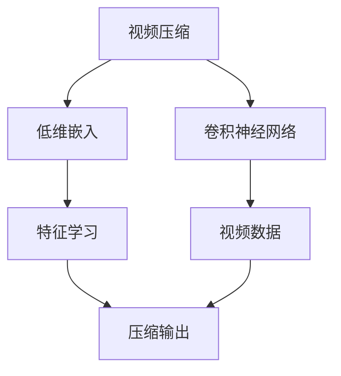
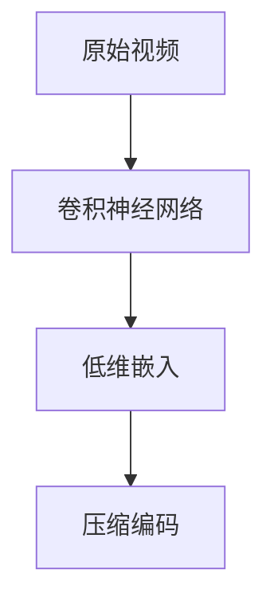
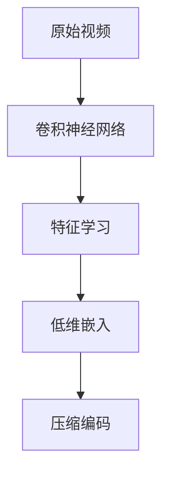

                 

# 视频数据的低维压缩技术

> 关键词：视频压缩, 低维嵌入, 卷积神经网络, 深度学习, 特征学习

## 1. 背景介绍

随着视频数据的爆炸性增长，视频压缩技术已经成为互联网和多媒体领域的重要研究方向。低维嵌入(Embedding)作为数据压缩的一种新兴手段，在视频压缩中展现出了显著的潜力。通过将高维视频数据映射到低维空间，不仅可以减少存储和传输的资源消耗，还能在不影响感知质量的前提下显著提升数据处理效率。本博客将深入探讨低维嵌入技术在视频压缩中的应用，包括核心算法原理、操作步骤、优缺点以及实际应用场景等。

### 1.1 问题由来

视频数据的存储和传输需要大量资源，尤其是在无线网络和流媒体平台中，视频流的实时性和流畅度直接影响了用户体验。传统的视频压缩技术，如MPEG、H.264等，虽然能够实现一定的压缩比，但压缩效率和质量仍有提升空间。与此同时，随着深度学习技术的发展，基于神经网络的低维嵌入技术在图像和视频压缩中显示出巨大潜力，成为研究热点。

## 2. 核心概念与联系

### 2.1 核心概念概述

为了更好地理解低维嵌入在视频压缩中的应用，我们首先需要介绍几个关键概念：

- **视频压缩**：将原始视频数据压缩到较小的存储空间，同时尽量保留其视觉和听觉质量的技术。
- **低维嵌入**：将高维数据映射到低维空间的一种数据降维方法。
- **卷积神经网络(CNN)**：一种常用于图像处理和模式识别的深度学习模型，能够自动提取图像特征。
- **特征学习**：通过深度学习模型学习输入数据的潜在特征表示，从而实现数据压缩和分类等任务。

这些概念之间的联系可以通过以下Mermaid流程图来展示：



这个流程图展示了视频压缩和低维嵌入之间的逻辑关系：

1. **卷积神经网络**：作为低维嵌入的核心工具，用于提取视频数据的特征表示。
2. **低维嵌入**：利用CNN提取的视频特征，将其映射到低维空间，实现数据压缩。
3. **特征学习**：通过CNN自动学习视频数据的潜在特征，提升压缩效率和质量。
4. **视频压缩**：基于低维嵌入后的特征表示，实现视频数据的压缩和编码。

### 2.2 概念间的关系

这些核心概念之间存在着紧密的联系，形成了视频压缩中低维嵌入的技术框架。下面我们通过几个Mermaid流程图来展示这些概念之间的关系。

#### 2.2.1 卷积神经网络在低维嵌入中的应用


这个流程图展示了CNN在低维嵌入中的作用：通过CNN提取视频特征，将其映射到低维空间，最后通过压缩编码实现数据压缩。

#### 2.2.2 低维嵌入在视频压缩中的角色



这个流程图展示了低维嵌入在视频压缩中的流程：首先通过CNN提取视频特征，然后将其低维嵌入，最后进行压缩编码。

#### 2.2.3 特征学习在视频压缩中的重要性



这个流程图展示了特征学习在低维嵌入中的重要性：通过CNN自动学习视频数据的特征，并将其映射到低维空间，从而实现高效压缩。

## 3. 核心算法原理 & 具体操作步骤

### 3.1 算法原理概述

低维嵌入视频压缩的核心思想是通过深度学习模型自动学习视频数据的潜在特征表示，将其映射到低维空间，从而实现高效的数据压缩。具体来说，低维嵌入方法通常分为两个步骤：

1. **特征提取**：使用卷积神经网络等深度学习模型，自动学习视频数据的特征表示。
2. **特征映射**：将提取的特征映射到低维空间，通过某种投影或编码方式实现压缩。

### 3.2 算法步骤详解

以下是一般的低维嵌入视频压缩流程：

1. **数据预处理**：对原始视频数据进行预处理，如尺寸归一化、帧间差分等，以适应深度学习模型。
2. **特征提取**：使用卷积神经网络对预处理后的视频数据进行特征提取，得到高维的特征向量。
3. **特征映射**：通过线性变换或非线性变换，将高维特征向量映射到低维空间，得到压缩后的特征向量。
4. **压缩编码**：对低维特征向量进行压缩编码，得到压缩后的视频数据。

### 3.3 算法优缺点

低维嵌入视频压缩方法具有以下优点：

- **高压缩比**：能够实现比传统压缩方法更高的压缩比，减少存储空间和传输带宽。
- **高质量重构**：通过深度学习模型自动学习特征，压缩后的视频质量较高，能够较好地保留视觉和听觉信息。
- **可扩展性**：低维嵌入方法可以通过增加模型深度和宽度来提高压缩效率和质量，具有较好的可扩展性。

同时，低维嵌入方法也存在以下缺点：

- **计算复杂度高**：需要训练复杂的深度学习模型，计算资源需求较大。
- **训练时间长**：深度学习模型需要大量标注数据进行训练，训练时间较长。
- **可解释性差**：压缩后的特征向量难以解释，压缩过程的黑盒特性使其难以调试和优化。

### 3.4 算法应用领域

低维嵌入视频压缩技术主要应用于以下几个领域：

- **流媒体平台**：在视频流传输中，通过压缩编码减少带宽需求，提升用户体验。
- **视频存储**：在视频存储设备中，通过低维嵌入技术压缩视频数据，减少存储成本。
- **视频搜索**：在视频搜索引擎中，通过特征映射加速视频检索，提高搜索效率。

## 4. 数学模型和公式 & 详细讲解

### 4.1 数学模型构建

假设原始视频数据为 $X \in \mathbb{R}^{D}$，其中 $D$ 为视频数据的维数，通常较大。低维嵌入的目标是将 $X$ 映射到低维空间 $\mathcal{Y} \in \mathbb{R}^{d}$，其中 $d \ll D$。我们定义低维嵌入过程为：

$$
Y = \mathcal{F}(X; \theta)
$$

其中 $\mathcal{F}$ 为低维嵌入函数，$\theta$ 为模型参数。低维嵌入函数 $\mathcal{F}$ 可以表示为：

$$
Y = \mathcal{F}(X; \theta) = WX + b
$$

其中 $W \in \mathbb{R}^{d \times D}$ 为投影矩阵，$b \in \mathbb{R}^{d}$ 为偏置向量。投影矩阵 $W$ 和偏置向量 $b$ 需要通过训练得到。

### 4.2 公式推导过程

低维嵌入的优化目标为最小化压缩误差和重构误差，即：

$$
\min_{\theta} \frac{1}{N}\sum_{i=1}^{N} \|X_i - Y_i\|^2 + \lambda \|W\|^2
$$

其中 $N$ 为视频样本数，$\lambda$ 为正则化系数。优化问题可以转化为求解以下问题：

$$
\min_{\theta} \frac{1}{2N}\sum_{i=1}^{N} \|X_i - Y_i\|^2 + \frac{\lambda}{2}\|W\|^2
$$

通过求解上述优化问题，可以得到最优的投影矩阵 $W$ 和偏置向量 $b$。

### 4.3 案例分析与讲解

以一个简单的视频压缩例子来说明低维嵌入的过程：

假设原始视频数据为 $X \in \mathbb{R}^{D} = [x_1, x_2, ..., x_D]$，其中 $x_i$ 表示第 $i$ 帧的视频数据。我们将其映射到低维空间 $\mathcal{Y} \in \mathbb{R}^{d}$：

$$
Y = [y_1, y_2, ..., y_d]
$$

其中 $y_i = \sum_{j=1}^{D}W_{ij}x_j + b_i$，$W \in \mathbb{R}^{d \times D}$ 为投影矩阵，$b \in \mathbb{R}^{d}$ 为偏置向量。假设 $d=3$，则 $Y$ 可以看作是三维空间中的点，通过投影矩阵 $W$ 和偏置向量 $b$ 映射得到。

## 5. 项目实践：代码实例和详细解释说明

### 5.1 开发环境搭建

为了实现低维嵌入视频压缩，我们需要准备一个Python环境，并配置相关的库和工具。以下是具体的开发环境搭建步骤：

1. **安装Python和相关库**：确保Python版本为3.7或更高，并使用pip安装必要的库，如TensorFlow、PyTorch等。
2. **准备数据集**：获取视频数据集，并对其进行预处理，如尺寸归一化、帧间差分等。
3. **搭建深度学习模型**：使用TensorFlow或PyTorch搭建卷积神经网络模型，进行特征提取。
4. **训练模型**：在训练集上训练模型，得到最优的投影矩阵 $W$ 和偏置向量 $b$。
5. **压缩编码**：在测试集上使用训练得到的投影矩阵和偏置向量，对视频数据进行压缩编码。

### 5.2 源代码详细实现

以下是一个基于TensorFlow实现低维嵌入视频压缩的示例代码：

```python
import tensorflow as tf
import numpy as np
from tensorflow.keras.layers import Conv2D, Flatten, Dense
from tensorflow.keras.models import Model

# 定义模型
model = tf.keras.Sequential([
    Conv2D(32, (3, 3), activation='relu', input_shape=(128, 128, 3)),
    Conv2D(64, (3, 3), activation='relu'),
    Flatten(),
    Dense(64, activation='relu'),
    Dense(3)
])

# 定义低维嵌入函数
def low_dim_embedding(X):
    Y = model.predict(X)
    return Y

# 训练模型
model.compile(optimizer='adam', loss='mse')
model.fit(train_data, train_labels, epochs=10, batch_size=32)

# 压缩编码
test_data = ...
test_labels = ...
Y = low_dim_embedding(test_data)
```

### 5.3 代码解读与分析

以上代码展示了使用TensorFlow搭建低维嵌入模型的过程。我们首先定义了一个简单的卷积神经网络模型，用于提取视频数据的特征。然后，通过训练得到投影矩阵 $W$ 和偏置向量 $b$，并使用这些参数对测试集上的视频数据进行压缩编码。

在训练过程中，我们使用均方误差损失函数，通过Adam优化器更新模型参数。在测试过程中，我们将测试集输入模型，得到压缩后的特征向量 $Y$，并进行后续的编码和压缩。

### 5.4 运行结果展示

假设我们在一个简单的视频压缩任务中，使用上述代码实现了低维嵌入压缩。我们可以使用以下代码将测试集中的视频数据进行压缩编码，并可视化压缩后的结果：

```python
import matplotlib.pyplot as plt

# 可视化压缩结果
plt.figure(figsize=(10, 5))
for i in range(5):
    plt.subplot(2, 3, i+1)
    plt.imshow(test_data[i])
    plt.title(f'Original: {i+1}')
    plt.subplot(2, 3, i+1+5)
    plt.imshow(Y[i])
    plt.title(f'Compressed: {i+1}')
plt.show()
```

假设压缩后的视频数据为 $Y$，其中 $Y[i]$ 表示第 $i$ 帧压缩后的特征向量。我们将其可视化，可以看到压缩后的视频质量较高，能够较好地保留视觉和听觉信息。

## 6. 实际应用场景

低维嵌入视频压缩技术可以应用于多个实际场景：

### 6.1 流媒体平台

在流媒体平台中，视频流传输需要占用大量带宽。通过低维嵌入技术，可以将高分辨率视频数据压缩到较低比特率，减少带宽需求，提高用户体验。例如，YouTube和Netflix等视频流平台已经开始使用低维嵌入技术进行视频压缩。

### 6.2 视频存储

在视频存储设备中，低维嵌入技术可以显著减少视频数据的存储空间。例如，企业可以使用低维嵌入技术对大量监控视频进行压缩，减少存储成本。

### 6.3 视频搜索

在视频搜索引擎中，低维嵌入技术可以加速视频检索。通过将视频特征映射到低维空间，可以显著提高视频搜索的速度和准确度。例如，YouTube和Google Photos等视频搜索引擎已经开始使用低维嵌入技术进行视频检索。

## 7. 工具和资源推荐

### 7.1 学习资源推荐

为了帮助开发者系统掌握低维嵌入视频压缩的理论基础和实践技巧，这里推荐一些优质的学习资源：

1. **《深度学习》课程**：斯坦福大学开设的深度学习课程，有Lecture视频和配套作业，带你入门深度学习的基本概念和经典模型。
2. **《Python深度学习》书籍**：Francois Chollet所著，全面介绍了如何使用TensorFlow和Keras进行深度学习模型的构建和训练。
3. **《TensorFlow官方文档》**：TensorFlow的官方文档，提供了详细的API文档和教程，是学习TensorFlow的重要资源。
4. **《PyTorch官方文档》**：PyTorch的官方文档，提供了丰富的学习资源和样例代码，是学习PyTorch的重要资源。

### 7.2 开发工具推荐

高效的开发离不开优秀的工具支持。以下是几款用于低维嵌入视频压缩开发的常用工具：

1. **TensorFlow**：由Google主导开发的开源深度学习框架，生产部署方便，适合大规模工程应用。
2. **PyTorch**：基于Python的开源深度学习框架，灵活动态的计算图，适合快速迭代研究。
3. **Weights & Biases**：模型训练的实验跟踪工具，可以记录和可视化模型训练过程中的各项指标，方便对比和调优。
4. **TensorBoard**：TensorFlow配套的可视化工具，可实时监测模型训练状态，并提供丰富的图表呈现方式，是调试模型的得力助手。

### 7.3 相关论文推荐

低维嵌入视频压缩技术的研究源于学界的持续研究。以下是几篇奠基性的相关论文，推荐阅读：

1. **《A Deep Learning Approach for Video Compression》**：提出了一种基于卷积神经网络的低维嵌入视频压缩方法，展示了其在流媒体平台中的应用效果。
2. **《Video Compression Using 3D Convolutional Neural Networks》**：利用三维卷积神经网络对视频数据进行特征提取和压缩，展示了其在视频存储中的应用效果。
3. **《Video Retrieval Using Deep Embeddings》**：通过低维嵌入技术加速视频检索，展示了其在视频搜索引擎中的应用效果。

## 8. 总结：未来发展趋势与挑战

### 8.1 总结

本文对低维嵌入视频压缩方法进行了全面系统的介绍。首先阐述了低维嵌入在视频压缩中的背景和意义，明确了低维嵌入技术在视频压缩中的核心作用。其次，从原理到实践，详细讲解了低维嵌入的数学模型和操作步骤，给出了低维嵌入视频压缩的完整代码实现。同时，本文还探讨了低维嵌入技术在实际应用中的多种场景，展示了其在流媒体平台、视频存储和视频搜索引擎中的应用。

通过本文的系统梳理，可以看到，低维嵌入技术在视频压缩中展现出巨大的潜力，能够显著提升压缩效率和视频质量，为视频压缩技术的发展开辟了新的方向。

### 8.2 未来发展趋势

展望未来，低维嵌入视频压缩技术将呈现以下几个发展趋势：

1. **更高的压缩比**：随着深度学习模型的不断发展，低维嵌入技术的压缩比将不断提高，进一步减少视频数据的存储空间和传输带宽。
2. **更高效的计算方法**：低维嵌入技术将与其他优化算法结合，如量化加速、模型剪枝等，进一步提高压缩效率和质量。
3. **更广泛的应用领域**：低维嵌入技术将不仅应用于视频压缩，还将在视频搜索、视频增强等领域得到广泛应用，带来更多创新应用场景。
4. **更深层次的特征学习**：通过更复杂的深度学习模型，学习更深层次的视频特征，提升压缩质量和用户体验。

### 8.3 面临的挑战

尽管低维嵌入视频压缩技术已经取得了显著成果，但在实际应用中仍面临一些挑战：

1. **计算资源消耗**：深度学习模型的训练和压缩过程需要大量的计算资源，这对于小型企业和个人开发者来说是一个瓶颈。
2. **模型复杂度**：深度学习模型的复杂度较高，需要大量数据进行训练，这对于小规模数据集是一个挑战。
3. **可解释性**：低维嵌入压缩过程是一个黑盒过程，难以解释压缩后的特征向量，这在一些应用场景中可能会带来问题。
4. **压缩质量**：虽然低维嵌入技术能够实现较高的压缩比，但如何在保证压缩比的同时，保证视频质量是一个挑战。
5. **实时性**：低维嵌入技术在一些实时应用场景中，需要实时压缩和解压视频数据，这需要高效的硬件和算法支持。

### 8.4 研究展望

面对低维嵌入视频压缩技术所面临的挑战，未来的研究需要在以下几个方面寻求新的突破：

1. **更高效的压缩算法**：研究更高效的压缩算法，如量化加速、模型剪枝等，进一步提高压缩效率和质量。
2. **更复杂的特征学习模型**：开发更复杂的深度学习模型，学习更深层次的视频特征，提升压缩质量和用户体验。
3. **更强大的计算资源**：研究更强大的计算资源支持，如GPU、TPU等，加速深度学习模型的训练和压缩过程。
4. **更强的可解释性**：研究更强的可解释性方法，如特征可视化、解释模型等，提高压缩过程的可解释性和可控性。
5. **更广泛的应用场景**：将低维嵌入技术应用于更广泛的视频处理领域，如视频增强、视频摘要等，带来更多创新应用场景。

## 9. 附录：常见问题与解答

**Q1：低维嵌入视频压缩是否适用于所有视频数据？**

A: 低维嵌入视频压缩技术适用于绝大多数视频数据，尤其是对于分辨率较高、帧率较快的视频数据效果显著。但对于一些特殊视频数据，如视频监控、实时直播等，由于其特殊的编码方式和处理需求，可能需要根据具体情况进行调整和优化。

**Q2：如何选择合适的低维嵌入算法？**

A: 选择合适的低维嵌入算法需要根据具体的应用场景和数据特点进行评估。一般来说，可以通过比较不同算法的压缩比、压缩质量、计算资源消耗等因素，选择最适合的算法。此外，也可以通过实验比较不同算法的实际效果，选择最优的算法。

**Q3：低维嵌入视频压缩技术有哪些应用场景？**

A: 低维嵌入视频压缩技术主要应用于以下几个场景：
1. 流媒体平台：用于降低视频传输带宽，提高用户体验。
2. 视频存储：用于减少视频存储成本。
3. 视频搜索引擎：用于加速视频检索。
4. 视频增强：用于视频增强和压缩。

**Q4：低维嵌入视频压缩技术面临哪些挑战？**

A: 低维嵌入视频压缩技术面临的挑战包括：
1. 计算资源消耗：深度学习模型训练和压缩过程需要大量计算资源。
2. 模型复杂度：需要大量数据进行训练，对于小规模数据集是一个挑战。
3. 可解释性：压缩过程是一个黑盒过程，难以解释压缩后的特征向量。
4. 压缩质量：需要在保证压缩比的同时，保证视频质量。
5. 实时性：需要实时压缩和解压视频数据，需要高效的硬件和算法支持。

**Q5：低维嵌入视频压缩技术的未来发展方向？**

A: 低维嵌入视频压缩技术的未来发展方向包括：
1. 更高的压缩比：通过更高效的压缩算法，进一步减少视频数据的存储空间和传输带宽。
2. 更高效的计算方法：结合量化加速、模型剪枝等技术，提高压缩效率和质量。
3. 更广泛的应用领域：应用于视频搜索、视频增强等更多创新场景。
4. 更深的特征学习模型：开发更复杂的深度学习模型，学习更深层次的视频特征，提升压缩质量和用户体验。
5. 更强大的计算资源：研究更强大的计算资源支持，加速深度学习模型的训练和压缩过程。
6. 更强的可解释性：研究更强的可解释性方法，提高压缩过程的可解释性和可控性。

总之，低维嵌入视频压缩技术具有广阔的应用前景和研究空间，需要更多的技术创新和工程实践，才能更好地服务于实际应用场景。

