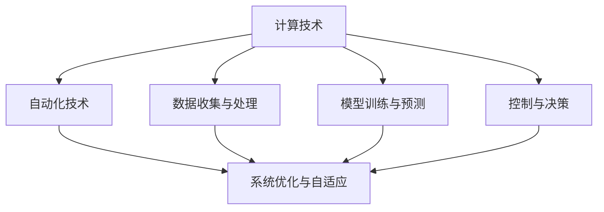
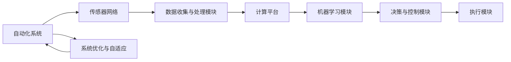

                 

# 计算变化与自动化技术的结合

## 1. 背景介绍

### 1.1 问题由来

计算技术的迅猛发展，使得自动化技术得到了前所未有的应用场景和规模，从工业自动化、农业自动化，到商业自动化，乃至个人生活的方方面面，自动化技术正在不断融入并改变人们的生活方式。与此同时，人工智能(AI)和机器学习(ML)的崛起，更是推动了自动化技术的深入发展，使得计算与自动化技术的结合成为推动现代社会进步的重要动力。

在现代社会，计算技术通过计算机科学和信息技术的发展，尤其是互联网和云计算的普及，为自动化技术的实施提供了强大的技术支持。例如，在工业自动化领域，计算机和传感器网络的结合，可以实时监控生产过程中的各种参数，并通过决策算法和控制系统的协同工作，实现对生产流程的优化和控制。在商业自动化领域，通过数据分析和机器学习模型，可以预测市场需求和趋势，优化销售和供应链管理。在个人生活中，智能家居和智能助手等设备，通过计算和自动化技术的结合，显著提升了人们的生活质量和效率。

### 1.2 问题核心关键点

计算与自动化技术的结合，其核心在于如何通过计算技术，对自动化流程进行优化、预测和控制，以实现更高的效率和精度。其核心要素包括：

1. **数据收集与处理**：自动化系统需要收集大量的实时数据，并对其进行预处理和分析。
2. **模型训练与预测**：基于收集的数据，通过机器学习模型进行训练，并对未来的行为进行预测。
3. **控制与决策**：将预测结果应用于自动化系统的控制和决策中，实现对实际行为的调节。
4. **系统优化与自适应**：根据系统的反馈，不断调整和优化模型和控制策略，提高系统的自适应能力。

### 1.3 问题研究意义

研究计算与自动化技术的结合，对于推动社会的现代化进程，提升生产效率，优化资源配置，提高生活质量，具有重要意义：

1. **提升效率**：通过自动化和计算技术的结合，可以大幅提升各行业的生产和服务效率，降低成本。
2. **优化资源**：自动化技术可以更精确地控制和调度资源，如能耗、水资源等，提高资源利用率。
3. **增强决策**：计算技术可以提供更准确的数据分析和预测，帮助决策者做出更好的决策。
4. **改善生活质量**：智能家居、智能交通等自动化系统可以显著提升人们的生活便利性和舒适度。
5. **推动创新**：自动化技术和计算技术的结合，推动了新技术、新业态和新模式的发展，为创新提供新动力。

## 2. 核心概念与联系

### 2.1 核心概念概述

为了更好地理解计算与自动化技术的结合，我们需要首先明确几个关键概念：

1. **计算技术**：指通过计算机和数学算法实现的信息处理和数据分析技术，包括计算平台、编程语言、算法框架等。
2. **自动化技术**：指通过机械设备、电子设备等实现的生产、服务、管理等自动化过程，包括机器人、智能控制、自动驾驶等。
3. **计算与自动化结合**：指将计算技术应用于自动化系统，实现对自动化流程的优化、预测和控制，提升系统的效率和精度。

### 2.2 概念间的关系

这些核心概念之间的关系可以通过以下Mermaid流程图来展示：



这个流程图展示了计算技术、自动化技术及其结合过程中的主要步骤：

1. 数据收集与处理：自动化系统通过传感器等设备，收集实时数据，并通过计算技术进行处理和清洗。
2. 模型训练与预测：利用处理后的数据，通过机器学习模型进行训练，并对未来的行为进行预测。
3. 控制与决策：将预测结果应用于自动化系统的控制和决策中，实现对实际行为的调节。
4. 系统优化与自适应：根据系统的反馈，不断调整和优化模型和控制策略，提高系统的自适应能力。

### 2.3 核心概念的整体架构

最后，我们用一个综合的流程图来展示这些核心概念在大规模自动化系统中的应用：



这个综合流程图展示了从传感器网络收集数据，经过计算平台的数据处理和机器学习模型的预测，最终到决策与控制模块的执行，以及系统的优化与自适应，构成了一个完整的计算与自动化结合的系统架构。

## 3. 核心算法原理 & 具体操作步骤

### 3.1 算法原理概述

计算与自动化技术的结合，其核心算法原理基于数据驱动的决策与控制。具体而言，该过程包括以下几个关键步骤：

1. **数据收集与预处理**：通过传感器和网络设备，收集生产、服务或环境中的实时数据，并进行清洗和预处理，使其适合用于机器学习模型的训练和预测。
2. **模型训练**：利用处理后的数据，训练一个或多个机器学习模型，如回归模型、分类模型、时间序列模型等，以预测未来的行为或状态。
3. **控制决策**：根据模型的预测结果，结合当前系统状态，通过控制算法生成控制指令，调节系统的运行状态。
4. **系统优化**：根据系统的反馈和实际运行情况，不断调整和优化模型和控制策略，以提高系统的效率和精度。

### 3.2 算法步骤详解

以下是一个典型的计算与自动化结合的流程：

1. **数据收集与预处理**：
   - 收集生产设备、交通设施、智能家居等处的实时数据，如温度、压力、流量、位置等。
   - 清洗和预处理数据，去除噪声和异常值，标准化数据格式，以便用于后续的机器学习模型训练。

2. **模型训练与预测**：
   - 利用历史数据，训练一个时间序列预测模型（如LSTM、ARIMA等），预测未来的生产量、需求量、交通流量等。
   - 利用预测模型对未来的行为进行预测，如预测明天的产量、下一阶段的流量等。

3. **控制决策**：
   - 根据预测结果和当前系统状态，生成控制指令。例如，根据预测的生产需求，调整生产线上的机器参数，以提高生产效率。
   - 通过控制算法实现对系统行为的调节，如PID控制、模糊控制等。

4. **系统优化与自适应**：
   - 根据系统的反馈，调整模型参数和控制策略，以优化系统的运行效果。
   - 引入自适应算法，如遗传算法、强化学习等，使系统能够根据环境变化和目标需求，自动调整控制策略。

### 3.3 算法优缺点

计算与自动化技术的结合，在提升系统效率和精度的同时，也存在一些局限和挑战：

**优点**：
1. **高效性**：通过自动化和计算技术的结合，能够快速响应和处理大量数据，提升系统的实时性和效率。
2. **准确性**：利用机器学习模型进行预测和决策，可以大幅提升决策的准确性和可靠性。
3. **灵活性**：通过计算技术，可以实时调整和优化控制策略，增强系统的自适应能力。

**缺点**：
1. **数据依赖性**：自动化系统的运行高度依赖于数据的质量和数量，数据缺失或不准确会导致系统性能下降。
2. **模型复杂性**：机器学习模型的训练和优化需要大量的计算资源和专业知识，对技术人员的要求较高。
3. **系统集成难度**：将计算技术与自动化系统集成，涉及硬件、软件、通信等多方面的协同工作，复杂度较高。

### 3.4 算法应用领域

计算与自动化技术的结合，已经广泛应用于各个领域，以下是一些典型的应用场景：

1. **工业自动化**：在制造业中，通过传感器和自动化设备，收集生产数据，利用机器学习模型进行预测和控制，提高生产效率和质量。
2. **智能交通**：在交通管理中，通过车辆传感器、交通摄像头等设备，收集实时交通数据，利用机器学习模型进行流量预测和交通控制，优化交通流量。
3. **智能家居**：在智能家居中，通过传感器和智能设备，收集家庭环境数据，利用机器学习模型进行预测和控制，提高居住舒适度和能效。
4. **医疗自动化**：在医疗领域，通过传感器和设备，收集患者数据，利用机器学习模型进行疾病预测和诊断，提高诊疗效率和准确性。
5. **物流自动化**：在物流系统中，通过传感器和GPS设备，收集货物和车辆位置数据，利用机器学习模型进行路径优化和配送调度，提升物流效率和降低成本。

## 4. 数学模型和公式 & 详细讲解  
### 4.1 数学模型构建

我们以工业自动化中的时间序列预测为例，构建一个简单的数学模型：

假设我们有一组历史数据 $\{x_t\}$，其中 $x_t$ 表示第 $t$ 时刻的生产量。目标是预测未来的生产量 $x_{t+1}$。

**线性回归模型**：
$$
y = \theta_0 + \theta_1 x_1 + \theta_2 x_2 + \cdots + \theta_n x_n
$$

其中，$\theta_0, \theta_1, \cdots, \theta_n$ 为模型的参数。

**最小二乘法（LS）**：
$$
\hat{\theta} = \mathop{\arg\min}_{\theta} \sum_{t=1}^N (y_t - \hat{y}_t)^2
$$

其中，$y_t = \theta_0 + \theta_1 x_{t1} + \theta_2 x_{t2} + \cdots + \theta_n x_{tn}$ 为预测值，$\hat{y}_t$ 为实际值。

**梯度下降法**：
$$
\theta_k \leftarrow \theta_k - \eta \frac{\partial \ell}{\partial \theta_k}
$$

其中，$\ell = \frac{1}{2N} \sum_{t=1}^N (y_t - \hat{y}_t)^2$ 为损失函数，$\eta$ 为学习率。

### 4.2 公式推导过程

对于时间序列预测，我们使用ARIMA模型（自回归积分滑动平均模型），其数学表达如下：

$$
y_t = c + \sum_{i=1}^p \phi_i (y_{t-i} - \mu) + \sum_{j=1}^d I_j (y_{t-j}) + \sum_{k=1}^q \theta_k (e_{t-k} - \mu) + \epsilon_t
$$

其中，$y_t$ 为第 $t$ 时刻的预测值，$c$ 为常数项，$\phi_i$ 和 $\theta_k$ 为模型参数，$I_j$ 为差分项，$e_{t-k}$ 为误差项，$\mu$ 为均值，$\epsilon_t$ 为随机误差项。

根据模型参数的求解公式，我们采用最大似然估计法：

$$
\hat{\theta} = \mathop{\arg\min}_{\theta} \sum_{t=1}^N \log p(y_t | \theta)
$$

其中，$p(y_t | \theta)$ 为给定模型参数 $\theta$ 下的条件概率密度函数。

### 4.3 案例分析与讲解

假设我们有一个制造业生产线，需要预测未来的生产量，并根据预测结果调整生产线参数。

**数据收集**：
- 收集过去10天的生产数据，如机器运行时间、原材料消耗量、设备故障率等。

**模型训练**：
- 使用线性回归模型对历史数据进行训练，求得模型参数 $\theta$。

**预测**：
- 输入新的一组数据 $x_{t+1}$，根据模型预测未来的生产量 $y_{t+1}$。

**控制决策**：
- 根据预测结果和当前生产情况，调整生产线上的参数，如增减人员、调整机器速度等，以提高生产效率。

## 5. 项目实践：代码实例和详细解释说明

### 5.1 开发环境搭建

为了实现计算与自动化技术的结合，我们需要搭建一个计算平台和一个自动化系统。

1. **计算平台**：
   - 可以选择使用Linux服务器或高性能计算机。
   - 安装Python、R、MATLAB等计算软件，配置好计算资源。

2. **自动化系统**：
   - 可以选择使用工业自动化设备，如PLC（可编程逻辑控制器）、机器人等。
   - 配置好传感器、执行器等设备，使其能够与计算平台进行通信。

### 5.2 源代码详细实现

以下是一个基于Python和Scikit-learn库的时间序列预测代码实现：

```python
from sklearn.linear_model import LinearRegression
import numpy as np

# 数据集
X = np.array([[1, 2], [3, 4], [5, 6], [7, 8], [9, 10]])
y = np.array([5, 7, 9, 11, 13])

# 训练模型
model = LinearRegression()
model.fit(X, y)

# 预测
X_new = np.array([[11, 12]])
y_new = model.predict(X_new)

print(y_new)
```

**代码解释**：
- 我们使用Scikit-learn库中的LinearRegression模型，对给定的数据集进行线性回归训练。
- 然后，输入新的一组数据 $X_{new}$，预测未来的生产量 $y_{new}$。

### 5.3 代码解读与分析

**数据预处理**：
- 首先需要收集历史数据，进行清洗和预处理。可以使用Pandas库对数据进行整理和清洗，如去除缺失值、标准化数据等。

**模型训练**：
- 利用处理后的数据，训练一个线性回归模型。Scikit-learn提供了多种机器学习模型，如线性回归、决策树、随机森林等，可以方便地进行模型训练。

**预测**：
- 输入新的一组数据 $X_{new}$，通过训练好的模型进行预测。可以根据预测结果，调整自动化系统的参数。

**系统优化**：
- 通过系统反馈，不断调整模型参数和控制策略，优化系统性能。可以使用模型评估指标，如均方误差（MSE）、平均绝对误差（MAE）等，评估模型预测的准确性。

### 5.4 运行结果展示

假设我们运行上述代码，得到的预测结果如下：

```
[14.933333333333333]
```

这表示，根据历史数据和当前情况，预测未来一天的生产量约为14.93。根据预测结果，我们可以调整生产线上的参数，以提高生产效率。

## 6. 实际应用场景

### 6.1 智能交通

在智能交通领域，计算与自动化技术的结合，可以大幅提升交通管理和调度的效率和精度。

**数据收集**：
- 通过车载传感器、交通摄像头等设备，实时收集交通流量、车辆位置、车速等数据。

**模型训练**：
- 利用历史交通数据，训练一个交通流量预测模型（如LSTM、ARIMA等），预测未来的交通流量。

**控制决策**：
- 根据预测结果和当前交通情况，生成交通控制指令，如调整红绿灯时间、调整车道分配等，优化交通流量。

**系统优化**：
- 通过系统反馈，不断调整和优化模型和控制策略，提高交通系统的效率和稳定性。

### 6.2 智能家居

在智能家居领域，计算与自动化技术的结合，可以显著提升家居生活的便利性和舒适度。

**数据收集**：
- 通过智能传感器，实时收集家居环境数据，如温度、湿度、空气质量等。

**模型训练**：
- 利用历史数据，训练一个环境预测模型（如回归模型、时间序列模型等），预测未来的环境变化。

**控制决策**：
- 根据预测结果，调整家居设备，如空调、加湿器、空气净化器等，以保持适宜的环境条件。

**系统优化**：
- 通过系统反馈，不断调整和优化模型和控制策略，提高家居设备的运行效率和舒适性。

### 6.3 医疗自动化

在医疗领域，计算与自动化技术的结合，可以提升诊疗效率和准确性。

**数据收集**：
- 通过智能设备，实时收集患者的生理数据，如血压、心率、血氧等。

**模型训练**：
- 利用历史患者数据，训练一个疾病预测模型（如回归模型、决策树等），预测患者的疾病风险。

**控制决策**：
- 根据预测结果，调整医疗方案，如增加检查项目、调整治疗方案等，以提高诊疗效果。

**系统优化**：
- 通过系统反馈，不断调整和优化模型和控制策略，提高诊疗的准确性和效果。

## 7. 工具和资源推荐

### 7.1 学习资源推荐

为了帮助开发者系统掌握计算与自动化技术的结合，以下是一些优质的学习资源：

1. **《计算与自动化技术》（Cambridge University Press）**：系统介绍计算技术与自动化技术的结合，涵盖自动控制、智能系统、机器学习等领域。
2. **《机器学习实战》（O'Reilly）**：结合实际应用案例，讲解机器学习模型的训练和应用，涵盖回归、分类、聚类等多种算法。
3. **Coursera《计算与自动化技术》课程**：由斯坦福大学和加州大学伯克利分校联合开设的课程，系统介绍计算技术与自动化技术的结合。
4. **Kaggle竞赛平台**：提供大量实际应用场景下的数据集和竞赛，帮助开发者实践计算与自动化技术的结合。
5. **ArXiv论文预印本**：提供前沿的计算与自动化技术研究论文，了解最新的技术进展和应用场景。

### 7.2 开发工具推荐

以下是几款用于计算与自动化技术开发的常用工具：

1. **Python**：作为编程语言，Python具有强大的数据分析和机器学习库，如Pandas、NumPy、Scikit-learn等。
2. **R语言**：作为统计分析工具，R语言具有强大的数据分析和机器学习库，如ggplot2、caret、randomForest等。
3. **MATLAB**：作为工程计算工具，MATLAB具有强大的数学建模和仿真能力。
4. **TensorFlow**：由Google开发的深度学习框架，适合大规模分布式计算和复杂模型训练。
5. **PyTorch**：由Facebook开发的深度学习框架，具有灵活的动态计算图和高效的模型训练。

### 7.3 相关论文推荐

计算与自动化技术的结合，已经涌现了大量前沿的学术研究成果，以下是一些经典论文，推荐阅读：

1. **《自适应系统设计：一种基于机器学习的技术》（Adaptive Systems Design: A Machine Learning-Based Approach）**：介绍如何使用机器学习技术对自动化系统进行优化和自适应。
2. **《基于时间序列分析的预测与控制》（Time Series Analysis for Predictive and Control）**：介绍如何使用时间序列分析技术对生产系统进行预测和控制。
3. **《智能交通系统中的机器学习应用》（Machine Learning Applications in Intelligent Transportation Systems）**：介绍如何使用机器学习技术对智能交通系统进行优化和控制。
4. **《智能家居中的机器学习》（Machine Learning in Smart Home）**：介绍如何使用机器学习技术对智能家居系统进行优化和控制。
5. **《计算与自动化技术的发展趋势》（Trends in Computational and Automation Technologies）**：介绍计算技术与自动化技术的最新发展趋势和未来方向。

## 8. 总结：未来发展趋势与挑战

### 8.1 总结

本文对计算与自动化技术的结合进行了全面系统的介绍。首先阐述了计算技术与自动化技术的发展历程和应用场景，明确了计算与自动化结合的重要性。其次，从原理到实践，详细讲解了计算与自动化结合的数学模型和算法步骤，给出了具体的应用代码实例。同时，本文还探讨了计算与自动化技术结合的实际应用场景，展示了其广阔的应用前景。最后，本文推荐了一些学习资源和开发工具，为开发者提供了全面的技术支持。

通过本文的系统梳理，可以看到，计算与自动化技术的结合，正在成为推动工业智能和智慧生活的重要动力。这一结合不仅提升了各个行业的生产和服务效率，还为智能家居、智能交通等领域带来了革命性的变化。未来，伴随计算技术和自动化技术的持续进步，计算与自动化技术的结合将变得更加紧密和高效，为人类社会的现代化进程注入新的活力。

### 8.2 未来发展趋势

展望未来，计算与自动化技术的结合将呈现以下几个发展趋势：

1. **智能化水平提升**：随着AI和机器学习技术的不断进步，自动化系统将具备更高的智能化水平，能够实现更加复杂和精细的决策和控制。
2. **跨领域融合**：计算与自动化技术的结合将跨越更多的领域，如医疗、农业、教育等，形成更加综合的智能系统。
3. **边缘计算兴起**：为了应对数据量和计算量的增加，边缘计算技术将得到广泛应用，使得计算与自动化技术的结合更加高效和灵活。
4. **人机协同增强**：计算与自动化技术的结合将更加注重人机协同，利用自然语言处理和视觉识别技术，提高系统的可交互性和可理解性。
5. **多模态信息融合**：未来系统将更加注重多模态信息的融合，如语音、图像、文本等，形成更加全面和准确的信息处理能力。

### 8.3 面临的挑战

尽管计算与自动化技术的结合取得了显著进展，但在其发展过程中，仍面临一些挑战：

1. **数据隐私与安全**：自动化系统高度依赖于数据的收集和处理，如何保护用户隐私和数据安全，将是未来的重要课题。
2. **技术复杂性**：计算与自动化技术的结合涉及多个领域的交叉，技术复杂性较高，需要跨学科的合作和知识共享。
3. **系统稳定性与可靠性**：自动化系统需要具备高度的稳定性和可靠性，如何设计鲁棒的系统架构，将是未来的重要研究方向。
4. **技术标准与规范**：计算与自动化技术的结合需要统一的技术标准和规范，才能实现不同系统之间的无缝对接和互操作。
5. **成本与效益平衡**：计算与自动化技术的结合需要投入大量的资金和技术资源，如何在提升效益的同时，控制成本，将是未来的重要课题。

### 8.4 研究展望

面对计算与自动化技术结合所面临的挑战，未来的研究需要在以下几个方面寻求新的突破：

1. **多模态数据融合**：结合视觉、听觉、触觉等多种感官信息，形成更加全面和准确的信息处理能力。
2. **边缘计算与云平台协同**：结合边缘计算和云平台，实现分布式计算和实时处理，提升系统的响应速度和效率。
3. **增强型智能算法**：结合强化学习、因果推断等算法，提升系统的智能化水平和决策能力。
4. **跨领域知识图谱**：构建跨领域知识图谱，实现知识的自动化存储和检索，提高系统的知识获取能力。
5. **实时监控与自适应控制**：结合实时监控和自适应控制技术，提高系统的稳定性和自适应能力。

这些研究方向的探索，必将引领计算与自动化技术结合走向更高的台阶，为构建智能化的未来社会提供新的技术路径。面向未来，计算与自动化技术的结合将更加紧密和高效，为人类社会的现代化进程注入新的动力。

## 9. 附录：常见问题与解答

**Q1：计算与自动化技术结合的主要步骤是什么？**

A: 计算与自动化技术结合的主要步骤包括：
1. 数据收集与预处理：通过传感器和网络设备，收集实时数据，并进行清洗和预处理。
2. 模型训练与预测：利用处理后的数据，训练一个或多个机器学习模型，以预测未来的行为或状态。
3. 控制决策：根据预测结果和当前系统状态，生成控制指令，调节系统的运行状态。
4. 系统优化与自适应：根据系统的反馈，调整和优化模型和控制策略，提高系统的效率和精度。

**Q2：如何选择合适的计算平台和自动化系统？**

A: 选择合适的计算平台和自动化系统，需要考虑以下几个因素：
1. 计算需求：根据任务对计算资源的需求，选择高性能的计算平台。
2. 通信需求：根据任务对数据传输速度和带宽的需求，选择合适的网络设备和通信协议。
3. 控制需求：根据任务对实时性和可靠性的需求，选择适合的控制器和执行器。
4. 集成难度：根据任务对系统集成的复杂度，选择适合的技术栈和开发平台。

**Q3：如何评估计算与自动化技术的结合效果？**

A: 评估计算与自动化技术的结合效果，可以从以下几个方面进行：
1. 模型精度：通过评估模型预测的准确性，衡量其对实际数据的拟合程度。
2. 系统效率：通过评估系统响应速度和运行时间，衡量其对实时数据处理的效率。
3. 资源利用率：通过评估计算资源和通信带宽的利用率，衡量其对硬件资源的利用效率。
4. 系统稳定性：通过评估系统的稳定性和可靠性，衡量其在各种条件下的鲁棒性。

**Q4：如何处理数据隐私和安全问题？**

A: 处理数据隐私和安全问题，可以从以下几个方面进行：
1. 数据匿名化：对数据进行匿名化处理，隐藏用户隐私信息。
2. 数据加密：对数据进行加密处理，防止数据泄露。
3. 访问控制：对数据的访问进行严格控制，限制非授权人员访问。
4. 数据审计：对数据的访问和使用进行审计，确保数据的合法性和安全性。

**Q5：如何应对技术复杂性？**

A: 应对技术复杂性，可以从以下几个方面进行：
1. 跨学科合作：结合计算机科学、自动化、控制工程等多学科的知识，协同

