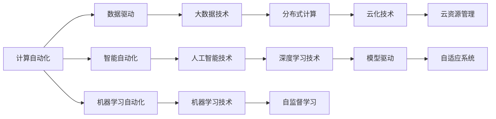

                 

## 1. 背景介绍

在21世纪的今天，计算技术已经深度融入社会的各个领域，从科研、教育到医疗、交通，无处不在。随着人工智能(AI)和大数据技术的发展，自动化技术也在不断演进，与计算技术逐渐融合，形成了计算变化的新浪潮。计算变化与自动化技术的融合，不仅改变了人们的生活方式，也重新定义了许多行业的运作方式。

### 1.1 计算技术在社会中的应用

计算技术的应用范围广泛，从传统的互联网、通信领域，到新兴的医疗、教育、金融等领域，计算技术的渗透日益加深。以下列举几个典型领域：

- **互联网与通信**：计算技术是互联网和通信的核心，无论是网站服务、手机应用还是云计算，计算技术都是其运行的基石。
- **医疗**：通过医疗影像处理、电子病历存储、医疗机器人等应用，计算技术提升了医疗服务的效率和质量。
- **教育**：在线教育平台、智能辅导系统等工具，极大地提高了教育的可及性和个性化。
- **金融**：量化交易、风险控制、客户服务等，都依赖于强大的计算能力。

### 1.2 自动化技术的演进

自动化技术从早期的自动化机械、自动化控制系统，到如今的智能自动化、机器学习自动化，不断演进。自动化技术通过减少人工干预，提高了效率和质量，优化了资源配置，推动了生产力的提升。

#### 1.2.1 早期自动化技术
- **自动化机械**：如蒸汽机、电报机等，这些设备虽然在效率上有了显著提升，但其智能化程度较低。
- **自动化控制系统**：如PLC（可编程逻辑控制器）、SCADA（数据采集与监视控制系统）等，实现了对生产过程的自动化控制。

#### 1.2.2 现代自动化技术
- **智能自动化**：引入机器视觉、传感器技术，实现对复杂环境的高精度控制。
- **机器学习自动化**：利用机器学习算法，对数据进行分析和预测，自动调整系统参数，优化运行效果。

### 1.3 计算变化与自动化技术的融合

随着计算技术的发展，自动化技术越来越依赖于计算技术，尤其是在机器学习、深度学习等领域的推动下，自动化技术正向着更加智能化、自适应化的方向发展。计算变化与自动化技术的融合，成为推动技术进步和应用创新的重要力量。

## 2. 核心概念与联系

### 2.1 核心概念概述

计算变化与自动化技术的融合，涉及许多核心概念。这些概念相互关联，共同构成了现代计算自动化系统的基础。

- **计算自动化**：利用计算技术实现自动化控制，提升系统效率和响应速度。
- **数据驱动自动化**：通过大数据分析，优化决策过程，实现自动化优化。
- **智能自动化**：结合人工智能技术，实现系统的自适应和自优化。
- **机器学习自动化**：利用机器学习算法，自动学习系统模型，实现模型驱动的自动化。
- **计算资源管理**：合理配置和管理计算资源，确保系统稳定运行。

### 2.2 核心概念联系

计算变化与自动化技术的融合，依赖于以下几个关键联系：

1. **数据与计算的联动**：大数据技术为计算自动化提供了大量数据支持，计算技术则为大数据处理提供了强大的计算能力。
2. **人工智能与自动化的融合**：人工智能技术，尤其是机器学习和深度学习，为自动化系统提供了智能决策能力。
3. **系统架构的演进**：计算技术的发展，推动了系统架构从集中式向分布式、云化方向演进。
4. **用户体验的提升**：计算自动化和智能化，极大地提升了用户体验和系统响应速度。

这些联系构成了计算变化与自动化技术的整体框架，推动着技术应用的不断创新和进步。

### 2.3 核心概念的整体架构

下图展示了计算变化与自动化技术的整体架构：



该架构展示了计算自动化技术在数据驱动、智能自动化、机器学习自动化等不同层次的应用，同时强调了大数据技术、人工智能技术、深度学习技术等关键技术在其中的作用。

## 3. 核心算法原理 & 具体操作步骤
### 3.1 算法原理概述

计算变化与自动化技术的融合，核心算法原理主要包括以下几个方面：

1. **数据处理与分析**：通过数据采集、清洗、存储、分析等步骤，提取有价值的信息，为决策提供依据。
2. **智能决策**：结合人工智能技术，实现自动化决策和优化。
3. **模型训练与优化**：利用机器学习算法，训练模型，不断优化决策过程。
4. **系统架构优化**：通过分布式计算、云化技术，提升系统性能和可靠性。

### 3.2 算法步骤详解

计算变化与自动化技术的融合，涉及多个步骤，包括：

1. **需求分析与设计**：明确系统目标和需求，设计系统架构。
2. **数据采集与预处理**：收集系统运行所需数据，并进行清洗、归一化等预处理。
3. **模型训练与优化**：选择适合的机器学习算法，训练模型，进行参数调整和优化。
4. **系统部署与测试**：将训练好的模型部署到实际系统中，进行测试和验证。
5. **监控与维护**：持续监控系统运行状态，及时发现和解决异常问题。

### 3.3 算法优缺点

计算变化与自动化技术的融合，既有显著优势，也存在一些局限性：

#### 3.3.1 优势

1. **效率提升**：自动化技术可以大幅提升系统运行效率，减少人工干预。
2. **决策优化**：通过数据驱动和智能决策，优化系统性能和资源配置。
3. **灵活性增强**：系统架构的分布式和云化，增强了系统的灵活性和可扩展性。

#### 3.3.2 局限性

1. **数据依赖性**：自动化技术高度依赖于数据质量和数据量，数据不足或数据质量差会导致效果不佳。
2. **模型复杂度**：机器学习模型的训练和优化过程复杂，需要大量计算资源和时间。
3. **系统鲁棒性**：系统自动化程度越高，对异常情况和不可预测事件的处理能力越弱。

### 3.4 算法应用领域

计算变化与自动化技术的融合，在多个领域得到了广泛应用：

- **工业制造**：通过自动化控制和机器学习优化，提升生产效率和产品质量。
- **金融服务**：利用大数据分析和智能决策，提高风险控制和客户服务效率。
- **智慧城市**：通过智能交通、智慧能源、智能建筑等，提升城市管理水平和居民生活质量。
- **医疗健康**：通过电子病历、医疗影像分析、智能诊疗系统等，提升医疗服务质量。
- **教育培训**：利用智能辅导系统、在线课程推荐等，提升教育效果和可及性。

## 4. 数学模型和公式 & 详细讲解 & 举例说明

### 4.1 数学模型构建

计算变化与自动化技术的融合，涉及多种数学模型。以下以智能自动化系统为例，介绍其数学模型构建。

1. **输入输出模型**：定义输入数据和输出结果的关系，通常使用函数关系进行描述。
2. **特征提取模型**：从输入数据中提取特征，通常使用线性变换、卷积变换等方法。
3. **决策模型**：基于提取的特征，进行分类或回归，常用的模型包括线性回归、逻辑回归、决策树等。

### 4.2 公式推导过程

以逻辑回归模型为例，其公式推导过程如下：

假设训练数据集为 $(x_1, y_1), (x_2, y_2), ..., (x_n, y_n)$，其中 $x_i$ 为输入特征向量，$y_i$ 为标签。定义逻辑回归模型的线性变换为 $w \cdot x + b$，其中 $w$ 为权重向量，$b$ 为偏置项。定义sigmoid函数为 $f(z) = \frac{1}{1+e^{-z}}$，则逻辑回归模型的预测函数为：

$$
\hat{y_i} = f(w \cdot x_i + b)
$$

将实际标签 $y_i$ 和预测标签 $\hat{y_i}$ 进行比较，得到交叉熵损失函数：

$$
L(w, b) = -\frac{1}{n} \sum_{i=1}^n [y_i \log \hat{y_i} + (1-y_i) \log (1-\hat{y_i})]
$$

通过梯度下降等优化算法，最小化损失函数，得到最优的权重和偏置：

$$
w, b = \mathop{\arg\min}_{w,b} L(w, b)
$$

### 4.3 案例分析与讲解

假设某智能自动化系统用于预测机器故障，其输入特征包括温度、振动、湿度等，输出标签为是否发生故障。利用逻辑回归模型进行训练和预测，其具体步骤如下：

1. 收集历史数据，包括温度、振动、湿度等特征和是否发生故障的标签。
2. 对数据进行标准化处理，得到标准化特征矩阵 $X$ 和标签向量 $y$。
3. 定义逻辑回归模型，使用梯度下降算法训练模型，最小化交叉熵损失函数。
4. 使用训练好的模型，对新的温度、振动、湿度数据进行预测，判断是否发生故障。

## 5. 项目实践：代码实例和详细解释说明

### 5.1 开发环境搭建

计算变化与自动化技术的融合，通常涉及大规模数据处理和计算，因此需要高性能计算环境。以下是一个简单的Python开发环境搭建步骤：

1. 安装Python：在Windows、Linux等操作系统上，从官网下载并安装Python。
2. 安装PyTorch：利用pip安装PyTorch，这是一款常用的深度学习框架。
3. 安装NumPy、Pandas等数据处理库：利用pip安装这些库，用于数据预处理和分析。
4. 搭建分布式计算环境：使用Spark、Hadoop等分布式计算框架，进行大规模数据处理和计算。

### 5.2 源代码详细实现

以下是一个简单的Python代码实现，用于训练逻辑回归模型并进行故障预测：

```python
import numpy as np
import pandas as pd
from sklearn.linear_model import LogisticRegression
from sklearn.metrics import accuracy_score

# 加载数据
data = pd.read_csv('data.csv')

# 划分特征和标签
X = data[['temperature', 'vibration', 'humidity']]
y = data['failure']

# 定义逻辑回归模型
model = LogisticRegression()

# 训练模型
model.fit(X, y)

# 预测新数据
new_data = np.array([[25, 0.1, 0.8]])
prediction = model.predict(new_data)

# 输出预测结果
print('Predicted failure:', prediction)
```

### 5.3 代码解读与分析

以上代码实现了逻辑回归模型的训练和预测过程。首先，使用Pandas库加载数据，然后划分特征和标签。接着，定义逻辑回归模型，并使用fit方法进行训练。最后，使用predict方法对新数据进行预测，并输出结果。

## 6. 实际应用场景

计算变化与自动化技术的融合，在多个实际应用场景中得到了广泛应用。以下列举几个典型案例：

### 6.1 工业制造

在工业制造领域，计算变化与自动化技术的融合主要体现在生产自动化和质量控制方面：

- **生产自动化**：通过机器人自动化、智能控制系统，实现生产线的自动化控制和优化。
- **质量控制**：利用传感器、机器视觉等技术，实时监测生产过程中的质量指标，实现质量控制和优化。

### 6.2 金融服务

在金融服务领域，计算变化与自动化技术的融合主要体现在风险控制和客户服务方面：

- **风险控制**：利用大数据分析和机器学习算法，进行风险预测和控制，提升金融系统的稳健性。
- **客户服务**：通过智能客服系统、在线推荐系统，提升客户体验和服务效率。

### 6.3 智慧城市

在智慧城市领域，计算变化与自动化技术的融合主要体现在智能交通、智慧能源、智能建筑等方面：

- **智能交通**：通过智能交通管理系统、智能停车系统，提升交通效率和管理水平。
- **智慧能源**：通过智能电网、智能储能系统，实现能源的高效管理和优化。
- **智能建筑**：通过智能家居系统、智能安防系统，提升建筑智能化水平和安全性。

### 6.4 医疗健康

在医疗健康领域，计算变化与自动化技术的融合主要体现在电子病历、医疗影像分析、智能诊疗系统等方面：

- **电子病历**：通过电子病历管理系统，实现病历数据的数字化管理和共享。
- **医疗影像分析**：利用机器学习算法，对医疗影像进行自动分析和诊断，提升诊断准确性。
- **智能诊疗系统**：通过智能问答系统、智能推荐系统，提升诊疗效果和服务质量。

## 7. 工具和资源推荐

### 7.1 学习资源推荐

计算变化与自动化技术的融合，涉及多个领域的知识，以下推荐一些优质的学习资源：

1. **《深度学习》书籍**：由Goodfellow等人所著，全面介绍了深度学习的基本原理和应用，是入门深度学习的经典教材。
2. **《机器学习实战》书籍**：由Peter Harrington所著，通过实例介绍了机器学习算法和应用，适合实战练习。
3. **Coursera、edX等在线课程**：提供多种领域的课程，包括数据科学、人工智能、机器学习等，涵盖理论知识和实践技能。
4. **Kaggle平台**：全球最大的数据科学竞赛平台，提供丰富的数据集和挑战，可以提升数据处理和模型训练能力。
5. **GitHub开源项目**：大量优秀的开源项目和代码库，可以学习他人的实现方法和实践经验。

### 7.2 开发工具推荐

计算变化与自动化技术的融合，通常涉及大规模数据处理和计算，以下推荐一些常用的开发工具：

1. **PyTorch**：一款常用的深度学习框架，支持动态计算图和分布式训练，适合高性能计算环境。
2. **TensorFlow**：由Google开发的深度学习框架，支持分布式计算和云化部署，适合大规模工程应用。
3. **Jupyter Notebook**：一款轻量级的开发工具，支持Python代码的交互式执行和数据可视化，适合开发和实验。
4. **Spark**：一款分布式计算框架，支持大规模数据处理和计算，适合大数据应用。
5. **Docker**：一款容器化管理工具，支持应用程序的快速部署和运行，适合云化应用。

### 7.3 相关论文推荐

计算变化与自动化技术的融合，是当前研究的热点话题，以下推荐一些相关的经典论文：

1. **《Deep Learning》论文**：由Goodfellow等人发表，介绍了深度学习的基本原理和应用，是深度学习领域的奠基性论文。
2. **《Google Brain机器学习速成课程》论文**：由Google Brain团队发表，介绍了机器学习的基础知识和应用，适合入门学习。
3. **《AutoML: Efficient and Effective Automated Machine Learning》论文**：介绍了自动机器学习的概念和实现方法，适合深入研究。
4. **《Data Mining: Concepts and Techniques》书籍**：由J Han等人所著，全面介绍了数据挖掘和知识发现的基本方法和应用，适合深入学习。

## 8. 总结：未来发展趋势与挑战

### 8.1 研究成果总结

计算变化与自动化技术的融合，已经成为当前技术发展的重要方向。以下总结了几个关键研究成果：

1. **数据驱动的自动化**：通过大数据分析，提升自动化决策的精度和效率。
2. **智能自动化**：结合人工智能技术，实现系统的自适应和自优化。
3. **分布式计算**：通过分布式计算和云化技术，提升系统性能和可扩展性。
4. **机器学习自动化**：利用机器学习算法，优化自动化决策和优化过程。

### 8.2 未来发展趋势

计算变化与自动化技术的融合，未来发展趋势如下：

1. **自动化程度的提升**：随着自动化技术的发展，越来越多的任务将被自动化处理。
2. **智能化水平的提高**：通过人工智能技术，自动化系统将具备更强的智能决策和自优化能力。
3. **多领域应用的扩展**：自动化技术将在更多领域得到应用，如智慧交通、智慧能源、智能建筑等。
4. **跨领域融合**：自动化技术与物联网、5G、区块链等新兴技术将深度融合，推动智能化社会的建设。
5. **安全性与伦理的重视**：随着自动化系统的普及，其安全性和伦理问题将受到更多关注，需要加强技术监管和道德约束。

### 8.3 面临的挑战

计算变化与自动化技术的融合，仍面临诸多挑战：

1. **数据质量问题**：数据质量和数据量不足，影响自动化系统的准确性和稳定性。
2. **算法复杂性**：机器学习算法训练复杂，需要大量计算资源和时间。
3. **系统鲁棒性**：自动化系统面对异常情况和不可预测事件，处理能力有限。
4. **隐私和安全问题**：自动化系统涉及大量敏感数据，需要加强隐私保护和安全防护。
5. **伦理道德问题**：自动化系统的决策过程缺乏透明度和可解释性，可能带来伦理道德问题。

### 8.4 研究展望

计算变化与自动化技术的融合，未来研究展望如下：

1. **多领域融合**：探索自动化技术与多领域技术的深度融合，推动跨领域智能化发展。
2. **安全性与伦理**：研究自动化系统的安全性、隐私保护和伦理约束，确保技术应用的合理性和可持续性。
3. **智能化升级**：通过深度学习和人工智能技术，提升自动化系统的智能化水平。
4. **自适应系统**：研究自动化系统的自适应和自优化能力，提升系统应对变化的能力。
5. **普适性优化**：研究自动化系统的普适性和可扩展性，推动技术应用的广泛普及。

## 9. 附录：常见问题与解答

### Q1：什么是计算变化与自动化技术的融合？

A: 计算变化与自动化技术的融合，是指通过计算技术实现自动化控制和优化，提升系统效率和决策精度。

### Q2：数据驱动的自动化有哪些优势和局限性？

A: 数据驱动的自动化主要依赖于大数据分析，其优势包括提升决策精度、优化系统性能等，但局限性在于对数据质量和数据量的依赖，以及数据处理过程的复杂性。

### Q3：计算自动化与智能化自动化的区别是什么？

A: 计算自动化主要是通过计算技术实现自动化控制，而智能化自动化则结合人工智能技术，实现系统的自适应和自优化。

### Q4：自动化技术在智慧城市中的应用有哪些？

A: 自动化技术在智慧城市中的应用包括智能交通、智慧能源、智能建筑等，通过自动化控制和优化，提升城市管理水平和居民生活质量。

### Q5：未来自动化技术的发展趋势是什么？

A: 未来自动化技术的发展趋势包括自动化程度的提升、智能化水平的提高、多领域应用的扩展、跨领域融合、安全性与伦理的重视、普适性优化等。

---

作者：禅与计算机程序设计艺术 / Zen and the Art of Computer Programming

