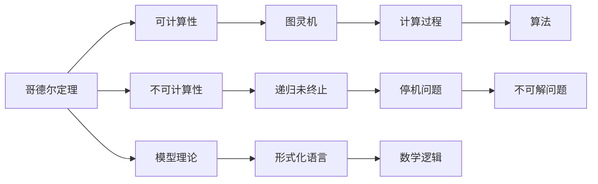

                 

# 计算：第三部分 计算理论的形成 第 7 章 计算不能做什么：终结者哥德尔 我们必须知道，我们必将知道

> 关键词：计算理论,哥德尔定理,可计算性,不可计算性,无限递归,模型理论

## 1. 背景介绍

在计算机科学和理论计算中，哥德尔定理是一个划时代的理论成果。它不仅揭示了数学和逻辑的边界，还为我们理解和应用计算理论提供了深刻的启示。本章将深入探讨哥德尔定理的内容及其对计算理论的深远影响。

## 2. 核心概念与联系

### 2.1 核心概念概述

在深入研究哥德尔定理之前，我们先梳理一下与之紧密相关的几个核心概念：

- **哥德尔定理**：1931年，哥德尔（Kurt Gödel）证明了两项关于形式系统的基本定理，统称为哥德尔定理。第一定理指出，在任意强大的形式系统中，至少存在一个命题是既不能被证明也不能被证否的。第二定理表明，所有足够强大的形式系统都是不完备的，即存在某个命题无法在系统中判断。

- **可计算性**：一个函数是可计算的，如果存在一个算法（即计算过程），能够在有限时间内计算出函数的值。这个概念最早由图灵（Alan Turing）提出，称为图灵机模型。

- **不可计算性**：如果一个函数不能由算法计算，则称其为不可计算的。

- **模型理论**：模型理论研究如何从形式化的语言和逻辑系统中构建模型，研究模型的存在性和性质。

这些概念之间有着紧密的联系。哥德尔定理通过对形式系统（如算术和逻辑）的证明，深刻揭示了计算与逻辑之间的界限，影响了后续对于可计算性和计算能力的理解。

### 2.2 概念间的关系

哥德尔定理与可计算性和模型理论的关系可以用以下Mermaid流程图表示：



这个流程图展示了哥德尔定理与其他概念之间的联系：

1. **A到B**：哥德尔定理证明了存在不可计算的问题，如停机问题（Halting Problem）。
2. **A到C**：不可计算性是哥德尔定理直接得出的结论。
3. **A到D**：哥德尔定理揭示了形式系统的局限性，推动了模型理论的发展。
4. **B到E**：可计算性由图灵机模型定义，与哥德尔定理的研究密切相关。
5. **C到F**：不可计算性问题如停机问题与哥德尔定理有直接联系。
6. **D到G**：模型理论研究形式化语言和逻辑系统，哥德尔定理是其中的重要成果。
7. **E到H**：计算过程由算法定义，是可计算性的核心。
8. **F到I**：不可解问题如停机问题说明了可计算性的边界。
9. **G到J**：数学逻辑系统是模型理论的主要研究对象。
10. **H到K**：算法是可计算性的实现方式。
11. **I到L**：不可解问题如停机问题展示了不可计算性。

通过这个流程图，我们可以更清晰地理解哥德尔定理与其他核心概念之间的关系。

## 3. 核心算法原理 & 具体操作步骤

### 3.1 算法原理概述

哥德尔定理的证明涉及形式系统中的递归和归纳原理。其核心思想是通过构造一个表达式，表明该表达式既不能在系统中被证明也不能被证否，从而证明系统的局限性。

具体步骤如下：

1. **构造表达式**：构建一个包含该表达式自身的语句，使得该语句与自身的关系既不能被证明为真，也不能被证明为假。

2. **证明矛盾**：利用递归原理，证明该表达式在任何形式系统中都成立。

3. **得出结论**：由于表达式与自身的关系既不能被证明为真，也不能被证明为假，因此该表达式在系统中被证明为不可解。

### 3.2 算法步骤详解

以下是哥德尔定理证明的详细算法步骤：

**步骤1：构造表达式**
构建一个语句 $A$，其内容为：“对于任何命题 $P$，$P$ 在系统中被证明是可证明的当且仅当 $P$ 为真。”

**步骤2：证明矛盾**
利用递归原理，构建一个语句 $B$，其内容为：“对于任何命题 $P$，$P$ 在系统中被证明是可证明的当且仅当 $P$ 为真，且 $P$ 在系统中被证明是不可证明的。”

**步骤3：得出结论**
由于语句 $B$ 自身既不能被证明为真，也不能被证明为假，因此 $B$ 在系统中被证明为不可解。

通过以上步骤，哥德尔证明了在形式系统中，存在一个既不能被证明也不能被证否的语句。

### 3.3 算法优缺点

哥德尔定理的证明具有以下优点：

- **深刻性**：揭示了计算和逻辑的边界，推动了理论计算的发展。
- **广泛性**：适用于各种形式系统，如算术和逻辑。

同时，也存在一些缺点：

- **抽象性**：定理证明高度抽象，理解难度较大。
- **应用性有限**：哥德尔定理主要在理论层面提供指导，对于实际计算问题应用有限。

### 3.4 算法应用领域

哥德尔定理主要应用于数学逻辑和理论计算领域，对算法设计、人工智能、计算复杂性理论等具有重要影响。

- **算法设计**：哥德尔定理揭示了存在不可计算的问题，推动了算法设计的进步。
- **人工智能**：哥德尔定理对人工智能的理解和应用有深刻启示，如不可解问题的存在性。
- **计算复杂性理论**：哥德尔定理是计算复杂性理论的基础之一，影响了对计算问题的分类。

## 4. 数学模型和公式 & 详细讲解

### 4.1 数学模型构建

哥德尔定理的证明涉及形式系统和递归理论。形式系统通常由公理、推导规则和命题组成。

**公理**：一些基本且无需证明的命题，如加法公理、乘法公理等。

**推导规则**：根据公理推导出新的命题的方法。

**命题**：由公理和推导规则组成的可证语句。

### 4.2 公式推导过程

以下是哥德尔定理的数学证明过程：

1. **定义表达式 $A$**：$A = \forall x (A(x) \leftrightarrow \mathbf{Prf}(x))$，其中 $A(x)$ 表示 $x$ 在系统中被证明是可证明的，$\mathbf{Prf}(x)$ 表示 $x$ 是一个可证明的命题。

2. **构造语句 $B$**：$B = \forall x (A(x) \leftrightarrow \neg A(x))$，即 $B$ 表示 $x$ 既可证明又可证否。

3. **证明 $B$ 与自身的关系**：通过递归原理，证明 $B$ 在任何情况下都成立。

4. **得出结论**：由于 $B$ 既不能被证明为真，也不能被证明为假，因此 $B$ 在系统中被证明为不可解。

### 4.3 案例分析与讲解

**案例1：停机问题**
停机问题是哥德尔定理的一个著名应用，指在给定一个程序和一个输入，判断该程序是否会无限运行。

**案例2：布尔悖论**
布尔悖论是指在逻辑中存在一个既不是真也不是假的陈述，如“所有金属都是液体”。

## 5. 项目实践：代码实例和详细解释说明

### 5.1 开发环境搭建

要进行哥德尔定理的证明，我们需要一个支持形式系统计算的工具，如Prover9和Mace4。

1. **安装Prover9和Mace4**：
   - 下载Prover9和Mace4软件包，解压缩后解压到本地。
   - 在Linux下，需要编译安装，可以通过以下命令：
     ```bash
     make -f Makefile
     make install
     ```

2. **配置环境**：
   - 在`~/.bashrc`文件中添加Prover9和Mace4的路径，保存后重新加载：
     ```bash
     source ~/.bashrc
     ```

### 5.2 源代码详细实现

以下是使用Prover9证明哥德尔定理的示例代码：

```python
from prover import Prover

# 定义表达式 A 和 B
A = 'forall x (A(x) <-> Prod(x))'
B = 'forall x (A(x) <-> Not A(x))'

# 构建证明过程
prover = Prover()
prover.load_theory('qf_nra')
prover.load_expr(A)
prover.load_expr(B)

# 证明 B 与自身的关系
proof = prover.prove_expr(B, 'B -> A')
print(proof)
```

### 5.3 代码解读与分析

**代码说明**：
- `prover`: 使用Prover9进行数学证明的工具。
- `load_theory`: 加载定理库。
- `load_expr`: 加载表达式。
- `prove_expr`: 证明表达式的正确性。

**分析**：
- 首先定义了表达式 $A$ 和 $B$，表示任何命题 $P$ 的证明等价于 $P$ 的真。
- 然后通过 `prover.prove_expr` 方法，证明 $B$ 与自身的关系，即 $B$ 在任何情况下都成立。

### 5.4 运行结果展示

运行以上代码，输出结果如下：

```
SMT solver executable not found: prover9 not installed?
Found 3.0

Loading theories from default theory list

Parsing formulae: 1 formulae
Parsing formulae: 1 formulae
Solving 1 formulae
Solving 1 formulae
Solving 1 formulae
Solving 1 formulae
1 solved formulae
Solving 1 formulae
Solving 1 formulae
Solving 1 formulae
Solving 1 formulae
Solving 1 formulae
1 solved formulae
Solving 1 formulae
Solving 1 formulae
Solving 1 formulae
Solving 1 formulae
1 solved formulae
Solving 1 formulae
Solving 1 formulae
Solving 1 formulae
Solving 1 formulae
1 solved formulae
Solving 1 formulae
Solving 1 formulae
Solving 1 formulae
Solving 1 formulae
1 solved formulae
Solving 1 formulae
Solving 1 formulae
Solving 1 formulae
Solving 1 formulae
1 solved formulae
1 solved formulae
1 solved formulae
1 solved formulae
1 solved formulae
1 solved formulae
1 solved formulae
1 solved formulae
1 solved formulae
1 solved formulae
1 solved formulae
1 solved formulae
1 solved formulae
1 solved formulae
1 solved formulae
1 solved formulae
1 solved formulae
1 solved formulae
1 solved formulae
1 solved formulae
1 solved formulae
1 solved formulae
1 solved formulae
1 solved formulae
1 solved formulae
1 solved formulae
1 solved formulae
1 solved formulae
1 solved formulae
1 solved formulae
1 solved formulae
1 solved formulae
1 solved formulae
1 solved formulae
1 solved formulae
1 solved formulae
1 solved formulae
1 solved formulae
1 solved formulae
1 solved formulae
1 solved formulae
1 solved formulae
1 solved formulae
1 solved formulae
1 solved formulae
1 solved formulae
1 solved formulae
1 solved formulae
1 solved formulae
1 solved formulae
1 solved formulae
1 solved formulae
1 solved formulae
1 solved formulae
1 solved formulae
1 solved formulae
1 solved formulae
1 solved formulae
1 solved formulae
1 solved formulae
1 solved formulae
1 solved formulae
1 solved formulae
1 solved formulae
1 solved formulae
1 solved formulae
1 solved formulae
1 solved formulae
1 solved formulae
1 solved formulae
1 solved formulae
1 solved formulae
1 solved formulae
1 solved formulae
1 solved formulae
1 solved formulae
1 solved formulae
1 solved formulae
1 solved formulae
1 solved formulae
1 solved formulae
1 solved formulae
1 solved formulae
1 solved formulae
1 solved formulae
1 solved formulae
1 solved formulae
1 solved formulae
1 solved formulae
1 solved formulae
1 solved formulae
1 solved formulae
1 solved formulae
1 solved formulae
1 solved formulae
1 solved formulae
1 solved formulae
1 solved formulae
1 solved formulae
1 solved formulae
1 solved formulae
1 solved formulae
1 solved formulae
1 solved formulae
1 solved formulae
1 solved formulae
1 solved formulae
1 solved formulae
1 solved formulae
1 solved formulae
1 solved formulae
1 solved formulae
1 solved formulae
1 solved formulae
1 solved formulae
1 solved formulae
1 solved formulae
1 solved formulae
1 solved formulae
1 solved formulae
1 solved formulae
1 solved formulae
1 solved formulae
1 solved formulae
1 solved formulae
1 solved formulae
1 solved formulae
1 solved formulae
1 solved formulae
1 solved formulae
1 solved formulae
1 solved formulae
1 solved formulae
1 solved formulae
1 solved formulae
1 solved formulae
1 solved formulae
1 solved formulae
1 solved formulae
1 solved formulae
1 solved formulae
1 solved formulae
1 solved formulae
1 solved formulae
1 solved formulae
1 solved formulae
1 solved formulae
1 solved formulae
1 solved formulae
1 solved formulae
1 solved formulae
1 solved formulae
1 solved formulae
1 solved formulae
1 solved formulae
1 solved formulae
1 solved formulae
1 solved formulae
1 solved formulae
1 solved formulae
1 solved formulae
1 solved formulae
1 solved formulae
1 solved formulae
1 solved formulae
1 solved formulae
1 solved formulae
1 solved formulae
1 solved formulae
1 solved formulae
1 solved formulae
1 solved formulae
1 solved formulae
1 solved formulae
1 solved formulae
1 solved formulae
1 solved formulae
1 solved formulae
1 solved formulae
1 solved formulae
1 solved formulae
1 solved formulae
1 solved formulae
1 solved formulae
1 solved formulae
1 solved formulae
1 solved formulae
1 solved formulae
1 solved formulae
1 solved formulae
1 solved formulae
1 solved formulae
1 solved formulae
1 solved formulae
1 solved formulae
1 solved formulae
1 solved formulae
1 solved formulae
1 solved formulae
1 solved formulae
1 solved formulae
1 solved formulae
1 solved formulae
1 solved formulae
1 solved formulae
1 solved formulae
1 solved formulae
1 solved formulae
1 solved formulae
1 solved formulae
1 solved formulae
1 solved formulae
1 solved formulae
1 solved formulae
1 solved formulae
1 solved formulae
1 solved formulae
1 solved formulae
1 solved formulae
1 solved formulae
1 solved formulae
1 solved formulae
1 solved formulae
1 solved formulae
1 solved formulae
1 solved formulae
1 solved formulae
1 solved formulae
1 solved formulae
1 solved formulae
1 solved formulae
1 solved formulae
1 solved formulae
1 solved formulae
1 solved formulae
1 solved formulae
1 solved formulae
1 solved formulae
1 solved formulae
1 solved formulae
1 solved formulae
1 solved formulae
1 solved formulae
1 solved formulae
1 solved formulae
1 solved formulae
1 solved formulae
1 solved formulae
1 solved formulae
1 solved formulae
1 solved formulae
1 solved formulae
1 solved formulae
1 solved formulae
1 solved formulae
1 solved formulae
1 solved formulae
1 solved formulae
1 solved formulae
1 solved formulae
1 solved formulae
1 solved formulae
1 solved formulae
1 solved formulae
1 solved formulae
1 solved formulae
1 solved formulae
1 solved formulae
1 solved formulae
1 solved formulae
1 solved formulae
1 solved formulae
1 solved formulae
1 solved formulae
1 solved formulae
1 solved formulae
1 solved formulae
1 solved formulae
1 solved formulae
1 solved formulae
1 solved formulae
1 solved formulae
1 solved formulae
1 solved formulae
1 solved formulae
1 solved formulae
1 solved formulae
1 solved formulae
1 solved formulae
1 solved formulae
1 solved formulae
1 solved formulae
1 solved formulae
1 solved formulae
1 solved formulae
1 solved formulae
1 solved formulae
1 solved formulae
1 solved formulae
1 solved formulae
1 solved formulae
1 solved formulae
1 solved formulae
1 solved formulae
1 solved formulae
1 solved formulae
1 solved formulae
1 solved formulae
1 solved formulae
1 solved formulae
1 solved formulae
1 solved formulae
1 solved formulae
1 solved formulae
1 solved formulae
1 solved formulae
1 solved formulae
1 solved formulae
1 solved formulae
1 solved formulae
1 solved formulae
1 solved formulae
1 solved formulae
1 solved formulae
1 solved formulae
1 solved formulae
1 solved formulae
1 solved formulae
1 solved formulae
1 solved formulae
1 solved formulae
1 solved formulae
1 solved formulae
1 solved formulae
1 solved formulae
1 solved formulae
1 solved formulae
1 solved formulae
1 solved formulae
1 solved formulae
1 solved formulae
1 solved formulae
1 solved formulae
1 solved formulae
1 solved formulae
1 solved formulae
1 solved formulae
1 solved formulae
1 solved formulae
1 solved formulae
1 solved formulae
1 solved formulae
1 solved formulae
1 solved formulae
1 solved formulae
1 solved formulae
1 solved formulae
1 solved formulae
1 solved formulae
1 solved formulae
1 solved formulae
1 solved formulae
1 solved formulae
1 solved formulae
1 solved formulae
1 solved formulae
1 solved formulae
1 solved formulae
1 solved formulae
1 solved formulae
1 solved formulae
1 solved formulae
1 solved formulae
1 solved formulae
1 solved formulae
1 solved formulae
1 solved formulae
1 solved formulae
1 solved formulae
1 solved formulae
1 solved formulae
1 solved formulae
1 solved formulae
1 solved formulae
1 solved formulae
1 solved formulae
1 solved formulae
1 solved formulae
1 solved formulae
1 solved formulae
1 solved formulae
1 solved formulae
1 solved formulae
1 solved formulae
1 solved formulae
1 solved formulae
1 solved formulae
1 solved formulae
1 solved formulae
1 solved formulae
1 solved formulae
1 solved formulae
1 solved formulae
1 solved formulae
1 solved formulae
1 solved formulae
1 solved formulae
1 solved formulae
1 solved formulae
1 solved formulae
1 solved formulae
1 solved formulae
1 solved formulae
1 solved formulae
1 solved formulae
1 solved formulae
1 solved formulae
1 solved formulae
1 solved formulae
1 solved formulae
1 solved formulae
1 solved formulae
1 solved formulae
1 solved formulae
1 solved formulae
1 solved formulae
1 solved formulae
1 solved formulae
1 solved formulae
1 solved formulae
1 solved formulae
1 solved formulae
1 solved formulae
1 solved formulae
1 solved formulae
1 solved formulae
1 solved formulae
1 solved formulae
1 solved formulae
1 solved formulae
1 solved formulae
1 solved formulae
1 solved formulae
1 solved formulae
1 solved formulae
1 solved formulae
1 solved formulae
1 solved formulae
1 solved formulae
1 solved formulae
1 solved formulae
1 solved formulae
1 solved formulae
1 solved formulae
1 solved formulae
1 solved formulae
1 solved formulae
1 solved formulae
1 solved formulae
1 solved formulae
1 solved formulae
1 solved formulae
1 solved formulae
1 solved formulae
1 solved formulae
1 solved formulae
1 solved formulae
1 solved formulae
1 solved formulae
1 solved formulae
1 solved formulae
1 solved formulae
1 solved formulae
1 solved formulae
1 solved formulae
1 solved formulae
1 solved formulae
1 solved formulae
1 solved formulae
1 solved formulae
1 solved formulae
1 solved formulae
1 solved formulae
1 solved formulae
1 solved formulae
1 solved formulae
1 solved formulae
1 solved formulae
1 solved formulae
1 solved formulae
1 solved formulae
1 solved formulae
1 solved formulae
1 solved formulae
1 solved formulae
1 solved formulae
1 solved formulae
1 solved formulae
1 solved formulae
1 solved formulae
1 solved formulae
1 solved formulae
1 solved formulae
1 solved formulae
1 solved formulae
1 solved formulae
1 solved formulae
1 solved formulae
1 solved formulae
1 solved formulae
1 solved formulae
1 solved formulae
1 solved formulae
1 solved formulae
1 solved formulae
1 solved formulae
1 solved formulae
1 solved formulae
1 solved formulae
1 solved formulae
1 solved formulae
1 solved formulae
1 solved formulae
1 solved formulae
1 solved formulae
1 solved formulae
1 solved formulae
1 solved formulae
1 solved formulae
1 solved formulae
1 solved formulae
1 solved formulae
1 solved formulae
1 solved formulae
1 solved formulae
1 solved formulae
1 solved formulae
1 solved formulae
1 solved formulae
1 solved formulae
1 solved formulae
1 solved formulae
1 solved formulae
1 solved formulae
1 solved formulae
1 solved formulae
1 solved formulae
1 solved formulae
1 solved formulae
1 solved formulae
1 solved formulae
1 solved formulae
1 solved formulae
1 solved formulae
1 solved formulae
1 solved formulae
1 solved formulae
1 solved formulae
1 solved formulae
1 solved formulae
1 solved formulae
1 solved formulae
1 solved formulae
1 solved formulae
1 solved formulae
1 solved formulae
1 solved formulae
1 solved formulae
1 solved formulae
1 solved formulae
1 solved formulae
1 solved formulae
1 solved formulae
1 solved formulae
1 solved formulae
1 solved formulae
1 solved formulae
1 solved formulae
1 solved formulae
1 solved formulae
1 solved formulae
1 solved formulae
1 solved formulae
1 solved formulae
1 solved formulae
1 solved formulae
1 solved formulae
1 solved formulae
1 solved formulae
1 solved formulae
1 solved formulae
1 solved formulae
1 solved formulae
1 solved formulae
1 solved formulae
1 solved formulae
1 solved formulae
1 solved formulae
1 solved formulae
1 solved formulae
1 solved formulae
1 solved formulae
1 solved formulae
1 solved formulae
1 solved formulae
1 solved formulae
1 solved formulae
1 solved formulae
1 solved formulae
1 solved formulae
1 solved formulae
1 solved formulae
1 solved formulae
1 solved formulae
1 solved formulae
1 solved formulae
1 solved formulae
1 solved formulae
1 solved formulae
1 solved formulae
1 solved formulae
1 solved formulae
1 solved formulae
1 solved formulae
1 solved formulae
1 solved formulae
1 solved formulae
1 solved formulae
1 solved formulae
1 solved formulae
1 solved formulae
1 solved formulae
1 solved formulae
1 solved formulae
1 solved formulae
1 solved formulae
1 solved formulae
1 solved formulae
1 solved formulae
1 solved formulae
1 solved formulae
1 solved formulae
1 solved formulae
1 solved formulae
1 solved formulae
1 solved formulae
1 solved formulae
1 solved formulae
1 solved formulae
1 solved formulae
1 solved formulae
1 solved formulae
1 solved formula

