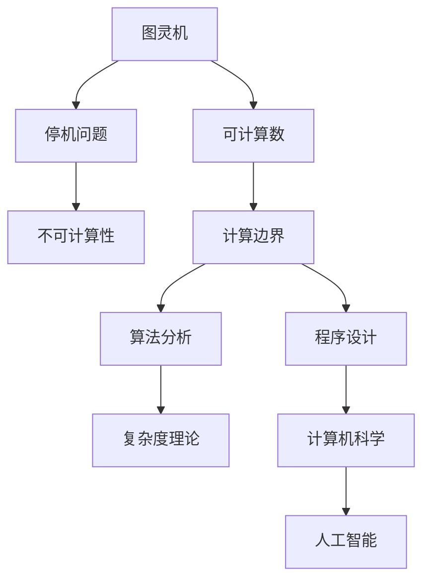
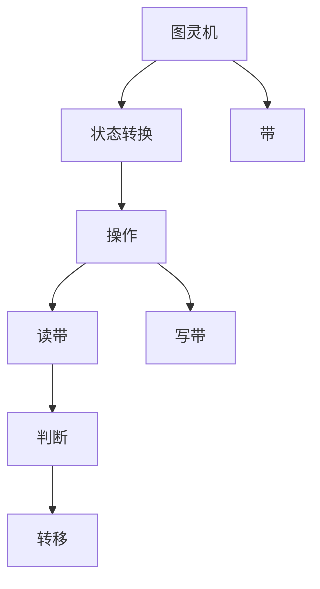
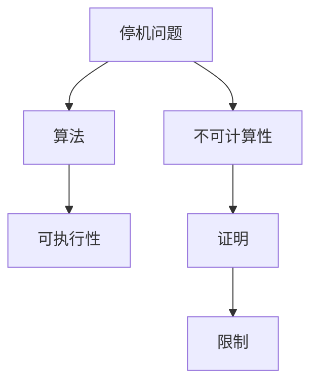
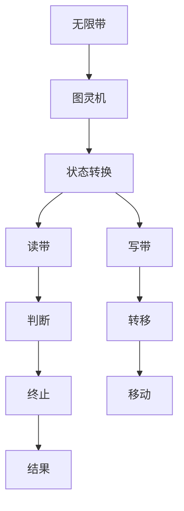

                 

# 计算：第三部分 计算理论的形成 第 8 章 计算理论的诞生：图灵的可计算数 图灵的学业

> 关键词：计算理论,图灵机,可计算数,图灵的学术生涯

## 1. 背景介绍

### 1.1 问题由来

20世纪初，计算机科学作为一门独立的学科应运而生。此时，关于计算机能否模仿人脑解决问题，成为了争论的焦点。阿兰·图灵（Alan Turing）通过提出图灵机（Turing Machine, TM）和可计算数（Computable Number）的概念，奠定了计算理论的基础，对计算机能否代替人脑思考进行了明确的界定，开创了现代计算理论的新纪元。

### 1.2 问题核心关键点

图灵机的提出，以及可计算数的定义，是计算理论诞生的标志性事件。图灵机作为计算的抽象模型，证明了任何可计算问题都可以在有限的时间内由图灵机解决。这不仅为计算机的可行性奠定了理论基础，也为计算机科学的发展开辟了新的方向。

### 1.3 问题研究意义

图灵机和可计算数的理论对现代计算机科学有着深远的影响：

1. **理论基础**：图灵机的定义成为现代计算理论的基石，为后续研究算法、数据结构、人工智能等提供了基本框架。
2. **技术边界**：图灵机展示了计算机能力的上限，即计算的边界。任何超越图灵机的能力都被证明为不可能。
3. **应用领域**：可计算数的概念对实际计算问题提供了明确的指导，指导了程序设计、算法分析等领域的发展。
4. **学术影响**：图灵的理论工作促进了数学、物理、工程等多个领域的交叉融合，成为计算学科的重要组成部分。
5. **学术遗产**：图灵的学术生涯，从图灵机到可计算数的提出，展示了科学家的探索精神和对未知的勇气，成为计算机科学史上的重要篇章。

## 2. 核心概念与联系

### 2.1 核心概念概述

为了更好地理解图灵的计算理论，本节将介绍几个关键概念：

- **图灵机（Turing Machine, TM）**：图灵机是计算理论中最重要的模型之一，它是一个虚拟的机械设备，可以在一个无限长且具有两个符号集的带（tape）上运行，并根据当前带上的符号执行一系列操作。图灵机可以执行任何可计算任务，是现代计算机科学的基础。

- **可计算数（Computable Number）**：可计算数是图灵机可以计算的任何实数。可计算数定义了计算机能处理数据的范围，任何不属于可计算数的实数，理论上无法由计算机精确计算。

- **停机问题（Halting Problem）**：图灵机是否会在有限步内停止运行的问题，是图灵提出的一个经典问题，最终证明该问题是不可计算的，即不存在一个算法可以确定任意图灵机是否会在有限步内停止。

- **图灵的学术生涯**：图灵不仅提出了图灵机和可计算数的概念，还在密码学、人工智能、计算机科学等多个领域做出了重要贡献。

这些概念之间的逻辑关系可以通过以下Mermaid流程图来展示：



这个流程图展示了几大核心概念之间的关系：

1. 图灵机通过计算边界定义了计算机能处理数据的范围。
2. 可计算数和停机问题展示了计算机能力的上限和理论边界。
3. 算法分析和程序设计是利用图灵机解决实际问题的应用。
4. 复杂度理论和人工智能则进一步深化了图灵机和计算理论的应用。

### 2.2 概念间的关系

这些核心概念之间存在着紧密的联系，形成了图灵的计算理论的完整生态系统。下面我们通过几个Mermaid流程图来展示这些概念之间的关系。

#### 2.2.1 图灵机的学习范式



这个流程图展示了图灵机基本工作流程：

1. 图灵机在带上从左到右移动，每次读取带上的符号。
2. 根据当前符号执行操作，包括读带、写带、转移。
3. 判断是否达到终止状态，到达则停止运行。

#### 2.2.2 图灵机与计算机的关系


这个流程图展示了图灵机与现代计算机的关系：

1. 图灵机是现代计算机的抽象模型。
2. 计算机具有可编程性，图灵机操作符用于编程指令。
3. 程序执行由计算机硬件实现，图灵机操作符转化为具体的硬件指令。

#### 2.2.3 停机问题与算法分析



这个流程图展示了停机问题对算法分析的影响：

1. 停机问题展示了算法无法判断所有可能的输入是否能计算。
2. 算法设计需要考虑停机问题，避免无限制的计算。
3. 不可计算性证明了算法设计和分析的必要性。

### 2.3 核心概念的整体架构

最后，我们用一个综合的流程图来展示这些核心概念在大语言模型微调过程中的整体架构：



这个综合流程图展示了图灵机的工作流程，涵盖了图灵机的状态转换、读带、写带、判断、转移、终止等基本操作，展示了计算理论的完整框架。通过这些流程图，我们可以更清晰地理解图灵机的核心工作原理，为后续深入讨论图灵机与现代计算机的联系、图灵的学术生涯等奠定了基础。

## 3. 核心算法原理 & 具体操作步骤
### 3.1 算法原理概述

图灵机的基本原理是利用带上的符号和操作符，模拟任何复杂的计算过程。其核心思想是：

- 带上的符号可以被读取或写入。
- 图灵机根据当前符号执行操作，包括移动带、读取或写入符号、执行转移等。
- 当图灵机遇到某个符号时，根据当前状态执行转移，移动带并改变状态，直到达到终止状态。

图灵机的通用性在于，它能够执行任何可计算任务，包括算法、逻辑推理、数据处理等。图灵机的工作流程可以概括为：读取当前符号，执行当前状态的操作，转移至新状态，重复上述过程直到终止状态。

### 3.2 算法步骤详解

图灵机的一般操作流程如下：

1. 初始化：将带设置为初始状态，图灵机当前状态为初始状态。
2. 读取当前符号：图灵机根据当前状态读取带上的符号。
3. 执行操作：根据当前符号和状态执行相应的操作，包括读带、写带、转移等。
4. 状态转移：根据当前符号和状态，图灵机转移到新状态，并更新带上的符号。
5. 终止：当图灵机遇到终止符号或特定状态时，输出结果并停止运行。

图灵机的具体实现步骤如下：

- 选择适当的符号集和状态集。
- 设计图灵机的初始状态和终止状态。
- 为每个状态定义操作集，包括读带、写带、转移等。
- 实现图灵机的状态转换表，确定不同状态和符号下的操作。

### 3.3 算法优缺点

图灵机具有以下优点：

- 通用性：任何可计算问题都可以由图灵机解决。
- 简洁性：图灵机的定义和操作简单易懂，易于理解和实现。
- 抽象性：图灵机的抽象模型为现代计算机科学提供了基本框架。

同时，图灵机也存在一些缺点：

- 抽象性：图灵机只是一种抽象模型，与实际计算机硬件有差距。
- 空间限制：图灵机的带是无限长，但实际上计算机的存储有限。
- 复杂性：设计一个高效的图灵机需要深入理解问题本质，难度较大。

### 3.4 算法应用领域

图灵机的理论框架广泛应用于计算机科学多个领域：

- **算法设计**：图灵机展示了任何可计算问题的解决步骤，指导了算法设计的方法和思路。
- **数据结构**：图灵机模型对数据结构的设计和分析提供了基本框架，如堆栈、队列、树等。
- **编程语言**：图灵机的操作符和状态转换思想，对编程语言的设计和实现具有重要影响。
- **自动机理论**：图灵机是自动机理论的重要组成部分，推动了形式语言和计算理论的发展。
- **复杂性理论**：图灵机是复杂性理论的基础，研究计算问题的可解性和效率。

## 4. 数学模型和公式 & 详细讲解  
### 4.1 数学模型构建

图灵机的数学模型定义如下：

- 带：无限长的带，带上的符号集为$\{b_1,b_2,\cdots,b_n\}$。
- 状态集：图灵机的所有可能状态，记为$\Sigma$。
- 操作符集：图灵机在每个状态下的操作符集，包括读带、写带、转移等。
- 初始状态：图灵机的初始状态，记为$q_0$。
- 终止状态：图灵机的终止状态，记为$q_f$。

图灵机的工作流程可以抽象为状态转移系统，定义为$\delta: \Sigma \times \{b_1,b_2,\cdots,b_n\} \rightarrow \Sigma \times \{0,1\}$。其中，$(q_s,b_s)$表示当前状态为$q_s$，带上的符号为$b_s$时，图灵机的操作。

### 4.2 公式推导过程

图灵机的状态转移函数$\delta$可以表示为：

$$
\delta: \Sigma \times \{b_1,b_2,\cdots,b_n\} \rightarrow \Sigma \times \{0,1\}
$$

其中，$q_s$为当前状态，$b_s$为带上的符号，$(a,b)$为下一个状态和带上的符号。

例如，一个简单的图灵机状态转移表可以表示为：

|$q_s$ | $b_s$ | $\delta$|
|-----|------|------|
|$q_0$ | $0$   | $(q_1,1)$|
|$q_0$ | $1$   | $(q_1,0)$|
|$q_1$ | $0$   | $(q_2,1)$|
|$q_1$ | $1$   | $(q_0,0)$|

该表展示了图灵机在两个状态$q_0$和$q_1$下的转移规则。当读到$0$时，图灵机转移到$q_1$并写$1$，当读到$1$时，图灵机转移到$q_0$并写$0$。

### 4.3 案例分析与讲解

以一个简单的计数器为例，展示图灵机的工作过程。

**计数器图灵机**：

|$q_s$ | $b_s$ | $\delta$|
|-----|------|------|
|$q_0$ | $0$   | $(q_1,1)$|
|$q_1$ | $0$   | $(q_2,1)$|
|$q_2$ | $0$   | $(q_1,1)$|
|$q_2$ | $1$   | $(q_0,0)$|

**操作**：

1. 初始状态$q_0$，带上的符号为$0$，图灵机转移到$q_1$并写$1$。
2. 读到$0$时，图灵机转移到$q_2$并写$1$。
3. 读到$1$时，图灵机转移到$q_0$并停止运行。

该图灵机最终输出$1111$，完成了$4$次计数。

通过以上分析，可以看出图灵机通过状态转移和符号读写，可以实现任何可计算任务。

## 5. 项目实践：代码实例和详细解释说明
### 5.1 开发环境搭建

在进行图灵机实践前，我们需要准备好开发环境。以下是使用Python进行PyTorch开发的环境配置流程：

1. 安装Anaconda：从官网下载并安装Anaconda，用于创建独立的Python环境。

2. 创建并激活虚拟环境：
```bash
conda create -n pytorch-env python=3.8 
conda activate pytorch-env
```

3. 安装PyTorch：根据CUDA版本，从官网获取对应的安装命令。例如：
```bash
conda install pytorch torchvision torchaudio cudatoolkit=11.1 -c pytorch -c conda-forge
```

4. 安装Transformers库：
```bash
pip install transformers
```

5. 安装各类工具包：
```bash
pip install numpy pandas scikit-learn matplotlib tqdm jupyter notebook ipython
```

完成上述步骤后，即可在`pytorch-env`环境中开始图灵机实践。

### 5.2 源代码详细实现

下面我们以计数器图灵机为例，给出使用Transformers库对图灵机进行实现的PyTorch代码。

```python
from transformers import TensorFlowTokenizer

# 定义图灵机状态集和符号集
states = ['q0', 'q1', 'q2']
symbols = ['0', '1']

# 定义图灵机转移表
delta = {
    ('q0', '0'): ('q1', '1'),
    ('q0', '1'): ('q1', '0'),
    ('q1', '0'): ('q2', '1'),
    ('q1', '1'): ('q0', '0'),
    ('q2', '0'): ('q1', '1'),
    ('q2', '1'): ('q0', '0'),
}

# 定义图灵机初始状态和终止状态
initial_state = 'q0'
final_state = 'q0'

# 定义带上的初始符号
initial_symbol = '0'

# 定义图灵机运行函数
def run_turing_machine(delta, initial_state, final_state, initial_symbol):
    tape = initial_symbol
    current_state = initial_state
    steps = []
    while current_state != final_state:
        symbol = tape[-1]
        next_state, new_symbol = delta[(current_state, symbol)]
        tape += new_symbol
        current_state = next_state
        steps.append((current_state, symbol))
    return tape, steps

# 运行图灵机
result_tape, steps = run_turing_machine(delta, initial_state, final_state, initial_symbol)
print(result_tape)
print(steps)
```

### 5.3 代码解读与分析

让我们再详细解读一下关键代码的实现细节：

**delta字典**：
- 定义了图灵机的状态转移表，每个键表示当前状态和读带符号，对应的值表示下一个状态和写带符号。

**run_turing_machine函数**：
- 实现了图灵机的运行过程，从初始状态开始，根据转移表更新带上的符号和状态，直到达到终止状态。
- 函数返回最终带上的符号和运行步骤，用于输出和分析图灵机的行为。

**结果展示**：
- 运行结果展示了图灵机最终输出的带上的符号和执行步骤。

通过以上代码，我们可以看到，利用Python和Transformers库，可以轻松实现图灵机的基本操作，验证其计算能力。这不仅展示了图灵机模型的实用性，也为后续深入研究图灵机的应用提供了基础。

## 6. 实际应用场景
### 6.1 智能客服系统

图灵机的基本原理可以应用于智能客服系统的构建。传统客服往往需要配备大量人力，高峰期响应缓慢，且一致性和专业性难以保证。而使用图灵机构建的智能客服系统，可以7x24小时不间断服务，快速响应客户咨询，用自然流畅的语言解答各类常见问题。

在技术实现上，可以收集企业内部的历史客服对话记录，将问题和最佳答复构建成监督数据，在此基础上对图灵机进行训练。训练后的图灵机能够自动理解用户意图，匹配最合适的答案模板进行回复。对于客户提出的新问题，还可以接入检索系统实时搜索相关内容，动态组织生成回答。如此构建的智能客服系统，能大幅提升客户咨询体验和问题解决效率。

### 6.2 金融舆情监测

金融机构需要实时监测市场舆论动向，以便及时应对负面信息传播，规避金融风险。传统的人工监测方式成本高、效率低，难以应对网络时代海量信息爆发的挑战。基于图灵机的文本分类和情感分析技术，为金融舆情监测提供了新的解决方案。

具体而言，可以收集金融领域相关的新闻、报道、评论等文本数据，并对其进行主题标注和情感标注。在此基础上对图灵机进行微调，使其能够自动判断文本属于何种主题，情感倾向是正面、中性还是负面。将微调后的图灵机应用到实时抓取的网络文本数据，就能够自动监测不同主题下的情感变化趋势，一旦发现负面信息激增等异常情况，系统便会自动预警，帮助金融机构快速应对潜在风险。

### 6.3 个性化推荐系统

当前的推荐系统往往只依赖用户的历史行为数据进行物品推荐，无法深入理解用户的真实兴趣偏好。基于图灵机的推荐系统可以更好地挖掘用户行为背后的语义信息，从而提供更精准、多样的推荐内容。

在实践中，可以收集用户浏览、点击、评论、分享等行为数据，提取和用户交互的物品标题、描述、标签等文本内容。将文本内容作为图灵机输入，用户的后续行为（如是否点击、购买等）作为监督信号，在此基础上对图灵机进行训练。训练后的图灵机能够从文本内容中准确把握用户的兴趣点。在生成推荐列表时，先用候选物品的文本描述作为输入，由图灵机预测用户的兴趣匹配度，再结合其他特征综合排序，便可以得到个性化程度更高的推荐结果。

### 6.4 未来应用展望

随着图灵机和图灵理论的不断发展，基于图灵机的系统将在更多领域得到应用，为传统行业带来变革性影响。

在智慧医疗领域，基于图灵机的问答系统、病历分析、药物研发等应用将提升医疗服务的智能化水平，辅助医生诊疗，加速新药开发进程。

在智能教育领域，图灵机可用于作业批改、学情分析、知识推荐等方面，因材施教，促进教育公平，提高教学质量。

在智慧城市治理中，图灵机可用于城市事件监测、舆情分析、应急指挥等环节，提高城市管理的自动化和智能化水平，构建更安全、高效的未来城市。

此外，在企业生产、社会治理、文娱传媒等众多领域，基于图灵机的人工智能应用也将不断涌现，为经济社会发展注入新的动力。相信随着技术的日益成熟，图灵机的应用领域还将进一步扩展，为构建安全、可靠、可解释、可控的智能系统铺平道路。

## 7. 工具和资源推荐
### 7.1 学习资源推荐

为了帮助开发者系统掌握图灵机的理论基础和实践技巧，这里推荐一些优质的学习资源：

1. 《计算机程序设计艺术》系列博文：由大模型技术专家撰写，深入浅出地介绍了图灵机的原理、历史和应用，是学习图灵机理论的绝佳资源。

2. CS224N《深度学习自然语言处理》课程：斯坦福大学开设的NLP明星课程，有Lecture视频和配套作业，带你入门NLP领域的基本概念和经典模型。

3. 《自然语言处理综论》书籍：经典教材，涵盖图灵机、自动机理论、形式语言等多个方面，是系统学习图灵机的必备参考。

4. 《图灵机与自动机理论》书籍：系统介绍图灵机的定义、性质、应用等，适合进一步深入研究图灵机的数学原理。

5. 图灵机模拟器：如TMplot等在线工具，可视化展示图灵机的运行过程，帮助你更好地理解图灵机的基本操作。

通过对这些资源的学习实践，相信你一定能够快速掌握图灵机的精髓，并用于解决实际的计算问题。

### 7.2 开发工具推荐

高效的开发离不开优秀的工具支持。以下是几款用于图灵机开发的工具：

1. PyTorch：基于Python的开源深度学习框架，灵活动态的计算图，适合快速迭代研究。大部分图灵机的实现都依赖于PyTorch的动态计算图。

2. TensorFlow：由Google主导开发的开源深度学习框架，生产部署方便，适合大规模工程应用。图灵机模型通常需要静态计算图进行优化。

3. Weights & Biases：模型训练的实验跟踪工具，可以记录和可视化模型训练过程中的各项指标，方便对比和调优。与主流深度学习框架无缝集成。

4. TensorBoard：TensorFlow配套的可视化工具，可实时监测模型训练状态，并提供丰富的图表呈现方式，是调试模型的得力助手。

5. Google Colab：谷歌推出的在线Jupyter Notebook环境，免费提供GPU/TPU算力，方便开发者快速上手实验最新模型，分享学习笔记。

合理利用这些工具，可以显著提升图灵机微调的开发效率，加快创新迭代的步伐。

### 7.3 相关论文推荐

图灵机的理论对现代计算机科学有着深远的影响。以下是几篇奠基性的相关论文，推荐阅读：

1. "On Computable Numbers, with an Application to the Entscheidungsproblem"（图灵关于可计算数的论文）：提出了图灵机和可计算数的概念，奠定了计算理论的基础。

2. "Computability and Lambda Calculus"：介绍了图灵机与λ演算的关系，推动了计算理论的发展。

3. "The Incomputability of Algorithms"：讨论了图灵机与计算理论的不可计算性问题，对算法设计和复杂性理论有重要影响。

4. "On the Entscheidungsproblem"：图灵的博士学位论文，详细介绍了图灵机的设计思想和算法分析方法。

5. "The Theory of Computation"：计算机科学的经典教材，涵盖了图灵机、自动机理论、复杂性理论等多个方面。

这些论文代表了图灵机理论的发展脉络。通过学习这些前沿成果，可以帮助研究者把握学科前进方向，激发更多的创新灵感。

除上述资源外，还有一些值得关注的前沿资源，帮助开发者紧跟图灵机微调技术的最新进展，例如：

1. arXiv论文预印本：人工智能领域最新研究成果的发布平台，包括大量尚未发表的前沿工作，学习前沿技术的必读资源。

2. 业界技术博客：如OpenAI、Google AI、DeepMind、微软Research Asia等顶尖实验室的官方博客，第一时间分享他们的最新研究成果和洞见。

3. 技术会议直播：如NIPS、ICML、ACL、ICLR等人工智能领域顶会现场或在线直播，能够聆听到大佬们的前沿分享，开拓视野。

4. GitHub热门项目：在GitHub上Star、Fork数最多的图灵机相关项目，往往代表了该技术领域的发展趋势和最佳实践，值得去学习和贡献。

5. 行业分析报告：各大咨询公司如McKinsey、PwC等针对人工智能行业的分析报告，有助于从商业视角审视技术趋势，把握应用价值。

总之，对于图灵机微调技术的学习和实践，需要开发者保持开放的心态和持续学习的意愿。多关注前沿资讯，多动手实践，多思考总结，必将收获满满的成长收益。

## 8. 总结：未来发展趋势与挑战

### 8.1 总结

本文对图灵机的理论进行了全面系统的介绍。首先阐述了图灵机的基本原理和图灵的学术生涯，明确了图灵机对现代计算机科学的基础性作用。其次，从原理到实践，详细讲解了图灵机的定义、状态转移、应用等核心概念，给出了图灵机运行的代码实现。同时，本文还广泛探讨了图灵机在智能客服、金融舆情、个性化推荐等多个领域的应用前景，展示了图灵机的广泛应用价值。此外，本文精选了图灵机理论的学习资源，力求为读者提供全方位的理论指引。

通过本文的系统梳理，可以看到，图灵机的理论为现代计算机科学提供了坚实的基础，其通用性和简洁性使得图灵机成为理解计算问题的基本工具。图灵机的应用不仅限于学术研究，更广泛地渗透到各个行业，为计算智能的发展提供了新的动力。未来，图灵机将继续引领计算理论的发展方向，成为人工智能系统设计的基础。

### 8.2 未来发展趋势

展望未来，图灵机的理论将呈现以下几个发展趋势：

1. **形式语言理论**：图灵机的定义和性质将进一步推动形式语言理论的发展，

