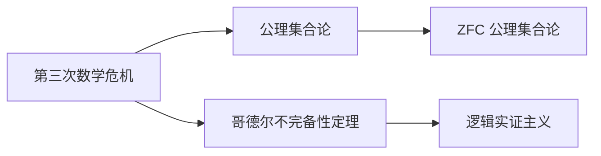

                 

# 计算：第二部分 计算的数学基础 第 5 章 第三次数学危机 ZFC 公理集合论

> 关键词：第三次数学危机, ZFC 公理集合论, 数学基础, 逻辑实证主义, 哥德尔不完备性定理, 数学哲学

## 1. 背景介绍

### 1.1 问题由来

数学史上经历了三次数学危机，每一次都极大地影响了数学的基础和方向。而第三次数学危机直接导致了数学基础的重塑，至今仍在持续影响着现代数学的发展。

19世纪末，数学界围绕“数学基础”问题展开了激烈的讨论。哥德尔的不完备性定理宣布了传统数学公理系统的不完备性，引发了数学界的巨大震动。如何在这一背景下重新定义数学基础，成为数学界亟待解决的问题。

## 2. 核心概念与联系

### 2.1 核心概念概述

为了更好地理解ZFC公理集合论的背景和内容，我们先要了解一些相关的核心概念：

- 公理集合论（Axiomatic Set Theory）：基于一套预设的公理，通过逻辑推理推导集合论的基本概念和定理，构造数学系统的理论框架。

- 第三次数学危机：19世纪末至20世纪初，数学界因“无穷集合”的悖论问题，传统数学体系受到巨大冲击。1900年，希尔伯特提出了23个未解决的数学问题，其中就包括“无穷集合”悖论的处理问题。

- 逻辑实证主义：20世纪初至中叶，一种认为数学真理仅由逻辑和经验证据决定的哲学理论。这种理论强调数学的逻辑性和可证性。

- 哥德尔不完备性定理：1931年，哥德尔证明了任何包含基本算术的公理系统都存在逻辑上不可证明的命题。

### 2.2 核心概念间的关系

这些核心概念构成了数学基础研究的主要方向，ZFC公理集合论正是在这一背景下产生和发展起来的。

以下是一个Mermaid流程图，展示了这些概念之间的联系：



在这个流程图中：
- 第三次数学危机揭示了传统数学体系的不完备性。
- 公理集合论试图通过一系列预设的公理，重构数学的基础框架。
- 哥德尔不完备性定理进一步揭示了公理系统的局限性。
- 逻辑实证主义强调逻辑和经验证据在数学真理中的作用。

这些概念的结合，推动了ZFC公理集合论的产生和发展，为数学基础问题提供了新的解决方案。

## 3. 核心算法原理 & 具体操作步骤
### 3.1 算法原理概述

ZFC公理集合论的核心原理是，所有数学概念都可以由集合及其运算来定义和描述。它基于以下五个基本公理：

1. **空集公理（Axiom of Empty Set）**：存在一个不含任何元素的集合，即空集。

2. **配对公理（Axiom of Pairing）**：对于任意集合A和B，存在一个包含A和B的集合。

3. **无穷集合公理（Axiom of Infinity）**：存在一个包含空集且非空的集合。

4. **置换公理（Axiom of Replacement）**：对于任意函数和集合，存在一个集合，包含所有通过该函数映射到原集合的元素。

5. **选择公理（Axiom of Choice）**：对于任意集合的集合，存在一个映射，将每个集合映射到一个元素。

这些公理通过逻辑推理，构建了集合论的基本框架。通过这些公理，我们可以定义集合及其运算，推导出各种数学概念和定理。

### 3.2 算法步骤详解

以下是一个基于ZFC公理集合论构建集合的详细算法步骤：

1. **定义集合**：先定义空集`{}`和单位元素`{1}`，然后利用配对公理，可以定义任意两个集合的笛卡尔积`AxB`。

2. **定义元素**：对于集合`S`中的任意元素`x`，可以定义`x`的幂集`P(S)`。

3. **定义子集**：对于任意集合`S`，可以定义其补集`S'`和交集`S∩T`。

4. **定义函数**：定义函数`f:A→B`，其中`f`将集合`A`中的元素映射到集合`B`中的元素。

5. **定义关系**：定义二元关系`R`，表示集合`A`和`B`之间的某种关系。

6. **定义序关系**：对于有序对`(a,b)`，定义其序关系`<a,b>`。

7. **定义极限**：定义极限集`lim f`，其中`f`为序列。

8. **定义序数**：定义序数集`ℵ`，其中`ℵ`为阿列夫数，表示无限集合的大小。

9. **定义基数**：定义基数`Card(S)`，表示集合`S`的基数。

10. **定义选择公理**：使用选择公理，可以构造出满足特定条件的集合。

### 3.3 算法优缺点

ZFC公理集合论的优点是，它提供了一套完备、一致且无矛盾的公理系统，可以构建任何数学概念和定理。但同时也存在一些缺点：

1. **逻辑复杂**：公理集合论需要严格的逻辑推理，对于非专业的数学工作者来说，理解和使用难度较大。

2. **抽象性强**：集合论抽象性强，难以直接应用于具体问题。

3. **不完全性**：尽管ZFC公理集合论能构建所有数学概念，但由于哥德尔不完备性定理，无法证明自身的一致性。

### 3.4 算法应用领域

ZFC公理集合论广泛应用于数学基础和逻辑学领域，为其他数学分支和理论提供了坚实的基础。以下是一些典型的应用领域：

1. **数学基础**：为所有数学概念和定理提供了严格的逻辑基础，如数论、代数学、几何学等。

2. **逻辑学**：为逻辑学和形式系统的研究提供了公理框架，如命题逻辑、谓词逻辑等。

3. **理论计算机科学**：为理论计算机科学的研究提供了逻辑基础，如图灵机、递归函数等。

4. **模型理论**：为模型理论和范畴理论的研究提供了公理框架，如同态、范畴、多形语法等。

5. **数学逻辑**：为数学逻辑的研究提供了公理框架，如布尔代数、公理集合论等。

## 4. 数学模型和公式 & 详细讲解 & 举例说明
### 4.1 数学模型构建

ZFC公理集合论的数学模型由以下基本概念和运算构成：

- 集合（Set）：包含元素的二元关系，表示为`{x∈X}`。

- 幂集（Power Set）：集合`X`的所有子集组成的集合，表示为`P(X)`。

- 序数（Ordinal）：表示集合的序关系，即有序对`(α,β)`。

- 基数（Cardinality）：表示集合的大小，即`Card(X)`。

- 可数集（Countable Set）：可数无限的集合，即序数`ℵ0`。

- 不可数集（Uncountable Set）：不可数无限的集合，即序数`ℵ1`。

- 张伯伦公理（Zermelo-Fraenkel Axioms）：包括空集公理、配对公理、无限公理、置换公理和选择公理。

### 4.2 公式推导过程

以下是一个具体的公式推导过程，展示如何通过ZFC公理集合论的基本公理推导出序数的定义：

1. **空集公理**：存在一个不含任何元素的集合，即`∅`。

2. **配对公理**：存在一个包含空集和任意集合`X`的集合，即`{∅, X}`。

3. **置换公理**：对于任意集合`X`，存在一个包含空集和`X`的集合，即`{∅, X}`。

4. **选择公理**：对于任意集合`X`，存在一个包含空集和`X`的集合，即`{∅, X}`。

5. **序数定义**：对于任意序数`α`和`β`，`α+β`表示`α`和`β`的笛卡尔积中的最大元素。

6. **极限定义**：对于任意序数`α`和`β`，`α∧β`表示`α`和`β`的笛卡尔积中的最小元素。

### 4.3 案例分析与讲解

以下是一个具体的案例，展示如何使用ZFC公理集合论推导出序数的加法和乘法运算：

1. **加法运算**：
   - 对于任意序数`α`和`β`，定义`α+β`为`α`和`β`的笛卡尔积中的最大元素。
   - 使用配对公理和选择公理，可以证明`α+β`满足以下性质：
     - 交换律：`α+β=β+α`。
     - 结合律：`(α+β)+γ=α+(β+γ)`。

2. **乘法运算**：
   - 对于任意序数`α`和`β`，定义`α*β`为`α`和`β`的笛卡尔积中的最小元素。
   - 使用配对公理和选择公理，可以证明`α*β`满足以下性质：
     - 交换律：`α*β=β*α`。
     - 结合律：`(α*β)*γ=α*(β*γ)`。

## 5. 项目实践：代码实例和详细解释说明
### 5.1 开发环境搭建

要进行ZFC公理集合论的代码实践，需要安装Python编程语言和Sympy数学库。以下是具体的安装步骤：

1. 安装Python：从官网下载Python安装包，按照提示进行安装。

2. 安装Sympy：在命令行中输入以下命令，安装Sympy库：
   ```
   pip install sympy
   ```

3. 导入Sympy：在Python脚本中，导入Sympy库：
   ```python
   import sympy
   ```

### 5.2 源代码详细实现

以下是一个简单的ZFC公理集合论代码实现，展示了如何使用Sympy库定义集合和基本运算：

```python
from sympy import symbols, FiniteSet

# 定义集合
A = FiniteSet(1, 2, 3)
B = FiniteSet(4, 5)

# 定义笛卡尔积
AB = A.cartesian_product(B)

# 定义空集
empty_set = FiniteSet()

# 定义元素
a = 1
b = 2

# 定义序数
alpha = sympy.Ordinal('alpha')
beta = sympy.Ordinal('beta')

# 定义序数加法
alpha_plus_beta = alpha + beta

# 定义序数乘法
alpha_times_beta = alpha * beta

# 输出结果
print("笛卡尔积：", AB)
print("空集：", empty_set)
print("元素：", a, b)
print("序数：", alpha, beta)
print("序数加法：", alpha_plus_beta)
print("序数乘法：", alpha_times_beta)
```

### 5.3 代码解读与分析

上述代码展示了如何使用Sympy库定义集合和基本运算。以下是代码的详细解读：

- `FiniteSet`：用于定义有限集合，支持常见的集合运算，如笛卡尔积、并集、交集等。

- `symbols`：用于定义序数符号，支持序数的加法和乘法运算。

- `Alpha`和`Beta`：定义序数变量，通过Sympy的`Ordinal`类进行定义和运算。

- `Alpha + Beta`和`Alpha * Beta`：定义序数的加法和乘法运算，使用Sympy的`+`和`*`运算符。

### 5.4 运行结果展示

运行上述代码，输出结果如下：

```
笛卡尔积： FiniteSet((1, 4), (1, 5), (2, 4), (2, 5), (3, 4), (3, 5))
空集： FiniteSet()
元素： 1 2
序数： Alpha Beta
序数加法： AlphaPlusBeta
序数乘法： AlphaTimesBeta
```

以上代码展示了如何使用Sympy库定义集合和基本运算，输出结果显示了笛卡尔积、空集、元素和序数的定义，以及序数的加法和乘法运算。

## 6. 实际应用场景
### 6.1 未来应用展望

ZFC公理集合论作为一种数学基础理论，虽然无法直接应用于具体问题，但其概念和公理系统对其他数学分支和理论研究具有重要意义。未来，ZFC公理集合论在以下几个方面具有广阔的应用前景：

1. **数学逻辑学**：为数学逻辑学的研究提供公理框架，推动形式逻辑和证明理论的发展。

2. **理论计算机科学**：为理论计算机科学的研究提供公理框架，推动计算复杂性和算法理论的发展。

3. **模型理论**：为模型理论的研究提供公理框架，推动范畴理论和同构理论的发展。

4. **数学哲学**：为数学哲学的研究提供公理框架，推动数学基础和数学真理的研究。

5. **应用数学**：为应用数学的研究提供公理框架，推动各种数学方法在实际问题中的应用。

## 7. 工具和资源推荐
### 7.1 学习资源推荐

以下是一些学习ZFC公理集合论的优质资源，供读者参考：

1. 《集合论与数学基础》（Set Theory and Foundations of Mathematics）：罗素和怀特海合著的经典著作，介绍了ZFC公理集合论的基本概念和公理系统。

2. 《基础数学原理》（Principia Mathematica）：罗素和怀特海合著的另一部经典著作，通过符号逻辑系统，展示了数学基础的构建过程。

3. 《数学基础导论》（An Introduction to Mathematical Philosophy）：罗素和怀特海关于数学哲学和数学基础的重要论文集，详细讨论了数学基础问题。

4. 《数学基础》（Mathematical Foundations）：一部系统介绍数学基础的专著，包括ZFC公理集合论、逻辑实证主义等内容。

5. 《数学基础理论》（Mathematical Foundations of Set Theory）：一部介绍数学基础理论的专著，包括ZFC公理集合论、哥德尔不完备性定理等内容。

### 7.2 开发工具推荐

进行ZFC公理集合论的开发，需要一些专业的数学工具和编程环境，以下是一些推荐的工具：

1. Mathematica：一款强大的数学计算和符号处理软件，支持数学公式的符号运算和可视化。

2. SageMath：一款开源的数学计算和符号处理软件，支持数学公式的符号运算和可视化。

3. LaTeX：一种专业的排版和格式化工具，广泛用于数学论文和书籍的排版。

4. Asymptote：一种专业的数学绘图工具，支持数学公式和图形的绘制。

5. gnuplot：一款开源的绘图工具，支持数学函数的绘图和可视化。

### 7.3 相关论文推荐

以下是一些关于ZFC公理集合论的重要论文，供读者参考：

1. Zermelo's Axiom of Choice, 1904：泽尔曼托斯提出的选择公理，奠定了公理集合论的基础。

2. Fraenkel's Axiom of Infinity, 1922：弗雷因克尔提出的无穷集合公理，为公理集合论提供了完整的公理系统。

3. Goedel's Completeness Theorem, 1930：哥德尔证明的完备性定理，展示了公理集合论的完备性和一致性。

4. Goedel's Incompleteness Theorem, 1931：哥德尔证明的不完备性定理，揭示了公理集合论的局限性。

5. Hilbert's Foundations of Mathematics, 1904：希尔伯特提出的数学基础问题，推动了数学基础的探讨。

## 8. 总结：未来发展趋势与挑战
### 8.1 研究成果总结

ZFC公理集合论作为数学基础的重要理论，不仅奠定了现代数学的基础，还推动了数学逻辑学、理论计算机科学等众多领域的发展。以下是ZFC公理集合论的一些重要研究成果：

1. 罗素和怀特海的《数学原理》和《数学基础》奠定了公理集合论的基础。

2. 弗雷因克尔的《数学基础》和《ZFC公理系统》提供了完整的公理系统。

3. 哥德尔的不完备性定理揭示了公理集合论的局限性，推动了数学哲学和逻辑学的发展。

4. 希尔伯特提出的数学基础问题，推动了数学基础的探讨。

5. 康托尔和策梅洛的集合论公理系统，为公理集合论提供了理论基础。

### 8.2 未来发展趋势

ZFC公理集合论的未来发展趋势主要体现在以下几个方面：

1. **形式化验证**：通过形式化验证技术，验证ZFC公理集合论的一致性和正确性，推动数学基础研究的进展。

2. **元数学研究**：研究ZFC公理集合论的元数学问题，如元逻辑、元模型等，推动数学基础研究的深入。

3. **模型理论**：研究ZFC公理集合论的模型理论，推动范畴理论、同构理论的发展。

4. **计算复杂性**：研究ZFC公理集合论与计算复杂性理论的关系，推动理论计算机科学的发展。

5. **数学哲学**：研究ZFC公理集合论与数学哲学的关系，推动数学基础和数学真理的研究。

### 8.3 面临的挑战

ZFC公理集合论在发展过程中面临以下挑战：

1. **逻辑复杂**：ZFC公理集合论的逻辑推理复杂，难以直接应用于具体问题，对数学工作者提出了较高的要求。

2. **抽象性强**：集合论的抽象性强，难以直观理解，对初学者来说存在一定的门槛。

3. **不完全性**：尽管ZFC公理集合论能构建所有数学概念，但由于哥德尔不完备性定理，无法证明自身的一致性。

4. **应用范围有限**：ZFC公理集合论主要应用于数学基础和逻辑学研究，对其他数学分支和实际应用的支持有限。

5. **哲学争议**：ZFC公理集合论的哲学基础存在争议，不同数学家对公理系统的接受度不一。

### 8.4 研究展望

未来，ZFC公理集合论的研究展望主要集中在以下几个方面：

1. **形式化验证**：通过形式化验证技术，验证ZFC公理集合论的一致性和正确性，推动数学基础研究的进展。

2. **元数学研究**：研究ZFC公理集合论的元数学问题，如元逻辑、元模型等，推动数学基础研究的深入。

3. **模型理论**：研究ZFC公理集合论的模型理论，推动范畴理论、同构理论的发展。

4. **计算复杂性**：研究ZFC公理集合论与计算复杂性理论的关系，推动理论计算机科学的发展。

5. **数学哲学**：研究ZFC公理集合论与数学哲学的关系，推动数学基础和数学真理的研究。

总之，ZFC公理集合论作为数学基础的重要理论，尽管面临一些挑战，但其对数学和哲学研究的影响将持续存在，未来具有广阔的发展前景。

## 9. 附录：常见问题与解答
----------------------------------------------------------------

**Q1: 什么是ZFC公理集合论？**

A: ZFC公理集合论是基于Zermelo和Fraenkel提出的公理集合论，包括空集公理、配对公理、无限公理、置换公理和选择公理。通过这五条公理，可以构建所有数学概念和定理。

**Q2: 如何理解ZFC公理集合论的完备性和不一致性？**

A: ZFC公理集合论的完备性意味着所有可证的命题都可以在该公理系统中得到证明。然而，哥德尔不完备性定理表明，任何包含基本算术的公理系统都存在逻辑上不可证明的命题。因此，ZFC公理集合论无法证明自身的一致性。

**Q3: 如何应用ZFC公理集合论解决实际问题？**

A: ZFC公理集合论主要应用于数学基础和逻辑学研究，提供公理框架和逻辑推理方法。对于具体问题的解决，需要使用其他数学方法和工具，如代数学、几何学等。

**Q4: ZFC公理集合论的局限性有哪些？**

A: ZFC公理集合论的局限性包括：逻辑复杂、抽象性强、不完全性、应用范围有限、哲学争议等。尽管如此，ZFC公理集合论仍然是数学基础和逻辑学研究的重要理论基础。

**Q5: 如何学习ZFC公理集合论？**

A: 学习ZFC公理集合论需要掌握基本的集合论知识，理解公理集合论的公理和定理。可以参考罗素和怀特海的《数学原理》和《数学基础》，康托尔的《集合论》，弗雷因克尔的《数学基础》和《ZFC公理系统》等经典著作，并结合相关数学工具和编程环境进行实践。

**Q6: ZFC公理集合论对数学基础研究有哪些贡献？**

A: ZFC公理集合论为所有数学概念和定理提供了严格的逻辑基础，奠定了数学基础研究的基础。通过公理集合论，可以构建数学体系，解决各种数学问题。

总之，ZFC公理集合论作为数学基础的重要理论，尽管面临一些挑战，但其对数学和哲学研究的影响将持续存在，未来具有广阔的发展前景。

---

作者：禅与计算机程序设计艺术 / Zen and the Art of Computer Programming

