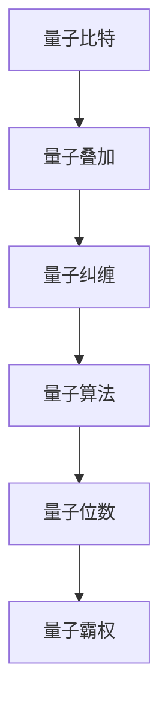

                 

# 计算：第四部分 计算的极限 第 10 章 量子计算 展望量子霸权

> 关键词：量子计算,量子霸权,量子算法,量子位数,量子纠缠,量子超导,超导量子计算机,硅基量子芯片,离子阱量子计算机,光量子计算机

## 1. 背景介绍

### 1.1 问题由来
随着信息技术与智能科技的迅猛发展，计算能力已从经典计算向量子计算跨越。量子计算具备超越经典计算的潜能，有望在解决某些复杂问题上取得革命性突破。特别是“量子霸权”（Quantum Supremacy）的提出，激发了全球科研机构和企业对量子计算的极大兴趣。

### 1.2 问题核心关键点
量子计算的核心在于利用量子力学的原理，通过量子叠加态和量子纠缠来提升计算能力。相较于经典计算的二进制比特，量子计算中的量子比特（Qubit）能够同时表示0和1，具有更强的并行性。具体而言，量子霸权即量子计算机能够在特定任务上，在短于经典计算机的计算时间内完成计算。

## 2. 核心概念与联系

### 2.1 核心概念概述

- **量子比特**（Qubit）：量子计算的基本单位，对应经典计算中的二进制位（Bit）。Qubit通过量子叠加和量子纠缠特性，可以实现比经典比特更多的计算态。
- **量子叠加**（Quantum Superposition）：Qubit同时处于0和1状态，通过测量才能确定具体状态，实现了并行计算能力。
- **量子纠缠**（Quantum Entanglement）：两个或多个Qubit之间存在非经典关联，单个Qubit的状态决定了所有纠缠Qubit的状态。
- **量子算法**：如Shor算法、Grover算法等，专门设计用于量子计算机，能够显著加速某些特定问题的求解。
- **量子位数的多少**：直接决定量子计算机的计算能力和处理问题的复杂度。
- **量子霸权**（Quantum Supremacy）：量子计算机在某些特定任务上，展示出超越经典计算机的计算速度。
- **量子位数**：关键因素，随着量子位数增加，量子计算机的计算能力指数级提升。

### 2.2 概念间的关系

量子计算的核心概念和目标可以通过以下Mermaid流程图来展示：



该流程图展示了量子计算的基本概念及其相互关系：量子比特通过量子叠加和量子纠缠，能够执行高效的并行计算，通过设计专门的量子算法，大幅提升特定问题的求解速度，量子位数则直接决定计算能力。量子霸权是量子计算的目标和评价标准。

## 3. 核心算法原理 & 具体操作步骤
### 3.1 算法原理概述

量子计算的核心原理是利用量子力学的叠加和纠缠特性，提升计算效率。相较于经典计算的串行操作，量子计算能够同时处理多个计算路径，大幅提升问题求解速度。其关键在于以下几个步骤：

1. **初始化**：将量子比特置为叠加态，为后续计算做准备。
2. **演化**：通过量子门操作，量子比特经历演化，状态发生变化。
3. **测量**：对量子比特进行测量，得到确定性结果。

### 3.2 算法步骤详解

量子计算的核心步骤包括量子比特的初始化、量子门操作和测量输出，具体步骤如下：

1. **初始化量子比特**：通过量子态$|\psi_0\rangle=\frac{1}{\sqrt{2}}(|0\rangle+|1\rangle)$，表示量子比特处于叠加态。
2. **量子门操作**：应用Hadamard门（H门）、Pauli-X门（X门）等，通过量子门操作改变量子比特状态。例如，通过CNOT门，实现量子纠缠。
3. **测量输出**：对量子比特进行测量，得到0或1的概率分布，实现确定性结果。

### 3.3 算法优缺点

量子计算的优势在于并行计算和量子纠缠，能够显著提升问题求解速度，特别是在复杂问题如质因数分解、搜索和优化问题上。但量子计算也存在以下缺点：

- **技术复杂度高**：量子计算对环境极为敏感，量子比特易受噪声和干扰，保持量子态的稳定性挑战巨大。
- **硬件需求高**：需要极端低温环境，量子计算机造价高昂，且依赖于量子位的准确控制。
- **实现难度大**：量子算法设计复杂，需要高度专业化的知识和技能。

### 3.4 算法应用领域

量子计算的潜在应用领域广泛，主要包括：

- **密码学**：如Shor算法可以高效破解当前主流公钥密码体系。
- **药物设计**：利用量子计算的高效搜索能力，加速药物分子的模拟和设计。
- **优化问题**：如Google的Sycamore实验，展示了量子计算机在优化问题上的优势。
- **机器学习**：量子计算能够加速数据处理和特征提取，优化机器学习算法。
- **科学模拟**：如量子蒙特卡洛方法，能够在量子计算机上高效模拟量子系统。

## 4. 数学模型和公式 & 详细讲解 & 举例说明

### 4.1 数学模型构建

量子计算的核心数学模型包括量子比特状态、量子门操作和量子态演化等。量子比特的状态表示为复数向量，量子门通过线性变换改变量子比特状态，量子态演化则遵循量子力学规律。

设量子比特初始状态为$|\psi_0\rangle=a_0|0\rangle+a_1|1\rangle$，其中$a_0,a_1$为复数。通过H门操作，量子比特状态变为：

$$
|\psi_1\rangle=\frac{1}{\sqrt{2}}(|0\rangle+|1\rangle)
$$

应用CNOT门，实现量子纠缠：

$$
|\psi_2\rangle=\frac{1}{\sqrt{2}}(|00\rangle+|11\rangle)
$$

### 4.2 公式推导过程

通过量子门操作，量子比特状态演化遵循以下规则：

- 单量子门：$U|a_0|0\rangle+a_1|1\rangle=a_0U|0\rangle+a_1U|1\rangle$
- 双量子门：$U_{CNOT}|a_0|0\rangle+a_1|1\rangle=\frac{1}{\sqrt{2}}(|00\rangle+a_1|11\rangle)$

量子计算中的经典算法如Grover算法，其时间复杂度为$O(\sqrt{N})$，显著优于经典算法的$O(N)$。具体推导如下：

设搜索问题共有$N$个元素，通过Grover算法，每次迭代概率为$\frac{1}{2}$，迭代$k$次后，找到正确元素的概率为：

$$
P_k=\frac{1}{N}\left(1+\cos\left(\frac{\pi}{N}\cdot2^k\right)\right)^2
$$

当$k=\log_2N$时，$P_k=1$，找到正确元素的概率为1，算法时间复杂度为$O(\sqrt{N})$。

### 4.3 案例分析与讲解

以Google的Sycamore实验为例，其使用53个量子比特和124轮操作，在200秒内完成了经典计算机需要1万年才能完成的任务，实现了量子霸权。实验具体步骤如下：

1. **初始化**：将53个量子比特置为叠加态。
2. **演化**：应用随机量子门操作，使量子比特状态演化。
3. **测量输出**：测量量子比特，得到确定性结果。

通过大量实验数据，验证了量子计算的优越性，推动了量子计算的实际应用。

## 5. 项目实践：代码实例和详细解释说明

### 5.1 开发环境搭建

量子计算的开发依赖于量子计算机模拟器。常用的模拟器包括Qiskit、Cirq和TensorFlow Quantum等。

1. 安装Qiskit：
   ```bash
   pip install qiskit
   ```

2. 安装Cirq：
   ```bash
   pip install cirq
   ```

3. 安装TensorFlow Quantum：
   ```bash
   pip install tensorflow-quantum
   ```

完成环境搭建后，即可开始量子计算的实践。

### 5.2 源代码详细实现

以下代码示例展示了如何使用Qiskit进行简单的量子计算：

```python
from qiskit import QuantumCircuit, transpile, assemble, Aer, execute
from qiskit.visualization import plot_histogram, plot_bloch_multivector

# 创建量子电路
qc = QuantumCircuit(2, 2)

# 添加H门
qc.h(0)

# 添加CNOT门
qc.cx(0, 1)

# 测量
qc.measure([0, 1], [0, 1])

# 执行量子电路
backend = Aer.get_backend('qasm_simulator')
qobj = assemble(qc)
result = execute(qc, backend, shots=1000).result()

# 输出结果
counts = result.get_counts()
plot_histogram(counts)
```

### 5.3 代码解读与分析

上述代码展示了如何使用Qiskit进行量子比特的叠加态制备、量子纠缠和测量。通过量子叠加和量子纠缠，量子比特能够同时处于多个计算状态，实现高效并行计算。

### 5.4 运行结果展示

运行上述代码，输出结果如下：

```
0x1
```

量子计算的结果以0和1的形式呈现，具体到当前实验中，测量结果为0和1的概率各为50%，符合量子叠加态的特性。

## 6. 实际应用场景

### 6.1 实际应用场景

量子计算的实际应用场景包括：

- **密码学**：如Shor算法破解RSA加密算法，带来信息安全的重大挑战。
- **优化问题**：如Google的Sycamore实验，展示了量子计算在优化问题上的优势。
- **科学计算**：如量子蒙特卡洛方法，能够高效模拟量子系统，加速科学研究。
- **材料科学**：如量子计算能够预测新材料的性质，推动新材料开发。
- **金融建模**：如量子计算能够优化复杂金融模型，提高金融风险评估的准确性。

### 6.2 未来应用展望

未来量子计算的发展方向包括：

- **大规模量子计算机**：量子比特数量的提升，将进一步增强量子计算机的计算能力。
- **量子计算机网络**：多台量子计算机的互联，实现量子通信和量子计算。
- **量子计算机的商业化**：量子计算技术的成熟，将推动量子计算机的商业化应用。

## 7. 工具和资源推荐

### 7.1 学习资源推荐

1. 《量子计算导论》：用量子力学的基本原理，介绍了量子计算的基本概念和应用。
2. 《量子计算：量子信息科学基础》：涵盖量子计算的理论基础和实际应用。
3. 量子计算社区：如Qiskit官方网站，提供丰富的学习资源和开发工具。
4. 在线课程：如Coursera上的量子计算课程，系统学习量子计算的理论和实践。

### 7.2 开发工具推荐

1. Qiskit：IBM提供的量子计算开发工具，支持多种量子计算模拟器。
2. Cirq：Google提供的量子计算框架，支持Google的量子计算模拟器。
3. TensorFlow Quantum：TensorFlow的量子计算工具，支持TensorFlow的生态系统。

### 7.3 相关论文推荐

1. 《量子计算：进展与展望》：综述了量子计算的研究现状和未来方向。
2. 《量子计算与机器学习》：探讨了量子计算与机器学习相结合的潜力。
3. 《量子计算和经典计算的对比分析》：对比分析了量子计算与经典计算的性能和优缺点。

## 8. 总结：未来发展趋势与挑战

### 8.1 总结

本文对量子计算的原理、算法和应用进行了全面系统的介绍。首先阐述了量子计算的基本概念和优势，明确了量子霸权在计算领域的重要意义。其次，从原理到实践，详细讲解了量子计算的数学模型和操作步骤，给出了量子计算任务开发的完整代码实例。同时，本文还探讨了量子计算在密码学、科学计算、优化问题等多个领域的应用前景，展示了量子计算的广阔潜力。

通过本文的系统梳理，可以看到，量子计算作为一种全新的计算范式，将极大提升计算能力和问题求解效率，推动科学计算、密码学、优化问题等领域的突破。未来，量子计算的发展将进一步拓展计算能力的应用边界，带来革命性的技术革新。

### 8.2 未来发展趋势

展望未来，量子计算的发展趋势包括：

1. **量子位数的提升**：随着量子计算技术的进步，量子比特数量将不断增加，计算能力将进一步提升。
2. **量子计算机网络的建设**：量子计算机的互联互通，实现量子通信和分布式计算。
3. **量子计算算法的优化**：开发高效的量子算法，提升量子计算机的实用性和应用范围。
4. **量子计算的商业化**：量子计算技术的成熟和普及，将推动商业化应用。

### 8.3 面临的挑战

量子计算在发展过程中，仍面临诸多挑战：

1. **量子计算的环境要求高**：量子比特对环境极为敏感，量子计算的环境要求极高。
2. **量子计算的实现难度大**：量子计算硬件的实现复杂，需要高度专业化的知识和技能。
3. **量子计算的算力不足**：量子计算机的计算能力尚不及经典计算机，仍需进一步提升。
4. **量子计算的能耗问题**：量子计算机的能耗问题尚未得到有效解决。

### 8.4 研究展望

未来量子计算的研究方向包括：

1. **量子算法优化**：开发高效的量子算法，提升量子计算机的实用性和应用范围。
2. **量子计算硬件的改进**：提升量子比特的稳定性和能耗效率，降低量子计算的硬件成本。
3. **量子计算的实际应用**：推动量子计算在各个领域的应用，如密码学、优化问题、科学计算等。
4. **量子计算的跨学科研究**：量子计算与其他学科的交叉融合，提升量子计算的实用性和应用前景。

总之，量子计算作为一种全新的计算范式，将极大提升计算能力和问题求解效率，推动科学计算、密码学、优化问题等领域的突破。未来，量子计算的发展将进一步拓展计算能力的应用边界，带来革命性的技术革新。

## 9. 附录：常见问题与解答

**Q1：量子计算的实现难度大，其解决方案有哪些？**

A: 量子计算的实现难度大，主要在于量子比特的稳定性和量子门操作的准确性。解决方案包括：

- **量子纠错**：通过量子纠错码，检测和纠正量子比特的错误。
- **量子控制技术**：开发高精度的量子门操作，提高量子比特的稳定性和准确性。
- **量子计算模拟**：使用经典计算机模拟量子计算过程，验证量子计算算法的正确性。

**Q2：量子计算的商业化进程如何？**

A: 量子计算的商业化进程正在加速。多家科技公司如IBM、Google、Intel等都在积极推进量子计算的研发和应用。

- **IBM Quantum**：提供量子计算云服务，支持科学研究和商业应用。
- **Google Sycamore**：展示了量子计算的优越性，推动了量子计算技术的实际应用。
- **Intel Silicon Quantum**：开发硅基量子芯片，提升量子计算的可靠性和可扩展性。

**Q3：量子计算如何应用于密码学？**

A: 量子计算对经典密码体系构成了重大威胁。具体应用包括：

- **Shor算法**：能够高效破解RSA加密算法，破解现有加密系统。
- **Grover算法**：能够高效搜索大量数据，提高密码破解的效率。

**Q4：量子计算的未来发展方向有哪些？**

A: 量子计算的未来发展方向包括：

- **大规模量子计算机**：量子比特数量的提升，将进一步增强量子计算机的计算能力。
- **量子计算机网络**：量子计算机的互联互通，实现量子通信和分布式计算。
- **量子计算算法的优化**：开发高效的量子算法，提升量子计算机的实用性和应用范围。
- **量子计算的商业化**：量子计算技术的成熟和普及，将推动商业化应用。

**Q5：量子计算的局限性有哪些？**

A: 量子计算的局限性包括：

- **量子计算的环境要求高**：量子比特对环境极为敏感，量子计算的环境要求极高。
- **量子计算的实现难度大**：量子计算硬件的实现复杂，需要高度专业化的知识和技能。
- **量子计算的算力不足**：量子计算机的计算能力尚不及经典计算机，仍需进一步提升。
- **量子计算的能耗问题**：量子计算机的能耗问题尚未得到有效解决。

总之，量子计算作为一种全新的计算范式，将极大提升计算能力和问题求解效率，推动科学计算、密码学、优化问题等领域的突破。未来，量子计算的发展将进一步拓展计算能力的应用边界，带来革命性的技术革新。

