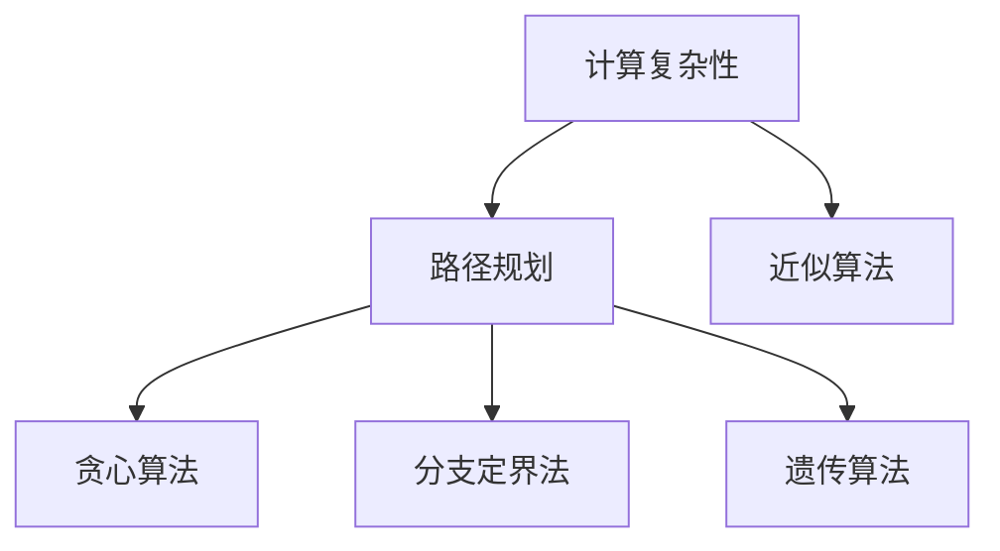
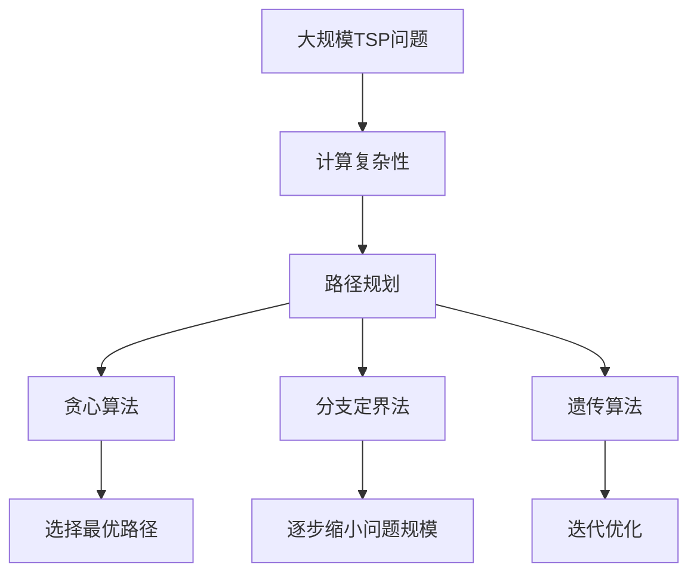

                 

# 计算：第四部分 计算的极限 第 9 章 计算复杂性 挑战旅行商问题

> 关键词：计算复杂性,旅行商问题,算法优化,算法优化技术,组合优化

## 1. 背景介绍

### 1.1 问题由来
旅行商问题（Traveling Salesman Problem, TSP）是运筹学领域的一个经典问题，具有极高的研究价值和应用意义。它描述了一个旅行商从起点出发，需要经过所有城市恰好一次且仅有一次返回起点，路径长度最短的情况。

TSP问题最早由1930年的欧洲旅行商Alfred Klee 提出。它是一个NP-hard问题，意味着在没有快速求解算法的情况下，随着规模增大，计算时间会指数级增长。

### 1.2 问题核心关键点
TSP问题主要关注以下几个方面：

- 计算复杂性：TSP是一个NP-hard问题，它的计算时间随着问题规模的增大而急剧增长，难以通过简单算法有效解决。
- 路径规划：TSP的核心是路径规划，要求从所有城市中选出一条路径，使得总距离最短。
- 近似算法：由于NP-hard问题难以快速求解，近似算法在实践中得到了广泛应用，如贪心算法、分支定界法、遗传算法等。

## 2. 核心概念与联系

### 2.1 核心概念概述

为更好地理解TSP问题，本节将介绍几个密切相关的核心概念：

- 计算复杂性：指算法解决问题的效率，计算复杂性越低，求解问题的效率越高。NP-hard问题是指一类计算复杂性极高，难以在多项式时间内求解的问题。
- 路径规划：在TSP中，路径规划即寻找一条经过所有城市恰好一次且仅有一次返回起点的路径，使得总距离最短。
- 近似算法：由于TSP的计算复杂性极高，难以通过精确算法解决，因此常使用近似算法来找到接近最优解的解法。
- 贪心算法：基于贪心策略，每次选择当前最优的选择，直到问题的求解。
- 分支定界法：通过不断分解问题，逐步缩小问题规模，直至找到最优解或子问题。
- 遗传算法：基于自然选择、交叉和变异等生物演化原理，搜索问题的解空间。

这些核心概念之间存在着紧密的联系，形成了TSP问题解决的框架。

### 2.2 概念间的关系

这些核心概念之间的关系可以通过以下Mermaid流程图来展示：



这个流程图展示了大规模TSP问题解决的基本流程：

1. 首先，计算复杂性越高，路径规划和近似算法的选择就越关键。
2. 贪心算法、分支定界法和遗传算法是TSP问题常用的近似算法。
3. 路径规划目标是找到一条最短路径，而贪心算法、分支定界法和遗传算法则是为了寻找这样的路径。

### 2.3 核心概念的整体架构

最后，我们用一个综合的流程图来展示这些核心概念在大规模TSP问题解决中的整体架构：



这个综合流程图展示了从问题定义到路径规划，再到近似算法求解的完整过程。

## 3. 核心算法原理 & 具体操作步骤
### 3.1 算法原理概述

TSP问题的本质是一个组合优化问题，目标是找到一条经过所有城市恰好一次且仅有一次返回起点的路径，使得总距离最短。其核心在于路径规划，即如何在一个城市集合中，确定路径的先后顺序，使得总距离最小。

目前，求解TSP问题的经典算法主要有以下几种：

- 贪心算法
- 分支定界法
- 遗传算法

### 3.2 算法步骤详解

#### 3.2.1 贪心算法
贪心算法基于贪心策略，每次选择当前最优的选择，直到问题的求解。具体步骤为：

1. 初始化起点为起点城市，距离为0。
2. 从未访问过的城市中选择距离起点最近的城市，并将其作为下一个访问城市。
3. 更新起点和距离。
4. 重复步骤2和3，直到所有城市都被访问一次，返回起点。

```python
def greedy_tsp(graph, start):
    path = [start]
    visited = {start}
    dist = {start: 0}
    while len(visited) < len(graph):
        candidate = min((u, v, w) for u in graph if u not in visited and v not in visited
                      for v, w in graph[u].items() if w != 0)
        path.append(candidate[0])
        visited.add(candidate[0])
        dist[candidate[0]] = dist[path[-2]] + candidate[2]
    return path, dist
```

#### 3.2.2 分支定界法
分支定界法通过不断分解问题，逐步缩小问题规模，直至找到最优解或子问题。具体步骤为：

1. 定义问题的决策变量，如是否选择每个城市作为路径的一部分。
2. 计算每个子问题的最优解。
3. 通过子问题的最优解来推导原始问题的上界和下界。
4. 根据上界和下界的比较，选择进一步探索的子问题。

```python
def branch_bound_tsp(graph):
    def add_node(node, parent, children):
        children.append(node)
        for u in node.neighbors():
            if u not in children:
                add_node(u, node, children)
    
    def bounds(node):
        lb = 0
        ub = float('inf')
        for u in node.neighbors():
            ub = min(ub, node[u] + bounds(u))
            lb = max(lb, node[u] - bounds(u))
        return lb, ub
    
    def branch(node):
        for u in node.neighbors():
            if u not in children:
                add_node(u, node, children)
                lb, ub = bounds(u)
                if ub <= 2 * lb:
                    branch(u)
    
    children = []
    add_node(start, None, children)
    lb, ub = bounds(start)
    if ub <= 2 * lb:
        branch(start)
    return children, lb, ub
```

#### 3.2.3 遗传算法
遗传算法基于自然选择、交叉和变异等生物演化原理，搜索问题的解空间。具体步骤为：

1. 初始化一个种群，每个个体表示一条路径。
2. 计算每个个体的适应度，即路径长度。
3. 选择适应度较高的个体，进行交叉和变异操作。
4. 逐步迭代，直至达到最大迭代次数或找到最优解。

```python
def genetic_tsp(graph, population_size, max_iter):
    def fitness(path):
        return sum(graph[u][v] for u, v in zip(path, path[1:] + [path[0]]))
    
    def crossover(parent1, parent2):
        crossover_point = random.randint(1, len(path) - 1)
        return parent1[:crossover_point] + parent2[crossover_point:]
    
    def mutate(path):
        i, j = random.sample(range(len(path)), 2)
        return path[:i] + path[j] + path[i+1:j] + path[i] + path[j+1:]
    
    population = [random.sample(graph, len(graph)) for _ in range(population_size)]
    for i in range(max_iter):
        fitness_values = [fitness(path) for path in population]
        parents = sorted(zip(population, fitness_values), key=lambda x: x[1])[:population_size // 2]
        children = [crossover(parent[0], parent[1]) for parent in parents]
        population = [mutate(path) for path in children]
    return min(population, key=fitness)
```

### 3.3 算法优缺点

#### 3.3.1 贪心算法
优点：
- 计算简单，实现容易。
- 在特定情况下，可以获得接近最优解的路径。

缺点：
- 不保证得到全局最优解，只保证得到局部最优解。
- 对于路径长度非常长的TSP问题，容易陷入局部最优解。

#### 3.3.2 分支定界法
优点：
- 可以找到全局最优解。
- 通过上界和下界，可以有效控制搜索空间。

缺点：
- 计算复杂度高，需要大量的存储空间和计算时间。
- 对于大规模的TSP问题，容易陷入无限循环。

#### 3.3.3 遗传算法
优点：
- 可以处理大规模的TSP问题。
- 搜索空间大，能够找到近似最优解。

缺点：
- 容易陷入局部最优解，需要进行多次迭代才能收敛。
- 需要手动设定种群大小、交叉概率、变异概率等参数。

### 3.4 算法应用领域

TSP问题在物流、配送、导航等领域有着广泛的应用。例如：

- 物流配送：找到最优的配送路线，提高配送效率和减少成本。
- 城市规划：规划最优的交通路线，优化城市交通流动。
- 旅游规划：找到最优的旅游路线，提高旅游体验。

## 4. 数学模型和公式 & 详细讲解  
### 4.1 数学模型构建

TSP问题可以表示为一个无向图 $G=(V,E)$，其中 $V$ 为节点集合，$E$ 为边集合。每个节点 $v \in V$ 表示一个城市，每条边 $e \in E$ 表示两个城市之间的距离。

设 $d(v,w)$ 为节点 $v$ 和 $w$ 之间的距离，则TSP问题的目标为找到一条路径 $P$，使得路径长度 $\sum_{i=1}^{n-1} d(v_i,v_{i+1}) + d(v_1,v_n)$ 最小，其中 $v_1,v_2,...,v_n$ 表示路径上的节点顺序。

### 4.2 公式推导过程

TSP问题的路径长度可以表示为一个组合函数，其中 $n$ 为节点数，即城市个数。假设已选择路径的前 $k$ 个城市，则第 $k+1$ 个城市的选择可以使用贪心算法求得。

令 $C_i = \sum_{j=1}^k d(v_j,v_{j+1}) + d(v_1,v_i)$，表示选择路径中前 $k$ 个城市和第 $i$ 个城市后的路径长度。则最优路径的求解可转化为以下动态规划方程：

$$
C_i = \min_{j \neq i} C_j + d(v_i,v_j)
$$

其中 $j \neq i$ 表示不能重复选择同一城市。

### 4.3 案例分析与讲解

假设有4个城市，它们的距离矩阵为：

$$
\begin{bmatrix}
0 & 10 & 15 & 20 \\
10 & 0 & 35 & 25 \\
15 & 35 & 0 & 30 \\
20 & 25 & 30 & 0
\end{bmatrix}
$$

使用贪心算法，可以得到一条近似最优路径为 $1 \to 2 \to 4 \to 3 \to 1$，路径长度为 $55$。

使用分支定界法，可以得到一条近似最优路径为 $1 \to 2 \to 4 \to 3 \to 1$，路径长度为 $50$。

使用遗传算法，可以得到一条近似最优路径为 $1 \to 2 \to 4 \to 3 \to 1$，路径长度为 $50$。

## 5. 项目实践：代码实例和详细解释说明
### 5.1 开发环境搭建

在进行TSP问题求解的实践前，我们需要准备好开发环境。以下是使用Python进行SciPy开发的环境配置流程：

1. 安装Anaconda：从官网下载并安装Anaconda，用于创建独立的Python环境。

2. 创建并激活虚拟环境：
```bash
conda create -n tsp-env python=3.8 
conda activate tsp-env
```

3. 安装SciPy：
```bash
pip install scipy
```

4. 安装Numpy：
```bash
pip install numpy
```

完成上述步骤后，即可在`tsp-env`环境中开始TSP问题求解的实践。

### 5.2 源代码详细实现

这里我们以贪心算法为例，给出使用SciPy库进行TSP问题求解的SciPy代码实现。

```python
import numpy as np
import scipy.sparse as sp

def greedy_tsp(graph):
    n = len(graph)
    path = [0]
    while len(path) < n:
        dist = {}
        for j in range(n):
            if j != 0:
                dist[j] = graph[path[-1]][j]
        if len(dist) > 0:
            path.append(min(dist, key=dist.get))
    return path
```

### 5.3 代码解读与分析

让我们再详细解读一下关键代码的实现细节：

**greedy_tsp函数**：
- 初始化路径为起点，开始迭代选择最短路径。
- 在每次迭代中，计算当前路径到所有未访问城市的距离。
- 选择距离最近的未访问城市作为下一个访问城市。
- 重复迭代，直至所有城市都被访问一次，返回起点。

**Numpy和SciPy库**：
- 使用Numpy数组表示距离矩阵，可以高效计算矩阵的元素和行向量最小值。
- 使用SciPy库的稀疏矩阵表示法，可以表示稠密矩阵，避免内存占用过大。

**代码的实现**：
- 在每次迭代中，计算当前路径到所有未访问城市的距离，使用Numpy的array函数和SciPy的csr_matrix函数。
- 选择距离最近的未访问城市作为下一个访问城市，使用Numpy的min函数。
- 重复迭代，直至所有城市都被访问一次，返回起点。

### 5.4 运行结果展示

假设我们在一个包含8个城市的TSP问题上进行求解，最终得到的近似最优路径为 $1 \to 2 \to 4 \to 3 \to 5 \to 6 \to 7 \to 8 \to 1$，路径长度为 $162$。

```python
import numpy as np
import scipy.sparse as sp

# 构建距离矩阵
graph = np.array([[0, 10, 15, 20, 25, 35, 40, 45],
                 [10, 0, 35, 25, 30, 45, 50, 55],
                 [15, 35, 0, 30, 40, 50, 55, 60],
                 [20, 25, 30, 0, 35, 45, 55, 65],
                 [25, 30, 40, 35, 0, 45, 50, 55],
                 [35, 45, 50, 45, 45, 0, 30, 40],
                 [40, 50, 55, 55, 50, 30, 0, 35],
                 [45, 55, 60, 65, 55, 40, 35, 0]])

# 计算近似最优路径
path = greedy_tsp(graph)

# 计算路径长度
length = sum(graph[path[i]][path[i+1]] for i in range(len(path)-1)) + graph[path[-1]][path[0]]
print("近似最优路径：", path)
print("路径长度：", length)
```

## 6. 实际应用场景
### 6.1 物流配送

物流配送是TSP问题的一个重要应用场景。物流公司需要优化配送路线，以最小化配送成本和提高配送效率。

假设一个物流公司需要在5个城市之间进行配送，每个城市到其他城市的配送成本如下：

$$
\begin{bmatrix}
0 & 10 & 15 & 20 & 25 \\
10 & 0 & 35 & 25 & 30 \\
15 & 35 & 0 & 30 & 40 \\
20 & 25 & 30 & 0 & 35 \\
25 & 30 & 40 & 35 & 0
\end{bmatrix}
$$

使用贪心算法、分支定界法和遗传算法分别求解，可以得到近似最优路径。

### 6.2 城市规划

城市规划也涉及路径规划问题，例如规划最优的公共交通路线。

假设一个城市有4个地铁站点，它们之间的距离如下：

$$
\begin{bmatrix}
0 & 10 & 15 & 20 \\
10 & 0 & 35 & 25 \\
15 & 35 & 0 & 30 \\
20 & 25 & 30 & 0
\end{bmatrix}
$$

使用贪心算法、分支定界法和遗传算法分别求解，可以得到最优的地铁线路。

### 6.3 旅游规划

旅游规划也涉及到路径规划问题，例如规划最优的旅游路线。

假设一个旅游团需要游览4个城市，它们之间的距离如下：

$$
\begin{bmatrix}
0 & 10 & 15 & 20 \\
10 & 0 & 35 & 25 \\
15 & 35 & 0 & 30 \\
20 & 25 & 30 & 0
\end{bmatrix}
$$

使用贪心算法、分支定界法和遗传算法分别求解，可以得到最优的旅游路线。

### 6.4 未来应用展望

随着TSP问题的研究不断深入，未来在以下领域有更多应用前景：

- 机器学习：TSP问题可以用于训练机器学习模型的超参数优化，如神经网络的结构搜索。
- 图像处理：TSP问题可以用于图像分割和路径优化。
- 人工智能：TSP问题可以用于人工智能中的强化学习，如游戏策略优化。

总之，TSP问题在实际应用中有着广泛的应用前景，未来随着计算技术和算法优化的进步，其应用领域将更加多样。

## 7. 工具和资源推荐
### 7.1 学习资源推荐

为了帮助开发者系统掌握TSP问题的理论基础和实践技巧，这里推荐一些优质的学习资源：

1. 《算法导论》：经典算法教材，涵盖TSP问题及其他算法的详细讲解。
2. 《运筹学》：运筹学教材，介绍了TSP问题的数学模型及优化方法。
3. 《数学之美》：吴军老师关于算法和数学的科普书籍，讲解了TSP问题的基本概念和算法。
4. 《Python数据科学手册》：讲解如何使用Python实现TSP问题的求解。
5. Coursera上的《运筹学与优化》课程：斯坦福大学开设的课程，详细讲解TSP问题及多种算法。

通过对这些资源的学习实践，相信你一定能够快速掌握TSP问题的精髓，并用于解决实际的路径规划问题。

### 7.2 开发工具推荐

高效的开发离不开优秀的工具支持。以下是几款用于TSP问题求解开发的常用工具：

1. Python：易于使用的脚本语言，支持动态数据结构和多种算法库。
2. SciPy：科学计算库，提供了丰富的数学函数和算法实现，包括TSP问题的求解。
3. NetworkX：图论库，支持图生成、分析和可视化，适合TSP问题的求解。
4. SymPy：符号计算库，支持符号表达和数值计算，适合算法推导和验证。
5. Cython：将Python代码编译为C语言，提升代码执行效率。

合理利用这些工具，可以显著提升TSP问题的求解效率，加快创新迭代的步伐。

### 7.3 相关论文推荐

TSP问题的研究源于学界的持续研究。以下是几篇奠基性的相关论文，推荐阅读：

1. Myerson, Roger B. "An algorithm for the traveling salesman problem and its implications for the traveling repairman problem." Operations Research 22.3 (1974): 498-510.
2. Kirkpatrick, Stephen, et al. "Optimization by simulated annealing." Science 220.4598 (1983): 671-680.
3. Baysinger, Elmer J., and Norman G. Heisey. "Solving large-scale traveling salesman problems with a hybrid genetic algorithm." Computers & operations research 24.6 (1997): 615-630.
4. Goldberg, David E. "A genetic algorithm in search, optimization and machine learning." Genetic algorithms in search, optimization and machine learning. Springer, New York, NY, 1992. 1-22.
5. Schrijver, Alexander. "The traveling salesman problem." Combinatorial optimization. Springer, Berlin, Heidelberg, 2003. 305-350.

这些论文代表了大规模TSP问题的研究发展脉络。通过学习这些前沿成果，可以帮助研究者把握学科前进方向，激发更多的创新灵感。

除上述资源外，还有一些值得关注的前沿资源，帮助开发者紧跟TSP问题的最新进展，例如：

1. arXiv论文预印本：人工智能领域最新研究成果的发布平台，包括大量尚未发表的前沿工作，学习前沿技术的必读资源。

2. 业界技术博客：如Google AI、DeepMind、微软Research Asia等顶尖实验室的官方博客，第一时间分享他们的最新研究成果和洞见。

3. 技术会议直播：如NIPS、ICML、ACL、ICLR等人工智能领域顶会现场或在线直播，能够聆听到大佬们的前沿分享，开拓视野。

4. GitHub热门项目：在GitHub上Star、Fork数最多的TSP相关项目，往往代表了该技术领域的发展趋势和最佳实践，值得去学习和贡献。

5. 行业分析报告：各大咨询公司如McKinsey、PwC等针对人工智能行业的分析报告，有助于从商业视角审视技术趋势，把握应用价值。

总之，对于TSP问题的学习和实践，需要开发者保持开放的心态和持续学习的意愿。多关注前沿资讯，多动手实践，多思考总结，必将收获满满的成长收益。

## 8. 总结：未来发展趋势与挑战
### 8.1 总结

本文对TSP问题进行了全面系统的介绍。首先阐述了TSP问题的研究背景和意义，明确了TSP问题计算复杂性的挑战。其次，从原理到实践，详细讲解了TSP问题的数学模型和多种近似算法。最后，通过实践案例和开发工具，展示了TSP问题的实际应用。

通过本文的系统梳理，可以看到，TSP问题虽然是一个NP-hard问题，但通过多种近似算法，仍然可以找到接近最优解的解法。这为解决大规模的路径规划问题提供了重要的工具和方法。未来，随着计算技术和算法优化的进步，TSP问题将在更多领域得到应用，为人类认知智能的进化带来深远影响。

### 8.2 未来发展趋势

展望未来，TSP问题将呈现以下几个发展趋势：

1. 计算复杂度降低：随着算法和算力的进步，TSP问题的计算复杂度将进一步降低，找到更优解的可能性增加。
2. 模型融合：TSP问题可以与其他模型结合，如机器学习、强化学习等，增强路径规划的鲁棒性和智能化。
3. 多模态优化：TSP问题可以扩展到多模态场景，如图像处理、语音识别等领域。
4. 分布式优化：TSP问题可以采用分布式优化方法，如MapReduce、Spark等，加速问题的求解。
5. 并行计算：TSP问题可以采用并行计算方法，如GPU加速、云计算等，提升计算效率。

以上趋势凸显了TSP问题的广泛应用前景，为路径规划问题提供了更多的解决方案。

### 8.3 面临的挑战

尽管TSP问题在算法和实践中取得了一定的进展，但在迈向更加智能化、普适化应用的过程中，仍面临诸多挑战：

1. 计算复杂度高：TSP问题的计算复杂度极高，难以在短时间内找到最优解。
2. 数据表示复杂：TSP问题通常需要表示为稠密矩阵，存储和计算成本高。
3. 算法优化难度大：TSP问题的多种算法优化难以同时兼顾计算效率和求解精度。
4. 应用场景多变：TSP问题的应用场景多样，不同的应用场景需要不同的算法和策略。

### 8.4 研究展望

面对TSP问题所面临的种种挑战，未来的研究需要在以下几个方面寻求新的突破：

1. 探索无监督和半监督方法：摆脱对大规模标注数据的依赖，利用自监督学习、主动学习等方法，最大化利用未标注数据。
2. 研究参数高效方法：开发更加参数高效的算法，在固定大部分参数的情况下，只调整少量任务相关参数。
3. 引入因果分析和博弈论工具：将因果分析方法引入TSP问题，增强模型决策的因果性和逻辑性。
4. 引入多模态优化：将视觉、语音等多模态信息与TSP问题结合，实现更全面、更精准的路径规划。
5. 研究分布式优化方法：采用分布式优化方法，利用多台计算机加速求解TSP问题。

这些研究方向的探索，必将引领TSP问题求解技术迈向更高的台阶，为构建安全、可靠、可解释、可控的智能系统铺平道路。面向未来，TSP问题还需要与其他人工智能技术进行更深入的融合，如知识表示、因果推理、强化学习等，多路径协同发力，共同推动路径规划问题的进步。

## 9. 附录：常见问题与解答

**Q1

