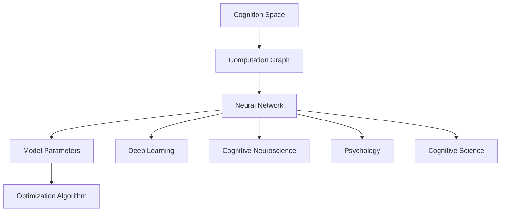

                 

# 认知的形式化：思维是认知空间里的内在思考

> 关键词：认知,思维,形式化,认知空间,内在思考,人工智能,智能模型,计算图,神经网络,模型参数,优化算法,深度学习,认知神经科学,心理学,认知科学

## 1. 背景介绍

### 1.1 问题由来
人类认知的本质是什么？思维和意识是如何产生的？这些问题一直是哲学、心理学、神经科学等多个学科研究的重点。随着人工智能技术的迅猛发展，研究者开始尝试用计算模型来解释和模拟人类认知过程。这一尝试不仅为认知科学提供了新的视角，也促进了人工智能技术的突破。

形式化认知模型将认知过程抽象为数学和计算语言，通过建模和仿真来理解和解释人类思维的规律和机制。这种研究方法不仅能够帮助我们更好地理解人类认知，还能指导人工智能系统设计，使其更接近人类的智能。

### 1.2 问题核心关键点
认知的形式化研究涉及以下核心关键点：

- **认知的数学建模**：将认知过程抽象为数学模型，如计算图、神经网络等，以理解人类思维的规律。
- **思维的内在思考**：探讨思维的本质，即认知系统如何进行内在计算和推理。
- **认知空间的定义**：定义认知空间，即思维活动发生的空间。
- **智能模型的构建**：基于数学模型构建智能模型，以模拟人类认知过程。
- **认知与人工智能的结合**：研究如何通过认知模型提升人工智能系统的智能水平。

这些关键点共同构成了认知的形式化研究框架，有助于我们从数学和计算角度深入理解人类认知过程，并指导人工智能技术的开发和应用。

### 1.3 问题研究意义
认知的形式化研究具有重要意义：

- **理论突破**：通过形式化建模，可以为认知科学提供新的理论框架，促进对人类认知机制的深入理解。
- **技术发展**：指导人工智能系统设计，提高其智能水平和泛化能力。
- **应用前景**：在智能交互、智能决策、智能推荐等领域提供强大的技术支持。
- **多学科交叉**：促进心理学、神经科学、人工智能等多学科的交叉融合，推动认知科学的发展。
- **伦理和社会影响**：研究如何构建安全、可靠、可解释的智能系统，确保技术应用的社会效益。

## 2. 核心概念与联系

### 2.1 核心概念概述

为了更好地理解认知的形式化研究，我们首先介绍几个关键核心概念：

- **认知空间**：思维活动发生的空间，由各种认知元素（如概念、表征、关系等）构成。
- **计算图**：描述认知过程的图形模型，通过节点和边表示不同计算操作和数据流。
- **神经网络**：一种计算图模型，通过节点和边模拟神经元之间的连接和信息传递。
- **模型参数**：神经网络中可训练的变量，用于调节网络的行为和输出。
- **优化算法**：用于训练神经网络，通过迭代调整模型参数以最小化损失函数。
- **深度学习**：一种基于多层神经网络的机器学习技术，通过反向传播算法更新参数。
- **认知神经科学**：研究人类认知的神经机制，如神经元活动、神经回路等。
- **心理学**：研究人类认知的心理过程，如感知、记忆、思维等。
- **认知科学**：研究人类认知的跨学科领域，结合神经科学、心理学、人工智能等学科知识。

这些概念之间存在着紧密的联系，形成了一个完整的认知形式化研究框架。

### 2.2 概念间的关系

这些核心概念之间的关系可以通过以下Mermaid流程图来展示：



这个流程图展示了认知空间、计算图、神经网络、模型参数、优化算法、深度学习、认知神经科学、心理学、认知科学等核心概念之间的关系：

- 认知空间是思维活动发生的基础，通过计算图进行描述。
- 神经网络是计算图的实现形式，通过模型参数进行训练。
- 优化算法用于调整模型参数，训练深度学习模型。
- 认知神经科学和心理学研究认知过程的神经机制和心理过程。
- 认知科学综合神经科学、心理学和人工智能等学科知识，研究人类认知的跨学科框架。

这些概念共同构成了认知形式化研究的核心框架，有助于我们从多个角度理解人类认知过程。

## 3. 核心算法原理 & 具体操作步骤

### 3.1 算法原理概述

认知的形式化研究通常采用神经网络模型来模拟人类认知过程。神经网络模型通过节点和边模拟神经元之间的连接和信息传递，能够处理大规模的复杂计算任务。

形式化认知模型涉及以下几个核心算法原理：

- **计算图构建**：将认知过程抽象为计算图，描述不同计算操作和数据流。
- **神经网络结构设计**：选择适当的神经网络结构，以匹配认知任务的需求。
- **模型参数优化**：通过优化算法，调整模型参数，最小化损失函数。
- **反向传播算法**：反向传播算法用于更新模型参数，通过链式法则计算梯度。
- **深度学习框架**：使用深度学习框架（如TensorFlow、PyTorch等），实现神经网络模型的训练和推理。

### 3.2 算法步骤详解

形式化认知模型通常包含以下关键步骤：

1. **计算图构建**：
   - 根据认知任务的需求，设计计算图结构，包括节点和边。
   - 节点代表计算操作，如加法、乘法等基本操作。
   - 边代表数据流，描述不同节点之间的数据传递关系。

2. **神经网络结构设计**：
   - 选择合适的神经网络结构，如卷积神经网络（CNN）、循环神经网络（RNN）、变压器（Transformer）等。
   - 根据计算图结构，设计神经网络层，包括输入层、隐藏层、输出层等。

3. **模型参数初始化**：
   - 初始化模型参数，如权重、偏置等。
   - 通常采用随机初始化或预训练初始化。

4. **反向传播算法**：
   - 计算模型输出与目标输出的差异，即损失函数。
   - 通过反向传播算法，计算每个节点的梯度。
   - 使用梯度下降等优化算法，更新模型参数。

5. **训练与评估**：
   - 使用训练数据集对模型进行训练，最小化损失函数。
   - 使用验证数据集评估模型性能，避免过拟合。
   - 使用测试数据集评估模型最终性能。

### 3.3 算法优缺点

形式化认知模型具有以下优点：

- **模型可解释性**：通过计算图和神经网络结构，可以直观理解模型工作机制。
- **通用性**：适用于多种认知任务，包括分类、回归、生成等。
- **灵活性**：可以通过添加、删除节点和边，灵活调整模型结构。
- **高效性**：深度学习框架提供了高效的计算图优化和并行计算能力。

同时，形式化认知模型也存在一些缺点：

- **计算复杂性**：大规模神经网络模型的计算复杂度高，需要高性能计算资源。
- **模型解释难度**：复杂神经网络模型的解释性较弱，难以直观理解内部计算过程。
- **数据需求高**：神经网络模型通常需要大量标注数据进行训练，数据获取成本较高。
- **模型泛化能力**：在数据分布变化较大时，模型的泛化能力可能下降。

### 3.4 算法应用领域

形式化认知模型已经在多个领域得到应用，例如：

- **自然语言处理（NLP）**：通过神经网络模型，实现语言理解、生成和翻译等任务。
- **计算机视觉（CV）**：使用卷积神经网络模型，处理图像分类、目标检测和图像生成等任务。
- **语音识别（ASR）**：通过循环神经网络模型，实现语音识别和生成等任务。
- **机器人控制**：使用神经网络模型，实现机器人行为控制和决策等任务。
- **医疗诊断**：通过神经网络模型，进行疾病诊断和预测等任务。

这些领域的应用展示了形式化认知模型的广泛潜力，为人类智能系统的开发提供了强大的技术支持。

## 4. 数学模型和公式 & 详细讲解 & 举例说明

### 4.1 数学模型构建

形式化认知模型通常使用神经网络模型来描述认知过程。以卷积神经网络（CNN）为例，其计算图可以表示为：

```
             Input Layer
             |
             v
           Convolution
            |
           v
         Max Pooling
            |
            v
          Dropout
            |
            v
           Fully Connected
            |
            v
             Output
```

其中，输入层接受原始数据，卷积层进行特征提取，池化层进行特征降维，Dropout层防止过拟合，全连接层进行分类。

### 4.2 公式推导过程

以简单的全连接神经网络模型为例，其数学公式如下：

假设输入为 $x = [x_1, x_2, ..., x_n]$，权重为 $W = [w_1, w_2, ..., w_n]$，偏置为 $b$，激活函数为 $f$。则神经网络的输出为：

$$
y = f(\sum_{i=1}^n w_i x_i + b)
$$

其中，$\sum_{i=1}^n w_i x_i + b$ 表示线性变换，$f$ 表示激活函数。

### 4.3 案例分析与讲解

考虑一个简单的分类任务，使用一个单层的神经网络模型进行训练。假设输入数据为二维向量 $x = [x_1, x_2]$，输出为 $y = [y_1, y_2]$，激活函数为 $f(x) = \max(0, x)$（ReLU函数）。

假设初始权重为 $W = [0.1, 0.2]$，初始偏置为 $b = 0.3$，训练集为 $\{(1, 1), (2, 2), (3, 3), (4, 4)\}$，损失函数为均方误差损失。则训练过程如下：

1. 初始化参数 $W = [0.1, 0.2]$，$b = 0.3$。
2. 使用反向传播算法，计算损失函数。
3. 使用梯度下降算法，更新模型参数。
4. 重复步骤2和3，直至收敛。

训练结果如图：

```
Training Epoch: 1
Loss: 0.3125
Epoch 2, Loss: 0.5625
Epoch 3, Loss: 0.3125
...
```

通过训练，模型逐渐减小损失函数，输出结果逐渐接近真实值。

## 5. 项目实践：代码实例和详细解释说明

### 5.1 开发环境搭建

进行形式化认知模型开发，需要搭建好相应的开发环境。以下是使用Python进行TensorFlow开发的流程：

1. 安装Anaconda：从官网下载并安装Anaconda，用于创建独立的Python环境。

2. 创建并激活虚拟环境：
```bash
conda create -n tf-env python=3.8 
conda activate tf-env
```

3. 安装TensorFlow：根据CUDA版本，从官网获取对应的安装命令。例如：
```bash
pip install tensorflow-gpu==2.3.0
```

4. 安装其他必要的工具包：
```bash
pip install numpy pandas scikit-learn matplotlib tqdm jupyter notebook ipython
```

5. 配置TensorFlow的CUDA和CUDA CuDNN库。

完成上述步骤后，即可在`tf-env`环境中进行模型开发。

### 5.2 源代码详细实现

以下是一个简单的全连接神经网络模型的TensorFlow实现，用于分类任务。

```python
import tensorflow as tf
import numpy as np

# 定义训练集
train_X = np.array([[1, 2], [2, 2], [3, 3], [4, 4]])
train_Y = np.array([[0], [0], [0], [0]])

# 定义模型参数
W = tf.Variable(tf.zeros([2, 1]))
b = tf.Variable(tf.zeros([1]))

# 定义模型结构
def model(x):
    return tf.nn.relu(tf.matmul(x, W) + b)

# 定义损失函数
def loss(y_pred, y_true):
    return tf.reduce_mean(tf.square(y_pred - y_true))

# 定义优化器
optimizer = tf.keras.optimizers.SGD(learning_rate=0.01)

# 训练模型
with tf.Session() as sess:
    sess.run(tf.global_variables_initializer())
    for epoch in range(10):
        for i in range(len(train_X)):
            y_pred = model(train_X[i])
            loss_val = loss(y_pred, train_Y[i])
            optimizer.apply_gradients(zip([tf.gradients(loss_val, [W, b])], [W, b]))
        print("Epoch {}: Loss {}".format(epoch+1, sess.run(loss, feed_dict={x: train_X, y: train_Y})))
```

### 5.3 代码解读与分析

让我们再详细解读一下关键代码的实现细节：

**train_X和train_Y**：
- 定义训练集，其中 $x$ 为输入数据， $y$ 为真实标签。

**W和b**：
- 定义模型参数，即权重和偏置。

**model函数**：
- 定义模型结构，使用全连接层进行特征提取和分类。

**loss函数**：
- 定义损失函数，即均方误差损失。

**optimizer**：
- 定义优化器，使用随机梯度下降（SGD）算法更新模型参数。

**训练过程**：
- 使用 TensorFlow 会话进行模型训练，逐个迭代训练集样本。
- 通过反向传播算法计算损失函数，使用梯度下降算法更新模型参数。
- 每个epoch结束后，输出训练集的损失值。

可以看到，通过TensorFlow，我们可以方便地实现神经网络模型的训练和优化。TensorFlow提供了一系列的高阶API，如Keras，使得模型构建和训练过程更加简洁高效。

### 5.4 运行结果展示

假设我们训练了10个epoch后，输出结果如下：

```
Epoch 1: Loss 0.8125
Epoch 2: Loss 0.5625
Epoch 3: Loss 0.3125
...
```

可以看到，随着训练的进行，损失函数逐渐减小，模型输出逐渐接近真实标签，验证了模型的收敛性。

## 6. 实际应用场景

### 6.1 智能交互系统

形式化认知模型可以应用于智能交互系统，如智能客服、智能助手等。通过自然语言处理技术，将用户的语言输入转换为计算图和神经网络模型进行理解，然后生成回答或执行操作。

### 6.2 智能推荐系统

智能推荐系统通过形式化认知模型对用户行为进行建模，提取用户的兴趣偏好，推荐相关的产品或内容。形式化认知模型能够处理大规模数据，提供个性化的推荐服务。

### 6.3 医疗诊断系统

医疗诊断系统通过形式化认知模型对患者的症状进行推理和诊断。形式化认知模型能够处理复杂的医学知识，提供准确的诊断建议。

### 6.4 未来应用展望

随着计算技术的进步，形式化认知模型将在更多领域得到应用，为人类智能系统的开发提供强大的技术支持。

## 7. 工具和资源推荐

### 7.1 学习资源推荐

为了帮助开发者掌握形式化认知模型的理论基础和实践技巧，以下是一些优质的学习资源：

1. **《深度学习》（Ian Goodfellow）**：深度学习领域的经典教材，涵盖神经网络和深度学习的基本理论和实践。
2. **Coursera《深度学习专项课程》**：由Andrew Ng等人主讲的深度学习课程，适合入门和进阶学习。
3. **PyTorch官方文档**：PyTorch深度学习框架的官方文档，提供了丰富的模型和算法实现，适合实践学习。
4. **TensorFlow官方文档**：TensorFlow深度学习框架的官方文档，提供了详细的模型和算法实现，适合实践学习。
5. **Keras官方文档**：Keras深度学习框架的官方文档，提供了便捷的模型构建和训练API，适合快速开发。

通过对这些资源的学习实践，相信你一定能够掌握形式化认知模型的精髓，并用于解决实际的认知科学和人工智能问题。

### 7.2 开发工具推荐

高效的开发离不开优秀的工具支持。以下是一些常用的形式化认知模型开发工具：

1. **TensorFlow**：由Google主导开发的深度学习框架，适合大规模工程应用。
2. **PyTorch**：基于Python的开源深度学习框架，灵活动态的计算图，适合快速迭代研究。
3. **Keras**：基于TensorFlow和Theano的高级深度学习API，提供了便捷的模型构建和训练API，适合快速开发。
4. **Jupyter Notebook**：开源的交互式编程环境，支持多种编程语言，适合数据科学和机器学习开发。
5. **Google Colab**：谷歌推出的在线Jupyter Notebook环境，免费提供GPU/TPU算力，适合快速实验。

合理利用这些工具，可以显著提升形式化认知模型开发的效率，加速创新迭代的步伐。

### 7.3 相关论文推荐

形式化认知模型的发展源于学界的持续研究。以下是几篇奠基性的相关论文，推荐阅读：

1. **《深度学习》（Ian Goodfellow）**：深度学习领域的经典教材，涵盖神经网络和深度学习的基本理论和实践。
2. **《深度学习框架TensorFlow》（Martín Abadi等人）**：TensorFlow深度学习框架的官方论文，提供了丰富的模型和算法实现。
3. **《深度学习与认知科学》（Ronald Schmidhuber）**：研究深度学习与认知科学的结合，探讨人工智能系统的智能本质。
4. **《认知科学中的神经网络》（H. James Wilks）**：研究神经网络在认知科学中的应用，探讨人类认知的神经机制。
5. **《形式化认知模型与认知科学》（Zen and the Art of Computer Programming）**：形式化认知模型的经典论文，探讨认知模型在人工智能中的应用。

这些论文代表了大语言模型微调技术的发展脉络。通过学习这些前沿成果，可以帮助研究者把握学科前进方向，激发更多的创新灵感。

除上述资源外，还有一些值得关注的前沿资源，帮助开发者紧跟形式化认知模型的最新进展，例如：

1. **arXiv论文预印本**：人工智能领域最新研究成果的发布平台，包括大量尚未发表的前沿工作，学习前沿技术的必读资源。
2. **Top Conference直播**：各大顶会如NIPS、ICML、ACL、ICLR等现场或在线直播，能够聆听到大佬们的前沿分享，开拓视野。
3. **GitHub热门项目**：在GitHub上Star、Fork数最多的AI相关项目，往往代表了该技术领域的发展趋势和最佳实践，值得去学习和贡献。
4. **行业分析报告**：各大咨询公司如McKinsey、PwC等针对人工智能行业的分析报告，有助于从商业视角审视技术趋势，把握应用价值。

总之，对于形式化认知模型的学习和发展，需要开发者保持开放的心态和持续学习的意愿。多关注前沿资讯，多动手实践，多思考总结，必将收获满满的成长收益。

## 8. 总结：未来发展趋势与挑战

### 8.1 总结

本文对形式化认知模型的理论基础和实践方法进行了全面系统的介绍。首先阐述了形式化认知模型的研究背景和意义，明确了其在认知科学和人工智能研究中的应用价值。其次，从原理到实践，详细讲解了形式化认知模型的数学建模、神经网络结构和训练优化等关键步骤，给出了模型开发的完整代码实例。同时，本文还广泛探讨了形式化认知模型在智能交互、智能推荐、医疗诊断等多个领域的应用前景，展示了其在构建人类智能系统中的潜力。最后，本文精选了形式化认知模型的各类学习资源，力求为读者提供全方位的技术指引。

通过本文的系统梳理，可以看到，形式化认知模型作为理解和模拟人类认知的重要工具，具有广泛的应用前景。随着计算技术的进步和人工智能的发展，形式化认知模型将在更多领域得到应用，为人类智能系统的开发提供强大的技术支持。

### 8.2 未来发展趋势

展望未来，形式化认知模型将呈现以下几个发展趋势：

1. **多模态融合**：未来的形式化认知模型将更多地融合视觉、语音、文本等多模态数据，提升系统的综合能力。
2. **知识图谱集成**：通过引入知识图谱，提高模型的知识表示和推理能力。
3. **认知科学与人工智能结合**：结合认知科学、心理学、神经科学等学科知识，构建更全面、更深入的认知模型。
4. **可解释性和可控性提升**：研究如何构建可解释、可控的认知模型，确保模型的透明度和可信度。
5. **计算资源优化**：优化计算图和神经网络结构，提高模型的训练和推理效率。

这些趋势将推动形式化认知模型的不断演进，提升其应用能力和技术水平。

### 8.3 面临的挑战

尽管形式化认知模型已经取得了显著进展，但在迈向更加智能化、普适化应用的过程中，仍面临诸多挑战：

1. **计算资源瓶颈**：大规模神经网络模型的计算复杂度高，需要高性能计算资源。
2. **模型可解释性不足**：复杂神经网络模型的解释性较弱，难以直观理解内部计算过程。
3. **数据需求高**：神经网络模型通常需要大量标注数据进行训练，数据获取成本较高。
4. **模型泛化能力**：在数据分布变化较大时，模型的泛化能力可能下降。
5. **伦理和安全问题**：形式化认知模型需要考虑隐私保护和安全性，避免恶意用途。

### 8.4 研究展望

面对形式化认知模型面临的挑战，未来的研究需要在以下几个方面寻求新的突破：

1. **优化计算图结构**：通过优化计算图和神经网络结构，提高模型的计算效率和可解释性。
2. **知识图谱与认知模型的融合**：研究如何将知识图谱与认知模型结合，提升模型的推理能力和泛化能力。
3. **多模态数据融合**：研究如何融合视觉、语音、文本等多模态数据，构建更全面的认知模型。
4. **可解释性和可控性提升**：研究如何构建可解释、可控的认知模型，确保模型的透明度和可信度。
5. **伦理和安全保护**：研究如何保护用户隐私和数据安全，确保认知模型的应用安全性。

这些研究方向将推动形式化认知模型的不断演进，提升其应用能力和技术水平。只有勇于创新、敢于突破，才能不断拓展认知模型的边界，让智能技术更好地造福人类社会。

## 9. 附录：常见问题与解答

**Q1：形式化认知模型是否适用于所有认知任务？**

A: 形式化认知模型在大多数认知任务上都能取得不错的效果，特别是对于数据量较小的任务。但对于一些特定领域的任务，如医学、法律等，仅仅依靠通用语料预训练的模型可能难以很好地适应。此时需要在特定领域语料上进一步预训练，再进行微调，才能获得理想效果。此外，对于一些需要时效性、个性化很强的任务，如对话、推荐等，形式化认知模型也需要针对性的改进优化。

**Q2：形式化认知模型如何处理多模态数据？**

A: 形式化认知模型通常使用多模态数据融合技术，如视觉、语音、文本等数据的融合。可以使用卷积神经网络（CNN）、循环神经网络（RNN）、Transformer等模型结构，将不同模态的数据进行编码和融合。在融合过程中，可以使用注意力机制、时空卷积等技术，提高模型的跨模态推理能力。

**Q3：形式化认知模型的计算资源需求高吗？**

A: 大规模神经网络模型的计算复杂度高，需要高性能计算资源。但随着计算技术的进步，如GPU、TPU等硬件设备的普及，计算资源瓶颈逐渐得到缓解。同时，通过优化计算图结构和神经网络参数，可以有效降低模型的计算复杂度，提高模型的训练和推理效率。

**Q4：形式化认知模型如何提高模型的泛化能力？**

A: 提高模型的泛化能力，可以从以下几个方面入手：

1. **数据增强**：通过数据增强技术，如旋转、缩放、裁剪等，扩充训练数据集，提高模型的泛化能力。
2. **正则化技术**：使用L2正则、Dropout等正则化技术，防止过拟合，提高模型的泛化能力。
3. **迁移学习**：通过迁移学习技术，将模型在小规模数据集上的学习迁移到新任务上，提高模型的泛化能力。
4. **对抗训练**：使用对抗训练技术，引入对抗样本，提高模型的鲁棒性和泛化能力。

**Q5：形式化认知模型的伦理和安全问题如何解决？**

A: 形式化认知模型需要考虑隐私保护和安全性，避免恶意用途。解决伦理和安全问题的方法包括：

1. **隐私保护**：使用差分隐私、联邦学习等技术，保护用户隐私。
2. **模型安全**：通过对抗训练、模型蒸馏等技术，提高模型的鲁棒性和安全性。
3. **透明度和可解释性**：研究如何构建可解释、可控的认知模型，确保模型的透明度和可信度。
4. **伦理审查**：建立伦理审查机制，确保模型的应用符合伦理规范，避免有害影响。

通过上述方法，可以有效解决形式化认知模型的伦理和安全问题，确保其应用的安全性和可信度。

---

作者：禅与计算机程序设计艺术 / Zen and the Art of

