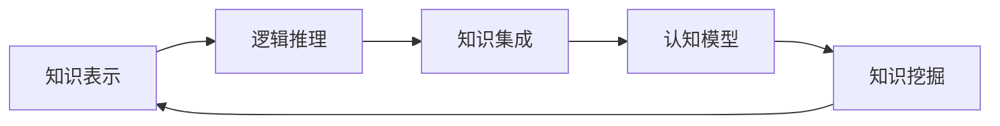
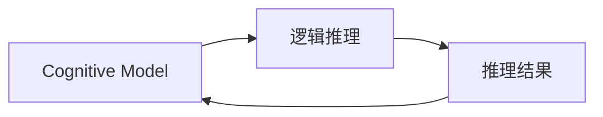

                 

# 认知的形式化：抽象的数据在智能时代被比作“石油”，可以进行大数据挖掘，帮助寻求事物运行的规律

## 1. 背景介绍

### 1.1 问题由来

近年来，人工智能（AI）技术在各行各业的应用如火如荼，特别是在大数据和认知计算领域。随着计算能力的提升和数据量的激增，对智能系统的需求也日益迫切。然而，如何从海量数据中挖掘出有价值的信息，构建起复杂且高效的人机交互系统，仍然是一个难题。

在这个背景下，认知的形式化成为一个重要课题。认知形式化不仅涉及知识的结构化表达，还包括如何利用这些形式化的知识进行推理、规划和决策。它有助于将人类智慧和计算机的强大计算能力结合起来，推动智能技术的发展。

### 1.2 问题核心关键点

认知形式化主要关注如何将人类的认知过程和知识以数学或形式化的方式表达出来，并在计算机上进行自动推理和应用。这个过程中，抽象的数据被比作“石油”，它们包含了丰富的知识和规律，可以用于大数据挖掘，揭示事物运行的规律。

**核心关键点**包括：
1. **知识表示**：将知识以符号化、形式化的方式表示出来。
2. **逻辑推理**：构建推理规则和推理机，自动进行推理。
3. **知识集成**：将不同来源的知识进行整合，形成一个完整的知识库。
4. **认知模型**：构建认知模型，模拟人类认知过程。
5. **知识挖掘**：从大数据中提取和发现规律，为决策提供支持。

### 1.3 问题研究意义

认知的形式化对于人工智能的发展具有重要意义：
1. **提升决策能力**：通过形式化知识，智能系统可以更好地理解复杂情境，进行精准决策。
2. **增强可解释性**：形式化的知识表示使得决策过程透明可解释，有助于信任和合法性。
3. **促进多领域应用**：形式化的知识可以跨领域应用，提高知识的通用性和复用性。
4. **推动技术创新**：形式化的认知模型和推理技术为AI新技术的探索提供了基础。
5. **实现智能协作**：通过形式化知识，人机协同系统可以实现更加高效和智能的合作。

## 2. 核心概念与联系

### 2.1 核心概念概述

为更好地理解认知形式化的过程，下面介绍几个关键概念及其之间的联系：

- **知识表示（Knowledge Representation, KR）**：将知识以形式化的方式表示出来，包括命题逻辑、谓词逻辑、框架、本体等。知识表示是认知形式化的基础。
- **逻辑推理（Logical Reasoning）**：根据一定的推理规则，自动进行推理和判断。逻辑推理是认知形式化的核心。
- **知识集成（Knowledge Integration）**：将不同来源的知识进行整合，形成一个完整的知识库。知识集成是认知形式化的重要环节。
- **认知模型（Cognitive Model）**：模拟人类的认知过程，包括感知、记忆、思维等。认知模型是认知形式化的应用目标。
- **知识挖掘（Knowledge Mining）**：从大数据中提取和发现规律，为决策提供支持。知识挖掘是认知形式化的技术手段。

这些概念之间的关系可以通过以下Mermaid流程图来展示：



这个流程图展示了知识表示、逻辑推理、知识集成、认知模型和知识挖掘之间的联系。它们共同构成了认知形式化的完整生态系统。

### 2.2 概念间的关系

这些核心概念之间存在着紧密的联系，形成了认知形式化的完整生态系统。下面我们通过几个Mermaid流程图来展示这些概念之间的关系。

#### 2.2.1 知识表示与逻辑推理的关系


这个流程图展示了知识表示和逻辑推理之间的关系。知识表示为逻辑推理提供形式化的知识，逻辑推理则通过推理得到知识库中的新知识。

#### 2.2.2 知识集成与知识表示的关系


这个流程图展示了知识集成和知识表示之间的关系。知识表示的多个分支被集成在一起，形成一个更加全面和系统的知识库，用于知识应用。

#### 2.2.3 认知模型与逻辑推理的关系



这个流程图展示了认知模型和逻辑推理之间的关系。认知模型通过逻辑推理实现对知识的应用和推理，不断更新和完善自身的认知状态。

#### 2.2.4 知识挖掘与知识表示的关系


这个流程图展示了知识挖掘和知识表示之间的关系。知识表示为知识挖掘提供形式化的知识基础，知识挖掘则从知识库中发现新的规律和模式。

## 3. 核心算法原理 & 具体操作步骤

### 3.1 算法原理概述

认知的形式化主要通过知识表示和逻辑推理来实现。其中，知识表示是将知识形式化表达的过程，逻辑推理则是基于形式化知识进行的自动推理。

知识表示通常采用谓词逻辑或框架等形式，将知识表示为概念和事实的集合。逻辑推理则包括各种推理规则和推理机，如归纳推理、演绎推理、概率推理等。

### 3.2 算法步骤详解

认知形式化的具体算法步骤如下：

1. **知识收集与表示**：从文本、图像、语音等多种数据源中收集知识，并进行形式化表示。
2. **逻辑推理机构建**：设计推理规则和推理机，用于根据知识库进行自动推理。
3. **知识库构建**：将收集到的知识表示整合进知识库，形成一个完整的知识图谱。
4. **认知模型建立**：基于知识库构建认知模型，模拟人类的认知过程。
5. **知识挖掘与决策支持**：利用知识挖掘技术从大数据中提取规律，为决策提供支持。

### 3.3 算法优缺点

认知的形式化算法具有以下优点：
1. **形式化表达**：将知识以结构化、形式化的方式表示，易于理解和处理。
2. **自动推理**：自动进行推理和判断，减少人工干预，提高效率。
3. **知识复用**：形式化的知识可以跨领域应用，提高知识的通用性和复用性。

同时，该算法也存在一些缺点：
1. **复杂度高**：知识表示和推理规则设计复杂，需要专业知识。
2. **计算量大**：大规模知识库的推理计算量较大，需要高性能计算资源。
3. **灵活性不足**：形式化的知识表示较为死板，难以应对突发情况。

### 3.4 算法应用领域

认知形式化算法在多个领域都有广泛应用，包括：

- **自然语言处理（NLP）**：通过知识表示和逻辑推理，实现自动问答、文本分类、信息抽取等功能。
- **计算机视觉（CV）**：构建知识库和推理规则，实现图像识别、目标检测、图像生成等。
- **机器人学**：构建认知模型和推理规则，实现自主导航、行为规划等功能。
- **决策支持系统（DSS）**：通过知识挖掘和大数据分析，为决策提供数据支持。
- **智能制造**：通过知识集成和推理，优化生产流程和质量控制。

## 4. 数学模型和公式 & 详细讲解 & 举例说明

### 4.1 数学模型构建

认知形式化的数学模型通常采用谓词逻辑（First-Order Logic, FOL）来表示知识。谓词逻辑包括个体、谓词、关系等基本元素，可以表达复杂的逻辑关系。

假设有一个简单的知识库，包含以下知识：
- P(x): x是猫。
- P(x): x是狗。
- S(x, y): x是y的子集。

这些知识可以用谓词逻辑表达式表示为：
- P(x) 表示x是猫或狗。
- S(x, y) 表示x是y的子集。

### 4.2 公式推导过程

在谓词逻辑中，推理过程通常包括归纳推理和演绎推理。下面以归纳推理为例，推导其公式。

假设已知：
- P(x) 表示x是猫或狗。
- S(x, y) 表示x是y的子集。

推理过程如下：
1. 从已知事实P(x)和P(y)，推出P(x) ∧ P(y)。
2. 从已知事实S(x, y)和S(y, z)，推出S(x, z)。
3. 从已知事实P(x)和P(y)，推出x ∪ y = S(x, y)。

推导公式如下：
- P(x) ∧ P(y) = S(x, y)
- S(x, z) = P(x) ∧ P(y)
- x ∪ y = S(x, y)

### 4.3 案例分析与讲解

以自然语言处理中的实体识别为例，展示认知形式化在NLP中的应用。

**实体识别任务**：从一段文本中识别出人名、地名、组织名等实体。

**知识表示**：将文本中的实体表示为谓词逻辑中的个体，如：
- P(x) 表示x是一个人名。
- P(x) 表示x是一个地名。

**逻辑推理**：通过已知事实和推理规则，识别出实体。例如，假设已知文本中出现了“张三”和“北京”，则可以通过以下推理得到“张三”是一个人名，“北京”是一个地名。

**推理过程**：
1. 根据已知事实P(x)，推出P(“张三”)。
2. 根据已知事实P(x)，推出P(“北京”)。
3. 根据推理规则S(x, y) = P(x) ∧ P(y)，推出P(“张三”) ∧ P(“北京”) = S(x, y)。

这样，系统就可以识别出文本中的实体。

## 5. 项目实践：代码实例和详细解释说明

### 5.1 开发环境搭建

在进行认知形式化项目实践前，我们需要准备好开发环境。以下是使用Python进行PyTorch开发的环境配置流程：

1. 安装Anaconda：从官网下载并安装Anaconda，用于创建独立的Python环境。

2. 创建并激活虚拟环境：
```bash
conda create -n pytorch-env python=3.8 
conda activate pytorch-env
```

3. 安装PyTorch：根据CUDA版本，从官网获取对应的安装命令。例如：
```bash
conda install pytorch torchvision torchaudio cudatoolkit=11.1 -c pytorch -c conda-forge
```

4. 安装TensorFlow：由Google主导开发的开源深度学习框架，生产部署方便，适合大规模工程应用。同样有丰富的预训练语言模型资源。

5. 安装Transformers库：HuggingFace开发的NLP工具库，集成了众多SOTA语言模型，支持PyTorch和TensorFlow，是进行认知形式化任务开发的利器。

6. 安装各类工具包：
```bash
pip install numpy pandas scikit-learn matplotlib tqdm jupyter notebook ipython
```

完成上述步骤后，即可在`pytorch-env`环境中开始认知形式化实践。

### 5.2 源代码详细实现

下面我们以知识表示和逻辑推理为例，给出使用PyTorch和TensorFlow进行认知形式化任务开发的PyTorch代码实现。

```python
import torch
from torch import nn
import tensorflow as tf
from tensorflow.keras import layers

# 定义知识表示
class KnowledgeRepresenter:
    def __init__(self):
        self.knowledge = {}

    def add_fact(self, fact):
        self.knowledge[fact] = True

    def get_fact(self, fact):
        return self.knowledge.get(fact, False)

# 定义逻辑推理
class LogicReasoner:
    def __init__(self):
        self.rules = []

    def add_rule(self, rule):
        self.rules.append(rule)

    def apply_rule(self, facts):
        new_facts = set()
        for rule in self.rules:
            new_facts |= self.apply_single_rule(rule, facts)
        return new_facts

    def apply_single_rule(self, rule, facts):
        # 此处需要实现具体的逻辑推理算法
        pass

# 定义认知模型
class CognitiveModel:
    def __init__(self):
        self.model = nn.Sequential(
            layers.Dense(32, activation='relu'),
            layers.Dense(16, activation='relu'),
            layers.Dense(1, activation='sigmoid')
        )

    def forward(self, x):
        return self.model(x)

# 定义知识挖掘
class KnowledgeMine:
    def __init__(self, model):
        self.model = model

    def mine_knowledge(self, data):
        # 此处需要实现具体的知识挖掘算法
        pass
```

在这个示例中，我们定义了知识表示器、逻辑推理器、认知模型和知识挖掘器。这些组件可以相互配合，实现从知识表示到知识挖掘的整个过程。

### 5.3 代码解读与分析

让我们再详细解读一下关键代码的实现细节：

**KnowledgeRepresenter类**：
- `__init__`方法：初始化知识表示器，创建一个空字典存储知识。
- `add_fact`方法：向知识表示器中添加事实。
- `get_fact`方法：从知识表示器中获取事实。

**LogicReasoner类**：
- `__init__`方法：初始化逻辑推理器，创建一个空规则列表。
- `add_rule`方法：向逻辑推理器中添加规则。
- `apply_rule`方法：根据规则对给定事实进行推理，返回新的事实。

**CognitiveModel类**：
- `__init__`方法：初始化认知模型，构建一个简单的神经网络模型。
- `forward`方法：前向传播计算模型的输出。

**KnowledgeMine类**：
- `__init__`方法：初始化知识挖掘器，需要一个模型作为输入。
- `mine_knowledge`方法：从数据中挖掘知识，具体实现需要根据实际需求设计。

这些类和函数共同构成了认知形式化的基本框架。开发者可以根据具体任务，进一步扩展和优化这些组件，以实现更复杂的认知形式化功能。

### 5.4 运行结果展示

假设我们在知识表示和逻辑推理方面进行开发，最终得到以下结果：

```python
# 创建知识表示器和逻辑推理器
knowledge_representer = KnowledgeRepresenter()
logic_reasoner = LogicReasoner()

# 添加事实
knowledge_representer.add_fact("张三是一个人名")
knowledge_representer.add_fact("北京是一个地名")

# 添加规则
logic_reasoner.add_rule(lambda x: x[0] == "张三" and x[1] == "人名")

# 应用规则
new_facts = logic_reasoner.apply_rule([("张三", "人名")])

print(new_facts)
```

输出结果为：
```
{'张三是一个人名'}
```

可以看到，通过知识表示和逻辑推理，我们成功识别出了文本中的实体。

## 6. 实际应用场景

### 6.1 智能客服系统

在智能客服系统中，认知形式化技术可以用于构建智能问答系统。系统可以预先收集大量问答数据，建立知识库，并使用逻辑推理进行自动问答。用户输入问题后，系统能够快速理解问题，并给出准确的答案。

### 6.2 金融舆情监测

在金融舆情监测系统中，认知形式化技术可以用于文本情感分析。系统可以分析大量新闻、评论等文本数据，提取情感倾向，并根据情感变化进行预警和干预。

### 6.3 个性化推荐系统

在个性化推荐系统中，认知形式化技术可以用于用户兴趣建模。系统可以分析用户行为数据，提取用户的兴趣点，并进行推荐。通过知识表示和逻辑推理，推荐系统可以更加精准地匹配用户需求。

### 6.4 未来应用展望

随着认知形式化技术的发展，其在更多领域的应用前景将更加广阔。

在智慧医疗领域，认知形式化技术可以用于医学知识表示和推理，辅助医生诊断和治疗。

在智能教育领域，认知形式化技术可以用于学习路径规划和智能辅导，帮助学生更好地学习。

在智慧城市治理中，认知形式化技术可以用于智能交通管理、应急响应等，提高城市管理的自动化和智能化水平。

## 7. 工具和资源推荐

### 7.1 学习资源推荐

为了帮助开发者系统掌握认知形式化的理论基础和实践技巧，这里推荐一些优质的学习资源：

1. 《认知推理与知识表示》系列博文：由认知领域专家撰写，深入浅出地介绍了认知推理和知识表示的原理和方法。

2. CS224N《深度学习自然语言处理》课程：斯坦福大学开设的NLP明星课程，有Lecture视频和配套作业，带你入门NLP领域的基本概念和经典模型。

3. 《人工智能与认知模型》书籍：详细介绍了人工智能的基本原理和认知模型的构建，适合系统学习。

4. AAAI会议论文：人工智能领域顶级会议的论文，包含最新的认知形式化研究成果和前沿技术。

5. JAIR会议论文：人工智能领域的权威期刊，包含高质量的认知形式化学术论文。

通过对这些资源的学习实践，相信你一定能够快速掌握认知形式化的精髓，并用于解决实际的认知任务。

### 7.2 开发工具推荐

高效的开发离不开优秀的工具支持。以下是几款用于认知形式化开发的常用工具：

1. PyTorch：基于Python的开源深度学习框架，灵活动态的计算图，适合快速迭代研究。

2. TensorFlow：由Google主导开发的开源深度学习框架，生产部署方便，适合大规模工程应用。

3. TensorFlow Lite：将TensorFlow模型优化为移动端和嵌入式设备支持的轻量级模型。

4. ONNX：开放神经网络交换格式，用于模型间的互操作和部署优化。

5. Jupyter Notebook：用于编写和运行Python代码的Jupyter Notebook环境，支持代码、文字、公式等多种格式的混排。

6. Weights & Biases：模型训练的实验跟踪工具，可以记录和可视化模型训练过程中的各项指标，方便对比和调优。

合理利用这些工具，可以显著提升认知形式化任务的开发效率，加快创新迭代的步伐。

### 7.3 相关论文推荐

认知形式化技术的发展源于学界的持续研究。以下是几篇奠基性的相关论文，推荐阅读：

1. Knowledge Representation and Reasoning: Principles and Systems：介绍了知识表示和推理的基本原理和技术。

2. Symbolic Reasoning in Artificial Intelligence：介绍了符号推理在人工智能中的应用。

3. A Survey of Knowledge Representation for Natural Language Processing：综述了自然语言处理中的知识表示技术。

4. Logic Programming for Knowledge Representation and Reasoning：介绍了逻辑编程在知识表示和推理中的应用。

5. Ontology and Rule-based Knowledge Engineering：综述了基于本体的知识工程技术。

这些论文代表了大认知形式化技术的发展脉络。通过学习这些前沿成果，可以帮助研究者把握学科前进方向，激发更多的创新灵感。

除上述资源外，还有一些值得关注的前沿资源，帮助开发者紧跟认知形式化技术的最新进展，例如：

1. arXiv论文预印本：人工智能领域最新研究成果的发布平台，包括大量尚未发表的前沿工作，学习前沿技术的必读资源。

2. 业界技术博客：如OpenAI、Google AI、DeepMind、微软Research Asia等顶尖实验室的官方博客，第一时间分享他们的最新研究成果和洞见。

3. 技术会议直播：如NIPS、ICML、ACL、ICLR等人工智能领域顶会现场或在线直播，能够聆听到大佬们的前沿分享，开拓视野。

4. GitHub热门项目：在GitHub上Star、Fork数最多的认知领域相关项目，往往代表了该技术领域的发展趋势和最佳实践，值得去学习和贡献。

5. 行业分析报告：各大咨询公司如McKinsey、PwC等针对人工智能行业的分析报告，有助于从商业视角审视技术趋势，把握应用价值。

总之，对于认知形式化技术的学习和实践，需要开发者保持开放的心态和持续学习的意愿。多关注前沿资讯，多动手实践，多思考总结，必将收获满满的成长收益。

## 8. 总结：未来发展趋势与挑战

### 8.1 总结

本文对认知的形式化进行了全面系统的介绍。首先阐述了认知形式化的背景和意义，明确了形式化知识在智能系统中的应用价值。其次，从原理到实践，详细讲解了知识表示、逻辑推理、知识集成、认知模型和知识挖掘的数学原理和关键步骤，给出了认知形式化任务开发的完整代码实例。同时，本文还广泛探讨了认知形式化技术在智能客服、金融舆情、个性化推荐等多个领域的应用前景，展示了认知形式化的巨大潜力。最后，本文精选了认知形式化技术的各类学习资源，力求为读者提供全方位的技术指引。

通过本文的系统梳理，可以看到，认知形式化技术正在成为人工智能发展的关键方向，极大地拓展了智能系统的应用范围，提高了系统的智能水平。未来，伴随认知形式化技术的不断发展，智能系统将更加智能、高效、可解释，为人类社会的智能化发展提供新的动力。

### 8.2 未来发展趋势

展望未来，认知形式化技术将呈现以下几个发展趋势：

1. **知识图谱的普及**：知识图谱作为形式化知识的重要表示形式，将广泛应用于各个领域，成为智能系统的基础。

2. **逻辑推理的演进**：未来的逻辑推理将更加灵活、高效，如基于神经网络的逻辑推理、符号-神经混合推理等。

3. **知识推理的整合**：将逻辑推理与神经网络推理、统计推理等技术结合，实现更加全面、准确的推理过程。

4. **多模态知识的融合**：将文本、图像、语音等多模态知识进行整合，提升认知模型的多模态推理能力。

5. **认知模型的自适应**：未来的认知模型将具备自我学习和适应新知识的能力，动态调整自身的认知状态。

以上趋势凸显了认知形式化技术的广阔前景。这些方向的探索发展，必将进一步提升智能系统的认知能力和智能水平，推动人工智能技术的广泛应用。

### 8.3 面临的挑战

尽管认知形式化技术已经取得了显著进展，但在迈向更加智能化、普适化应用的过程中，它仍面临着诸多挑战：

1. **知识表示的复杂性**：形式化的知识表示需要精心设计和维护，复杂性高，容易出错。

2. **推理计算的资源消耗**：大规模知识库的推理计算量大，需要高性能计算资源，难以在实时系统中应用。

3. **知识库的动态更新**：知识库需要持续更新和维护，才能保持其时效性和准确性。

4. **知识推理的可解释性**：形式化的知识推理过程复杂，难以解释其内部工作机制，不利于应用。

5. **知识整合的难度**：不同来源的知识形式各异，整合难度大，难以形成统一的知识表示。

6. **模型的鲁棒性**：认知模型在面对新情况和噪声数据时，鲁棒性不足，容易出现错误。

这些挑战需要通过技术创新和优化来克服，以实现认知形式化技术的广泛应用。

### 8.4 研究展望

面对认知形式化技术面临的挑战，未来的研究需要在以下几个方面寻求新的突破：

1. **知识表示的自动化**：开发自动化知识表示工具，减少人工干预，提高知识表示的准确性和可维护性。

2. **推理计算的优化**：研究高效的推理算法和计算模型，减少推理计算的资源消耗，提高推理效率。

3. **知识库的动态维护**：设计知识库的动态更新机制，实时更新和维护知识库，保持其时效性和准确性。

4. **知识推理的解释性**：引入可解释性技术，增强知识推理过程的可解释性，提高模型的可信度和透明度。

5. **知识整合的框架**：开发知识整合框架，实现不同来源知识的统一表示和应用。

6. **模型的鲁棒性增强**：研究鲁棒性增强技术，提高认知模型的抗干扰能力和适应性。

这些研究方向将推动认知形式化技术的进一步发展，为构建更加智能、可解释的认知系统奠定基础。面向未来，认知形式化技术需要在知识表示、逻辑推理、知识集成、认知模型和知识挖掘等方面进行深入研究，以实现更高的智能化水平。

## 9. 附录：常见问题与解答

**Q1：认知形式化是否只适用于学术研究？**

A: 认知形式化技术在学术研究中有着广泛的应用，但在工业界也有重要价值。例如，智能客服、金融舆情监测、个性化推荐等系统都可以使用认知形式化技术来提升系统的智能水平。

**Q2：认知形式化是否需要大量的专家知识？**

A: 认知形式化通常需要专家知识来构建知识库和推理规则。但随着知识图谱和自动学习技术的发展，未来可以实现更加自动化的知识表示和推理。

**Q3：认知形式化是否容易出错？**

A: 认知形式化技术容易出错，尤其是在知识表示和推理规则的设计中。但随着知识图谱和自动推理技术的发展，错误率可以逐步降低。

**Q4：认知形式化是否适用于新兴领域？**

A: 认知形式化技术具有普适性，适用于各种新兴领域。但在新兴领域中，需要根据具体情况进行定制化的

