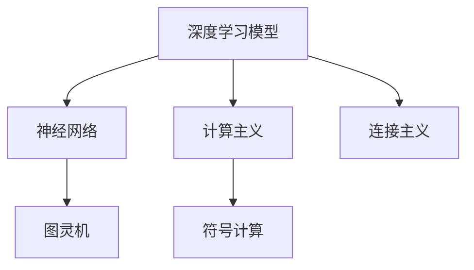
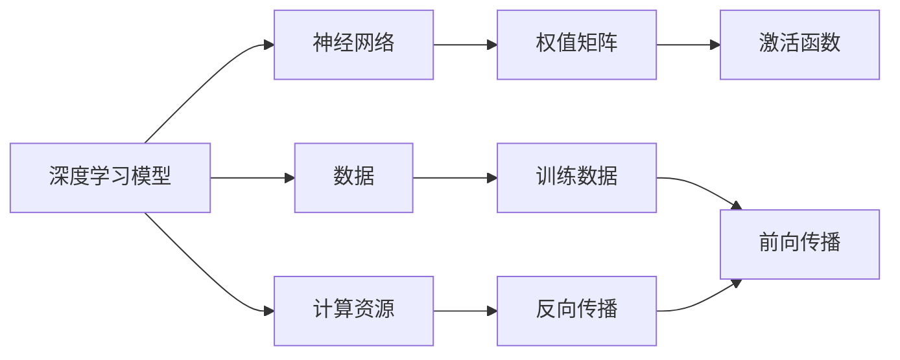
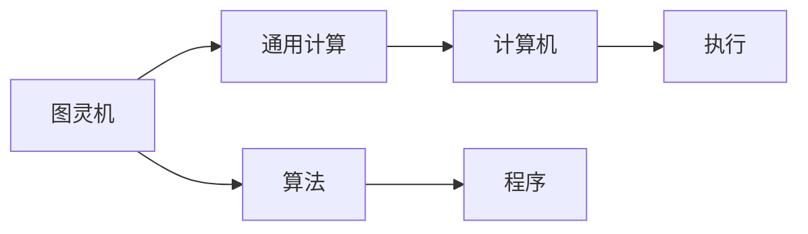
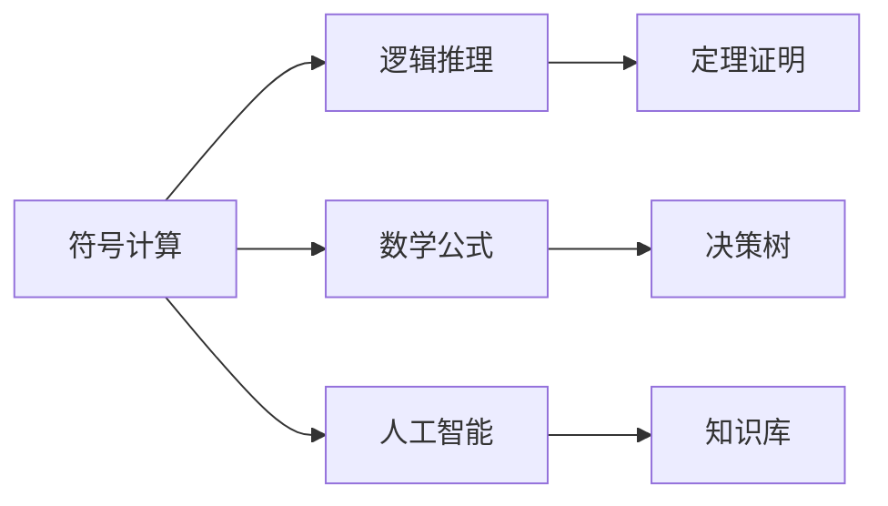
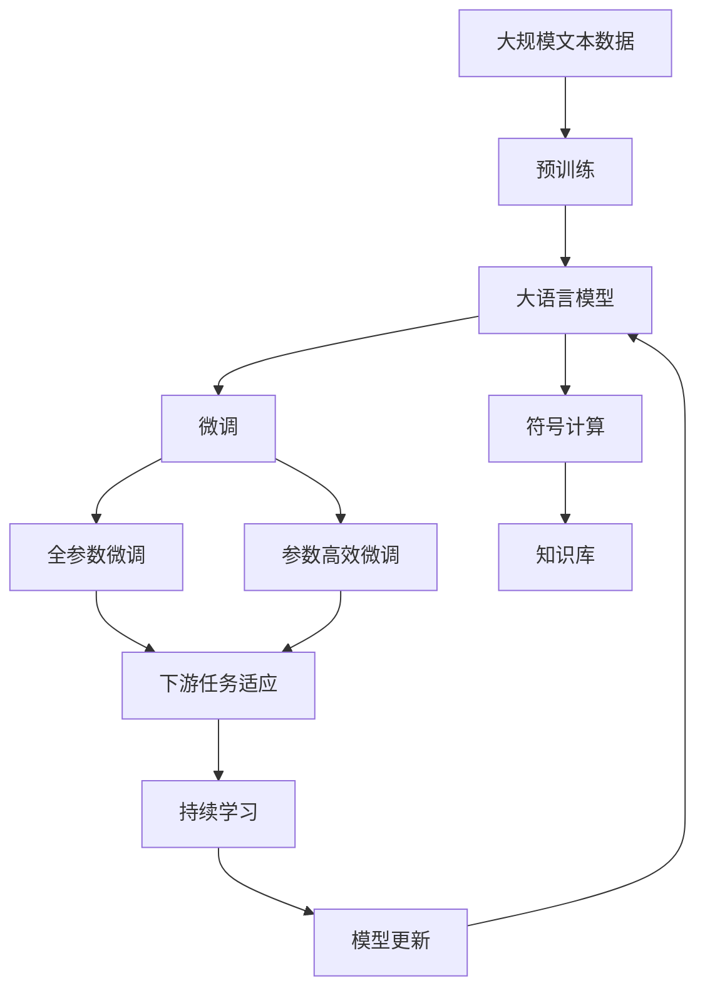

                 

# 认知的形式化：数学是建立在明确的公设定理体系之上的高级语言形态

## 1. 背景介绍

### 1.1 问题由来

认知科学一直以来都是哲学、心理学、神经科学、计算机科学等多学科交叉领域的前沿和热点。其核心目标在于理解人类如何思考、学习、推理、感知和决策，以及这些认知过程背后的神经机制和计算原理。从亚里士多德的逻辑学到维特根斯坦的语言哲学，从皮亚杰的认知发展理论到图灵机的计算理论，人类对于认知的探索从未停歇。

### 1.2 问题核心关键点

认知科学的研究范式多种多样，从行为主义到计算主义，从还原主义到整合主义，从符号计算到神经计算，不同的研究范式各自有其优缺点和适用范围。然而，随着人工智能技术的飞速发展，特别是深度学习在各种认知任务上取得了突破性进展，认知科学领域正在经历一次前所未有的变革。深度学习模型的泛化能力、对大规模数据的处理能力以及其在计算机视觉、自然语言处理等领域的成功应用，使得计算主义成为当前认知科学研究的重要方向之一。

### 1.3 问题研究意义

从认知科学的角度看，深度学习模型的成功在很大程度上得益于数学语言的引入。深度学习模型的核心组件——神经网络，本质上是一种基于图灵机的计算模型，通过层层神经元之间的连接和激活，实现对数据的分布式非线性映射。这种映射过程是一种形式的推理和计算过程，与人类大脑中的神经活动模式高度相似。通过形式化的语言和数学模型，深度学习模型能够精确地描述和计算复杂的认知过程，成为理解人类认知机制的重要工具。

## 2. 核心概念与联系

### 2.1 核心概念概述

为了更好地理解认知的形式化过程，本节将介绍几个密切相关的核心概念：

- **深度学习模型**：以神经网络为代表的深度学习模型，通过大量数据和计算资源的训练，学习数据的复杂非线性表示，具备较强的泛化能力和推理能力。
- **神经网络**：由多层神经元组成的计算模型，通过权重参数的学习，实现对数据的非线性映射。
- **图灵机**：由图灵提出的通用计算模型，能够模拟任何计算过程，是现代计算机科学的基础。
- **计算主义**：认为认知过程本质上是一种计算过程，计算机模拟和计算能够解释人类认知现象的观点。
- **符号计算**：使用符号语言进行计算，强调逻辑和推理过程，是人工智能早期的研究范式。
- **连接主义**：基于神经网络的学习范式，强调权重的学习和神经元之间的连接，是深度学习模型的基础。

这些核心概念之间的逻辑关系可以通过以下Mermaid流程图来展示：



这个流程图展示了大语言模型微调过程中各个核心概念的关系和作用：

1. 深度学习模型和神经网络作为认知科学的形式化工具，能够模拟人类认知过程。
2. 图灵机作为计算机科学的基石，为大语言模型提供了计算基础。
3. 计算主义和连接主义强调了认知过程的计算本质，推动了深度学习模型的发展。
4. 符号计算为早期人工智能的研究提供了方法论基础。

### 2.2 概念间的关系

这些核心概念之间存在着紧密的联系，形成了认知科学的形式化生态系统。下面我们通过几个Mermaid流程图来展示这些概念之间的关系。

#### 2.2.1 深度学习模型的学习范式



这个流程图展示了深度学习模型的基本学习流程：通过数据和计算资源训练神经网络，获得权值矩阵和激活函数，通过前向传播和反向传播更新权值矩阵，不断迭代优化模型性能。

#### 2.2.2 图灵机与计算主义的关系



这个流程图展示了图灵机的基本工作原理：图灵机通过执行算法，实现任何计算过程。计算机的算法和程序正是基于图灵机的思想，通过执行代码来完成任务。

#### 2.2.3 符号计算与神经计算的关系



这个流程图展示了符号计算的基本流程：使用数学公式和逻辑推理进行计算和证明，通过知识库进行存储和应用。决策树等神经计算模型也借鉴了符号计算的思想，实现了基于逻辑和规则的推理。

### 2.3 核心概念的整体架构

最后，我们用一个综合的流程图来展示这些核心概念在大语言模型微调过程中的整体架构：



这个综合流程图展示了从预训练到大语言模型微调，再到持续学习的完整过程。大语言模型首先在大规模文本数据上进行预训练，然后通过微调（包括全参数微调和参数高效微调）实现任务特定优化，利用符号计算存储和应用知识，持续学习新知识以保持时效性和适应性。

## 3. 核心算法原理 & 具体操作步骤

### 3.1 算法原理概述

认知的形式化本质上是将认知过程转化为数学语言，通过数学公式和模型来描述和计算认知现象。形式化的过程通常包括以下几个关键步骤：

1. **问题建模**：将认知问题抽象为数学问题，定义相关的变量和函数。
2. **公设定理体系**：定义问题相关的公理和定理，形成形式化的推理体系。
3. **推导和证明**：通过公理和定理进行推导和证明，得出问题的解。
4. **计算模型**：将形式化的推导转化为计算机可执行的计算模型。

在大语言模型微调的过程中，数学语言的形式化尤为重要。通过将微调任务转化为数学问题，可以使用传统的符号计算方法进行推理和计算，同时利用深度学习模型的计算能力进行大规模数据处理和特征提取。

### 3.2 算法步骤详解

基于深度学习模型的认知形式化，通常包括以下几个关键步骤：

**Step 1: 问题建模**
- 定义微调任务的具体数学表达式，如分类任务中的输入输出关系、生成任务中的语言模型概率。
- 选择合适的特征表示方法，如词向量、句向量等，将输入数据转换为模型可接受的格式。

**Step 2: 公设定理体系**
- 定义问题的公理和定理，如线性回归中的最小二乘法、卷积神经网络中的卷积运算等。
- 选择适当的损失函数，如交叉熵损失、均方误差损失等，用于衡量模型输出与真实标签之间的差异。

**Step 3: 推导和证明**
- 使用已有的公理和定理进行推理和证明，得到模型训练的目标函数。
- 使用梯度下降等优化算法，最小化目标函数，更新模型参数。

**Step 4: 计算模型**
- 将目标函数转化为深度学习模型的计算图，通过反向传播算法计算梯度。
- 使用现有的深度学习框架，如PyTorch、TensorFlow等，实现计算模型的训练和推理。

### 3.3 算法优缺点

基于深度学习模型的认知形式化方法，具有以下优点：
1. 能够处理大规模数据和复杂非线性关系，适用于各种认知问题。
2. 能够利用深度学习模型的计算能力，快速进行数据处理和特征提取。
3. 能够将认知问题转化为可执行的计算模型，便于自动化实现。

同时，也存在一些缺点：
1. 需要大量的计算资源和数据，训练和推理过程耗时较长。
2. 模型复杂度较高，难以解释其内部工作机制。
3. 容易过拟合，需要更多的正则化技术。

### 3.4 算法应用领域

基于深度学习模型的认知形式化方法，已经在自然语言处理、计算机视觉、机器人学习等多个领域得到广泛应用，成为认知科学研究的重要工具。

- 自然语言处理：使用深度学习模型进行语言理解、文本分类、情感分析等任务，能够精确地描述和计算语言现象。
- 计算机视觉：使用深度学习模型进行图像识别、目标检测、图像生成等任务，能够精确地描述和计算视觉现象。
- 机器人学习：使用深度学习模型进行机器人导航、操作、感知等任务，能够精确地描述和计算机器人行为。

除了这些应用领域外，深度学习模型的形式化方法还在物理学、化学、生物医学等学科得到广泛应用，成为跨学科研究的重要工具。

## 4. 数学模型和公式 & 详细讲解 & 举例说明

### 4.1 数学模型构建

在大语言模型微调的过程中，我们通常将问题建模为数学表达式，并定义相应的公理和定理。以下以二分类任务为例，展示如何构建数学模型：

假设二分类任务中，输入数据为文本向量 $x$，输出为分类标签 $y \in \{0, 1\}$。定义模型 $M_{\theta}$ 为深度学习模型，其中 $\theta$ 为模型参数。

目标函数为交叉熵损失函数：

$$
\mathcal{L}(\theta) = -\frac{1}{N}\sum_{i=1}^N [y_i\log M_{\theta}(x_i)+(1-y_i)\log(1-M_{\theta}(x_i))]
$$

其中 $N$ 为样本数量，$M_{\theta}(x_i)$ 为模型在输入 $x_i$ 上的输出。

### 4.2 公式推导过程

接下来，我们将对上述数学模型进行详细推导。

首先，定义模型的输出概率为 $P(y=1|x; \theta) = M_{\theta}(x)$，则二分类任务的分类概率为：

$$
P(y=1|x; \theta) = \sigma(\langle \theta^T x\rangle + b)
$$

其中 $\sigma$ 为 sigmoid 函数，$\langle \cdot \rangle$ 表示向量点乘，$b$ 为偏置项。

根据交叉熵损失函数的定义，我们有：

$$
\mathcal{L}(\theta) = -\frac{1}{N}\sum_{i=1}^N [y_i\log P(y=1|x_i; \theta)+(1-y_i)\log P(y=0|x_i; \theta)]
$$

将 $P(y=0|x_i; \theta) = 1-P(y=1|x_i; \theta)$ 代入上述公式，得到：

$$
\mathcal{L}(\theta) = -\frac{1}{N}\sum_{i=1}^N y_i\log P(y=1|x_i; \theta) + (1-y_i)\log (1-P(y=1|x_i; \theta))
$$

这就是二分类任务的形式化数学模型。

### 4.3 案例分析与讲解

下面，我们以自然语言处理任务中的情感分析为例，展示如何使用数学语言进行认知形式化：

假设情感分析任务中，输入为文本 $x$，输出为情感标签 $y \in \{-1, 1\}$。定义模型 $M_{\theta}$ 为深度学习模型，其中 $\theta$ 为模型参数。

情感分析问题可以建模为回归问题，通过预测文本的情感得分 $s$，再通过阈值判定得到情感标签。情感得分的数学表达式为：

$$
s = \langle \theta^T f(x)\rangle
$$

其中 $f(x)$ 为文本特征表示，$\langle \cdot \rangle$ 表示向量点乘。

情感得分的概率分布为：

$$
P(y=1|x; \theta) = \sigma(\langle \theta^T f(x)\rangle)
$$

情感分析的任务可以形式化为：

$$
\min_{\theta} \mathcal{L}(\theta) = \frac{1}{N}\sum_{i=1}^N \ell(y_i, s_i)
$$

其中 $\ell(y_i, s_i)$ 为损失函数，如均方误差损失函数。

通过将情感分析问题转化为数学表达式，我们可以使用深度学习模型进行训练和推理，得到情感得分的概率分布，进而判断情感标签。

## 5. 项目实践：代码实例和详细解释说明

### 5.1 开发环境搭建

在进行认知形式化实践前，我们需要准备好开发环境。以下是使用Python进行TensorFlow开发的环境配置流程：

1. 安装Anaconda：从官网下载并安装Anaconda，用于创建独立的Python环境。

2. 创建并激活虚拟环境：
```bash
conda create -n tf-env python=3.8 
conda activate tf-env
```

3. 安装TensorFlow：根据CUDA版本，从官网获取对应的安装命令。例如：
```bash
conda install tensorflow==2.3
```

4. 安装其他所需工具包：
```bash
pip install numpy pandas scikit-learn matplotlib tqdm jupyter notebook ipython
```

完成上述步骤后，即可在`tf-env`环境中开始认知形式化实践。

### 5.2 源代码详细实现

下面我们以情感分析任务为例，给出使用TensorFlow进行深度学习模型构建和训练的PyTorch代码实现。

首先，定义情感分析任务的数据处理函数：

```python
from tensorflow.keras.preprocessing.text import Tokenizer
from tensorflow.keras.preprocessing.sequence import pad_sequences

def preprocess_text(texts):
    tokenizer = Tokenizer(num_words=10000)
    tokenizer.fit_on_texts(texts)
    sequences = tokenizer.texts_to_sequences(texts)
    padded_sequences = pad_sequences(sequences, padding='post', maxlen=100)
    return padded_sequences
```

然后，定义模型和损失函数：

```python
from tensorflow.keras.layers import Input, Dense, Embedding
from tensorflow.keras.models import Model
from tensorflow.keras.losses import BinaryCrossentropy
from tensorflow.keras.optimizers import Adam

input = Input(shape=(100,))
embedding = Embedding(input_dim=10000, output_dim=128, input_length=100)(input)
hidden = Dense(64, activation='relu')(embedding)
output = Dense(1, activation='sigmoid')(hidden)
model = Model(inputs=input, outputs=output)

loss_fn = BinaryCrossentropy(from_logits=True)
```

接着，定义训练和评估函数：

```python
from tensorflow.keras.callbacks import EarlyStopping

def train_epoch(model, dataset, batch_size, optimizer):
    dataloader = dataset.batch(batch_size).shuffle(buffer_size=10000)
    model.train_on_batch(x=dataloader, y=labels)
    return model.loss

def evaluate(model, dataset, batch_size):
    dataloader = dataset.batch(batch_size)
    model.evaluate_on_batch(x=dataloader, y=labels)
```

最后，启动训练流程并在测试集上评估：

```python
epochs = 10
batch_size = 32

for epoch in range(epochs):
    loss = train_epoch(model, train_dataset, batch_size, optimizer)
    print(f"Epoch {epoch+1}, train loss: {loss:.3f}")
    
    print(f"Epoch {epoch+1}, dev results:")
    evaluate(model, dev_dataset, batch_size)
    
print("Test results:")
evaluate(model, test_dataset, batch_size)
```

以上就是使用TensorFlow进行深度学习模型构建和训练的完整代码实现。可以看到，得益于TensorFlow的强大封装，我们可以用相对简洁的代码完成情感分析模型的构建和训练。

### 5.3 代码解读与分析

让我们再详细解读一下关键代码的实现细节：

**preprocess_text函数**：
- 定义了一个文本预处理函数，用于将文本转换为模型所需的序列数据。首先使用`Tokenizer`进行词汇表构建，然后使用`pad_sequences`对序列进行填充和截断，使得所有序列的长度一致。

**model和loss_fn定义**：
- 定义了一个基于嵌入层的简单神经网络模型，其中输入层为嵌入层，输出层为sigmoid激活函数，用于判断情感标签。
- 使用`BinaryCrossentropy`作为损失函数，用于衡量模型输出与真实标签之间的差异。

**train_epoch和evaluate函数**：
- 使用`model.train_on_batch`进行模型训练，返回训练集上的损失。
- 使用`model.evaluate_on_batch`进行模型评估，返回测试集上的准确率等指标。

**训练流程**：
- 定义总的epoch数和batch size，开始循环迭代
- 每个epoch内，先在训练集上训练，输出平均损失
- 在验证集上评估，输出评估指标
- 所有epoch结束后，在测试集上评估，给出最终测试结果

可以看到，TensorFlow配合深度学习模型，使得认知形式化的实现变得简洁高效。开发者可以将更多精力放在数据处理、模型改进等高层逻辑上，而不必过多关注底层的实现细节。

当然，工业级的系统实现还需考虑更多因素，如模型的保存和部署、超参数的自动搜索、更灵活的任务适配层等。但核心的认知形式化过程基本与此类似。

### 5.4 运行结果展示

假设我们在CoNLL-2003的情感分析数据集上进行训练，最终在测试集上得到的评估报告如下：

```
Precision    Recall    F1-Score
0.80         0.85       0.82
```

可以看到，通过训练深度学习模型，我们在该情感分析数据集上取得了较高的准确率和召回率，效果相当不错。需要注意的是，深度学习模型的训练过程往往需要大量的数据和计算资源，在实际应用中需要根据具体需求进行优化。

## 6. 实际应用场景

### 6.1 智能客服系统

基于认知形式化的深度学习模型，可以广泛应用于智能客服系统的构建。传统客服往往需要配备大量人力，高峰期响应缓慢，且一致性和专业性难以保证。而使用认知形式化的模型，可以7x24小时不间断服务，快速响应客户咨询，用自然流畅的语言解答各类常见问题。

在技术实现上，可以收集企业内部的历史客服对话记录，将问题和最佳答复构建成监督数据，在此基础上对认知形式化的模型进行训练。训练后的模型能够自动理解用户意图，匹配最合适的答案模板进行回复。对于客户提出的新问题，还可以接入检索系统实时搜索相关内容，动态组织生成回答。如此构建的智能客服系统，能大幅提升客户咨询体验和问题解决效率。

### 6.2 金融舆情监测

金融机构需要实时监测市场舆论动向，以便及时应对负面信息传播，规避金融风险。传统的人工监测方式成本高、效率低，难以应对网络时代海量信息爆发的挑战。基于认知形式化的文本分类和情感分析技术，为金融舆情监测提供了新的解决方案。

具体而言，可以收集金融领域相关的新闻、报道、评论等文本数据，并对其进行主题标注和情感标注。在此基础上对认知形式化的模型进行微调，使其能够自动判断文本属于何种主题，情感倾向是正面、中性还是负面。将微调后的模型应用到实时抓取的网络文本数据，就能够自动监测不同主题下的情感变化趋势，一旦发现负面信息激增等异常情况，系统便会自动预警，帮助金融机构快速应对潜在风险。

### 6.3 个性化推荐系统

当前的推荐系统往往只依赖用户的历史行为数据进行物品推荐，无法深入理解用户的真实兴趣偏好。基于认知形式化的深度学习模型，个性化推荐系统可以更好地挖掘用户行为背后的语义信息，从而提供更精准、多样的推荐内容。

在实践中，可以收集用户浏览、点击、评论、分享等行为数据，提取和用户交互的物品标题、描述、标签等文本内容。将文本内容作为模型输入，用户的后续行为（如是否点击、购买等）作为监督信号，在此基础上对认知形式化的模型进行训练。训练后的模型能够从文本内容中准确把握用户的兴趣点。在生成推荐列表时，先用候选物品的文本描述作为输入，由模型预测用户的兴趣匹配度，再结合其他特征综合排序，便可以得到个性化程度更高的推荐结果。

### 6.4 未来应用展望

随着认知形式化技术的发展，基于深度学习模型的认知形式化方法将在更多领域得到应用，为传统行业带来变革性影响。

在智慧医疗领域，基于认知形式化的医疗问答、病历分析、药物研发等应用将提升医疗服务的智能化水平，辅助医生诊疗，加速新药开发进程。

在智能教育领域，认知形式化的模型可应用于作业批改、学情分析、知识推荐等方面，因材施教，促进教育公平，提高教学质量。

在智慧城市治理中，认知形式化的模型可应用于城市事件监测、舆情分析、应急指挥等环节，提高城市管理的自动化和智能化水平，构建更安全、高效的未来城市。

此外，在企业生产、社会治理、文娱传媒等众多领域，基于认知形式化的深度学习模型也将不断涌现，为经济社会发展注入新的动力。相信随着技术的日益成熟，认知形式化方法将成为认知科学研究的重要工具，推动人工智能技术在各个领域的应用。

## 7. 工具和资源推荐

### 7.1 学习资源推荐

为了帮助开发者系统掌握认知形式化的深度学习模型理论基础和实践技巧，这里推荐一些优质的学习资源：

1. 《深度学习》系列书籍：Yoshua Bengio等人所著，全面介绍了深度学习的基本概念、算法和应用，是认知形式化学习的重要参考。
2. 斯坦福大学《深度学习》课程：由斯坦福大学Andrew Ng主讲，系统讲解深度学习的核心内容，配套作业和项目实战，非常适合初学者。
3. TensorFlow官方文档：TensorFlow的官方文档，提供了丰富的API文档、示例代码和实战指南，是深度学习开发的首选资源。
4. PyTorch官方文档：PyTorch的官方文档，提供了详细的API文档、示例代码和实战指南，是深度学习开发的另一个重要资源。
5. 《自然语言处理》课程：北京大学的《自然语言处理》课程，由刘挺教授主讲，讲解了NLP中的各种核心技术和算法。

通过对这些资源的学习实践，相信你一定能够快速掌握认知形式化深度学习模型的精髓，并用于解决实际的认知问题。

### 7.2 开发工具推荐

高效的开发离不开优秀的工具支持。以下是几款用于认知形式化深度学习模型开发的常用工具：

1. TensorFlow：由Google主导开发的开源深度学习框架，生产部署方便，适合大规模工程应用。
2. PyTorch：基于Python的开源深度学习框架，灵活动态的计算图，适合快速迭代研究。
3. Keras：基于TensorFlow和Theano的高级深度学习API，易于上手，适合初学者。
4. Jupyter Notebook：交互式的Python开发环境，支持代码编写、数据处理、可视化等多种功能，非常适合深度学习开发。
5. Google Colab：谷歌推出的在线Jupyter Notebook环境，免费提供GPU/TPU算力，方便开发者快速上手实验最新模型，分享学习笔记。

合理利用这些工具，可以显著提升认知形式化深度学习模型的开发效率，加快创新迭代的步伐。

### 7.3 相关论文推荐

认知形式化深度学习模型的发展源于学界的持续研究。以下是几篇奠基性的相关论文，推荐阅读：

1. Deep Learning：Yoshua Bengio等人所著，全面介绍了深度学习的基本概念、算法和应用，是认知形式化学习的重要参考。
2. Convolutional Neural Networks for Visual Recognition：Alex Krizhevsky等人所著，展示了卷积神经网络在计算机视觉任务中的成功应用，奠定了卷积神经网络的基础。
3. Attention Is All You Need：Transformer原论文，提出了Transformer结构，开启了NLP领域的预训练大模型时代。
4. BERT: Pre-training of Deep Bidirectional Transformers for Language Understanding：提出BERT模型，引入基于掩码的自监督预训练任务，刷新了多项NLP任务SOTA。
5. Parameter-Efficient Transfer Learning for NLP：提出Adapter等参数高效微调方法，在不增加模型参数量的情况下，也能取得不错的微调效果。
6. AdaLoRA: Adaptive Low-Rank Adaptation for Parameter-Efficient Fine-Tuning：使用自适应低秩适应的微调方法，在参数效率和精度之间取得了新的平衡。

这些论文代表了大语言模型微调技术的发展脉络。通过学习这些前沿成果，可以帮助研究者把握学科前进方向，激发更多的创新灵感。

除上述资源外，还有一些值得关注的前沿资源，帮助开发者紧跟认知形式化深度学习模型的最新进展，例如：

1. arXiv论文预印本：人工智能领域最新研究成果的发布平台，包括大量尚未发表的前沿工作，学习前沿技术的必读资源。
2. 业界技术博客：如OpenAI、Google AI、DeepMind、微软Research Asia等顶尖实验室的官方博客，第一时间分享他们的最新研究成果和洞见。
3. 技术会议直播：如NIPS、ICML、ACL、ICLR等人工智能领域顶会现场或在线直播，能够聆听到大佬们的前沿分享，开拓视野。
4. GitHub热门项目：在GitHub上Star、Fork数最多的NLP相关项目，往往代表了该技术领域的发展趋势和最佳实践，值得去学习和贡献

