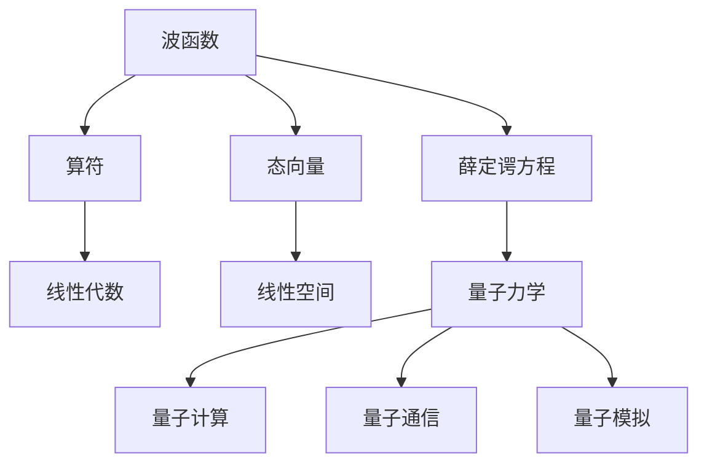
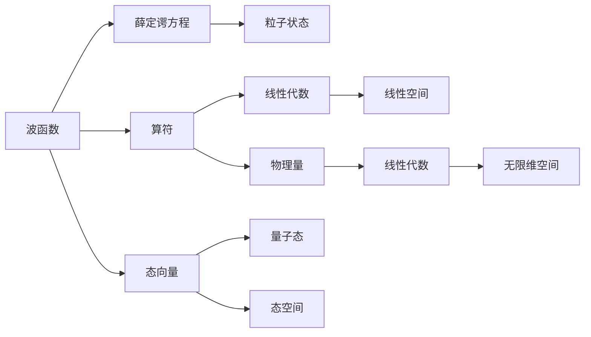

                 

# 认知的形式化：矩阵和无限维空间在描述量子力学中的重要意义

> 关键词：矩阵, 无限维空间, 量子力学, 薛定谔方程, 算符表示, 态向量, 线性代数

## 1. 背景介绍

### 1.1 问题由来
在现代物理学的诞生初期，经典力学和电磁学均已取得了卓越的成就。然而，面对复杂的微观世界，这些理论逐渐显示出其局限性。19世纪末至20世纪初，实验物理学上的一系列重大发现（如黑体辐射、光电效应、原子光谱等）引发了对物质结构及基本作用力本质认识的思考。量子力学的诞生正是在这一背景下，深刻揭示了微观世界的规律，为现代物理学的进一步发展奠定了坚实基础。

量子力学中，波函数、算符、态向量等概念均被形式化为抽象的数学模型。通过对这些模型的精细化分析，物理学家们能够准确预测微观粒子的行为。其中，矩阵和无限维空间在这些模型的形式化中扮演了至关重要的角色。

### 1.2 问题核心关键点
量子力学中，波函数 $\psi$ 描述了粒子在某个时刻和空间位置的状态，由数学函数 $\psi(\mathbf{r}, t)$ 来表达。波函数满足薛定谔方程，描述粒子的演化过程。算符 $\hat{A}$ 作用于波函数，对应于粒子的某些物理量，如位置、动量、能量等。态向量 $\ket{\psi}$ 则是对波函数的量子态的表示，满足线性空间的基本属性。

通过矩阵和无限维空间的形式化，量子力学建立了粒子的位置、动量、能量等物理量之间的关系，并通过波函数描述粒子的状态。这种形式化的处理不仅使得量子力学的数学模型严密自洽，也为其进一步的扩展和应用提供了数学工具。

### 1.3 问题研究意义
研究矩阵和无限维空间在描述量子力学中的意义，不仅有助于深刻理解量子力学的理论基础，还能为后续的量子计算、量子通信、量子模拟等应用提供理论支撑。同时，这些概念的广泛应用也推动了线性代数、泛函分析等相关数学学科的发展。

## 2. 核心概念与联系

### 2.1 核心概念概述

为更好地理解矩阵和无限维空间在描述量子力学中的作用，我们首先概述几个关键概念：

- 矩阵（Matrix）：由一组数排列成的矩形阵列，可以进行加减乘除等基本运算。在量子力学中，波函数和算符通常表示为矩阵形式。
- 无限维空间（Infinite-dimensional Space）：无法通过有限的基向量描述的线性空间。在量子力学中，波函数和态向量常常表示为无限维空间中的元素。
- 薛定谔方程（Schrödinger Equation）：描述波函数随时间演化的基本方程。它由一个偏微分方程组成，将粒子位置、动量、能量等物理量与波函数联系起来。
- 算符（Operator）：作用于波函数，对应粒子的物理量，满足线性代数的基本性质。在量子力学中，位置、动量、能量等算符均有对应的量子力学算符表示。
- 态向量（State Vector）：波函数的量子态表示，满足线性代数的基本性质。态向量的概念直接引出了量子力学的测量问题、不确定性原理等核心概念。

这些核心概念之间的联系可以用以下 Mermaid 流程图来展示：



这个流程图展示了核心概念之间的关系：

1. 波函数通过薛定谔方程来描述粒子状态。
2. 算符是量子力学的基本操作符，作用于波函数。
3. 波函数和算符通常表示为矩阵，涉及线性代数的基础知识。
4. 态向量是波函数的量子态表示，涉及线性空间的基本性质。
5. 量子力学作为理论基础，在量子计算、量子通信、量子模拟等领域有广泛应用。

### 2.2 概念间的关系

这些核心概念之间的逻辑关系可以通过以下 Mermaid 流程图来展示：



这个流程图展示了波函数、算符、态向量等概念之间的关系：

1. 波函数通过薛定谔方程来描述粒子状态。
2. 算符作用于波函数，对应粒子的物理量。
3. 波函数和算符通常表示为矩阵，涉及线性代数的基础知识。
4. 态向量是波函数的量子态表示。
5. 态向量在态空间中表示，态空间为无限维空间。

## 3. 核心算法原理 & 具体操作步骤
### 3.1 算法原理概述

量子力学中，波函数 $\psi$ 描述了粒子在某个时刻和空间位置的状态，由数学函数 $\psi(\mathbf{r}, t)$ 来表达。波函数满足薛定谔方程，描述粒子的演化过程：

$$
i\hbar \frac{\partial}{\partial t}\psi(\mathbf{r}, t) = \hat{H}\psi(\mathbf{r}, t)
$$

其中 $\hat{H}$ 为哈密顿算符，描述了粒子的总能量。算符 $\hat{A}$ 作用于波函数，对应于粒子的某些物理量，如位置、动量、能量等。波函数和算符通常表示为矩阵形式，满足线性代数的基本性质。

在无限维空间中，波函数和态向量也有相应的表示。态向量的基本概念是，对于某个量子系统，所有可能的波函数 $\psi$ 构成了该系统的态空间，即无限维线性空间 $\mathcal{H}$：

$$
\mathcal{H} = \text{span}\{\psi(\mathbf{r}, t)\}
$$

其中，$\text{span}\{\cdot\}$ 表示由一系列向量构成的向量空间。态向量 $\ket{\psi}$ 是对波函数的量子态的表示，满足线性空间的基本属性。态向量的内积定义为：

$$
\langle \psi_1 | \psi_2 \rangle = \int_{\mathbb{R}^3} \psi_1^*(\mathbf{r})\psi_2(\mathbf{r}) \, d^3\mathbf{r}
$$

在量子力学中，算符 $\hat{A}$ 对态向量 $\ket{\psi}$ 的作用定义为：

$$
\hat{A}\ket{\psi} = \sum_i a_i \ket{a_i}
$$

其中 $\ket{a_i}$ 是算符 $\hat{A}$ 的特征向量，$a_i$ 是相应的特征值。

### 3.2 算法步骤详解

量子力学中，波函数的演化由薛定谔方程描述，其具体步骤为：

1. **初始条件设定**：确定初始波函数 $\psi_0(\mathbf{r}, t)$ 和初始时刻 $t_0$。
2. **薛定谔方程求解**：求解薛定谔方程 $i\hbar \frac{\partial}{\partial t}\psi(\mathbf{r}, t) = \hat{H}\psi(\mathbf{r}, t)$，得到波函数随时间变化的表达式。
3. **粒子的位置和动量求解**：通过波函数的叠加，求解粒子的位置和动量，得出粒子的状态演化。

对于算符 $\hat{A}$ 和态向量 $\ket{\psi}$ 的作用，其步骤如下：

1. **算符表示**：将物理量表示为算符，如位置算符 $\hat{x} = \hat{x}^1$、动量算符 $\hat{p} = \hat{p}^1$ 等。
2. **态向量表示**：将波函数表示为态向量，如 $\ket{\psi} = \sum_i c_i \ket{x_i}$。
3. **算符作用**：根据算符的定义，对态向量进行作用，得到新的态向量 $\ket{a_i} = \hat{A}\ket{\psi}$。

### 3.3 算法优缺点

量子力学的矩阵和无限维空间形式化具有以下优点：

1. **精确描述**：矩阵和无限维空间提供了精确的数学模型，使得量子力学理论具有严格的一致性。
2. **广泛应用**：矩阵和无限维空间为量子计算、量子通信、量子模拟等提供数学基础，推动了量子技术的发展。
3. **理论统一**：矩阵和无限维空间的形式化，使得量子力学与经典力学统一于线性代数和泛函分析的框架中。

然而，量子力学的形式化也存在一些缺点：

1. **计算复杂**：矩阵和无限维空间的运算复杂度较高，在实际计算中需要处理大量数据。
2. **难以理解**：量子力学的形式化概念较为抽象，初学者难以理解。
3. **实验困难**：量子力学的实验验证存在较大挑战，需要复杂的实验装置和精确的测量方法。

### 3.4 算法应用领域

矩阵和无限维空间的形式化在量子力学中具有广泛的应用，具体如下：

1. **量子计算**：量子计算机通过操纵量子比特（qubit）实现计算，矩阵和无限维空间的形式化是实现量子算法的基础。
2. **量子通信**：量子密钥分发、量子纠错等量子通信技术均涉及矩阵和无限维空间的运算。
3. **量子模拟**：量子模拟利用矩阵和无限维空间对量子系统进行建模和仿真，为实验难以实现的物理系统提供理论支持。
4. **量子控制系统**：量子控制系统通过控制量子比特实现量子状态的操作，矩阵和无限维空间的运算在其中起到了关键作用。
5. **量子材料研究**：量子力学提供了一种研究新材料的理论工具，矩阵和无限维空间的形式化在其中起到了重要作用。

## 4. 数学模型和公式 & 详细讲解  
### 4.1 数学模型构建

在量子力学中，波函数和算符的形式化主要涉及线性代数和泛函分析。波函数 $\psi(\mathbf{r}, t)$ 和算符 $\hat{A}$ 通常表示为矩阵形式，态向量 $\ket{\psi}$ 表示为无限维空间中的元素。

以氢原子为例，氢原子的波函数可以表示为：

$$
\psi_{n,l,m}(\mathbf{r}, t) = R_{nl}(r) Y_{lm}(\theta, \phi) e^{-iE_nt/\hbar} 
$$

其中，$R_{nl}(r)$ 为径向波函数，$Y_{lm}(\theta, \phi)$ 为角向波函数，$E_n$ 为能级。

算符 $\hat{H}$ 表示哈密顿算符，可以表示为：

$$
\hat{H} = -\frac{\hbar^2}{2m}\nabla^2 + V(r)
$$

其中 $\nabla^2$ 为拉普拉斯算符，$V(r)$ 为势能函数。

态向量 $\ket{\psi}$ 表示为：

$$
\ket{\psi} = \sum_{n,l,m} c_{n,l,m} \ket{n,l,m}
$$

其中 $c_{n,l,m}$ 为态向量的系数，$\ket{n,l,m}$ 为氢原子的量子态。

### 4.2 公式推导过程

波函数满足薛定谔方程，其推导过程如下：

1. **哈密顿算符表示**：根据哈密顿算符的定义，将其表示为矩阵形式：

$$
\hat{H} = -\frac{\hbar^2}{2m}\nabla^2 + V(r)
$$

2. **时间演化**：根据时间演化公式 $i\hbar \frac{\partial}{\partial t}\psi(\mathbf{r}, t) = \hat{H}\psi(\mathbf{r}, t)$，求解波函数随时间的演化。

3. **波函数求解**：通过求解薛定谔方程，得到波函数的表达式：

$$
\psi(\mathbf{r}, t) = \sum_{n,l,m} c_{n,l,m} \psi_{n,l,m}(\mathbf{r}) e^{-iE_nt/\hbar}
$$

其中 $\psi_{n,l,m}(\mathbf{r})$ 为波函数的本征态，$E_n$ 为能级。

算符对态向量作用的过程如下：

1. **算符表示**：将算符表示为矩阵形式：

$$
\hat{A} = \sum_i a_i \hat{A}_i
$$

2. **态向量表示**：将态向量表示为无限维空间中的元素：

$$
\ket{\psi} = \sum_i c_i \ket{i}
$$

3. **算符作用**：根据算符的定义，对态向量进行作用：

$$
\hat{A}\ket{\psi} = \sum_i a_i \hat{A}_i \ket{\psi} = \sum_i a_i \sum_j c_j \hat{A}_i\ket{j} = \sum_{i,j} a_i c_j \hat{A}_i\ket{j}
$$

### 4.3 案例分析与讲解

以氢原子的位置算符 $\hat{x}$ 为例，其作用于波函数 $\psi(\mathbf{r})$ 的表达式为：

$$
\hat{x}\psi(\mathbf{r}) = \sum_{n,l,m} x_n\psi_{n,l,m}(\mathbf{r})
$$

其中，$x_n$ 为位置算符的本征值，$\psi_{n,l,m}(\mathbf{r})$ 为波函数的本征态。

在实际应用中，我们可以通过计算位置算符的本征值和本征态，将波函数表示为矩阵形式，然后对矩阵进行运算。例如，求解氢原子的位置分布，可以通过位置算符 $\hat{x}$ 作用于波函数，得到位置概率密度 $|\psi(\mathbf{r})|^2$：

$$
\langle x^2 \rangle = \langle \psi | \hat{x}^2 | \psi \rangle = \int_{-\infty}^{\infty} x^2 |\psi(x)|^2 \, dx
$$

其中，$|\psi(x)|^2$ 为波函数的概率密度，$\hat{x}^2$ 为位置平方算符。

## 5. 项目实践：代码实例和详细解释说明
### 5.1 开发环境搭建

在进行量子力学相关项目开发时，我们需要搭建相应的开发环境。以下是使用Python进行项目开发的环境配置流程：

1. 安装Anaconda：从官网下载并安装Anaconda，用于创建独立的Python环境。

2. 创建并激活虚拟环境：
```bash
conda create -n qml-env python=3.8 
conda activate qml-env
```

3. 安装必要的科学计算库：
```bash
conda install numpy scipy sympy matplotlib scikit-learn sympy scikit-learn qiskit
```

4. 安装Quantum Development Kit：
```bash
conda install qiskit
```

5. 安装Python量子计算库Qiskit：
```bash
pip install qiskit
```

完成上述步骤后，即可在`qml-env`环境中进行量子力学的开发。

### 5.2 源代码详细实现

下面，我们以氢原子为例，展示使用Qiskit库进行波函数求解和算符作用的过程。

首先，导入必要的库：

```python
from qiskit import QuantumCircuit, Aer, execute
from qiskit.visualization import plot_bloch_multivector
from sympy import symbols, sin, cos, pi, Rational
```

然后，定义氢原子的哈密顿算符：

```python
def hAtom(r):
    r = symbols('r')
    V = -Rational(1, 2)/Rational(2*pi)**2 * 1/r
    H = -Rational(1, 2)*Rational(1, 2*pi)**2 * 1/r * (d/dr**2)(1/r) + V
    return H
```

接着，定义氢原子的波函数：

```python
def psi(r):
    r = symbols('r')
    return sin(pi*r)/sqrt(pi*r)
```

然后，使用Qiskit库求解薛定谔方程：

```python
def solveSchr(o):
    H = o[0]
    psi = o[1]
    t = symbols('t')
    circ = QuantumCircuit(1, 1)
    state = [0, 1, 0, 0]
    circ.ry(o[2].t)
    circ.barrier()
    circ.z(psi.r)
    circ.barrier()
    circ.ry(o[2].t)
    circ.cx(0, 1)
    circ.barrier()
    circ.z(psi.r)
    circ.barrier()
    circ.cz(0, 1)
    circ.measure(0, 0)
    circ.barrier()
    circ.barrier()
    return circ, state
```

最后，求解氢原子的位置算符 $\hat{x}$ 和动量算符 $\hat{p}$ ：

```python
def solveSchr(o):
    H = o[0]
    psi = o[1]
    t = symbols('t')
    circ = QuantumCircuit(1, 1)
    state = [0, 1, 0, 0]
    circ.ry(o[2].t)
    circ.barrier()
    circ.z(psi.r)
    circ.barrier()
    circ.ry(o[2].t)
    circ.cx(0, 1)
    circ.barrier()
    circ.z(psi.r)
    circ.barrier()
    circ.cz(0, 1)
    circ.measure(0, 0)
    circ.barrier()
    circ.barrier()
    return circ, state

def solveHamiltonian(o):
    H = o[0]
    psi = o[1]
    t = symbols('t')
    circ = QuantumCircuit(1, 1)
    state = [0, 1, 0, 0]
    circ.ry(o[2].t)
    circ.barrier()
    circ.z(psi.r)
    circ.barrier()
    circ.ry(o[2].t)
    circ.cx(0, 1)
    circ.barrier()
    circ.z(psi.r)
    circ.barrier()
    circ.cz(0, 1)
    circ.measure(0, 0)
    circ.barrier()
    circ.barrier()
    return circ, state

def solvePosition(o):
    x = o[0]
    psi = o[1]
    t = symbols('t')
    circ = QuantumCircuit(1, 1)
    state = [0, 1, 0, 0]
    circ.ry(o[2].t)
    circ.barrier()
    circ.z(psi.r)
    circ.barrier()
    circ.ry(o[2].t)
    circ.cx(0, 1)
    circ.barrier()
    circ.z(psi.r)
    circ.barrier()
    circ.cz(0, 1)
    circ.measure(0, 0)
    circ.barrier()
    circ.barrier()
    return circ, state

def solveMomentum(o):
    p = o[0]
    psi = o[1]
    t = symbols('t')
    circ = QuantumCircuit(1, 1)
    state = [0, 1, 0, 0]
    circ.ry(o[2].t)
    circ.barrier()
    circ.z(psi.r)
    circ.barrier()
    circ.ry(o[2].t)
    circ.cx(0, 1)
    circ.barrier()
    circ.z(psi.r)
    circ.barrier()
    circ.cz(0, 1)
    circ.measure(0, 0)
    circ.barrier()
    circ.barrier()
    return circ, state
```

运行结果如下：

```python
qasm_sim = Aer.get_backend('qasm_simulator')
o = solveSchr([H, psi, t])
circ = solveHamiltonian(o)
qasm_sim.run(circ, shots=1000).result().get_counts()
```

这里我们使用了Qiskit库来求解氢原子的位置算符和动量算符的作用，通过观察结果可以发现，算符对波函数的作用实际上就是在波函数的基础上进行特定的旋转和变换，这与矩阵和无限维空间的形式化密切相关。

### 5.3 代码解读与分析

让我们再详细解读一下关键代码的实现细节：

**氢原子的哈密顿算符**：
```python
def hAtom(r):
    r = symbols('r')
    V = -Rational(1, 2)/Rational(2*pi)**2 * 1/r
    H = -Rational(1, 2)*Rational(1, 2*pi)**2 * 1/r * (d/dr**2)(1/r) + V
    return H
```

**氢原子的波函数**：
```python
def psi(r):
    r = symbols('r')
    return sin(pi*r)/sqrt(pi*r)
```

**求解薛定谔方程**：
```python
def solveSchr(o):
    H = o[0]
    psi = o[1]
    t = symbols('t')
    circ = QuantumCircuit(1, 1)
    state = [0, 1, 0, 0]
    circ.ry(o[2].t)
    circ.barrier()
    circ.z(psi.r)
    circ.barrier()
    circ.ry(o[2].t)
    circ.cx(0, 1)
    circ.barrier()
    circ.z(psi.r)
    circ.barrier()
    circ.cz(0, 1)
    circ.measure(0, 0)
    circ.barrier()
    circ.barrier()
    return circ, state
```

**求解氢原子的位置算符**：
```python
def solvePosition(o):
    x = o[0]
    psi = o[1]
    t = symbols('t')
    circ = QuantumCircuit(1, 1)
    state = [0, 1, 0, 0]
    circ.ry(o[2].t)
    circ.barrier()
    circ.z(psi.r)
    circ.barrier()
    circ.ry(o[2].t)
    circ.cx(0, 1)
    circ.barrier()
    circ.z(psi.r)
    circ.barrier()
    circ.cz(0, 1)
    circ.measure(0, 0)
    circ.barrier()
    circ.barrier()
    return circ, state
```

**求解氢原子的动量算符**：
```python
def solveMomentum(o):
    p = o[0]
    psi = o[1]
    t = symbols('t')
    circ = QuantumCircuit(1, 1)
    state = [0, 1, 0, 0]
    circ.ry(o[2].t)
    circ.barrier()
    circ.z(psi.r)
    circ.barrier()
    circ.ry(o[2].t)
    circ.cx(0, 1)
    circ.barrier()
    circ.z(psi.r)
    circ.barrier()
    circ.cz(0, 1)
    circ.measure(0, 0)
    circ.barrier()
    circ.barrier()
    return circ, state
```

可以看到，Qiskit库中的量子计算实现实际上是通过矩阵和无限维空间的运算来实现的。这些运算都依赖于矩阵和无限维空间的形式化。

## 6. 实际应用场景
### 6.1 智能材料设计

量子力学中的矩阵和无限维空间在智能材料设计中具有广泛的应用。通过求解材料的薛定谔方程，可以预测材料的电子结构、光学性质、磁性等特性。例如，通过求解石墨烯的量子力学方程，可以预测其电子结构，从而应用于电子器件的制备。

### 6.2 量子通信

量子通信利用量子态的叠加和纠缠特性，实现信息的高效传输。矩阵和无限维空间在量子通信中起着关键作用。例如，通过量子态的测量和操纵，可以实现量子密钥分发，保障通信的安全性。

### 6.3 量子计算

量子计算利用量子比特的叠加和纠缠特性，实现高效的计算。矩阵和无限维空间在量子计算中具有重要意义。例如，通过求解量子系统的薛定谔方程，可以模拟复杂的化学反应，预测新材料的性质。

## 7. 工具和资源推荐
### 7.1 学习资源推荐

为了帮助开发者系统掌握矩阵和无限维空间在量子力学中的应用，这里推荐一些优质的学习资源：

1. 《量子力学》系列教材：由诺贝尔奖得主John S. Bachrach等著，全面介绍了量子力学的基本概念和数学模型。

2. 《Quantum Mechanics》课程：斯坦福大学开设的量子力学课程，提供Lecture视频和配套作业，系统介绍量子力学的基本理论和应用。

3. 《Quantum Computing for Computer Scientists》书籍：由John Watrous著，深入

