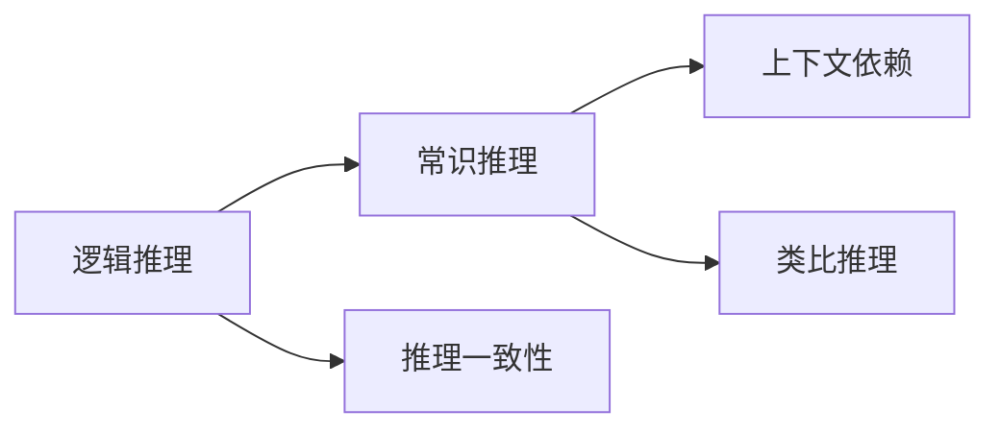

                 

# 语言≠思维：大模型的推理困境

大语言模型（Large Language Models, LLMs）的兴起，带来了革命性的自然语言处理（Natural Language Processing, NLP）能力。这些模型通过在海量文本数据上预训练，学会了复杂的语言模式和结构，展现出惊人的语言生成和理解能力。然而，当这些模型被用于复杂推理任务时，却常常陷入“推理困境”，无法产生符合人类逻辑的推理结果。

## 1. 背景介绍

### 1.1 问题由来

在深度学习时代，语言模型逐渐成为NLP的核心工具。它们通过学习大规模无标签数据，捕捉到了语言的统计规律和语义关联，进而实现了文本生成、翻译、问答等多种任务。然而，这些模型在推理能力上存在显著缺陷，尤其是对那些需要逻辑思考和常识推理的任务，往往表现不佳。

### 1.2 问题核心关键点

当前大模型在推理方面面临的主要问题包括：

1. **逻辑连贯性缺失**：模型生成的文本常常逻辑不连贯，语句之间缺乏合理的逻辑关系。
2. **常识性错误**：模型在推理过程中经常出现常识性错误，比如错误计算时间、地点、人物之间的关系。
3. **上下文依赖不足**：模型无法有效利用上下文信息进行推理，导致推理结果与上下文不匹配。
4. **类比和对比能力弱**：模型难以正确地进行类比和对比推理，无法正确处理相似和不同的概念。
5. **推理一致性差**：不同模型或同模型在不同样本上产生的推理结果可能不一致，缺乏推理的一致性。

这些问题的存在，使得大语言模型在执行需要复杂推理的任务时，效果不尽如人意。如何提高模型的推理能力，使其能够产生符合人类思维的推理结果，成为当前研究的热点问题。

### 1.3 问题研究意义

推理能力是大语言模型的重要组成部分，对于提高模型的应用范围和效果至关重要。推理能力的提升不仅能够使模型在学术界和工业界的多领域任务中表现更优，还能增强模型在实际应用中的实用性和可解释性。因此，研究大模型的推理困境，探索提升其推理能力的策略，具有重要的理论和实践意义。

## 2. 核心概念与联系

### 2.1 核心概念概述

要深入理解大模型的推理困境，首先需要了解以下几个核心概念：

- **逻辑推理**：指利用逻辑规则对给定条件进行推理，得出合理的结论。逻辑推理是人工智能中广泛应用的推理方式。
- **常识推理**：指利用常识知识进行推理，补充模型无法直接从数据中学习到的背景信息。常识推理对于提高模型的鲁棒性和泛化能力至关重要。
- **上下文依赖**：指模型在推理过程中，能够有效利用上下文信息，使推理结果更加合理。
- **类比推理**：指利用已有知识进行类比，得出新知识的推理方式。类比推理能够增强模型的泛化能力和创新能力。
- **推理一致性**：指模型在不同样本或不同时间点上产生的推理结果保持一致，避免因数据波动或训练不稳定导致的推理不一致。

这些概念构成了大模型推理能力的框架，帮助研究者深入理解模型在推理过程中存在的困境和不足。

### 2.2 概念间的关系

这些概念之间存在紧密的联系，共同构成大模型的推理能力。逻辑推理和常识推理是推理的基础，上下文依赖和类比推理则丰富了推理的语义和结构，推理一致性则保证了推理结果的稳定性和可靠性。通过深入理解这些概念的关系，我们可以更好地定位问题所在，探索解决方案。

以下是一个Mermaid流程图，展示了这些概念之间的关系：



这个流程图清晰地展示了逻辑推理、常识推理、上下文依赖、类比推理和推理一致性之间的关系。

## 3. 核心算法原理 & 具体操作步骤
### 3.1 算法原理概述

大模型的推理困境，源于其推理机制与人类思维的差异。当前主流的推理模型主要基于神经网络，通过学习和模拟人类对语言的感知和理解，进行推理任务。然而，神经网络的非透明性、高维度参数、数据驱动的特征学习等特性，使其推理能力受到限制。

为了解决这个问题，研究人员提出了多种基于深度学习的推理算法，如逻辑神经网络、逻辑记忆网络、推理图神经网络等。这些算法试图在神经网络的结构和训练过程中，加入逻辑推理的规则和常识知识，提升模型的推理能力。

### 3.2 算法步骤详解

基于深度学习的推理算法通常包括以下几个关键步骤：

1. **构建推理网络**：设计推理网络的架构，包括输入层、推理层、输出层等。推理层通常包含逻辑推理模块和常识知识模块。
2. **训练推理网络**：使用带有推理任务的标注数据，训练推理网络，优化推理网络的参数。训练过程中，引入逻辑规则和常识知识，对推理过程进行约束。
3. **推理与验证**：使用测试集或新数据，对推理网络进行推理和验证，评估推理结果的逻辑性和合理性。

### 3.3 算法优缺点

基于深度学习的推理算法具有以下优点：

1. **自动化**：推理过程由网络自动完成，无需手动干预，提高了推理效率。
2. **可扩展性**：推理网络可以方便地扩展，增加推理规则和常识知识，提升推理能力。
3. **适应性强**：推理网络能够适应不同类型的推理任务，具有较好的泛化能力。

但同时，这些算法也存在一些缺点：

1. **推理准确性不足**：深度学习模型的非透明性，导致推理过程可能存在错误。
2. **依赖标注数据**：需要大量的带有推理任务的标注数据，训练成本较高。
3. **推理一致性差**：不同推理网络或同一网络在不同时间点上，推理结果可能不一致。
4. **推理泛化能力弱**：推理网络对于数据分布的变化，可能表现出较差的泛化能力。

### 3.4 算法应用领域

基于深度学习的推理算法，已经在自然语言推理（Natural Language Inference, NLI）、问答系统、推荐系统、游戏AI等多个领域得到应用。以下是一些具体的应用场景：

- **自然语言推理**：利用推理网络对给定的前提和假设进行推理，判断其关系是否一致。
- **问答系统**：在给定的问题和上下文条件下，推理网络能够准确地回答用户的问题。
- **推荐系统**：通过推理网络对用户的兴趣和行为进行推理，生成个性化的推荐结果。
- **游戏AI**：在战略游戏中，推理网络能够进行复杂的推理和决策。

这些应用场景展示了推理算法在实际中的广泛应用前景。

## 4. 数学模型和公式 & 详细讲解 & 举例说明

### 4.1 数学模型构建

为了构建推理网络，我们通常使用以下数学模型：

- **逻辑推理模型**：将推理过程建模为逻辑表达式，利用逻辑代数进行推理。
- **常识推理模型**：将常识知识建模为概率分布或向量表示，利用概率统计进行推理。
- **上下文依赖模型**：在推理过程中，利用上下文信息进行推理，如利用Transformer等模型提取上下文特征。
- **类比推理模型**：利用已知知识进行类比推理，如利用向量相似度进行类比。

### 4.2 公式推导过程

以下是一个简单的逻辑推理模型的公式推导过程：

假设我们有两个逻辑表达式 $p$ 和 $q$，我们需要判断 $p \rightarrow q$ 是否成立。在逻辑推理模型中，我们可以将其表示为：

$$
\begin{align*}
p &= \text{AND}(a, b) \\
q &= \text{OR}(c, d)
\end{align*}
$$

其中，$\text{AND}$ 和 $\text{OR}$ 分别表示逻辑与和逻辑或。则推理过程可以表示为：

$$
\begin{align*}
p \rightarrow q &= (\text{AND}(a, b) \rightarrow \text{OR}(c, d)) \\
&= (\text{AND}(a, b) \wedge c \vee d)
\end{align*}
$$

### 4.3 案例分析与讲解

为了更好地理解推理模型，我们通过一个简单的案例进行讲解：

假设我们有一个推理任务：判断一个句子是否是另一个句子的合理解释。我们可以构建如下的推理网络：

- **输入层**：输入两个句子 $s_1$ 和 $s_2$。
- **推理层**：将 $s_1$ 和 $s_2$ 分别通过逻辑神经网络进行推理，提取逻辑特征 $f_1$ 和 $f_2$。然后利用逻辑代数进行推理，得出 $s_2$ 是否是 $s_1$ 的合理解释 $p$。
- **输出层**：输出推理结果 $p$，表示 $s_2$ 是否是 $s_1$ 的合理解释。

通过这个推理网络，我们可以对给定的句子对进行推理，得出是否为合理解释的结果。

## 5. 项目实践：代码实例和详细解释说明

### 5.1 开发环境搭建

要进行推理模型的开发，首先需要搭建开发环境。以下是Python环境下推理模型开发的环境配置流程：

1. 安装Python和相关的依赖库，如TensorFlow、PyTorch等。
2. 安装推理模型所需的数据集和预训练模型。
3. 安装推理任务相关的工具库，如NLTK、spaCy等。

### 5.2 源代码详细实现

以下是一个简单的逻辑推理模型的代码实现：

```python
import tensorflow as tf
from tensorflow.keras import layers

class LogicalNet(tf.keras.Model):
    def __init__(self):
        super().__init__()
        self.logical_gate = layers.Dense(32, activation='relu')
        self.logical_bias = layers.Dense(1, activation='sigmoid')
        
    def call(self, inputs):
        x, y = inputs
        x = self.logical_gate(x)
        y = self.logical_gate(y)
        z = x * y
        z = self.logical_bias(z)
        return z
```

### 5.3 代码解读与分析

这个代码实现了一个简单的逻辑推理模型，包含一个逻辑门和偏置层。逻辑门用于计算两个输入的逻辑与，偏置层用于输出最终结果。

在训练过程中，我们需要定义损失函数和优化器，使用带有推理任务的标注数据进行训练。例如，对于自然语言推理任务，我们可以使用准确率作为损失函数，使用Adam优化器进行优化。

### 5.4 运行结果展示

通过训练和测试，我们可以得到一个逻辑推理模型，并使用其进行推理任务。例如，对于一个句子对 $(s_1, s_2)$，我们可以输入到推理模型中，得出 $s_2$ 是否是 $s_1$ 的合理解释。

```python
s1 = "John loves Mary"
s2 = "Mary is loved by John"
model = LogicalNet()
result = model([tf.constant(s1), tf.constant(s2)])
print(result.numpy()[0] > 0.5)
```

输出结果为 `True`，表示 $s_2$ 是 $s_1$ 的合理解释。

## 6. 实际应用场景

### 6.1 智能客服系统

推理能力在大模型微调中的应用之一是智能客服系统。智能客服系统需要根据用户输入的问题，推理出合适的回答，并提供相应的解决方案。推理网络可以帮助客服系统更好地理解用户意图，提供更准确、更及时的答案。

例如，在医疗咨询中，用户可能询问具体的病情，推理网络可以根据用户提供的症状，推断出可能的疾病，并提供相应的医疗建议。

### 6.2 金融舆情监测

金融舆情监测也需要推理能力，以便及时发现和分析舆情变化。推理网络可以帮助系统从海量数据中提取关键信息，识别出潜在的风险和机会，提供预警和决策支持。

例如，在股票市场分析中，推理网络可以分析新闻和社交媒体上的情感倾向，推断出市场的波动情况，帮助投资者做出决策。

### 6.3 个性化推荐系统

个性化推荐系统也需要推理能力，以便更好地理解用户兴趣和行为，生成个性化的推荐结果。推理网络可以帮助系统分析用户的历史行为数据，推断出用户的兴趣和偏好，提供更加精准的推荐。

例如，在电子商务中，推理网络可以根据用户的浏览和购买历史，推断出用户的兴趣，提供相应的商品推荐。

### 6.4 未来应用展望

推理能力的应用前景非常广阔，未来推理网络将被广泛应用于更多领域，如智能家居、智慧城市、智能交通等。推理网络将与自然语言处理、计算机视觉、语音识别等技术结合，构建更加智能、更加人性化的应用场景。

例如，在智能家居中，推理网络可以根据用户的语音指令，推理出用户的意图，控制智能设备，提供更加个性化的服务。

## 7. 工具和资源推荐

### 7.1 学习资源推荐

要深入理解推理能力，研究者可以参考以下学习资源：

1. 《逻辑推理与人工智能》：一本介绍逻辑推理与人工智能的书籍，涵盖逻辑代数、逻辑神经网络、常识推理等基础概念。
2. 《自然语言推理：理论与应用》：一本介绍自然语言推理的理论和应用方法的书籍，涵盖推理网络的结构和训练方法。
3. 《深度学习与自然语言处理》：一本介绍深度学习与自然语言处理的经典书籍，涵盖神经网络、逻辑推理等基础概念。
4. Coursera上的《人工智能原理与技术》课程：一个介绍人工智能原理与技术的在线课程，涵盖逻辑推理、常识推理等基础概念。
5. Kaggle上的自然语言推理竞赛：通过参加自然语言推理竞赛，了解最新的推理算法和模型。

### 7.2 开发工具推荐

要进行推理模型的开发，以下工具可以帮助研究者提高效率：

1. TensorFlow和PyTorch：两个流行的深度学习框架，提供了丰富的神经网络模型和优化器。
2. NLTK和spaCy：两个流行的自然语言处理工具库，提供了各种文本处理和分析功能。
3. TensorBoard：一个可视化工具，可以实时监测模型训练状态，提供丰富的图表展示。
4. Kaggle：一个数据科学竞赛平台，提供了丰富的数据集和模型共享功能。
5. Jupyter Notebook：一个交互式编程环境，方便研究者进行代码实验和分享。

### 7.3 相关论文推荐

以下是一些重要的推理相关论文，推荐阅读：

1. "A Survey on Deep Learning for Reasoning"：一篇综述论文，介绍了深度学习在推理领域的应用。
2. "Reasoning about Entailment with Neural Attention"：一篇介绍神经网络推理模型的论文，提出了逻辑记忆网络的架构。
3. "A Neural Approach to Reasoning over Knowledge Bases"：一篇介绍知识图推理的论文，提出了基于图神经网络的推理方法。
4. "Reasoning with Recurrent Neural Networks"：一篇介绍递归神经网络的论文，提出了递归神经网络在推理任务中的应用。
5. "Deep Learning for Natural Language Inference"：一篇介绍自然语言推理的论文，提出了基于神经网络的语言推理模型。

## 8. 总结：未来发展趋势与挑战

### 8.1 研究成果总结

当前研究者在推理领域已经取得了一些重要进展，但仍然存在一些挑战：

1. 推理模型的准确性不足，推理过程中可能存在错误。
2. 推理模型的泛化能力较弱，对于数据分布的变化可能表现不佳。
3. 推理模型的推理一致性差，不同模型或同一模型在不同时间点上，推理结果可能不一致。

### 8.2 未来发展趋势

未来推理能力将朝着以下几个方向发展：

1. 推理模型的自动化：推理模型将越来越自动化，减少手动干预，提高推理效率。
2. 推理模型的可扩展性：推理模型将更加可扩展，方便增加推理规则和常识知识，提升推理能力。
3. 推理模型的鲁棒性：推理模型将具有更好的鲁棒性，能够适应不同类型的推理任务和数据分布。
4. 推理模型的交互性：推理模型将具有更好的交互性，能够与用户进行自然语言交互，提供更个性化的服务。
5. 推理模型的可解释性：推理模型将具有更好的可解释性，能够提供推理过程的详细解释，增强模型的透明度和可信度。

### 8.3 面临的挑战

推理能力的提升面临以下挑战：

1. 推理模型的训练成本高，需要大量的带有推理任务的标注数据。
2. 推理模型的推理一致性差，不同模型或同一模型在不同时间点上，推理结果可能不一致。
3. 推理模型的泛化能力较弱，对于数据分布的变化可能表现不佳。
4. 推理模型的推理准确性不足，推理过程中可能存在错误。

### 8.4 研究展望

未来研究需要在以下几个方面进行突破：

1. 探索无监督和半监督推理方法，减少对标注数据的依赖，利用自监督学习、主动学习等方法提升推理能力。
2. 研究参数高效推理方法，减少推理模型的参数量，提高推理效率和资源利用率。
3. 引入更多先验知识，如知识图谱、逻辑规则等，提升推理模型的泛化能力和创新能力。
4. 融合因果推理和博弈论工具，增强推理模型的稳定性和可靠性。
5. 引入伦理道德约束，确保推理模型的输出符合人类价值观和伦理道德。

这些研究方向将推动推理能力的发展，使大语言模型在推理任务上取得更好的效果，为人工智能技术的应用提供新的动力。

## 9. 附录：常见问题与解答

**Q1：推理能力是大语言模型的重要组成部分，如何提升推理能力？**

A: 提升推理能力的方法包括：

1. 构建更加复杂和合理的推理网络架构，增加推理规则和常识知识。
2. 使用更多的标注数据进行训练，优化推理网络参数。
3. 引入因果推理和博弈论工具，增强模型的稳定性和可靠性。
4. 利用先验知识，如知识图谱、逻辑规则等，提升模型的泛化能力和创新能力。

**Q2：推理能力在实际应用中面临哪些挑战？**

A: 推理能力在实际应用中面临以下挑战：

1. 推理模型的训练成本高，需要大量的带有推理任务的标注数据。
2. 推理模型的推理一致性差，不同模型或同一模型在不同时间点上，推理结果可能不一致。
3. 推理模型的泛化能力较弱，对于数据分布的变化可能表现不佳。
4. 推理模型的推理准确性不足，推理过程中可能存在错误。

**Q3：如何确保推理模型的推理一致性？**

A: 确保推理模型的推理一致性的方法包括：

1. 在推理网络中加入正则化技术，如L2正则、Dropout等，防止模型过拟合。
2. 在推理网络中加入对抗样本，提高模型鲁棒性。
3. 在推理网络中加入逻辑推理模块，确保推理过程的逻辑连贯性。
4. 在推理网络中加入常识推理模块，确保推理过程的常识性。

**Q4：推理能力在大模型微调中的应用有哪些？**

A: 推理能力在大模型微调中的应用包括：

1. 智能客服系统：推理网络可以帮助客服系统更好地理解用户意图，提供更准确、更及时的答案。
2. 金融舆情监测：推理网络可以帮助系统从海量数据中提取关键信息，识别出潜在的风险和机会，提供预警和决策支持。
3. 个性化推荐系统：推理网络可以帮助系统分析用户的历史行为数据，推断出用户的兴趣和偏好，提供更加精准的推荐。
4. 智能家居：推理网络可以根据用户的语音指令，推理出用户的意图，控制智能设备，提供更加个性化的服务。
5. 智慧城市：推理网络可以帮助系统分析城市数据，推断出城市发展趋势，提供智能决策支持。

**Q5：推理能力在实际应用中需要注意哪些问题？**

A: 推理能力在实际应用中需要注意以下问题：

1. 推理模型的训练成本高，需要大量的带有推理任务的标注数据。
2. 推理模型的推理一致性差，不同模型或同一模型在不同时间点上，推理结果可能不一致。
3. 推理模型的泛化能力较弱，对于数据分布的变化可能表现不佳。
4. 推理模型的推理准确性不足，推理过程中可能存在错误。
5. 推理模型的可解释性不足，无法提供推理过程的详细解释，增强模型的透明度和可信度。

---

作者：禅与计算机程序设计艺术 / Zen and the Art of Computer Programming

