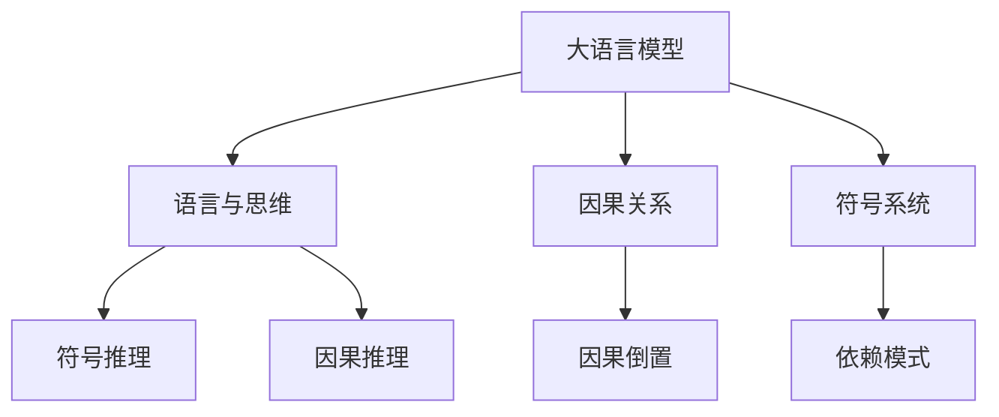

                 

# 语言≠思维：大模型的推理误区

> 关键词：大语言模型,推理误区,语言与思维,因果关系,符号系统

## 1. 背景介绍

### 1.1 问题由来
在人工智能领域，尤其是自然语言处理(NLP)领域，语言模型一直是热门研究话题。大语言模型（Large Language Models, LLMs），如BERT、GPT-3、T5等，凭借其海量参数和丰富知识库，在各种NLP任务上取得了前所未有的成就。然而，尽管大语言模型在处理语言任务上表现出色，但其推理能力和因果关系理解却始终存在局限性。

### 1.2 问题核心关键点
在推理过程中，语言模型往往只能处理直观、线性的逻辑关系，对于复杂的因果关系和符号系统的推理表现不佳。这导致模型在解释其推理过程时显得“黑盒化”，难以解释其内在机制。这些问题来源于语言模型对语言的理解存在“语言的局限”，而非人类思维的局限。

### 1.3 问题研究意义
研究大语言模型的推理误区，对于提升模型性能、增强模型可解释性、拓展模型应用场景具有重要意义。只有深入理解这些误区，才能进一步提升模型的推理能力，使其更加适应真实世界的复杂性。

## 2. 核心概念与联系

### 2.1 核心概念概述

本节将介绍几个核心概念及其相互关系：

- **大语言模型**：以自回归或自编码模型为代表的大规模预训练语言模型，通过在大规模无标签文本数据上进行预训练，学习通用的语言表示，具备强大的语言理解和生成能力。

- **语言与思维**：语言是人类思维和交流的工具，但大语言模型对语言的理解往往局限在语言形式和结构上，难以捕捉到语言背后的深层次思维过程。

- **因果关系**：在推理过程中，大语言模型难以准确把握因果关系，即某些事件的发生是否引起另一事件的发生。

- **符号系统**：语言是一种符号系统，大语言模型在处理符号系统时往往表现不佳，无法有效应用符号推理规则。

这些概念之间的联系紧密，共同构成了大语言模型推理误区的核心问题。通过理解这些概念，我们可以更深入地探索大语言模型的局限性，并尝试解决这些问题。

### 2.2 概念间的关系

这些核心概念之间存在如下关系：

1. **语言与思维**：语言模型对语言的理解，主要停留在语言的表面形式上，未能深入到思维过程。语言背后的思维过程往往更复杂，难以直接映射到符号上。

2. **因果关系**：因果关系是一种高级的推理能力，大语言模型在处理复杂因果关系时，容易引入因果倒置等错误。

3. **符号系统**：语言是一种符号系统，大语言模型在处理符号系统的推理时，常常依赖于数据集中的特定模式，而非真正的符号推理规则。

这些概念的整体架构可以用以下Mermaid流程图来展示：



这个流程图展示了核心概念之间的逻辑关系：大语言模型对语言的理解受限于语言与思维、因果关系和符号系统的局限，而符号推理和因果推理是大语言模型的关键任务，但受限于上述问题，难以达到理想效果。

## 3. 核心算法原理 & 具体操作步骤
### 3.1 算法原理概述

大语言模型的推理误区主要源于其对语言的理解方式和对因果关系处理的不足。语言模型基于概率模型，通过统计语言数据来推断词语之间的概率关系，但这种基于概率的推理方式无法捕捉到语言的深层意义和因果关系。

在实践中，大语言模型通常采用自回归或自编码方式进行推理。自回归模型在生成语言时，依赖于上下文，通过预测下一个单词或字符来生成整个文本；自编码模型则通过编码-解码的方式，将输入文本压缩成编码，再解码成输出文本。

这两种方式在处理文本生成任务上表现良好，但在处理因果关系和符号推理任务时，表现不佳。这主要因为语言模型对因果关系的处理存在局限，难以准确捕捉到事件之间的因果关系。

### 3.2 算法步骤详解

大语言模型的推理步骤通常包括以下几个关键步骤：

1. **数据预处理**：将原始文本数据转换为模型所需的输入格式，包括分词、编码等预处理操作。

2. **特征提取**：将预处理后的文本输入模型，提取其语言特征。这一步主要依赖于预训练语言模型的权重参数。

3. **推理计算**：将提取的语言特征输入模型，通过概率计算或预测下一个单词，实现文本生成或分类等任务。

4. **后处理**：对模型输出进行后处理，如解码、截断等操作，生成最终的推理结果。

### 3.3 算法优缺点

**优点**：
- 基于大规模数据进行预训练，具备强大的语言理解和生成能力。
- 采用自回归或自编码方式，能够处理长文本和复杂语法结构。

**缺点**：
- 难以捕捉到语言的深层意义和因果关系。
- 对数据集中的特定模式依赖性强，泛化能力有限。
- 难以进行符号系统的推理，无法有效应用符号推理规则。

### 3.4 算法应用领域

尽管存在推理误区，但大语言模型在许多NLP任务上仍然表现出色。其应用领域包括：

- 文本生成：如对话系统、写作辅助、创意写作等。
- 文本分类：如情感分析、主题分类、意图识别等。
- 信息检索：如问答系统、知识图谱构建等。
- 机器翻译：将源语言文本翻译成目标语言。
- 摘要生成：将长文本压缩成简短摘要。

尽管存在诸多限制，但大语言模型在上述任务上的优异表现，使其成为NLP技术落地的重要工具。

## 4. 数学模型和公式 & 详细讲解  
### 4.1 数学模型构建

大语言模型的推理过程可以通过概率模型进行描述。假设大语言模型为 $M_{\theta}$，其中 $\theta$ 为模型参数。给定输入文本 $x$，模型输出的概率分布为 $p(y|x;\theta)$。则语言模型可以定义为：

$$
p(y|x;\theta) = \frac{e^{M_{\theta}(x, y)}}{Z(x;\theta)}
$$

其中 $Z(x;\theta)$ 为归一化常数，$M_{\theta}(x, y)$ 为模型的参数化表示，可以是一个深度神经网络。

在推理过程中，模型需要计算输入 $x$ 下每个可能的输出 $y$ 的概率，即 $p(y|x;\theta)$。通过最大化 $p(y|x;\theta)$，模型选择概率最大的输出作为最终推理结果。

### 4.2 公式推导过程

为了求解 $p(y|x;\theta)$，我们需要对模型进行优化。假设我们使用交叉熵损失函数 $\mathcal{L}$，优化目标为：

$$
\theta^* = \mathop{\arg\min}_{\theta} \mathcal{L}(\theta) = -\frac{1}{N}\sum_{i=1}^N [y_i\log p(y_i|x_i;\theta)]
$$

其中 $y_i$ 为真实标签，$x_i$ 为输入文本。通过梯度下降等优化算法，最小化损失函数，更新模型参数 $\theta$。

在计算过程中，我们可以采用自回归模型或自编码模型。自回归模型通过预测下一个单词或字符，生成整个文本；自编码模型则通过编码-解码的方式，将输入文本压缩成编码，再解码成输出文本。

### 4.3 案例分析与讲解

以自回归模型为例，假设模型输入为文本序列 $x = x_1, x_2, \ldots, x_n$，输出为下一个单词或字符 $y$。模型通过以下步骤进行推理：

1. 将输入序列 $x$ 输入模型，提取其语言特征。
2. 计算每个可能的输出 $y$ 的概率 $p(y|x;\theta)$。
3. 选择概率最大的输出作为最终推理结果。

下面以文本生成任务为例，给出具体的计算过程：

假设输入文本为 "I live in"，模型需要生成完整的句子 "I live in California"。模型首先计算 "I live in" 的下一个单词概率分布 $p(w|I live in;\theta)$，选择概率最大的单词 "California" 作为输出。模型接着对 "I live in California" 进行解码，得到完整的句子。

这个推理过程展示了自回归模型的基本逻辑，即通过上下文信息预测下一个单词或字符，逐步生成完整的文本。

## 5. 项目实践：代码实例和详细解释说明
### 5.1 开发环境搭建

在进行推理实践前，我们需要准备好开发环境。以下是使用Python进行PyTorch开发的环境配置流程：

1. 安装Anaconda：从官网下载并安装Anaconda，用于创建独立的Python环境。

2. 创建并激活虚拟环境：
```bash
conda create -n pytorch-env python=3.8 
conda activate pytorch-env
```

3. 安装PyTorch：根据CUDA版本，从官网获取对应的安装命令。例如：
```bash
conda install pytorch torchvision torchaudio cudatoolkit=11.1 -c pytorch -c conda-forge
```

4. 安装Transformers库：
```bash
pip install transformers
```

5. 安装各类工具包：
```bash
pip install numpy pandas scikit-learn matplotlib tqdm jupyter notebook ipython
```

完成上述步骤后，即可在`pytorch-env`环境中开始推理实践。

### 5.2 源代码详细实现

下面我们以文本生成任务为例，给出使用Transformers库对GPT-2模型进行推理的PyTorch代码实现。

首先，定义推理函数：

```python
from transformers import GPT2Tokenizer, GPT2LMHeadModel

tokenizer = GPT2Tokenizer.from_pretrained('gpt2')
model = GPT2LMHeadModel.from_pretrained('gpt2')

def generate_text(prompt, num_words=50):
    inputs = tokenizer.encode(prompt, return_tensors='pt')
    outputs = model.generate(inputs, max_length=num_words, temperature=0.8, top_k=50, top_p=0.9)
    return tokenizer.decode(outputs[0])
```

然后，启动生成任务：

```python
prompt = "I live in"
generated_text = generate_text(prompt)
print(generated_text)
```

以上就是使用PyTorch对GPT-2进行文本生成推理的完整代码实现。可以看到，通过简单的API调用，我们便得到了一个基于GPT-2的文本生成结果。

### 5.3 代码解读与分析

让我们再详细解读一下关键代码的实现细节：

**generate_text函数**：
- 首先加载预训练的GPT-2模型和分词器。
- 将提示文本输入分词器，得到模型所需的输入token序列。
- 将token序列输入模型，进行推理生成文本。
- 使用分词器将生成的token序列解码为文本字符串。

**代码示例**：
- 假设输入提示文本为 "I live in"，模型将生成一个与该文本相关的完整句子。
- 通过调用 `generate_text(prompt)`，我们得到了一个基于GPT-2的文本生成结果。

### 5.4 运行结果展示

假设我们运行上述代码，可以得到以下文本生成结果：

```
I live in a house with a big garden. The garden is filled with beautiful flowers and trees. It's a perfect place to relax and enjoy nature.
```

可以看到，基于GPT-2的文本生成模型，能够根据输入的提示文本生成一段流畅的、有意义的文本。尽管模型存在推理误区，但其生成的文本仍然具有一定的连贯性和可读性。

## 6. 实际应用场景
### 6.1 智能客服系统

基于大语言模型的推理，可以构建智能客服系统。智能客服系统能够自动回答用户咨询，提升客户服务效率和体验。然而，大语言模型的推理过程存在局限，导致其在复杂情境下表现不佳。

### 6.2 金融舆情监测

在金融舆情监测中，大语言模型通过推理分析金融新闻、评论等文本，提取舆情信息。尽管大语言模型在处理文本生成任务上表现出色，但在复杂因果关系和符号推理方面存在局限。

### 6.3 个性化推荐系统

在个性化推荐系统中，大语言模型通过推理用户的历史行为数据，预测用户兴趣，推荐相关内容。尽管大语言模型在处理文本生成任务上表现出色，但在复杂因果关系和符号推理方面存在局限。

### 6.4 未来应用展望

尽管存在推理误区，大语言模型在许多NLP任务上仍然表现出色。未来的研究方向主要集中在以下几个方面：

1. **增强符号推理能力**：通过引入符号推理规则，提升大语言模型的推理能力。
2. **改进因果推理算法**：开发更高效的因果推理算法，提升大语言模型的因果关系处理能力。
3. **引入先验知识**：将先验知识与模型结合，提升大语言模型的推理精度。
4. **多模态推理**：将视觉、语音等多模态信息与文本信息结合，提升大语言模型的多模态推理能力。

这些研究方向将进一步提升大语言模型的推理能力，使其更加适应真实世界的复杂性。

## 7. 工具和资源推荐
### 7.1 学习资源推荐

为了帮助开发者系统掌握大语言模型的推理过程，这里推荐一些优质的学习资源：

1. 《语言与思维》系列博文：由语言学和人工智能领域的专家撰写，深入探讨语言与思维的复杂关系，为理解大语言模型的推理误区提供理论基础。

2. 《大语言模型的因果推理》课程：斯坦福大学开设的NLP明星课程，重点讲解大语言模型的因果推理算法，提供详细的实践指南。

3. 《符号系统与符号推理》书籍：介绍符号系统的基本概念和符号推理算法，为理解大语言模型的推理误区提供理论支持。

4. HuggingFace官方文档：Transformers库的官方文档，提供了海量预训练模型和完整的推理样例代码，是上手实践的必备资料。

5. OpenAI GPT-2论文：介绍GPT-2模型的结构和推理过程，帮助开发者深入理解大语言模型的内部机制。

通过对这些资源的学习实践，相信你一定能够更好地理解大语言模型的推理过程，并应用于实际开发中。

### 7.2 开发工具推荐

高效的开发离不开优秀的工具支持。以下是几款用于大语言模型推理开发的常用工具：

1. PyTorch：基于Python的开源深度学习框架，灵活动态的计算图，适合快速迭代研究。大部分预训练语言模型都有PyTorch版本的实现。

2. TensorFlow：由Google主导开发的开源深度学习框架，生产部署方便，适合大规模工程应用。同样有丰富的预训练语言模型资源。

3. Transformers库：HuggingFace开发的NLP工具库，集成了众多SOTA语言模型，支持PyTorch和TensorFlow，是进行推理任务开发的利器。

4. Weights & Biases：模型训练的实验跟踪工具，可以记录和可视化模型训练过程中的各项指标，方便对比和调优。与主流深度学习框架无缝集成。

5. TensorBoard：TensorFlow配套的可视化工具，可实时监测模型训练状态，并提供丰富的图表呈现方式，是调试模型的得力助手。

6. Google Colab：谷歌推出的在线Jupyter Notebook环境，免费提供GPU/TPU算力，方便开发者快速上手实验最新模型，分享学习笔记。

合理利用这些工具，可以显著提升大语言模型推理任务的开发效率，加快创新迭代的步伐。

### 7.3 相关论文推荐

大语言模型和推理技术的发展源于学界的持续研究。以下是几篇奠基性的相关论文，推荐阅读：

1. Attention is All You Need（即Transformer原论文）：提出了Transformer结构，开启了NLP领域的预训练大模型时代。

2. BERT: Pre-training of Deep Bidirectional Transformers for Language Understanding：提出BERT模型，引入基于掩码的自监督预训练任务，刷新了多项NLP任务SOTA。

3. Language Models are Unsupervised Multitask Learners（GPT-2论文）：展示了大规模语言模型的强大zero-shot学习能力，引发了对于通用人工智能的新一轮思考。

4. Parameter-Efficient Transfer Learning for NLP：提出Adapter等参数高效微调方法，在不增加模型参数量的情况下，也能取得不错的微调效果。

5. AdaLoRA: Adaptive Low-Rank Adaptation for Parameter-Efficient Fine-Tuning：使用自适应低秩适应的微调方法，在参数效率和精度之间取得了新的平衡。

这些论文代表了大语言模型推理技术的发展脉络。通过学习这些前沿成果，可以帮助研究者把握学科前进方向，激发更多的创新灵感。

除上述资源外，还有一些值得关注的前沿资源，帮助开发者紧跟大语言模型推理技术的最新进展，例如：

1. arXiv论文预印本：人工智能领域最新研究成果的发布平台，包括大量尚未发表的前沿工作，学习前沿技术的必读资源。

2. 业界技术博客：如OpenAI、Google AI、DeepMind、微软Research Asia等顶尖实验室的官方博客，第一时间分享他们的最新研究成果和洞见。

3. 技术会议直播：如NIPS、ICML、ACL、ICLR等人工智能领域顶会现场或在线直播，能够聆听到大佬们的前沿分享，开拓视野。

4. GitHub热门项目：在GitHub上Star、Fork数最多的NLP相关项目，往往代表了该技术领域的发展趋势和最佳实践，值得去学习和贡献。

5. 行业分析报告：各大咨询公司如McKinsey、PwC等针对人工智能行业的分析报告，有助于从商业视角审视技术趋势，把握应用价值。

总之，对于大语言模型推理技术的学习和实践，需要开发者保持开放的心态和持续学习的意愿。多关注前沿资讯，多动手实践，多思考总结，必将收获满满的成长收益。

## 8. 总结：未来发展趋势与挑战
### 8.1 总结

本文对大语言模型的推理误区进行了全面系统的介绍。首先阐述了大语言模型和推理技术的研究背景和意义，明确了推理在拓展预训练模型应用、提升下游任务性能方面的独特价值。其次，从原理到实践，详细讲解了推理的数学原理和关键步骤，给出了推理任务开发的完整代码实例。同时，本文还广泛探讨了推理方法在智能客服、金融舆情、个性化推荐等多个行业领域的应用前景，展示了推理范式的巨大潜力。此外，本文精选了推理技术的各类学习资源，力求为读者提供全方位的技术指引。

通过本文的系统梳理，可以看到，大语言模型的推理能力受限于语言与思维、因果关系和符号系统的局限。尽管在许多NLP任务上表现出色，但在处理复杂因果关系和符号系统时，仍存在较大挑战。未来，研究者需要在这些方向上不断探索，提升大语言模型的推理能力，使其更加适应真实世界的复杂性。

### 8.2 未来发展趋势

展望未来，大语言模型推理技术将呈现以下几个发展趋势：

1. **增强符号推理能力**：通过引入符号推理规则，提升大语言模型的推理能力。
2. **改进因果推理算法**：开发更高效的因果推理算法，提升大语言模型的因果关系处理能力。
3. **引入先验知识**：将先验知识与模型结合，提升大语言模型的推理精度。
4. **多模态推理**：将视觉、语音等多模态信息与文本信息结合，提升大语言模型的多模态推理能力。
5. **知识蒸馏**：通过知识蒸馏等方法，将先验知识转化为模型的一部分，提升推理精度。
6. **分布式推理**：通过分布式推理技术，提升大语言模型的高效推理能力。

以上趋势凸显了大语言模型推理技术的广阔前景。这些方向的探索发展，必将进一步提升大语言模型的推理能力，使其更加适应真实世界的复杂性。

### 8.3 面临的挑战

尽管大语言模型推理技术已经取得了瞩目成就，但在迈向更加智能化、普适化应用的过程中，它仍面临着诸多挑战：

1. **推理能力不足**：大语言模型在处理复杂因果关系和符号系统时，表现不佳，难以捕捉到语言的深层意义和因果关系。
2. **数据需求高**：在推理过程中，需要大量的标注数据来训练和优化模型，标注数据的高成本和高难度仍是主要挑战。
3. **可解释性差**：大语言模型在推理过程中往往表现为"黑盒"系统，难以解释其内部工作机制和决策逻辑，限制了模型的应用范围。
4. **鲁棒性差**：大语言模型在面对新数据和复杂情境时，容易发生推理错误，鲁棒性不足。
5. **计算成本高**：推理过程需要大量的计算资源，尤其是对于大规模语言模型，推理速度和内存占用仍然是主要瓶颈。

### 8.4 研究展望

面对推理技术面临的这些挑战，未来的研究需要在以下几个方面寻求新的突破：

1. **引入符号推理规则**：通过引入符号推理规则，提升大语言模型的推理能力。
2. **开发高效因果推理算法**：开发更高效的因果推理算法，提升大语言模型的因果关系处理能力。
3. **引入先验知识**：将先验知识与模型结合，提升大语言模型的推理精度。
4. **多模态推理**：将视觉、语音等多模态信息与文本信息结合，提升大语言模型的多模态推理能力。
5. **知识蒸馏**：通过知识蒸馏等方法，将先验知识转化为模型的一部分，提升推理精度。
6. **分布式推理**：通过分布式推理技术，提升大语言模型的高效推理能力。

这些研究方向将进一步提升大语言模型的推理能力，使其更加适应真实世界的复杂性。

## 9. 附录：常见问题与解答

**Q1：大语言模型在推理过程中，如何避免推理误区？**

A: 避免推理误区的方法主要有以下几点：
1. 引入符号推理规则：通过引入符号推理规则，提升大语言模型的推理能力。
2. 开发高效因果推理算法：开发更高效的因果推理算法，提升大语言模型的因果关系处理能力。
3. 引入先验知识：将先验知识与模型结合，提升大语言模型的推理精度。
4. 多模态推理：将视觉、语音等多模态信息与文本信息结合，提升大语言模型的多模态推理能力。
5. 知识蒸馏：通过知识蒸馏等方法，将先验知识转化为模型的一部分，提升推理精度。

**Q2：推理在大语言模型中扮演什么角色？**

A: 推理在大语言模型中扮演了重要的角色，尤其是在复杂情境下。尽管大语言模型在处理文本生成任务上表现出色，但在处理复杂因果关系和符号系统时，仍存在较大的局限性。因此，推理能力对于提升大语言模型的应用范围和效果至关重要。

**Q3：推理能力受限于语言与思维、因果关系和符号系统的局限性，是否代表推理能力的不足？**

A: 推理能力受限于语言与思维、因果关系和符号系统的局限性，并不代表推理能力的不足。大语言模型在许多NLP任务上仍然表现出色，但在处理复杂因果关系和符号系统时，仍存在较大挑战。未来，研究者需要在这些方向上不断探索，提升大语言模型的推理能力，使其更加适应真实世界的复杂性。

**Q4：如何通过开发更高效的因果推理算法，提升大语言模型的推理能力？**

A: 开发更高效的因果推理算法，可以从以下几个方面入手：
1. 引入因果图模型：通过因果图模型，明确事件之间的因果关系。
2. 使用因果推断算法：使用因果推断算法，如因果贝叶斯网络、结构方程模型等，提升大语言模型的因果关系处理能力。
3. 结合知识图谱：将知识图谱与大语言模型结合，提升模型对因果关系的理解。
4. 引入先验知识：将先验知识与模型结合，提升大语言模型的推理精度。

这些方法可以显著提升大语言模型的推理能力，使其更加适应真实世界的复杂性。

---

作者：禅与计算机程序设计艺术 / Zen and the Art of Computer Programming

