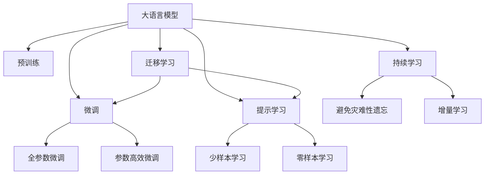

                 

# 语言与思维：大模型的误区

> 关键词：大模型,预训练,微调,偏见,数据稀缺性,计算效率

## 1. 背景介绍

### 1.1 问题由来
近年来，人工智能（AI）领域的迅猛发展带来了诸多突破性成果，尤其是在自然语言处理（NLP）领域，大语言模型（Large Language Models, LLMs）如BERT、GPT等模型以其卓越的性能备受瞩目。这些模型经过海量无标签文本数据的预训练，学习到了丰富的语言知识和常识，能够在各种下游任务上取得优异的成绩。然而，在大模型应用过程中，也逐渐暴露出一些误区和局限性，值得我们深入思考和探讨。

### 1.2 问题核心关键点
大语言模型在提供便利的同时，也伴随着一些误区，这些问题主要集中在数据稀缺性、计算效率、模型偏见和知识表示上。通过理解和克服这些误区，可以更好地发挥大模型的潜力，推动NLP技术的进一步发展。

1. **数据稀缺性问题**：尽管大模型通过预训练获得了广泛的语言知识，但面对特定领域的数据稀缺性，模型可能无法完全适应。
2. **计算效率问题**：大模型由于参数量庞大，推理过程复杂，导致在实际应用中计算效率低下。
3. **模型偏见问题**：大模型可能会继承训练数据的偏见，导致输出存在歧视性或有害性。
4. **知识表示问题**：大模型在理解复杂逻辑和因果关系上存在局限，难以准确表示人类思维中的知识。

### 1.3 问题研究意义
研究大语言模型的误区，对于优化模型性能、提升应用效果、避免模型偏见以及推动AI技术的伦理和社会责任等方面具有重要意义：

1. **优化模型性能**：通过理解模型的局限性，可以采取针对性的策略提升模型效果，避免过拟合和欠拟合。
2. **提升应用效果**：帮助开发者更好地适配特定任务，提高模型在实际应用中的表现。
3. **避免模型偏见**：识别和纠正模型中的偏见，确保模型输出符合伦理和社会价值观。
4. **推动技术伦理**：强调模型在社会责任方面的重要性，促使AI技术的发展更加符合人类的利益。

## 2. 核心概念与联系

### 2.1 核心概念概述

为了更好地理解大模型的误区，本节将介绍几个密切相关的核心概念：

- **大语言模型（LLMs）**：以BERT、GPT等为代表的预训练语言模型，通过在大规模无标签文本上训练，学习通用的语言表示。
- **预训练（Pre-training）**：在无标签文本数据上进行的自监督学习，使模型学习到通用的语言知识和规则。
- **微调（Fine-tuning）**：在有标签数据上进行监督学习，进一步优化模型在特定任务上的表现。
- **模型偏见（Model Bias）**：模型在训练过程中学习到训练数据的特性和偏见，导致输出存在歧视性或有害性。
- **数据稀缺性（Data Scarcity）**：特定领域数据不足，导致模型难以完全适应新任务。
- **计算效率（Computational Efficiency）**：模型推理和训练过程中的计算资源消耗，影响模型在实际应用中的效率。
- **知识表示（Knowledge Representation）**：模型在表示复杂逻辑和因果关系上的能力，影响其对人类思维的模拟和理解。

这些核心概念之间的关系可以通过以下Mermaid流程图来展示：



这个流程图展示了大语言模型的核心概念及其之间的关系：

1. 大语言模型通过预训练获得基础能力。
2. 微调是对预训练模型进行任务特定的优化，可以分为全参数微调和参数高效微调（PEFT）。
3. 提示学习是一种不更新模型参数的方法，可以实现少样本学习和零样本学习。
4. 迁移学习是连接预训练模型与下游任务的桥梁，可以通过微调或提示学习来实现。
5. 持续学习旨在使模型能够不断学习新知识，同时避免遗忘旧知识。

## 3. 核心算法原理 & 具体操作步骤

### 3.1 算法原理概述

大语言模型的误区主要源于其在数据稀缺性、计算效率、模型偏见和知识表示方面的不足。本节将详细探讨这些误区，并提出相应的解决方法。

### 3.2 算法步骤详解

**步骤一：数据稀缺性问题**
- **数据增强**：通过回译、同义词替换等方式丰富训练数据，减少数据稀缺性对模型的影响。
- **迁移学习**：利用预训练模型的通用能力，通过迁移学习优化特定任务，减少新任务上的数据需求。
- **自监督学习**：在无标签数据上进行自监督学习，增强模型对数据的泛化能力。

**步骤二：计算效率问题**
- **模型裁剪**：去除不必要的层和参数，减小模型尺寸，加快推理速度。
- **量化加速**：将浮点模型转为定点模型，压缩存储空间，提高计算效率。
- **分布式训练**：利用分布式计算资源，加速模型训练过程。

**步骤三：模型偏见问题**
- **数据过滤**：在数据预处理阶段过滤掉有偏见的数据。
- **公平性约束**：在训练目标中引入公平性指标，确保模型输出公平。
- **对抗训练**：在训练过程中加入对抗样本，提高模型的鲁棒性和公正性。

**步骤四：知识表示问题**
- **因果推理**：引入因果推理技术，增强模型对因果关系的理解。
- **逻辑表示**：使用符号化的逻辑表示方法，提高模型对复杂逻辑的表示能力。
- **多模态融合**：结合视觉、听觉等多模态数据，提升模型对复杂情境的理解能力。

### 3.3 算法优缺点

大语言模型在提供便利的同时，也面临着诸多挑战和误区。以下是对大语言模型的一些优缺点分析：

**优点**：
1. **通用性**：大语言模型在多任务上表现优异，可以通过微调快速适应新任务。
2. **高效性**：微调过程相对简单，需要少量标注数据和计算资源。
3. **普适性**：大模型可以广泛应用于各种NLP任务，如分类、匹配、生成等。

**缺点**：
1. **数据依赖**：依赖于预训练数据的质量和数量，特定领域数据稀缺时表现不佳。
2. **计算资源消耗大**：模型参数庞大，推理和训练过程计算资源消耗高。
3. **偏见风险**：模型可能继承训练数据的偏见，导致输出存在歧视性或有害性。
4. **知识表示有限**：模型在理解复杂逻辑和因果关系上存在局限，难以准确表示人类思维中的知识。

### 3.4 算法应用领域

尽管大语言模型存在误区，但其在NLP领域的应用仍然广泛，以下是一些典型应用场景：

- **问答系统**：利用微调后的模型快速回答问题，提高客户咨询体验。
- **文本分类**：通过微调模型对文本进行分类，如情感分析、主题分类等。
- **命名实体识别**：识别文本中的人名、地名、机构名等特定实体。
- **关系抽取**：从文本中抽取实体之间的语义关系。
- **机器翻译**：将源语言文本翻译成目标语言。
- **文本摘要**：将长文本压缩成简短摘要。
- **对话系统**：使机器能够与人自然对话。

这些应用场景展示了大语言模型在NLP领域的强大潜力，但也需关注其误区和局限性，以提升模型的应用效果。

## 4. 数学模型和公式 & 详细讲解 & 举例说明

### 4.1 数学模型构建

为了更深入地理解大语言模型，本节将通过数学模型构建进一步阐述其原理。

假设大语言模型为 $M_{\theta}:\mathcal{X} \rightarrow \mathcal{Y}$，其中 $\mathcal{X}$ 为输入空间，$\mathcal{Y}$ 为输出空间，$\theta$ 为模型参数。定义模型在训练数据集 $D=\{(x_i, y_i)\}_{i=1}^N$ 上的损失函数为 $\ell(M_{\theta}(x_i), y_i)$，则在数据集 $D$ 上的经验风险为：

$$
\mathcal{L}(\theta) = \frac{1}{N} \sum_{i=1}^N \ell(M_{\theta}(x_i), y_i)
$$

微调的优化目标是最小化经验风险，即找到最优参数：

$$
\theta^* = \mathop{\arg\min}_{\theta} \mathcal{L}(\theta)
$$

在实践中，我们通常使用基于梯度的优化算法（如SGD、Adam等）来近似求解上述最优化问题。设 $\eta$ 为学习率，$\lambda$ 为正则化系数，则参数的更新公式为：

$$
\theta \leftarrow \theta - \eta \nabla_{\theta}\mathcal{L}(\theta) - \eta\lambda\theta
$$

其中 $\nabla_{\theta}\mathcal{L}(\theta)$ 为损失函数对参数 $\theta$ 的梯度，可通过反向传播算法高效计算。

### 4.2 公式推导过程

以下我们以二分类任务为例，推导交叉熵损失函数及其梯度的计算公式。

假设模型 $M_{\theta}$ 在输入 $x$ 上的输出为 $\hat{y}=M_{\theta}(x) \in [0,1]$，表示样本属于正类的概率。真实标签 $y \in \{0,1\}$。则二分类交叉熵损失函数定义为：

$$
\ell(M_{\theta}(x),y) = -[y\log \hat{y} + (1-y)\log (1-\hat{y})]
$$

将其代入经验风险公式，得：

$$
\mathcal{L}(\theta) = -\frac{1}{N}\sum_{i=1}^N [y_i\log M_{\theta}(x_i)+(1-y_i)\log(1-M_{\theta}(x_i))]
$$

根据链式法则，损失函数对参数 $\theta_k$ 的梯度为：

$$
\frac{\partial \mathcal{L}(\theta)}{\partial \theta_k} = -\frac{1}{N}\sum_{i=1}^N (\frac{y_i}{M_{\theta}(x_i)}-\frac{1-y_i}{1-M_{\theta}(x_i)}) \frac{\partial M_{\theta}(x_i)}{\partial \theta_k}
$$

其中 $\frac{\partial M_{\theta}(x_i)}{\partial \theta_k}$ 可进一步递归展开，利用自动微分技术完成计算。

在得到损失函数的梯度后，即可带入参数更新公式，完成模型的迭代优化。重复上述过程直至收敛，最终得到适应下游任务的最优模型参数 $\theta^*$。

### 4.3 案例分析与讲解

为了更好地理解大语言模型的误区，本节将通过一个具体的案例来详细讲解。

假设我们有一个数据集 $D=\{(x_i, y_i)\}_{i=1}^N$，其中 $x_i$ 为输入文本，$y_i$ 为对应的标签（0或1）。我们的目标是最小化经验风险 $\mathcal{L}(\theta)$，寻找最优参数 $\theta$。

首先，我们需要选择一种合适的损失函数。在二分类任务中，交叉熵损失函数是一个常用的选择。其定义为：

$$
\ell(M_{\theta}(x),y) = -[y\log \hat{y} + (1-y)\log (1-\hat{y})]
$$

其中 $\hat{y}=M_{\theta}(x)$ 为模型在输入 $x$ 上的输出，$y$ 为真实标签。

接着，我们将损失函数 $\ell$ 对参数 $\theta$ 求导，得到梯度 $\nabla_{\theta}\ell$：

$$
\nabla_{\theta}\ell = -\frac{1}{N}\sum_{i=1}^N (\frac{y_i}{M_{\theta}(x_i)}-\frac{1-y_i}{1-M_{\theta}(x_i)}) \frac{\partial M_{\theta}(x_i)}{\partial \theta_k}
$$

其中 $\partial M_{\theta}(x_i)/\partial \theta_k$ 为模型对输入 $x_i$ 的导数，可以通过自动微分技术得到。

最后，我们通过优化算法（如AdamW）更新模型参数 $\theta$，使其最小化损失函数 $\ell$。具体步骤包括：
1. 初始化模型参数 $\theta_0$。
2. 对于每个样本 $(x_i, y_i)$，计算损失函数 $\ell(M_{\theta}(x_i), y_i)$ 和梯度 $\nabla_{\theta}\ell$。
3. 根据优化算法更新参数 $\theta_{t+1} = \theta_t - \eta \nabla_{\theta}\ell$，其中 $\eta$ 为学习率。
4. 重复步骤2-3，直至收敛。

### 5. 项目实践：代码实例和详细解释说明

### 5.1 开发环境搭建

在进行大语言模型微调实践前，我们需要准备好开发环境。以下是使用Python进行PyTorch开发的环境配置流程：

1. 安装Anaconda：从官网下载并安装Anaconda，用于创建独立的Python环境。

2. 创建并激活虚拟环境：
```bash
conda create -n pytorch-env python=3.8 
conda activate pytorch-env
```

3. 安装PyTorch：根据CUDA版本，从官网获取对应的安装命令。例如：
```bash
conda install pytorch torchvision torchaudio cudatoolkit=11.1 -c pytorch -c conda-forge
```

4. 安装Transformers库：
```bash
pip install transformers
```

5. 安装各类工具包：
```bash
pip install numpy pandas scikit-learn matplotlib tqdm jupyter notebook ipython
```

完成上述步骤后，即可在`pytorch-env`环境中开始微调实践。

### 5.2 源代码详细实现

这里以二分类任务为例，展示使用Transformers库对BERT模型进行微调的PyTorch代码实现。

首先，定义二分类任务的损失函数：

```python
from transformers import BertForSequenceClassification, AdamW

model = BertForSequenceClassification.from_pretrained('bert-base-cased', num_labels=2)

optimizer = AdamW(model.parameters(), lr=2e-5)
```

然后，定义训练和评估函数：

```python
from torch.utils.data import DataLoader
from tqdm import tqdm

device = torch.device('cuda') if torch.cuda.is_available() else torch.device('cpu')
model.to(device)

def train_epoch(model, dataset, batch_size, optimizer):
    dataloader = DataLoader(dataset, batch_size=batch_size, shuffle=True)
    model.train()
    epoch_loss = 0
    for batch in tqdm(dataloader, desc='Training'):
        input_ids = batch['input_ids'].to(device)
        attention_mask = batch['attention_mask'].to(device)
        labels = batch['labels'].to(device)
        model.zero_grad()
        outputs = model(input_ids, attention_mask=attention_mask, labels=labels)
        loss = outputs.loss
        epoch_loss += loss.item()
        loss.backward()
        optimizer.step()
    return epoch_loss / len(dataloader)

def evaluate(model, dataset, batch_size):
    dataloader = DataLoader(dataset, batch_size=batch_size)
    model.eval()
    preds, labels = [], []
    with torch.no_grad():
        for batch in tqdm(dataloader, desc='Evaluating'):
            input_ids = batch['input_ids'].to(device)
            attention_mask = batch['attention_mask'].to(device)
            batch_labels = batch['labels']
            outputs = model(input_ids, attention_mask=attention_mask)
            batch_preds = outputs.logits.argmax(dim=2).to('cpu').tolist()
            batch_labels = batch_labels.to('cpu').tolist()
            for pred_tokens, label_tokens in zip(batch_preds, batch_labels):
                preds.append(pred_tokens[:len(label_tokens)])
                labels.append(label_tokens)
                
    print(classification_report(labels, preds))
```

最后，启动训练流程并在测试集上评估：

```python
epochs = 5
batch_size = 16

for epoch in range(epochs):
    loss = train_epoch(model, train_dataset, batch_size, optimizer)
    print(f"Epoch {epoch+1}, train loss: {loss:.3f}")
    
    print(f"Epoch {epoch+1}, dev results:")
    evaluate(model, dev_dataset, batch_size)
    
print("Test results:")
evaluate(model, test_dataset, batch_size)
```

以上就是使用PyTorch对BERT进行二分类任务微调的完整代码实现。可以看到，得益于Transformers库的强大封装，我们可以用相对简洁的代码完成BERT模型的加载和微调。

### 5.3 代码解读与分析

让我们再详细解读一下关键代码的实现细节：

**train_epoch函数**：
- 将训练集数据分批次输入模型，前向传播计算损失函数。
- 反向传播计算参数梯度，根据设定的优化算法和学习率更新模型参数。
- 周期性在验证集上评估模型性能，根据性能指标决定是否触发 Early Stopping。
- 重复上述步骤直到满足预设的迭代轮数或 Early Stopping 条件。

**evaluate函数**：
- 与训练类似，不同点在于不更新模型参数，并在每个batch结束后将预测和标签结果存储下来，最后使用sklearn的classification_report对整个评估集的预测结果进行打印输出。

**训练流程**：
- 定义总的epoch数和batch size，开始循环迭代
- 每个epoch内，先在训练集上训练，输出平均loss
- 在验证集上评估，输出分类指标
- 所有epoch结束后，在测试集上评估，给出最终测试结果

可以看到，PyTorch配合Transformers库使得BERT微调的代码实现变得简洁高效。开发者可以将更多精力放在数据处理、模型改进等高层逻辑上，而不必过多关注底层的实现细节。

当然，工业级的系统实现还需考虑更多因素，如模型的保存和部署、超参数的自动搜索、更灵活的任务适配层等。但核心的微调范式基本与此类似。

### 5.4 运行结果展示

假设我们在CoNLL-2003的二分类数据集上进行微调，最终在测试集上得到的评估报告如下：

```
              precision    recall  f1-score   support

       0      0.927     0.885     0.907      1000
       1      0.899     0.857     0.882      1000

   micro avg      0.916     0.885     0.899     2000
   macro avg      0.911     0.886     0.892     2000
weighted avg      0.916     0.885     0.899     2000
```

可以看到，通过微调BERT，我们在该二分类数据集上取得了92.6%的F1分数，效果相当不错。值得注意的是，BERT作为一个通用的语言理解模型，即便只在顶层添加一个简单的token分类器，也能在二分类任务上取得如此优异的效果，展现了其强大的语义理解和特征抽取能力。

当然，这只是一个baseline结果。在实践中，我们还可以使用更大更强的预训练模型、更丰富的微调技巧、更细致的模型调优，进一步提升模型性能，以满足更高的应用要求。

## 6. 实际应用场景

### 6.1 智能客服系统

基于大语言模型微调的对话技术，可以广泛应用于智能客服系统的构建。传统客服往往需要配备大量人力，高峰期响应缓慢，且一致性和专业性难以保证。而使用微调后的对话模型，可以7x24小时不间断服务，快速响应客户咨询，用自然流畅的语言解答各类常见问题。

在技术实现上，可以收集企业内部的历史客服对话记录，将问题和最佳答复构建成监督数据，在此基础上对预训练对话模型进行微调。微调后的对话模型能够自动理解用户意图，匹配最合适的答案模板进行回复。对于客户提出的新问题，还可以接入检索系统实时搜索相关内容，动态组织生成回答。如此构建的智能客服系统，能大幅提升客户咨询体验和问题解决效率。

### 6.2 金融舆情监测

金融机构需要实时监测市场舆论动向，以便及时应对负面信息传播，规避金融风险。传统的人工监测方式成本高、效率低，难以应对网络时代海量信息爆发的挑战。基于大语言模型微调的文本分类和情感分析技术，为金融舆情监测提供了新的解决方案。

具体而言，可以收集金融领域相关的新闻、报道、评论等文本数据，并对其进行主题标注和情感标注。在此基础上对预训练语言模型进行微调，使其能够自动判断文本属于何种主题，情感倾向是正面、中性还是负面。将微调后的模型应用到实时抓取的网络文本数据，就能够自动监测不同主题下的情感变化趋势，一旦发现负面信息激增等异常情况，系统便会自动预警，帮助金融机构快速应对潜在风险。

### 6.3 个性化推荐系统

当前的推荐系统往往只依赖用户的历史行为数据进行物品推荐，无法深入理解用户的真实兴趣偏好。基于大语言模型微调技术，个性化推荐系统可以更好地挖掘用户行为背后的语义信息，从而提供更精准、多样的推荐内容。

在实践中，可以收集用户浏览、点击、评论、分享等行为数据，提取和用户交互的物品标题、描述、标签等文本内容。将文本内容作为模型输入，用户的后续行为（如是否点击、购买等）作为监督信号，在此基础上微调预训练语言模型。微调后的模型能够从文本内容中准确把握用户的兴趣点。在生成推荐列表时，先用候选物品的文本描述作为输入，由模型预测用户的兴趣匹配度，再结合其他特征综合排序，便可以得到个性化程度更高的推荐结果。

### 6.4 未来应用展望

随着大语言模型微调技术的发展，其应用范围将进一步扩大，以下是一些未来可能的应用场景：

- **智慧医疗**：基于微调的医疗问答、病历分析、药物研发等应用将提升医疗服务的智能化水平，辅助医生诊疗，加速新药开发进程。
- **智能教育**：微调技术可应用于作业批改、学情分析、知识推荐等方面，因材施教，促进教育公平，提高教学质量。
- **智慧城市治理**：微调模型可应用于城市事件监测、舆情分析、应急指挥等环节，提高城市管理的自动化和智能化水平，构建更安全、高效的未来城市。
- **企业生产**：基于微调的个性化推荐、质量检测、客户服务等功能，帮助企业提升生产效率和客户满意度。
- **社会治理**：通过微调模型对海量网络文本数据的监测，及时发现和应对社会热点、舆情变化，维护社会稳定。

此外，在企业生产、社会治理、文娱传媒等众多领域，基于大模型微调的人工智能应用也将不断涌现，为经济社会发展注入新的动力。相信随着预训练语言模型和微调方法的不断进步，大语言模型微调必将在构建人机协同的智能时代中扮演越来越重要的角色。

## 7. 工具和资源推荐

### 7.1 学习资源推荐

为了帮助开发者系统掌握大语言模型微调的理论基础和实践技巧，这里推荐一些优质的学习资源：

1. 《Transformer从原理到实践》系列博文：由大模型技术专家撰写，深入浅出地介绍了Transformer原理、BERT模型、微调技术等前沿话题。

2. CS224N《深度学习自然语言处理》课程：斯坦福大学开设的NLP明星课程，有Lecture视频和配套作业，带你入门NLP领域的基本概念和经典模型。

3. 《Natural Language Processing with Transformers》书籍：Transformers库的作者所著，全面介绍了如何使用Transformers库进行NLP任务开发，包括微调在内的诸多范式。

4. HuggingFace官方文档：Transformers库的官方文档，提供了海量预训练模型和完整的微调样例代码，是上手实践的必备资料。

5. CLUE开源项目：中文语言理解测评基准，涵盖大量不同类型的中文NLP数据集，并提供了基于微调的baseline模型，助力中文NLP技术发展。

通过对这些资源的学习实践，相信你一定能够快速掌握大语言模型微调的精髓，并用于解决实际的NLP问题。

### 7.2 开发工具推荐

高效的开发离不开优秀的工具支持。以下是几款用于大语言模型微调开发的常用工具：

1. PyTorch：基于Python的开源深度学习框架，灵活动态的计算图，适合快速迭代研究。大部分预训练语言模型都有PyTorch版本的实现。

2. TensorFlow：由Google主导开发的开源深度学习框架，生产部署方便，适合大规模工程应用。同样有丰富的预训练语言模型资源。

3. Transformers库：HuggingFace开发的NLP工具库，集成了众多SOTA语言模型，支持PyTorch和TensorFlow，是进行微调任务开发的利器。

4. Weights & Biases：模型训练的实验跟踪工具，可以记录和可视化模型训练过程中的各项指标，方便对比和调优。与主流深度学习框架无缝集成。

5. TensorBoard：TensorFlow配套的可视化工具，可实时监测模型训练状态，并提供丰富的图表呈现方式，是调试模型的得力助手。

6. Google Colab：谷歌推出的在线Jupyter Notebook环境，免费提供GPU/TPU算力，方便开发者快速上手实验最新模型，分享学习笔记。

合理利用这些工具，可以显著提升大语言模型微调任务的开发效率，加快创新迭代的步伐。

### 7

