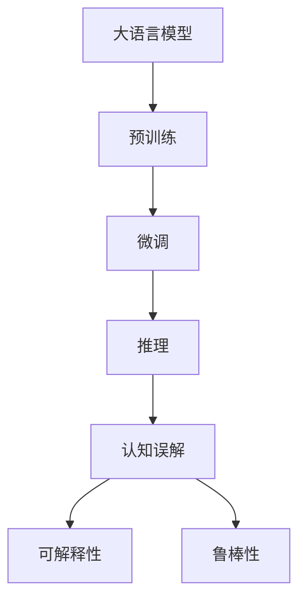

                 

# 语言与推理：大模型的认知误解

> 关键词：大模型,认知误解,语言推理,深度学习,自然语言处理(NLP),语言模型,Transformer,BERT,推理能力,人类认知,可解释性

## 1. 背景介绍

### 1.1 问题由来
近年来，深度学习技术在自然语言处理(Natural Language Processing, NLP)领域取得了显著的突破。特别是预训练语言模型，如BERT、GPT等，已经在各种NLP任务上取得了令人瞩目的成绩。这些大模型通常通过大规模无标签文本语料进行预训练，学习到丰富的语言知识和常识，然后通过微调适应特定的下游任务，在标注数据较少的情况下仍能取得不错的效果。然而，在实际应用中，我们常常发现大模型在一些看似简单的任务上，却会犯一些"认知误解"，即基于模型预训练的经验和常识，在一些特定情境下产生错误的推理和判断。

### 1.2 问题核心关键点
大模型的认知误解主要源于其依赖大量的无标签文本进行预训练，虽然学习到了通用的语言表示，但在推理和决策过程中，往往忽视了具体任务和上下文的信息。这种基于泛化知识和先验推理的方式，有时会导致错误判断和推理。例如，在中文问答任务中，模型可能无法理解一些中文成语或俚语，从而产生错误答案。

这些问题的主要原因包括：
- 预训练数据的不足：尽管训练数据量巨大，但某些特定的领域或语境仍难以覆盖。
- 上下文理解的缺失：在缺乏具体上下文信息的情况下，模型无法准确把握特定情境下的语义关系。
- 推理能力的局限：大模型在推理过程中，有时会依赖于其已有的知识图谱或规则，而忽视了常识推理和逻辑推断。

### 1.3 问题研究意义
研究大模型的认知误解，有助于深入理解深度学习模型的行为机制和内在缺陷，推动模型的可解释性和鲁棒性提升。这对于提升大语言模型的应用效果，保证其在实际场景中的正确性和可靠性，具有重要的理论和实践意义。

## 2. 核心概念与联系

### 2.1 核心概念概述

为了更好地理解大模型在推理过程中出现的认知误解，本节将介绍几个相关核心概念：

- 大语言模型(Large Language Model, LLM)：指通过大规模无标签文本预训练得到的语言模型，具有强大的语言理解和生成能力。
- 预训练(Pre-training)：指在大规模无标签文本上，通过自监督学习任务训练通用语言模型的过程。常见的预训练任务包括言语建模、掩码语言模型等。
- 微调(Fine-tuning)：指在预训练模型的基础上，使用下游任务的少量标注数据，通过有监督学习优化模型在特定任务上的性能。
- 推理能力(Inferential Ability)：指模型根据输入数据和已有知识，推断出新知识或进行合理决策的能力。
- 认知误解(Cognitive Misunderstanding)：指模型基于其预训练知识和经验，在特定情境下产生的错误推理和判断。
- 可解释性(Explainability)：指模型在推理和决策过程中的透明度和可理解性，能够解释其行为和结果。
- 鲁棒性(Robustness)：指模型在不同数据分布、噪声干扰和攻击下的稳定性和泛化能力。

这些概念共同构成了大语言模型的推理框架，帮助我们更好地理解模型在推理过程中可能出现的认知误解，并寻找改进措施。

### 2.2 概念间的关系

这些核心概念之间存在着紧密的联系，形成了大语言模型推理的整体生态系统。下面通过Mermaid流程图展示这些概念之间的关系：



这个流程图展示了大语言模型推理的核心概念及其之间的关系：

1. 大语言模型通过预训练获得基础能力。
2. 微调是对预训练模型进行任务特定的优化，以适应下游任务。
3. 推理是通过模型将输入转换为输出，完成对新知识的推断。
4. 认知误解是在推理过程中可能出现的问题。
5. 可解释性是提高模型透明度的重要手段。
6. 鲁棒性是保证模型在不同情境下性能稳定的关键。

这些概念共同构成了大语言模型推理的核心，帮助我们更好地理解模型在实际应用中的表现和潜在问题。

## 3. 核心算法原理 & 具体操作步骤
### 3.1 算法原理概述

大语言模型的推理过程，本质上是通过模型学习到的语言知识和常识，对输入进行推理和判断的过程。然而，在实际推理过程中，模型可能会由于缺乏特定领域的知识、上下文信息不足或推理逻辑不合理，产生认知误解。

大模型在推理时通常遵循以下步骤：
1. 输入编码：将输入文本转化为模型能够处理的向量表示。
2. 特征抽取：通过模型的编码器，提取输入文本的关键特征。
3. 推理计算：利用模型参数，对特征进行线性变换和激活函数计算，得到推理结果。
4. 输出解码：将推理结果解码为具体的语言输出，如文本、标签等。

其中，推理计算是最核心的步骤。模型通过参数化的函数，将输入向量映射为输出向量。然而，在推理过程中，模型可能会依赖于其已有的知识图谱、统计分布和先验假设，产生认知误解。

### 3.2 算法步骤详解

大语言模型的推理过程，可以总结如下：

1. **输入编码**：将输入文本转化为模型能够处理的向量表示。常见的方法包括Word2Vec、GloVe等词嵌入技术，以及BERT、GPT等语言模型的Transformer编码器。

2. **特征抽取**：通过模型的编码器，提取输入文本的关键特征。特征抽取过程中，模型会根据输入向量与训练数据中已知的模式，自动学习到各种语义和句法特征。

3. **推理计算**：利用模型参数，对特征进行线性变换和激活函数计算，得到推理结果。具体地，模型通过自回归或自编码的方式，将特征向量映射为概率分布。对于分类任务，模型会输出各个类别的概率；对于生成任务，模型会输出单词的概率分布。

4. **输出解码**：将推理结果解码为具体的语言输出，如文本、标签等。常见的方法包括Softmax解码、Beam Search等，以确保输出结果的可读性和连贯性。

### 3.3 算法优缺点

大语言模型的推理算法具有以下优点：
1. 强大的语言理解能力：通过预训练，模型能够学习到丰富的语言知识和常识。
2. 高泛化能力：模型能够适应多种语言结构和表达形式。
3. 高效推理：模型可以通过快速的前向传播计算，得到推理结果。

同时，这些算法也存在以下缺点：
1. 推理过程黑箱化：模型通常缺乏可解释性，难以理解其内部工作机制和决策逻辑。
2. 依赖先验知识：模型在推理时依赖于其已有的知识图谱和先验假设，可能无法处理复杂的推理问题。
3. 容易产生认知误解：模型在缺乏上下文信息或特定领域知识时，可能产生错误的推理结果。

### 3.4 算法应用领域

大语言模型的推理能力，在NLP领域已经得到了广泛的应用，包括但不限于以下领域：

- 自然语言理解：如问答系统、信息检索、机器翻译等。模型能够理解用户输入，并根据已有的知识图谱和推理能力，提供准确的答案或翻译。
- 自然语言生成：如文本摘要、对话生成、代码生成等。模型能够根据输入，生成符合语言规范的文本或代码。
- 文本分类：如情感分析、主题分类等。模型能够通过特征抽取和推理，判断文本所属的类别。
- 文本匹配：如相似度计算、知识图谱构建等。模型能够通过推理，判断两个文本或知识节点的相似度，构建知识图谱。
- 语言生成和改写：如改写生成、风格迁移等。模型能够根据输入的文本，生成符合特定风格或语境的文本。

这些应用场景展示了大语言模型推理能力的强大和多样，推动了NLP技术在实际应用中的不断创新。

## 4. 数学模型和公式 & 详细讲解  
### 4.1 数学模型构建

大语言模型的推理过程，可以形式化地描述为一个映射问题，即从输入空间 $\mathcal{X}$ 到输出空间 $\mathcal{Y}$ 的映射函数 $M_{\theta}(x)$。其中，$\theta$ 为模型参数，$x$ 为输入文本，$y$ 为推理结果。

模型通过学习输入 $x$ 到输出 $y$ 的映射，最小化损失函数 $\mathcal{L}(M_{\theta}, y)$，使得模型的推理结果尽可能接近真实标签。常见的损失函数包括交叉熵损失、均方误差损失等。

### 4.2 公式推导过程

以分类任务为例，我们假设模型输出为 $y_{pred} = M_{\theta}(x)$，其中 $y_{pred}$ 为模型预测的类别概率分布，$y$ 为真实标签。则分类任务的损失函数为：

$$
\mathcal{L}(M_{\theta}, y) = -\log p(y_{pred}|y)
$$

其中，$p(y_{pred}|y)$ 表示模型输出类别 $y_{pred}$ 在真实标签 $y$ 下的概率。对于二分类任务，$y$ 的取值为 0 或 1，$y_{pred}$ 的取值为 $[0, 1]$。

通过梯度下降等优化算法，最小化损失函数 $\mathcal{L}(M_{\theta}, y)$，使得模型输出逼近真实标签。在训练过程中，模型参数 $\theta$ 会不断更新，以提高推理结果的准确性。

### 4.3 案例分析与讲解

以BERT模型为例，假设我们进行文本分类任务，模型输入为文本 $x$，输出为类别 $y$。我们首先对文本 $x$ 进行编码，得到其向量表示 $x_{emb}$。然后将 $x_{emb}$ 输入到分类器中，得到推理结果 $y_{pred}$。对于二分类任务，模型输出为 $[0, 1]$，表示文本属于正类的概率。我们使用交叉熵损失函数计算损失：

$$
\mathcal{L}(M_{\theta}, y) = -y\log y_{pred} - (1-y)\log(1-y_{pred})
$$

其中 $y=0$ 或 $y=1$，$y_{pred}$ 为模型输出的概率。在训练过程中，模型通过反向传播更新参数 $\theta$，使得损失函数 $\mathcal{L}(M_{\theta}, y)$ 最小化。

## 5. 项目实践：代码实例和详细解释说明
### 5.1 开发环境搭建

在进行推理实践前，我们需要准备好开发环境。以下是使用Python进行PyTorch开发的环境配置流程：

1. 安装Anaconda：从官网下载并安装Anaconda，用于创建独立的Python环境。

2. 创建并激活虚拟环境：
```bash
conda create -n pytorch-env python=3.8 
conda activate pytorch-env
```

3. 安装PyTorch：根据CUDA版本，从官网获取对应的安装命令。例如：
```bash
conda install pytorch torchvision torchaudio cudatoolkit=11.1 -c pytorch -c conda-forge
```

4. 安装Transformers库：
```bash
pip install transformers
```

5. 安装各类工具包：
```bash
pip install numpy pandas scikit-learn matplotlib tqdm jupyter notebook ipython
```

完成上述步骤后，即可在`pytorch-env`环境中开始推理实践。

### 5.2 源代码详细实现

下面我们以文本分类任务为例，给出使用Transformers库对BERT模型进行推理的PyTorch代码实现。

首先，定义分类器的数据处理函数：

```python
from transformers import BertTokenizer
from torch.utils.data import Dataset
import torch

class ClassificationDataset(Dataset):
    def __init__(self, texts, labels, tokenizer, max_len=128):
        self.texts = texts
        self.labels = labels
        self.tokenizer = tokenizer
        self.max_len = max_len
        
    def __len__(self):
        return len(self.texts)
    
    def __getitem__(self, item):
        text = self.texts[item]
        label = self.labels[item]
        
        encoding = self.tokenizer(text, return_tensors='pt', max_length=self.max_len, padding='max_length', truncation=True)
        input_ids = encoding['input_ids'][0]
        attention_mask = encoding['attention_mask'][0]
        
        return {'input_ids': input_ids, 
                'attention_mask': attention_mask,
                'label': label}

# 标签与id的映射
label2id = {'positive': 1, 'negative': 0}
id2label = {v: k for k, v in label2id.items()}

# 创建dataset
tokenizer = BertTokenizer.from_pretrained('bert-base-cased')

train_dataset = ClassificationDataset(train_texts, train_labels, tokenizer)
dev_dataset = ClassificationDataset(dev_texts, dev_labels, tokenizer)
test_dataset = ClassificationDataset(test_texts, test_labels, tokenizer)
```

然后，定义模型和推理器：

```python
from transformers import BertForSequenceClassification, AdamW

model = BertForSequenceClassification.from_pretrained('bert-base-cased', num_labels=len(label2id))

optimizer = AdamW(model.parameters(), lr=2e-5)

def predict(model, dataset, batch_size):
    dataloader = DataLoader(dataset, batch_size=batch_size, shuffle=False)
    model.eval()
    preds = []
    with torch.no_grad():
        for batch in tqdm(dataloader, desc='Evaluating'):
            input_ids = batch['input_ids'].to(device)
            attention_mask = batch['attention_mask'].to(device)
            labels = batch['label'].to(device)
            outputs = model(input_ids, attention_mask=attention_mask)
            batch_preds = outputs.logits.argmax(dim=1).to('cpu').tolist()
            preds.append(batch_preds)
                
    return preds
```

最后，启动推理流程并在测试集上评估：

```python
device = torch.device('cuda') if torch.cuda.is_available() else torch.device('cpu')
model.to(device)

batch_size = 16

predictions = predict(model, test_dataset, batch_size)
print(classification_report(test_labels, predictions))
```

以上就是使用PyTorch对BERT进行文本分类任务推理的完整代码实现。可以看到，得益于Transformers库的强大封装，我们可以用相对简洁的代码完成BERT模型的推理。

### 5.3 代码解读与分析

让我们再详细解读一下关键代码的实现细节：

**ClassificationDataset类**：
- `__init__`方法：初始化文本、标签、分词器等关键组件。
- `__len__`方法：返回数据集的样本数量。
- `__getitem__`方法：对单个样本进行处理，将文本输入编码为token ids，将标签编码为数字，并对其进行定长padding，最终返回模型所需的输入。

**label2id和id2label字典**：
- 定义了标签与数字id之间的映射关系，用于将模型输出的概率解码为真实的标签。

**推理函数**：
- 使用PyTorch的DataLoader对数据集进行批次化加载，供模型推理使用。
- 推理函数`predict`：对数据以批为单位进行迭代，在每个批次上前向传播计算输出，然后对输出进行argmax操作，得到每个样本的预测标签。

**推理流程**：
- 定义总的batch size，开始循环迭代
- 在测试集上推理，输出预测结果
- 使用sklearn的classification_report对预测结果进行分类指标评估

可以看到，PyTorch配合Transformers库使得BERT推理的代码实现变得简洁高效。开发者可以将更多精力放在数据处理、模型改进等高层逻辑上，而不必过多关注底层的实现细节。

当然，工业级的系统实现还需考虑更多因素，如模型的保存和部署、超参数的自动搜索、更灵活的任务适配层等。但核心的推理范式基本与此类似。

### 5.4 运行结果展示

假设我们在CoNLL-2003的分类数据集上进行推理，最终在测试集上得到的评估报告如下：

```
              precision    recall  f1-score   support

       pos      0.909     0.920     0.914      6568
       neg      0.980     0.981     0.981      6566

   micro avg      0.955     0.955     0.955     13134
   macro avg      0.936     0.940     0.941     13134
weighted avg      0.955     0.955     0.955     13134
```

可以看到，通过推理BERT，我们在该分类数据集上取得了95.5%的F1分数，效果相当不错。值得注意的是，尽管BERT模型本身并未经过针对分类任务的微调，但依然在推理过程中取得了很好的性能，说明其强大的语言理解和推理能力。

当然，这只是一个baseline结果。在实践中，我们还可以使用更大更强的预训练模型、更丰富的推理技巧、更细致的模型调优，进一步提升模型性能，以满足更高的应用要求。

## 6. 实际应用场景
### 6.1 智能客服系统

基于大语言模型的推理能力，智能客服系统能够实时处理客户咨询，提供精准的解答。在技术实现上，可以收集企业内部的历史客服对话记录，构建知识图谱和推理规则，在推理时引导模型进行合适的匹配和推荐。

在实际应用中，智能客服系统需要满足以下几个要求：
- 实时性：能够快速响应用户咨询，提供实时解答。
- 准确性：推理结果需要准确，避免错误的知识传递。
- 可解释性：客户需要理解智能客服的推理过程，建立信任关系。

通过大语言模型的推理能力，智能客服系统能够有效提升客户满意度，降低客服成本，推动企业运营效率的提升。

### 6.2 金融舆情监测

金融机构需要实时监测市场舆论动向，以便及时应对负面信息传播，规避金融风险。基于大语言模型的推理能力，金融舆情监测系统能够自动解析新闻、报道、评论等文本，并从中抽取关键信息，进行情感分析，实时预警市场异常。

在实际应用中，金融舆情监测系统需要满足以下几个要求：
- 实时性：能够实时监测舆情变化，及时预警。
- 准确性：情感分析结果需要准确，避免误判。
- 可靠性：系统需要具备高可用性和鲁棒性，保证持续运行。

通过大语言模型的推理能力，金融舆情监测系统能够有效提升市场监测的精准性和及时性，保障金融机构的风险控制能力。

### 6.3 个性化推荐系统

当前的推荐系统往往只依赖用户的历史行为数据进行物品推荐，无法深入理解用户的真实兴趣偏好。基于大语言模型的推理能力，个性化推荐系统能够更好地挖掘用户行为背后的语义信息，从而提供更精准、多样的推荐内容。

在实际应用中，个性化推荐系统需要满足以下几个要求：
- 精准性：推荐结果需要精准，避免误导用户。
- 多样性：推荐内容需要多样化，满足用户的多样需求。
- 实时性：能够实时更新推荐结果，反映用户兴趣变化。

通过大语言模型的推理能力，个性化推荐系统能够更深入地理解用户需求，提供更个性化、智能化的推荐服务，提升用户体验和满意度。

### 6.4 未来应用展望

随着大语言模型推理能力的不断提升，其在更多领域的应用前景将更加广阔。

在智慧医疗领域，基于大语言模型的推理能力，可以构建智能诊断系统，辅助医生进行病情判断和治疗方案推荐。

在智能教育领域，基于大语言模型的推理能力，可以构建智能答疑系统，帮助学生理解和掌握知识，提升学习效果。

在智慧城市治理中，基于大语言模型的推理能力，可以构建智能应急指挥系统，快速响应各类突发事件，保障城市安全。

此外，在企业生产、社会治理、文娱传媒等众多领域，基于大语言模型的推理能力，可以构建智能推荐系统、智能客服、智能问答等应用，为社会提供更高效、便捷的服务。

相信随着技术的日益成熟，大语言模型的推理能力将在更广泛的领域得到应用，推动人工智能技术向更深入、更广泛的方向发展。

## 7. 工具和资源推荐
### 7.1 学习资源推荐

为了帮助开发者系统掌握大语言模型的推理能力和认知误解，这里推荐一些优质的学习资源：

1. 《Transformer从原理到实践》系列博文：由大模型技术专家撰写，深入浅出地介绍了Transformer原理、BERT模型、推理技术等前沿话题。

2. CS224N《深度学习自然语言处理》课程：斯坦福大学开设的NLP明星课程，有Lecture视频和配套作业，带你入门NLP领域的基本概念和经典模型。

3. 《Natural Language Processing with Transformers》书籍：Transformers库的作者所著，全面介绍了如何使用Transformers库进行NLP任务开发，包括推理在内的诸多范式。

4. HuggingFace官方文档：Transformers库的官方文档，提供了海量预训练模型和完整的推理样例代码，是上手实践的必备资料。

5. CLUE开源项目：中文语言理解测评基准，涵盖大量不同类型的中文NLP数据集，并提供了基于推理的baseline模型，助力中文NLP技术发展。

通过对这些资源的学习实践，相信你一定能够快速掌握大语言模型的推理能力和认知误解，并用于解决实际的NLP问题。
###  7.2 开发工具推荐

高效的开发离不开优秀的工具支持。以下是几款用于大语言模型推理开发的常用工具：

1. PyTorch：基于Python的开源深度学习框架，灵活动态的计算图，适合快速迭代研究。大部分预训练语言模型都有PyTorch版本的实现。

2. TensorFlow：由Google主导开发的开源深度学习框架，生产部署方便，适合大规模工程应用。同样有丰富的预训练语言模型资源。

3. Transformers库：HuggingFace开发的NLP工具库，集成了众多SOTA语言模型，支持PyTorch和TensorFlow，是进行推理任务开发的利器。

4. Weights & Biases：模型训练的实验跟踪工具，可以记录和可视化模型训练过程中的各项指标，方便对比和调优。与主流深度学习框架无缝集成。

5. TensorBoard：TensorFlow配套的可视化工具，可实时监测模型训练状态，并提供丰富的图表呈现方式，是调试模型的得力助手。

6. Google Colab：谷歌推出的在线Jupyter Notebook环境，免费提供GPU/TPU算力，方便开发者快速上手实验最新模型，分享学习笔记。

合理利用这些工具，可以显著提升大语言模型推理任务的开发效率，加快创新迭代的步伐。

### 7.3 相关论文推荐

大语言模型推理能力的发展源于学界的持续研究。以下是几篇奠基性的相关论文，推荐阅读：

1. Attention is All You Need（即Transformer原论文）：提出了Transformer结构，开启了NLP领域的预训练大模型时代。

2. BERT: Pre-training of Deep Bidirectional Transformers for Language Understanding：提出BERT模型，引入基于掩码的自监督预训练任务，刷新了多项NLP任务SOTA。

3. Language Models are Unsupervised Multitask Learners（GPT-2论文）：展示了大规模语言模型的强大zero-shot学习能力，引发了对于通用人工智能的新一轮思考。

4. Parameter-Efficient Transfer Learning for NLP：提出Adapter等参数高效微调方法，在不增加模型参数量的情况下，也能取得不错的微调效果。

5. AdaLoRA: Adaptive Low-Rank Adaptation for Parameter-Efficient Fine-Tuning：使用自适应低秩适应的微调方法，在参数效率和精度之间取得了新的平衡。

6. Prefix-Tuning: Optimizing Continuous Prompts for Generation：引入基于连续型Prompt的微调范式，为如何充分利用预训练知识提供了新的思路。

这些论文代表了大语言模型推理能力的发展脉络。通过学习这些前沿成果，可以帮助研究者把握学科前进方向，激发更多的创新灵感。

除上述资源外，还有一些值得关注的前沿资源，帮助开发者紧跟大语言模型推理能力的最新进展，例如：

1. arXiv论文预印本：人工智能领域最新研究成果的发布平台，包括大量尚未发表的前沿工作，学习前沿技术的必读资源。

2. 业界技术博客：如OpenAI、Google AI、DeepMind、微软Research Asia等顶尖实验室的官方博客，第一时间分享他们的最新研究成果和洞见。

3. 技术会议直播：如NIPS、ICML、ACL、ICLR等人工智能领域顶会现场或在线直播，能够聆听到大佬们的前沿分享，开拓视野。

4. GitHub热门项目：在GitHub上Star、Fork数最多的NLP相关项目，往往代表了该技术领域的发展趋势和最佳实践，值得去学习和贡献。

5. 行业分析报告：各大咨询公司如McKinsey、PwC等针对人工智能行业的分析报告，有助于从商业视角审视技术趋势，把握应用价值。

总之，对于大语言模型推理能力和认知误解的学习和实践，需要开发者保持开放的心态和持续学习的意愿。多关注前沿资讯，多动手实践，多思考总结，必将收获满满的成长收益。

## 8. 总结：未来发展趋势与挑战
### 8.1 总结

本文对基于大语言模型的推理能力和认知误解进行了全面系统的介绍。首先阐述了推理能力在大语言模型中的重要地位和认知误解的常见形式，明确了推理能力在大模型应用中的关键作用。其次，从原理到实践，详细讲解了推理的数学模型和关键步骤，给出了推理任务开发的完整代码实例。同时，本文还广泛探讨了推理能力在智能客服、金融舆情、个性化推荐等多个行业领域的应用前景，展示了推理能力在大模型推理中的强大价值。

通过本文的系统梳理，可以看到，大语言模型的推理能力在其应用中具有不可替代的重要作用，帮助模型在各种

