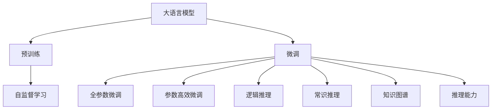
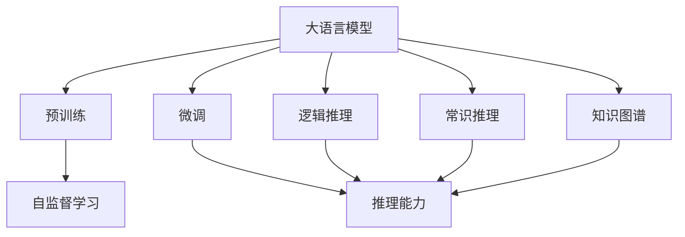
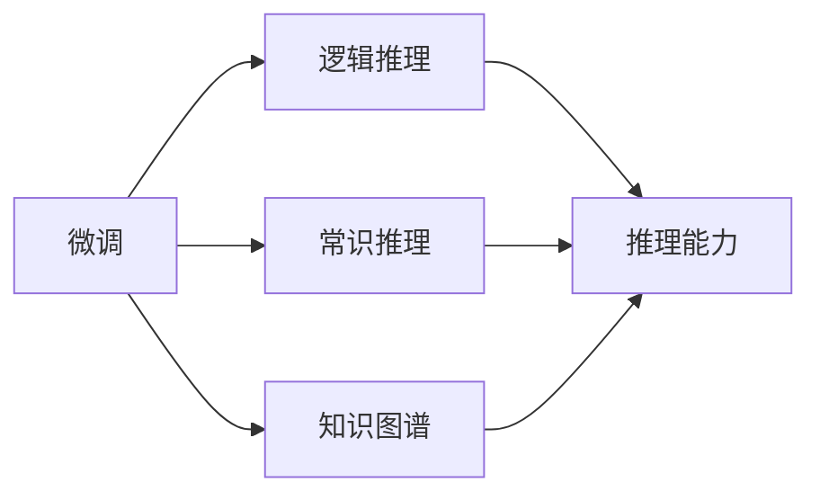
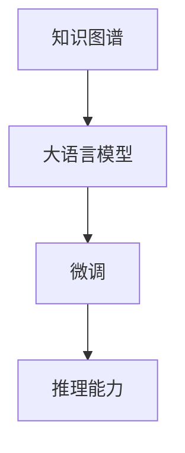
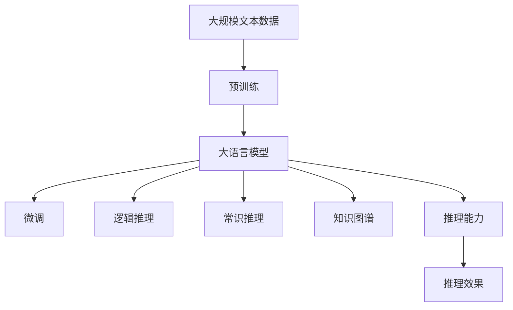

                 

# 语言与推理：大模型的认知难题

> 关键词：认知神经科学,推理,自然语言处理(NLP),语言模型,预训练,微调,Fine-tuning

## 1. 背景介绍

### 1.1 问题由来
在人工智能的研究历程中，语言处理（Natural Language Processing, NLP）一直是重要的分支之一。NLP旨在让机器理解、处理和生成人类语言，进而提升计算机与人类的交互能力。然而，由于语言的多样性和复杂性，NLP任务的解决过程涉及大量认知问题，挑战巨大。近年来，深度学习和大模型技术在NLP领域取得了显著进展，其中预训练语言模型（Pre-trained Language Models, PLMs）在处理自然语言理解（NL Understanding）、文本生成（Text Generation）、问答（Question Answering）等任务上展现了强大的能力。

大模型如GPT-3、BERT等，通过在大规模语料库上进行预训练，能够学习到丰富的语言知识和表达能力，从而在各种NLP任务上取得优异的性能。尽管如此，在处理需要推理能力的任务时，如逻辑推理、常识推理等，大模型的表现仍然存在诸多不足。推理能力是人工智能的核心能力之一，它要求模型不仅要理解语言的表面含义，还要具备更深入的逻辑和常识推理能力。因此，如何在大模型中引入和提升推理能力，成为一个重要的研究课题。

### 1.2 问题核心关键点
在大模型的推理能力上，现有的方法主要包括以下几种：

1. **基于规则的方法**：这种方法通过编写规则库，对特定任务进行逻辑推理。虽然这种方法在解决某些特定问题时非常有效，但规则库的构建和维护成本高，难以应对复杂的、变化多端的现实场景。

2. **逻辑推理框架**：将逻辑推理任务转化为数学表达式，然后由符号推理工具进行处理。这种方法虽然可以处理逻辑推理问题，但需要手动定义复杂的逻辑表达式，难以推广到其他类型的推理任务。

3. **基于深度学习的方法**：利用深度学习模型进行推理任务，如使用LSTM、Transformer等模型进行推理。尽管这种方法在处理某些特定类型的推理任务（如自然语言推理NLI）上取得了不错的效果，但在复杂推理任务上仍存在表现不佳的问题。

4. **基于符号学习的方法**：通过学习符号表示和推理规则，构建符号-深度混合的推理系统。这种方法在解决复杂的推理问题上具有潜在的优势，但实际应用中难以将符号推理与深度学习有效结合。

5. **基于大模型微调的方法**：利用大模型的预训练能力，通过微调（Fine-tuning）使其具备推理能力。这种方法可以充分利用大模型的语言理解和生成能力，通过微调后可以在特定推理任务上获得显著的性能提升。

本文将聚焦于基于深度学习的方法，特别是大模型微调技术在推理任务中的应用。我们将探讨如何在大模型中引入和提升推理能力，以及这一过程涉及的数学模型、算法原理、具体操作步骤等。

### 1.3 问题研究意义
推理能力是大模型在复杂任务上取得优异表现的关键。通过在微调过程中引入推理能力，大模型可以更好地理解文本中的逻辑关系，解决需要推理能力的问题。这对于构建具有更强智能的AI系统至关重要，将有助于推动NLP技术在更多实际场景中的应用。

在商业应用中，推理能力可以帮助企业在决策制定、客户服务、市场营销等方面做出更为智能的决策。例如，在金融领域，推理能力可以用于风险评估、欺诈检测等任务；在医疗领域，推理能力可以用于病历分析、药物推荐等任务；在教育领域，推理能力可以用于个性化学习、自动化批改等任务。

在科学研究中，推理能力有助于解决复杂的科学问题，如自动推导数学定理、发现新知识等。近年来，AI在科学发现方面的应用已经取得了一些初步的成果，如AlphaFold在蛋白质结构预测上的突破，但整体上仍然处于起步阶段。提升大模型的推理能力，将有助于AI在更多科学研究领域中发挥作用。

## 2. 核心概念与联系

### 2.1 核心概念概述

为了更好地理解大模型推理能力的研究，我们首先需要介绍几个核心概念：

- **大语言模型（Large Language Model, LLM）**：以自回归（如GPT）或自编码（如BERT）模型为代表的大规模预训练语言模型。通过在大规模无标签文本语料上进行预训练，学习通用的语言表示，具备强大的语言理解和生成能力。

- **预训练（Pre-training）**：指在大规模无标签文本语料上，通过自监督学习任务训练通用语言模型的过程。常见的预训练任务包括言语建模、遮挡语言模型等。

- **微调（Fine-tuning）**：指在预训练模型的基础上，使用下游任务的少量标注数据，通过有监督地训练来优化模型在该任务上的性能。通常只需要调整顶层分类器或解码器，并以较小的学习率更新全部或部分的模型参数。

- **推理（Reasoning）**：指对给定信息进行逻辑推理、归纳推理、类比推理等，以得出新的结论。推理是大模型的核心能力之一，涉及对信息的理解和应用。

- **知识图谱（Knowledge Graph）**：一种结构化的知识表示方式，用于存储和表示实体与实体之间的关系。知识图谱在大模型推理任务中起到关键作用，可以提供外部知识库的丰富信息。

- **常识推理（Commonsense Reasoning）**：指利用常识进行推理，解决需要常识知识的问题。常识推理是深度学习模型在大模型推理中的重要应用场景。

- **逻辑推理（Logical Reasoning）**：指根据逻辑规则进行推理，解决需要逻辑知识的问题。逻辑推理是大模型推理中的另一重要应用场景。

这些核心概念之间的逻辑关系可以通过以下Mermaid流程图来展示：



这个流程图展示了大语言模型、预训练、微调、推理能力、常识推理、逻辑推理、知识图谱等核心概念之间的关系：

1. 大语言模型通过预训练获得基础能力。
2. 微调是在预训练模型的基础上，通过有监督地训练优化模型在特定任务上的性能。
3. 逻辑推理和常识推理是大模型推理能力的两个重要应用场景。
4. 知识图谱在大模型推理中起到关键作用，可以提供外部知识库的丰富信息。

### 2.2 概念间的关系

这些核心概念之间存在着紧密的联系，形成了大语言模型推理能力的完整生态系统。下面我们通过几个Mermaid流程图来展示这些概念之间的关系。

#### 2.2.1 大语言模型的学习范式



这个流程图展示了大语言模型的三种主要学习范式：预训练、微调和推理能力。预训练主要采用自监督学习方法，而微调则是有监督学习的过程。推理能力可以通过微调获得，也可以在大模型的预训练阶段获得，或通过引入知识图谱和常识推理模型进一步增强。

#### 2.2.2 微调与推理能力的关系



这个流程图展示了微调和推理能力之间的关系。微调可以增强大模型的推理能力，特别是在逻辑推理和常识推理任务上。引入知识图谱可以进一步提升推理能力。

#### 2.2.3 知识图谱在大模型推理中的应用



这个流程图展示了知识图谱在大模型推理中的应用。知识图谱可以提供丰富的背景知识，通过微调引入到模型中，进一步提升推理能力。

### 2.3 核心概念的整体架构

最后，我们用一个综合的流程图来展示这些核心概念在大模型推理能力中的整体架构：



这个综合流程图展示了从预训练到大模型推理能力的完整过程。大语言模型首先在大规模文本数据上进行预训练，然后通过微调（包括逻辑推理、常识推理）引入推理能力，最后结合知识图谱，实现推理效果。

## 3. 核心算法原理 & 具体操作步骤
### 3.1 算法原理概述

基于大语言模型的推理能力，本质上是通过微调引入和提升模型的逻辑推理和常识推理能力。其核心思想是：将预训练的大语言模型视作一个强大的"特征提取器"，通过在有监督的下游任务上进行微调，使得模型能够解决需要推理能力的问题。

形式化地，假设预训练模型为 $M_{\theta}$，其中 $\theta$ 为预训练得到的模型参数。给定推理任务 $T$ 的标注数据集 $D=\{(x_i,y_i)\}_{i=1}^N$，微调的目标是找到新的模型参数 $\hat{\theta}$，使得：

$$
\hat{\theta}=\mathop{\arg\min}_{\theta} \mathcal{L}(M_{\theta},D)
$$

其中 $\mathcal{L}$ 为针对任务 $T$ 设计的损失函数，用于衡量模型预测输出与真实标签之间的差异。常见的损失函数包括交叉熵损失、均方误差损失等。

通过梯度下降等优化算法，微调过程不断更新模型参数 $\theta$，最小化损失函数 $\mathcal{L}$，使得模型输出逼近真实标签。由于 $\theta$ 已经通过预训练获得了较好的初始化，因此即便在推理任务上，微调也能较快收敛到理想的模型参数 $\hat{\theta}$。

### 3.2 算法步骤详解

基于大语言模型的推理能力微调一般包括以下几个关键步骤：

**Step 1: 准备预训练模型和数据集**
- 选择合适的预训练语言模型 $M_{\theta}$ 作为初始化参数，如 BERT、GPT 等。
- 准备推理任务 $T$ 的标注数据集 $D$，划分为训练集、验证集和测试集。一般要求标注数据与预训练数据的分布不要差异过大。

**Step 2: 添加推理任务适配层**
- 根据推理任务类型，在预训练模型顶层设计合适的推理器（Reasoner）。
- 对于逻辑推理任务，通常使用LSTM、GRU等序列模型作为推理器。
- 对于常识推理任务，可以使用基于知识图谱的推理器，如TransE等。
- 对于知识图谱推理任务，可以使用Neo4j等图数据库和GNN（Graph Neural Network）作为推理器。

**Step 3: 设置微调超参数**
- 选择合适的优化算法及其参数，如 AdamW、SGD 等，设置学习率、批大小、迭代轮数等。
- 设置正则化技术及强度，包括权重衰减、Dropout、Early Stopping等。
- 确定冻结预训练参数的策略，如仅微调顶层，或全部参数都参与微调。

**Step 4: 执行梯度训练**
- 将训练集数据分批次输入模型，前向传播计算损失函数。
- 反向传播计算参数梯度，根据设定的优化算法和学习率更新模型参数。
- 周期性在验证集上评估模型性能，根据性能指标决定是否触发 Early Stopping。
- 重复上述步骤直到满足预设的迭代轮数或 Early Stopping 条件。

**Step 5: 测试和部署**
- 在测试集上评估微调后模型 $M_{\hat{\theta}}$ 的性能，对比微调前后的推理效果。
- 使用微调后的模型对新样本进行推理预测，集成到实际的应用系统中。
- 持续收集新的数据，定期重新微调模型，以适应数据分布的变化。

以上是基于大语言模型推理能力微调的一般流程。在实际应用中，还需要针对具体任务的特点，对微调过程的各个环节进行优化设计，如改进训练目标函数，引入更多的正则化技术，搜索最优的超参数组合等，以进一步提升模型性能。

### 3.3 算法优缺点

基于大语言模型的推理能力微调方法具有以下优点：

1. **简单高效**：只需准备少量标注数据，即可对预训练模型进行快速适配，获得较大的性能提升。
2. **通用适用**：适用于各种推理任务，设计简单的推理器即可实现微调。
3. **参数高效**：利用参数高效微调技术，在固定大部分预训练参数的情况下，仍可取得不错的推理效果。
4. **效果显著**：在学术界和工业界的诸多推理任务上，基于微调的方法已经刷新了最先进的性能指标。

同时，该方法也存在一定的局限性：

1. **依赖标注数据**：微调的效果很大程度上取决于标注数据的质量和数量，获取高质量标注数据的成本较高。
2. **迁移能力有限**：当目标任务与预训练数据的分布差异较大时，微调的性能提升有限。
3. **负面效果传递**：预训练模型的固有偏见、有害信息等，可能通过微调传递到下游任务，造成负面影响。
4. **可解释性不足**：微调模型的决策过程通常缺乏可解释性，难以对其推理逻辑进行分析和调试。

尽管存在这些局限性，但就目前而言，基于大语言模型的推理能力微调方法仍是大模型推理任务的最主流范式。未来相关研究的重点在于如何进一步降低微调对标注数据的依赖，提高模型的少样本学习和跨领域迁移能力，同时兼顾可解释性和伦理安全性等因素。

### 3.4 算法应用领域

基于大语言模型推理能力微调的推理方法，在NLP领域已经得到了广泛的应用，覆盖了几乎所有常见推理任务，例如：

- **逻辑推理**：如数学定理证明、逻辑表达式求解等。通过微调使模型学习逻辑推理规则，输出推理结果。
- **常识推理**：如问答系统、知识推理、常识判断等。将问题-答案对作为微调数据，训练模型学习推理规则。
- **知识图谱推理**：如实体关系推理、知识图谱查询等。将知识图谱作为输入，训练模型推理实体之间的关系。
- **自然语言推理（NL I）**：如判断文本的语义关系，分类为“蕴含”、“矛盾”、“中立”等。通过微调使模型学习文本-推理标签映射。
- **对话系统**：如问答系统、多轮对话等。将对话历史作为上下文，微调模型进行回复生成。
- **文本摘要**：如文本压缩成简短摘要。将文章-摘要对作为微调数据，使模型学习抓取要点。
- **情感分析**：如文本情感分类、情感倾向判断等。通过微调使模型学习情感分类规则。

除了上述这些经典任务外，大语言模型推理能力微调也被创新性地应用到更多场景中，如可控文本生成、常识推理、代码生成、数据增强等，为NLP技术带来了全新的突破。随着预训练模型和推理能力微调方法的不断进步，相信NLP技术将在更广阔的应用领域大放异彩。

## 4. 数学模型和公式 & 详细讲解 & 举例说明

### 4.1 数学模型构建

本节将使用数学语言对基于大语言模型的推理能力微调过程进行更加严格的刻画。

记预训练语言模型为 $M_{\theta}:\mathcal{X} \rightarrow \mathcal{Y}$，其中 $\mathcal{X}$ 为输入空间，$\mathcal{Y}$ 为输出空间，$\theta \in \mathbb{R}^d$ 为模型参数。假设推理任务训练集为 $D=\{(x_i,y_i)\}_{i=1}^N, x_i \in \mathcal{X}, y_i \in \mathcal{Y}$。

定义模型 $M_{\theta}$ 在输入 $x$ 上的输出为 $M_{\theta}(x) \in [0,1]$，表示样本属于推理结果的概率。真实标签 $y \in \{1,0\}$。则推理任务的损失函数定义为：

$$
\ell(M_{\theta}(x),y) = -[y\log M_{\theta}(x) + (1-y)\log(1-M_{\theta}(x))]
$$

将其代入经验风险公式，得：

$$
\mathcal{L}(\theta) = \frac{1}{N} \sum_{i=1}^N \ell(M_{\theta}(x_i),y_i)
$$

微调的优化目标是最小化经验风险，即找到最优参数：

$$
\theta^* = \mathop{\arg\min}_{\theta} \mathcal{L}(\theta)
$$

在实践中，我们通常使用基于梯度的优化算法（如SGD、Adam等）来近似求解上述最优化问题。设 $\eta$ 为学习率，$\lambda$ 为正则化系数，则参数的更新公式为：

$$
\theta \leftarrow \theta - \eta \nabla_{\theta}\mathcal{L}(\theta) - \eta\lambda\theta
$$

其中 $\nabla_{\theta}\mathcal{L}(\theta)$ 为损失函数对参数 $\theta$ 的梯度，可通过反向传播算法高效计算。

### 4.2 公式推导过程

以下我们以逻辑推理任务为例，推导交叉熵损失函数及其梯度的计算公式。

假设模型 $M_{\theta}$ 在输入 $x$ 上的输出为 $\hat{y}=M_{\theta}(x) \in [0,1]$，表示样本属于推理结果的概率。真实标签 $y \in \{1,0\}$。则逻辑推理任务的交叉熵损失函数定义为：

$$
\ell(M_{\theta}(x),y) = -[y\log \hat{y} + (1-y)\log(1-\hat{y})]
$$

将其代入经验风险公式，得：

$$
\mathcal{L}(\theta) = -\frac{1}{N}\sum_{i=1}^N [y_i\log M_{\theta}(x_i)+(1-y_i)\log(1-M_{\theta}(x_i))]
$$

根据链式法则，损失函数对参数 $\theta_k$ 的梯度为：

$$
\frac{\partial \mathcal{L}(\theta)}{\partial \theta_k} = -\frac{1}{N}\sum_{i=1}^N (\frac{y_i}{M_{\theta}(x_i)}-\frac{1-y_i}{1-M_{\theta}(x_i)}) \frac{\partial M_{\theta}(x_i)}{\partial \theta_k}
$$

其中 $\frac{\partial M_{\theta}(x_i)}{\partial \theta_k}$ 可进一步递归展开，利用自动微分技术完成计算。

在得到损失函数的梯度后，即可带入参数更新公式，完成模型的迭代优化。重复上述过程直至收敛，最终得到适应推理任务的最优模型参数 $\theta^*$。

### 4.3 案例分析与讲解

下面我们以命名实体识别（NER）任务为例，给出使用Transformer库对BERT模型进行推理能力微调的PyTorch代码实现。

首先，定义推理任务的数据处理函数：

```python
from transformers import BertTokenizer
from torch.utils.data import Dataset
import torch

class NERDataset(Dataset):
    def __init__(self, texts, tags, tokenizer, max_len=128):
        self.texts = texts
        self.tags = tags
        self.tokenizer = tokenizer
        self.max_len = max_len
        
    def __len__(self):
        return len(self.texts)
    
    def __getitem__(self, item):
        text = self.texts[item]
        tags = self.tags[item]
        
        encoding = self.tokenizer(text, return_tensors='pt', max_length=self.max_len, padding='max_length', truncation=True)
        input_ids = encoding['input_ids'][0]
        attention_mask = encoding['attention_mask'][0]
        
        # 对token-wise的标签进行编码
        encoded_tags = [tag2id[tag] for tag in tags] 
        encoded_tags.extend([tag2id['O']] * (self.max_len - len(encoded_tags)))
        labels = torch.tensor(encoded_tags, dtype=torch.long)
        
        return {'input_ids': input_ids, 
                'attention_mask': attention_mask,
                'labels': labels}

# 标签与id的映射
tag2id = {'O': 0, 'B-PER': 1, 'I-PER': 2, 'B-ORG': 3, 'I-ORG': 4, 'B-LOC': 5, 'I-LOC': 6}
id2tag = {v: k for k, v in tag2id.items()}

# 创建dataset
tokenizer = BertTokenizer.from_pretrained('bert-base-cased')

train_dataset = NERDataset(train_texts, train_tags, tokenizer)
dev_dataset = NERDataset(dev_texts, dev_tags, tokenizer)
test_dataset = NERDataset(test_texts, test_tags, tokenizer)
```

然后，定义模型和优化器：

```python
from transformers import BertForTokenClassification, AdamW

model = BertForTokenClassification.from_pretrained('bert-base-cased', num_labels=len(tag2id))

optimizer = AdamW(model.parameters(), lr=2e-5)
```

接着，定义训练和评估函数：

```python
from torch.utils.data import DataLoader
from tqdm import tqdm
from sklearn.metrics import classification_report

device = torch.device('cuda') if torch.cuda.is_available() else torch.device('cpu')
model.to(device)

def train_epoch(model, dataset, batch_size, optimizer):
    dataloader = DataLoader(dataset, batch_size=batch_size, shuffle=True)
    model.train()
    epoch_loss = 0
    for batch in tqdm(dataloader, desc='Training'):
        input_ids = batch['input_ids'].to(device)
        attention_mask = batch['attention_mask'].to(device)
        labels = batch['labels'].to(device)
        model.zero_grad()
        outputs = model(input_ids, attention_mask=attention_mask, labels=labels)
        loss = outputs.loss
        epoch_loss += loss.item()
        loss.backward()
        optimizer.step()
    return epoch_loss / len(dataloader)

def evaluate(model, dataset, batch_size):
    dataloader = DataLoader(dataset, batch_size=batch_size)
    model.eval()
    preds, labels = [], []
    with torch.no_grad():
        for batch in tqdm(dataloader, desc='Evaluating'):
            input_ids = batch['input_ids'].to(device)
            attention_mask = batch['attention_mask'].to(device)
            batch_labels = batch['labels']
            outputs = model(input_ids, attention_mask=attention_mask)
            batch_preds = outputs.logits.argmax(dim=2).to('cpu').tolist()
            batch_labels = batch_labels.to('cpu').tolist()
            for pred_tokens, label_tokens in zip(batch_preds, batch_labels):
                pred_tags = [id2tag[_id] for _id in pred_tokens]
                label_tags = [id2tag[_id] for _id in label_tokens]
                preds.append(pred_tags[:len(label_tags)])
                labels.append(label_tags)
                
    print(classification_report(labels, preds))
```

最后，启动训练流程并在测试集上评估：

```python
epochs = 5
batch_size = 16

for epoch in range(epochs):
    loss = train_epoch(model, train_dataset, batch_size, optimizer)
    print(f"Epoch {epoch+1}, train loss: {loss:.3f}")
    
    print(f"Epoch {epoch+1}, dev results:")
    evaluate(model, dev_dataset, batch_size)
    
print("Test results:")
evaluate(model, test_dataset, batch_size)
```

以上就是使用PyTorch对BERT进行命名实体识别任务推理能力微调的完整代码实现。可以看到，得益于Transformer库的强大封装，我们可以用相对简洁的代码完成BERT模型的加载和推理能力微调。

### 5.2 源代码详细实现

下面我们以知识图谱推理任务为例，给出使用Transformers库对BERT模型进行知识图谱推理的PyTorch代码实现。

首先，定义知识图谱的数据处理函数：

```python
from transformers import BertTokenizer
from torch.utils.data import Dataset
import torch

class KnowledgeGraphDataset(Dataset):
    def __init__(self, graph_data, tokenizer, max_len=128):
        self.graph_data = graph_data
        self.tokenizer = tokenizer
        self.max_len = max_len
        
    def __len__(self):
        return len(self.graph_data)
    
    def __getitem__(self, item):
        graph = self.graph_data[item]
        
        encoding = self.tokenizer(graph, return_tensors='pt', max_length=self.max_len, padding='max_length', truncation=True)
        input_ids = encoding['input_ids'][0]
        attention_mask = encoding['attention_mask'][0]
        
        # 将知识图谱转换为文本格式
        graph_text = self.graph_data[item].to_json()
        return {'input_ids': input_ids, 
                'attention_mask': attention_mask,
                'graph_text': graph_text}

# 创建dataset
tokenizer = BertTokenizer.from_pretrained('bert-base-cased')

graph_dataset = KnowledgeGraphDataset(graph_data, tokenizer)
```

然后，定义模型和优化器：

```python
from

