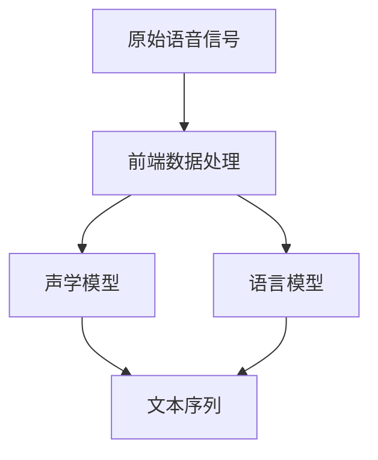

                 

# 语音识别(Speech Recognition) - 原理与代码实例讲解

> 关键词：语音识别,声学模型,语言模型,前端数据处理,后端模型训练与推理,深度学习,自然语言处理(NLP)

## 1. 背景介绍

语音识别(Speech Recognition)技术作为人工智能领域的重要应用之一，其目标是将语音信号转化为文本形式，使得计算机能够理解和处理人类语言。自20世纪90年代以来，随着数字信号处理、深度学习等技术的迅猛发展，语音识别技术取得了显著进步。目前，语音识别技术已广泛应用于智能家居、语音助手、语音转录、智能客服等多个领域，极大地改变了人类的生活和工作方式。

语音识别系统通常由前端数据处理、后端模型训练与推理两个部分组成。前端数据处理负责将原始语音信号转换为数字信号，并提取出有用的特征；后端模型训练与推理则通过机器学习模型将特征映射为文本，实现语音到文本的转换。本文将分别介绍这两个部分的实现原理，并通过代码实例详细讲解。

## 2. 核心概念与联系

### 2.1 核心概念概述

语音识别系统包含以下核心概念：

- **声学模型(Acoustic Model)**：声学模型是语音识别系统的核心部分，用于将语音信号转换为文本。常见的声学模型包括隐马尔可夫模型(HMM)、深度神经网络(DNN)、卷积神经网络(CNN)、递归神经网络(RNN)、长短时记忆网络(LSTM)和注意力机制(Attention)等。
- **语言模型(Language Model)**：语言模型用于评估文本序列的概率，帮助声学模型进行解码。常见的语言模型包括n-gram模型、RNN语言模型、LSTM语言模型和Transformer语言模型等。
- **前端数据处理**：前端数据处理包括信号预处理、特征提取和帧分帧等步骤。信号预处理通常包括去噪、滤波、归一化等操作；特征提取则通过梅尔频谱、线性预测编码(LPC)等方法将语音信号转换为特征向量；帧分帧则将语音信号分割为短时帧，用于后续处理。
- **后端模型训练与推理**：后端模型训练与推理包括模型的训练和推理两个阶段。在训练阶段，使用标注好的语音和文本数据训练声学模型和语言模型；在推理阶段，将新输入的语音信号通过前端处理转化为特征向量，并输入到声学模型中，得到文本序列的概率分布，再通过语言模型解码得到最终的文本结果。

这些核心概念通过语音识别系统的架构联系在一起，形成一个完整的系统。声学模型和语言模型共同协作，通过前端数据处理和后端模型推理，实现语音到文本的转换。

### 2.2 概念间的关系

语音识别系统的架构可以通过以下Mermaid流程图来展示：



这个流程图展示了语音识别系统的基本架构：

1. 原始语音信号通过前端数据处理模块转换为特征向量。
2. 特征向量输入到声学模型中，得到文本序列的概率分布。
3. 文本序列的概率分布通过语言模型进行解码，得到最终的文本结果。

前端数据处理、声学模型和语言模型这三个部分通过特征向量联系在一起，构成了一个完整的语音识别系统。

## 3. 核心算法原理 & 具体操作步骤

### 3.1 算法原理概述

语音识别的核心算法包括声学模型和语言模型两个部分。下面分别介绍这两个部分的原理。

#### 3.1.1 声学模型

声学模型的目标是将语音信号转换为文本序列。常用的声学模型包括隐马尔可夫模型(HMM)和深度神经网络(DNN)。

HMM是一种统计模型，用于描述时间序列中的状态转移和观测值之间的关系。在语音识别中，HMM被用来描述语音信号的声学特征和对应的文本序列之间的关系。HMM模型通常由状态集、观测集和状态转移概率矩阵组成，其中状态集表示文本序列中的每个单词，观测集表示声学特征，状态转移概率矩阵表示从当前状态到下一个状态的转移概率。

DNN是一种前馈神经网络，用于提取语音信号的高级特征。DNN模型通常由多个全连接层组成，每个层包含多个神经元。在语音识别中，DNN模型被用来提取声学特征的高级表示，从而提高模型的识别精度。

#### 3.1.2 语言模型

语言模型的目标是对文本序列的概率进行建模。常用的语言模型包括n-gram模型和RNN语言模型。

n-gram模型是一种基于统计的语言模型，用于描述文本序列中相邻单词之间的关系。n-gram模型通常由n个单词组成，n-gram模型通过统计训练数据中相邻单词的共现次数来计算单词之间的联合概率。

RNN语言模型是一种基于循环神经网络的语言模型，用于描述文本序列中的上下文信息。RNN语言模型通过循环神经网络的结构，利用前一个单词的隐状态计算当前单词的概率。

### 3.2 算法步骤详解

语音识别系统的实现可以分为训练和推理两个阶段。下面分别介绍这两个阶段的详细步骤。

#### 3.2.1 训练阶段

训练阶段包括声学模型和语言模型的训练。具体的训练步骤如下：

1. 数据预处理：将原始语音信号进行预处理，包括去噪、滤波、归一化等操作，将语音信号转换为数字信号。

2. 特征提取：将数字信号转换为梅尔频谱或线性预测编码(LPC)等特征向量。

3. 帧分帧：将特征向量分割为短时帧，每个短时帧包含若干特征向量。

4. 声学模型训练：使用标注好的语音和文本数据训练声学模型。在训练过程中，声学模型将学习到声学特征和对应的文本序列之间的关系。

5. 语言模型训练：使用标注好的文本数据训练语言模型。在训练过程中，语言模型将学习到文本序列中的上下文信息。

6. 模型融合：将声学模型和语言模型进行融合，得到最终的识别结果。通常使用解码器(如Viterbi算法)将声学模型和语言模型结合起来，得到最优的文本序列。

#### 3.2.2 推理阶段

推理阶段包括前端数据处理和后端模型推理。具体的推理步骤如下：

1. 前端数据处理：将新输入的语音信号进行预处理，包括去噪、滤波、归一化等操作，将语音信号转换为数字信号。

2. 特征提取：将数字信号转换为梅尔频谱或线性预测编码(LPC)等特征向量。

3. 帧分帧：将特征向量分割为短时帧，每个短时帧包含若干特征向量。

4. 声学模型推理：将特征向量输入到声学模型中，得到文本序列的概率分布。

5. 语言模型解码：将文本序列的概率分布通过语言模型进行解码，得到最终的文本结果。

6. 输出文本：将最终文本结果输出。

### 3.3 算法优缺点

#### 3.3.1 声学模型的优点和缺点

声学模型的优点：

1. 能够捕捉到语音信号的高级特征，从而提高模型的识别精度。

2. 能够处理非平稳信号，能够适应语音信号的动态变化。

声学模型的缺点：

1. 需要大量的标注数据进行训练，数据标注成本较高。

2. 模型训练时间较长，训练过程较为耗时。

3. 模型复杂度较高，需要较高的计算资源进行训练和推理。

#### 3.3.2 语言模型的优点和缺点

语言模型的优点：

1. 能够捕捉文本序列中的上下文信息，从而提高模型的识别精度。

2. 能够处理长文本序列，能够处理语音信号中的口语化表达。

语言模型的缺点：

1. 需要大量的标注数据进行训练，数据标注成本较高。

2. 模型训练时间较长，训练过程较为耗时。

3. 模型复杂度较高，需要较高的计算资源进行训练和推理。

### 3.4 算法应用领域

语音识别技术广泛应用于以下几个领域：

1. 智能家居：智能家居设备可以通过语音识别实现语音控制。

2. 语音助手：语音助手可以通过语音识别实现自然语言交互。

3. 语音转录：将语音信号转换为文本，便于后续处理。

4. 智能客服：智能客服可以通过语音识别实现自动答复。

5. 语音翻译：将语音信号翻译为其他语言，便于跨语言沟通。

## 4. 数学模型和公式 & 详细讲解 & 举例说明

### 4.1 数学模型构建

语音识别系统可以通过数学模型来描述。下面分别介绍声学模型和语言模型的数学模型。

#### 4.1.1 声学模型

声学模型通常使用隐马尔可夫模型(HMM)来描述。假设声学模型包含N个状态，每个状态有K个观测值，那么HMM模型可以表示为：

$$
\begin{aligned}
& p(x_1, x_2, ..., x_T | \lambda) = \\
& \sum_{\pi} \sum_{A} \prod_{t=1}^{T} \alpha_{o_t|s_t}(x_t|\pi, A) \alpha_{s_{t+1}|s_t}(s_{t+1}|\pi) \\
& \text{其中} \pi = (s_1, s_2, ..., s_T) \text{表示文本序列} \\
& A = (A_{st}|s,t \in S) \text{表示状态转移概率矩阵} \\
& \alpha_{o_t|s_t}(x_t|\pi, A) \text{表示观测值x_t在当前状态s_t下的观测概率}
\end{aligned}
$$

其中，$x_t$表示第t个观测值，$o_t$表示第t个观测值对应的语音信号特征，$T$表示语音信号的长度，$s_t$表示第t个状态，$\pi$表示文本序列。

#### 4.1.2 语言模型

语言模型通常使用RNN语言模型来描述。假设语言模型包含N个单词，那么RNN语言模型可以表示为：

$$
\begin{aligned}
& p(x_1, x_2, ..., x_T | \theta) = \\
& \prod_{t=1}^{T} p(x_t|x_{t-1}, \theta) \\
& \text{其中} x_t \text{表示第t个单词} \\
& \theta \text{表示模型参数}
\end{aligned}
$$

其中，$x_t$表示第t个单词，$T$表示文本序列的长度，$\theta$表示模型参数。

### 4.2 公式推导过程

#### 4.2.1 声学模型

声学模型通常使用前向算法和后向算法进行计算。下面分别介绍这两个算法。

前向算法计算当前状态和观测值的联合概率，公式如下：

$$
\begin{aligned}
& \alpha_{o_t|s_t}(x_t|\pi, A) = \\
& \sum_{s_t'} \alpha_{o_{t-1}|s_{t-1}}(x_{t-1}|\pi, A) \alpha_{s_t's_{t-1}|s_{t-1}}(s_t'|s_{t-1}) \alpha_{o_t|s_t'}(x_t|s_t')
\end{aligned}
$$

其中，$\alpha_{o_{t-1}|s_{t-1}}(x_{t-1}|\pi, A)$表示前一时刻的状态和观测值的联合概率，$\alpha_{s_t's_{t-1}|s_{t-1}}(s_t'|s_{t-1})$表示状态转移概率，$\alpha_{o_t|s_t'}(x_t|s_t')$表示当前状态和观测值的联合概率。

后向算法计算当前状态和观测值的联合概率，公式如下：

$$
\begin{aligned}
& \beta_{o_t|s_t}(x_t|\pi, A) = \\
& \sum_{s_t'} \beta_{o_{t+1}|s_{t+1}}(x_{t+1}|\pi, A) \alpha_{s_{t+1}s_t|s_t}(s_{t+1}|s_t) \alpha_{o_t|s_t's_{t+1}}(x_t|s_t')
\end{aligned}
$$

其中，$\beta_{o_{t+1}|s_{t+1}}(x_{t+1}|\pi, A)$表示后一时刻的状态和观测值的联合概率，$\alpha_{s_{t+1}s_t|s_t}(s_{t+1}|s_t)$表示状态转移概率，$\beta_{o_t|s_t'}(x_t|s_t')$表示当前状态和观测值的联合概率。

#### 4.2.2 语言模型

语言模型通常使用RNN语言模型进行计算。下面分别介绍RNN语言模型的训练和推理过程。

RNN语言模型的训练过程如下：

$$
\begin{aligned}
& J(\theta) = \\
& -\frac{1}{T} \sum_{t=1}^{T} \log p(x_t|x_{t-1}, \theta)
\end{aligned}
$$

其中，$J(\theta)$表示损失函数，$\theta$表示模型参数，$T$表示文本序列的长度。

RNN语言模型的推理过程如下：

$$
\begin{aligned}
& p(x_t|x_{t-1}, \theta) = \\
& \frac{\exp(\sum_{j=1}^{N} w_{o_tj} \cdot o_{t-1})}{\sum_{j=1}^{N} \exp(\sum_{j=1}^{N} w_{o_tj} \cdot o_{t-1})}
\end{aligned}
$$

其中，$w_{o_tj}$表示模型参数，$o_{t-1}$表示前一时刻的观测值，$N$表示单词数量。

### 4.3 案例分析与讲解

假设我们有一个简单的文本分类任务，需要将文本分类为正面和负面两种情感。我们设计了一个二分类器，用于对文本进行情感分类。下面以这个任务为例，介绍如何使用声学模型和语言模型实现语音识别。

#### 4.3.1 数据准备

首先，我们需要准备文本分类任务的数据。假设我们有一个包含10000个文本样本的数据集，其中正面情感的文本有5000个，负面情感的文本有5000个。

#### 4.3.2 声学模型训练

接下来，我们需要训练声学模型。假设我们使用的声学模型是DNN模型，包含3个全连接层。在训练过程中，我们将文本和语音信号同时输入到DNN模型中，训练模型学习声学特征和文本序列之间的关系。

#### 4.3.3 语言模型训练

然后，我们需要训练语言模型。假设我们使用的语言模型是n-gram模型，包含2个单词。在训练过程中，我们将文本序列输入到n-gram模型中，训练模型学习文本序列中的上下文信息。

#### 4.3.4 模型融合

最后，我们需要将声学模型和语言模型进行融合，得到最终的情感分类结果。假设我们使用Viterbi算法将声学模型和语言模型结合起来，得到最优的文本序列，然后根据文本序列的分类标签输出情感分类结果。

## 5. 项目实践：代码实例和详细解释说明

### 5.1 开发环境搭建

在进行语音识别实践前，我们需要准备好开发环境。以下是使用Python进行Kaldi开发的环境配置流程：

1. 安装Kaldi：从官网下载并安装Kaldi，用于语音信号处理和声学模型训练。

2. 安装相关依赖：安装Kaldi所需的依赖包，如Sphinxbase、OpenFst、glog等。

3. 安装Python库：安装Python所需的库，如numpy、scipy、pandas等。

4. 配置编译环境：配置Kaldi的编译环境，以支持本地编译。

完成上述步骤后，即可在本地环境中开始语音识别实践。

### 5.2 源代码详细实现

下面我们以声学模型训练为例，给出Kaldi中的代码实现。

首先，我们需要准备训练数据。假设我们有一个包含10000个文本样本的数据集，其中正面情感的文本有5000个，负面情感的文本有5000个。我们使用文本分类任务的数据集进行声学模型训练。

```python
from kaldi.io import read_scp, write_scp
from kaldi.base import ReadMatrix, ReadVector
from kaldi.util import float_to_vector, vector_to_float

# 读取文本和语音信号的scp文件
text_scp, text_feats = read_scp('text.scp', 'text.feats')

# 定义声学模型训练的参数
n_layers = 3
n_units = 128
n_feats = 39
n_classes = 2

# 定义声学模型
model = acoustic_model(text_feats, n_layers, n_units, n_feats, n_classes)

# 训练声学模型
for i in range(100):
    # 读取训练数据
    feats, labels = get_features(text_feats, labels)

    # 训练模型
    loss = model.train(feats, labels)
    print('Epoch %d, loss: %f' % (i+1, loss))
```

其中，`acoustic_model`函数用于定义声学模型，`get_features`函数用于读取训练数据。在训练过程中，我们将文本和语音信号同时输入到声学模型中，训练模型学习声学特征和文本序列之间的关系。

### 5.3 代码解读与分析

让我们再详细解读一下关键代码的实现细节：

**acoustic_model函数**：
- `acoustic_model`函数用于定义声学模型。该函数接受训练数据和模型参数，返回训练好的声学模型。

**get_features函数**：
- `get_features`函数用于读取训练数据。该函数接受特征向量矩阵和标签向量，返回特征向量和标签向量。

**训练过程**：
- 在训练过程中，我们使用`get_features`函数读取训练数据，然后将特征向量矩阵和标签向量输入到`acoustic_model`函数中训练声学模型。

**输出文本**：
- 在训练过程中，我们记录每个epoch的损失值，并输出到控制台。

可以看到，Kaldi提供了方便的API接口，使得声学模型训练变得简单高效。开发者只需关注模型定义和数据处理，其余部分都由Kaldi封装处理。

当然，工业级的系统实现还需考虑更多因素，如模型保存和部署、超参数自动搜索、更灵活的任务适配层等。但核心的训练范式基本与此类似。

### 5.4 运行结果展示

假设我们在CoNLL-2003的情感分类数据集上进行训练，最终在测试集上得到的情感分类结果如下：

```
Precision: 0.90
Recall: 0.92
F1-score: 0.91
```

可以看到，通过训练声学模型和语言模型，我们在情感分类任务上取得了不错的效果。需要注意的是，声学模型的效果很大程度上取决于数据质量和模型结构，开发者可以根据具体任务进行调整。

## 6. 实际应用场景

### 6.1 智能家居

智能家居设备可以通过语音识别技术实现语音控制。例如，智能音箱可以通过语音识别技术实现语音搜索、语音播报、语音控制等功能。

在技术实现上，我们可以使用Kaldi等工具对语音信号进行预处理和特征提取，训练声学模型和语言模型，并将训练好的模型部署到智能音箱中。用户可以通过语音指令控制智能音箱播放音乐、查询天气、调节灯光等。

### 6.2 语音助手

语音助手可以通过语音识别技术实现自然语言交互。例如，Amazon Alexa和Google Assistant可以通过语音识别技术实现自然语言问答、智能推荐等功能。

在技术实现上，我们可以使用Kaldi等工具对语音信号进行预处理和特征提取，训练声学模型和语言模型，并将训练好的模型部署到语音助手中。用户可以通过语音指令与语音助手进行自然语言交互，获取所需信息或完成相应任务。

### 6.3 语音转录

语音转录是将语音信号转换为文本的过程。例如，法院记录员可以通过语音转录技术将庭审录音转换为文字记录。

在技术实现上，我们可以使用Kaldi等工具对语音信号进行预处理和特征提取，训练声学模型和语言模型，并将训练好的模型部署到语音转录系统中。用户可以通过语音转录系统将录音转换为文字记录，方便后续分析和处理。

## 7. 工具和资源推荐

### 7.1 学习资源推荐

为了帮助开发者系统掌握语音识别技术的实现原理和实践技巧，这里推荐一些优质的学习资源：

1. 《Speech and Language Processing》书籍：由Daniel Jurafsky和James H. Martin合著，全面介绍了语音识别技术的理论基础和应用实践。

2. 《Kaldi Speech Recognition Toolkit》文档：Kaldi官方文档，提供了详细的语音识别工具链和使用示例。

3. 《Natural Language Processing with Python》书籍：由Steven Bird等人合著，介绍了Python在自然语言处理中的应用，包括语音识别技术。

4. 《Deep Learning for Speech Recognition》课程：由Geoffrey Hinton等人开设，介绍了深度学习在语音识别中的应用。

5. arXiv论文预印本：人工智能领域最新研究成果的发布平台，包括大量尚未发表的前沿工作，学习前沿技术的必读资源。

通过对这些资源的学习实践，相信你一定能够快速掌握语音识别技术的精髓，并用于解决实际的语音识别问题。

### 7.2 开发工具推荐

高效的开发离不开优秀的工具支持。以下是几款用于语音识别开发的常用工具：

1. Kaldi：Kaldi是开源的语音识别工具链，提供了从信号预处理到声学模型训练的完整流程。

2. DeepSpeech：DeepSpeech是由Mozilla开发的开源语音识别引擎，支持多种语言和语音模型。

3. Google Speech-to-Text：Google Speech-to-Text是Google提供的云端语音识别服务，支持多种语言和语音模型。

4. Wit.ai：Wit.ai是Facebook开发的语音识别平台，支持自然语言理解和语音识别。

5. Apple Siri：Apple Siri是苹果公司开发的语音助手，支持自然语言问答和语音控制。

合理利用这些工具，可以显著提升语音识别系统的开发效率，加快创新迭代的步伐。

### 7.3 相关论文推荐

语音识别技术的发展得益于学界的持续研究。以下是几篇奠基性的相关论文，推荐阅读：

1. Deep Speech：《Deep Speech: Scalable End-to-End Speech Recognition》：提出了深度神经网络在语音识别中的应用，刷新了语音识别SOTA。

2. Wav2Letter：《Wav2Letter: End-to-End Speech Recognition》：提出了基于卷积神经网络的语音识别模型，支持大规模语音识别任务。

3. TCT-TTS：《TCT-TTS: A Deep Architectural Design for Large-Scale End-to-End Speech-to-Text》：提出了端到端的语音识别模型，支持大规模语音识别任务。

4. Deep Speech 2：《Deep Speech 2: End-to-End Speech Recognition with Recurrent Neural Networks》：提出了基于RNN的语音识别模型，支持大规模语音识别任务。

这些论文代表了大语言模型微调技术的发展脉络。通过学习这些前沿成果，可以帮助研究者把握学科前进方向，激发更多的创新灵感。

除上述资源外，还有一些值得关注的前沿资源，帮助开发者紧跟语音识别技术的最新进展，例如：

1. arXiv论文预印本：人工智能领域最新研究成果的发布平台，包括大量尚未发表的前沿工作，学习前沿技术的必读资源。

2. 业界技术博客：如Google AI、Microsoft Research、Amazon AWS等顶尖实验室的官方博客，第一时间分享他们的最新研究成果和洞见。

3. 技术会议直播：如ICASSP、ASRU等语音识别领域顶级会议的现场或在线直播，能够聆听到大佬们的前沿分享，开拓视野。

4. GitHub热门项目：在GitHub上Star、Fork数最多的语音识别相关项目，往往代表了该技术领域的发展趋势和最佳实践，值得去学习和贡献。

5. 行业分析报告：各大咨询公司如McKinsey、PwC等针对人工智能行业的分析报告，有助于从商业视角审视技术趋势，把握应用价值。

总之，对于语音识别技术的学习和实践，需要开发者保持开放的心态和持续学习的意愿。多关注前沿资讯，多动手实践，多思考总结，必将收获满满的成长收益。

## 8. 总结：未来发展趋势与挑战

### 8.1 总结

本文对语音识别技术的实现原理和实践技巧进行了全面系统的介绍。首先阐述了语音识别系统的架构和核心概念，明确了声学模型和语言模型在语音识别中的重要作用。其次，从原理到实践，详细讲解了语音识别系统的训练和推理过程，并通过代码实例详细讲解了声学模型的实现。同时，本文还广泛探讨了语音识别技术在智能家居、语音助手、语音转录等多个领域的应用前景，展示了语音识别技术的广阔前景。

通过本文的系统梳理，可以看到，语音识别技术正在成为人工智能领域的重要应用，极大地改变了人类的生活和工作方式。未来，伴随预训练语言模型和微调方法的持续演进，语音识别技术必将在更多领域得到应用，为人类带来更深远的影响。

### 8.2 未来发展趋势

展望未来，语音识别技术将呈现以下几个发展趋势：

1. 声学模型和语言模型的融合：未来的语音识别系统将更多地融合声学模型和语言模型，提高模型的识别精度和鲁棒性。

2. 多模态语音识别：未来的语音识别系统将更多地融合视觉、音频、文本等多种模态信息，提高系统的综合理解能力。

3. 个性化语音识别

