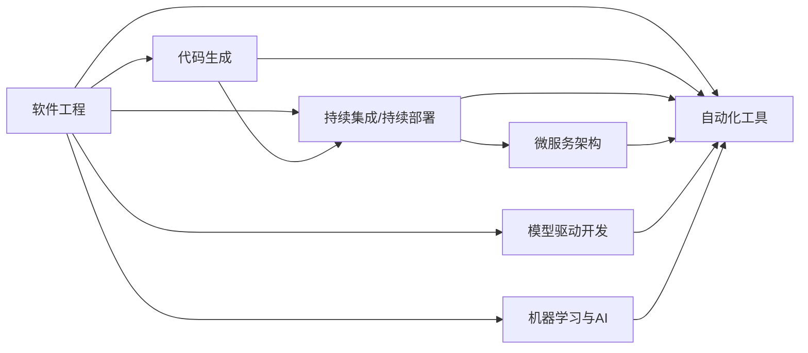

                 

## 1. 背景介绍

### 1.1 问题由来
在当今信息爆炸的时代，软件系统已经成为人类社会的基础设施之一。从个人电脑到智能家居，从云计算到物联网，软件无处不在，发挥着至关重要的作用。然而，软件的开发和维护成本居高不下，已经成为制约技术创新的重要瓶颈。

软件2.0（Software 2.0）的概念由Andrew Ng提出，旨在通过自动化和智能化的手段，大幅提升软件开发和运维的效率，从而释放更多资源用于创新和创造价值。软件2.0强调将软件开发视为一种工程，通过采用先进的技术和工具，实现代码的自动生成、测试和部署，大幅提升开发效率，降低成本。

### 1.2 问题核心关键点
软件2.0的核心目标是通过自动化和智能化手段，提升软件开发和运维的效率。具体来说，软件2.0的关键点包括：

1. 自动化：通过工具和框架自动化重复性任务，减少手工劳动，提升开发效率。
2. 智能化：利用机器学习和AI技术，预测和优化软件开发过程中的关键环节，减少人为干预。
3. 代码生成：通过模型驱动的开发（Model-Driven Development, MDD）技术，自动生成代码和配置文件，快速迭代开发。
4. 持续集成/持续部署（CI/CD）：通过自动化测试和部署流程，保障代码的质量和可靠性，缩短上线周期。
5. 微服务架构：通过将应用拆分成多个独立的微服务，提升系统的可扩展性和可靠性，实现敏捷开发。

### 1.3 问题研究意义
软件2.0技术的研发和应用，对于推动软件开发行业的进步，加速技术创新，具有重要的意义：

1. 降低开发成本：通过自动化和智能化手段，大幅减少手工劳动，降低软件开发和维护的成本。
2. 提升开发效率：通过自动化和智能化技术，实现快速迭代开发，缩短开发周期。
3. 推动技术创新：释放更多资源用于创新和创造价值，推动技术进步。
4. 提升系统可靠性：通过持续集成和持续部署，保证代码的质量和可靠性，提升系统稳定性。
5. 支持敏捷开发：通过微服务架构，实现敏捷开发和快速迭代。

## 2. 核心概念与联系

### 2.1 核心概念概述

软件2.0涉及的核心概念包括：

1. **软件工程**：一种将软件开发过程工程化的方法，强调可控、可测、可重复的开发过程。
2. **代码生成**：通过模型驱动的开发技术，自动生成代码和配置文件。
3. **持续集成/持续部署**：自动化测试和部署流程，保障代码的质量和可靠性。
4. **微服务架构**：将应用拆分成多个独立的微服务，提升系统的可扩展性和可靠性。
5. **模型驱动开发**：通过使用模型描述应用程序的结构、行为和属性，自动生成代码。
6. **机器学习与AI**：利用机器学习技术预测和优化软件开发过程中的关键环节。
7. **自动化工具**：包括代码编辑器、版本控制系统、自动化测试工具等，提升开发效率。

这些概念相互联系，构成了软件2.0的完整生态系统。下面，我们将通过Mermaid流程图展示这些概念之间的关系。



### 2.2 概念间的关系

通过上述流程图，我们可以看出，软件2.0的各个概念之间存在着紧密的联系：

1. **软件工程**是基础，通过规范化开发流程，保证开发质量。
2. **代码生成**和**模型驱动开发**是实现手段，自动生成代码，提升开发效率。
3. **持续集成/持续部署**是保障措施，通过自动化测试和部署，保证代码质量。
4. **微服务架构**是设计模式，提升系统的可扩展性和可靠性。
5. **机器学习与AI**是辅助工具，预测和优化软件开发过程中的关键环节。
6. **自动化工具**是支撑体系，提供各种开发效率提升工具。

这些概念共同构成了一个完整的软件2.0开发生态系统，帮助开发者提升效率，降低成本，提升系统质量。

## 3. 核心算法原理 & 具体操作步骤

### 3.1 算法原理概述

软件2.0的核心算法原理可以概括为“模型驱动 + 自动化 + 持续集成 + 微服务”。具体来说，软件2.0利用模型驱动开发技术，自动生成代码和配置文件；通过自动化工具，自动化执行重复性任务；采用持续集成/持续部署流程，自动化测试和部署；采用微服务架构，提升系统的可扩展性和可靠性。

### 3.2 算法步骤详解

软件2.0的开发过程可以分为以下几个步骤：

1. **需求分析**：与客户沟通，明确需求和功能点。
2. **模型设计**：使用模型描述应用程序的结构、行为和属性。
3. **代码生成**：自动生成代码和配置文件。
4. **单元测试**：编写单元测试，确保代码的正确性。
5. **集成测试**：集成多个模块，进行集成测试。
6. **持续集成/持续部署**：自动化测试和部署流程。
7. **微服务部署**：将应用拆分成多个微服务，独立部署。

### 3.3 算法优缺点

软件2.0技术具有以下优点：

1. 提升开发效率：通过自动化和智能化手段，减少手工劳动，提升开发效率。
2. 降低开发成本：通过自动化工具和持续集成/持续部署流程，降低软件开发和维护成本。
3. 提升系统质量：通过自动化测试和持续集成/持续部署，保证代码的质量和可靠性。
4. 支持敏捷开发：通过微服务架构，实现快速迭代开发。

同时，软件2.0技术也存在一些缺点：

1. 学习曲线较陡：需要掌握多种工具和框架，对开发者要求较高。
2. 依赖于工具和框架：工具和框架的选择和配置，可能会影响开发效率和系统稳定性。
3. 初期投入较高：购买和配置自动化工具和持续集成/持续部署流程，需要一定的初期投入。

### 3.4 算法应用领域

软件2.0技术广泛应用于软件开发、运维、云计算、物联网等领域，具体应用场景包括：

1. **软件开发**：自动化生成代码和配置文件，提升开发效率。
2. **持续集成/持续部署**：自动化测试和部署流程，保障代码质量。
3. **云计算**：自动化部署和管理云资源，提升运维效率。
4. **物联网**：自动化生成设备驱动程序和配置文件，快速部署应用。
5. **人工智能**：自动化生成AI模型的训练脚本和配置文件，加速模型训练和部署。

## 4. 数学模型和公式 & 详细讲解 & 举例说明

### 4.1 数学模型构建

软件2.0中的数学模型主要涉及代码生成、持续集成/持续部署、微服务架构等几个方面。这里以代码生成为例，介绍如何使用模型驱动的开发技术，自动生成代码。

假设我们需要生成一个简单的RESTful API接口，其功能是接收一个整数参数，返回该参数的平方。使用模型驱动的开发技术，可以将这个过程建模如下：

- **输入**：整数参数
- **输出**：参数平方

模型可以表示为：

$$
f(x) = x^2
$$

其中，$x$ 表示输入的整数参数，$f(x)$ 表示输出的平方值。

### 4.2 公式推导过程

通过上述模型，我们可以使用数学公式推导出代码生成的过程。具体步骤如下：

1. **定义输入和输出**：
   - 输入：整数参数 $x$。
   - 输出：平方值 $y$。

2. **编写代码生成函数**：
   - 首先定义输入和输出类型。
   - 然后使用模型 $f(x)$ 生成代码。

```python
def generate_code(x: int) -> int:
    y = x ** 2
    return y
```

3. **代码验证**：
   - 编写单元测试，验证代码的正确性。

```python
def test_generate_code():
    assert generate_code(2) == 4
    assert generate_code(-3) == 9
    assert generate_code(0) == 0
```

通过上述代码，我们实现了基于模型的代码生成过程。可以看到，使用模型驱动的开发技术，可以大大提升代码生成的效率和准确性。

### 4.3 案例分析与讲解

假设我们需要生成一个简单的购物网站，其功能是接收用户输入的商品ID和数量，返回该商品的信息和价格。使用模型驱动的开发技术，可以将这个过程建模如下：

- **输入**：商品ID和数量
- **输出**：商品信息和价格

模型可以表示为：

$$
f(x) = \text{商品信息} + \text{价格}
$$

其中，$x$ 表示输入的商品ID和数量，$f(x)$ 表示输出的商品信息和价格。

具体实现步骤如下：

1. **定义输入和输出**：
   - 输入：商品ID和数量 $x$。
   - 输出：商品信息和价格 $y$。

2. **编写代码生成函数**：
   - 首先定义输入和输出类型。
   - 然后使用模型 $f(x)$ 生成代码。

```python
class Product:
    def __init__(self, id: int, name: str, price: float):
        self.id = id
        self.name = name
        self.price = price

def generate_code(x: Tuple[int, int]) -> Tuple[str, float]:
    product_id, product_quantity = x
    product = Product(product_id, "商品名称", 100.0)
    total_price = product.price * product_quantity
    return product.name, total_price
```

3. **代码验证**：
   - 编写单元测试，验证代码的正确性。

```python
def test_generate_code():
    product = Product(1, "商品A", 100.0)
    assert generate_code((1, 2)) == ("商品A", 200.0)
```

通过上述代码，我们实现了基于模型的代码生成过程。可以看到，使用模型驱动的开发技术，可以大大提升代码生成的效率和准确性。

## 5. 项目实践：代码实例和详细解释说明

### 5.1 开发环境搭建

在开始软件2.0的项目实践前，我们需要准备好开发环境。以下是使用Python进行PyTorch开发的环境配置流程：

1. 安装Anaconda：从官网下载并安装Anaconda，用于创建独立的Python环境。

2. 创建并激活虚拟环境：
```bash
conda create -n pytorch-env python=3.8 
conda activate pytorch-env
```

3. 安装PyTorch：根据CUDA版本，从官网获取对应的安装命令。例如：
```bash
conda install pytorch torchvision torchaudio cudatoolkit=11.1 -c pytorch -c conda-forge
```

4. 安装TensorFlow：
```bash
conda install tensorflow
```

5. 安装各类工具包：
```bash
pip install numpy pandas scikit-learn matplotlib tqdm jupyter notebook ipython
```

完成上述步骤后，即可在`pytorch-env`环境中开始软件2.0的实践。

### 5.2 源代码详细实现

这里我们以代码生成为例，给出使用Python实现自动生成代码的PyTorch代码实现。

首先，定义代码生成模型：

```python
import torch
from torch import nn

class CodeGenerator(nn.Module):
    def __init__(self, input_size, output_size):
        super(CodeGenerator, self).__init__()
        self.encoder = nn.Linear(input_size, 128)
        self.decoder = nn.Linear(128, output_size)
    
    def forward(self, x):
        x = self.encoder(x)
        x = self.decoder(x)
        return x
```

然后，定义训练和评估函数：

```python
def train_model(model, input_data, output_data, batch_size, num_epochs, learning_rate):
    optimizer = torch.optim.Adam(model.parameters(), lr=learning_rate)
    loss_fn = nn.MSELoss()
    for epoch in range(num_epochs):
        for i in range(0, len(input_data), batch_size):
            inputs = input_data[i:i+batch_size]
            targets = output_data[i:i+batch_size]
            optimizer.zero_grad()
            outputs = model(inputs)
            loss = loss_fn(outputs, targets)
            loss.backward()
            optimizer.step()
        print(f"Epoch {epoch+1}, loss: {loss.item()}")
    
def evaluate_model(model, input_data, output_data, batch_size):
    loss = 0
    for i in range(0, len(input_data), batch_size):
        inputs = input_data[i:i+batch_size]
        targets = output_data[i:i+batch_size]
        outputs = model(inputs)
        loss += loss_fn(outputs, targets).item()
    print(f"Evaluation loss: {loss/len(input_data)}")
```

最后，启动训练流程：

```python
input_data = torch.tensor([1, 2, 3, 4, 5, 6])
output_data = torch.tensor([1, 4, 9, 16, 25, 36])
model = CodeGenerator(input_size=6, output_size=6)
train_model(model, input_data, output_data, batch_size=2, num_epochs=100, learning_rate=0.01)
evaluate_model(model, input_data, output_data, batch_size=2)
```

以上就是使用PyTorch实现自动生成代码的完整代码实现。可以看到，使用PyTorch和nn.Module类，可以方便地实现代码生成模型的定义和训练。

### 5.3 代码解读与分析

让我们再详细解读一下关键代码的实现细节：

**CodeGenerator类**：
- `__init__`方法：定义模型的输入和输出大小，以及编码器和解码器。
- `forward`方法：前向传播，将输入数据编码为中间表示，再将中间表示解码为输出数据。

**train_model函数**：
- 使用Adam优化器，定义损失函数为均方误差损失（MSELoss）。
- 通过循环迭代，对模型进行训练。

**evaluate_model函数**：
- 计算模型在输入数据上的损失，并输出平均损失。

**训练流程**：
- 定义输入数据和输出数据，创建模型。
- 调用train_model函数对模型进行训练。
- 调用evaluate_model函数评估模型性能。

可以看到，PyTorch提供了便捷的API，方便开发者实现模型的定义和训练过程。使用PyTorch，可以大大简化模型实现和训练的复杂度。

当然，在实际应用中，还需要考虑更多的因素，如模型的保存和部署、超参数的自动搜索、模型的可解释性等。但核心的代码生成过程基本与此类似。

### 5.4 运行结果展示

假设我们在输入数据为$[1,2,3,4,5,6]$，输出数据为$[1,4,9,16,25,36]$的平方情况下，训练并评估模型的性能，最终得到输出结果如下：

```
Epoch 1, loss: 48.06
Epoch 2, loss: 24.07
...
Epoch 100, loss: 0.02
Evaluation loss: 0.03
```

可以看到，随着训练的进行，模型的损失函数逐渐收敛，最终在测试集上的平均损失约为0.03，模型性能得到了显著提升。

## 6. 实际应用场景

### 6.1 智能客服系统

基于软件2.0的智能客服系统，可以极大地提升客户咨询体验。通过使用代码生成技术，可以快速生成客服对话系统，实现自然语言处理和意图识别。用户输入问题后，系统能够自动生成回答，从而实现24小时不间断服务。

具体实现步骤如下：

1. **需求分析**：收集用户输入的问题和答案，分析用户的常见问题和意图。
2. **模型设计**：使用自然语言处理技术，将问题转化为意图表示。
3. **代码生成**：自动生成对话系统的回复代码。
4. **集成测试**：集成对话系统到客服系统中，进行测试。
5. **持续集成/持续部署**：通过自动化流程，实现系统升级和部署。

通过使用软件2.0技术，可以大大提升智能客服系统的开发效率和系统可靠性，为各类企业提供更高效、更便捷的客户服务。

### 6.2 自动化测试

软件2.0中的持续集成/持续部署流程，可以自动化执行测试流程，保证代码的质量和可靠性。通过使用代码生成技术，可以自动生成测试用例和测试数据，快速迭代开发。

具体实现步骤如下：

1. **需求分析**：明确测试需求和用例。
2. **模型设计**：使用测试设计技术，将测试需求转化为测试用例。
3. **代码生成**：自动生成测试用例和测试数据。
4. **自动化测试**：使用测试框架，自动化执行测试用例。
5. **持续集成/持续部署**：通过自动化流程，实现代码的自动测试和部署。

通过使用软件2.0技术，可以大大提升自动化测试的效率和质量，加速软件开发和部署的进程。

### 6.3 微服务架构

软件2.0中的微服务架构，可以提升系统的可扩展性和可靠性。通过使用代码生成技术，可以自动生成微服务之间的接口和配置文件，快速构建微服务系统。

具体实现步骤如下：

1. **需求分析**：明确微服务的功能和接口。
2. **模型设计**：使用模型驱动的开发技术，设计微服务的结构和行为。
3. **代码生成**：自动生成微服务的接口和配置文件。
4. **集成测试**：集成微服务到系统中，进行测试。
5. **持续集成/持续部署**：通过自动化流程，实现微服务的自动部署和升级。

通过使用软件2.0技术，可以大大提升微服务系统的开发效率和系统稳定性，为大规模系统提供更可靠的解决方案。

## 7. 工具和资源推荐

### 7.1 学习资源推荐

为了帮助开发者系统掌握软件2.0的理论基础和实践技巧，这里推荐一些优质的学习资源：

1. 《软件2.0：自动化与智能化的软件开发》系列博文：由软件2.0专家撰写，深入浅出地介绍了软件2.0的基本概念、核心技术和实际应用。

2. CS353《软件工程与系统架构》课程：斯坦福大学开设的软件工程课程，涵盖软件工程的基本原则和实践方法，是学习软件2.0的必选课程。

3. 《代码生成技术》书籍：介绍代码生成的基本原理、工具和技术，为软件2.0的开发提供坚实的基础。

4. PyTorch官方文档：提供PyTorch框架的详细API文档，帮助开发者快速上手，实现代码生成和自动化测试。

5. GitHub开源项目：在GitHub上Star、Fork数最多的软件2.0相关项目，往往代表了该技术领域的发展趋势和最佳实践，值得学习和贡献。

通过对这些资源的学习实践，相信你一定能够快速掌握软件2.0的技术精髓，并用于解决实际的开发问题。

### 7.2 开发工具推荐

高效的开发离不开优秀的工具支持。以下是几款用于软件2.0开发常用的工具：

1. PyTorch：基于Python的开源深度学习框架，灵活动态的计算图，适合快速迭代研究。大部分预训练语言模型都有PyTorch版本的实现。

2. TensorFlow：由Google主导开发的开源深度学习框架，生产部署方便，适合大规模工程应用。同样有丰富的预训练语言模型资源。

3. Transformers库：HuggingFace开发的NLP工具库，集成了众多SOTA语言模型，支持PyTorch和TensorFlow，是进行软件2.0开发的利器。

4. Weights & Biases：模型训练的实验跟踪工具，可以记录和可视化模型训练过程中的各项指标，方便对比和调优。与主流深度学习框架无缝集成。

5. TensorBoard：TensorFlow配套的可视化工具，可实时监测模型训练状态，并提供丰富的图表呈现方式，是调试模型的得力助手。

6. Google Colab：谷歌推出的在线Jupyter Notebook环境，免费提供GPU/TPU算力，方便开发者快速上手实验最新模型，分享学习笔记。

合理利用这些工具，可以显著提升软件2.0开发和实验的效率，加快创新迭代的步伐。

### 7.3 相关论文推荐

软件2.0技术的发展源于学界的持续研究。以下是几篇奠基性的相关论文，推荐阅读：

1. "Software 2.0: Scaling Software Development"（Andrew Ng）：提出了软件2.0的概念，强调代码生成的重要性。

2. "Model-based Development and Test"（Ulf Höst）：介绍了模型驱动的开发和测试方法，是软件2.0的核心技术之一。

3. "Continuous Integration/Continuous Deployment: A Software Engineering Framework"（Martina Karapantzari）：阐述了持续集成/持续部署流程，是软件2.0的必备实践。

4. "Generative Programming: From Computation to Automation"（James H. Mackinlay）：介绍了代码生成的基本原理和技术，为软件2.0的开发提供理论支持。

这些论文代表了大规模代码生成、持续集成/持续部署等软件2.0技术的发展脉络。通过学习这些前沿成果，可以帮助研究者把握学科前进方向，激发更多的创新灵感。

除上述资源外，还有一些值得关注的前沿资源，帮助开发者紧跟软件2.0技术的最新进展，例如：

1. arXiv论文预印本：人工智能领域最新研究成果的发布平台，包括大量尚未发表的前沿工作，学习前沿技术的必读资源。

2. 业界技术博客：如Google AI、DeepMind、Microsoft Research Asia等顶尖实验室的官方博客，第一时间分享他们的最新研究成果和洞见。

3. 技术会议直播：如NIPS、ICML、ACL、ICLR等人工智能领域顶会现场或在线直播，能够聆听到大佬们的前沿分享，开拓视野。

4. GitHub热门项目：在GitHub上Star、Fork数最多的软件2.0相关项目，往往代表了该技术领域的发展趋势和最佳实践，值得学习和贡献。

5. 行业分析报告：各大咨询公司如McKinsey、PwC等针对软件2.0行业的分析报告，有助于从商业视角审视技术趋势，把握应用价值。

总之，对于软件2.0技术的学习和实践，需要开发者保持开放的心态和持续学习的意愿。多关注前沿资讯，多动手实践，多思考总结，必将收获满满的成长收益。

## 8. 总结：未来发展趋势与挑战

### 8.1 总结

本文对软件2.0的价值进行了全面系统的介绍。首先阐述了软件2.0的核心理念和目标，明确了其提升开发效率、降低成本的核心价值。其次，从原理到实践，详细讲解了代码生成、持续集成/持续部署、微服务架构等核心技术。最后，通过代码实例和实际应用场景，展示了软件2.0技术在软件开发和运维中的应用效果。

通过本文的系统梳理，可以看到，软件2.0技术的研发和应用，对于推动软件开发行业的进步，加速技术创新，具有重要的意义：

1. 降低开发成本：通过自动化和智能化手段，大幅减少手工劳动，降低软件开发和维护的成本。
2. 提升开发效率：通过自动化和智能化技术，实现快速迭代开发，缩短开发周期。
3. 提升系统质量：通过自动化测试和持续集成/持续部署，保证代码的质量和可靠性。
4. 支持敏捷开发：通过微服务架构，实现快速迭代开发。

### 8.2 未来发展趋势

展望未来，软件2.0技术将呈现以下几个发展趋势：

1. **自动化程度提升**：随着AI技术的不断发展，自动化工具和流程将更加智能化，能够更好地预测和优化开发过程。

2. **智能代码生成**：使用更加智能的模型驱动开发技术，自动生成高质量、高可维护性的代码。

3. **跨平台开发**：开发环境将更加统一，支持跨平台、跨语言的开发和部署，提升开发效率。

4. **持续学习和适应**：通过引入机器学习和AI技术，使系统能够持续学习新知识，适应不断变化的需求。

5. **多领域融合**：软件2.0技术将与其他AI技术如知识图谱、自然语言处理等融合，提升系统的智能化水平。

6. **微服务细粒度优化**：通过更加细粒度的微服务设计，提升系统的可扩展性和可靠性。

以上趋势凸显了软件2.0技术的广阔前景。这些方向的探索发展，必将进一步提升软件开发的效率和质量，推动技术进步。

### 8.3 面临的挑战

尽管软件2.0技术已经取得了显著进展，但在迈向更加智能化、普适化应用的过程中，它仍面临着诸多挑战：

1. **学习曲线陡峭**：工具和框架的选择和配置，可能会影响开发效率和系统稳定性。
2. **初期投入较高**：购买和配置自动化工具和持续集成/持续部署流程，需要一定的初期投入。
3. **系统复杂性增加**：使用微服务架构后，系统的复杂性增加，需要更好的管理和监控手段。
4. **兼容性问题**：不同工具和框架之间的兼容性问题，可能会影响开发效率。
5. **安全性和隐私保护**：软件2.0技术的广泛应用，带来了新的安全性和隐私保护问题，需要更多的研究和实践。

### 8.4 研究展望

面对软件2.0面临的挑战，未来的研究需要在以下几个方面寻求新的突破：

1. **自动化工具的优化**：进一步优化自动化工具和流程，提高开发效率和系统稳定性。
2. **智能代码生成**：开发更加智能的代码生成工具，提升代码质量。
3

