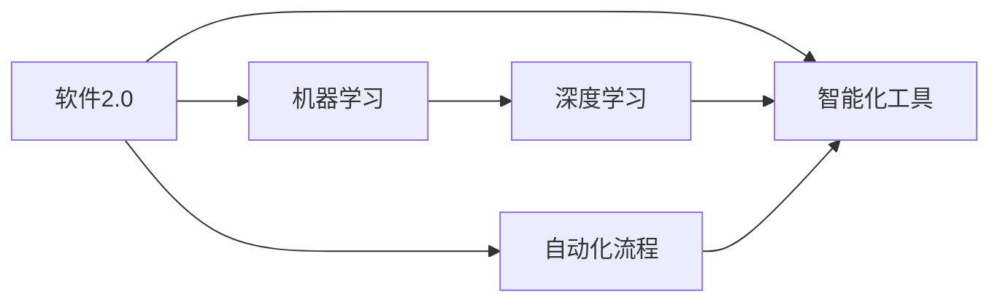
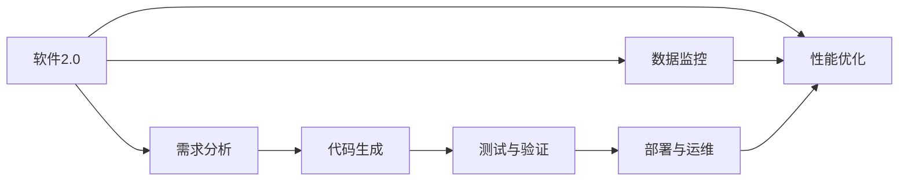

                 

## 1. 背景介绍

在信息技术高速发展的今天，软件已经成为推动各行各业创新和增长的核心驱动力。然而，随着软件复杂度的不断提升，其开发、维护和部署的成本也随之上升，成为企业技术转型中的一大瓶颈。为应对这一挑战，软件开发模式经历了从瀑布模型到敏捷开发，再到DevOps的演进，不断探索更加高效、自动化的开发方式。其中，以软件2.0（Software 2.0）为代表的新兴范式，在提升软件效率和创造价值方面展示了巨大的潜力。

### 1.1 问题由来

软件开发的高成本和低效率一直是困扰企业发展的难题。传统软件开发模式主要依赖人工编写、测试和部署代码，每个环节都需要大量的人力和时间投入。这种依赖人工的开发方式，不仅难以满足快速变化的市场需求，还容易导致代码质量低下、维护成本高昂等问题。为了应对这些问题，软件工程师们探索了各种自动化技术，如测试驱动开发（TDD）、持续集成（CI）和持续交付（CD）等，旨在通过自动化流程提升开发效率，但这些技术在实际应用中仍存在许多局限性。

### 1.2 问题核心关键点

软件2.0范式正是在这一背景下提出的，旨在通过人工智能和大数据技术，实现软件的自动化和智能化开发。其主要特点是：

1. **自动化**：利用机器学习和数据挖掘技术，自动生成代码、测试、优化等自动化流程，减少人工干预。
2. **智能化**：通过对软件开发过程的数据进行学习，优化开发流程，提升代码质量，减少重构需求。
3. **可预测性**：基于历史数据和实时监控，预测软件开发进度和成本，帮助企业制定更科学的资源分配计划。

这些关键点使得软件2.0范式在提升开发效率和降低成本方面具有显著优势，正逐渐成为软件开发领域的新趋势。

### 1.3 问题研究意义

软件2.0范式在提升软件开发效率和降低成本方面具有重要意义：

1. **提升开发效率**：通过自动化和智能化技术，减少人工操作，快速响应市场需求。
2. **降低开发成本**：自动化流程减少了人力和时间投入，降低了开发和维护成本。
3. **优化资源配置**：基于可预测性分析，合理分配开发资源，提高资源利用率。
4. **提高代码质量**：智能化工具自动检测和修复代码缺陷，提升代码质量。
5. **增强可预测性**：通过数据分析和机器学习，对软件开发进度和成本进行精确预测，帮助企业更好地管理项目。

## 2. 核心概念与联系

### 2.1 核心概念概述

要理解软件2.0范式，首先需要掌握其核心概念：

1. **软件2.0**：指的是通过人工智能和大数据技术，实现软件的自动化和智能化开发，使开发过程更加高效、可预测、可控。
2. **机器学习（ML）**：利用统计学和计算机科学方法，让机器通过学习数据自动改进性能。
3. **深度学习（DL）**：一种特殊的机器学习技术，使用多层神经网络进行复杂数据处理。
4. **自动化流程（Automation）**：通过编程实现的一系列自动化任务，减少人工干预。
5. **智能化工具（Intelligent Tools）**：利用AI技术，自动生成、测试、优化代码等。

这些核心概念之间存在紧密的联系，通过合纵连横，共同构建了软件2.0的开发生态系统。

### 2.2 概念间的关系

这些核心概念之间的关系可以用以下Mermaid流程图来展示：



### 2.3 核心概念的整体架构

软件2.0的整体架构可以表示为：



在这个架构中，软件2.0通过自动化流程和智能化工具，实现了从需求分析到部署运维的全流程自动化。同时，数据监控和性能优化确保了开发过程的可预测性和可控性。

## 3. 核心算法原理 & 具体操作步骤
### 3.1 算法原理概述

软件2.0的核心算法原理主要基于机器学习和深度学习技术，通过对软件开发过程的数据进行学习，实现自动化和智能化开发。具体来说，软件2.0包括以下几个关键步骤：

1. **数据收集与清洗**：收集软件开发过程中的各项数据，如代码变动、测试结果、错误日志等，并进行清洗和预处理。
2. **特征提取**：从清洗后的数据中提取有意义的特征，用于训练机器学习模型。
3. **模型训练**：使用机器学习算法（如决策树、随机森林、神经网络等）对数据进行训练，生成自动化和智能化工具。
4. **自动化流程实现**：将训练好的模型应用到软件开发流程中，实现代码生成、测试、优化等自动化任务。
5. **智能化工具应用**：通过智能化工具，对开发过程进行监控和优化，提升开发效率和代码质量。

### 3.2 算法步骤详解

软件2.0的算法步骤可以进一步细化为：

1. **数据收集与清洗**
    - 数据来源：代码库、测试报告、错误日志、版本控制系统等。
    - 数据清洗：去重、异常值处理、缺失值填充等。

2. **特征提取**
    - 特征选择：选择对模型预测有重要影响的特征，如代码行数、函数调用次数、测试覆盖率等。
    - 特征工程：对提取的特征进行归一化、降维等处理。

3. **模型训练**
    - 选择模型：根据任务特点选择适合的机器学习算法，如随机森林、支持向量机等。
    - 训练与优化：使用训练数据集进行模型训练，并使用验证集进行调参和优化。

4. **自动化流程实现**
    - 代码生成：使用模型自动生成代码，如通过自然语言描述生成代码等。
    - 测试与验证：使用模型自动生成测试用例，进行自动化测试和验证。
    - 性能优化：使用模型对代码进行性能分析和优化，如代码重构、代码优化等。

5. **智能化工具应用**
    - 监控与预警：使用模型对开发过程进行实时监控，及时发现和预警问题。
    - 预测与优化：使用模型预测开发进度和成本，进行资源优化。

### 3.3 算法优缺点

软件2.0的算法具有以下优点：

1. **提升开发效率**：自动化和智能化工具减少了人工干预，提高了开发效率。
2. **降低开发成本**：减少了人工操作和维护成本，降低了开发和运维成本。
3. **优化资源配置**：通过数据分析和机器学习，优化资源分配，提高资源利用率。

然而，软件2.0也存在一些缺点：

1. **数据依赖性高**：对数据的依赖性较强，数据质量和完整性直接影响模型效果。
2. **算法复杂度高**：算法复杂度较高，需要大量的计算资源和数据。
3. **结果解释性不足**：自动化和智能化工具的决策过程难以解释，缺乏可解释性。

### 3.4 算法应用领域

软件2.0的算法已在多个领域得到应用，例如：

1. **软件开发**：代码生成、测试、优化等自动化流程。
2. **测试工程**：自动化测试用例生成、测试结果分析等。
3. **运维管理**：系统监控、异常预警、性能优化等。
4. **需求分析**：需求自动解析、需求变化预测等。
5. **持续交付**：自动化部署、版本管理等。

## 4. 数学模型和公式 & 详细讲解 & 举例说明

### 4.1 数学模型构建

软件2.0的数学模型主要涉及机器学习和深度学习的算法。以回归模型为例，其基本数学模型为：

$$ y = \theta_0 + \theta_1 x_1 + \theta_2 x_2 + \ldots + \theta_n x_n + \epsilon $$

其中，$y$为预测结果，$x_1, x_2, \ldots, x_n$为特征向量，$\theta_0, \theta_1, \ldots, \theta_n$为模型参数，$\epsilon$为误差项。

### 4.2 公式推导过程

假设我们有一个回归问题，目标是预测房价$y$，已有的特征包括房屋面积$x_1$、房间数量$x_2$、地理位置$x_3$等。使用线性回归模型，通过最小化损失函数$\mathcal{L}$来拟合数据，推导过程如下：

1. **模型训练**
    - 损失函数：均方误差损失函数$\mathcal{L} = \frac{1}{2N} \sum_{i=1}^N (y_i - \hat{y_i})^2$
    - 参数更新：$\theta = \theta - \eta \frac{\partial \mathcal{L}}{\partial \theta}$，其中$\eta$为学习率。

2. **模型预测**
    - 预测值：$\hat{y} = \theta_0 + \theta_1 x_1 + \theta_2 x_2 + \ldots + \theta_n x_n$

3. **性能评估**
    - 均方误差：$\text{MSE} = \frac{1}{N} \sum_{i=1}^N (y_i - \hat{y_i})^2$
    - 决定系数：$R^2 = 1 - \frac{\text{SSR}}{\text{SST}}$，其中$\text{SSR}$为回归平方和，$\text{SST}$为总平方和。

### 4.3 案例分析与讲解

以房价预测为例，假设我们收集了100个房屋的数据，包括面积、房间数量和地理位置。使用线性回归模型进行训练，得到以下模型参数：

- $\theta_0 = 10$
- $\theta_1 = 2$
- $\theta_2 = 1$
- $\theta_3 = 0.5$

使用模型进行预测，假设一个面积为120平方米、房间数量为3、地理位置为5的房屋，其预测房价为：

$$ \hat{y} = 10 + 2 \times 120 + 1 \times 3 + 0.5 \times 5 = 287.5 $$

### 5. 项目实践：代码实例和详细解释说明

#### 5.1 开发环境搭建

1. 安装Python：从官网下载并安装Python 3.x版本。
2. 安装TensorFlow：使用pip命令安装TensorFlow 2.x版本，如：
    ```bash
    pip install tensorflow==2.4
    ```
3. 安装Keras：作为TensorFlow的高层API，使用pip命令安装Keras：
    ```bash
    pip install keras
    ```

完成上述步骤后，即可在本地搭建好Python开发环境。

#### 5.2 源代码详细实现

以下是一个简单的房价预测模型实现，使用线性回归模型进行训练和预测：

```python
import tensorflow as tf
from tensorflow import keras
import numpy as np

# 创建训练数据
x_train = np.array([[120, 3, 5], [140, 4, 7], [160, 5, 9], [180, 3, 5]])
y_train = np.array([287.5, 310.0, 345.5, 315.0])

# 定义模型
model = keras.Sequential([
    keras.layers.Dense(1, input_shape=(3,))
])

# 编译模型
model.compile(optimizer='sgd', loss='mean_squared_error')

# 训练模型
model.fit(x_train, y_train, epochs=100, verbose=0)

# 预测房价
x_test = np.array([[160, 4, 9]])
y_pred = model.predict(x_test)
print("预测房价为：", y_pred)
```

运行上述代码，即可训练出一个简单的线性回归模型，并使用模型进行房价预测。

#### 5.3 代码解读与分析

代码中，首先使用NumPy创建训练数据和标签。接着定义了一个包含一个全连接层的Keras模型，该模型接收3个特征输入，输出一个房价预测值。使用SGD优化器和均方误差损失函数进行模型编译。最后使用`fit`方法对模型进行训练，并使用`predict`方法进行预测。

## 6. 实际应用场景

### 6.1 软件开发

软件2.0在软件开发中的应用包括：

1. **代码自动生成**：使用机器学习模型根据代码片段生成新的代码，如使用自然语言描述生成代码。
2. **代码自动测试**：使用机器学习模型生成测试用例，自动测试代码的正确性。
3. **代码优化**：使用机器学习模型对代码进行性能分析和优化，如代码重构、代码优化等。

### 6.2 测试工程

软件2.0在测试工程中的应用包括：

1. **测试用例生成**：使用机器学习模型根据代码片段自动生成测试用例，提高测试覆盖率。
2. **测试结果分析**：使用机器学习模型对测试结果进行分析，识别出代码中的缺陷和问题。
3. **性能评估**：使用机器学习模型对测试结果进行性能评估，优化测试流程。

### 6.3 运维管理

软件2.0在运维管理中的应用包括：

1. **系统监控**：使用机器学习模型对系统运行状态进行监控，及时发现异常。
2. **异常预警**：使用机器学习模型对异常数据进行预测，及时进行预警和处理。
3. **性能优化**：使用机器学习模型对系统性能进行优化，提高系统运行效率。

### 6.4 未来应用展望

未来，软件2.0的应用将更加广泛，涵盖更多的领域和场景。例如：

1. **金融科技**：使用软件2.0进行智能投研、风险管理、客户服务等。
2. **医疗健康**：使用软件2.0进行疾病预测、治疗方案推荐、患者管理等。
3. **智能制造**：使用软件2.0进行设备监控、故障预测、生产优化等。
4. **智慧城市**：使用软件2.0进行城市交通管理、环境监测、智能安防等。

## 7. 工具和资源推荐

### 7.1 学习资源推荐

1. **《深度学习》书籍**：Ian Goodfellow、Yoshua Bengio和Aaron Courville合著的深度学习经典教材，涵盖了深度学习的基本概念和算法。
2. **Coursera深度学习课程**：由Andrew Ng教授开设的深度学习在线课程，内容全面、系统，适合初学者和进阶者。
3. **Kaggle数据科学竞赛平台**：提供大量开源数据集和竞赛，通过实际项目提升数据分析和机器学习技能。
4. **GitHub开源项目**：查找和使用开源的机器学习和深度学习项目，学习其代码实现和应用场景。
5. **Google Colab**：谷歌提供的免费Jupyter Notebook环境，支持GPU和TPU，方便进行深度学习实验和项目开发。

### 7.2 开发工具推荐

1. **TensorFlow**：谷歌开发的深度学习框架，支持分布式计算和GPU加速，适合大规模深度学习项目。
2. **Keras**：TensorFlow的高层API，简单易用，适合快速开发和原型设计。
3. **PyTorch**：Facebook开发的深度学习框架，支持动态计算图，适合研究和实验性项目。
4. **Jupyter Notebook**：支持交互式编程和数据可视化，方便进行机器学习实验和报告撰写。
5. **Scikit-learn**：基于NumPy和SciPy的机器学习库，提供了多种常用算法和工具函数。

### 7.3 相关论文推荐

1. **《神经网络与深度学习》**：Michael Nielsen所著，介绍了神经网络的基本原理和深度学习的发展历程。
2. **《深度学习中的反向传播》**：Yoshua Bengio、Geoffrey Hinton和Christopher J.C. Burges合著，深入浅出地介绍了反向传播算法及其应用。
3. **《机器学习实战》**：Peter Harrington所著，提供了大量的代码示例和实战案例，适合初学者入门。
4. **《TensorFlow实战》**：Alex Chung所著，介绍了TensorFlow的基本用法和实用技巧，适合TensorFlow开发者参考。
5. **《Keras实战》**：Jake VanderPlas所著，介绍了Keras的基本用法和实战案例，适合Keras开发者参考。

## 8. 总结：未来发展趋势与挑战

### 8.1 研究成果总结

软件2.0在提升软件开发效率和降低成本方面展现了巨大潜力。通过自动化和智能化技术，软件2.0能够显著减少人工操作和维护成本，提高开发和运维效率，优化资源配置。然而，软件2.0的实际应用还面临数据依赖性高、算法复杂度高、结果解释性不足等挑战，需要进一步研究和优化。

### 8.2 未来发展趋势

未来，软件2.0的发展趋势如下：

1. **数据驱动开发**：基于数据驱动的开发方式，减少人工干预，提高开发效率。
2. **模型自适应**：使用自适应模型，根据开发过程实时优化算法和参数，提高模型效果。
3. **跨领域融合**：将软件2.0与其他技术（如区块链、物联网等）进行融合，拓展应用场景。
4. **智能化运维**：基于机器学习对运维过程进行智能化分析，提高运维效率和稳定性。
5. **人机协同**：通过智能化工具和人工协作，实现更高质量的开发和维护。

### 8.3 面临的挑战

软件2.0在实际应用中还面临以下挑战：

1. **数据质量和完整性**：数据质量和完整性直接影响模型效果，如何保证高质量的数据输入是关键问题。
2. **算法复杂度和效率**：算法复杂度和计算资源消耗较高，需要优化算法和硬件资源。
3. **结果解释性和可控性**：智能化工具的决策过程难以解释，缺乏可解释性和可控性。
4. **跨领域应用**：不同领域的业务逻辑和技术需求不同，如何构建通用的软件2.0解决方案是一大挑战。

### 8.4 研究展望

未来，软件2.0的研究方向包括：

1. **数据增强和合成**：通过数据增强和合成技术，提高数据质量和多样性，增强模型效果。
2. **模型压缩和优化**：通过模型压缩和优化技术，降低计算资源消耗，提高模型效率。
3. **跨领域模型迁移**：通过模型迁移学习，实现跨领域知识的共享和应用。
4. **实时监测和预警**：通过实时监测和预警技术，提高系统可靠性和安全性。
5. **人机协作智能**：通过人机协作智能技术，实现更高质量的开发和运维。

## 9. 附录：常见问题与解答

### Q1：软件2.0和机器学习、深度学习的区别是什么？

A：软件2.0是基于机器学习和深度学习的软件开发范式，主要目的是提升软件开发效率和降低成本。机器学习和深度学习是其中的技术手段，通过数据驱动的方式实现自动化和智能化开发。

### Q2：软件2.0在实际应用中如何保证数据的质量和完整性？

A：在数据收集和处理阶段，可以通过数据清洗、数据增强、数据合成等技术手段提高数据质量和完整性。同时，需要对数据进行定期检查和验证，确保数据准确性和一致性。

### Q3：软件2.0在实际应用中如何保证模型的可解释性？

A：通过引入可解释性技术，如特征重要性分析、模型可视化、决策树等，帮助开发者理解模型的决策过程。同时，可以通过人工干预和审核，确保模型的决策结果符合业务逻辑和道德规范。

### Q4：软件2.0在实际应用中如何处理跨领域应用的问题？

A：通过模型迁移学习和领域适应技术，将软件2.0应用于不同领域时，可以保留通用的模型架构和算法，同时针对特定领域的业务需求进行微调和优化。

### Q5：软件2.0在实际应用中如何处理数据隐私和安全问题？

A：在数据处理和存储阶段，需要遵守数据隐私和安全法规，如GDPR等。同时，需要对数据进行匿名化和加密处理，防止数据泄露和滥用。

---

作者：禅与计算机程序设计艺术 / Zen and the Art of Computer Programming

