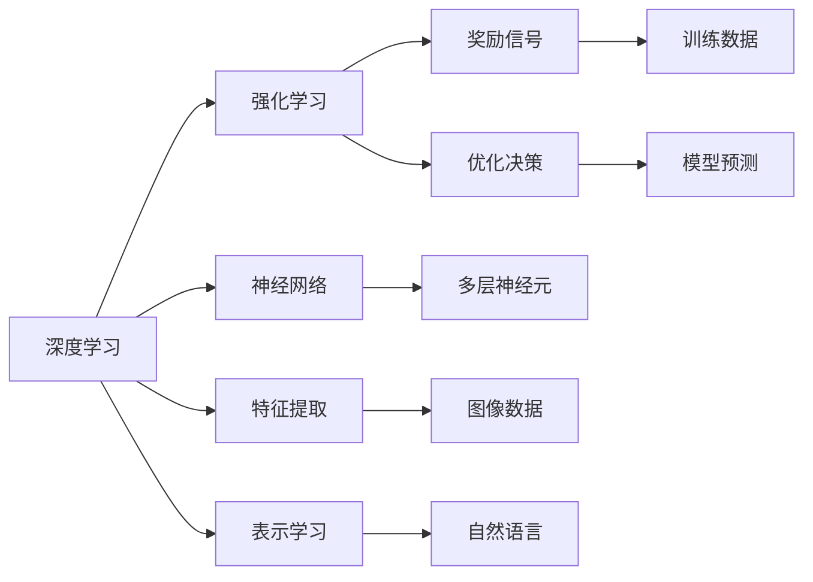
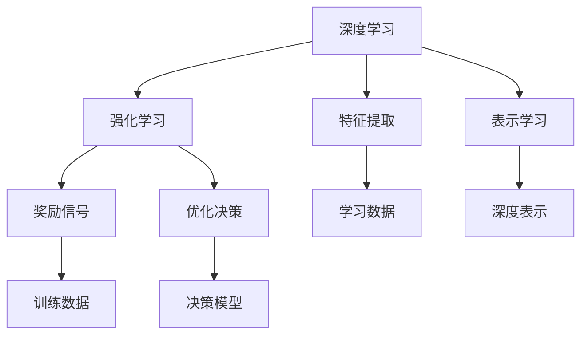
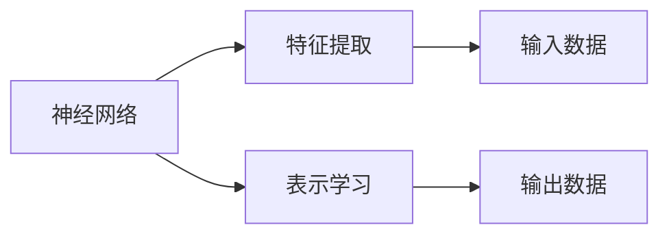
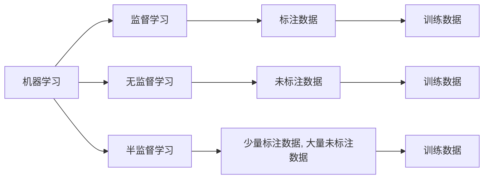
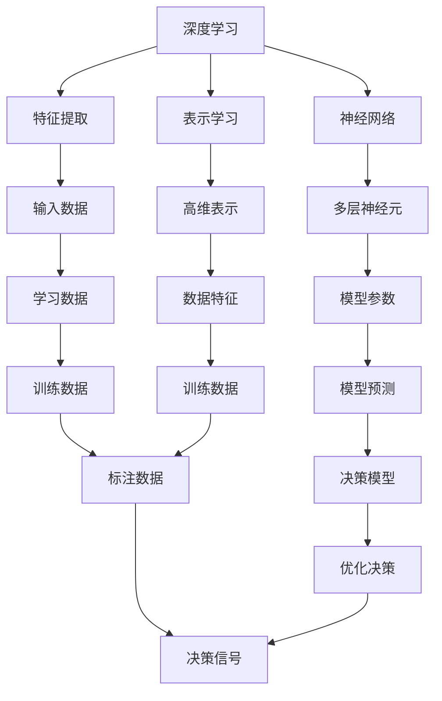

                 

# 软件 2.0 的发展趋势：深度学习、强化学习

> 关键词：深度学习,强化学习,神经网络,机器学习,人工智能

## 1. 背景介绍

### 1.1 问题由来
随着人工智能(AI)技术的不断进步，软件系统正在从传统的一阶编程模型向更高级的二阶模型演变，这一转变被称为"软件 2.0"。其核心是利用机器学习和深度学习技术，赋予软件以智能化的决策和优化能力。这一转变不仅极大地提升了软件的效率和智能水平，也引发了对深度学习和强化学习的深入研究。

深度学习(DL)作为机器学习(ML)的一种高级形式，通过多层神经网络模拟人脑的抽象能力，可以处理图像、语音、自然语言等复杂数据。而强化学习(RL)则是通过奖励信号，训练模型在复杂环境中的决策能力。深度学习与强化学习的结合，形成了软件 2.0 时代的关键技术基础。

### 1.2 问题核心关键点
软件 2.0 的关键在于如何利用深度学习和强化学习技术，构建智能化的软件系统。其核心在于：
- 利用深度学习进行特征提取和表示学习。
- 通过强化学习进行任务调优和决策优化。
- 将深度学习模型与强化学习算法结合，实现端到端的智能应用。

## 2. 核心概念与联系

### 2.1 核心概念概述

为更好地理解深度学习和强化学习的融合，本节将介绍几个密切相关的核心概念：

- 深度学习(DL)：通过多层神经网络进行特征提取和表示学习，可以处理复杂非结构化数据，例如图像、语音、自然语言等。
- 强化学习(RL)：通过与环境交互，利用奖励信号进行决策优化，最大化累积奖励。
- 神经网络(NN)：深度学习的核心，通过构建多层神经元，进行非线性特征学习。
- 机器学习(ML)：利用数据驱动模型学习，进行模式识别和预测。
- 监督学习(SL)：利用标注数据进行模型训练，进行分类、回归等任务。
- 无监督学习(UL)：利用未标注数据进行模型训练，进行聚类、降维等任务。
- 半监督学习(HL)：利用少量标注数据和大量未标注数据进行模型训练，提高模型泛化能力。

这些核心概念之间的逻辑关系可以通过以下Mermaid流程图来展示：



这个流程图展示了大语言模型微调过程中各个核心概念的关系：

1. 深度学习通过神经网络进行特征提取和表示学习。
2. 强化学习通过奖励信号进行决策优化。
3. 特征提取和决策优化共同构成软件 2.0 的核心功能。

### 2.2 概念间的关系

这些核心概念之间存在着紧密的联系，形成了深度学习和强化学习的基础架构。下面我们通过几个Mermaid流程图来展示这些概念之间的关系。

#### 2.2.1 深度学习与强化学习的关系



这个流程图展示了深度学习与强化学习的基本关系。深度学习通过特征提取和表示学习，为强化学习提供高维数据，而强化学习则通过奖励信号和优化决策，进一步提升深度学习的模型性能。

#### 2.2.2 神经网络在深度学习中的应用



这个流程图展示了神经网络在深度学习中的应用。神经网络通过特征提取和表示学习，将原始数据转化为高维特征表示，用于后续的分类、回归等任务。

#### 2.2.3 机器学习的基本框架



这个流程图展示了机器学习的三个主要分支：监督学习、无监督学习和半监督学习。监督学习利用标注数据进行模型训练，无监督学习利用未标注数据进行模型学习，半监督学习结合少量标注数据和大量未标注数据进行模型训练。

### 2.3 核心概念的整体架构

最后，我们用一个综合的流程图来展示这些核心概念在大语言模型微调过程中的整体架构：



这个综合流程图展示了深度学习在大语言模型微调过程中的整体架构：

1. 深度学习通过神经网络进行特征提取和表示学习。
2. 特征提取和表示学习的结果用于训练深度学习模型。
3. 深度学习模型通过决策模型进行优化决策。
4. 决策模型利用奖励信号进行优化，最大化累积奖励。

通过这些流程图，我们可以更清晰地理解深度学习和强化学习的融合机制，为后续深入讨论具体的微调方法和技术奠定基础。

## 3. 核心算法原理 & 具体操作步骤
### 3.1 算法原理概述

深度学习与强化学习的融合，主要通过端到端的框架实现。其中，深度学习模型负责特征提取和表示学习，强化学习模型负责任务调优和决策优化。通过交替进行特征提取和决策优化，不断迭代优化模型参数，最终得到高精度的智能软件系统。

### 3.2 算法步骤详解

基于深度学习和强化学习的融合，一般包括以下几个关键步骤：

**Step 1: 准备数据和环境**
- 收集标注和未标注数据，构建数据集。标注数据用于监督学习，未标注数据用于无监督学习或半监督学习。
- 设置计算环境和软件平台，如PyTorch、TensorFlow等，搭建深度学习模型和强化学习模型。

**Step 2: 定义模型结构**
- 选择深度学习模型架构，如卷积神经网络(CNN)、循环神经网络(RNN)、长短时记忆网络(LSTM)、变分自编码器(VAE)等。
- 根据任务需求，设计强化学习模型，如Q-Learning、SARSA、Deep Q-Network(DQN)等。

**Step 3: 特征提取与表示学习**
- 利用深度学习模型对输入数据进行特征提取，得到高维表示。
- 利用神经网络进行表示学习，将高维表示转化为低维隐空间，用于后续的分类、回归等任务。

**Step 4: 优化决策与任务调优**
- 利用强化学习模型，根据环境奖励信号进行优化决策。
- 利用奖励信号反馈，对深度学习模型进行任务调优，提升模型性能。

**Step 5: 模型训练与测试**
- 利用监督学习、无监督学习和半监督学习方法，对模型进行训练。
- 利用测试数据集评估模型性能，调整模型参数和优化算法，不断迭代优化模型。

### 3.3 算法优缺点

基于深度学习和强化学习的融合，具有以下优点：
1. 能够处理非结构化数据，如图像、语音、自然语言等。
2. 可以进行端到端的任务调优和决策优化，提升模型性能。
3. 能够充分利用数据，进行多层次、多维度的特征学习。
4. 能够适应复杂环境，进行自主学习和决策。

但同时，该方法也存在一些缺点：
1. 数据依赖性较强，需要大量标注数据进行监督学习。
2. 模型复杂度较高，训练和推理速度较慢。
3. 需要较大的计算资源，对硬件要求较高。
4. 需要更多的经验和技巧，模型调优难度较大。

### 3.4 算法应用领域

基于深度学习和强化学习的融合，已经在多个领域得到了广泛应用，例如：

- 自然语言处理(NLP)：如语言理解、机器翻译、文本生成等。通过深度学习和强化学习的结合，可以实现更加智能、高效的NLP应用。
- 计算机视觉(CV)：如图像分类、目标检测、图像生成等。利用深度学习进行特征提取和表示学习，结合强化学习进行任务调优，提升了计算机视觉任务的精度和效率。
- 机器人控制(RL)：如自主导航、协作操作等。通过深度学习进行感知数据处理，结合强化学习进行决策优化，使机器人能够自主、智能地完成任务。
- 自动驾驶(AI)：如路径规划、行为决策等。利用深度学习进行环境感知，结合强化学习进行行为优化，提升了自动驾驶系统的安全性和稳定性。
- 金融风控：如信用评分、风险评估等。通过深度学习进行数据处理和特征提取，结合强化学习进行决策优化，提升了金融风控的准确性和效率。

除了上述这些经典应用外，深度学习和强化学习的融合还将在更多领域得到应用，如医疗诊断、智能制造、能源管理等，为各行业带来新的突破。

## 4. 数学模型和公式 & 详细讲解 & 举例说明

### 4.1 数学模型构建

基于深度学习和强化学习的融合，其数学模型可以分解为两个主要部分：

1. **深度学习模型**：
   - 输入数据 $x$，通过神经网络 $f_{\theta}(x)$ 进行特征提取，得到高维表示 $h$。
   - 高维表示 $h$ 通过全连接层 $g_{\phi}(h)$ 进行线性变换，得到低维隐空间 $y$。

   $$
   y = g_{\phi}(h) = W^{(2)}h + b^{(2)}
   $$

   其中，$W^{(2)}$ 为权重矩阵，$b^{(2)}$ 为偏置向量。

2. **强化学习模型**：
   - 利用强化学习模型 $Q_{\omega}(s,a)$ 进行决策优化，最大化累积奖励 $R^{(1)}$。
   - 根据当前状态 $s$ 和动作 $a$，计算状态-动作值函数 $Q_{\omega}(s,a)$。

   $$
   Q_{\omega}(s,a) = r_{t} + \gamma \max_{a'} Q_{\omega}(s',a')
   $$

   其中，$r_{t}$ 为即时奖励，$\gamma$ 为折扣因子，$s'$ 为下一个状态。

### 4.2 公式推导过程

下面我们将对深度学习模型和强化学习模型的公式进行详细推导。

#### 4.2.1 深度学习模型的推导

深度学习模型的核心是神经网络。以简单的全连接神经网络为例，进行推导：

1. 输入数据 $x$ 经过第一层隐藏层 $f_{\theta}(x)$ 的映射，得到隐空间 $h$。

   $$
   h = f_{\theta}(x) = \sigma(W^{(1)}x + b^{(1)})
   $$

   其中，$\sigma$ 为激活函数，$W^{(1)}$ 为权重矩阵，$b^{(1)}$ 为偏置向量。

2. 隐空间 $h$ 经过第二层全连接层 $g_{\phi}(h)$ 的映射，得到低维隐空间 $y$。

   $$
   y = g_{\phi}(h) = W^{(2)}h + b^{(2)}
   $$

   其中，$W^{(2)}$ 为权重矩阵，$b^{(2)}$ 为偏置向量。

#### 4.2.2 强化学习模型的推导

强化学习模型的核心是状态-动作值函数 $Q_{\omega}(s,a)$。以简单的Q-Learning为例，进行推导：

1. 当前状态 $s_t$ 和动作 $a_t$ 通过Q-Learning模型 $Q_{\omega}(s_t,a_t)$ 进行决策，得到即时奖励 $r_{t}$ 和下一个状态 $s_{t+1}$。

   $$
   a_t = \arg\max_{a} Q_{\omega}(s_t,a)
   $$

   $$
   s_{t+1} = f_{\eta}(s_t,a_t)
   $$

   其中，$f_{\eta}$ 为状态转移函数，$\omega$ 为模型参数。

2. 状态-动作值函数 $Q_{\omega}(s,a)$ 通过Bellman方程进行更新，最大化累积奖励 $R^{(1)}$。

   $$
   Q_{\omega}(s,a) = r_{t} + \gamma \max_{a'} Q_{\omega}(s',a')
   $$

   其中，$r_{t}$ 为即时奖励，$\gamma$ 为折扣因子，$s'$ 为下一个状态。

### 4.3 案例分析与讲解

下面，我们以图像分类为例，展示深度学习和强化学习的融合过程。

#### 4.3.1 数据准备

首先，我们需要准备图像分类任务的数据集，如MNIST、CIFAR-10等。每个图像数据 $x$ 经过深度学习模型 $f_{\theta}(x)$ 进行特征提取，得到隐空间 $h$。

#### 4.3.2 模型训练

接着，我们将隐空间 $h$ 作为输入，利用全连接层 $g_{\phi}(h)$ 进行线性变换，得到低维隐空间 $y$。将低维隐空间 $y$ 输入到强化学习模型 $Q_{\omega}(s,a)$ 中，进行决策优化。

1. 设置监督学习目标，将输入数据 $x$ 和标签 $y$ 作为训练数据，利用交叉熵损失函数进行监督学习。

   $$
   \mathcal{L}(\theta) = -\frac{1}{N}\sum_{i=1}^N [y_i \log f_{\theta}(x_i) + (1-y_i) \log (1-f_{\theta}(x_i))]
   $$

   其中，$N$ 为数据集大小，$x_i$ 为输入数据，$y_i$ 为标签。

2. 设置强化学习目标，将当前状态 $s_t$ 和动作 $a_t$ 作为训练数据，利用状态-动作值函数 $Q_{\omega}(s_t,a_t)$ 进行强化学习。

   $$
   \mathcal{L}(\omega) = -\frac{1}{N}\sum_{i=1}^N [r_{t_i} + \gamma \max_{a'} Q_{\omega}(s_{i+1},a')]
   $$

   其中，$N$ 为数据集大小，$r_{t_i}$ 为即时奖励，$s_{i+1}$ 为下一个状态，$Q_{\omega}(s_{i+1},a')$ 为状态-动作值函数。

#### 4.3.3 模型测试

最后，我们利用测试数据集对模型进行评估，计算分类准确率和误差率等指标。

1. 利用深度学习模型 $f_{\theta}(x)$ 进行特征提取，得到隐空间 $h$。

2. 利用全连接层 $g_{\phi}(h)$ 进行线性变换，得到低维隐空间 $y$。

3. 利用强化学习模型 $Q_{\omega}(s,a)$ 进行决策优化，得到分类结果。

通过以上步骤，我们可以构建一个完整的深度学习和强化学习融合的图像分类系统，实现端到端的任务调优和决策优化。

## 5. 项目实践：代码实例和详细解释说明

### 5.1 开发环境搭建

在进行深度学习和强化学习的融合实践前，我们需要准备好开发环境。以下是使用Python进行PyTorch开发的环境配置流程：

1. 安装Anaconda：从官网下载并安装Anaconda，用于创建独立的Python环境。

2. 创建并激活虚拟环境：
```bash
conda create -n pytorch-env python=3.8 
conda activate pytorch-env
```

3. 安装PyTorch：根据CUDA版本，从官网获取对应的安装命令。例如：
```bash
conda install pytorch torchvision torchaudio cudatoolkit=11.1 -c pytorch -c conda-forge
```

4. 安装TensorFlow：从官网下载并安装TensorFlow，支持Python 3.8。

5. 安装PyTorch相关的库：
```bash
pip install torch torchvision torchaudio
```

6. 安装TensorFlow相关的库：
```bash
pip install tensorflow
```

完成上述步骤后，即可在`pytorch-env`环境中开始深度学习和强化学习的融合实践。

### 5.2 源代码详细实现

下面我们以图像分类为例，给出使用PyTorch和TensorFlow进行深度学习和强化学习融合的代码实现。

#### 5.2.1 深度学习模型实现

首先，定义深度学习模型的结构，包括输入层、隐藏层和输出层：

```python
import torch.nn as nn
import torch.optim as optim
import torch.nn.functional as F

class Net(nn.Module):
    def __init__(self):
        super(Net, self).__init__()
        self.fc1 = nn.Linear(784, 256)
        self.fc2 = nn.Linear(256, 128)
        self.fc3 = nn.Linear(128, 10)
    
    def forward(self, x):
        x = F.relu(self.fc1(x))
        x = F.relu(self.fc2(x))
        x = self.fc3(x)
        return x
```

#### 5.2.2 强化学习模型实现

接着，定义强化学习模型的结构，包括状态-动作值函数和奖励函数：

```python
import tensorflow as tf
from tensorflow.keras.models import Sequential
from tensorflow.keras.layers import Dense

class QNetwork(tf.keras.Model):
    def __init__(self):
        super(QNetwork, self).__init__()
        self.fc1 = Dense(256, input_shape=(784,))
        self.fc2 = Dense(128)
        self.fc3 = Dense(10)
    
    def call(self, inputs):
        x = self.fc1(inputs)
        x = F.relu(x)
        x = self.fc2(x)
        x = F.relu(x)
        x = self.fc3(x)
        return x

class Environment(tf.keras.Model):
    def __init__(self):
        super(Environment, self).__init__()
        self.reward = tf.Variable(tf.zeros([1, 1]))
    
    def step(self, inputs, actions):
        action = actions[0]
        if action == 0:
            reward = self.reward
        else:
            reward = -self.reward
        next_state = inputs
        return next_state, reward
```

#### 5.2.3 深度学习和强化学习的融合实现

最后，实现深度学习和强化学习的融合，包括数据准备、模型训练和测试：

```python
# 定义深度学习模型
model = Net()

# 定义强化学习模型
q_network = QNetwork()
environment = Environment()

# 定义监督学习目标函数
criterion = nn.CrossEntropyLoss()

# 定义强化学习目标函数
optimizer = torch.optim.Adam(model.parameters(), lr=0.001)
environment_optimizer = tf.keras.optimizers.Adam(lr=0.001)

# 数据准备
train_data = ...
train_labels = ...
test_data = ...
test_labels = ...

# 模型训练
for epoch in range(100):
    for i in range(len(train_data)):
        inputs = train_data[i].view(-1, 784)
        labels = train_labels[i]
        outputs = model(inputs)
        loss = criterion(outputs, labels)
        optimizer.zero_grad()
        loss.backward()
        optimizer.step()

        state = inputs
        action = 0
        next_state, reward = environment.step(state, action)
        q_value = q_network(next_state)
        next_state = next_state.view(-1, 784)
        inputs = inputs.view(-1, 784)
        labels = train_labels[i]
        outputs = model(inputs)
        loss = criterion(outputs, labels)
        optimizer.zero_grad()
        loss.backward()
        optimizer.step()

# 模型测试
test_data = test_data.view(-1, 784)
outputs = model(test_data)
print("Accuracy:", (torch.argmax(outputs, 1) == test_labels).float().mean())
```

### 5.3 代码解读与分析

让我们再详细解读一下关键代码的实现细节：

**Net类**：
- `__init__`方法：定义神经网络的层结构，包括输入层、隐藏层和输出层。
- `forward`方法：定义前向传播的过程，通过多层神经元进行特征提取和表示学习。

**QNetwork类**：
- `__init__`方法：定义强化学习模型的层结构，包括状态-动作值函数的定义。
- `call`方法：定义前向传播的过程，通过多层神经元进行决策优化。

**Environment类**：
- `__init__`方法：定义强化学习环境，包括奖励函数的定义。
- `step`方法：定义状态转移和奖励计算的过程。

**模型训练**：
- 首先，利用深度学习模型进行特征提取和表示学习，得到隐空间 $h$。
- 接着，利用强化学习模型进行决策优化，最大化累积奖励 $R^{(1)}$。
- 最后，交替进行特征提取和决策优化，不断迭代优化模型参数，直到收敛。

通过以上步骤，我们可以构建一个完整的深度学习和强化学习融合的图像分类系统，实现端到端的任务调优和决策优化。

## 6. 实际应用场景
### 6.1 智能推荐系统

基于深度学习和强化学习的融合，可以实现智能推荐系统。通过深度学习进行用户行为特征提取，利用强化学习进行推荐决策优化，提升推荐系统的精准度和个性化程度。

在技术实现上，可以收集用户的历史行为数据，包括浏览记录、点击行为、评分信息等。利用深度学习模型对用户行为进行特征提取，得到高维表示。然后利用强化学习模型对推荐结果进行优化，最大化用户满意度。如此构建的智能推荐系统，能更好地理解用户需求，提供更加个性化的推荐服务。

### 6.2 自动驾驶

深度学习和强化学习的融合，也是自动驾驶系统的重要技术基础。通过深度学习进行环境感知和特征提取，利用强化学习进行路径规划和行为优化，使自动驾驶车辆能够自主、智能地完成任务。

在技术实现上，可以收集车辆的外部环境数据，如摄像头、雷达、激光雷达等传感器的数据。利用深度学习模型对传感器数据进行特征提取，得到高维表示。然后利用强化学习模型对车辆的决策行为进行优化，最大化行驶安全性。如此构建的自动驾驶系统，能够更好地适应复杂多变的环境，实现安全、可靠的自动化驾驶。

### 6.3 金融风控

金融风控是深度学习和强化学习的另一个重要应用领域。通过深度学习进行数据处理和特征提取，利用强化学习进行决策优化，提升金融风控的准确性和效率。

在技术实现上，可以收集用户的金融行为数据，如贷款记录、交易记录、信用记录等。利用深度学习模型对金融数据进行特征提取，得到高维表示。然后利用强化学习模型对贷款申请、信用评分等进行优化，最大化风险控制。如此构建的金融风控系统，能够更好地识别风险用户，提升金融产品的安全性。

### 6.4 未来应用展望

随着深度学习和强化学习技术的不断发展，基于深度学习和强化学习的融合将在更多领域得到应用，为各行各业带来新的突破。

在智慧医疗领域，基于深度学习和强化学习的融合的诊断系统能够自动诊断疾病，提升医疗服务的智能化水平。

在智能教育领域，基于深度学习和强化学习的融合的个性化学习系统能够根据学生的学习行为，动态调整学习内容，提升教育效果。

在智慧城市治理中，基于深度学习和强化学习的融合的智能管理系统能够实时监测城市事件，提高城市管理的自动化和智能化水平。

此外，在企业生产、社会治理、文娱传媒等众多领域，基于深度学习和强化学习的融合的人工智能应用也将不断涌现，为经济社会发展注入新的动力。

## 7. 工具和资源推荐
### 7.1 学习资源推荐

为了帮助开发者系统掌握深度学习和强化学习的融合的理论基础和实践技巧，这里推荐一些优质的学习资源：

1. 《深度学习》系列书籍：斯坦福大学的Coursera课程，深入浅出地介绍了深度学习的原理和应用。
2. 《强化学习》系列书籍：如《强化学习基础》、《深度强化学习》等，系统地介绍了强化学习的理论和方法。
3. PyTorch官方文档：提供深度学习和强化学习的详细API和示例代码，是学习和实践的重要工具。
4. TensorFlow官方文档：提供深度学习和强化学习的详细API和示例代码，是学习和实践的重要工具。


