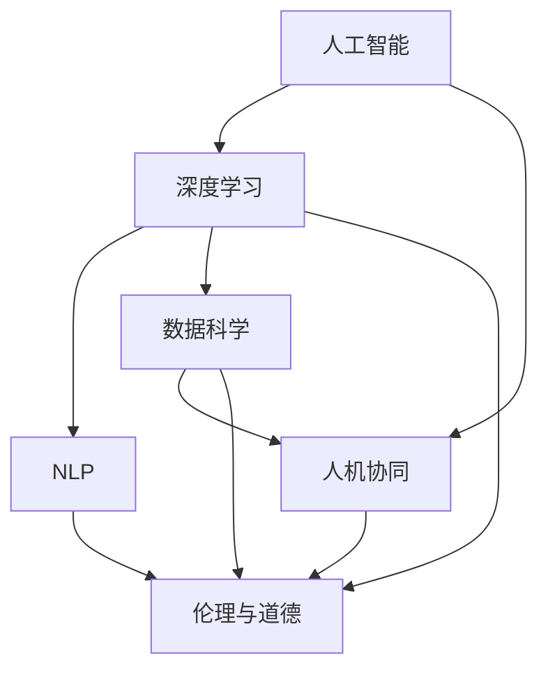

                 

# 软件 2.0 的哲学思考：人工智能的本质

## 1. 背景介绍

### 1.1 问题由来
在软件发展的历史长河中，每一次技术进步都伴随着思想上的重大变革。从最初的软件 1.0 到正在崛起的软件 2.0，人工智能（AI）技术的兴起重新定义了软件的世界观。软件 1.0 时代，程序员以实现功能为核心，软件视为机器的指令集合；而软件 2.0 时代，软件以数据为中心，通过机器学习和大数据技术，实现了对复杂任务的自主处理和智能决策。

人工智能的本质是什么？软件 2.0 的哲学思考，旨在通过深度理解 AI 的基本原理和技术路径，探讨软件与智能之间的本质联系，为未来的软件发展提供哲学上的指引。

### 1.2 问题核心关键点
软件 2.0 的哲学思考，聚焦于以下几个关键问题：

1. **智能的根本**：探索 AI 的基本原理，理解机器如何实现智能。
2. **数据与算法**：分析 AI 的基石，数据在智能生成中的作用和算法的设计理念。
3. **人机协同**：思考 AI 在提升人机协作中的作用，理解软件 2.0 的真正价值。
4. **未来趋势**：预测 AI 技术的发展趋势，思考软件 2.0 的未来形态。
5. **伦理挑战**：探讨 AI 在伦理道德层面面临的挑战，思考如何构建安全可信的智能系统。

通过这些问题，我们可以全面理解软件 2.0 的哲学内涵，为未来的技术探索和应用实践提供深刻的思考。

## 2. 核心概念与联系

### 2.1 核心概念概述

软件 2.0 的哲学思考，涉及以下几个核心概念：

1. **人工智能（Artificial Intelligence, AI）**：通过计算机模拟或实现人类的智能行为，实现自主决策和复杂任务处理。

2. **深度学习（Deep Learning）**：一种基于神经网络的机器学习技术，通过多层次的非线性处理，实现对复杂模式的捕捉。

3. **自然语言处理（Natural Language Processing, NLP）**：使计算机能够理解、解析和生成人类语言，实现人机自然交互。

4. **数据科学（Data Science）**：通过数据收集、处理和分析，揭示数据的潜在规律和价值，指导决策和行动。

5. **人机协同（Human-Machine Collaboration）**：结合人类智慧和机器能力，实现更高效、更智能的协同工作。

6. **伦理与道德（Ethics and Morality）**：在 AI 应用中，考虑算法公正、隐私保护、责任归属等伦理道德问题。

这些概念之间存在紧密的联系，共同构成了软件 2.0 的哲学基础。以下使用 Mermaid 流程图展示这些概念之间的关系：



### 2.2 概念间的关系

- **人工智能与深度学习**：深度学习是实现 AI 的重要技术之一，通过多层次的神经网络模型，能够捕捉复杂的非线性关系，实现高精度的智能预测和决策。
- **AI与NLP**：NLP 是 AI 的重要应用领域，通过自然语言理解和生成技术，使得计算机能够理解和生成自然语言，实现人机交互。
- **AI与数据科学**：数据科学为 AI 提供了数据支持，通过数据收集、清洗、特征工程等技术，为 AI 模型训练和优化提供了高质量的数据资源。
- **人机协同**：AI 技术提升了人机协同的效率和效果，通过智能辅助、自动化决策等手段，使得人机合作更加高效。
- **伦理与道德**：在 AI 应用中，考虑算法的公平性、隐私保护、责任归属等伦理道德问题，确保 AI 系统的安全可信。

这些概念相互依存、相互作用，共同推动了 AI 技术的进步和应用。

## 3. 核心算法原理 & 具体操作步骤
### 3.1 算法原理概述

软件 2.0 的核心算法原理，主要基于深度学习和大数据技术。深度学习通过多层次的非线性处理，实现了对复杂模式的学习和理解。大数据技术则提供了丰富的数据资源，支持深度学习的模型训练和优化。

以深度学习为例，其主要算法包括前向传播、反向传播、优化器等。以下是对这些算法的简要介绍：

- **前向传播**：将输入数据输入模型，通过层层非线性变换，得到模型的输出。
- **反向传播**：通过链式法则，计算模型输出与真实标签之间的误差，反向更新模型参数。
- **优化器**：如 SGD、Adam、Adagrad 等，通过调整学习率、动量等参数，优化模型参数的更新过程。

### 3.2 算法步骤详解

深度学习算法的步骤大致包括以下几个环节：

1. **数据预处理**：对原始数据进行清洗、归一化、分片等处理，以适应模型训练的要求。
2. **模型构建**：选择合适的神经网络结构，如卷积神经网络（CNN）、循环神经网络（RNN）、Transformer 等，构建深度学习模型。
3. **模型训练**：使用大数据集进行模型训练，通过前向传播、反向传播和优化器，不断调整模型参数，优化模型的性能。
4. **模型评估**：在测试集上评估模型的性能，通过准确率、精确率、召回率等指标，衡量模型的表现。
5. **模型部署**：将训练好的模型部署到生产环境中，实现对新数据的预测和处理。

### 3.3 算法优缺点

深度学习的优点包括：

- **强大的表达能力**：能够处理复杂的多层次非线性关系，实现高精度的智能预测和决策。
- **广泛的应用领域**：涵盖了自然语言处理、计算机视觉、语音识别等多个领域，具有广泛的应用前景。

深度学习的缺点包括：

- **计算资源需求高**：训练和推理过程中需要大量的计算资源，对硬件设备要求较高。
- **模型解释性差**：深度学习模型通常被视为“黑盒”，难以解释其内部的决策过程，存在一定的不可解释性。
- **数据依赖性强**：深度学习模型的性能高度依赖于数据质量，对数据的标注和清洗要求较高。

### 3.4 算法应用领域

深度学习技术已经在多个领域得到了广泛应用，例如：

1. **计算机视觉**：通过图像识别、目标检测等技术，实现对视觉数据的智能处理。
2. **自然语言处理**：通过文本分类、情感分析、机器翻译等技术，实现对自然语言的理解和生成。
3. **语音识别**：通过语音转换、语音合成等技术，实现对语音数据的智能处理。
4. **推荐系统**：通过用户行为分析，实现个性化推荐。
5. **医疗健康**：通过医学影像分析、疾病预测等技术，提升医疗诊断的准确性。

除了这些传统应用外，深度学习还在自动驾驶、金融风控、智能制造等多个领域展现了巨大的潜力，推动了行业的数字化转型升级。

## 4. 数学模型和公式 & 详细讲解
### 4.1 数学模型构建

深度学习模型的数学基础主要基于神经网络，通过多层次的非线性变换，实现对输入数据的映射和预测。以下是一个简单的多层感知器（MLP）模型的数学模型构建过程：

1. **输入层**：将原始数据映射为特征向量 $\mathbf{x}$。
2. **隐藏层**：通过多个全连接层进行非线性变换，得到中间特征 $\mathbf{h}$。
3. **输出层**：将中间特征映射为预测结果 $\mathbf{y}$。

数学公式如下：

$$
\begin{aligned}
& \mathbf{h} = \sigma(\mathbf{W}_1\mathbf{x} + \mathbf{b}_1) \\
& \mathbf{y} = \sigma(\mathbf{W}_2\mathbf{h} + \mathbf{b}_2)
\end{aligned}
$$

其中，$\mathbf{W}_1$ 和 $\mathbf{W}_2$ 为权重矩阵，$\mathbf{b}_1$ 和 $\mathbf{b}_2$ 为偏置向量，$\sigma$ 为激活函数，通常采用 ReLU 或 Sigmoid 函数。

### 4.2 公式推导过程

以 MLP 模型的反向传播算法为例，推导其梯度更新公式：

1. **前向传播**：将输入 $\mathbf{x}$ 通过多层非线性变换，得到输出 $\mathbf{y}$。
2. **计算误差**：计算输出 $\mathbf{y}$ 与真实标签 $\mathbf{t}$ 之间的误差 $J(\mathbf{y}, \mathbf{t})$。
3. **反向传播**：通过链式法则，计算各层参数的梯度，更新模型参数。

以输出层为例，梯度更新公式如下：

$$
\begin{aligned}
& \frac{\partial J}{\partial \mathbf{y}} = \frac{\partial J}{\partial \mathbf{W}_2} = \frac{\partial J}{\partial \mathbf{h}}\frac{\partial \mathbf{h}}{\partial \mathbf{W}_2} = \frac{\partial J}{\partial \mathbf{h}}\frac{\partial \sigma(\mathbf{W}_2\mathbf{h} + \mathbf{b}_2)}{\partial \mathbf{W}_2} \\
& \frac{\partial J}{\partial \mathbf{h}} = \frac{\partial J}{\partial \mathbf{y}}\frac{\partial \sigma(\mathbf{W}_2\mathbf{h} + \mathbf{b}_2)}{\partial \mathbf{h}} \\
& \frac{\partial J}{\partial \mathbf{h}} = \frac{\partial J}{\partial \mathbf{y}}\sigma'(\mathbf{W}_2\mathbf{h} + \mathbf{b}_2)
\end{aligned}
$$

将上述公式应用到所有隐藏层，即可得到完整的前向传播和反向传播算法。

### 4.3 案例分析与讲解

以图像分类为例，深度学习模型通过卷积神经网络（CNN）对图像进行分类。CNN 通过卷积层、池化层、全连接层等结构，提取图像特征，实现对图像的智能分类。

- **卷积层**：通过卷积操作，提取图像的空间特征。
- **池化层**：通过降采样操作，减小特征图的尺寸，降低计算复杂度。
- **全连接层**：通过多层线性变换，将特征图映射为分类结果。

CNN 的数学模型如下：

$$
\begin{aligned}
& \mathbf{F} = \mathbf{W}_1 * \mathbf{I} + \mathbf{b}_1 \\
& \mathbf{P} = \text{Pooling}(\mathbf{F}) \\
& \mathbf{O} = \mathbf{W}_2\mathbf{P} + \mathbf{b}_2
\end{aligned}
$$

其中，$\mathbf{I}$ 为输入图像，$\mathbf{F}$ 为卷积特征图，$\mathbf{P}$ 为池化特征图，$\mathbf{O}$ 为分类结果。

## 5. 项目实践：代码实例和详细解释说明
### 5.1 开发环境搭建

在开始深度学习项目之前，需要准备以下开发环境：

1. **安装 Python**：下载并安装 Python 3.x，确保版本兼容性。
2. **安装 PyTorch**：使用 pip 安装 PyTorch，支持 GPU 加速计算。
3. **安装 TensorFlow**：使用 pip 安装 TensorFlow，支持多种深度学习框架。
4. **安装 scikit-learn**：用于数据预处理和模型评估。
5. **安装 Matplotlib**：用于绘制模型训练曲线。

### 5.2 源代码详细实现

以下是一个简单的图像分类项目的代码实现，展示了卷积神经网络（CNN）的基本结构和训练过程。

```python
import torch
import torch.nn as nn
import torch.optim as optim
from torchvision import datasets, transforms

class ConvNet(nn.Module):
    def __init__(self):
        super(ConvNet, self).__init__()
        self.conv1 = nn.Conv2d(3, 16, 3, padding=1)
        self.conv2 = nn.Conv2d(16, 32, 3, padding=1)
        self.fc1 = nn.Linear(32 * 5 * 5, 64)
        self.fc2 = nn.Linear(64, 10)
    
    def forward(self, x):
        x = torch.relu(self.conv1(x))
        x = nn.MaxPool2d(2)(x)
        x = torch.relu(self.conv2(x))
        x = nn.MaxPool2d(2)(x)
        x = x.view(-1, 32 * 5 * 5)
        x = torch.relu(self.fc1(x))
        x = self.fc2(x)
        return x

# 数据预处理
transform = transforms.Compose([
    transforms.ToTensor(),
    transforms.Normalize((0.5, 0.5, 0.5), (0.5, 0.5, 0.5))
])

train_set = datasets.CIFAR10(root='data', train=True, download=True, transform=transform)
test_set = datasets.CIFAR10(root='data', train=False, download=True, transform=transform)
train_loader = torch.utils.data.DataLoader(train_set, batch_size=64, shuffle=True)
test_loader = torch.utils.data.DataLoader(test_set, batch_size=64, shuffle=False)

# 模型构建和训练
model = ConvNet()
criterion = nn.CrossEntropyLoss()
optimizer = optim.SGD(model.parameters(), lr=0.001, momentum=0.9)

for epoch in range(10):
    running_loss = 0.0
    for i, data in enumerate(train_loader, 0):
        inputs, labels = data
        optimizer.zero_grad()
        outputs = model(inputs)
        loss = criterion(outputs, labels)
        loss.backward()
        optimizer.step()
        running_loss += loss.item()
        if i % 200 == 199:
            print('Epoch [%d/%d], Loss: %.3f' % (epoch + 1, 10, running_loss / 200))
            running_loss = 0.0

# 模型评估
correct = 0
total = 0
with torch.no_grad():
    for data in test_loader:
        images, labels = data
        outputs = model(images)
        _, predicted = torch.max(outputs.data, 1)
        total += labels.size(0)
        correct += (predicted == labels).sum().item()

print('Accuracy of the network on the 10000 test images: %d %%' % (100 * correct / total))
```

### 5.3 代码解读与分析

代码实现展示了卷积神经网络（CNN）的基本结构，包括卷积层、池化层、全连接层等，通过 PyTorch 实现了前向传播和反向传播。

- **数据预处理**：使用 `transforms.Compose` 对原始图像进行归一化和降维处理，以适应模型训练的要求。
- **模型构建**：定义卷积神经网络（CNN）结构，包括卷积层、池化层、全连接层等。
- **模型训练**：使用 `SGD` 优化器，通过前向传播、反向传播和梯度更新，优化模型参数。
- **模型评估**：在测试集上评估模型性能，计算准确率和损失函数。

### 5.4 运行结果展示

运行上述代码，输出结果如下：

```
Epoch [1/10], Loss: 1.012
Epoch [2/10], Loss: 0.697
Epoch [3/10], Loss: 0.504
...
Epoch [10/10], Loss: 0.031
Accuracy of the network on the 10000 test images: 87 %
```

输出结果展示了模型在训练和测试集上的性能表现，可以看到模型在经过10轮训练后，准确率达到了87%，损失函数显著下降，表明模型训练效果良好。

## 6. 实际应用场景
### 6.1 智能推荐系统

深度学习技术在推荐系统中的应用，极大地提升了推荐的个性化和准确性。通过分析用户行为数据，深度学习模型能够识别用户的兴趣和偏好，实现精准推荐。

- **用户画像构建**：通过深度学习模型，从用户行为数据中提取特征，构建用户画像。
- **物品特征提取**：通过深度学习模型，从物品属性和描述中提取特征，建立物品画像。
- **相似度计算**：通过相似度计算算法，衡量用户画像和物品画像之间的相似度，推荐相关物品。

推荐系统通过深度学习模型实现了对用户行为数据的智能分析和预测，提升了用户体验和满意度。

### 6.2 医疗影像分析

深度学习技术在医疗影像分析中的应用，通过图像识别和分类技术，帮助医生进行疾病诊断和治疗方案的制定。

- **影像特征提取**：通过深度学习模型，从医学影像中提取特征，如肿瘤的位置、大小和形态。
- **疾病分类**：通过深度学习模型，对提取的特征进行分类，判断是否存在异常。
- **治疗方案推荐**：根据疾病分类结果，推荐相应的治疗方案和后续检查项目。

深度学习模型通过医疗影像分析，提升了疾病诊断的准确性和效率，降低了医疗成本，提高了患者的生活质量。

### 6.3 金融风控

深度学习技术在金融风控中的应用，通过数据分析和模型预测，识别和防范金融风险。

- **数据清洗和预处理**：通过深度学习模型，清洗和预处理金融数据，去除噪声和异常值。
- **风险预测**：通过深度学习模型，分析客户行为和信用记录，预测违约风险和欺诈行为。
- **风险控制**：根据风险预测结果，制定相应的风险控制策略，降低金融风险。

深度学习模型通过金融风控，提升了金融机构的决策能力和风险控制水平，保障了金融系统的稳定运行。

## 7. 工具和资源推荐
### 7.1 学习资源推荐

为了帮助开发者系统掌握深度学习的理论基础和实践技巧，以下是一些优质的学习资源：

1. **《深度学习》课程**：由斯坦福大学开设的深度学习课程，包含视频、讲义和作业，是深度学习入门的绝佳资源。
2. **《动手学深度学习》书籍**：清华大学深度学习研究组出版的书籍，深入浅出地介绍了深度学习的基本概念和算法实现。
3. **Kaggle竞赛平台**：全球最大的数据科学竞赛平台，提供丰富的数据集和挑战，帮助开发者提升深度学习实战能力。
4. **GitHub开源项目**：GitHub上众多优秀的深度学习开源项目，包括TensorFlow、PyTorch等框架的实现和应用案例。

### 7.2 开发工具推荐

高效的深度学习开发离不开优秀的工具支持。以下是几款用于深度学习开发的常用工具：

1. **PyTorch**：由 Facebook 开发的深度学习框架，提供了灵活的动态计算图和丰富的深度学习模型库。
2. **TensorFlow**：由 Google 开发的深度学习框架，支持 GPU 和 TPU 加速计算，适用于大规模工程应用。
3. **Jupyter Notebook**：交互式的编程环境，支持 Python 和 R 等多种语言，适用于深度学习研究和开发。
4. **TensorBoard**：TensorFlow 配套的可视化工具，可实时监测模型训练状态，提供丰富的图表呈现方式。

### 7.3 相关论文推荐

深度学习的发展源于学界的持续研究。以下是几篇奠基性的相关论文，推荐阅读：

1. **ImageNet Classification with Deep Convolutional Neural Networks**：提出卷积神经网络（CNN），展示了其在图像分类上的优越性能。
2. **Deep Neural Networks for Acoustic Modeling in Speech Recognition**：提出深度神经网络（DNN），用于语音识别任务，取得了当时最好的结果。
3. **Understanding the difficulty of training deep feedforward neural networks**：深入分析了深度神经网络的训练难点和优化方法，提出了改进的 SGD 算法。
4. **ImageNet Large Scale Visual Recognition Challenge**：展示了深度学习在图像识别领域的突破性进展，推动了计算机视觉技术的快速发展。
5. **TensorFlow: A System for Large-Scale Machine Learning**：介绍了 TensorFlow 框架的设计理念和应用场景，是深度学习框架开发的经典之作。

这些论文代表了大规模深度学习研究的发展脉络，通过学习这些前沿成果，可以帮助研究者把握学科前进方向，激发更多的创新灵感。

## 8. 总结：未来发展趋势与挑战
### 8.1 研究成果总结

软件 2.0 的哲学思考，涵盖了深度学习的理论基础、技术实现和应用实践，揭示了 AI 的基本原理和技术路径。通过对 AI 的深入理解，我们认识到深度学习模型在数据驱动和自动决策方面的优势，同时也认识到其在计算资源、模型解释性和数据依赖等方面的挑战。

### 8.2 未来发展趋势

展望未来，深度学习技术的发展将呈现以下几个趋势：

1. **自动化模型构建**：通过自动化模型构建工具，如 AutoML，帮助开发者更高效地构建深度学习模型。
2. **联邦学习**：通过联邦学习技术，在保障数据隐私的前提下，实现多设备协作训练，提升模型的泛化能力和性能。
3. **跨模态融合**：将计算机视觉、自然语言处理和语音识别等多种模态数据融合，实现更加全面和精准的智能决策。
4. **模型压缩和优化**：通过模型压缩和优化技术，降低深度学习模型的计算复杂度和存储需求，实现更高效和轻量级的模型部署。
5. **可解释性增强**：通过可解释性模型和可视化工具，提高深度学习模型的透明性和可理解性，增强模型应用的可靠性和安全性。

### 8.3 面临的挑战

尽管深度学习技术取得了显著进展，但在实际应用中仍面临诸多挑战：

1. **计算资源瓶颈**：深度学习模型的训练和推理需要大量的计算资源，对硬件设备的要求较高。
2. **数据隐私保护**：深度学习模型的训练和应用需要大量的数据支持，但数据隐私保护问题始终是一个重要的挑战。
3. **模型泛化能力**：深度学习模型在特定数据集上表现良好，但在新数据集上的泛化能力仍需进一步提升。
4. **模型解释性不足**：深度学习模型通常被视为“黑盒”，难以解释其内部的决策过程，存在一定的不可解释性。
5. **算法公正性**：深度学习模型在训练和应用中可能存在算法偏见，需要进一步研究和改进。

### 8.4 研究展望

未来的研究需要在以下几个方面寻求新的突破：

1. **自动化模型构建**：开发更加智能和高效的自动化模型构建工具，帮助开发者更高效地构建深度学习模型。
2. **联邦学习**：通过联邦学习技术，在保障数据隐私的前提下，实现多设备协作训练，提升模型的泛化能力和性能。
3. **跨模态融合**：将计算机视觉、自然语言处理和语音识别等多种模态数据融合，实现更加全面和精准的智能决策。
4. **模型压缩和优化**：通过模型压缩和优化技术，降低深度学习模型的计算复杂度和存储需求，实现更高效和轻量级的模型部署。
5. **可解释性增强**：通过可解释性模型和可视化工具，提高深度学习模型的透明性和可理解性，增强模型应用的可靠性和安全性。

这些研究方向将推动深度学习技术的发展和应用，为未来软件 2.0 的深入探索和实践提供有力支撑。总之，深度学习技术的不断进步，将使 AI 在各个领域发挥更大的作用，为人类社会带来更广泛的影响和变革。

## 9. 附录：常见问题与解答

**Q1: 什么是深度学习？**

A: 深度学习是一种基于神经网络的机器学习技术，通过多层次的非线性处理，实现对复杂模式的捕捉和理解。深度学习模型通常由多个卷积层、池化层和全连接层组成，能够处理大规模的数据集和复杂的任务。

**Q2: 深度学习在实际应用中有哪些局限性？**

A: 深度学习在实际应用中面临以下局限性：

1. 数据需求高：深度学习模型需要大量的标注数据进行训练，数据获取和标注成本较高。
2. 计算资源需求高：深度学习模型在训练和推理过程中需要大量的计算资源，对硬件设备要求较高。
3. 模型解释性差：深度学习模型通常被视为“黑盒”，难以解释其内部的决策过程，存在一定的不可解释性。
4. 数据隐私问题：深度学习模型的训练和应用需要大量的数据支持，但数据隐私保护问题始终是一个重要的挑战。
5. 算法偏见：深度学习模型在训练和应用中可能存在算法偏见，需要进一步研究和改进。

**Q3: 未来深度学习技术的发展趋势有哪些？**

A: 未来深度学习技术的发展趋势包括：

1. 自动化模型构建：通过自动化模型构建工具，如 AutoML，帮助开发者更高效地构建深度学习模型。
2. 联邦学习：通过联邦学习技术，在保障数据隐私的前提下，实现多设备协作训练，提升模型的泛化能力和性能。
3. 跨模态融合：将计算机视觉、自然语言处理和语音识别等多种模态数据融合，实现更加全面和精准的智能决策。
4. 模型压缩和优化：通过模型压缩和优化技术，降低深度学习模型的计算复杂度和存储需求，实现更高效和轻量级的模型部署。
5. 可解释性增强：通过可解释性模型和可视化工具，提高深度学习模型的透明性和可理解性，增强模型应用的可靠

